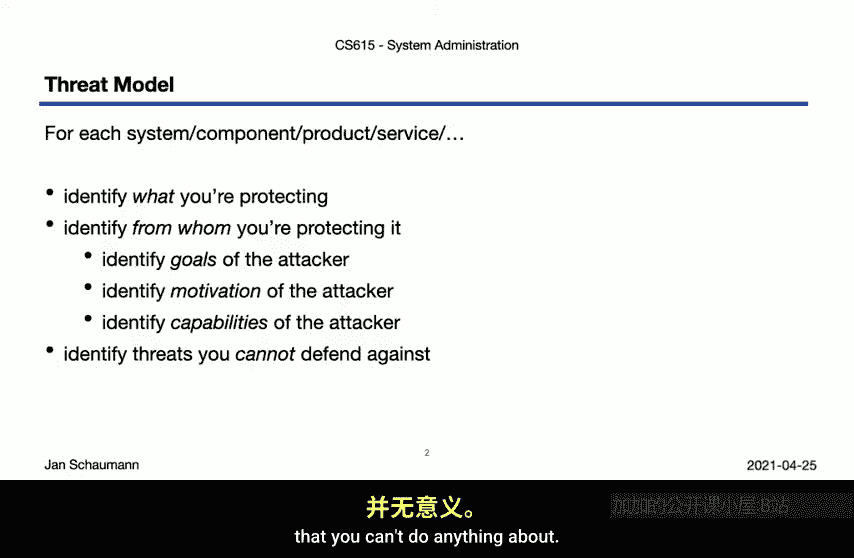
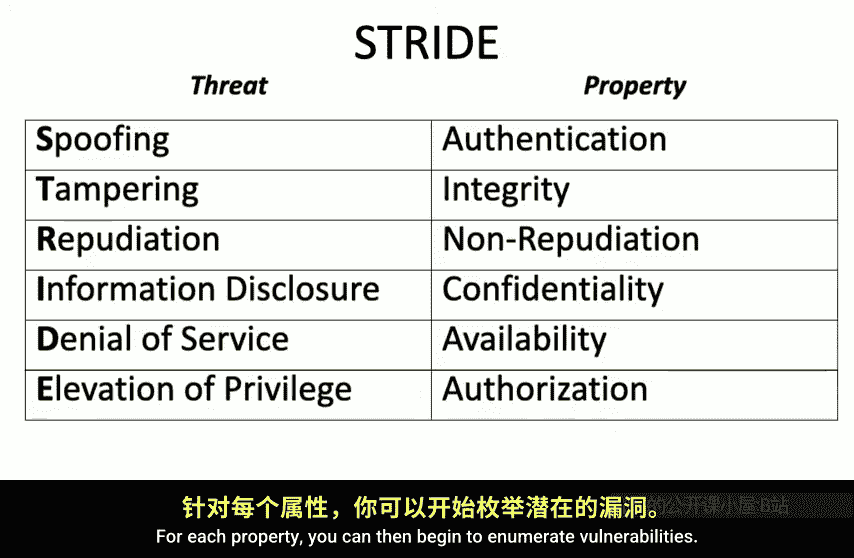
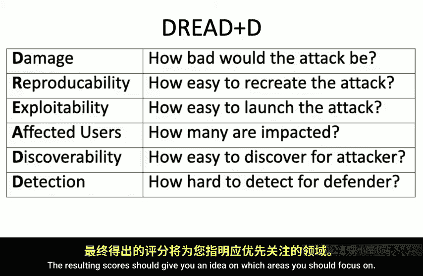
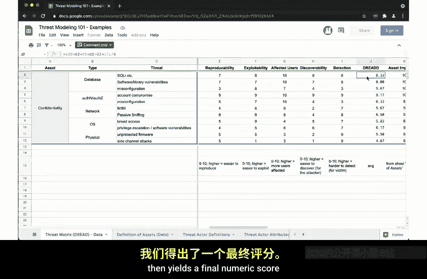
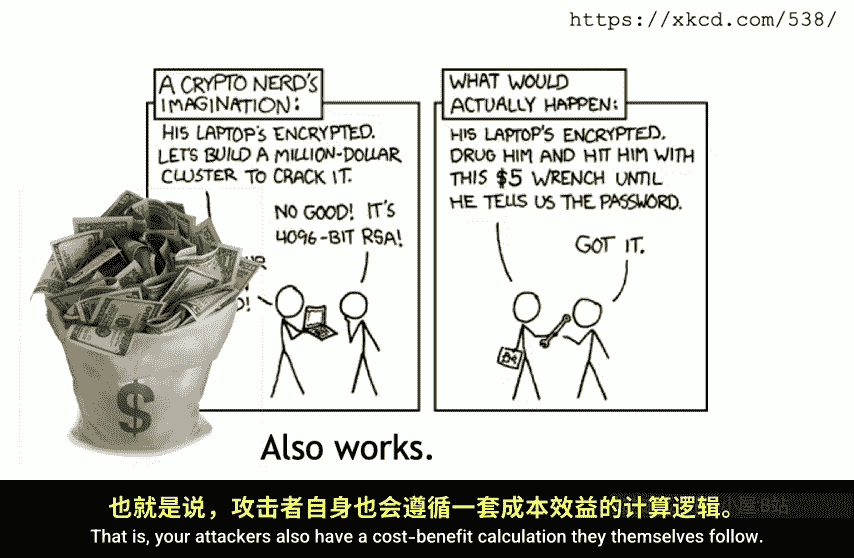
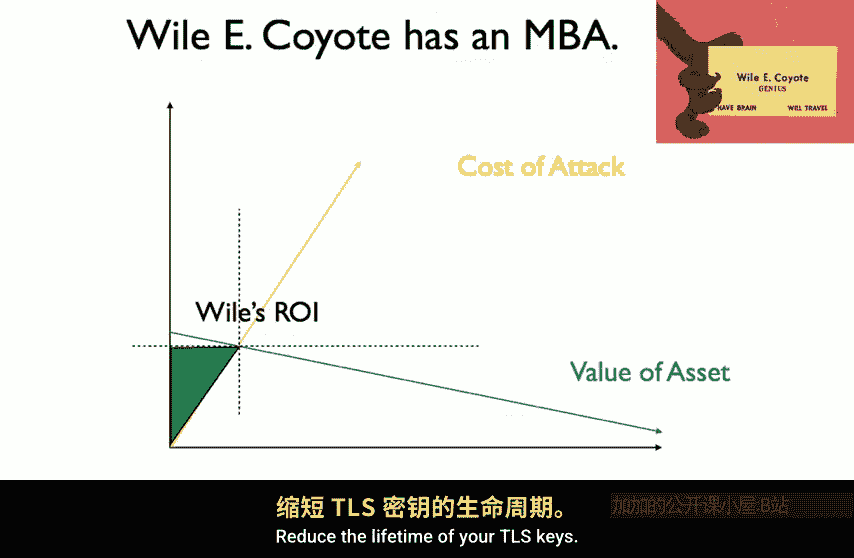
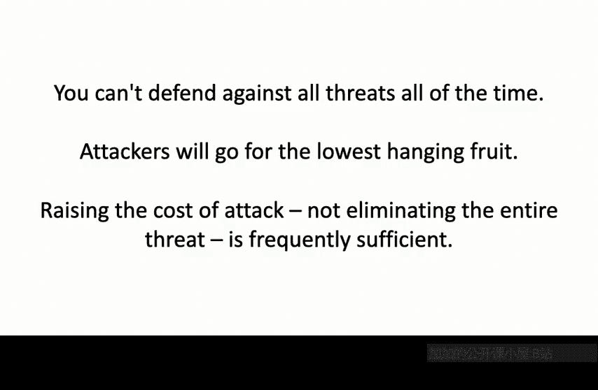

# 计算机系统管理：11.2：定义威胁模型 🔐

在本节课中，我们将学习如何定义威胁模型。这是系统安全风险评估的关键步骤，帮助我们明确需要保护什么、防范谁，以及如何有效地分配防御资源。

上一节我们介绍了风险评估的概念，并得出结论：与其追求绝对安全，不如进行现实的风险评估，识别并最小化特定风险。为了做到这一点，我们需要一个清晰的威胁模型。本节中，我们将探讨威胁模型的定义、形式化方法，并强调理解攻击者动机和能力的重要性。

## 识别保护对象与攻击者

与进行风险评估类似，构建威胁模型也需要从识别我们想要保护的具体资产开始。正如上次提到的，不同的资产会引导我们发现不同类型的威胁和漏洞。

然而，我们上次没有深入讨论的是：谁可能试图利用这些漏洞。这一点对于确定缓解策略至关重要。攻击者是具有特定目标的人类。攻击行为通常不是随机的，而是带有明确的意图和期望的结果。

不同的攻击者有不同的动机，更重要的是，他们执行攻击的能力也不同。一个受挫的青少年与一个拥有军事工业复合体支持的、训练有素专家团队的国家级攻击者，他们的目标和伤害能力截然不同。

这同时也意味着，有些威胁是你根本无法防御的，将资源浪费在无能为力的事情上是没有意义的。

## 威胁模型的核心：关注与能力

在这个背景下，可以参考James Mickens几年前在《Usenix ;login:》杂志上发表的一篇文章，它精炼地总结了威胁模型的概念。

*   如果你的担忧是前任伴侣入侵你的邮箱，那就更改密码。
*   如果你的担忧是犯罪分子试图接管你的账户，那就不要点击邮件中的链接，并在不使用密码管理器或多因素认证的情况下登录网站。
*   但如果你面对的是一个有能力和动机的情报机构，那么你很可能无法保护自己。

当然，这听起来有些悲观。对于系统管理员和信息安全行业从业者来说，我们确实有兴趣防御此类对手。因此，我们需要一个比“密码和魔法护身符”更正式的方法来定义威胁建模过程。

## 形式化威胁建模：交集与接受风险

让我们来分解这个过程。首先，我们识别已知的可能威胁。然后，我们需要确定我们真正关心哪些威胁。例如，我们可能并不关心硬件的物理价值。如果一个小偷偷走了服务器，我们并不太在意硬件的金钱损失，我们主要关心的是数据。

接下来，有些威胁是我们能够防御的。这部分很关键。我们必须诚实地评估自己的防御能力。例如，当将硬件管理外包给亚马逊EC2时，我们理解一个强大的对手可能通过法律手段迫使亚马逊在我们的虚拟机运行的虚拟机管理程序中安装后门。但鉴于我们当前的能力和基础设施需求，我们默认接受了这个无法防御的威胁。

接受某些威胁超出我们的防御范围，并不意味着举手投降，而是保持现实，决定不将时间和金钱浪费在最终徒劳的努力上。

因此，我们从这些“圆圈”中构建出我们决定防御的威胁交集。这个交集是“所有已知威胁”与“我们关心的威胁”以及“我们能防御的威胁”的交集。

这意味着，会存在一些我们知道但不关心的威胁，或者一些我们不知道但即使知道了也不关心的威胁。在这些情况下，由于我们已将它们置于威胁模型之外，所以不成问题。

那些我们知道、关心但决定不采取任何措施的威胁，通常被称为**接受的风险**。你理解存在风险，但愿意承担它。有时这个决定是被迫的，因为你无法防御，就像前面提到的EC2虚拟机硬件被入侵的例子。

总的来说，威胁建模练习的目标是尽可能扩大这个交集。你应该小心，不要将时间和精力浪费在你无论如何都无法防御的威胁上，尤其是当你甚至不关心某个特定威胁时。当然，最大的问题是存在一些你不知道的威胁。特别是那些如果你知道本可以防御的威胁，处理起来尤其困难。因此，作为系统管理员，持续关注行业和信息安全领域的发展至关重要。

## 使用STRIDE模型枚举威胁

但以上内容仍然很抽象。让我们看一个更正式的模型，它可以帮助你识别不同的威胁。其中一个模型是**STRIDE**，它将特定威胁按类别映射到给定的系统属性。

以下是STRIDE模型的映射关系：

*   **Spoofing（伪装）**：针对**真实性**属性的威胁。
*   **Tampering（篡改）**：针对**完整性**属性的威胁。
*   **Repudiation（抵赖）**：针对**不可否认性**属性的威胁。
*   **Information Disclosure（信息泄露）**：针对**机密性**属性的威胁。
*   **Denial of Service（拒绝服务）**：针对**可用性**属性的威胁。
*   **Elevation of Privilege（权限提升）**：针对**授权**属性的威胁。

对于每个属性，你可以开始枚举漏洞。你可以将数据模型分解为不同的属性，并识别针对机密性属性的威胁可能出现在哪里。每个领域都可以进一步细分，以识别更具体的威胁。可以根据需要在每一层上增加细节，直到绘制出所有可能出错事项的清晰图表。

因此，STRIDE允许我们在不同系统组件之间进行缩放，而不会陷入试图保护所有东西的困境。但在这个阶段，我们只是在枚举威胁。我们如何确定应该关注哪些呢？

## 使用DREAD方法进行优先级排序

为此，我们可以使用**DREAD**方法。是的，极客们喜欢首字母缩写词，这并不奇怪。

DREAD允许你通过回答以下问题，为每个威胁分配一个数值：

*   **Damage（损害）**：攻击成功会造成多大损害？
*   **Reproducibility（可复现性）**：攻击是否容易复现？
*   **Exploitability（可利用性）**：发动攻击有多容易？
*   **Affected users（受影响用户）**：有多少用户会受到影响？
*   **Discoverability（可发现性）**：漏洞有多容易被发现？

有些人还喜欢添加另一个因素：检测给定入侵的难度。然后，你可以根据这些因素以及资产的价值为每个漏洞分配数值。例如，为每个因素分配一个1到10之间的数字，计算DREAD分数的平均值，再乘以资产价值。得到的分数可以让你了解应该优先关注哪些领域。

## 实践示例：整合资产、威胁与攻击者

以下是一个DREAD电子表格的示例。我们首先在完整性和机密性类别中定义资产，识别不同的信任边界，并为它们分配一个数字重要性。这可以帮助我们确定防御的优先级。

我们还会遍历可能的威胁行为者列表，这有助于澄清对手可能具有的不同目标以及他们常用的方法。每个威胁行为者都有一系列附加属性，帮助我们明确他们可能具备的能力以及他们可能采取的行动。

在完成所有这些定义后，我们使用左侧的DREAD方法来逐项列出单个威胁，然后为损害、可复现性、可利用性等每一项分配数值。将这些数字平均后乘以资产重要性，就得到了最终的数字分数。

这个分数告诉我们，当前最需要关注的关键防御领域是SQL注入、库漏洞和账户泄露。

## 攻击者的视角：成本与收益

当然，关于威胁模型的讨论离不开引用这张XKCD漫画。它精辟地指出，有些威胁你无法很好地防范。强加密只对加密攻击有效，动机足够强烈的攻击者会找到系统中最薄弱的部分——通常是人为因素——并攻击那里。

顺便说一下，人为因素不仅容易受到实际的身体暴力攻击，提供大笔金钱也容易导致账户泄露。采用哪种方法再次取决于具体的攻击者。这是攻击者会寻找“最低垂果实”的另一个例子。攻击者会继续使用最便宜、最有效的攻击方法，直到它不再有效。

如果攻击者可以通过一些简单的PHP或SQL代码注入来入侵你的基础设施，没有人会去使用一个价值百万美元的零日漏洞。也就是说，你的攻击者也在遵循他们自己的成本效益计算。他们也有损失，并且会在他们的道德和经济框架内理性行事。

只要攻击者从某个攻击角度或向量中获得的收益大于其成本，他们就会继续追求它。他们在漏洞利用上花费的时间和精力越多，他们继续使用它的可能性就越小。

## 提高防御有效性的策略

那么，一种对你有利的转变方式是**提高攻击成本**，使他们更难进入系统。例如，多因素认证显著提高了攻击成本。

但还有另一件事可以做，而我们常常忘记：**降低资产价值**。匿名化用户数据、在一定时间后删除用户的私人数据、使认证令牌或密钥材料过期、缩短密钥的生命周期——所有这些都非常有效。

## 总结威胁建模流程

总结我们的威胁建模流程：

1.  **识别资产并分配价值**：这些价值在很大程度上可以是任意的，但你应该在组织内部保持一致，并大致按比例分配。在我的例子中，我选择了0到10的数字。如果需要更细的粒度，可以使用更大的范围。
2.  **努力识别威胁并使用DREAD方法得出威胁分数**：如果你在使用这些数字时保持一致，就会得到一个按优先级排序的、简洁的列表，告诉你防御工作的重点。

现在，威胁建模最困难的部分是保持专注。正如我们在示例中看到的，你可以在各个组件之间进行缩放。虽然你经常用抽象术语概述威胁模型，但在将其转化为具体建议时，可能需要深入细节。

当你尝试执行这些评估时，请记住，你无法同时防御所有威胁。要确定优先级并选择你的战场。记住，攻击者总是会寻找“最低垂果实”，不要试图在所有地方都追求完美的安全性，而是先“止血”，专注于重要的事情。

**提高攻击成本，而不是消除整个威胁**，通常就足够了，因为你的对手也是人。他们在追求目标时会做出理性决策。理解他们的目标和目的，你就能更好地集中你的防御。

好的，我想这大致涵盖了我们对威胁建模概念的快速介绍。现在，在我们的工具箱中有了这个概念，我们将在下一个视频中探讨信息安全的几个核心原则。我们将讨论零信任模型，并看看密码学如何帮助我们提高攻击成本。

下次见，感谢观看。