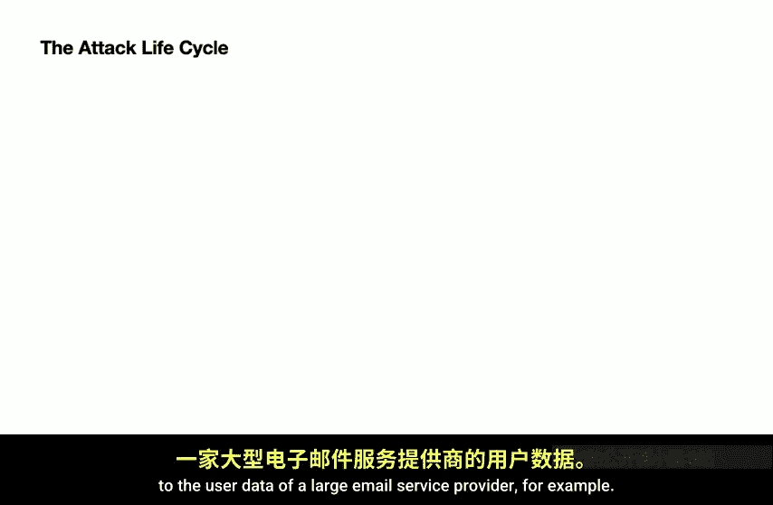
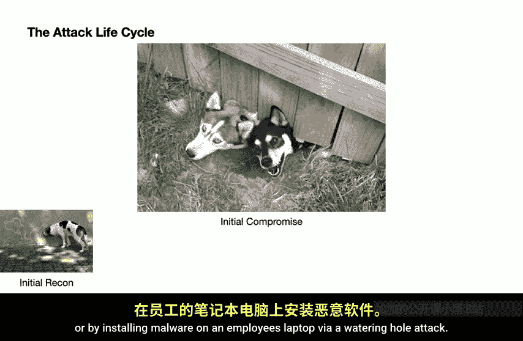
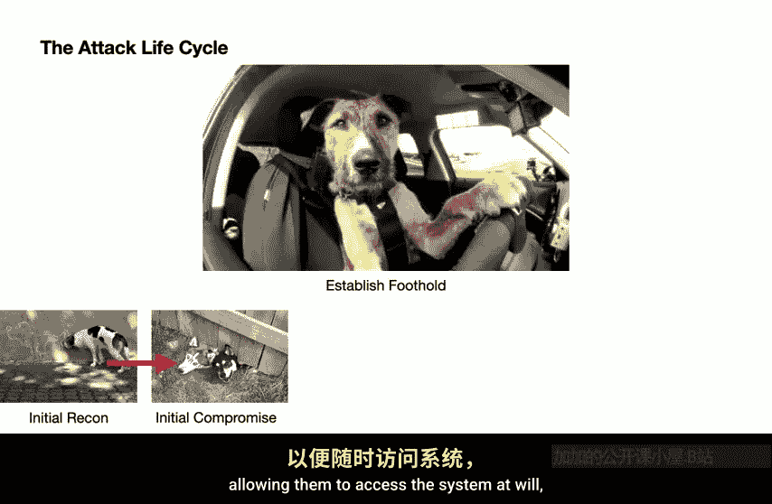
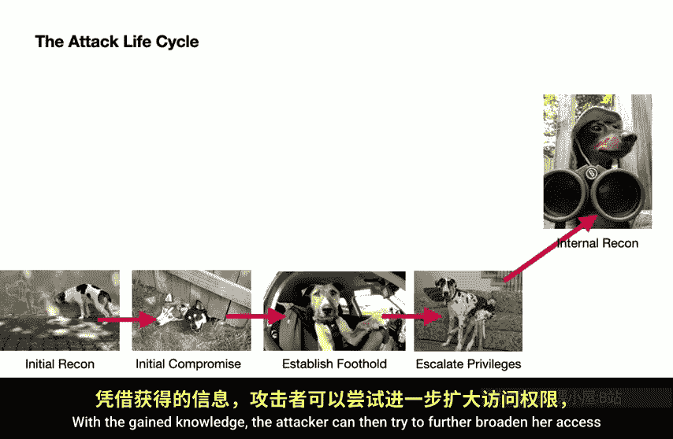
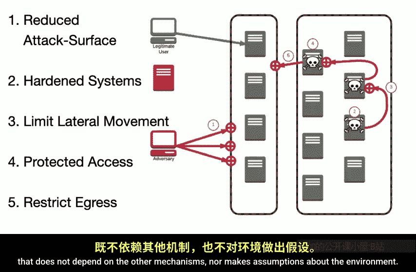
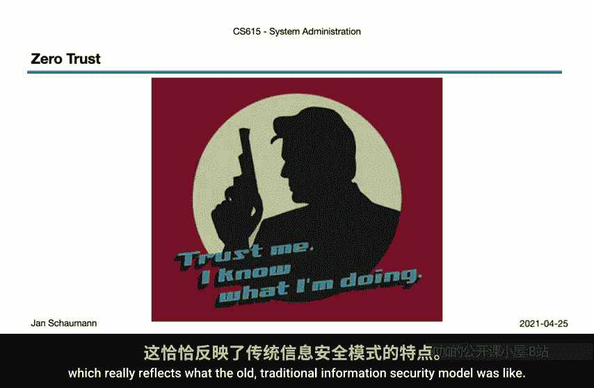
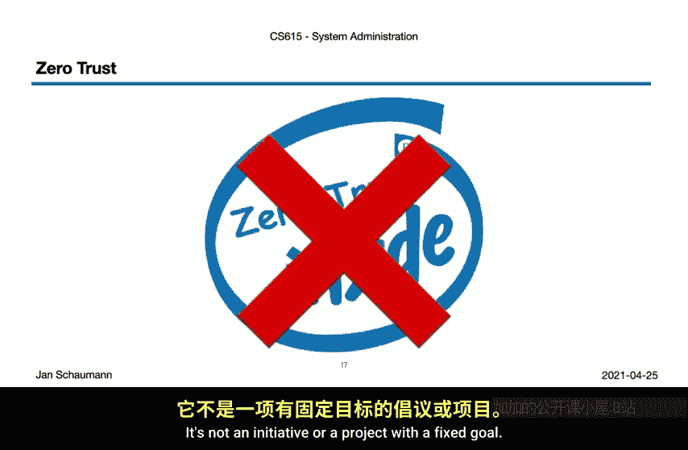
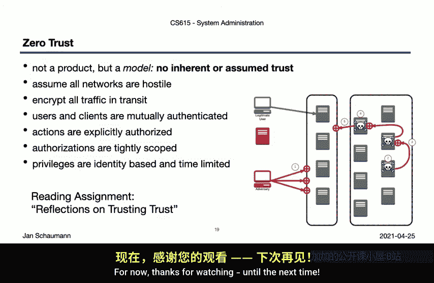

# 史蒂文斯理工学院【中英⚡计算机系统管理｜CS615 2021 System Administration】 p48 p47 Week 11, Segment 3 - System Security： Attack Life Cycle to Zero Trust -BV11QQcYmEzD_p48-

Hello and welcome back to CS615 System Administration。This is week 11 segment 3。

 and we continue our discussion of system security concepts。In our first video on this series。

 we've covered in somewhat broad strokes how to perform a risk assessment。 In our last video。

 we talked about how to develop a threat model。 And to keep in mind the attacker's point of view。

 motivation and capabilities。With that in mind， we'll now take a look at the common processes。

 our adversaries will follow in their goal to compromise our systems so that we may then develop a conceptual model of how to defend against these。

Note that this will not be a tag vector specific。 We don't need to discuss whether an attacker might try to compromise our assistance by phishing some employee credentials。

 or if they will use a code injection attack because an internal application doesn't validate the input。

 These two are practically given anyway。 But rather。

 we once again try to go one level higher and consider the common sequence of the attack lifecycl and how that influences our defenses leading us to a phrase you may have heard used to lot the information security domain recently。

0 trust。One of the core principles in system security is that we require what is known as defense and depth。

That is， we don't just employ a single defensive mechanism and call it a day。Instead。

 we apply different protective and detective controls and multiple different layers in a belt and suspender' kind of approach。

We want to be sure that no one layer assumes that the other protects it。

Or that any one mechanism is sufficient。This aligns well with our concept of a risk assessment and threat model。

 where we identified different components all across our environment that may face different threats and thus require different protections。

Furthermore， we never assume that whatever protection we do deploy will be 100% bulletproof。

You should always operate under the assumption that your protection mechanism can be compromised or circumvented。

 and then what。Defense and depth helps us minimize the impact of such a compromise。

 and this concept of employing protections in multiple layers leads us towards the zero trust model we'll discuss in more detail in just a minute。

But so where exactly do we need to implement our defenses？

To make an informed decision about the value of your protections it best to understand the path your adversaries may take when they stage an attack。

After all， as we discussed in our last video， our attackers are dedicated humans with specific objectives。

 so we'll follow a logical path towards their end goal。This is known as the attack life cycle。

 a sequence of processes and procedures that time and again may have observed to be followed by necessity for any major targeted attack。

Now note that I'm explicitly mentioning targeted attack here since of course。

 some opportunistic attackers may jump into the attack lifecycl on any stage， but by and large。

 our attackers do follow the path we'll outline here。

So suppose you're anteer and you want to gain access to a specific asset。

Let's say you want to gain access to the user data of a large email service provider， for example。

 where do you start。

Well， the first step is， of course， to learn about your target to， for example。

 perform network scans， identify the software used and exposed， probe for known vulnerabilities。

 and in general， gather any and all data about the systems， company operations。

 as well as the people。In addition， the stage also includes collecting information about the people who work in the target organization。

 their positions， their access， their routines。After that， we move on to the initial compromise here。

 our attackers will identify and exploit the vulnerability that allows them to gain access to some systems。

This can take the form of triggering a remote code execution by way of a weakness in the library known to be used on the target systems。

 or it may involve tricking an employee into revealing their access credentials by way of ph or by installing malware on an employee laptop via a watering hole attack。

Once a way into the system is found， the attackers have to find a way to keep their access。

 to keep the system compromised。Typically， they will install a persistent back door。

 allowing them to access the system and will without relying on the exploit they may have used initially。

But the initial compromise usually does not give the attacker access to the data they really are after。

And often does not yield sufficient privileges to accomplish the objective。

 nor even to move within the infrastructure organization。

So the attackers will typically attempt to gain elevated privileges。In practical terms。

 consider a vulnerability and say PhHP， whereby an attacker gained access to the web server as nobody。

 the Unix user running the HTP server。In order to access a private database on the system or to gain access to a private key protected by Unis permissions。

 the attacker would try to chain an additional local privilege escalation vulnerability to become root。

Another example of escalating privileges might be to install a keylo on an nonplayviss laptop to gain access to the password used to authenticate to another system。

Now， even with elevated privileges， it's rare that Na attacker manages to immediately compromise the final target。

Think of the way that a web application might work。

 the web server exposed to the internet may not have access to an internal data store or the end user the database you're after。

But the server may have access to a server that contains access credentials to reach into the database。

In the first step， initial reconnaissance， the attacker collected all the information she could get from the outside。

 but now she has to identify the next step， the next target on the way to the final objective。Hence。

 she will perform internal renaissance。 again， perhaps scanning the network now from the initially compromised host。

 with possibly elevated access。Identifies the systems of interest。 Oh， look。

 a C ICD service that's able to build and deploy software to all systems， interesting。

Or collects access credentials。With the gained knowledge。

 the attacker can then try to further broaden her access。

And often does hop from one system to the next， repeating the previous steps in order to further elevate privileges as needed。

That is， while repeating some of the steps， the attacker has to be careful to continue to maintain their presence and elevated privileges。

A few more times in this loop here before they finally accomplished their mission。

And get to the beef steakak。 I mean， end user data they were after。

And so our complete attack life cycle looks like this。Now， granted。

 you don't always get to have it illustrated with all these good dogs here， but hey。

 that's one of the benefits of taking this class。 Theyre all good dogs。Perhaps more professionally。

 but distinctly less amusingly illustrated。 the tech life cycle looks like this。Initial recon。

 possibly identifying targets。Initial compromise， followed by lateral movement until the attacker reaches their intended goal and begins to exfiltrate data。

Now what's useful about understanding this attack life cycle is that it breaks down so neatly into individual stages。

 which then allows you to better identify specific defenses。

Rather than trying to secure all the things， you can now think about how you can disrupt the attack life cycle at each stage。

This is what that might look like then in order to disrupt the initial recon。

 you try to reduce your attack surface， limit what systems are exposed， for example。

To disrupt the initial compromise， you'd harden specific systems and libraries to disrupt the lateral movement of an attacker。

 you might restrict what systems can talk to what other systems。

As well as protect the assets with appropriate authentication and authorization controls。

 while also disrupting the data exfiltration with additional egress controls。

Note how each of these is an independent stage with its own protections that does not depend on the other mechanisms。

 nor makes assumptions about the environment。

Which gets us to the concept of zero trust。Zro trustt is currently a big buzzword in the industry。

 and I'm always happy to use it an excuse to reference an old TV show none of you is old enough to remember。

 but that's okay。I don't even remember whether sledgehammer actually was a good show。

 But so there's this insane cop with a slogan。 Trust me。 I know what I'm doing。

 which really reflects what the old traditional information security model was like。

That is in the old world， it was turtles all the way down。

 a hard shell protecting squishy and turtles。Once you passed the perimeter。

 you were in applications trusted you。 You could freely move around the network。

 access services without authentication and the like。

This model is now being obsoleted by the concept of zero trust networks。

 a world where a given network position does not infer inherent trust upon you。

Different people would interpret zero trust to mean different things。And for many。

 it refers to the work done by Google around 2009 and there are beyond core papers。

 which are an implementation of the zero trust security model， but not quite the same as that。

And while zero trust is a buzzword in the industry。

 and many vendors try to sell you solutions that will turn the environment into zero trust just like that。

I'm afraid zero trust is not a product。 You can't buy yourself a zero trust。

You can't deploy as your trust。 It's not an initiative or a project with a fixed goal。

Instead，0 trust the core concept， similar to defence and depth。

 these privileges faila or Krkov's principle。Here it is the simple assumption of a compromised or hostile environment。

That's it。I no it doesn't sound like much and doesn't even sound novel。

 but what follows does overthrow a few decades of operational practices。

It means you can drive and measure very specific initiatives。If we assume all networks to be hostile。

Then we necessarily require transport encryption for all traffic。

Operating in a hostile environment requires that clients authenticate the services they talk to。

 just as services need to authenticate the clients connecting to them。

 Mutual authentication becomes mandatory。But authentication by itself is not sufficient。

 Authenticated clients require explicit authorization to be allowed to perform actions。

 and authorization needs to always be limited to the least privilege required。

So you need to integrate a granular abic system， for example。

Because we assume our adversaries to be persistent and thus could compromise a previously trusted account or system。

 Any trust once established。Needs to be renewed periodically。

 and any actions need to be lo to ensure a complete audit trail。

This is a system's access capabilities derives explicitly from its identity。

Such that its access can be audited， extended， restricted or revoked。

 and is not inherited implicitly from any specific physical or logical position within the network。

Now， building a P K I， developing suitable R back， monitoring foreign and enforcing mutual art and encryption only lay a 7 as well as below。

 sounds like a lot of work。 And it is。 It'll take you years to move your old infrastructure into this new world。

But it's not only a clear security one。 Ze trust enables identity based deployment of services with automated access controls and capabilities the time of birth and lets you ditch manual configuration or high risk broad network manipulation。

And you can get there incrementally。All of these rules and enable you to specifically disrupt each of the stages of the attack lifecycl。

And somewhat paradoxically， you can actually make certain counterintuitive access decisions and for example。

 allow connections to internal services from the internet because you treat your internal network as equally untrusted as the internet。

You can deploy services without having to think about which security zone or what network they have to go into。

 and you still are assured that lateral movement is restricted because everything requires explicit authentication and authorization。

But you only get the benefits if you don't think of it as a single thing， a one time effort。

 a product， a temporary industry trend， a buzzword。Instead， accepted as a mindset， a principle。

 a core concept。In simple， the environment is assumed hostile。 the rest follows。And with that。

 I'm going to leave you just one additional reading assignment for today。

Ken Thompson's reflections on trusting trust， a talk he gave when he accepted his touring award and which illustrates the necessity of deploying multiple layers or protections and the difficulty of proving trust。

The link to this talk is in the slides， but you will quickly find it by using a favorite internet search engine as well。

It has been almost 40 years since he gave this talk， but it remains a seminar paper and discussion。

 so please do make sure to read it。We'll pick this up in our next video for now。

 thanks for watching until the next time， yes。

