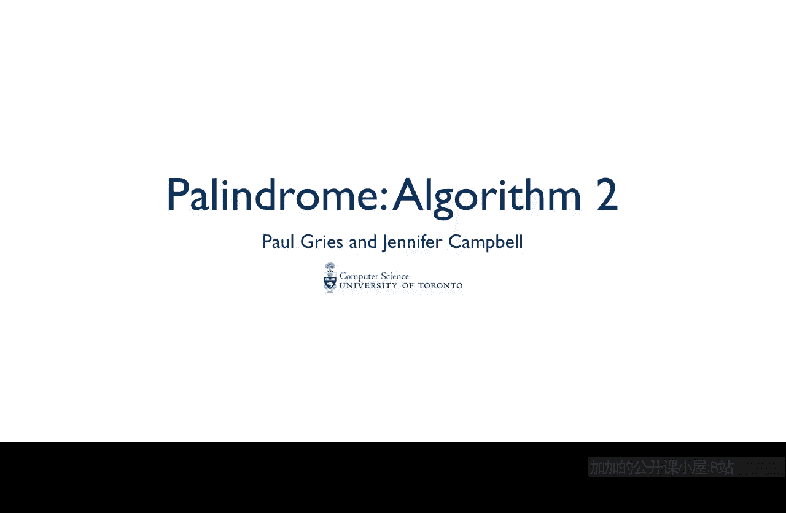
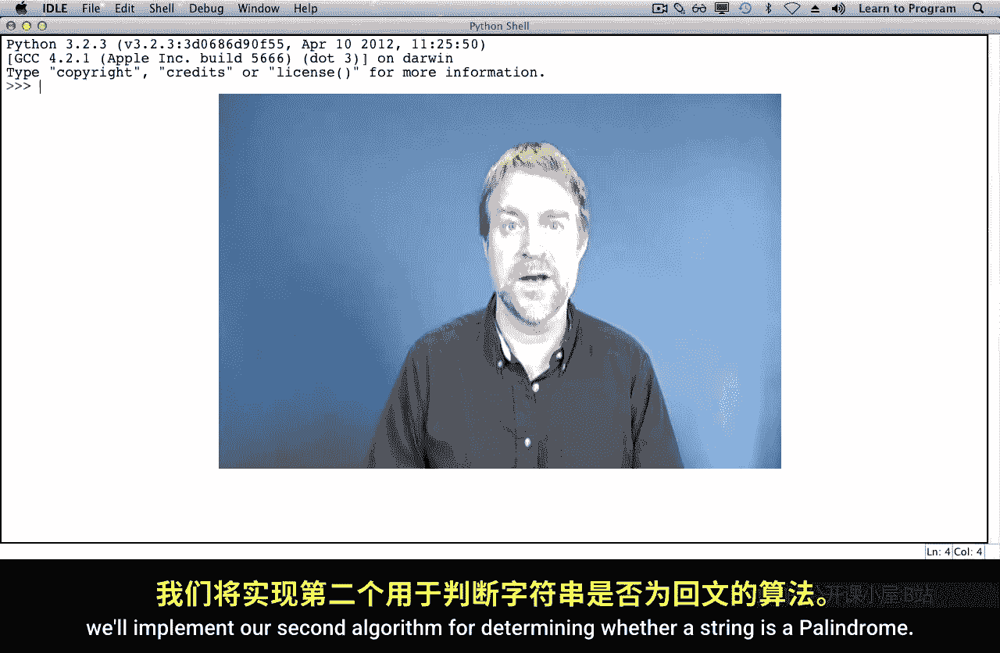
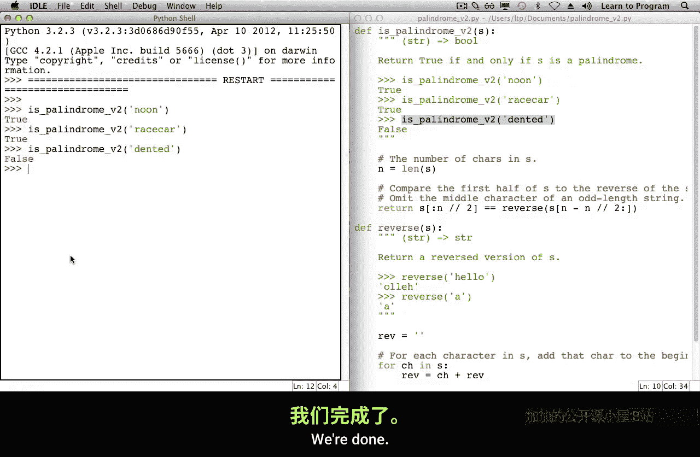

# 003：回文算法-2





在本节课中，我们将实现第二个算法，用于判断一个字符串是否为回文。

上一节我们介绍了第一种回文检测算法，本节中我们来看看第二种实现思路。

## 算法思路

第二种算法的核心思想是：将字符串分成两半，反转后半部分，然后将其与前半部分进行比较。同样，我们需要反转字符串，因此我们将复用上一节中的反转函数。

以下是该算法的具体步骤：

1.  计算字符串长度。
2.  将字符串分为前半部分和后半部分。
3.  反转后半部分字符串。
4.  比较前半部分与反转后的后半部分是否相等。

## 处理索引与切片

为了正确分割字符串，我们需要仔细处理索引。以下是几个关键的计算公式：

*   前半部分的结束索引（不包含该索引的字符）为：`len(s) // 2`
*   后半部分的起始索引为：`len(s) - len(s) // 2`

对于偶数长度的字符串（如 “noon”），分割是直接的。对于奇数长度的字符串（如 “race car”），中间字符（如 ‘e’）会被排除在比较之外，这正是我们期望的。

## 代码实现

以下是完整的算法实现代码。为了代码清晰，我们先将字符串长度存储在一个变量中。

```python
def reverse(s):
    """返回字符串s的反转。"""
    rev = ''
    for ch in s:
        rev = ch + rev
    return rev

def is_palindrome_v2(s):
    """（版本2）如果s是回文则返回True，否则返回False。"""
    # 字符串前半部分的结束索引
    n = len(s)
    mid = n // 2
    # 前半部分：s[0:mid]
    # 后半部分：s[n - mid:]
    first_half = s[:mid]
    second_half = s[n - mid:]
    # 比较前半部分与反转后的后半部分
    return first_half == reverse(second_half)
```

## 测试验证

现在，让我们测试几个例子来验证算法的正确性。

```python
# 测试偶数长度回文
print(is_palindrome_v2('noon'))  # 预期输出：True

# 测试奇数长度回文（忽略中间字符）
print(is_palindrome_v2('racecar'))  # 预期输出：True

# 测试非回文
print(is_palindrome_v2('dented'))  # 预期输出：False
```

测试结果符合预期，说明我们的算法实现正确。



本节课中我们一起学习了第二种回文检测算法。我们通过精确计算索引来分割字符串，并复用反转函数，最终通过比较前半部分与反转后的后半部分来判断字符串是否为回文。这种方法逻辑清晰，是解决回文问题的另一种有效思路。