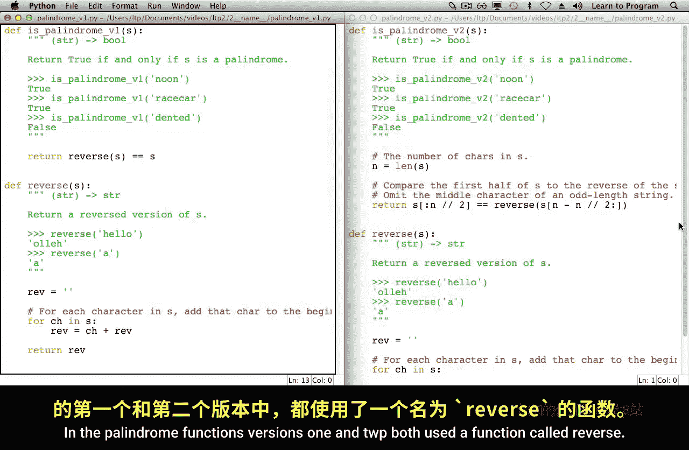
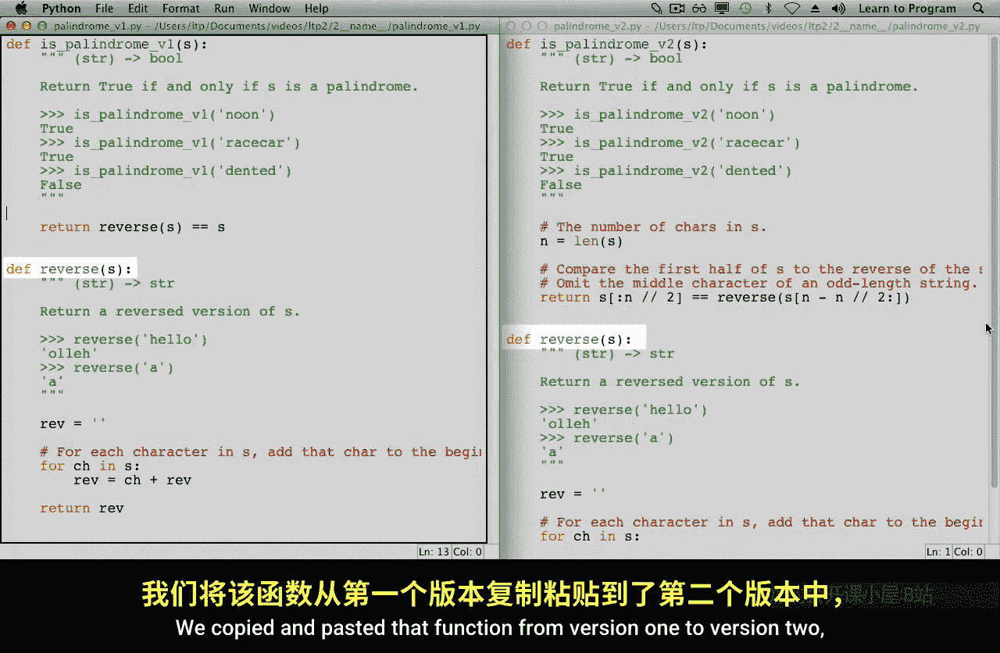
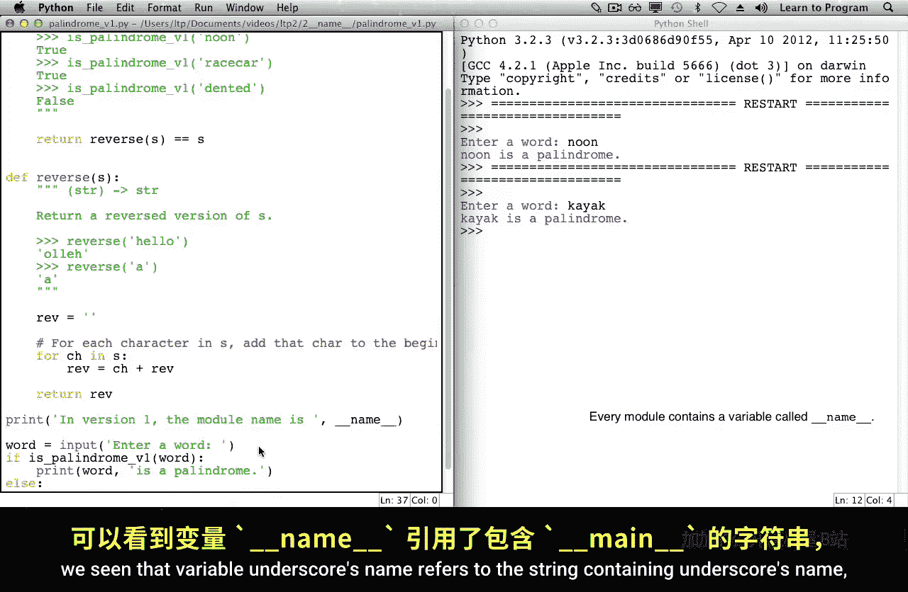
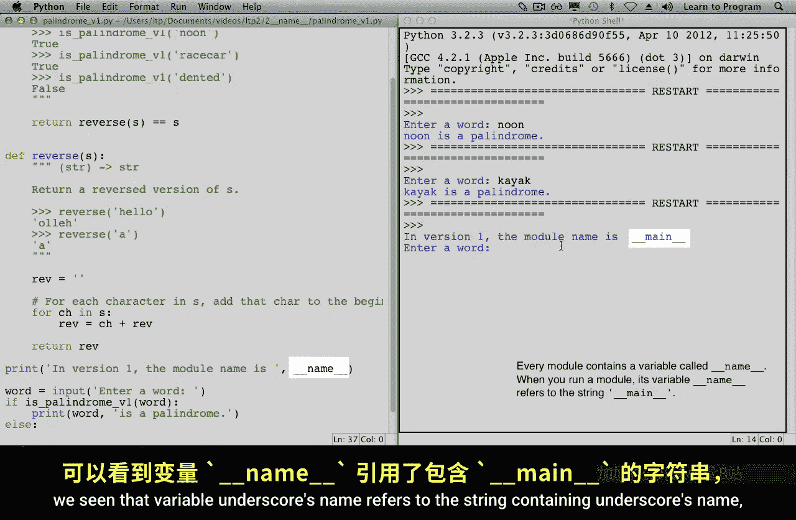
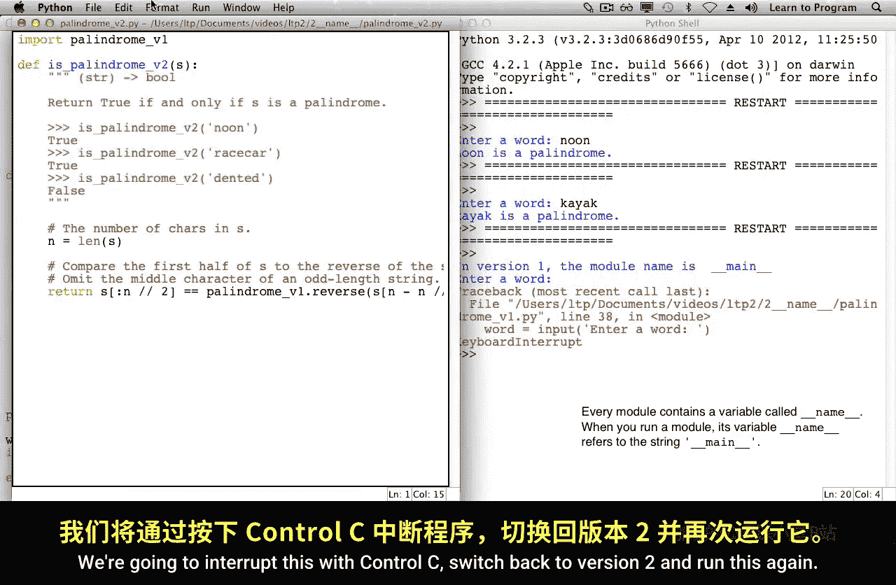
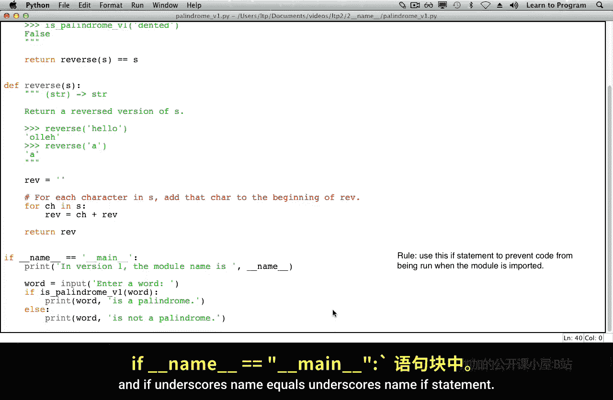

# 009：编写主程序 🚀

在本节课中，我们将学习如何组织Python程序的主执行部分，特别是如何避免在导入模块时执行不必要的代码。我们将通过一个回文检测程序的例子，演示如何正确使用 `if __name__ == "__main__":` 结构来区分模块是被直接运行还是被导入。

## 导入模块的执行行为





导入一个模块会执行该模块中的所有代码。这通常是期望的行为，特别是当模块包含函数定义时。然而，如果模块中还包含其他代码（例如，直接调用 `input()` 或 `print()` 的语句），则可能在导入时产生意外的行为。

## 问题演示：代码重复与意外执行

在我们的回文检测程序中，版本1和版本2都使用了一个名为 `reverse` 的函数。最初，我们将这个函数从版本1复制粘贴到了版本2，但这导致了代码重复。如果我们在 `reverse` 函数中发现错误，就必须在两个地方都进行修复，这显然不是一个好的做法。

更好的解决方案是让版本2导入版本1中的 `reverse` 函数。但在实现之前，让我们先在版本1的底部添加一些代码，要求用户输入一个单词并报告它是否是回文。

```python
# 版本1底部添加的代码示例
word = input("请输入一个单词: ")
if is_palindrome_v1(word):
    print(f"'{word}' 是回文。")
else:
    print(f"'{word}' 不是回文。")
```

当我们运行版本1模块时，程序会要求输入单词并给出判断结果。

现在，我们从版本2中删除 `reverse` 函数，改为从版本1导入它。

```python
# 版本2中导入版本1的reverse函数
from palindrome_v1 import reverse
```

当我们准备运行版本2的代码时，注意到其底部没有调用 `input()` 或 `print()` 的代码。然而，由于我们导入了 `palindrome_v1`，运行版本2时，仍然会弹出要求输入单词的提示。这是因为导入 `palindrome_v1` 时，不仅执行了函数定义，也执行了其底部的代码，即使我们在版本2中并不希望如此。



## 解决方案：使用 `__name__` 变量





每个Python模块都有一个名为 `__name__` 的内置变量。这个变量由Python自动创建，其名称以双下划线开头和结尾。

让我们在程序中打印它的值。当我们直接运行一个模块时，`__name__` 变量的值是字符串 `"__main__"`，表示它是正在运行的主模块。

```python
print(__name__)  # 当直接运行时，输出: __main__
```

相反，当一个模块被导入时，其 `__name__` 变量的值被设置为该模块的名称（例如，`"palindrome_v1"`）。

因此，我们可以通过一个 `if` 语句来检查 `__name__` 的值，从而控制代码的执行。

```python
if __name__ == "__main__":
    # 只有当模块被直接运行时，才执行以下代码
    word = input("请输入一个单词: ")
    if is_palindrome_v1(word):
        print(f"'{word}' 是回文。")
    else:
        print(f"'{word}' 不是回文。")
```

通过这种方式，当 `palindrome_v1` 被导入到 `palindrome_v2` 中时，其底部的交互代码就不会被执行，只有函数定义被导入。

## 新规则总结

本节课中我们一起学习了以下核心规则：

如果你有一段代码，只应在模块被直接运行时执行，而不应在模块被导入时执行，那么你必须将这段代码放在 `if __name__ == "__main__":` 语句块内。



通过遵循这个简单的规则，你可以更好地组织代码，避免重复，并确保模块在不同使用场景下的行为符合预期。