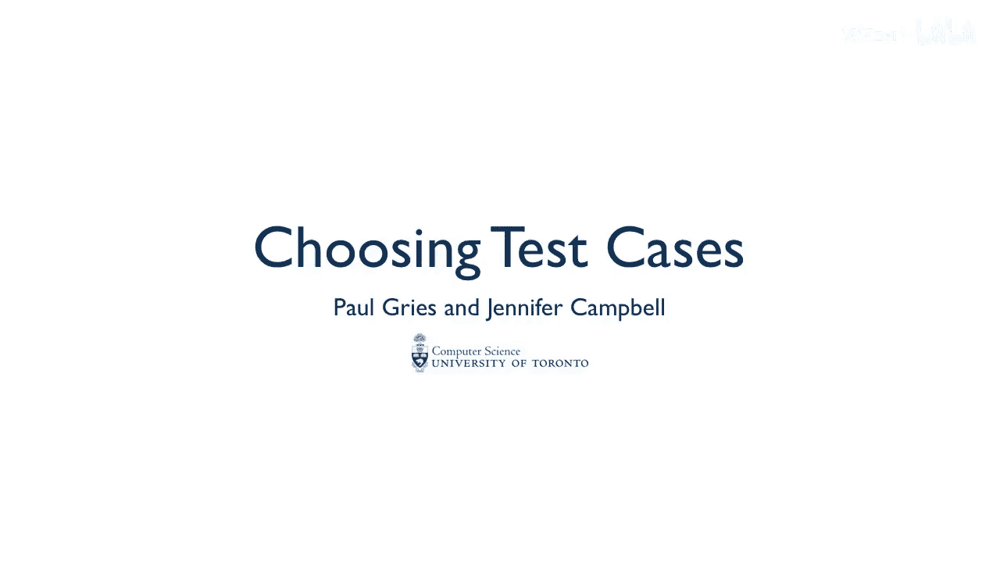
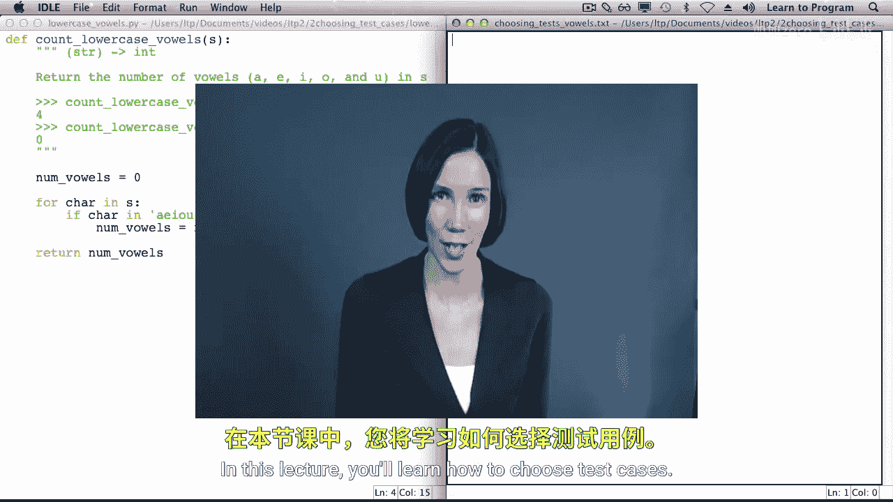
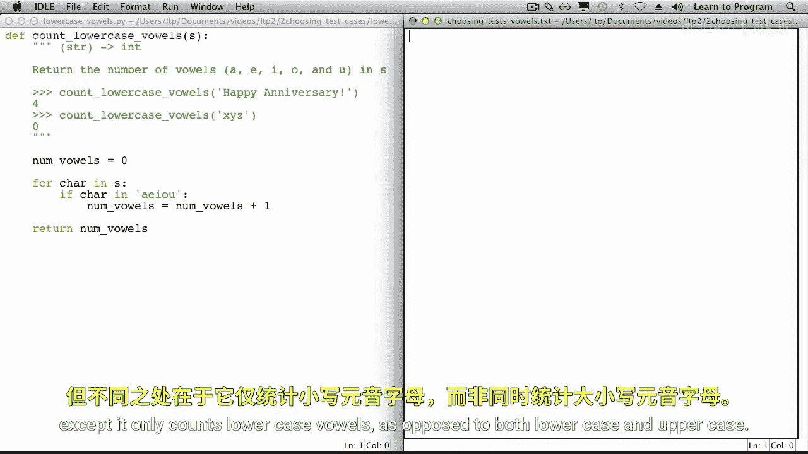
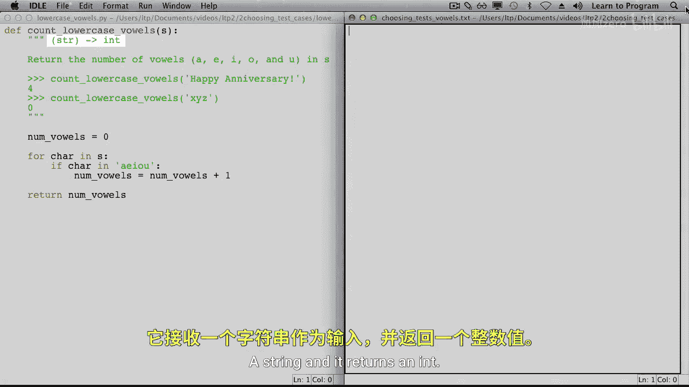
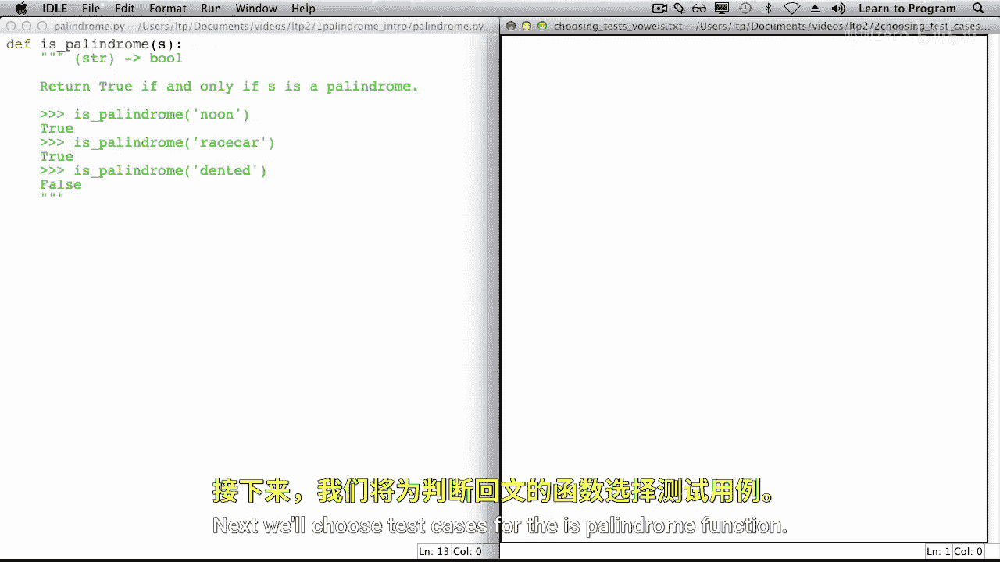
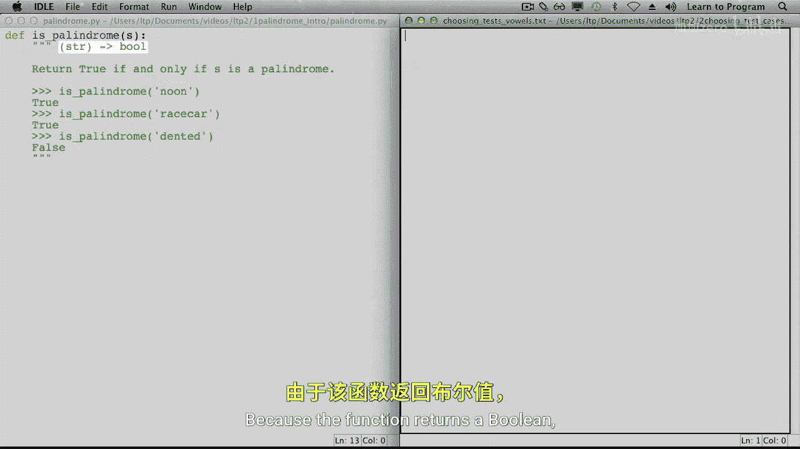
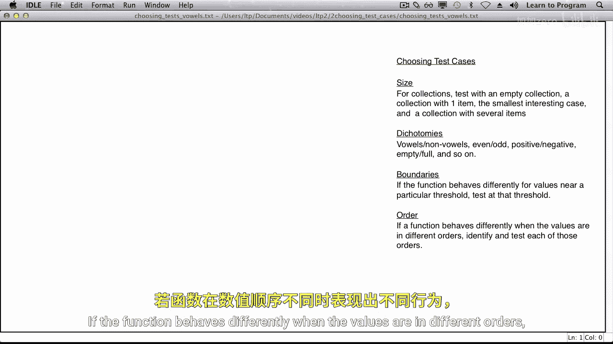

# 012：选择测试用例

在本节课中，我们将学习如何为函数选择有效的测试用例。测试是确保代码质量的关键步骤，但测试所有可能的输入是不现实的。因此，我们需要系统地选择有代表性的输入值进行测试。

## 测试 `count_lowercase_vowels` 函数

上一节我们介绍了测试的重要性，本节中我们来看看如何为一个具体的函数选择测试用例。我们将从 `count_lowercase_vowels` 函数开始。这个函数与我们之前见过的 `count_vowels` 函数类似，区别在于它只统计小写元音字母（a, e, i, o, u）。

该函数接受一个字符串作为参数，并返回一个整数，表示字符串中小写元音字母的数量。

为了测试这个函数，我们需要为字符串参数选择不同的值，然后调用函数以确保它在每种情况下都返回我们期望的结果。测试所有可能的字符串是不现实的。因此，我们将字符串分组到相关的类别中，然后从每个类别中选择一个有代表性的字符串进行测试。

在选择字符串参数时，我们需要考虑字符串的长度和组成字符串的字符。

以下是选择测试用例时需要考虑的类别：

*   **长度**：我们将使用三种长度：0、1 和 6。它们分别代表空字符串、单字符字符串和多字符字符串。
*   **字符类型**：由于我们统计的是元音，我们将根据字符是否为元音来选择字符。非元音字符的具体选择（如 `‘b’`、`‘n’`、`‘?’`）并不重要。

现在，让我们创建一个测试用例表。表格包含三列：函数的参数值、给定该参数后期望的函数返回值，以及测试用例的描述。

以下是 `count_lowercase_vowels` 函数的测试用例：

*   **空字符串**：参数为 `“”`，期望返回 `0`。描述：测试空字符串。
*   **单字符字符串（元音）**：参数为 `“a”`，期望返回 `1`。描述：测试包含一个元音的字符串。
*   **单字符字符串（非元音）**：参数为 `“b”`，期望返回 `0`。描述：测试包含一个非元音的字符串。
*   **长字符串（无元音）**：参数为 `“bcdfg”`，期望返回 `0`。描述：测试不包含任何元音的长字符串。
*   **长字符串（混合元音和非元音）**：参数为 `“abstemious”`，期望返回 `4`。描述：测试包含元音和非元音混合的长字符串。
*   **长字符串（全元音）**：参数为 `“aeiou”`，期望返回 `5`。描述：测试包含所有五个元音的长字符串。

选择好测试用例后，你就可以使用 `unittest` 框架来实现它们了。

## 测试 `is_palindrome` 函数

接下来，我们为 `is_palindrome` 函数选择测试用例。这个函数接受一个字符串，并返回一个布尔值，指示该字符串是否是回文（即正读反读都一样）。

因为函数返回布尔值，我们至少需要两个测试用例：一个导致函数返回 `True`，另一个导致返回 `False`。但实际上，我们需要更多测试用例。我们再次需要为字符串参数选择代表不同字符串类别的值。

对于这个问题，类别会有所不同。对于长度，我们仍然考虑长度为 0、1 和更长的字符串。此外，在开发回文算法时，我们发现长度的奇偶性会影响程序逻辑，因此我们也会考虑偶数长度和奇数长度。

以下是 `is_palindrome` 函数需要考虑的长度类别：

*   **长度 0 和 1**：空字符串和单字符字符串都被视为回文。
*   **长度 2**：这是最小的非空偶数长度回文，也是最小的非回文可能性。
*   **长度 3**：这是最小的多字符奇数长度回文。
*   **长度 6 和 7**：分别代表更长的偶数长度和奇数长度字符串。

现在让我们选择具体的字符串：

以下是 `is_palindrome` 函数的测试用例：

*   **空字符串**：参数为 `“”`，期望返回 `True`。描述：测试空字符串。
*   **单字符字符串**：参数为 `“a”`，期望返回 `True`。描述：测试单字符字符串。
*   **双字符字符串（是回文）**：参数为 `“aa”`，期望返回 `True`。描述：测试双字符回文。
*   **双字符字符串（不是回文）**：参数为 `“ab”`，期望返回 `False`。描述：测试双字符非回文。
*   **三字符字符串（是回文）**：参数为 `“aba”`，期望返回 `True`。描述：测试最小的多字符奇数长度回文。
*   **三字符字符串（不是回文）**：参数为 `“abc”`，期望返回 `False`。描述：测试三字符非回文。
*   **长偶数长度字符串（是回文）**：参数为 `“redder”`，期望返回 `True`。描述：测试更长的偶数长度回文。
*   **长偶数长度字符串（不是回文）**：参数为 `“renter”`，期望返回 `False`。描述：测试更长的偶数长度非回文。
*   **长奇数长度字符串（是回文）**：参数为 `“racecar”`，期望返回 `True`。描述：测试更长的奇数长度回文。
*   **长奇数长度字符串（不是回文）**：参数为 `“python”`，期望返回 `False`。描述：测试更长的奇数长度非回文。

## 选择测试用例的通用技巧

在选择测试用例时，有一些通用的指导原则可以帮助我们更全面地覆盖各种情况。这些原则之间存在重叠，因此你开发的测试用例可能不仅仅属于某一个类别。

以下是选择测试用例的四个关键考虑因素：

*   **大小**：对于字符串、列表、元组、字典等集合类型，应测试：空集合、包含一个项目的集合、最小的有意义的案例，以及包含多个项目的集合。
*   **二分法**：考虑对立或成对的概念。例如：元音与非元音、偶数与奇数、正数与负数、空与满等。
*   **边界**：如果函数在接近某个特定阈值时的行为不同，则应在该阈值处进行测试。
*   **顺序**：如果函数在值处于不同顺序时行为不同，则应识别并测试每一种顺序。

## 总结

本节课中，我们一起学习了如何为函数系统地选择测试用例。我们通过分析 `count_lowercase_vowels` 和 `is_palindrome` 两个函数，实践了如何根据参数类型、函数逻辑和返回值来划分输入类别，并从中选取有代表性的测试值。记住考虑大小、二分法、边界和顺序这些通用原则，将帮助你设计出更有效、覆盖更全面的测试套件，从而编写出更健壮、高质量的代码。