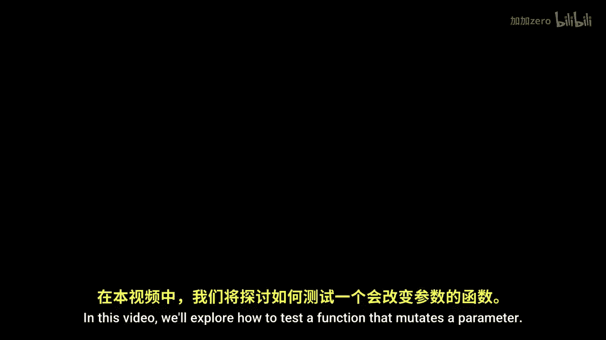
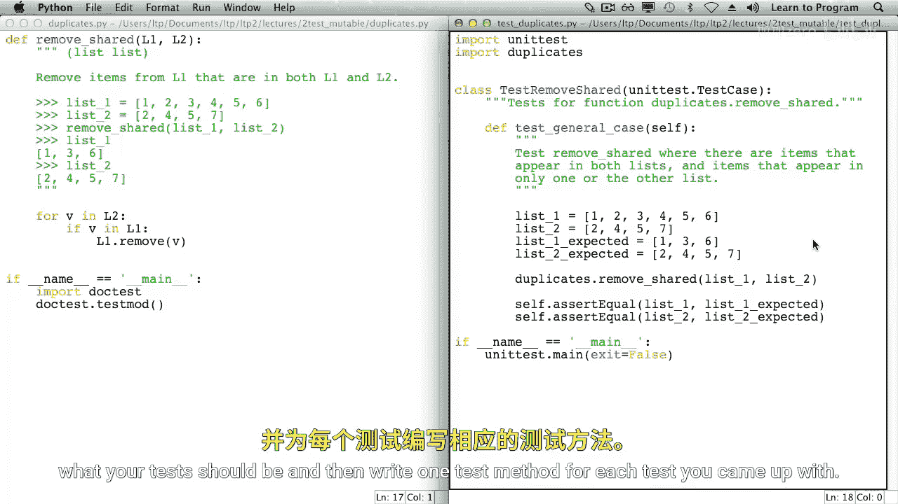

# 013：测试会改变值的函数 🧪



在本节课中，我们将学习如何测试一个会修改其参数值的函数。我们将从一个文档测试的例子开始，然后将其转换为单元测试。

## 概述

我们将重点分析一个名为 `remove_shared` 的函数。该函数的作用是：给定两个列表，它会从第一个列表中删除所有同时出现在第二个列表中的元素。这个函数不返回任何值（即返回 `None`），而是直接修改传入的第一个列表。测试这类函数的关键在于验证参数是否被正确地修改了。

## 从文档测试开始

首先，我们通过一个文档测试的例子来理解函数的行为。以下是函数 `remove_shared` 的算法描述：

**算法**：遍历第二个列表中的每个元素。如果该元素出现在第一个列表中，则将其从第一个列表中删除。

在文档测试中，我们创建两个列表。请注意，我们没有使用 `L1` 和 `L2` 作为变量名，这是为了提醒大家：函数的参数是局部变量，在函数外部我们可以为这两个列表使用任何喜欢的名字。

```python
# 文档测试示例
>>> list_one = [1, 2, 3, 4, 5, 6]
>>> list_two = [2, 4, 5, 7]
>>> remove_shared(list_one, list_two)
>>> list_one
[1, 3, 6]
>>> list_two
[2, 4, 5, 7]
```

函数 `remove_shared` 没有 `return` 语句，它返回 `None`。这意味着当我们调用函数时，测试中没有一个有用的返回值可供检查。因此，我们的测试策略是检查 `list_one` 和 `list_two` 本身。

我们需要确保：
1.  `list_one` 被正确地修改了（即共享元素已被删除）。
2.  `list_two` 没有被修改。

进行全面的测试时，这一点非常重要。如果你将一个不可变的值（或一个不应被修改的值）传递给函数，务必检查它是否真的没有被改变。

## 转换为单元测试

上一节我们通过文档测试理解了函数的行为，本节中我们来看看如何用 `unittest` 框架编写更结构化的单元测试。

每个单元测试文件通常以导入必要的模块开始。

```python
import unittest
import my_module # 假设我们的函数在这个模块里
```

我们需要创建一个 `unittest.TestCase` 的子类。我们根据测试的函数来命名这个类，并为其编写一个简短的文档字符串。

```python
class TestRemoveShared(unittest.TestCase):
    """测试 remove_shared 函数的类。"""
```

由于在文档测试中只有一个对 `remove_shared` 的调用场景，我们这里也只编写一个测试方法。请记住，每个单元测试方法名必须以 `test` 开头。

因为我们的测试涉及两个列表，其中包含一些共享元素和一些非共享元素，我们将方法命名为 `test_general_case`。方法的文档字符串应该描述这个测试。如果测试失败，这个字符串会成为输出信息的一部分，因此请尽量让它清晰、有帮助。

以下是编写测试方法的步骤：

```python
    def test_general_case(self):
        """测试存在共享元素和独有元素的常规情况。"""
        # 1. 设置测试数据（与文档测试相同）
        list_one = [1, 2, 3, 4, 5, 6]
        list_two = [2, 4, 5, 7]

        # 2. 调用待测试的函数
        remove_shared(list_one, list_two)

        # 3. 断言结果是否符合预期
        self.assertEqual(list_one, [1, 3, 6])
        self.assertEqual(list_two, [2, 4, 5, 7])
```

最后，我们需要添加标准代码来运行测试：

```python
if __name__ == '__main__':
    unittest.main()
```

## 运行测试

现在，让我们看看测试结果。首先运行文档测试（通常没有输出意味着通过）。然后运行我们的单元测试。

运行单元测试时，输出中的一个点 `.` 表示我们的一个测试方法通过了。

## 总结

本节课中我们一起学习了如何测试一个会修改参数的函数。关键步骤包括：
1.  理解函数行为：它修改哪个参数，预期结果是什么。
2.  在文档测试中验证修改效果。
3.  在单元测试中，使用 `unittest.TestCase` 子类组织测试。
4.  在测试方法中：准备数据、调用函数、使用 `assertEqual` 等断言方法验证参数是否被正确修改。
5.  确保同时检查了**不应被修改**的参数。



这就是测试会改变值的函数的方法。如果你想全面测试 `remove_shared` 函数，还需要设计更多的测试用例（例如，列表为空、没有共享元素、所有元素都共享等情况），并为每个用例编写独立的测试方法。我们将此作为练习留给读者。