# 015：线性搜索 🔍

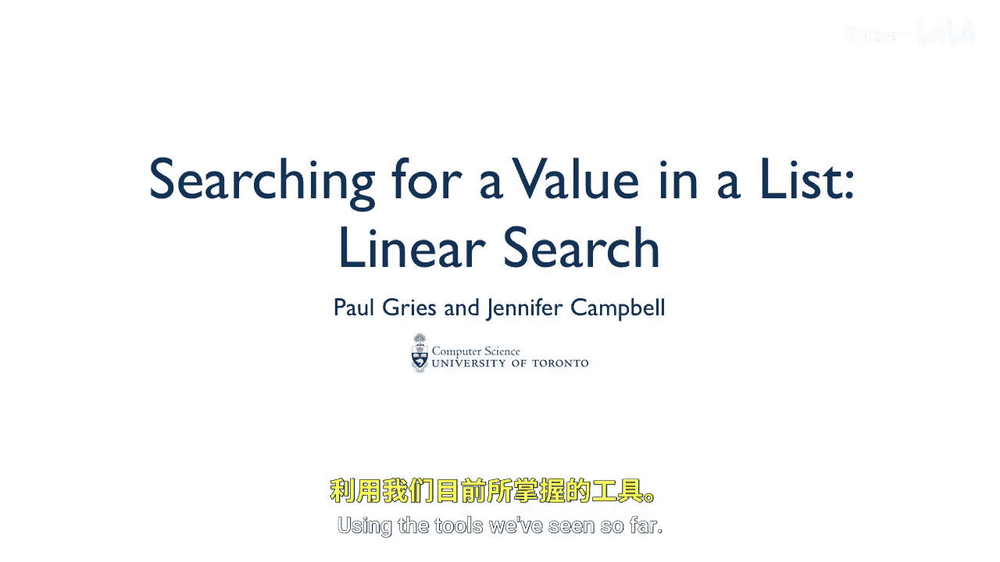

在本节课中，我们将要学习一种基础的搜索算法——线性搜索。我们将了解它的工作原理，并通过绘制图表和编写代码来深入理解其实现过程。

到目前为止，我们编写的计算机程序一次只能做一件事。不过，我们使用过一些看起来能同时做多件事的方法，例如 `list.sort()` 可以对数字列表进行排序，`list.index()` 可以在列表中查找某个值的索引。现在，我们将开始探索这些搜索和排序算法。事实证明，它们非常有趣，并且存在大量不同版本的排序和搜索算法。

我们将从线性搜索开始，即逐一检查列表中的每个项目。

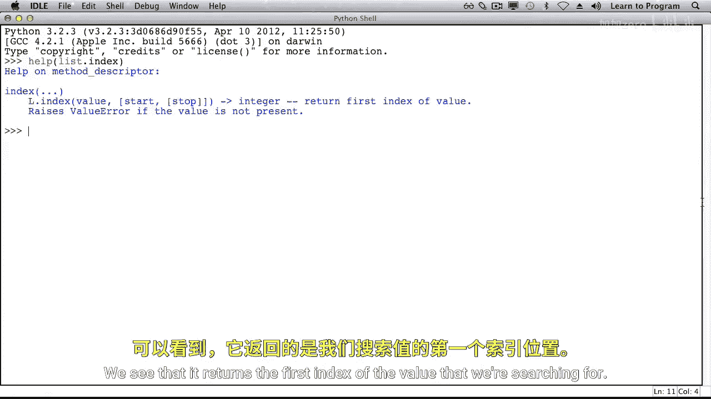

## 理解 `list.index()` 方法

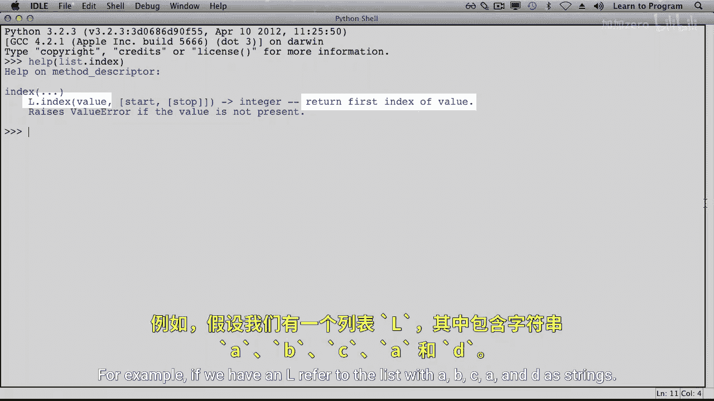

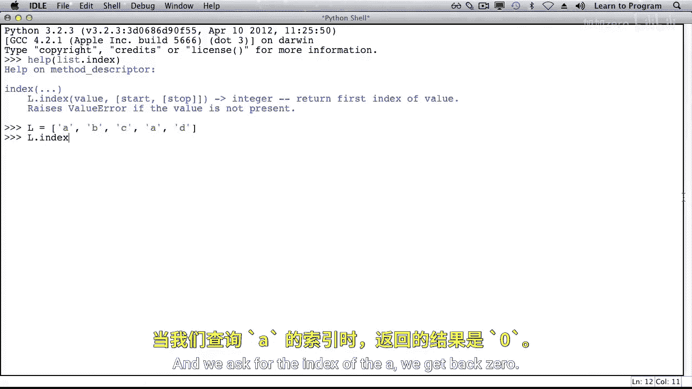

当我们查看列表类中 `index` 方法的帮助文档时，可以看到它返回我们正在搜索的值的第一个索引。

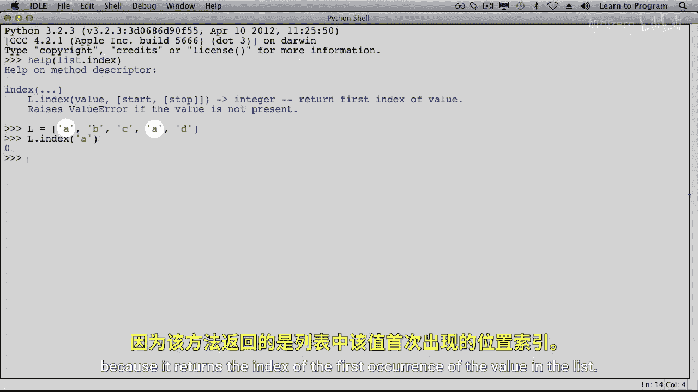

例如，如果变量 `L` 引用一个包含字符串 `'A'`, `'B'`, `'C'`, `'A'`, `'D'` 的列表，当我们查询 `'A'` 的索引时，会得到 `0`。我们不会得到 `3`，因为它返回的是列表中该值第一次出现的位置。

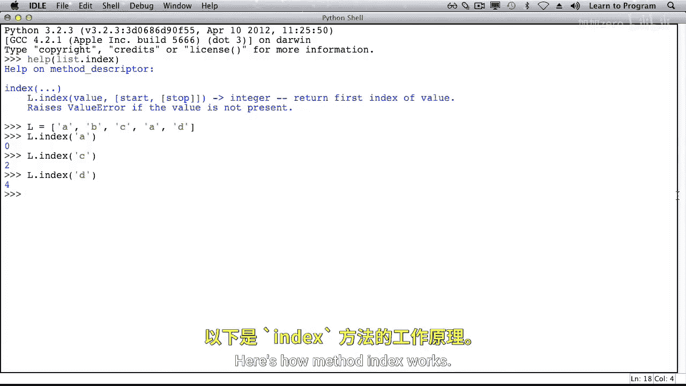

当我们查询字符串 `'C'` 的索引时，它告诉我们 `2`。当我们查询字符串 `'D'` 的索引时，它告诉我们 `4`。

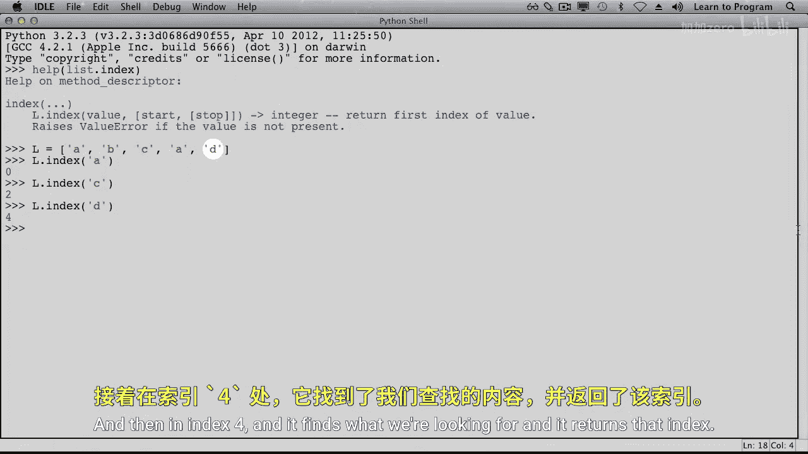

## 线性搜索的工作原理

以下是 `index` 方法的工作原理。当它寻找 `'D'` 时，它首先查看索引 `0`，然后是 `1`，接着是 `2`，然后是 `3`，最后在索引 `4` 处找到了我们要找的内容，并返回该索引。

“线性”意味着按一条线排列，我们本质上是从列表的开头到结尾沿着这条线进行查找。

为了在本周后续课程中更清晰地绘制列表，我们将把值直接画在列表内部，而不是画一个箭头指向列表外部的值。这样做是为了减少杂乱，使我们的图表更简洁。我们还会将索引变量画在它们所引用的索引上方。

假设变量 `I` 初始指向 `0`。如果我们要寻找一个值 `V`（例如 `'D'`），那么我们会问：在索引 `I` 处的值等于 `V` 吗？如果是，我们就找到了，返回 `I`。如果不是，就像我们这里的情况，我们将给 `I` 加 `1`，使 `I` 指向 `1`。

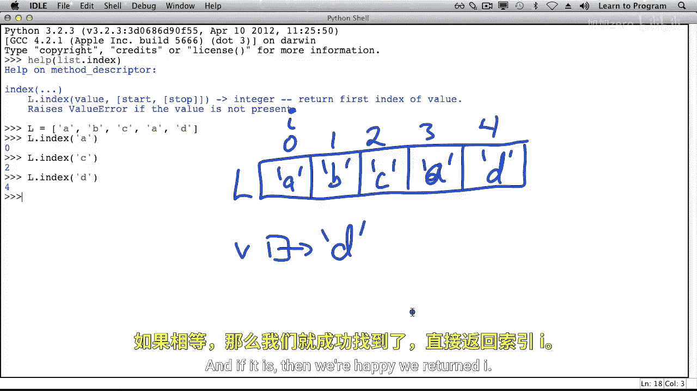

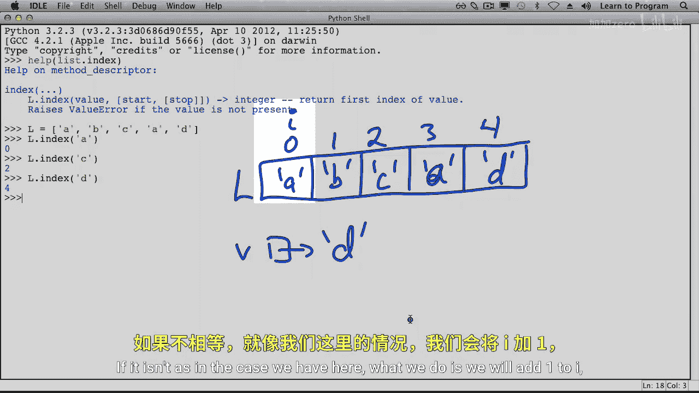

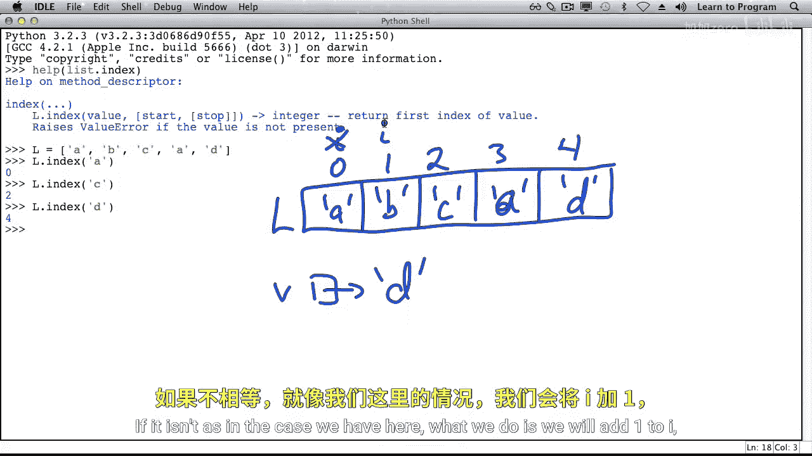

现在，在索引 `I` 处的值是 `'D'` 吗？不是。所以我们再次给 `I` 加 `1`。现在呢？还不是。继续检查，直到在某个索引处，`L[I]` 等于 `'D'`。这时我们就找到了要寻找的值，并在我们的线性搜索函数中返回 `I`。

我们需要决定如果要寻找的值不在列表中该怎么办。例如，如果要寻找的是字符串 `'X'`。在这种情况下，我们返回 `-1`。

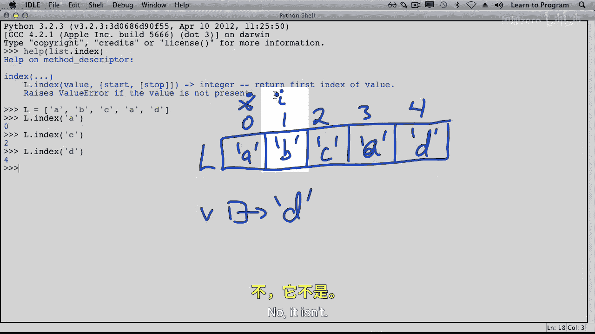

## 实现线性搜索函数

我们将通过编写一个实现线性搜索的函数来继续探索。这个函数接收一个列表和任意对象，并返回一个整数，表示该对象在列表中的索引。

以下是一个函数调用的例子，我们搜索 `2`，而 `2` 出现在索引 `0` 处。另一个例子是搜索 `5`，它在索引 `2` 处。现在，我们搜索一个不在列表中的数字，我们应该得到 `-1`。

函数描述是：返回 `V` 在 `L` 中第一次出现的索引，如果 `V` 不在 `L` 中，则返回 `-1`。

现在，我们再次绘制列表，以帮助我们推理这个算法。`I` 从 `0` 开始。以下是相应的代码。我们还不知道何时停止循环，所以暂时将条件留空，但我们知道每次循环都会给 `I` 加 `1`。

经过几次迭代后，我们得到了一般的图示。`I` 是某个索引，我们知道 `V` 不在这里。现在，让我们看看循环结束后是什么样子。

如果 `V` 根本不在整个列表中，`I` 的值是多少？`I` 会位于我画的这条分界线的右侧。在这种情况下，`I` 最终会等于列表的长度 `len(L)`。

因此，停止这个循环的一种方式是 `I` 达到列表的长度。所以，只要 `I` 不等于列表的长度，我们就可以继续循环。另一种可以停止的情况是，当我们在索引 `I` 处找到了 `V`。

这意味着，只要 `I` 不等于列表长度 **并且** `V` 不等于 `L[I]`，我们就给 `I` 加 `1`。

循环终止后，我可以检查 `I` 是否等于 `L` 的长度，以判断 `V` 是否不在列表中。如果不在，我将返回 `-1`。否则，这意味着我找到了 `V`，我可以返回 `I`。

我们处理的算法正变得越来越复杂。像这样绘制图表确实有助于我们在第一次编写时就写出正确的代码，从长远来看，这将为我们节省大量时间。

## 循环不变式

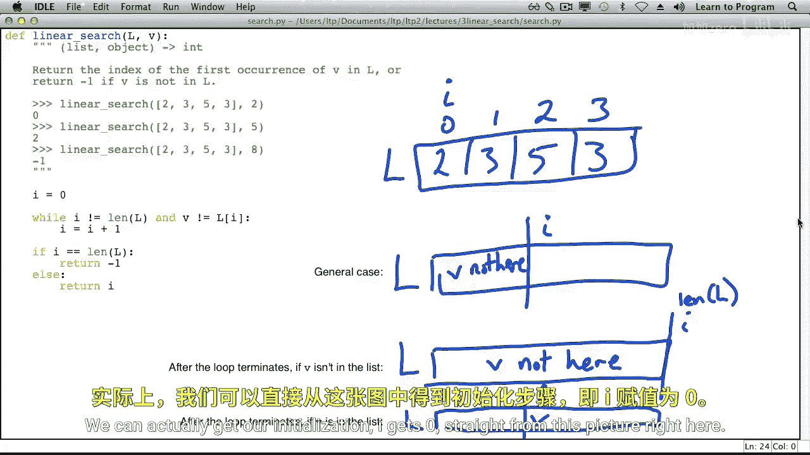

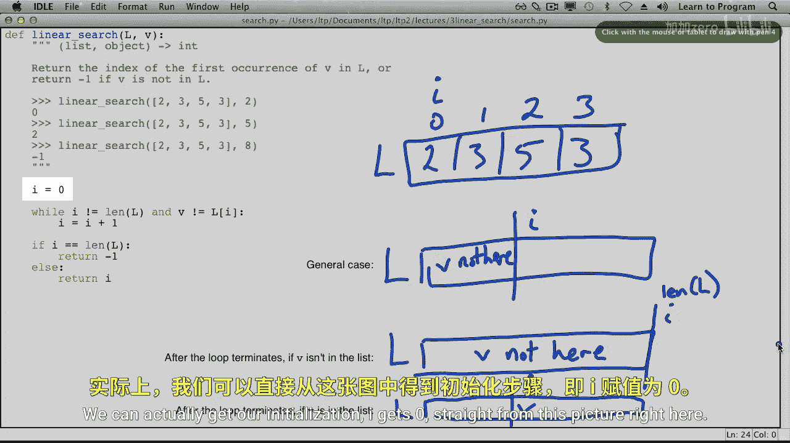

实际上，我们可以直接从这张图中得到初始化步骤：`I = 0`。如果我有我的列表，并且我需要“V不在此处”的区域是空的，那么分界线就在最左边，`I` 就在索引 `0` 处。

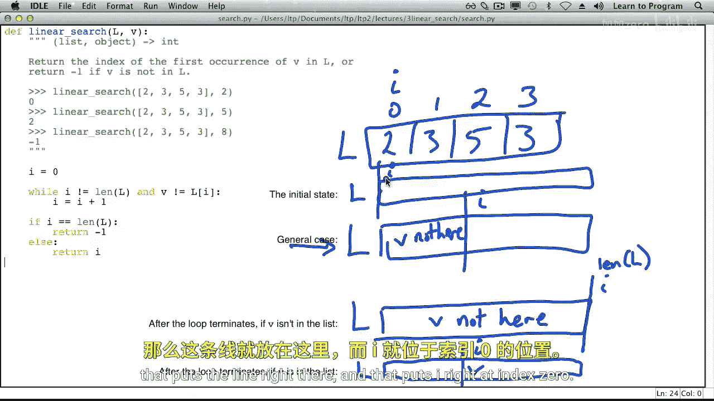

这张图被称为**循环不变式**。不变式是指不发生变化的东西。这张图描述了在任意次数的循环迭代之后，索引 `I` 之前的情况：我们没有看到 `V`。我们还没有检查从索引 `I` 开始的任何内容，因此我们仍然需要搜索它。

循环不变式和类似的图表将在本周接下来的课程中扮演重要角色。

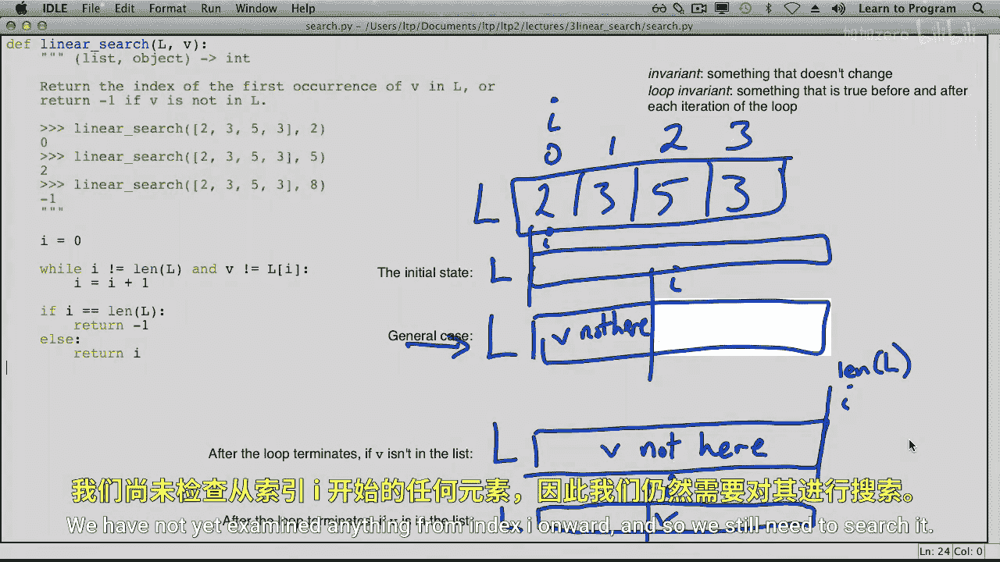

## 总结

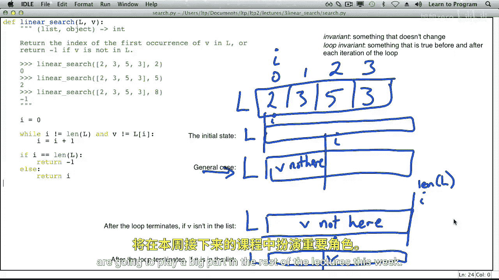

本节课中，我们一起学习了线性搜索算法。我们了解了 `list.index()` 方法的行为，并通过绘制图表和编写代码，逐步推导出了线性搜索函数的实现逻辑。我们引入了“循环不变式”的概念，它帮助我们清晰地思考循环内部的状态，从而更可靠地编写正确的代码。线性搜索虽然简单，但它是理解更复杂算法的基础。