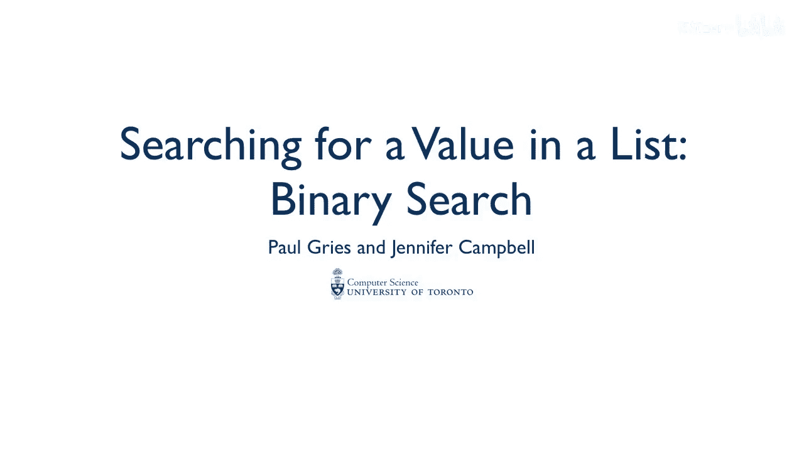
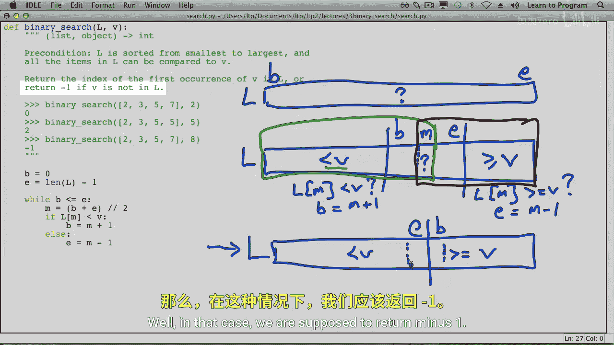
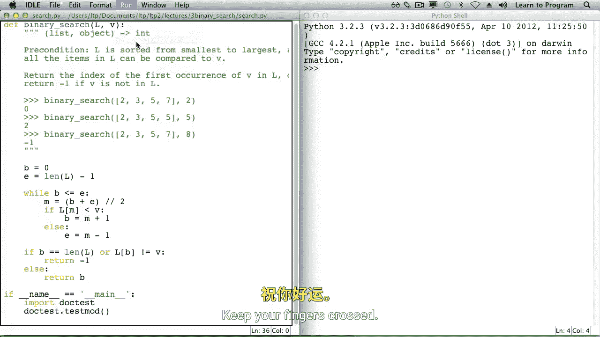

# 016：二分搜索 🔍



在本节课中，我们将要学习一种在**已排序列表**中查找元素的高效算法——二分搜索。我们将了解它的工作原理、实现步骤，并与之前学过的线性搜索进行对比。

## 线性搜索回顾

上一节我们介绍了线性搜索。线性搜索从列表的起始索引开始，按顺序逐个检查列表中的每个元素，直到找到目标值或搜索完整个列表。


对于一个包含 `n` 个元素的列表，线性搜索在最坏情况下可能需要检查所有 `n` 个元素。例如，当目标值不在列表中时，就必须检查每一个元素。

线性搜索的优点是适用于**已排序**和**未排序**的列表。然而，如果我们预先知道列表是已排序的，就可以使用一种效率高得多的算法：二分搜索。

## 二分搜索简介

本节中我们来看看二分搜索。二分搜索是一种“分而治之”的算法，它通过反复将搜索区间对半分割来快速定位目标值。

以下是二分搜索的函数定义和文档字符串。与线性搜索类似，它接收一个列表 `L` 和一个目标值 `v`，并返回该值在列表中**首次出现**的索引。如果值不在列表中，则返回 `-1`。

```python
def binary_search(L, v):
    """ (list, object) -> int
    Return the index of the first occurrence of v in L, or return -1 if v is not in L.
    Precondition: L must be sorted in non-decreasing order.
    """
```

二分搜索有两个重要前提：
1.  列表 `L` 必须是**已排序**的。
2.  列表 `L` 中的每个元素必须能够与目标值 `v` 进行比较。

## 二分搜索的核心思想

为了帮助你理解这个思想，我们来看一个例子。假设我们有一个已排序的数字列表 `[1, 3, 4, 4, 5, 7, 9, 10]`，我们要搜索值 `5`（首次出现在索引 3 的位置）。

我们可以想象一条分界线，这条线将**小于** `v` 的元素与**大于或等于** `v` 的元素分开。这条线就位于我们寻找的 `5` 的位置。

假设列表有 100,000 个元素。我们可以很容易地计算出中间索引 `m`，并检查该位置的值 `L[m]`。

*   如果 `L[m] < v`，由于列表已排序，我们知道中间点**左侧**的所有元素也都小于 `v`。因此，仅通过一次比较，我们就可以排除掉左半部分的 50,000 个元素。

在二分搜索算法中，我们将列表划分为三个区域：
1.  **左侧区域**：所有小于 `v` 的元素。
2.  **右侧区域**：所有大于或等于 `v` 的元素。
3.  **未知区域**：我们尚未检查其与 `v` 关系的元素。

我们用变量 `b`（begin）标记未知区域的起始索引，用变量 `e`（end）标记未知区域的结束索引。

## 算法实现步骤

以下是实现二分搜索的具体步骤。

**初始化**：
当函数被调用时，我们对列表中的所有值一无所知，因此整个列表都是未知区域。`b` 初始化为 `0`，`e` 初始化为 `len(L) - 1`。

**循环过程**：
这个循环将不断使 `b` 和 `e` 相互靠近，直到它们交错（即 `b > e`），此时未知区域为空。
在循环中，我们计算 `b` 和 `e` 的中间点 `m`，然后检查 `L[m]` 与 `v` 的关系：
*   如果 `L[m] < v`，说明中间点及其左侧所有元素都小于 `v`。我们可以将未知区域的起点 `b` 更新为 `m + 1`。
*   如果 `L[m] >= v`，说明中间点及其右侧所有元素都大于或等于 `v`。我们可以将未知区域的终点 `e` 更新为 `m - 1`。

**循环条件**：
只要 `b <= e`，就意味着未知区域中还有元素需要检查，循环就继续。

**中点计算**：
中点 `m` 是 `b` 和 `e` 的平均值。为了避免得到浮点数，我们使用整数除法：
```python
m = (b + e) // 2
```

## 处理未找到的情况

循环结束后，我们需要小心处理，因为有可能列表中的所有值都大于等于 `v`，或者都小于 `v`。



*   如果所有值都小于 `v`，那么 `b` 最终会等于 `len(L)`（这是一个无效索引）。
*   如果所有值都大于等于 `v`，那么 `b` 最终会是 `0`。

循环结束时，`b` 指向的是**第一个大于或等于 `v` 的元素**的索引。因此，我们需要检查这个位置是否真的等于 `v`。

以下是返回结果的逻辑：
1.  如果 `b` 等于列表长度 `len(L)`，说明 `v` 大于列表中所有元素，返回 `-1`。
2.  否则，检查 `L[b]` 是否等于 `v`。如果相等，则返回 `b`；如果不相等，则说明 `v` 不在列表中，返回 `-1`。

代码实现如下：
```python
if b == len(L) or L[b] != v:
    return -1
else:
    return b
```

## 测试代码

最后，我们可以编写一些文档测试代码来验证我们的函数是否正确。

```python
if __name__ == '__main__':
    import doctest
    doctest.testmod()
```

运行测试，如果所有测试用例都通过，就说明我们的二分搜索实现成功了！

## 总结



本节课中我们一起学习了二分搜索算法。我们了解到，与线性搜索的 `O(n)` 时间复杂度相比，二分搜索在已排序列表上的时间复杂度为 `O(log n)`，效率有巨大提升。关键在于，二分搜索通过每次比较将搜索范围减半，并利用列表已排序的特性来排除大量元素。记住，使用二分搜索前，必须确保列表是排序的。