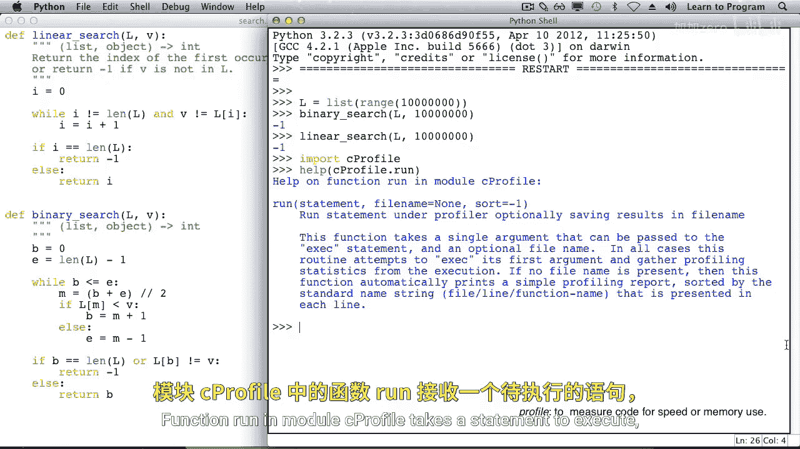
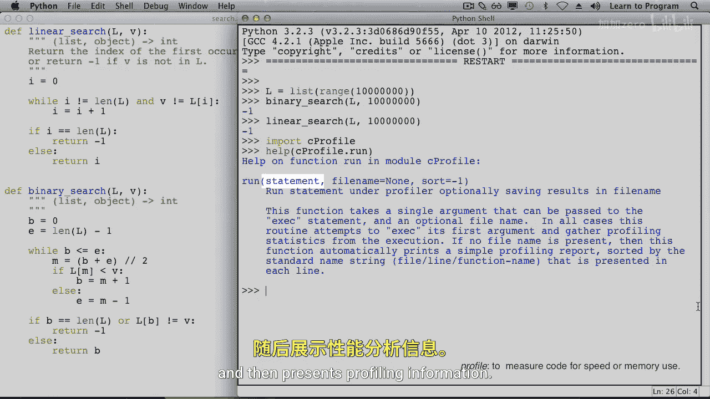
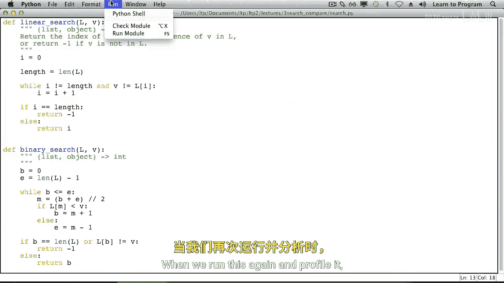

# 017：比较搜索算法 🔍


在本节课中，我们将深入比较两种搜索算法：线性搜索和二分搜索。我们将分析它们的工作原理、效率差异，并学习如何通过数学分析和性能剖析来评估算法的优劣。


---

你已经学习了在列表中搜索值的两种方法。其中一种是线性搜索，它适用于任何列表，无论列表是否排序。二分搜索则要求列表是排序的，但正如你所见，它看起来比线性搜索快得多。让我们更深入地探讨这两种算法，以便更好地理解它们的性能以及何时该使用哪一种。

## 算法步骤分析

为了感受算法的效率，我们需要估算它们执行的操作步骤。计算机为了加速代码运行会使用很多技巧，因此很难精确计算。然而，我们知道在线性搜索的 `while` 循环中，每次迭代都会发生一次比较和一次赋值语句。因此，让我们计算每次循环迭代中发生的比较和赋值操作。

以下是两种算法的粗略步骤分析：

*   **线性搜索**：在每次迭代中，大约发生两步操作：一次比较和一次赋值语句。
*   **二分搜索**：在每次迭代中，大约发生四步操作：一次比较、一次赋值、第二次比较，以及基于第二次比较结果的一次赋值。

> **注意**：这是一个非常粗略的估计，但足以让我们得出结论：至少在处理大型列表时，二分搜索的速度远超线性搜索。我们将忽略那些只执行一次的初始化步骤和最终判断，因为它们对大规模数据的影响微乎其微。

## 最坏情况下的迭代次数比较

上一节我们介绍了算法的单步操作，本节我们来看看在最坏情况下（即搜索的值不在列表中），两种算法需要多少次迭代。

我们将通过构建一个表格来比较随着列表项数（K）增加，两种算法所需的迭代次数。

### 线性搜索的迭代次数

对于线性搜索，如果列表中有 K 项，在最坏情况下就需要 K 次迭代。

| 列表项数 (K) | 线性搜索迭代次数 |
| :--- | :--- |
| 1 | 1 |
| 2 | 2 |
| 5 | 5 |
| K | K |

### 二分搜索的迭代次数

二分搜索的迭代次数增长则缓慢得多。其规律是：**当列表大小翻倍时，所需的迭代次数仅增加 1**。

| 列表项数 (K) | 二分搜索迭代次数 |
| :--- | :--- |
| 1 | 1 |
| 2 | 2 |
| 4 | 3 |
| 8 | 4 |
| 16 | 5 |
| 32 | 6 |
| 64 | 7 |
| 128 | 8 |

通过观察可知，对于包含 128 个项目的列表，二分搜索仅需 8 次迭代，而线性搜索则需要 128 次。这种差异随着数据量增大而急剧扩大。

## 理解对数函数 📈

二分搜索这种“翻倍数据量，仅增一步骤”的强大特性，在数学上对应着一个函数：**以 2 为底的对数函数**，记作 **log₂(K)**。

理解对数的一种方式是：**它表示将一个数不断除以 2，直到结果为 1 所需的次数**。
例如：
*   log₂(2) = 1 （2 ÷ 2 = 1，除了一次）
*   log₂(4) = 2 （4 ÷ 2 = 2; 2 ÷ 2 = 1，除了两次）
*   log₂(8) = 3
*   log₂(16) = 4

在Python中，我们可以使用 `math` 模块的 `log` 函数来计算。

```python
import math

# 计算以2为底的对数
print(math.log(2, 2))   # 输出: 1.0
print(math.log(4, 2))   # 输出: 2.0
print(math.log(8, 2))   # 输出: 3.0
print(math.log(16, 2))  # 输出: 4.0
```

让我们感受一下二分搜索的速度有多快。对于一个包含 **10亿**（1,000,000,000）个项目的列表：
*   线性搜索在最坏情况下需要约 **10亿次** 迭代。
*   二分搜索在最坏情况下仅需要约 **log₂(1,000,000,000) ≈ 30次** 迭代。

## 实际性能剖析 🚀

理论分析显示二分搜索极快，让我们通过实际代码运行来验证。我们将使用Python的 `cProfile` 模块来剖析两种算法在大型列表上的性能。





以下是使用 `cProfile.run()` 进行性能剖析的示例代码框架：

```python
import cProfile

# 假设有一个包含大量数据的排序列表 L 和搜索函数 binary_search/linear_search
# 搜索一个肯定不在列表中的值，以触发最坏情况
cProfile.run(‘binary_search(L, -1)‘)  # 剖析二分搜索
cProfile.run(‘linear_search(L, -1)‘)  # 剖析线性搜索
```

在一个包含1000万项目的列表上运行剖析，结果差异显著：
*   **二分搜索**：几乎瞬间完成（时间显示为0秒）。
*   **线性搜索**：需要数秒才能完成。

剖析结果还揭示了一个优化点：在 `linear_search` 的循环中反复调用 `len(L)` 会产生额外开销。通过预先将列表长度存入变量，可以显著提升线性搜索的速度（例如从3秒优化到1.5秒）。然而，即使经过优化，线性搜索的速度仍然远远无法与二分搜索相比。

> **重要提示**：上述分析基于列表已排序且处于最坏情况的假设。在最好情况下（例如搜索列表的第一个元素），线性搜索也会非常快。

## 总结



本节课中我们一起学习了如何比较线性搜索和二分搜索算法。

我们通过估算单步操作、分析最坏情况迭代次数，理解了二分搜索效率远超线性搜索的根本原因在于其 **对数级** 的时间复杂度（O(log n)），而线性搜索是 **线性级**（O(n)）。我们还使用 `cProfile` 模块进行了实际性能剖析，验证了理论分析，并发现了通过缓存 `len()` 结果来优化线性搜索的实用技巧。

对算法进行数学分析和性能剖析，能为我们提供深刻的洞察，帮助我们理解算法的工作原理及其优劣。算法分析本身就是计算机科学中的一个重要学科领域。