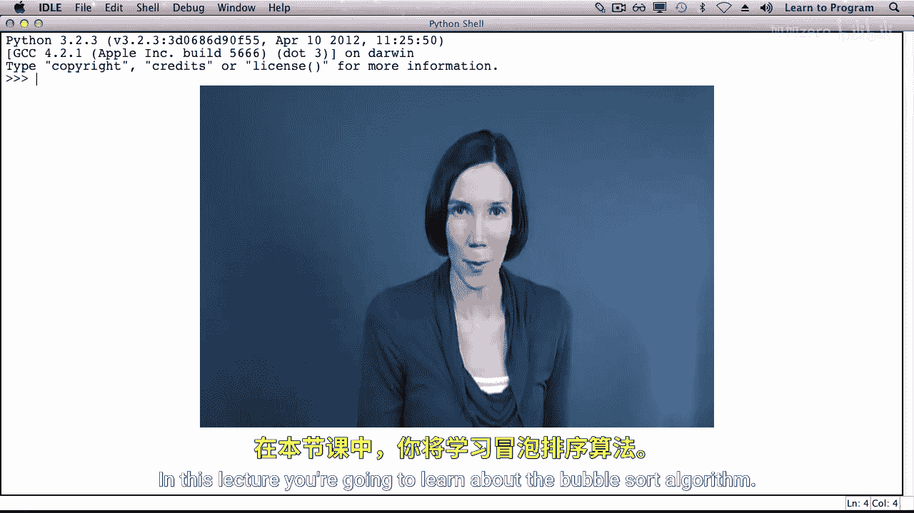
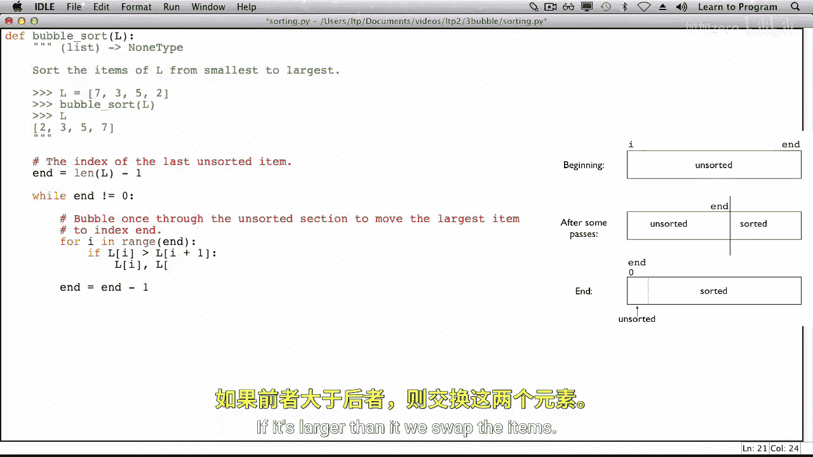
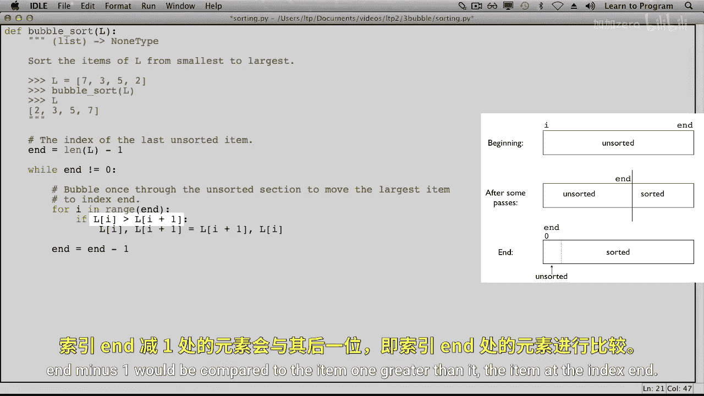
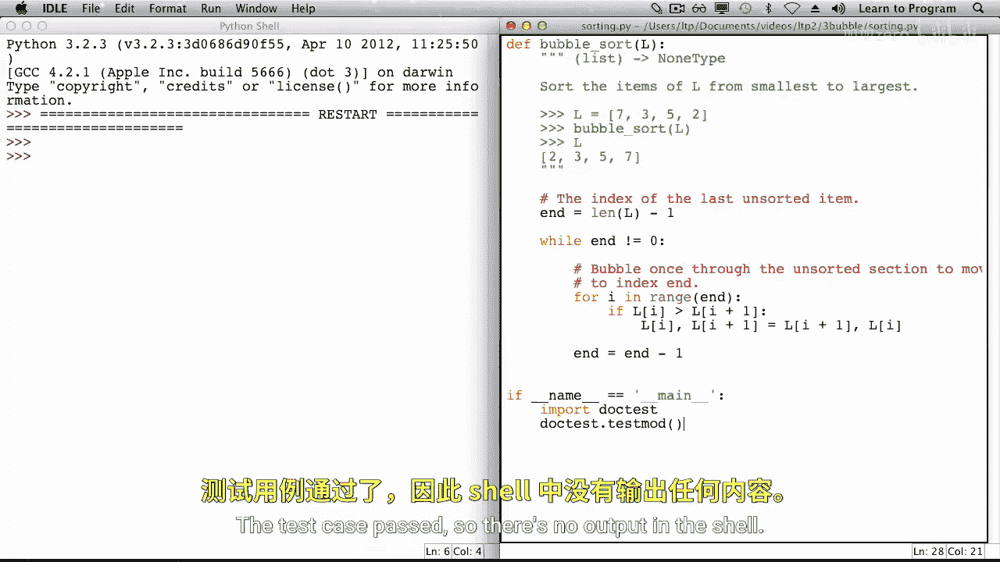

# 018：冒泡排序 🫧


在本节课中，我们将要学习一个经典的计算机科学问题：如何对一个列表中的对象进行从小到大的排序。我们将重点介绍一种名为“冒泡排序”的算法。



## 算法原理与示例

上一节我们介绍了排序问题的背景，本节中我们来看看冒泡排序的具体工作原理。我们将通过一个具体的例子来理解它。

假设我们有一个待排序的列表，其值为 `[7, 3, 5, 2]`。我们的目标是使用冒泡排序算法将其按升序排列。

算法的核心思想是：**通过重复地遍历列表，比较相邻的元素，如果它们的顺序错误就交换它们，从而将最大的元素逐步“冒泡”到列表的末端。**

以下是排序过程的详细步骤：

**第一轮遍历：**
*   我们从索引 `I = 0` 开始，比较 `I` 和 `I+1` 位置的元素。
*   比较 `7` 和 `3`，因为 `7 > 3`，所以交换它们。列表变为 `[3, 7, 5, 2]`。
*   `I` 移动到索引 1，比较 `7` 和 `5`，交换。列表变为 `[3, 5, 7, 2]`。
*   `I` 移动到索引 2，比较 `7` 和 `2`，交换。列表变为 `[3, 5, 2, 7]`。
*   第一轮遍历结束，最大的数字 `7` 已经“冒泡”到了列表最右端，处于其正确的位置。

**第二轮遍历：**
*   现在，最后一个元素 `7` 已排序，我们只对前三个元素 `[3, 5, 2]` 进行排序。
*   从 `I = 0` 开始，比较 `3` 和 `5`，顺序正确，不交换。
*   `I` 移动到索引 1，比较 `5` 和 `2`，交换。列表变为 `[3, 2, 5, 7]`。
*   第二轮遍历结束，第二大的数字 `5` 被移动到了正确位置。

**第三轮遍历：**
*   现在，最后两个元素 `[5, 7]` 已排序，我们只对前两个元素 `[3, 2]` 进行排序。
*   从 `I = 0` 开始，比较 `3` 和 `2`，交换。列表变为 `[2, 3, 5, 7]`。
*   第三轮遍历结束，列表已经完全排序。

## 算法的一般化描述

通过上面的例子，我们可以总结出冒泡排序算法的一般状态。

在算法开始时，整个列表都是未排序的。随着算法进行，列表被分为两部分：**未排序部分**（从索引 `0` 到索引 `end`）和**已排序部分**（从索引 `end+1` 到列表末尾）。

变量 `end` 用于追踪未排序部分的最后一个索引。初始时，`end` 指向列表的最后一个元素。每一轮遍历后，未排序部分中的最大元素会被移动到 `end` 位置，然后 `end` 减 1，表示已排序部分增加了一个元素。当 `end` 减少到 0 时，整个列表排序完成。

## 代码实现

理解了算法流程后，现在让我们看看如何用代码实现冒泡排序。

以下是实现冒泡排序的关键代码结构：

```python
def bubble_sort(lst):
    """
    对列表 lst 进行原地冒泡排序。
    """
    # end 初始指向最后一个元素的索引
    end = len(lst) - 1
    # 当未排序部分不为空时继续循环
    while end > 0:
        # 遍历未排序部分 [0, end]
        for i in range(end):
            # 比较相邻元素
            if lst[i] > lst[i + 1]:
                # 如果顺序错误，则交换
                lst[i], lst[i + 1] = lst[i + 1], lst[i]
        # 本轮最大元素已就位，未排序部分减少一个元素
        end = end - 1
```

代码说明：
1.  **外层循环 (`while end > 0`)**: 控制排序的轮数。只要未排序部分还有元素（`end > 0`），就继续排序。
2.  **内层循环 (`for i in range(end)`)**: 在每一轮中，遍历当前的未排序部分。注意循环的上限是 `end` 而不是 `len(lst)-1`，因为 `lst[end]` 是未排序部分的最后一个元素，`lst[i]` 需要与 `lst[i+1]` 比较，所以 `i` 最大取到 `end-1`。
3.  **比较与交换**: 如果 `lst[i] > lst[i + 1]`，则使用 Python 的元组解包语法 `a, b = b, a` 交换两个元素的位置。
4.  **更新 `end`**: 每完成一轮内层遍历，未排序部分的最大元素就被移动到了 `end` 位置。因此，将 `end` 减 1，缩小未排序部分的范围。

## 测试与验证

最后，我们可以用一个简单的测试来验证我们的冒泡排序函数是否正确工作。



```python
# 测试用例
if __name__ == '__main__':
    test_list = [7, 3, 5, 2]
    bubble_sort(test_list)
    print(test_list)  # 输出应为 [2, 3, 5, 7]
```

运行测试，如果没有输出错误，并且列表被正确排序，则说明我们的实现是正确的。

---





**本节课中我们一起学习了：**
1.  **冒泡排序的原理**：通过重复比较和交换相邻元素，将最大元素逐步移动到列表末端。
2.  **算法的步骤**：使用变量 `end` 跟踪未排序部分的边界，通过嵌套循环实现多轮遍历。
3.  **代码实现**：使用 `while` 循环控制排序轮数，使用 `for` 循环遍历未排序部分，并通过条件判断和交换操作完成排序。
冒泡排序是一种直观但效率较低的排序算法，非常适合作为理解排序算法思想的入门。