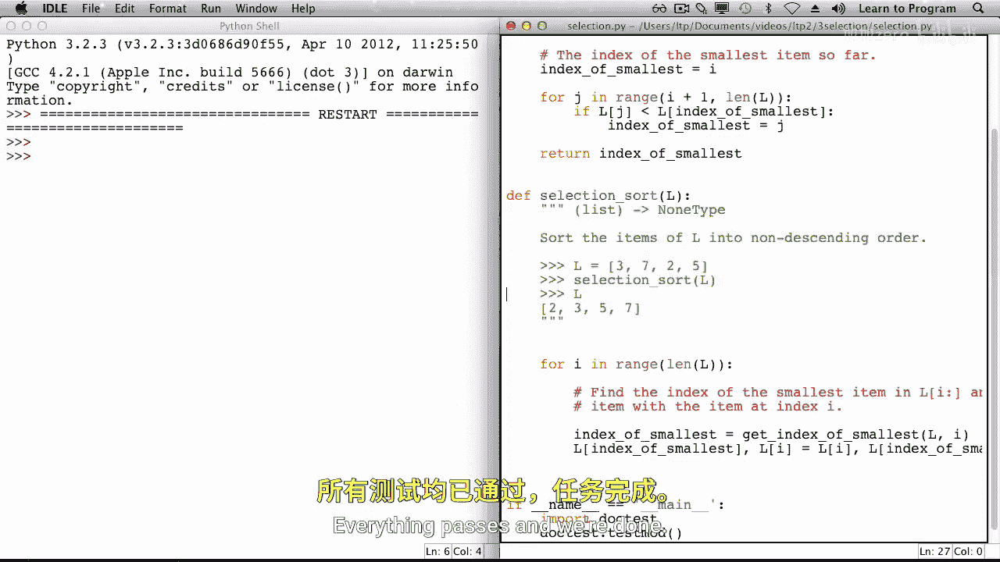

# 019：选择排序


在本节课中，我们将要学习另一种将对象从小到大排序的算法，它被称为选择排序。


## 概述

选择排序是一种直观的排序算法。它的核心思想是：在未排序的部分中反复查找最小的元素，并将其放到已排序部分的末尾。通过这种方式，列表会逐渐变得有序。

## 算法原理

上一节我们介绍了排序的基本概念，本节中我们来看看选择排序的具体工作原理。

算法开始时，整个列表被视为未排序部分。我们用一个索引 `i` 来标记未排序部分的起始位置，初始时 `i = 0`。

在每一轮遍历中，我们执行以下两个步骤：
1.  在从索引 `i` 到列表末尾的未排序部分中，找到最小元素的索引。
2.  将这个最小元素与索引 `i` 处的元素进行交换。

完成交换后，索引 `i` 处的元素就位于其最终的正确位置（即已排序部分的末尾）。然后我们将 `i` 增加 1，开始下一轮对剩余未排序部分的处理。

当 `i` 等于列表长度时，意味着整个列表都已排序完成。

## 算法步骤演示

以下是使用列表 `[5, 3, 7, 2]` 演示选择排序的过程：

*   **第一轮遍历 (`i = 0`)**:
    *   在未排序部分 `[5, 3, 7, 2]` 中找到最小值 `2`，其索引为 `3`。
    *   交换索引 `0` 和索引 `3` 的元素。列表变为 `[2, 3, 7, 5]`。此时，`[2]` 是已排序部分。

*   **第二轮遍历 (`i = 1`)**:
    *   在剩余未排序部分 `[3, 7, 5]` 中找到最小值 `3`，其索引为 `1`。
    *   交换索引 `1` 和索引 `1` 的元素（实际未变）。列表仍为 `[2, 3, 7, 5]`。已排序部分扩展为 `[2, 3]`。

*   **第三轮遍历 (`i = 2`)**:
    *   在剩余未排序部分 `[7, 5]` 中找到最小值 `5`，其索引为 `3`。
    *   交换索引 `2` 和索引 `3` 的元素。列表变为 `[2, 3, 5, 7]`。已排序部分扩展为 `[2, 3, 5]`。

*   **第四轮遍历 (`i = 3`)**:
    *   剩余未排序部分为 `[7]`，它本身就是最小值。
    *   交换后列表不变。最终得到完全排序的列表 `[2, 3, 5, 7]`。

## 代码实现

理解了算法步骤后，现在让我们将其转化为代码。我们将实现两个函数：主排序函数和一个辅助函数。

### 辅助函数：`get_index_of_smallest`

这个函数负责在列表的指定范围内查找最小值的索引。

```python
def get_index_of_smallest(L, i):
    """
    返回列表 L 中从索引 i 到末尾的最小值的索引。
    """
    index_of_smallest = i  # 初始假设索引 i 处的元素最小
    for j in range(i + 1, len(L)):
        if L[j] < L[index_of_smallest]:
            index_of_smallest = j  # 找到更小的元素，更新索引
    return index_of_smallest
```

### 主函数：`selection_sort`

这是选择排序算法的主体，它调用辅助函数并执行交换操作。

```python
def selection_sort(L):
    """
    使用选择排序算法对列表 L 进行原地升序排序。
    """
    for i in range(len(L)):
        # 1. 在未排序部分找到最小值的索引
        index_of_smallest = get_index_of_smallest(L, i)
        # 2. 将最小值与当前位置 i 的元素交换
        L[i], L[index_of_smallest] = L[index_of_smallest], L[i]
```

## 总结



本节课中我们一起学习了选择排序算法。我们了解了它的核心思想：**反复选择未排序部分中的最小元素并将其放到正确位置**。我们通过分步演示清晰地观察了排序过程，并最终用代码实现了该算法，包括一个用于查找最小索引的辅助函数 `get_index_of_smallest` 和主排序函数 `selection_sort`。选择排序虽然简单直观，但其效率对于大型数据集来说并不高，这为我们后续学习更高效的算法奠定了基础。