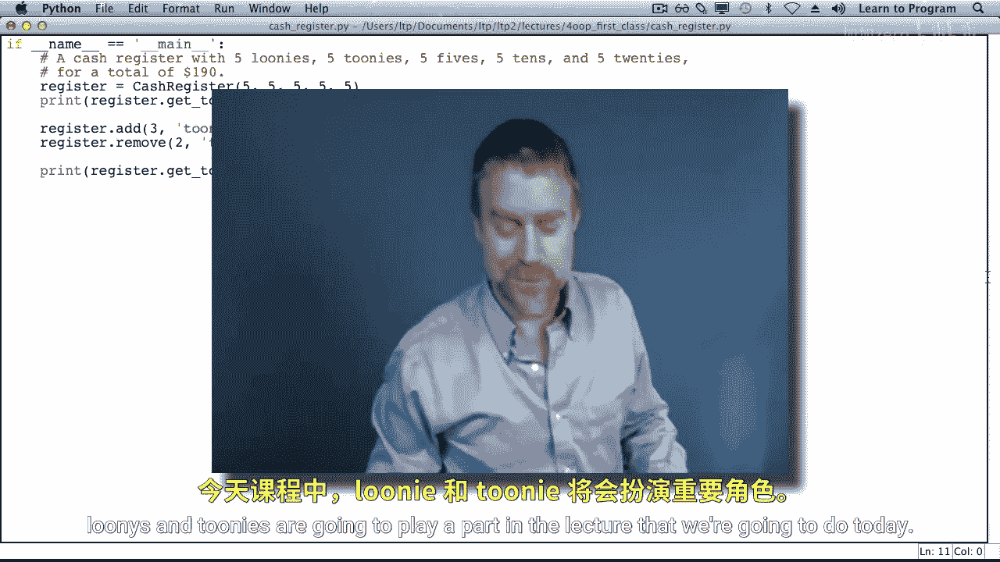
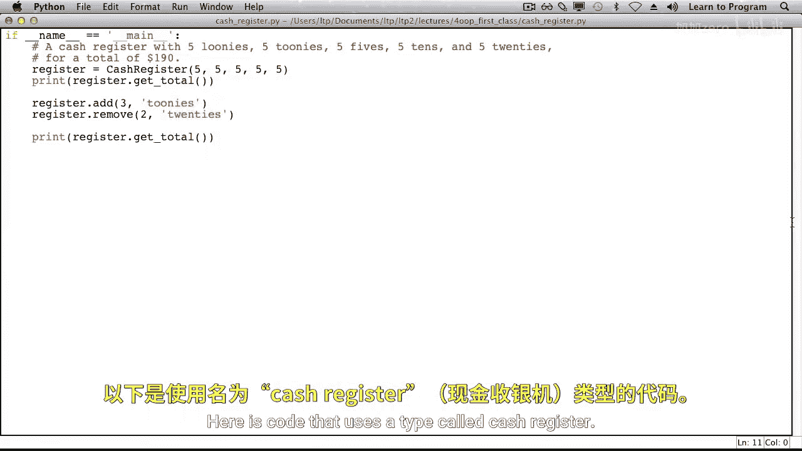
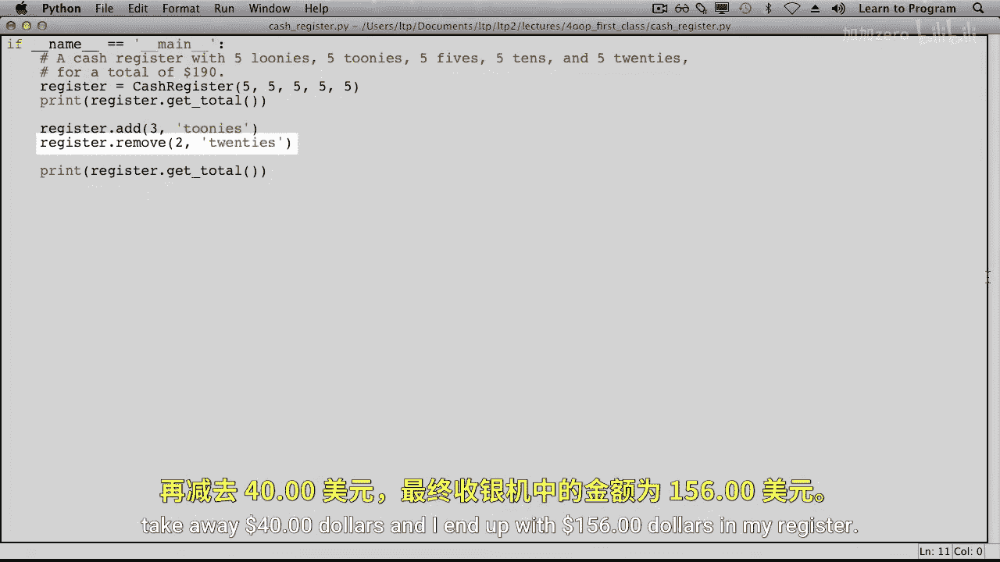
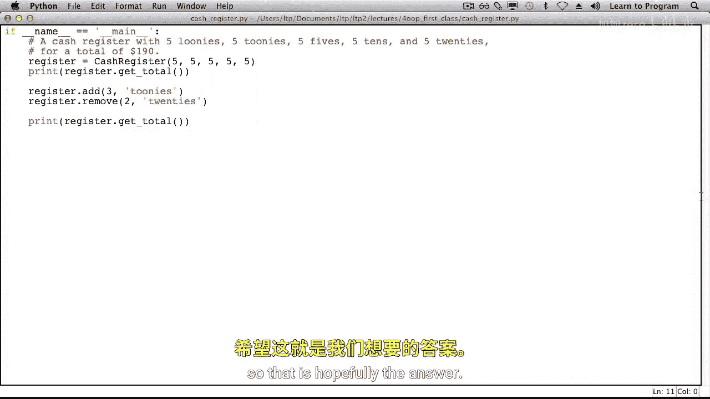
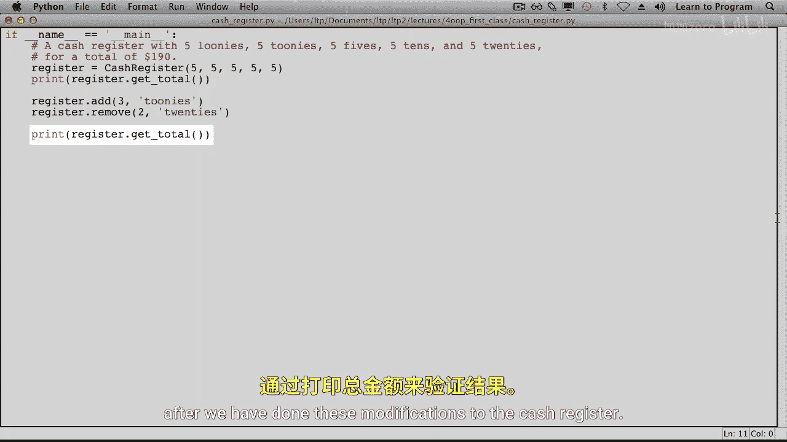
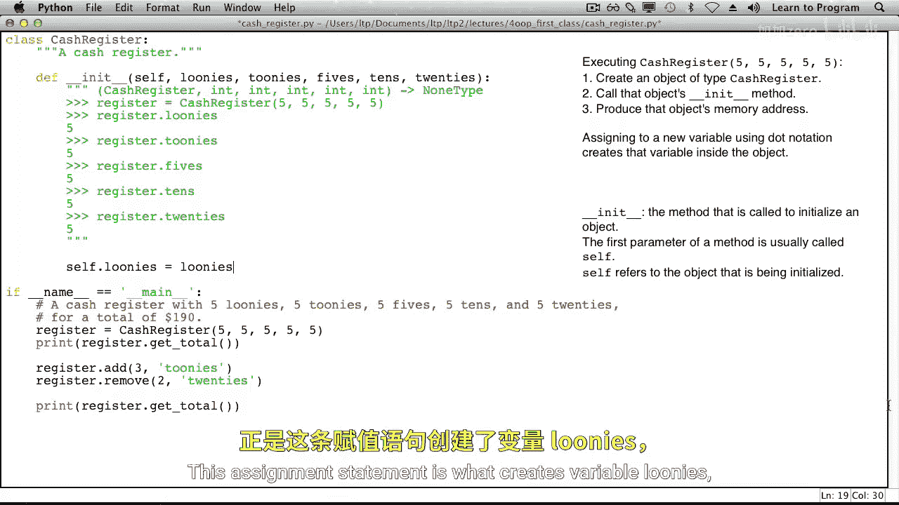
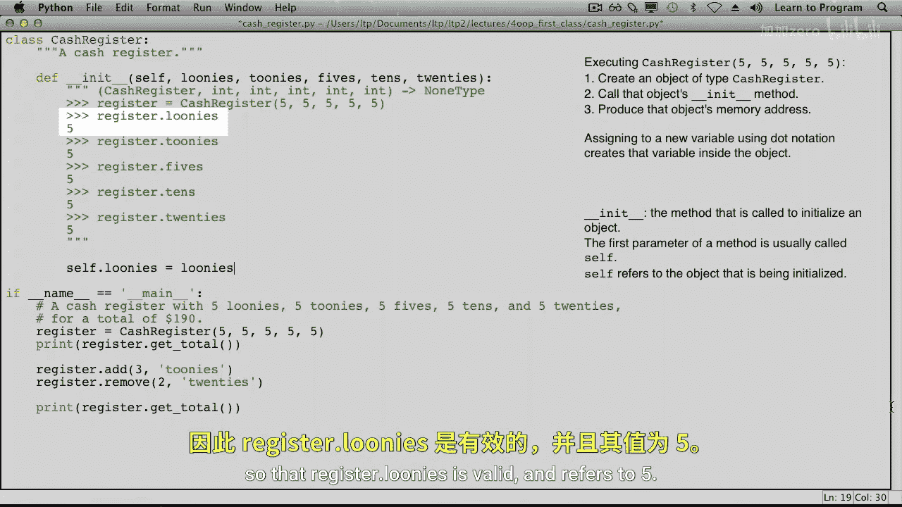
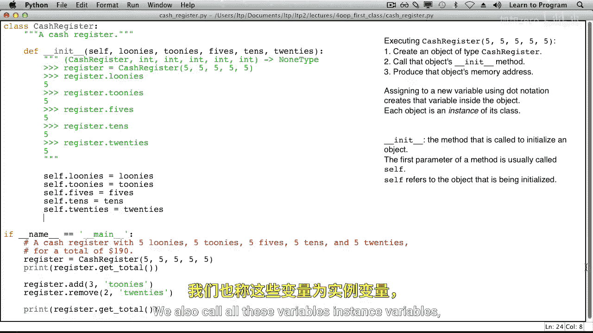
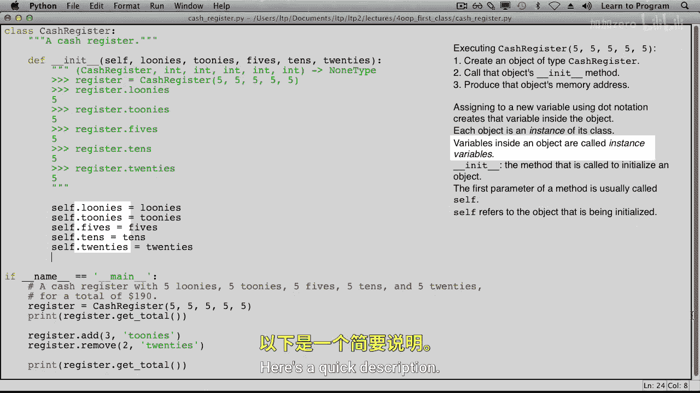
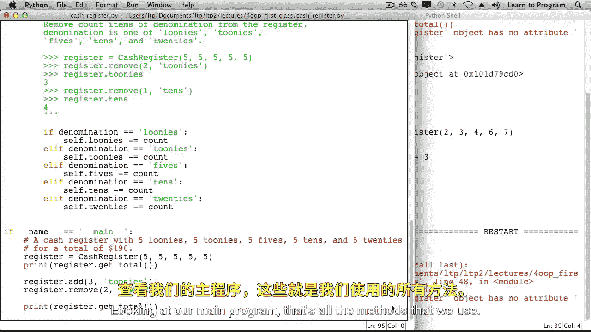

# 021：创建新类型 🧾


在本节课中，我们将更深入地探索类。具体来说，我们将编写一个类来代表一个收银机。在开始之前，我们先了解一下加拿大的硬币。有一种1加元硬币，被称为“Loonie”，上面印有潜鸟的图案。还有一种2加元硬币，被称为“Toonie”，一面印有北极熊，另一面印有女王头像。Loonie和Toonie将在今天的课程中扮演重要角色。



## 目标代码示例



以下是我们希望使用一个名为 `CashRegister` 的类型编写的代码。

```python
register = CashRegister(5, 5, 5, 5, 5)
print(register.get_total())
register.add(3, "toonies")
register.remove(2, "twenties")
print(register.get_total())
```



这段代码创建了一个新的收银机，初始包含5个Loonie、5个Toonie、5张5元、5张10元和5张20元纸币，总计190加元。然后，我们向收银机添加了3个Toonie（价值6加元），并移除了2张20元纸币（价值40加元）。最终，收银机内的总金额应为156加元。





## 定义新类型

当我们尝试运行上述代码时，会遇到错误：`CashRegister` 未定义。这是因为我们需要自己定义这个新类型。

为了定义这个类型，我们将编写一个 `CashRegister` 类。`__init__` 方法（带有双下划线）用于初始化一个新的收银机对象。按照惯例，它的第一个参数是 `self`，它指向正在被初始化的收银机对象。我们还需要传入Loonie、Toonie、5元、10元和20元纸币的数量。

```python
class CashRegister:
    def __init__(self, loonies, toonies, fives, tens, twenties):
        self.loonies = loonies
        self.toonies = toonies
        self.fives = fives
        self.tens = tens
        self.twenties = twenties
```

例如，`register = CashRegister(5, 5, 5, 5, 5)` 这行代码会创建一个收银机对象，然后调用 `__init__` 方法，并将该对象作为第一个参数（`self`）传入。赋值语句 `self.loonies = loonies` 会在收银机对象内部创建一个名为 `loonies` 的变量，并指向传入的值。其他变量也以同样的方式创建。

我们称创建的这个收银机对象为 `CashRegister` 类的一个**实例**。对象内部的这些变量（如 `loonies`, `toonies`）被称为**实例变量**，因为它们存在于一个实例内部。





## 实现获取总额的方法



现在，让我们继续完善我们的类，使其拥有 `get_total`、`add` 和 `remove` 方法。



首先定义 `get_total` 方法。它的第一个参数同样是 `self`，指向被询问总额的收银机实例。该方法返回一个整数，即收银机内的现金总额。

```python
    def get_total(self):
        total = (self.loonies * 1) + (self.toonies * 2) + (self.fives * 5) + (self.tens * 10) + (self.twenties * 20)
        return total
```

每个Loonie价值1加元，每个Toonie价值2加元，依此类推。运行程序后，`register.get_total()` 应该会输出190。

## 实现添加现金的方法

接下来，我们定义 `add` 方法。它接收三个参数：`self`、要添加的数量（`count`）和面额（`denomination`）。例如，`register.add(3, "toonies")` 表示向收银机添加3个Toonie。

```python
    def add(self, count, denomination):
        if denomination == "loonies":
            self.loonies += count
        elif denomination == "toonies":
            self.toonies += count
        elif denomination == "fives":
            self.fives += count
        elif denomination == "tens":
            self.tens += count
        elif denomination == "twenties":
            self.twenties += count
```

这个方法通过一个 `if` 语句来判断要增加哪种面额的实例变量。

## 实现移除现金的方法

`remove` 方法与 `add` 方法非常相似，只是执行的是减法操作。

```python
    def remove(self, count, denomination):
        if denomination == "loonies":
            self.loonies -= count
        elif denomination == "toonies":
            self.toonies -= count
        elif denomination == "fives":
            self.fives -= count
        elif denomination == "tens":
            self.tens -= count
        elif denomination == "twenties":
            self.twenties -= count
```

## 完整代码与运行结果

现在，我们的 `CashRegister` 类已经完整，包含了 `__init__`、`get_total`、`add` 和 `remove` 方法。

```python
class CashRegister:
    def __init__(self, loonies, toonies, fives, tens, twenties):
        self.loonies = loonies
        self.toonies = toonies
        self.fives = fives
        self.tens = tens
        self.twenties = twenties

    def get_total(self):
        total = (self.loonies * 1) + (self.toonies * 2) + (self.fives * 5) + (self.tens * 10) + (self.twenties * 20)
        return total

    def add(self, count, denomination):
        if denomination == "loonies":
            self.loonies += count
        elif denomination == "toonies":
            self.toonies += count
        elif denomination == "fives":
            self.fives += count
        elif denomination == "tens":
            self.tens += count
        elif denomination == "twenties":
            self.twenties += count

    def remove(self, count, denomination):
        if denomination == "loonies":
            self.loonies -= count
        elif denomination == "toonies":
            self.toonies -= count
        elif denomination == "fives":
            self.fives -= count
        elif denomination == "tens":
            self.tens -= count
        elif denomination == "twenties":
            self.twenties -= count

# 主程序
register = CashRegister(5, 5, 5, 5, 5)
print(register.get_total())  # 输出: 190
register.add(3, "toonies")
register.remove(2, "twenties")
print(register.get_total())  # 输出: 156
```

运行这段代码，我们得到了期望的结果：初始总额190加元，操作后总额156加元。

## 总结



本节课中，我们一起学习了如何通过定义类来创建新的数据类型。我们以 `CashRegister` 类为例，实现了初始化方法 `__init__` 来设置实例变量，并编写了 `get_total`、`add` 和 `remove` 等方法来模拟收银机的功能。通过这个过程，我们理解了类、实例和实例变量的概念，并能够像使用Python内置类型一样使用我们自定义的类型。