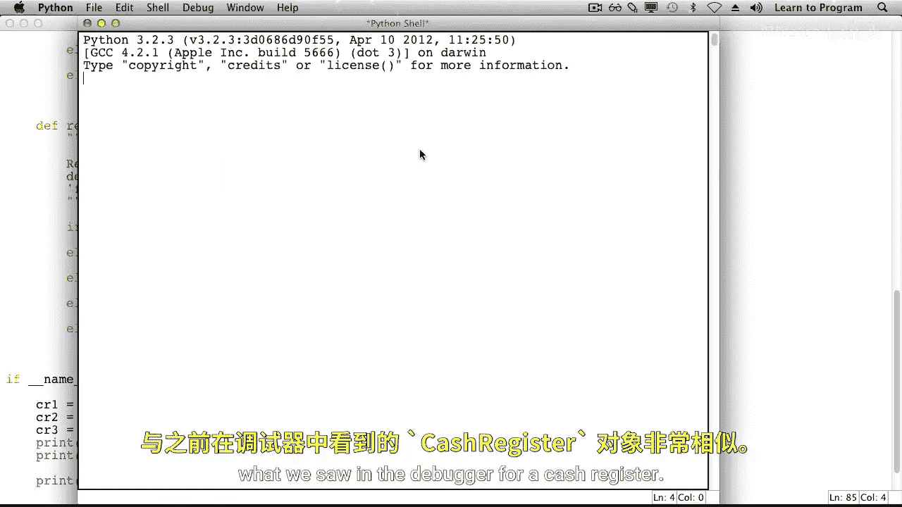
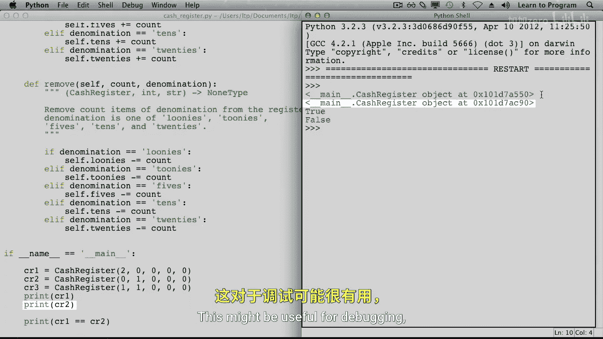
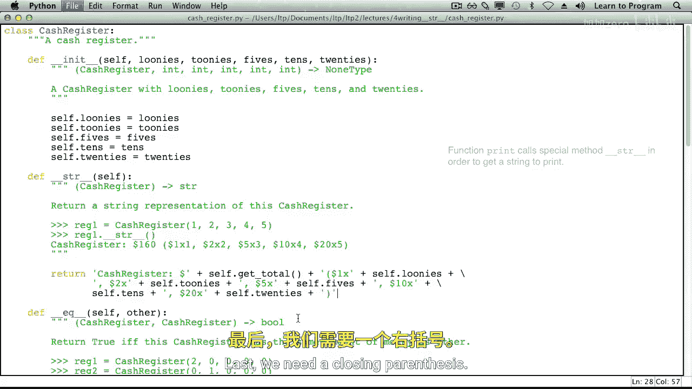
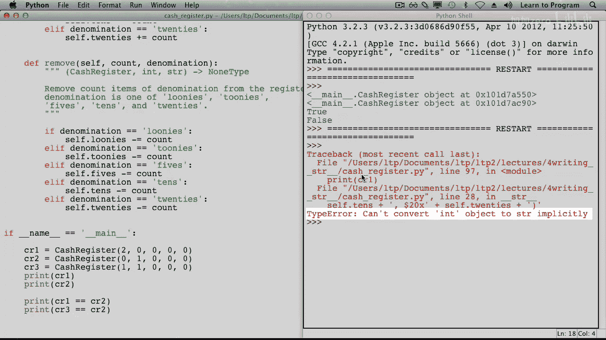
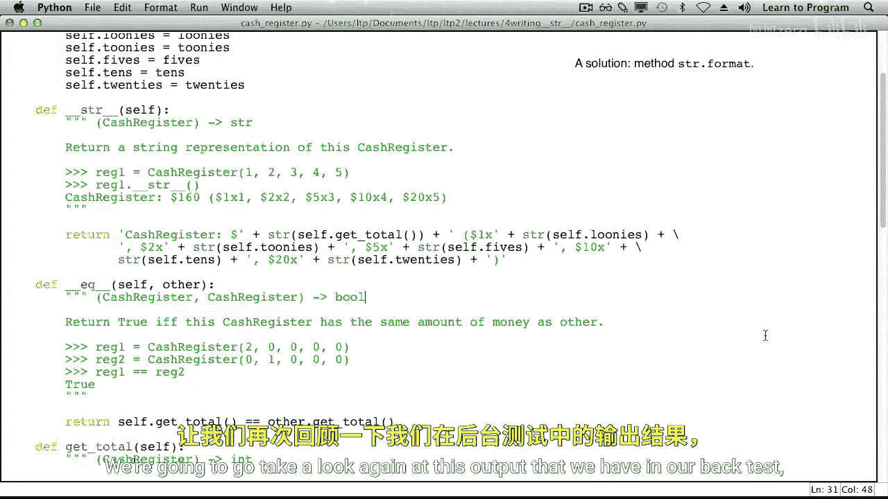
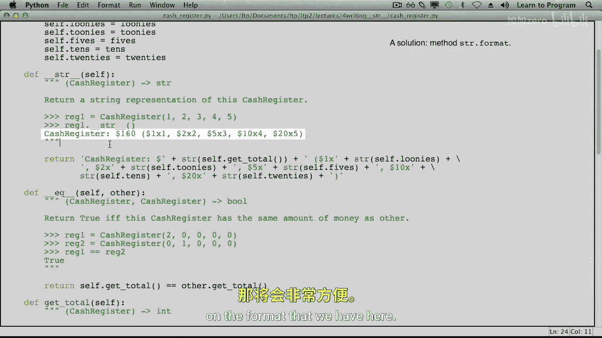
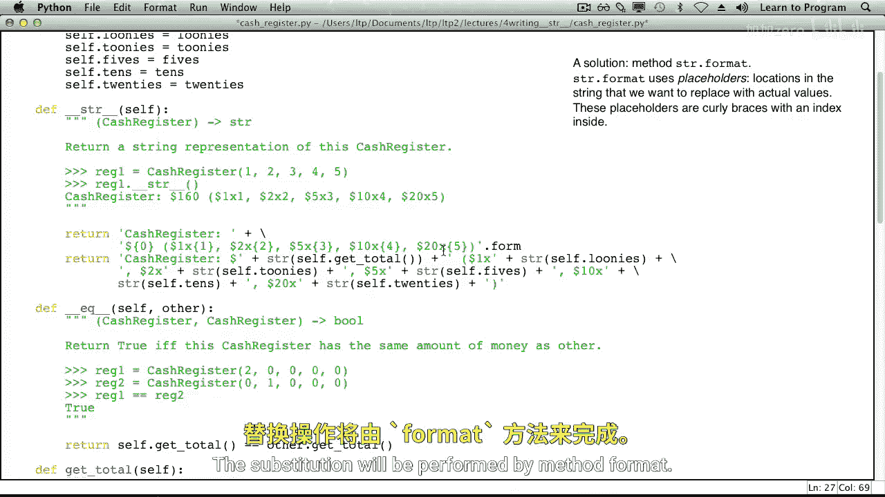
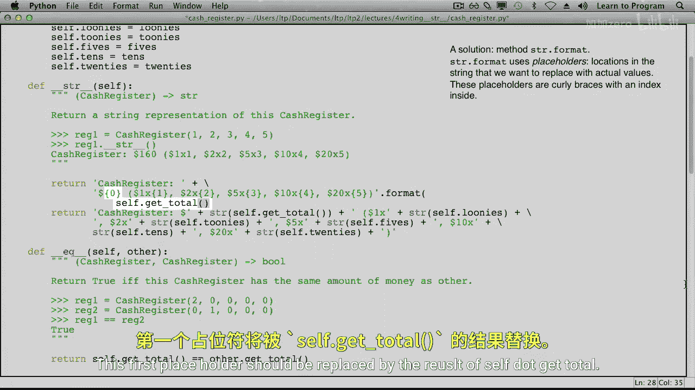
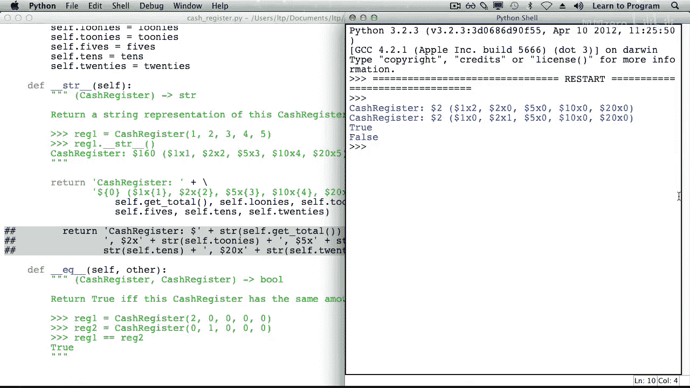

# 023：编写特殊方法 __str__ 🧾

在本节课中，我们将学习另一个特殊的“魔法”方法：`__str__`。这个方法用于控制当我们打印一个对象时，Python 如何将其表示为字符串，使其对人类更友好，而不仅仅是显示内存地址。

上一节我们介绍了 `__init__` 和 `__eq__` 等特殊方法，本节中我们来看看如何让对象在打印时展示更有意义的信息。

---



## 默认的打印行为

我们有一个 `CashRegister` 类，它包含 `__init__`、`__eq__`、`get_total`、`add` 和 `remove` 方法。在代码底部，我们创建了三个收银机对象并打印它们的比较结果。



当我们尝试打印 `cr1` 和 `cr2` 对象时，Python 会输出类似以下的内容：

```
<__main__.CashRegister object at 0x000001A2B357C550>
<__main__.CashRegister object at 0x000001A2B357C990>
```

这种输出显示了对象的类名和内存地址，对于调试可能有用，但对于向用户展示信息并不直观。这是因为 `print` 函数会调用对象的 `__str__` 方法，而默认的 `__str__` 方法返回的就是这种格式。

---

## 实现 `__str__` 方法

`print` 函数会调用对象内部的 `__str__` 方法。因此，我们需要在 `CashRegister` 类中定义这个方法。

以下是 `__str__` 方法的定义框架：
```python
def __str__(self):
    # 方法体：返回一个字符串
```

我们的目标是返回一个像这样的字符串：`"CashRegister: $160 (1, 2, 3, 4, 5)"`，其中数字分别代表各种面额纸币的数量。

**类型约定**：`__str__` 方法接收一个 `self` 参数（即对象本身），并返回一个字符串，作为该对象的“人类可读”表示。

---

## 初始实现与问题



我们最初的实现尝试直接拼接字符串和整数：



```python
def __str__(self):
    return "CashRegister: $" + self.get_total() + " (" + self.loonies + ", " + self.toonies + ", " + self.fives + ", " + self.tens + ", " + self.twenties + ")"
```

运行这段代码会导致 **TypeError**，错误信息是“不能隐式地将‘int’对象转换为‘str’”。这是因为 `self.get_total()` 返回的金额和各个纸币数量都是整数，不能直接与字符串相加。

---

## 修复：使用 `str()` 函数转换

修复方法很简单：使用 `str()` 函数将所有整数显式转换为字符串。

```python
def __str__(self):
    return "CashRegister: $" + str(self.get_total()) + " (" + str(self.loonies) + ", " + str(self.toonies) + ", " + str(self.fives) + ", " + str(self.tens) + ", " + str(self.twenties) + ")"
```

修复后再次运行，输出格式正确了，但代码变得非常冗长且难以阅读和维护。



---

## 优化：使用 `format` 方法



为了使代码更清晰，Python 提供了一个强大的字符串方法：`str.format()`。它允许我们创建一个带有“占位符”的模板字符串，然后轻松地将值填入这些占位符。

以下是使用 `format` 方法优化后的 `__str__` 实现：

```python
def __str__(self):
    # 使用带编号占位符 {0}, {1}... 的字符串模板
    template = "CashRegister: ${0} ({1}, {2}, {3}, {4}, {5})"
    # 使用 format 方法，按顺序传入要替换的值
    return template.format(self.get_total(),
                           self.loonies,
                           self.toonies,
                           self.fives,
                           self.tens,
                           self.twenties)
```

在这个模板中：
*   `{0}` 将被 `self.get_total()` 的值替换。
*   `{1}` 将被 `self.loonies` 的值替换，依此类推。



运行优化后的代码，输出与之前完全相同，但代码的可读性和可写性都大大提高了。



---

## 总结

本节课中我们一起学习了特殊方法 `__str__` 的编写。

1.  **目的**：`__str__` 方法用于返回对象的“人类可读”字符串表示。当调用 `print(obj)`、`str(obj)` 或任何需要对象字符串形式的场景时，Python 会自动调用此方法。
2.  **实现步骤**：在类中定义 `def __str__(self):` 方法，并返回一个格式化的字符串。
3.  **常见问题**：注意处理字符串与数字的拼接，必须使用 `str()` 进行显式转换。
4.  **最佳实践**：使用 `str.format()` 方法可以创建更清晰、更易维护的字符串模板，避免冗长的字符串拼接。



通过实现 `__str__` 方法，你可以让你自定义的类在打印时输出更有意义、对用户更友好的信息，这是编写高质量、易用代码的重要一步。