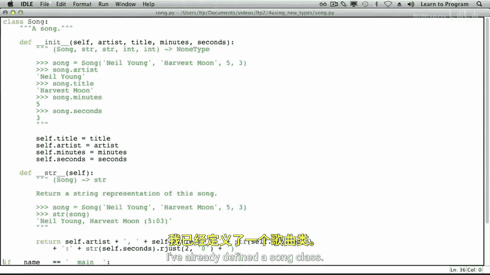
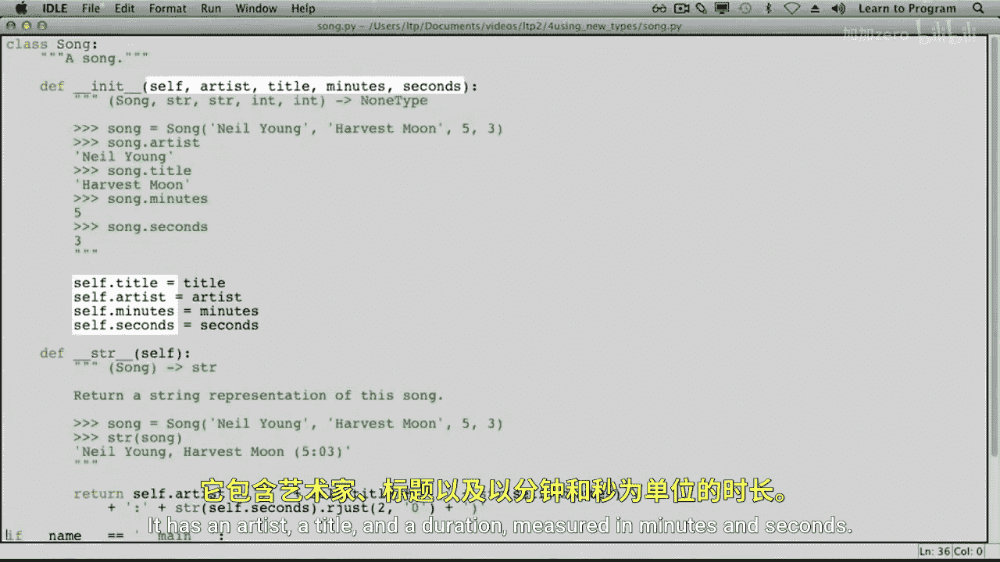
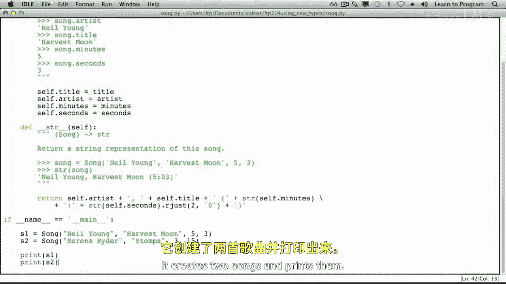
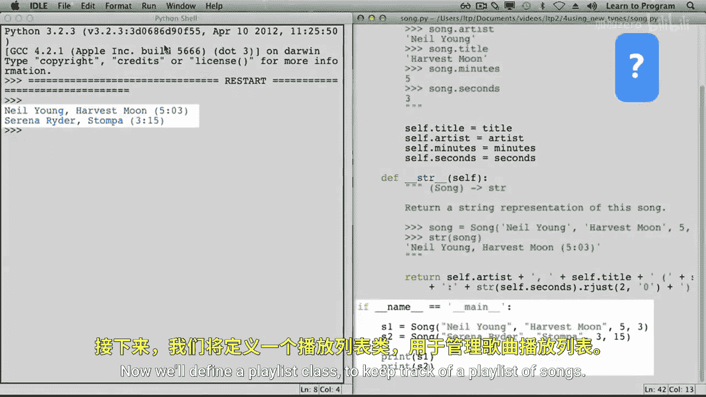
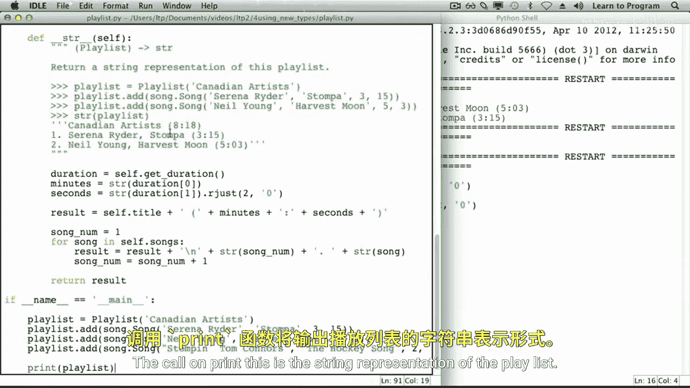

# 024：编写交互类 🎵



在本节课中，我们将学习如何创建相互关联的自定义类型。我们将基于一个已定义的 `Song` 类，创建一个新的 `Playlist` 类来管理歌曲列表，并实现添加歌曲、计算总时长和生成字符串表示等功能。



## 定义 `Song` 类





上一节我们介绍了如何创建自定义类型。本节中，我们来看看如何创建两个相互关联的类型。

首先，我们已经定义了一个 `Song` 类。它包含以下属性：
*   `artist`：艺术家
*   `title`：歌曲标题
*   `duration`：时长（以分钟和秒计）

除了构造函数，该类还有一个 `__str__` 方法，用于返回歌曲的字符串表示形式。

以下是使用该类型的一个小程序，它创建了两首歌曲并打印出来：

```python
# 假设 Song 类已定义
song1 = Song("The Tragically Hip", "New Orleans Is Sinking", 4, 25)
song2 = Song("Neil Young", "Heart of Gold", 3, 7)
print(song1)
print(song2)
```

## 创建 `Playlist` 类

现在，我们将定义一个 `Playlist` 类来管理一个歌曲播放列表。

### 构造函数

我们从定义构造函数开始，它用于设置播放列表的标题。初始状态下，播放列表不包含任何歌曲。

以下是实现思路：
*   标题将通过参数传递给构造函数。
*   我们将使用一个列表来表示播放列表中的歌曲，该列表初始为空。

具体实现时，我们创建两个实例变量：`title` 和 `songs`。

### 添加歌曲的方法

接下来，我们将定义一个 `add` 方法，用于向播放列表中添加歌曲。该方法需要两个参数：播放列表实例本身和要添加的歌曲对象。

由于 `Song` 类定义在另一个模块中，我们需要先导入它。

```python
from song import Song  # 导入 Song 类

class Playlist:
    def __init__(self, title):
        """初始化一个播放列表。"""
        self.title = title
        self.songs = []  # 初始歌曲列表为空

    def add(self, song):
        """向播放列表添加一首歌曲。"""
        self.songs.append(song)  # 使用列表的 append 方法
```

在编写更多代码之前，我们先运行一下现有的代码以确保测试通过。

### 计算播放列表时长

现在，让我们编写一个名为 `get_duration` 的方法，它返回播放列表的总时长（以分钟和秒计）。

计算逻辑如下：
*   播放列表的总时长是其所有歌曲时长的总和。
*   我们将使用两个累加器：一个记录总分钟数，另一个记录总秒数。
*   遍历播放列表中的每首歌曲，获取其 `minutes` 和 `seconds` 属性，并累加到总时长中。

但这里有一个细节需要注意：总秒数可能超过60秒。例如，总秒数为135秒，这相当于2分钟15秒。我们可以通过整数除法（`//`）和取模运算（`%`）来转换。

```python
def get_duration(self):
    """返回播放列表的总时长（分钟， 秒）。"""
    total_minutes = 0
    total_seconds = 0
    for song in self.songs:
        total_minutes += song.minutes
        total_seconds += song.seconds

    # 处理秒数超过60的情况
    total_minutes += total_seconds // 60
    total_seconds = total_seconds % 60

    return total_minutes, total_seconds
```

### 生成字符串表示

最后，我们实现 `__str__` 方法来生成播放列表的字符串表示。它将包含播放列表的标题、总时长以及每首歌曲的艺术家、标题和时长。

以下是构建字符串的步骤：
1.  获取播放列表的总时长。
2.  确保秒数总是以两位数字显示（例如，“07”而不是“7”），我们可以使用字符串的 `rjust` 方法。
3.  遍历歌曲列表，为每首歌添加编号、艺术家、标题和时长。
4.  将所有部分组合成一个完整的字符串并返回。

```python
def __str__(self):
    """返回播放列表的字符串表示。"""
    mins, secs = self.get_duration()
    secs_str = str(secs).rjust(2, '0')  # 确保秒数是两位数

    result = f"{self.title} ({mins}:{secs_str})\n"
    song_num = 1
    for song in self.songs:
        # 添加歌曲编号和信息
        result += f"{song_num}. {song}\n"
        song_num += 1
    return result
```

## 综合示例

让我们将所有部分组合起来，编写一个小程序来创建一个包含三首加拿大艺术家歌曲的播放列表并打印它。

```python
# 创建播放列表并添加歌曲
canadian_artists = Playlist("Canadian Artists")
canadian_artists.add(Song("The Tragically Hip", "New Orleans Is Sinking", 4, 25))
canadian_artists.add(Song("Neil Young", "Heart of Gold", 3, 7))
canadian_artists.add(Song("Alanis Morissette", "Hand in My Pocket", 4, 39))

# 打印播放列表（将自动调用 __str__ 方法）
print(canadian_artists)
```

调用 `print` 时会使用播放列表的 `__str__` 方法，因此我们将看到播放列表的标题、总时长以及按添加顺序排列的三首歌曲的详细信息。



本节课中我们一起学习了如何创建相互关联的类。我们基于 `Song` 类构建了 `Playlist` 类，并实现了添加歌曲、计算总时长和生成格式化字符串表示等核心功能。这展示了如何通过组合简单的类型来构建更复杂、更有用的数据结构。