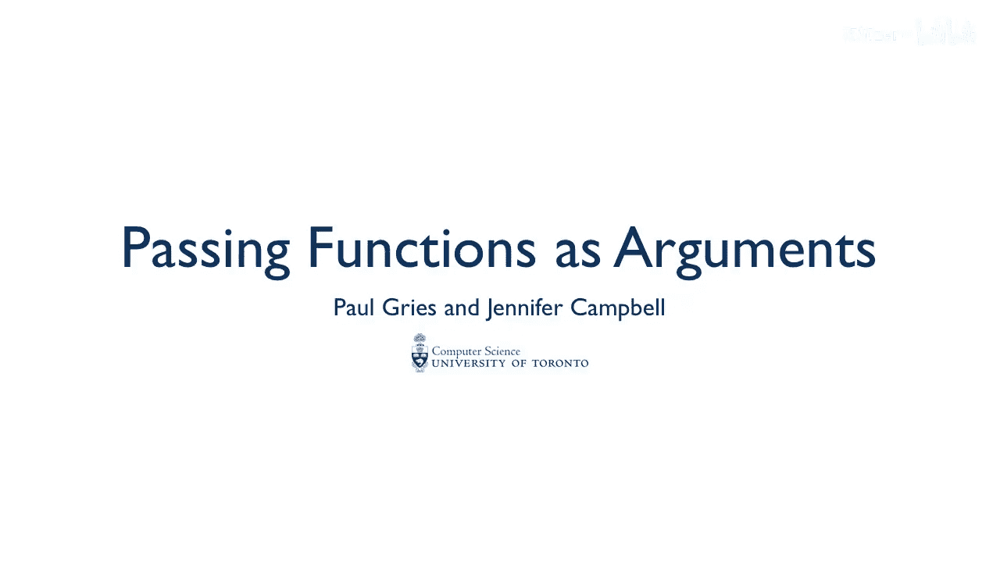
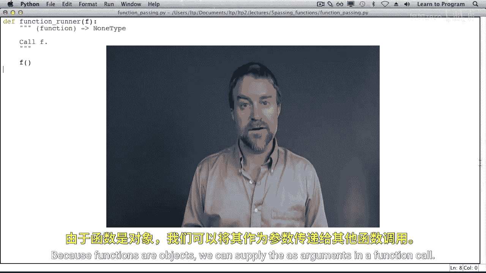
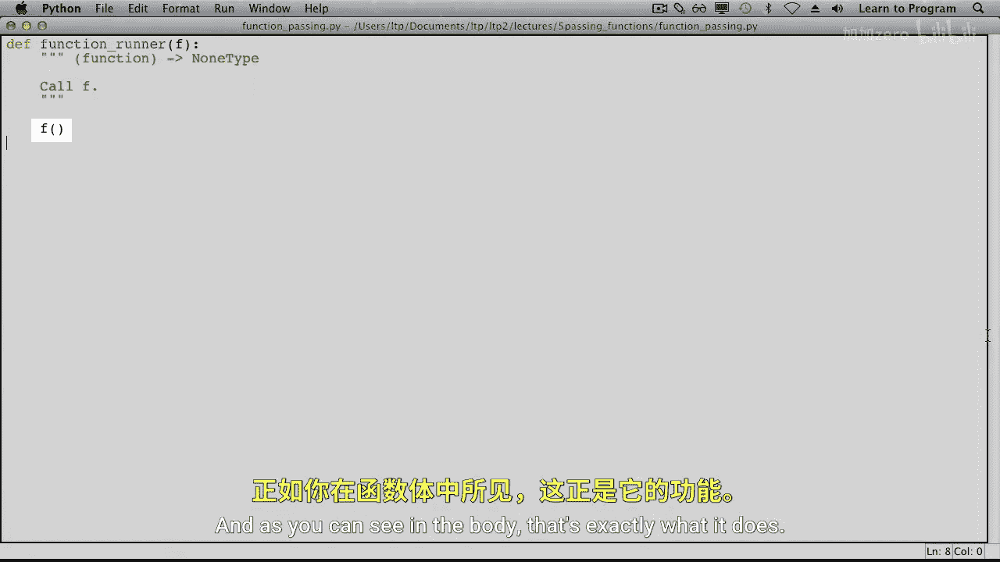
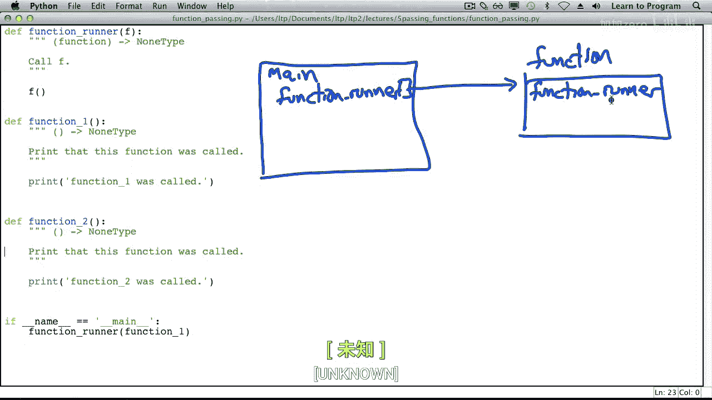
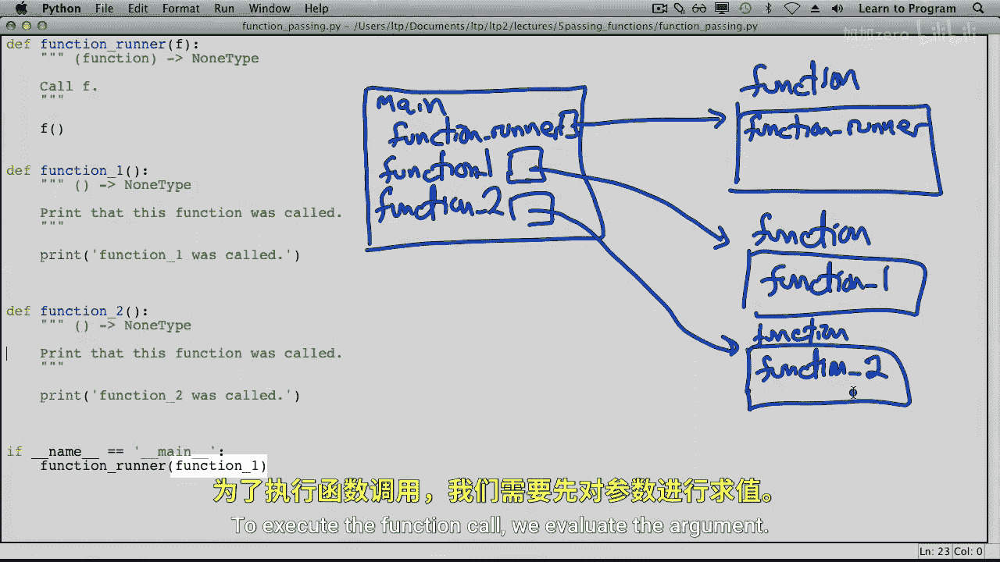
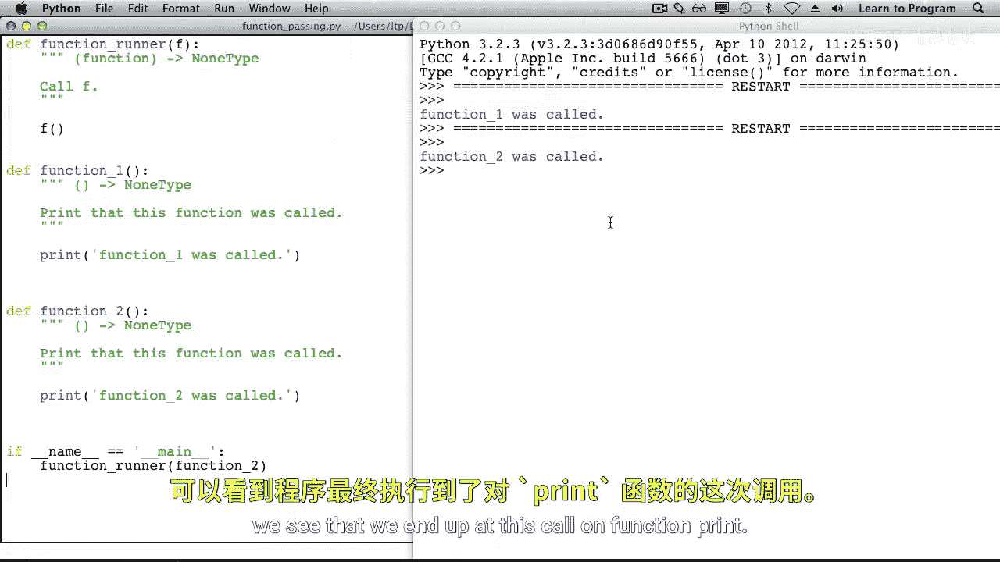

# 025：将函数作为参数传递 🧩



在本节课中，我们将学习Python中一个强大的特性：将函数作为参数传递给其他函数。理解这个概念是迈向编写更灵活、更高质量代码的重要一步。

---



## 函数也是对象

在Python中，函数和所有其他元素一样，都是对象。这意味着函数可以像整数、字符串或列表一样被赋值给变量、存储在数据结构中，以及作为参数传递给其他函数。



因为函数是对象，所以我们可以在函数调用中将它们作为参数提供。

---

## 定义接收函数作为参数的函数

上一节我们介绍了函数作为对象的概念。本节中我们来看看如何定义一个接收函数作为参数的函数。

以下是一个名为 `function_runner` 的函数。它有一个参数 `f`。参数 `f` 的类型是函数。

`function_runner` 会调用 `f`，从其函数体可以看到，它正是这样做的。

```python
def function_runner(f):
    f()
```

---



## 创建并传递函数

现在，我们来创建几个简单的函数，稍后将它们传递给 `function_runner`。

以下是两个我们将要传递给 `function_runner` 的函数定义。为了演示，这两个函数内部只打印一条信息，表明该函数被调用了。

```python
def function_one():
    print("Function one was called.")

def function_two():
    print("Function two was called.")
```



---

## 程序执行流程分析

接下来，我们通过调用 `function_runner` 并传递 `function_one` 作为参数，来追踪程序的执行流程。

```python
if __name__ == "__main__":
    function_runner(function_one)
```

当程序开始运行时，会为模块创建一个栈帧。每个函数定义都会创建一个与函数同名的变量，该变量存储着一个函数对象的内存地址。这个函数对象包含了调用该函数时所需的所有细节。

1.  定义 `function_one` 时发生上述过程。
2.  定义 `function_two` 时也发生相同的过程。
3.  然后程序到达 `if __name__ == "__main__":` 语句，其内部调用了 `function_runner`。
4.  为了执行这个函数调用，Python首先计算参数 `function_one`，它得到的是函数对象的内存地址。
5.  接着，Python为 `function_runner` 创建一个新的栈帧。参数 `f` 在这个栈帧内被赋值为传入的函数（`function_one`）的内存地址。
6.  执行 `function_runner` 的函数体，即调用函数 `f()`。
7.  为这次调用（实际上是 `function_one`）创建一个新的栈帧。虽然栈帧上可能标记为 `f`，但实际执行的函数体来自 `function_one` 的定义。
8.  在 `function_one` 的函数体内，执行 `print` 函数调用。
9.  `function_one` 执行完毕，退出其栈帧，返回到 `function_runner`。
10. `function_runner` 也执行完毕，退出其栈帧，返回到主程序。
11. 主程序结束，整个程序退出。

当我们追踪这段代码时，最终会执行一次 `print` 函数调用。运行程序，我们得到了预期的输出。

当我们把传递给 `function_runner` 的参数从 `function_one` 改为 `function_two` 时，程序流程会导向 `function_two` 内部的 `print` 调用，从而输出不同的结果。

---

## 总结



本节课中我们一起学习了Python中将函数作为参数传递的核心概念。我们了解到函数在Python中是对象，因此可以像其他数据一样被传递。我们通过定义 `function_runner` 函数，并创建 `function_one` 和 `function_two` 作为示例，详细分析了函数作为参数传递时的程序执行流程。掌握这一特性，能够让你编写出更通用、更模块化的代码。