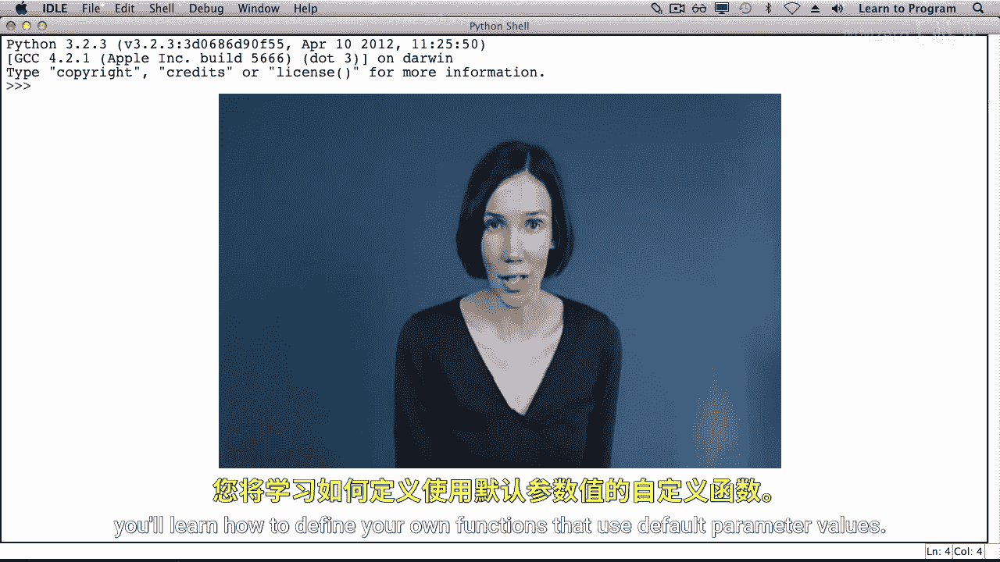
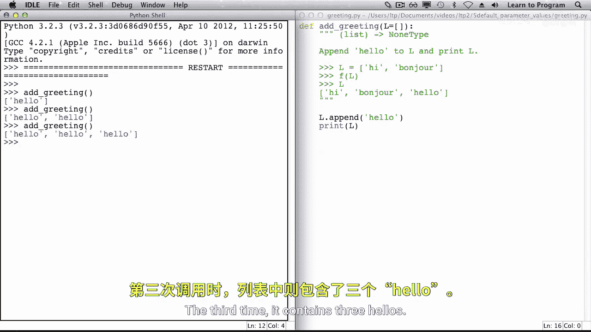
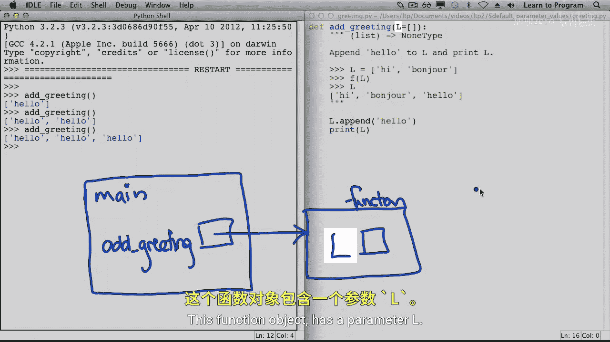
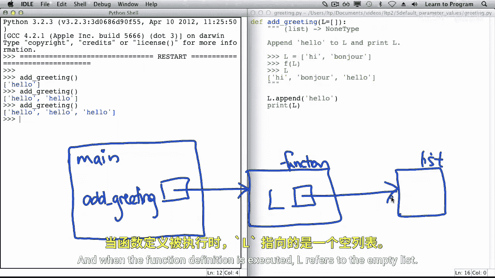
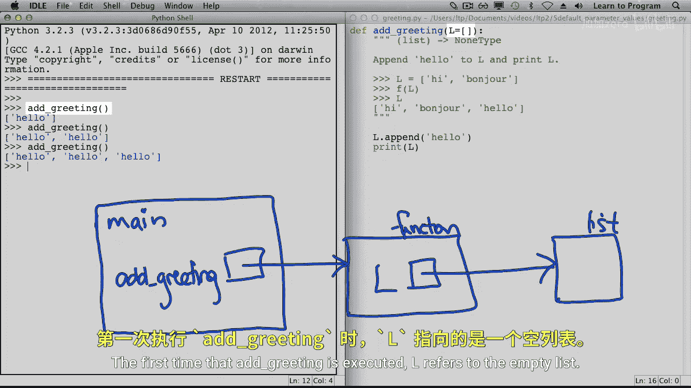
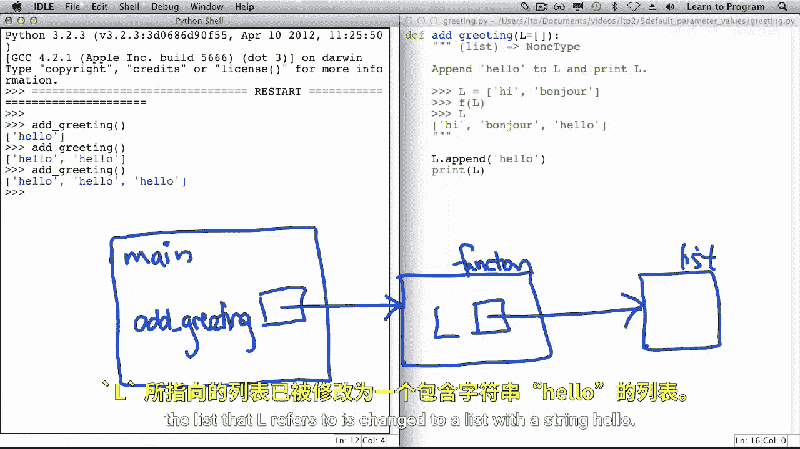
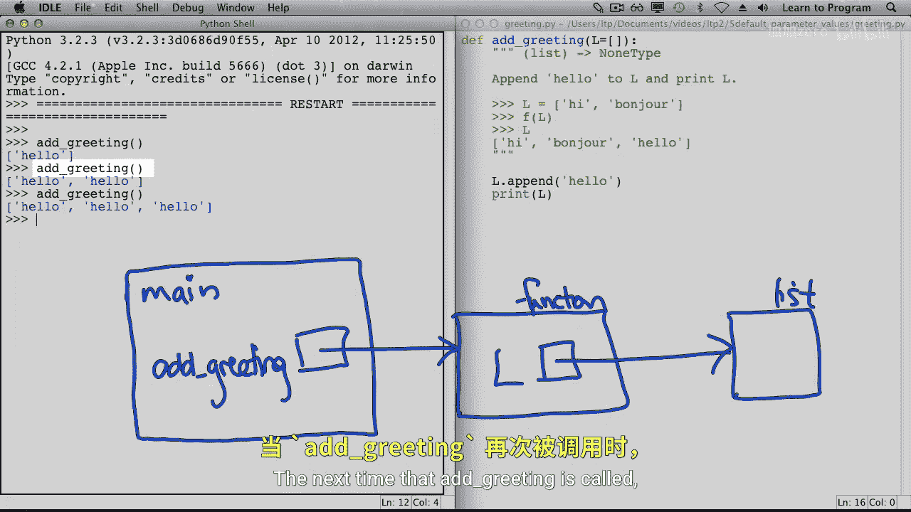
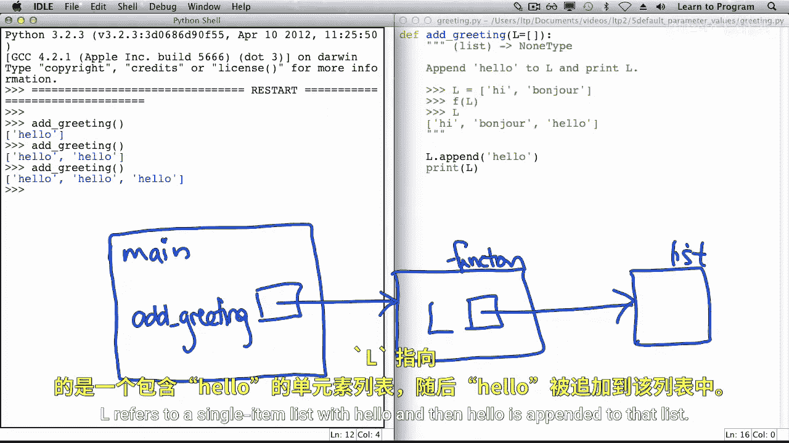
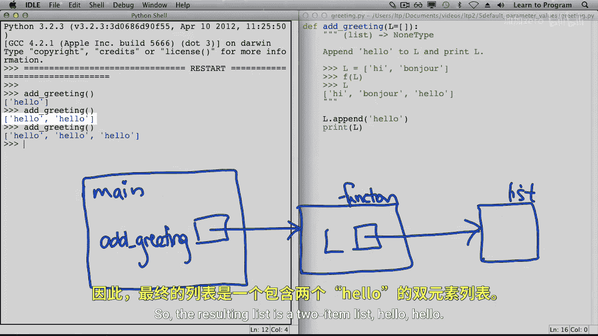
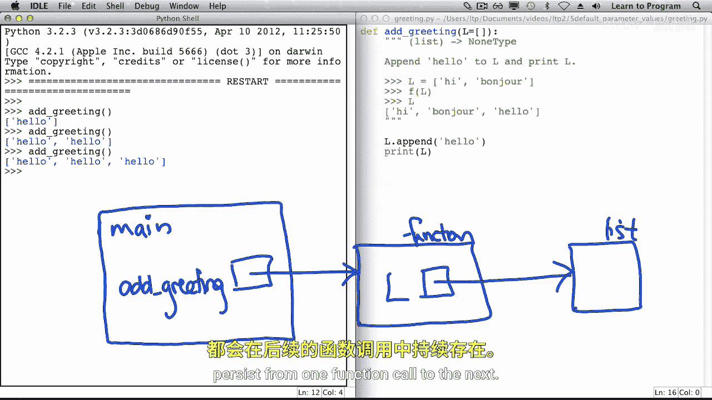

# 026：为参数指定默认值 🎯


在本节课中，我们将学习如何为函数参数指定默认值。这允许我们在调用函数时，不必为每个参数都提供值，从而让函数调用更加灵活。



## 概述

当我们调用 `print` 和 `range` 等函数时，传递的参数数量可以变化。如果我们没有为每个参数都提供值，那么将使用参数的默认值。本节将教你如何定义使用默认参数值的自定义函数。

## 探索 `print` 函数的参数

让我们从探索 `print` 函数的参数开始。`print` 函数有多个参数。首先，我们传递想要打印的值。接着，我们传递分隔符，其默认值是一个空格。换句话说，如果我们打印多个值，这个字符将被放在它们之间。之后，我们指定 `end` 参数，它是在所有值打印完毕后显示的字符串。最后，我们还可以选择性地指定 `file` 参数，即数据将被打印到的位置，默认是标准输出。

让我们调用 `print` 函数。如果我们不传递任何参数，则会打印一个空行，这是 `end` 参数的默认值。当我们打印单个值时，该值被打印出来，后面跟着一个换行符。如果我们打印多个值，它们之间会用空格分隔，并在末尾添加一个换行符。

让我们再次打印 `1, 2, 3`。这次，我们将 `sep` 参数指定为两个句点，并将 `end` 参数指定为感叹号字符串。这些字符串将替代默认的参数值。

## 定义带默认参数值的函数

现在，让我们定义一个具有默认参数值的函数。我们将定义一个名为 `every_nth` 的函数。第一个参数是一个列表，第二个参数是一个整数。该函数的作用是从原始列表中创建一个包含每隔 N 个元素的新列表。

以下是函数的实现代码：

```python
def every_nth(lst, n=1):
    """
    返回一个新列表，包含原列表中每隔 n 个元素。
    """
    return lst[::n]
```

我们尚未引入默认参数值，因此这两个函数调用都需要传递两个参数。现在，我们将为参数 `n` 指定默认值 1，并在文档字符串中添加第三个示例，该示例仅使用一个参数（列表）调用 `every_nth`。

注意，在文档中，我们两次使用两个参数调用它，一次仅使用一个参数调用。当传递第二个参数时，我们也可以指定它与哪个参数相关联。对于具有多个默认参数值的函数，使用这种表示法是为了将参数与正确的参数关联起来。

## 可变对象作为默认参数值

让我们看第二个例子，其中默认参数值是可变的。在这种情况下，函数有一个参数，其默认值是空列表。这个函数只是将字符串 “hello” 追加到列表中，然后打印该列表。

以下是示例代码：

```python
def add_greeting(lst=[]):
    lst.append("hello")
    print(lst)
```



第一次调用该函数时，列表包含一个字符串 “hello”，这符合我们的预期。然而，第二次调用该函数时，列表包含两个 “hello”。第三次调用时，它包含三个 “hello”。



## 理解可变默认参数的行为



正如你在之前的课程中学到的，变量 `add_greeting` 包含一个函数对象的内存地址。这个函数对象有一个参数 `lst`。当函数定义被执行时，`lst` 引用空列表。





第一次执行 `add_greeting` 时，`lst` 引用空列表。但在函数调用结束时，`lst` 引用的列表被更改为包含字符串 “hello” 的列表。





下一次调用 `add_greeting` 时，`lst` 引用一个包含 “hello” 的单元素列表。然后 “hello” 被追加到该列表中，因此结果列表是一个包含两个 “hello” 的列表。



这里要学习的教训是：**默认参数值在函数定义时被赋值**。当函数被调用时，函数调用对可变对象所做的任何更改都会从一个函数调用持续到下一个函数调用。

## 总结



在本节课中，我们一起学习了如何为函数参数指定默认值。我们探索了 `print` 函数的参数，定义了带有默认参数的自定义函数，并深入理解了当默认参数值为可变对象（如列表）时可能出现的意外行为。记住，默认值在函数定义时计算一次，这对于可变对象尤为重要。