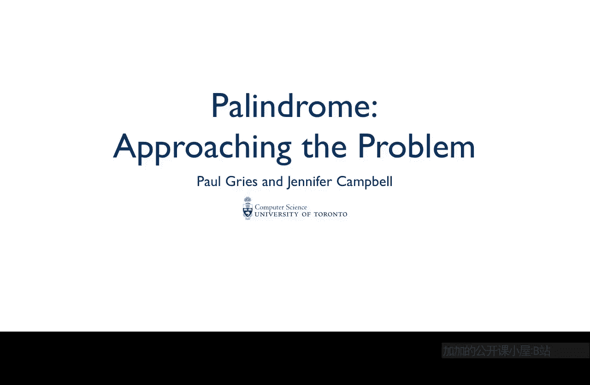
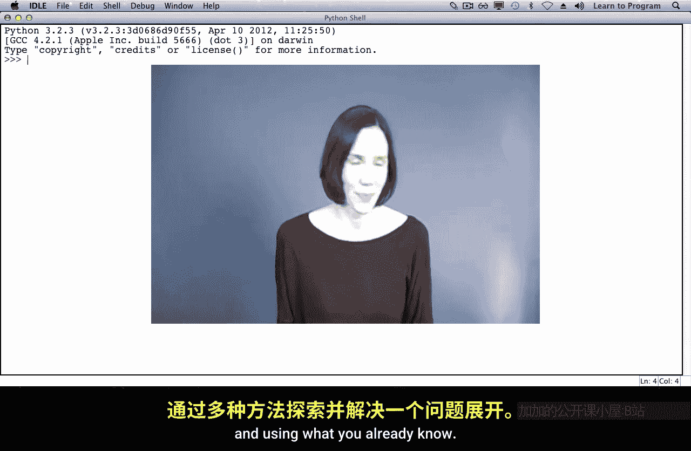
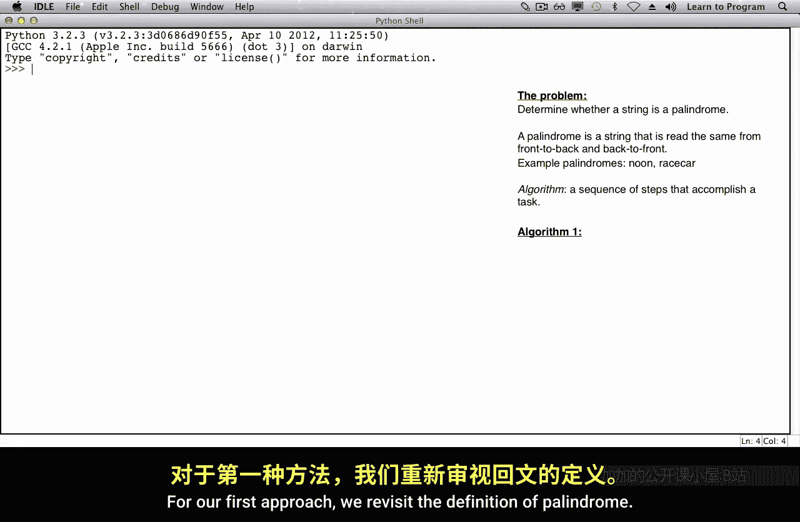
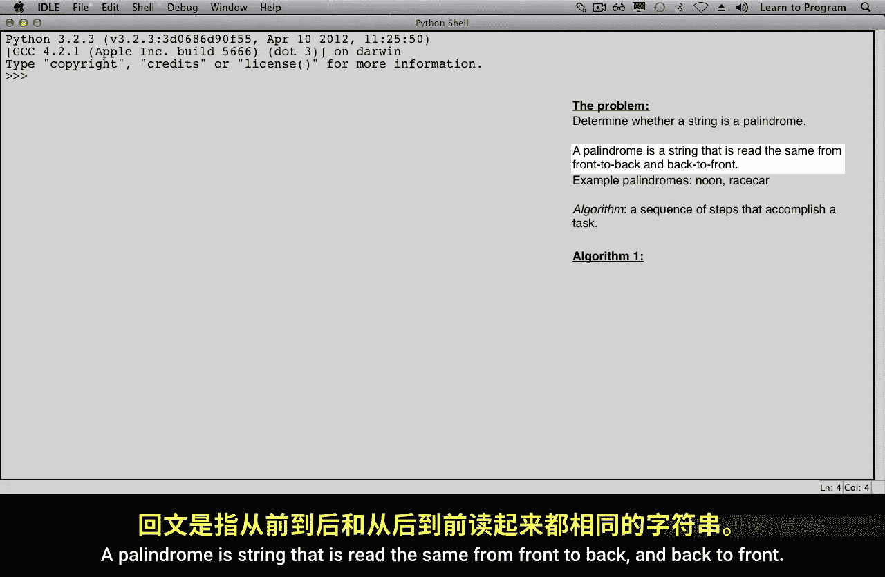
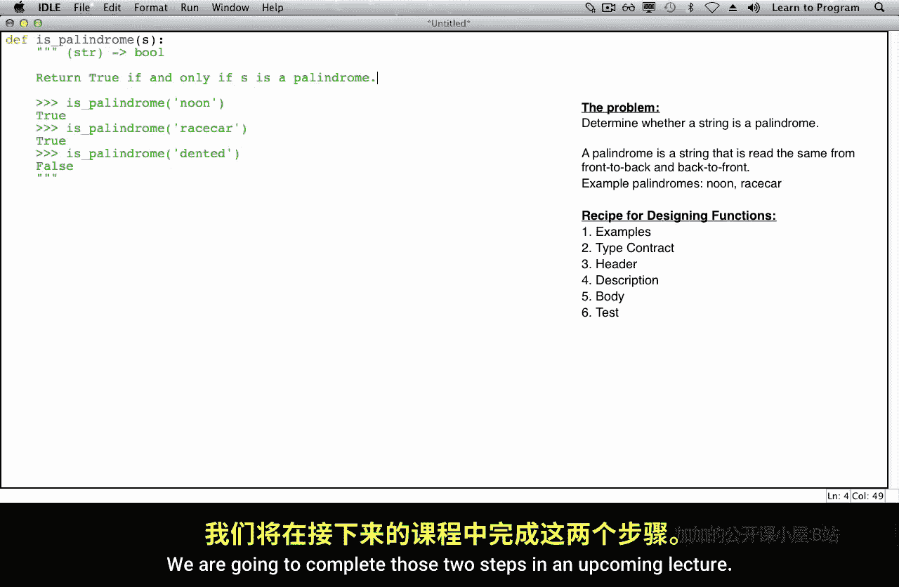

# 多伦多大学【中英⚡编程入门：编写高质量代码｜Learn to Program： Crafting Quality Code】 p01 P1 01_回文——问题解决之道 -BV1QuJVzpEKE_p1-

You're familiar with several of Python's types， including strings， lists， tuples and dictionaries。

You also know how to use a variety of operations， methods， conditional statements and loops。

This lecture isn't about learning any new Python features。

It's about solving a problem by exploring several approaches to it and using what you already know。

In this lecture， we're going to focus on a single problem。

The problem is determining whether a string is a palindrome。

A palindrome is a string that is read the same from front to back and back to front。For example。

 noon and race car are both palindromes。Before we start to write any code。

 we need to decide which approach we'll take to solve this problem。

We're going to explore several different approaches for determining whether a string is a palindrome。

These approaches are called algorithms， and algorithm is a sequence of steps that accomplish a task。

For our first approach， we'll revisit the definition of palindrome。

A palindrome is a string that is read the same from front to back and back to front。

That means that we have a string and we reverse it。

It's a palindrome if the original and the reverse are the same。Let's consider a couple of examples。

 The first example is noon。At noon reversed。We begin with the last letter in the original becoming the first letter in the reverse string。

And so on。The original string and the reverse string are the same。 So this is a palindrome。Next。

 let's look at race car。We begin by reversing the string。The R becomes the first letter。4our by a。

And the original string and the reverse string aren't equal， so this is also a palindrome。

One more example。Dentted。We begin by reversing the string。D4 by E。This time。

 the two strings are not the same， so this is not a palindrome。

Now we'll take a different approach to solving this same problem。

We're going to start this time by splitting the string into two halves。

We will then reverse the second half of this string。So O will become N。Oh。

We compare the first half of the original string with the second half reversed。 If they're the same。

 the strings of palindrome。We'll do this again for race car。Braacecar has an odd's length。

 so it's not clear which half the E should belong in。

We're actually not going to include it in either， we're going to take the string。

Half of this string before E and the other half of the string after E and omit the E altogether。

We'll then reverse the second half。Getting R。A。And compare the first half of the original with the second half reversed to confirm that it's a palindrome。

Finally， we'll do the same thing for dented。We split the string in half。Reverse the second half。

Compare the first half to the second half reversed。And this time they're not the same。

 so this is not a palr。Let's consider one more approach。In this approach。

 we're going to compare pairs of characters。 we'll start by comparing the first character to the last。

To see whether they're the same， Then we compare the second character to the second last。

 And we stop when we reach the middle of the string。If all of the pairs of characters are the same。

 then the strings of palindrome。Let's do the same thing for race car。

We begin by comparing the first character to the last。Then the second to the second last。

 third to the third last， stopping when we reached the middle of the string。

All of the pairs of characters are the same， so this is also a palindrome。And finally， thened。

In this case， the first two pairs of characters are the same。

But the third character is not the same as the third last。 So this is not a palindrome。

There may be other approaches to solving this problem， but these are three that we thought of。

In upcoming lectures， we'll discuss some features of algorithms that might make one more desirable than another。

For now， though， we'll implement all three of these algorithms。

Now let's follow the steps of the function design recipe to implement this function。

I'm going to open a new window in which to write the function definition。

The first step of the function design recipe involves writing example calls on the function in the dock string。

To do this， we need to give the function a name， I'm going to call it is palindrome。

The function will take one string argument such as noon。

And return a bullolean indicating whether that string is a palindrome， in this case， it returns true。

It should also return true。For the string race car。

And we expect that when is palindrome is called with the argument dented， that it will return false。

Next， we'll write the type contract。This function takes one string。And returns a Boolean。

The third step of the function design recipe is writing the header。We're using name is palindrome。

And we need to give a name out to the parameter to this function。I'm going to call it S。

The last part of the dock string is the description。This function should return true， if and only if。

S is a palindrome。The last two steps of the function design recipe involve writing the body of the function and then testing the function。

 we're going to complete those two steps in an upcoming lecture。

