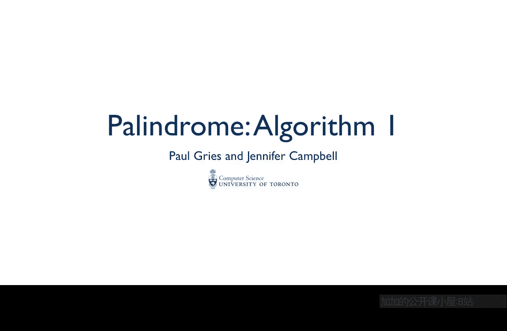
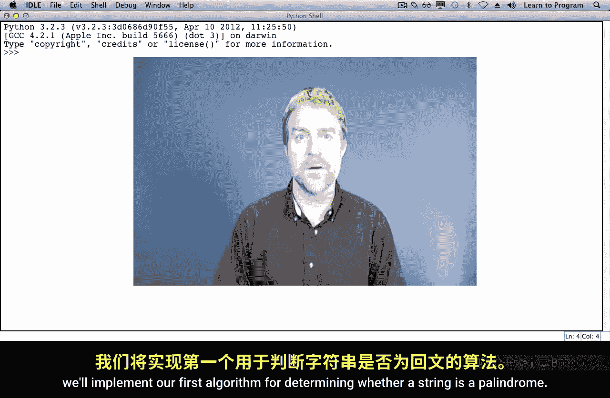
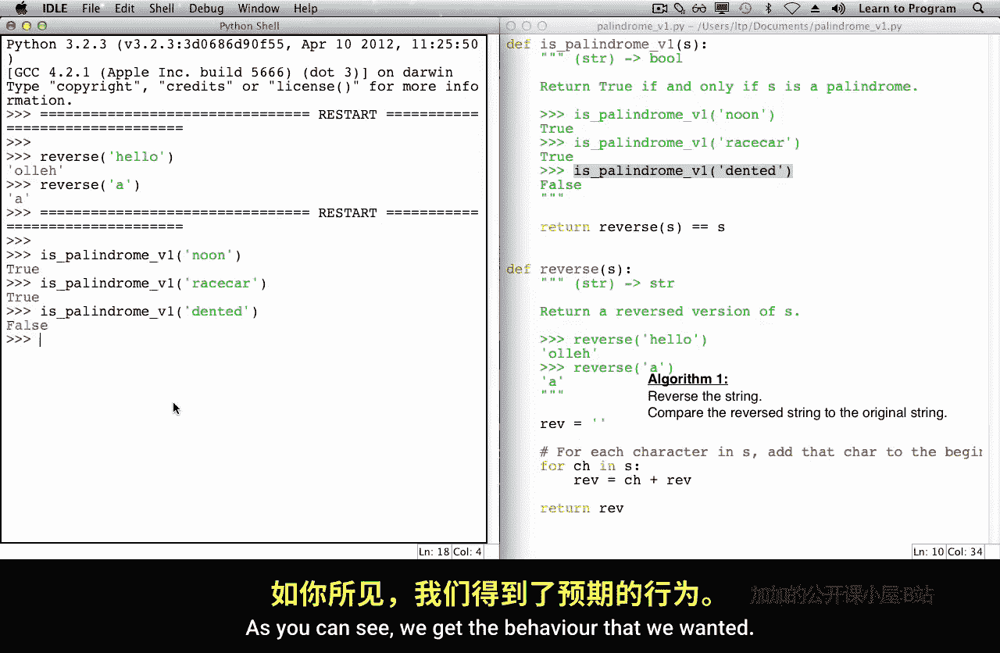

# 多伦多大学【中英⚡编程入门：编写高质量代码｜Learn to Program： Crafting Quality Code】 p02 P2 03_回文算法-1 -BV1QuJVzpEKE_p2-

In this lecture， we'll implement our first algorithm for determining whether a string is a palindrome。

Here is what we've come up with so far following our design recipe。In this first algorithm。

 we reverse the string and then compare that reversed string to the original string。For example。

If I have the word noon， what we're going to do is we're going to build up。A reverse。

Of this whole string。And then we're going to compare whether this new string is equal to the original string。

Unlike for type list， there is no reverse method for strings。

 So we're going to start by writing a helper function that will reverse a string。

We know we're going to be defining a function， we don't know what we're going to call it yet。

But following our design recipe。We're going to start by making some examples。Here's one。We might。

 for example， decide that we're going to reverse something like hello。When we reverse hello。

 we expect to get back OLLEH。When we reverse the string A， we hope to get back A。Our type contract。

In both examples， we have given it a string and it has produced。That's trick。Name reverse seems fine。

 so let's fill in our header。We'll use S because the string is generic。 There's no meaning to it。

Next is the description。This is going to return。A reversed version of S。

As we saw in our handwritten example up there， we accumulated a new string。

We'll start our accumulator rev for reverse， that's going to start out as the empty string because we haven't accumulated anything yet。

And now we run into a little problem。What we did in our example by hand is this was the first character we grabbed。

 This was the second character we grabbed。 This was the third one。

 and this was the last one as we copied them over to the new string。

But Python's for loop over a string doesn't work that way。

 So we're going to modify what we wrote slightly。 Instead。

 we're going to start with n as the first character and。

What we'll do is we'll just write it in our accumulated string。

 and it's going to end up at the last character。 Then we're going to grab the O and we're going to preend it。

And then the third， the second o and prepend that， then the last end and prepend that to our accumulator。

 So we're following roughly the same approach。 We're just doing it from the other end。In English。

For each。Character。In， add that care to the beginning。Of。Oh we're accumulator。

Now that we have that description， the algorithm is almost directly translatable to Python。

For every character in string， what we're going to do is we're going to。

Add that character to the beginning。Of our accumulator。And at the very end。We're done。

 we've accumulated everything and we'll return that new string。It's time to test it。

Let's go and run our module。Save our program。And。Copy over our two doc tests。

And they indeed do what we hoped they would do。Now that we have our reversed strength。

What we want to do for is palindrome is we would like to reverse S and compare it to S。

That's the result。Of whether it's a palindrora。So what we want to know is。Hey， when we reverse S？

Is that equal to S。Can it be that simple。Let's try it。We need again to run our module。And then。

Try out our three calls on。Is palinor。Yeah。As you can see。

We get the behavior that we wanted。