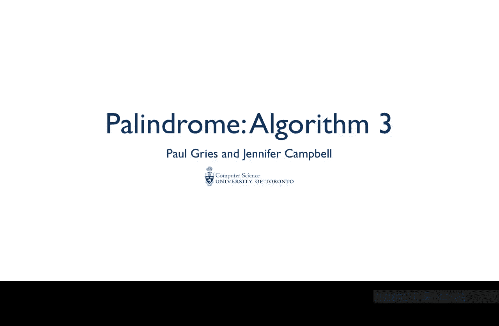
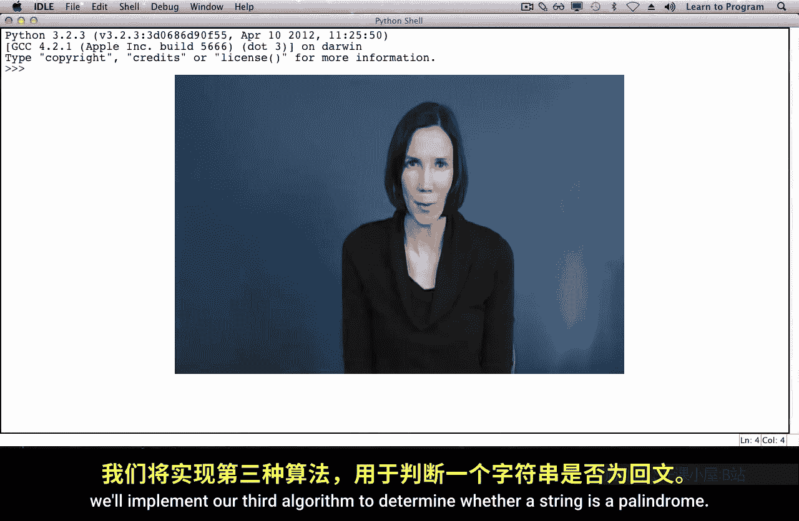
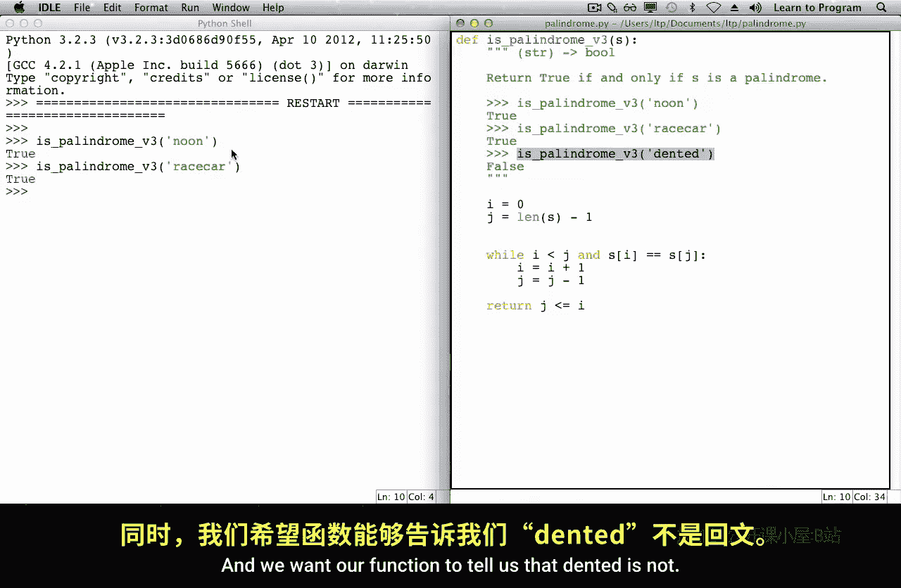

# 多伦多大学【中英⚡编程入门：编写高质量代码｜Learn to Program： Crafting Quality Code】 p04 P4 07_回文算法-3 -BV1QuJVzpEKE_p4-

In this lecture， we'll implement our third algorithm to determine whether a string is a palindrome。

In an earlier lecture， we completed the first four steps of the function design recipe。

The next step is implementing the body of the function。

This algorithm involves comparing pairs of characters。

The character at index0 is compared to the character at the last index。

 the second to the second last。Third to third， last。Until the middle of the string is reached。

To implement this algorithm， we're going to use two variables to keep track of the indices of the characters to compare。

I will initially refer to the first index of the string。

 and J will initially refer to the last index of the string。

Here's a picture of this starting situation。This rectangle represents the string。Initially。

 I refers to index 0 and J to the last index of the string。

 And those are the first two characters compared。As we progress。

 I and J move closer to the middle of the string。As we compare these pairs of characters。

 when we find two characters that are not the same。

 we can conclude at that point that the string is not a palindrome。Let's start to implement this。

We'll use a while loop to keep comparing pairs of characters as long as the character of the string and index I is equal to the character of the string and index J。

In the body of the while loop， we are going to increase index i by one to move on to the next character。

And decrease index J by1。At this point， our program only stops comparing pairs of characters when it finds two characters that are not the same。

But what if we have a palindrome， all of the pairs of characters would be the same。And in that case。

 we need to stop when the middle of the string is reached。For an odd length string like race car。

 the middle of the string is reached when indices I and J are equal。

What about for a string that has an even length like noon？When we compare these pairs of characters。

The last pair of characters to be compared are the ones at index 1 and index 2。

I's value would be increased to become index 2， and then J's value would be increased to become index1 at that point we'd need to stop。

 so we stop when I and J are next to each other， but J is less than I。

So here's the stopping situation for the even case， we stopped when J is less than I。

This is for even length strength。And this is for oddline string。

We've determined that the middle of this string is reached when J is less than or equal to I。

 In other words， we want to keep going as long as I is less than J。

 will'll add this condition to our while loop now。We've almost finished our program。

After the while loop has exited， we need to return the appropriate value either true or false。

This return statement is reacheded when the wild loop condition has become false。

 and there are two reasons why it might be false。The first is that the middle of the string was reached。

And the second is that a pair of characters that were not equal to each other was found。

If the middle of this string is reached， then this string is a palindrome。

 If the middle of the string wasn't reached， then the string isn't a palindrome。

We know that the middle of the string is reached when I is equal to J in the odd case。

 or J is less than I in the even case。 In other words。

 the middle is reached when J is less than or equal to I。 So we'll return that expression。

When this expression is true， the middle of the string is reached and we found a palindrome。

 when it's false， the middle of the string hasn't been reached， so we haven't found a palindrome。

Now that we've implemented the body of the function。

 it's time to complete the last step of the function design recipe and test the function。

We'll run the module and call the function from the Python shell。

We want to confirm that each of the function calls returns the value that we expect。

Noon and race car are palindromes。And we want our function to tell us that vented is not。

