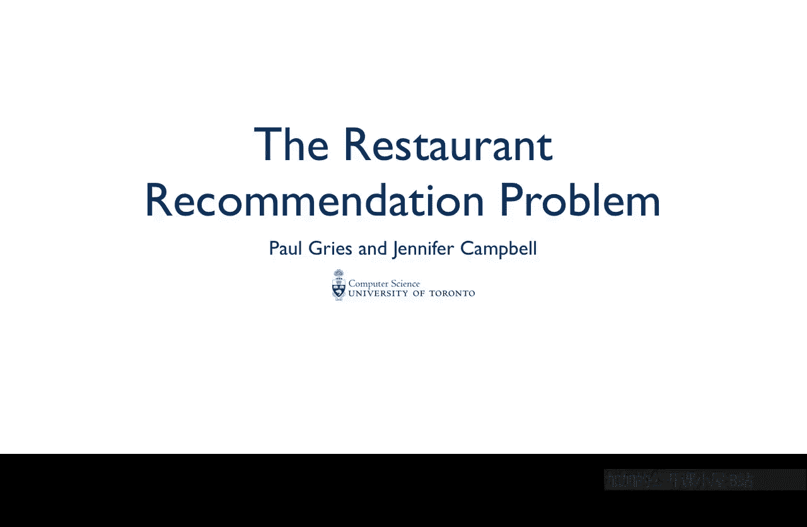
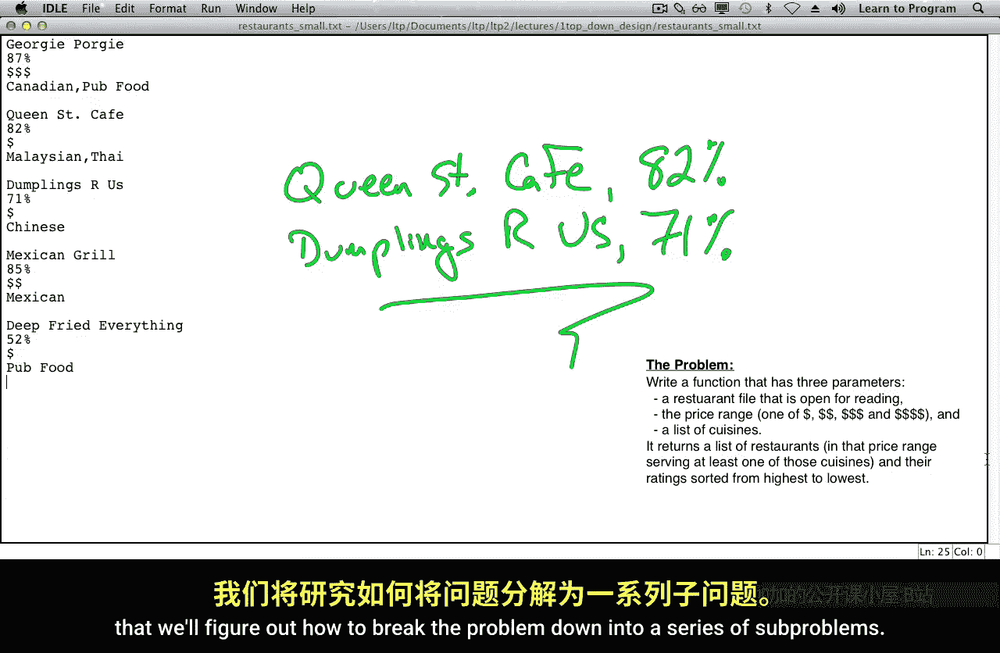

# 多伦多大学【中英⚡编程入门：编写高质量代码｜Learn to Program： Crafting Quality Code】 p05 P5 01_餐厅推荐问题 -BV1QuJVzpEKE_p5-

Usually， people learning to programme are given exercises where a function name。

 parameters and return type are decided for them。 and the function is fairly straightforward。

 Presumably， most of you have had this experience。The next step is for you to choose when to write functions yourself。

 figuring out what data they need and what they should return in the next set of videos will' lead you through this process。

 giving you tips on how we make these choices。 And along the way as an added bonus。

 you'll get more practice with dictionaries， lists and files。

The problem will be tackling as a restaurant recommendation system。Here is a list of restaurants。

 including the name of the restaurant。The percentage of people who liked the restaurant。

The price range of the restaurant and the cuisines of food that the restaurant serves。

$1 means that a meal doesn't cost much money。$4 indicates a very expensive restaurant。

There are a lot of websites that give recommendations for restaurants based on the price range that someone searching for or the kinds of food that they want。

We're going to do something similar with a smaller file that is just going to be on our own computer。

 but it'll give you an idea of how these websites do the job they do。

The programme we're going to design will make recommendations to a user based on this data。

We'll tell you a bit about the main function， but this task is complex and helper functions will make writing the main function much easier。

Here's the problem。Write a function that takes the open restaurant file， a price range。

 and a list of cuisines。 It's going to return a list of restaurants and their ratings sorted by ratings from highest to lowest。

Let's do an example， starting with even fewer restaurants。

 So there isn't that much data to keep track of。Let's say you're interested in cheap。

 Chinese or Thai。Well， the cheap restaurants， are Queen Street Cafe Dlings are us。

And deep fight everything。Of those， deep fried everything serves pub food and not Thai or Chinese。

That leaves Queen Street Cafe and Dumplings Z us。The higher rated one is Queen Street Cafe。

 and so will want to return a list like this。In the next video。

 we'll explore how we're going to keep track of all this data in Python。 and in the video after that。

 we'll figure out how to break the problem down into a series of sub problems。

