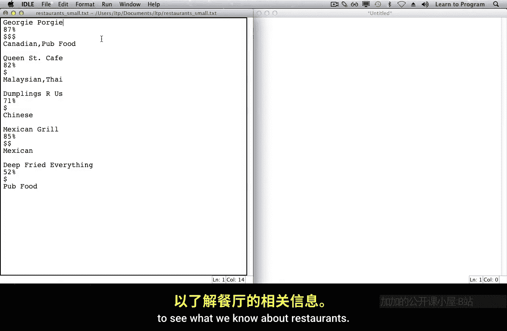
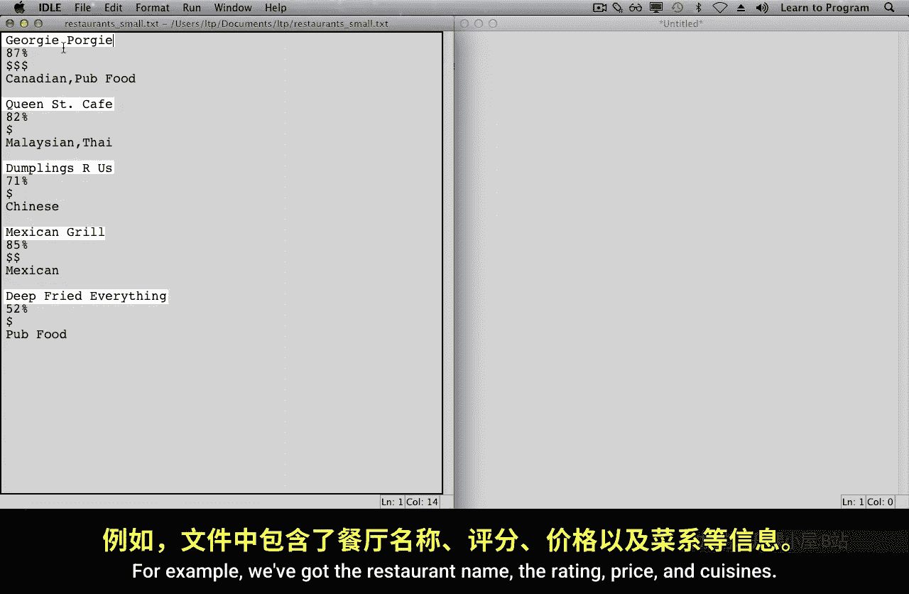
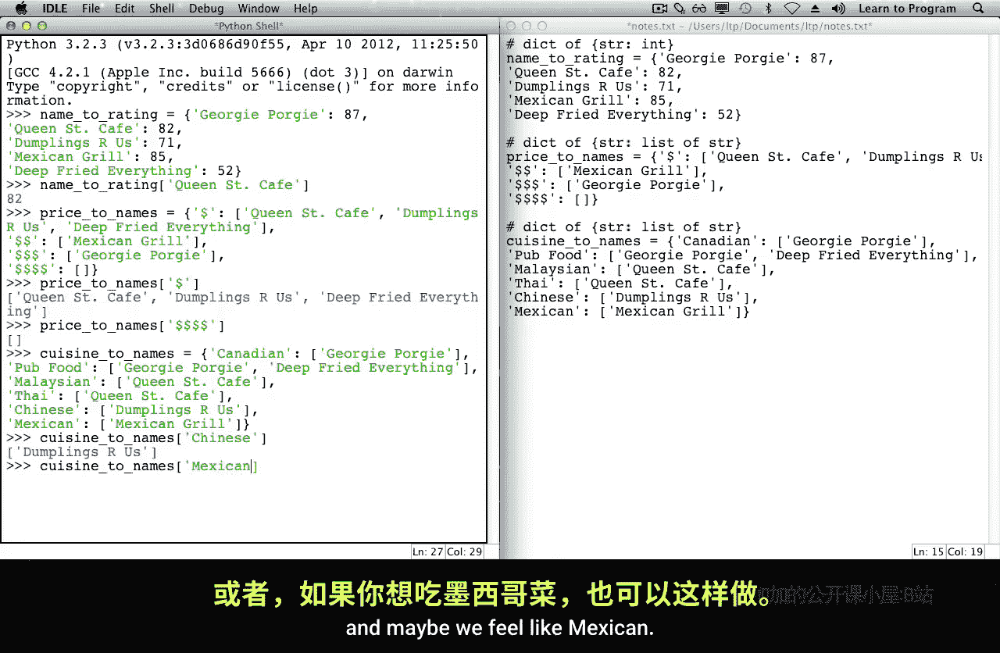

# 多伦多大学【中英⚡编程入门：编写高质量代码｜Learn to Program： Crafting Quality Code】 p06 P6 03_餐厅推荐-数据表示 -BV1QuJVzpEKE_p6-

Now that you've been introduced to the restaurant recommendations problem。

 it's time to start planning your program。The first step will be choosing the data structures that you'll use to store information about restaurants。

 prices， ratings， and cuisines。

To begin， let's take another look at this restaurant information file to see what we know about restaurants。

For example， we've got the restaurant name， the rating， price and cuisines。

 we're going to want to store information about those things。

For each restaurant， for example， we're going to want to be able to look up the rating。

So we'll keep track of this information， I'll make some notes to indicate that。

What else should we keep track of？Each restaurant has a price。

And we're going to want to look up restaurants by price。

 so we may want to know about all of the $1 sign restaurants。Let's make a list of those。

There are three other price points and we'll need to keep track of those as well。

The file also containss information about the type of cuisine that the restaurant serve。

We're going to want to recommend restaurants based on that information as well。

 so we need to keep track of it。Now that we've made some notes about all of the information in the file。

 we need to start to think about which data structures to use to represent this information in Python。

We could use strings， lists， topples， dictionaries， we have to decide。

Our program makes recommendations of restaurants and provides their ratings。

 that's the information we're keeping track of here。This looks a lot like a Python dictionary。

Where we would have a key being the restaurant name and the value being the braiding。

 let's add some braces and comms and it'll look even more like a Python dictionary。At this point。

 the only thing that we're missing is the quotes around the strings so we can add those。

Let's create a variable name to rating that refers to this dictionary。

And we can explore in the shell how we would look up information using it。

If we were going to recommend the restaurant Queen Street Cafe。

 we could look up its rating using this dictionary。And find out that it's 82。

Let's make note of the type of this data structure。We've got a dictionary where the keys are strings。

And the values are integers。Let's now consider the pricing information。

This also looks quite a bit like a dictionary。You can imagine looking at a particular price and finding all of the restaurants in that price range。

If we do use a dictionary to represent this information， what would the types of keys and values be？

Looking at the keys first， we've got these price points and they look like strings。

What about the values？Some of these look like strings。But。There's more than one string here。

 more than one restaurant。And there's actually no restaurants here。

We've got a list of restaurants in the first case， so we can make all of the values lists。

I already typed in all the syntax needed to make this a Python dictionary。

 so I'm going to paste it here now。Notice that for the $4 I'm key。The value is an empty list。

 because there were no restaurants in that price range。Like we did before。

 I'll make a variable to refer to this dictionary。In the shell。

 we can see how we can use it to look up all of the restaurants in a particular price range。

For example， if I want to find cheap restaurants in the $1 price range。

We can look it up using that key。If we're looking for expensive restaurants in the $4 price range。

 we don't find any in this dictionary， so we get the empty list。

The other information that our program needs to keep track of is the types of cuisine that restaurants serve。

We can also use a dictionary to store this data。In this case。

 the dictionary is going to be a dictionary where the key is the string。And a key is usstering。

 and the value is a list of strings。 notice that there's one restaurant in the Canadian category。

 but two restaurants in the pub food category and there could also do more。

 so a list is of an appropriate choice。I also formatted this data using Python syntax。

 so I'll paste it here now。And I've created this variable cuisine to names that refers to the dictionary。

If we've got a craving for Chinese food， we can use this dictionary to look up all the restaurants that serve that cuisine。

Maybe we feel like Mexican， we can do the same。

