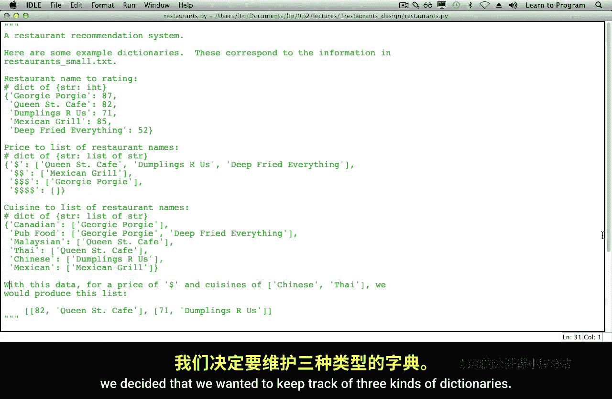
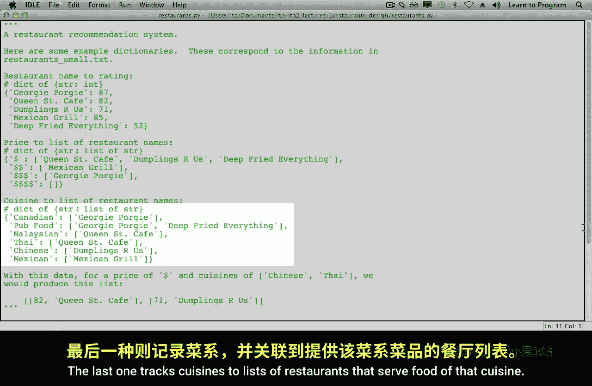
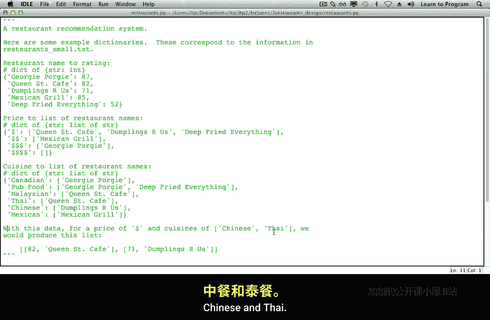
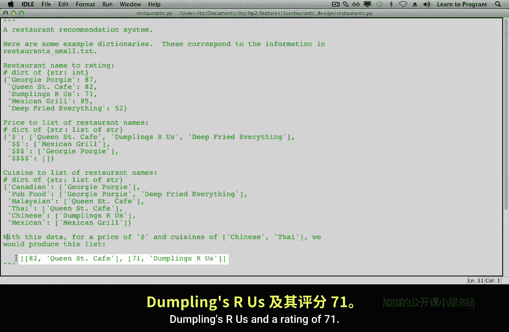
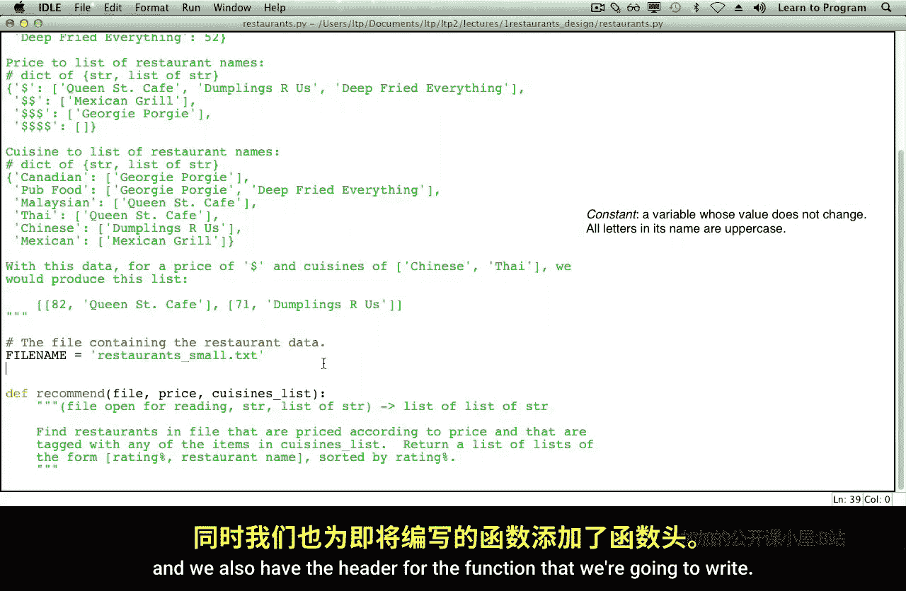
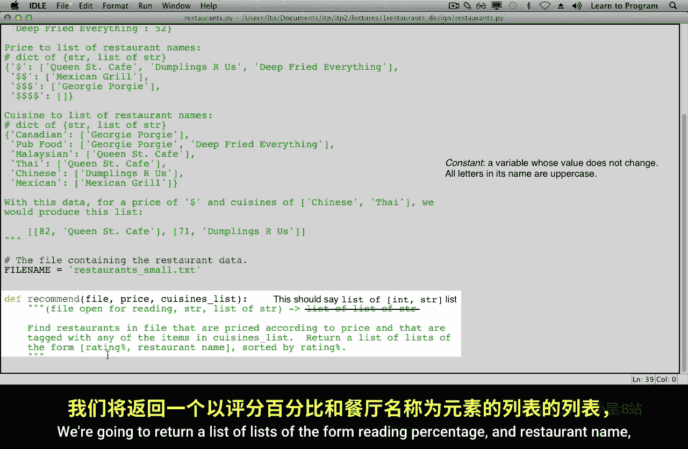
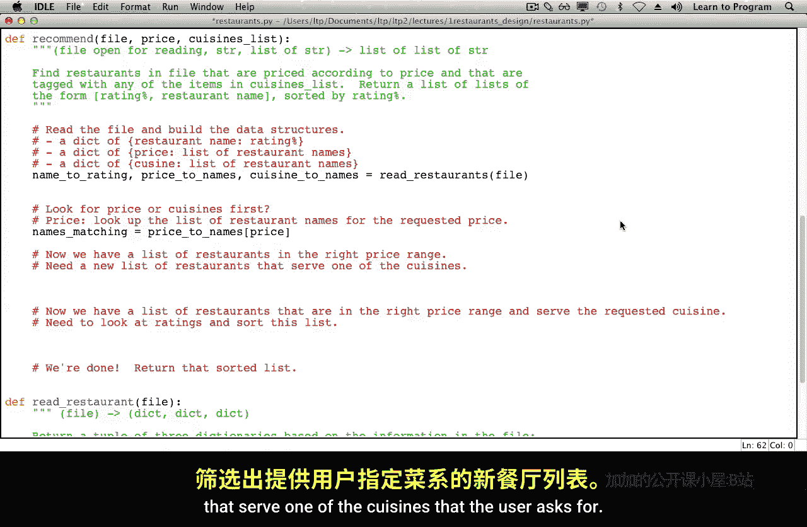
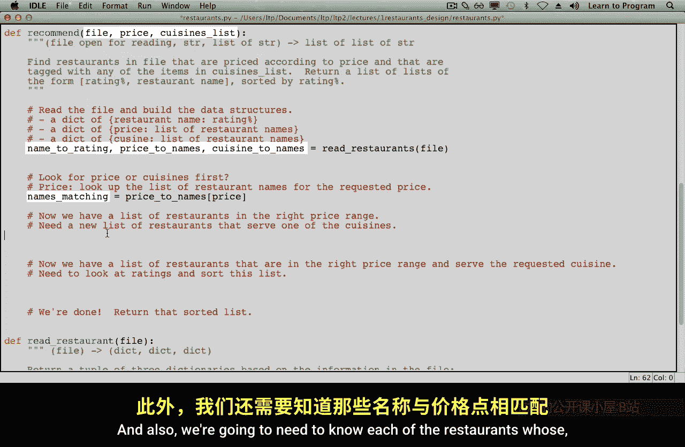
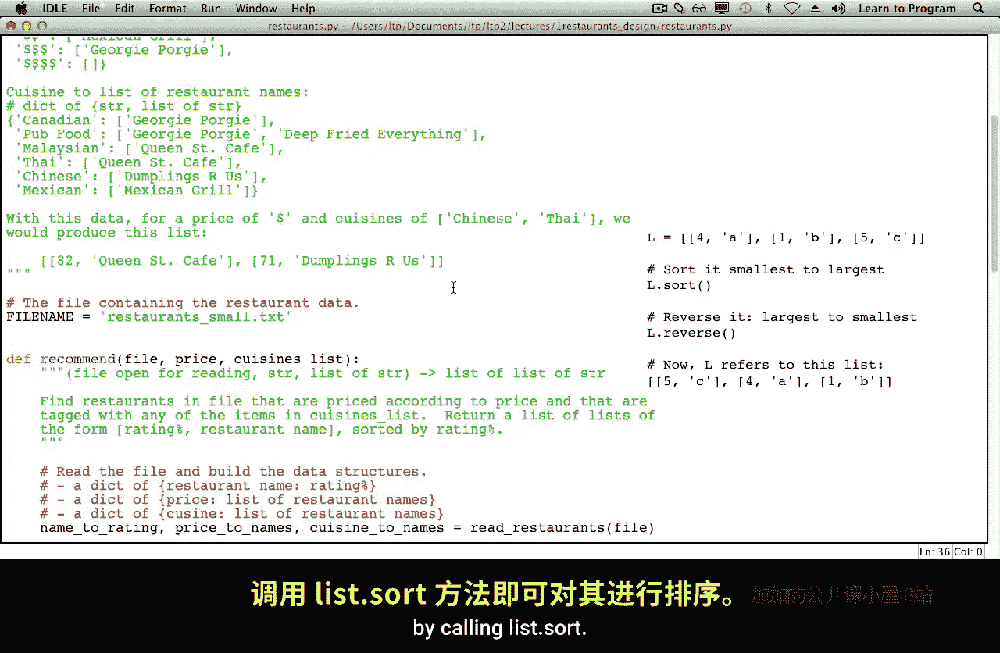

# 多伦多大学【中英⚡编程入门：编写高质量代码｜Learn to Program： Crafting Quality Code】 p07 P7 05_餐厅推荐-程序设计规划 -BV1QuJVzpEKE_p7-

You understand the problem domain， and you've seen how we came up with the data structures that we're going to use to represent the data from the file。

 It's time to design our function。

Here we have the information that we figured out about representing our data。

 This is in aphiile restaurant。 Py， which is going to end up being the program that we write in order to solve our problem。

As a quick review， we decided that we wanted to keep track of three kinds of dictionaries。

 The first one associates restaurant names with the ratinger。

 the percentage of people that liked the restaurant。

The second one keeps track of price ranges to lists of restaurants that are in that price range。

The last one tracks cuisines to list of restaurants that serve food of that cuisine。

We also worked out an example for a price of $1 representing the restaurants that serve relatively inexpensive food。

 and to cuisines， Chinese and Thai， we want to produce a list of two lists。

1 with Queen Street Cafe and rating of 82， and the other one。

 dumpling Dumplings are us and a rating of 71。

These are backwards， and the reason for that will become apparent later on after we finish designing our program。

A little lower。We have a constant representing the name of our file。

And we also have the header for the function that we're going to write。

 We would like to make recommendations based on whatever is in the file that's been open for reading。

 the price the user wants and the list of cuisines that the user wants。

 We're going to get back a list of list of strings。

 So this function is supposed to find restaurants in the file that are priced according to the price that the user selected and that are tagged with any of the items in cuisine's list。

We're going to return a list of lists of the form rating percentage and restaurant name。

 sorted by rating percentage。

As with most programs， the first step is to read the file and build the data structures with the information contained in the file。

Once we have information about the contents of the whole file。We need to start filtering。

 and we need to choose whether we're going to look for the price or cuisines first。

We'll decide on price。 We'll look up the list of restaurant names for the requested price。

We could have chosen to look for the cuisines first。

 and then we would have a different solution to this problem。This is an example of a design decision。

Once we have our list of restaurants on the right price range。

 it's time to make a new list of restaurants from that list that serve one of the cuisines being asked for。

Now， we have a list of restaurants that are in the right price range and serve their requested cuisine。

 It's time to look at the ratings and sort that list of restaurants。Then we're done。

We need to return that sorted list。We hope you see how much easier it is to think this through and take careful notes in English or your favorite language about what steps need to happen。

Also， the only reason that this was easy was because we had done an example ourselves by hand。

And then we had thought hard about how we're going to represent the data。

These carefully selected steps also give us checkpoints。

 places in the program we where we can check to make sure that we have done what we need to do and that that our program is correct so far。

Let's take a close look at each of these steps one by one。

When we read the file and build the data structures。

 the structures that we're going to want to build are a dictionary of restaurant name to rating percentage。

 a dictionary of price to list of restaurant names and a dictionary of cuisine to list of restaurant names。

Reading the file and building those data structures sounds a bit messy and long。

It's nice to have short functions。 And if we tried to do all of that in this recommend function。

 we would get an awfully long function。 And furthermore。

 we wouldn't be able to test to see if our function was behaving properly very easily。

 So we're going to write a separate function， perhaps called Re restaurants。😊，对。Takes the file。

 not the price or the cuisines list because it doesn't matter as we're reading the file and returns those dictionaries。

It's going to return those dictionaries as a couple of three items。 The name to rate it。

 the price to names and the cuisine to name。Well， we can probably write a header for that。

 and furthermore， this problem is well within your ability to do。Here。

 we've chosen the name Reed Rrant mightight as well fill in the parameter name as well。

 We know this function takes a file as an argument and returns a couple of three dictionaries。

Here's a description。Furthermore， here are a description of each of the dictionaries that this function is supposed to return。

The way this function works is we'll meet the file line by line。

And accumulate information about each of the restaurants。As we read a restaurant。

 we will add the information to each of the dictionaries that's relevant to that restaurant。

 So we're going to accumulate information about each restaurant as we read this file。

Here are our accumulators。 We need a name to rating dictionary。

 which associates the name of a restaurant with its rating。

 We're building up a price to names dictionary where each price point has a list of restaurant names at that price point。

And last， we're going to build also up a cuisine to names dictionary where we associate each cuisine that we find with the list of restaurant names that serve that cuisine。

😊，We are now at a point where we might ask you to finish this function。 And in fact。

 that's what we're going to do。 We won't show you the code for this because this。

 this function should be within your abilities to finish。

 We recommend starting by reading through and just building up the name to reading dictionary。

 I price the names and cuisine to names。 And only after you have that working。

 Go back and figure out how to keep track of the price。 and then the last dictionary。

You should only read through the file once， so all you're going to be doing is adding more statements inside your for loop as you go through each line in the file。

You'll also need to decide which of the file reading approaches would be most appropriate here。

The part that might give you the most trouble is pulling apart the comma separated list of cuisines and building the cuisine to names dictionary。

You might want to add a helper function that does this particular part of the problem。

So we came up with a Reed restaurant function。What else is there， Well。

 next is to look for the list of restaurant names for the requested price。

It turns out that this one is pretty straightforward。We have our price to Names dictionary。

We know the price that the user wants。And so。We could just find out。Which names match the price？

We got lucky。 Our data structures happened to give us the information we need。

What's next is once we have the names matching the price。

 we need now a new list of restaurants based on that name's matching list that serve one of the cuisines that the user asks for。

😊。

Which of these variables contain data that is relevant to the problem？Well。

 the file is no longer needed because we've read it entirely。

We don't need to know the price inside our cuisine filter function because we've already filtered by price。

We do need to know the cuisines list。We also need to know the cuisine to Nas list so that we can look up information about each cuisine。

And also， we're going to need to know each of the restaurants whose names matched the price point。

So。The information。Is names matching， we're going to need to know cuisine to names。

 and we're also going to need the cuisines list。And suit。

 these are going to be arguments to our function and what we're doing is we're filtering by name by cuisine。

This is going to return。The final hook。The final list of names of all the restaurants that are in the price range that serve one of the cuisines in the cuisine's list。

Before we go further with this， I'm going to fix。My variable name there。

 because I think that names matching price is going to be a little bit clearer。Now。

This is the function we're going to write。Let's start it right here。And。

We're going to start figuring out。What this function is supposed to do。

 So before we go any further with anything， let's build up some examples。

We know we're going to want a list of names to filter by。

 We know that we're going to want to build up。The cuisines dictionary。

And we also know that we've decided that we want the list of cuisines to filter by。

So we're going to create examples for those three things。

 and then we're going to call our filter byquiisine function。Passing in the names。

 the cuisine Dictionary， cuisine to Na Dictionary， and also our example cuisines list。So， at the。

$1 sign price point。These。Were the names of the the restaurants that matched that price point。

 So let's use those。As our example。We might as well come up here and grab our entire dictionary of。

 whatops， wrong one， our entire dictionary。Of cuisine to restaurant names。

Andvent this a bit to make it easier to read。Bend the list of cuisines。

That we're interested in are Chinese and Thai。So we're supposed to filter this names list。

 We're looking for Thai food。 So Queen Street Cafe， and we're also looking for Chinese food。

 which is Dumplings a us。 So when we call filter by cuisine with those three pieces of data。

 we expect this list back。We forgot our type contract。Names matching prices a list of strings。

 cuisine to names as a dictionary of strings to lists of strings。

 and cuisine's list is a list of strings。 And this function returns a list of strings。 This function。

 again， is one that is within your abilities to do。

 You need to look through the list of restaurant names in this list here。😊。

You need to check to see if。That any particular restaurant appears in any one of the cuisines listed in the cuisines list。

 so you'll go to the Chinese cuisines and you'll check to see if the name here appears there。

 it doesn't here。Then we'll try the Thai list and a yes， Queen Street Cafe appears in that Thai list。

 so we will accumulate Queen Street Cafe and our result。

Then we'll do dumplings our rats following the same algorithm we will。

Check to see if Dumpling's arrest appears in the Chinese list， and indeed it does。

 so we'll have it appear in our accumulator。Deep fight everything does not appear in either the Chinese list or the Thai list。

 so it is not included in the result。Back we go。We've just done filter by cuisine。

What's next is once we have the list of restaurant names。

 we need to build a list of lists in the right format that's described up here。

And sort it by rating percentage and return it。In order to get the ratings。

 we're going to need to pass in name to rating。And we also need to。

Look up those names based on the list of restaurant names that were in the right price and served one of the cuisines that the user wanted。

So we now need to build a rating list。We need to decide whether this build rating list function is going to also sort this list。

 We might as well have it do that。This is going to then return the result that we want。Well。

 here's our function。Let's grab that end。Start to define it。As usual。

We're going to start by coming up with examples。Let's go grab our name to Read example dictionary。

And also grab the list of names that filter by cuisine returned。

This function build rating list is supposed to return a list of lists that is sorted by rating。Well。

 the Queen Street Cafe rating is 82， so it should come first。 the Dlings are us rating is 71。

 it should come second。In order to accumulate this list of lists。

 we're going to iterate over the names list。 So we're going to grab Queen Street Cafe。

 Look it up in our name to rating dictionary， getting us 82。

 making a new list with 82 and Queen Street cafe and adding that whole list to our accumulator variable。

Then we'll do the same of Dlings Zra。 Well look up Dumplings Zs in our name to Read in dictionary。

 giving us 71， We'll make a new list containing 71 in Dlings Zs and add that new list to our accumulator variable。

 which we will then return。And we think this is within your ability to do， and once again。

 we forgot our rotten type contract。Named to reading is a dictionary of string to integer。

Names final is a list of string。And this function returns a list of lists of int and string。

What this function does is return a list of rating percentage restaurant name pairs sorted by rating percent。

All right。We now。Know kind of how to write or build reading list function and。

All we need to do in order to complete our main function here is return。The result。

There's one more little thing to address。 And that is why we put the rating first。

 And then the string， I told you， I would let you know why we did that。

 The reason is that if I have a list of lists。And I call sort on the whole list。

It's going to use the first item in the inner lists as the the sorting key for figuring out which one comes first。

 So by putting the rating first before the restaurant name。

 that means that I can sort the whole list once I've built it up just by calling list dot sort。

