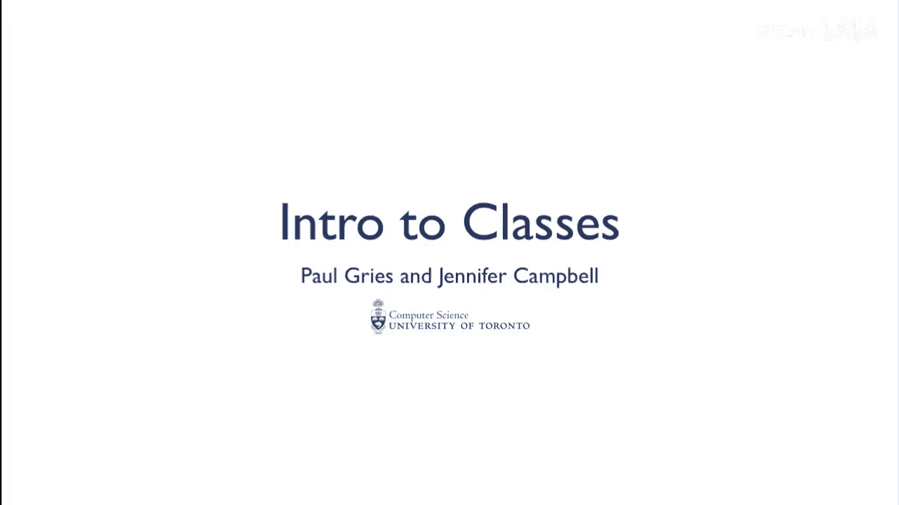
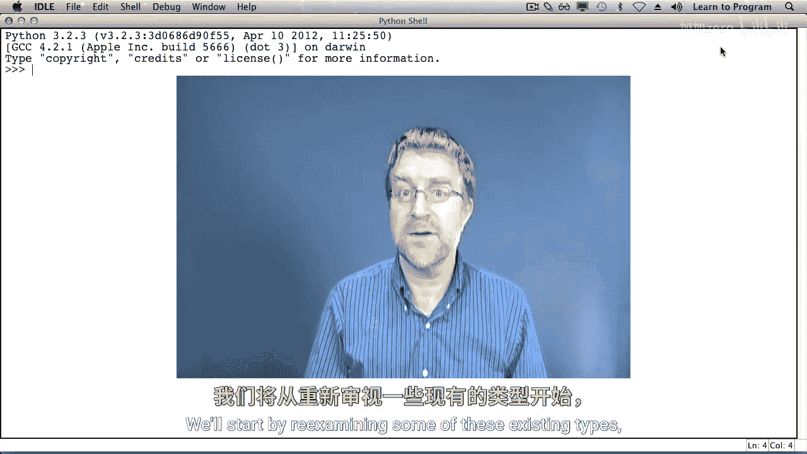
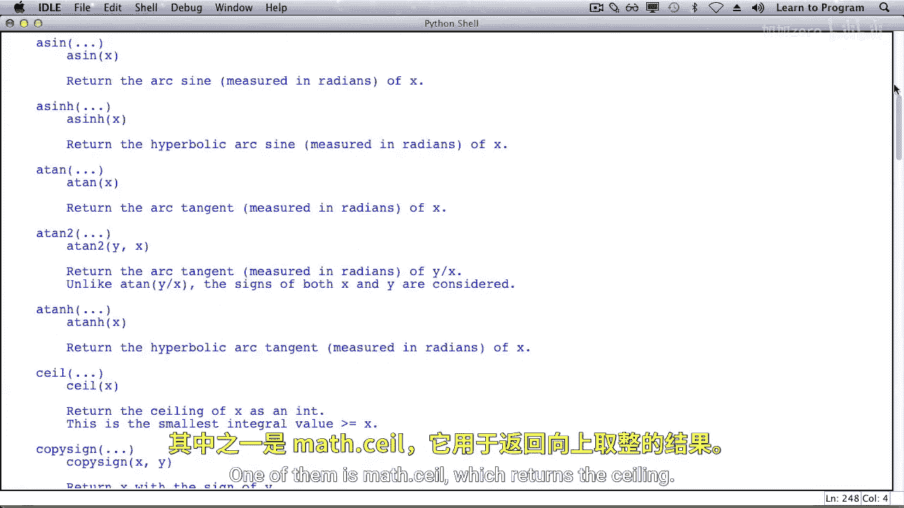
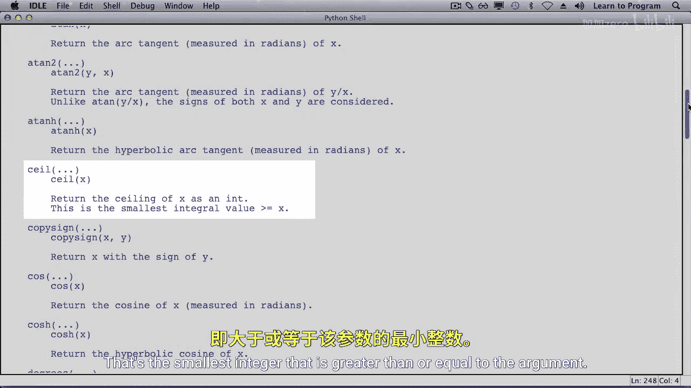
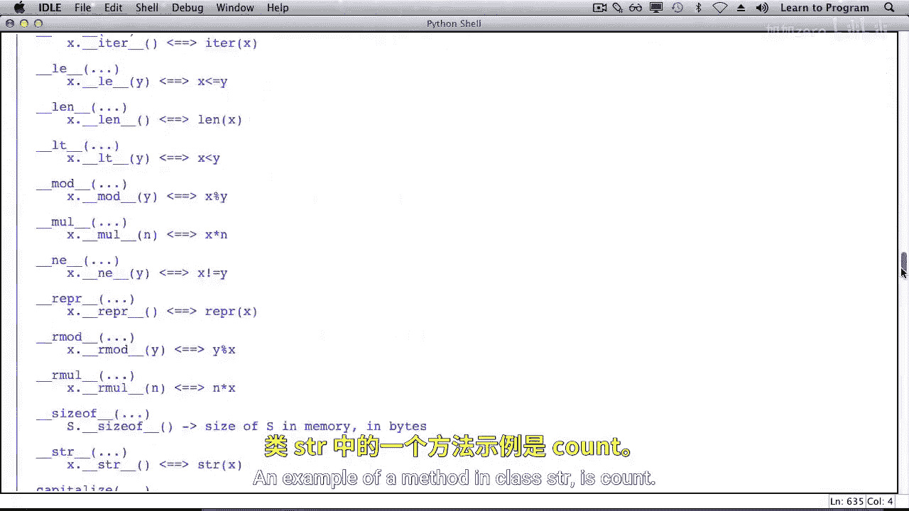
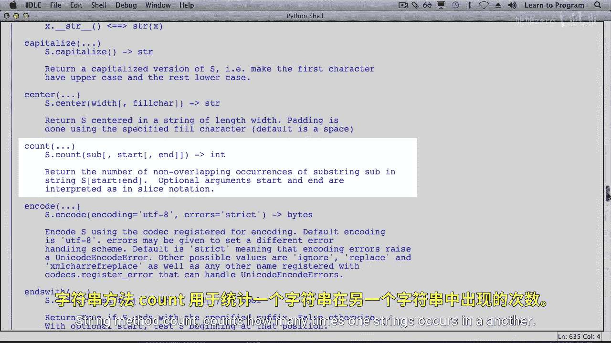
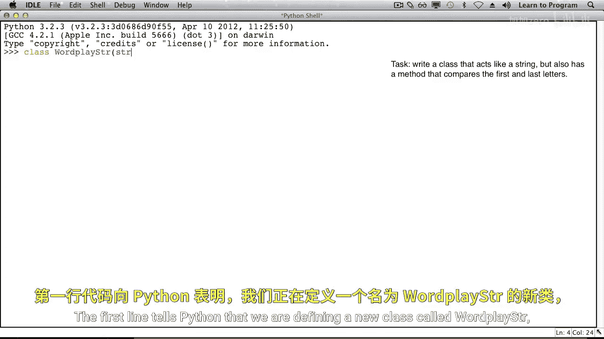
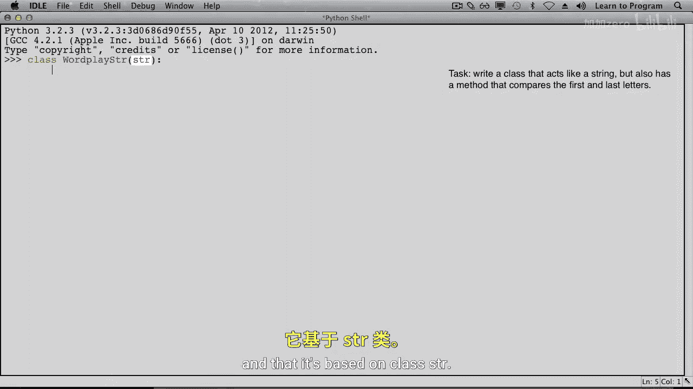
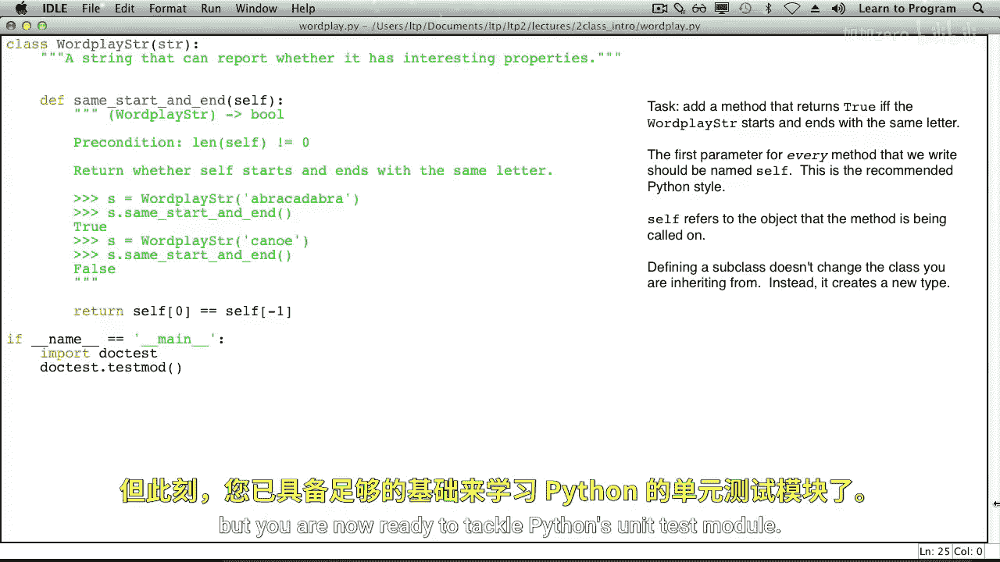

# 多伦多大学【中英⚡编程入门：编写高质量代码｜Learn to Program： Crafting Quality Code】 p10 P10 05_创建自定义类型 -BV1QuJVzpEKE_p10-

。Dooc test is a testing framework。It serves well to document functions。

 But when there are a lot of tests， it can obscure the code inside a function。

There are other testing frameworks that don't suffer from this problem。 One of them is unit test。

 which comes with Python。In order to use unit test。

 you need to learn a little bit more about some Python language features and in particular。

 how to create your own type。You've used lots of types， strings， functions， modules， dictionaries。

 lists， Booleions and more。All of these were written by programmers working for the Python Software Foundation。

 the organization that manages the Python programming language。

We'll start by reexamining some of these existing types， and then we'll see how to create our own。

Mdule math has a lot of functions。One of them is mathth dot seal。

 which returns the ceiling of a number that's the smallest inteture that is greater than or equal to the argument。

We called it like this。Moumath also has data in particular variables， E and pi。

Importing math creates a variable called math that refers to a namespace。

 That's a chunk of memory with names like a cosine， ceiling and so on listed inside。

 each of which point to a function object， as well as E and pi。

 which refer to floating point numbers。As you know。

 types such as int and stir contain a special kind of function called a method。

Here is the output of calling function help on type stir。Stir is a class。

 and a class is Python's way of defining a type。An example of a method in class is count。

String method count counts how many times one string occurs in another。

Because stir is a built in type， we already have variable stir。

It refers to a class rather than a module， but it looks much the same with names like center and count listed inside。

 each of which refer to method objects。Much like we write math dot seal with argument 3。

2 in order to call the seal function in module math。

We write stir dot count and pass in a string and the substr to search or count in that first string。

Again， as you've seen。Because methods are special in that they expect an instance of the class as the first argument。

We can in the object oriented way， call sisgy dot count， why。

This is the standard way to call methods。Class string has a lot of helpful methods。

 but there are some that are missing。We're going to write our own class。

 that customizes class strength。Our class will have all the string methods。

 but will also add one that checks whether a string starts and ends with the same letter。

Here's how we start our class。The first line tells Python that we are defining a new class called word place stir and that it's based on class stir。

 We say that word place stir is a sub class of stir。

It inherits all of the features of stir。As we said。

 our class is a string class that has a few additional features。Let's make a new one。

We can find out its length。And we can call string methods。We can even compare it to a regular string。

So far， it behaves identicalally to a string。Its type， however， is not stir， Its wordplace stir。

Let's create a file where we can write our new class definition。

 including the methods that we're going to add。Here's the class definition as we had typed it in the shell。

Can add methods to our class。 Let's add one that returns true。

 If a word starts and ends with the same letter and returns false otherwise。

Following the design recipe， the first step is to come up with examples。

Will create a word b stir where the first and last letters are the same。

Then when we call our function that we're writing， maybe we'll try same， start and end。

We hope that it returns true。If we create a word place stir where the first and last letters are not the same。

 then when we call our method， we expect false as the result。The name。

 same start and end for our method seems fine。 So let's fill in the header。There is one parameter。

 which we call self。 That's the word place stir that owns this method。The type is word placeder。

 and this method returns a boolean。Description is return whether self starts and ends with the same letter。

Because class word place stir inherits from class stir。

 we have access to all of the string functionality。 That means that we can use indexing。

We can look at index 0 and compare to the letter that is at index -1 and same start and end should produce true if those two are the same and attribute false otherwise。

This won't work on an empty string， so will add a precondition to forbid that。

What's add And if name equals main section at the bottom to try out our dogdes。We run it。

 our tests pass。It's important to note that we haven't changed class strength。

 It doesn't know about these new methods。Only our sub class word place stir has the ability to check to see if it has the same start and end character。

We'll see a deeper explanation of classes later in this course。

 but you are now ready to tackle Python's unit test module。

