# 多伦多大学【中英⚡编程入门：编写高质量代码｜Learn to Program： Crafting Quality Code】 p11 P11 07_使用-unittest-进行自动化测试 -BV1QuJVzpEKE_p11-

Dooc test is useful as part of the documentation for a function。As mentioned earlier， though。

 when there are many tests， it starts to make the code harder to read。

Python's unit Test module provides another testing framework that allows us to write the test separately from the function being tested。

We'll explore a unit test by translating our test for get divors from D to unit test。

On the left hand side of the screen is the get divisor's function with Doc test。

And on the right hand side is the unit test equivalent。First。

 we'll show you how these do essentially the same thing。 We import either doc test or unit test。

 depending on the framework we want to use。

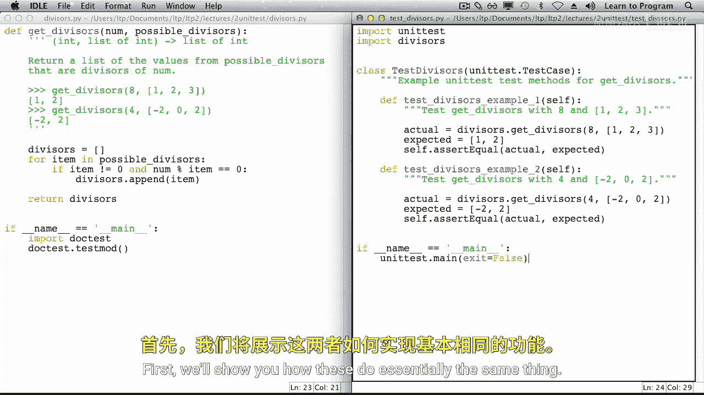

In each doc test， we write code as if we were typing it in the Python shell。

 and we write the expected result on the next line。

 Doc test will automatically compare the two for us。

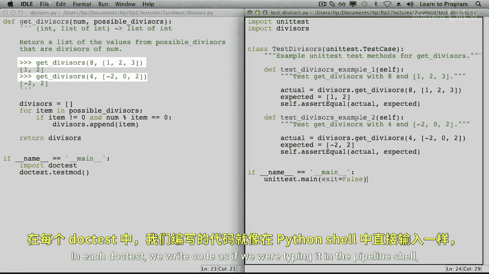

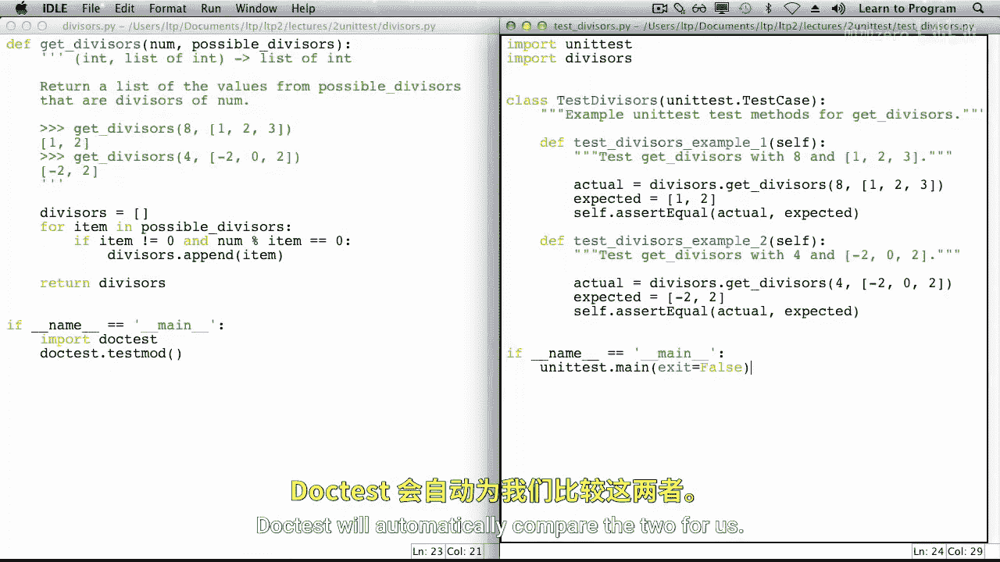

In unit Test， we write a separate method for each test In that method。

 we write a call on the function。

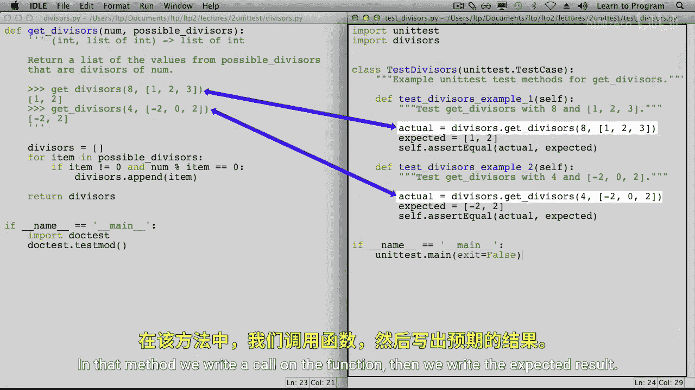

Then we write the expected result。Unlike with doc test。

 we compare the two by calling method assert equal。

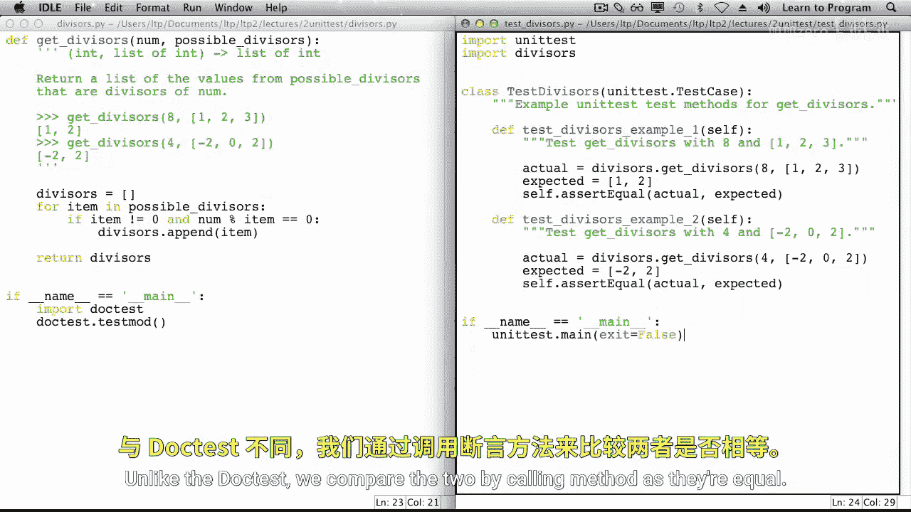

To assert something is to claim that it is true。 And here we are asserting that the actual result should be equal to the expected result。

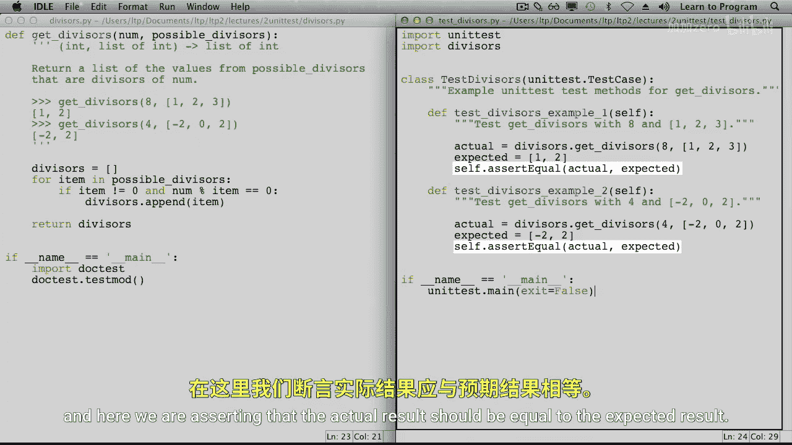

So far， for each of doc tests and unit tests， we've imported the testing module and we've written the testing code。

 Next， we need to execute the tests。

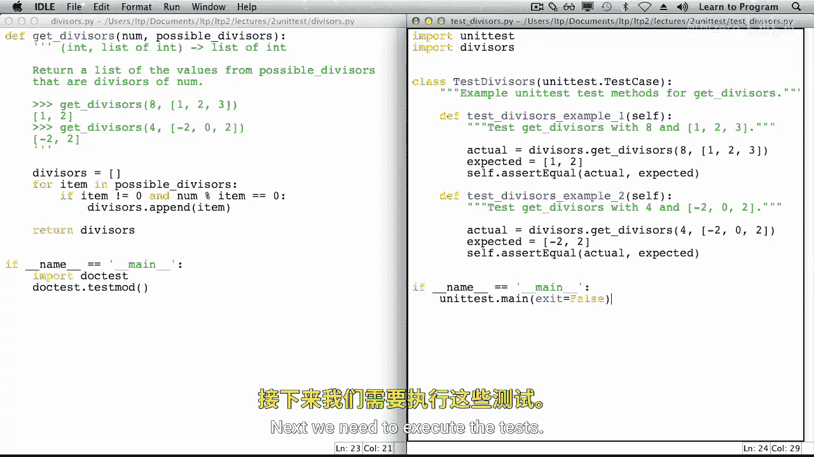

Dooc test test mod looks through all the doc strings in the current module and executes the test that it finds。

 It reports any differences between the actual results and the expected results。

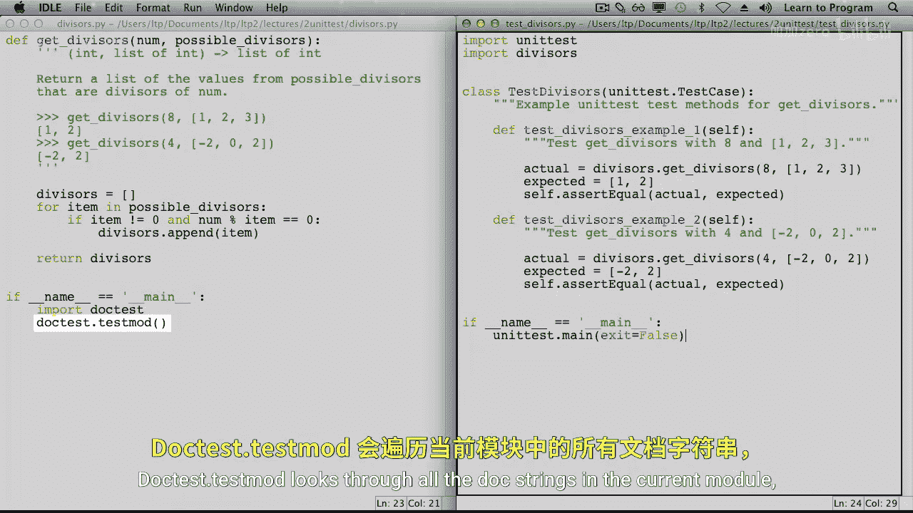

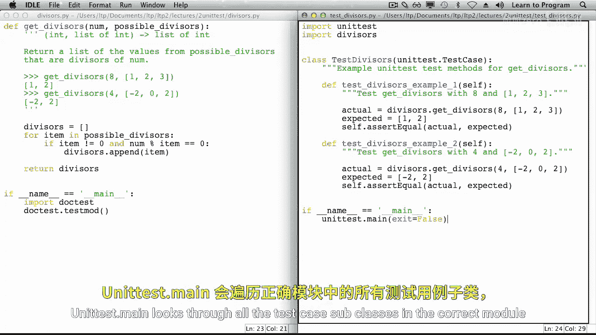

UnitTest。main looks through all the test case subclasses in the current module for methods that begin with test。

 lowercase TEST。

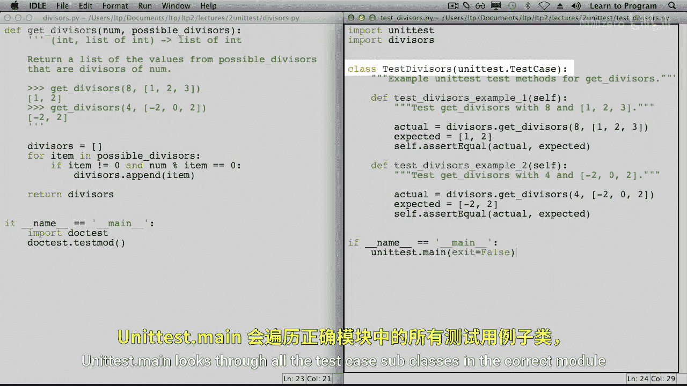

It calls each of them and reports any unexpected results。When we've run unit test inside Ile。

 we are supposed to pass ex it gets false as the argument to Maine。

Let's run the testizer's module and look at the output。

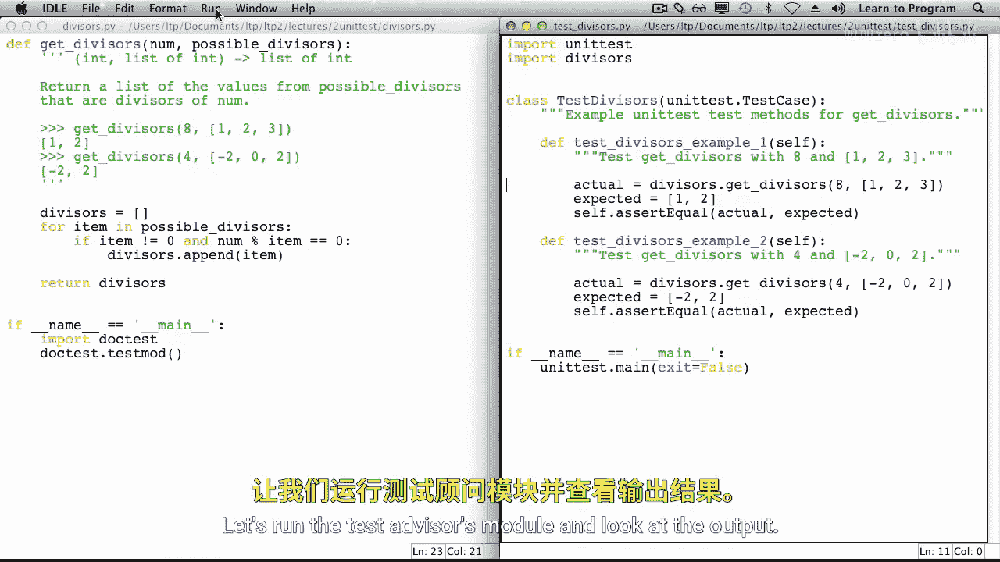

Each dot represents a successful test。 You see that there were two tests and that they ran pretty quickly。

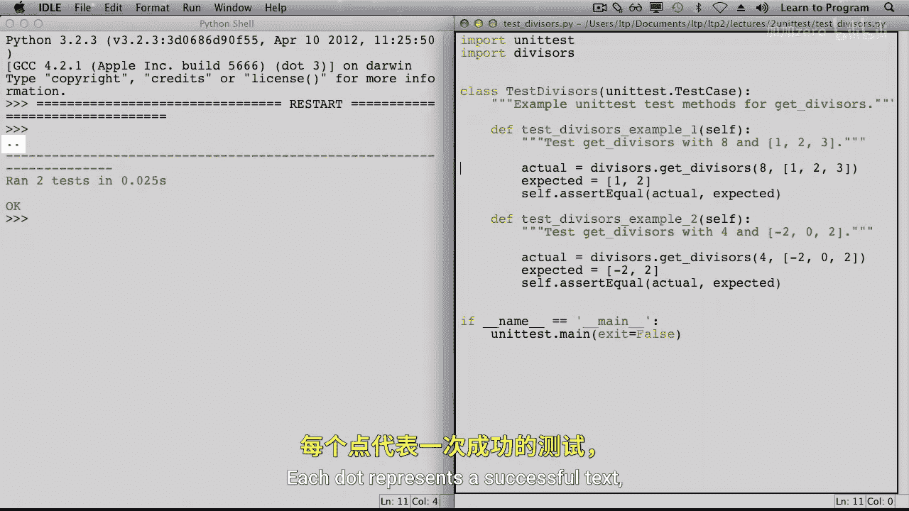

Now， let's introduce an error。We'll start with a non empty list。

 placing the value of the first parameter in the divisor's list。

Let's save the file and rerun the tests。This time we get a lot of feedback。Instead of dots。

 we see F's。We are told the name of each method that had a failure and also shown its doctrine。

We are shown the traceback， which is the series of function and methods that led to the error。

Were also shown the assertion error， including the expected and actual values。

We even have details about what the problems were。At the bottom。

 we see that the test case subclass failed because there was at least one error。

Now let's fix that bug。We'll also put in a different bug that allows division by zero。

 we'll get rid of the old lift statement。And put in this one instead。It's time to retest。

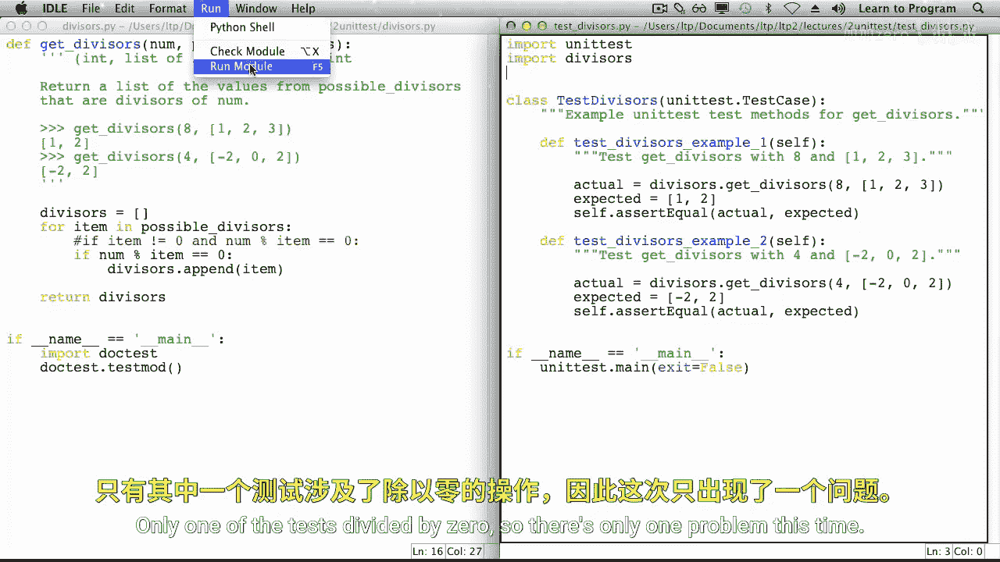

Only one of the tests divided by zero， so there's only one problem this time。Instead of an F。

 which is caused by an incorrect assertion， we see an E。

 because our second call on function get divisors resulted in an error。Again。

 we see the method name and dog string and a traceback。This time。

 the trace spec shows us that on line 18 in our test module。

 we called function get divisors and that on line 16 in function get divisors。

 this line of code costs a0 division error。As you can see。

 we get more detailed feedback with unit Test than we do with Doc test。

 We also have separated the testing from the code， which allows us to write a lot of tests without affecting readability of the code。

Typically， we'll write one test case subclass for each function we want to test。

 and we'll write one test method for each function call。

