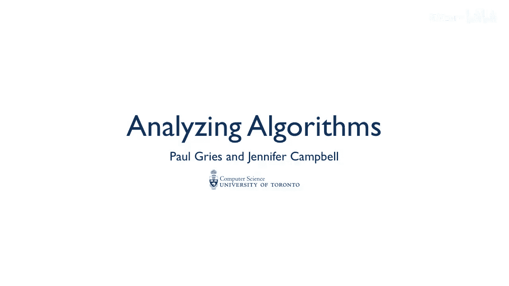
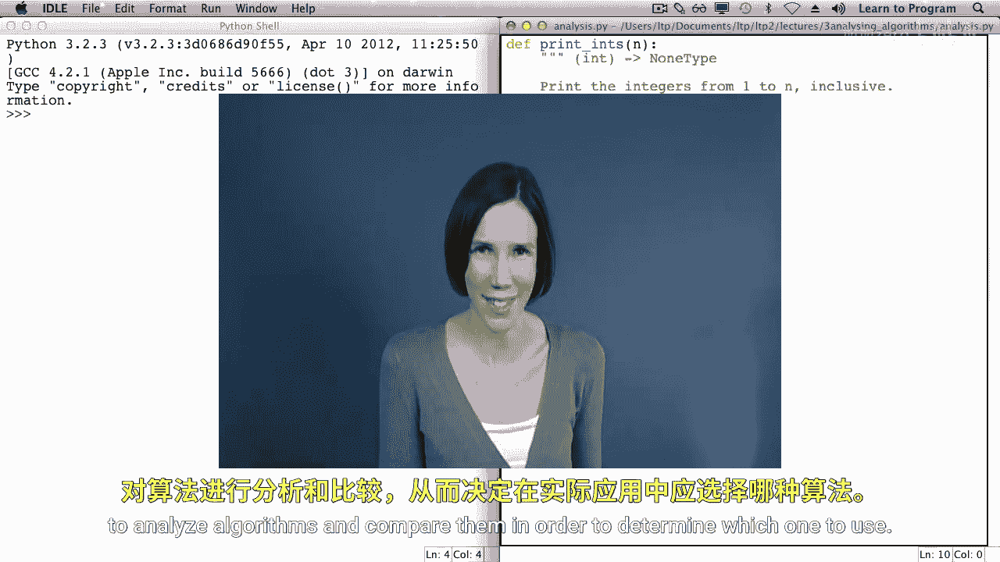
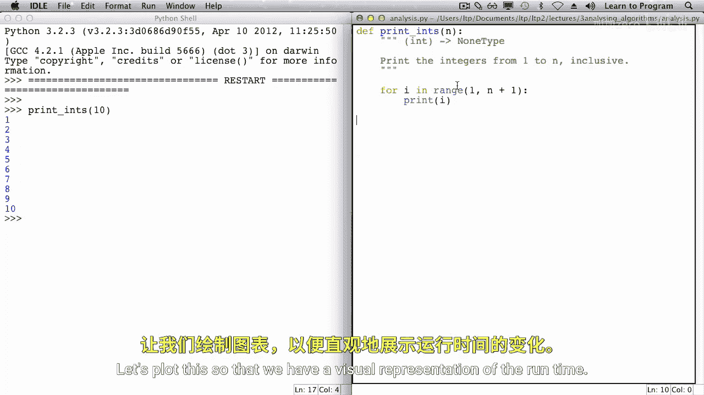
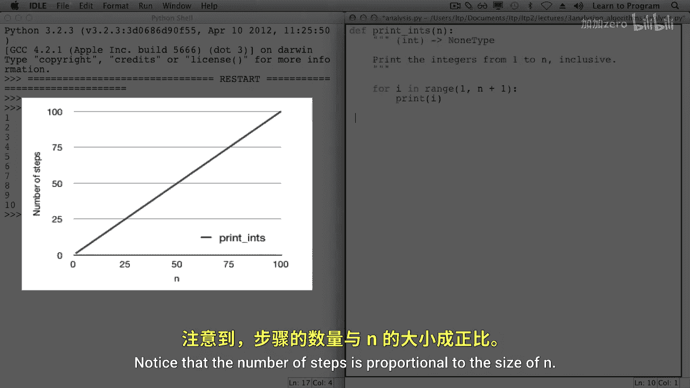
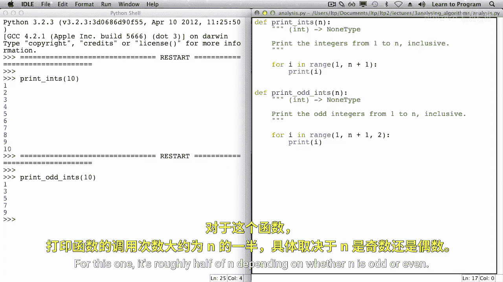
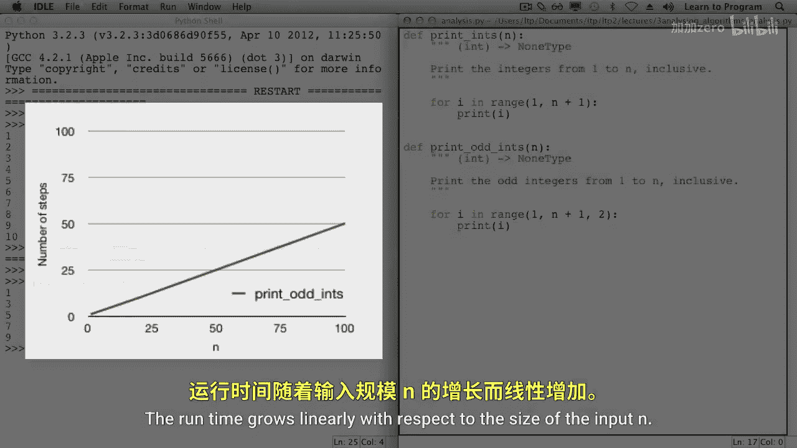
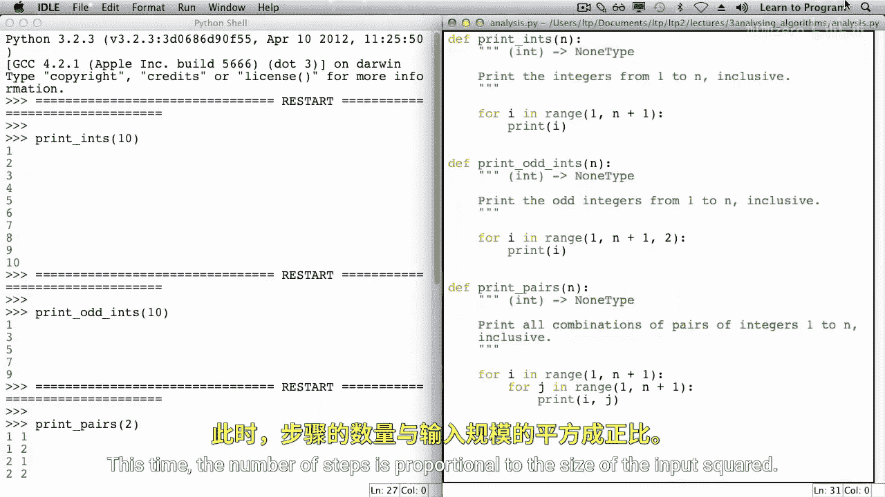
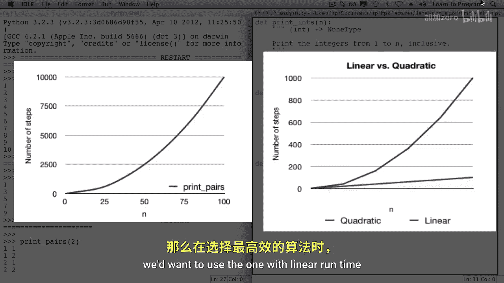
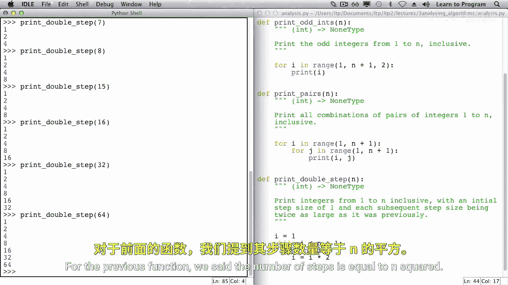
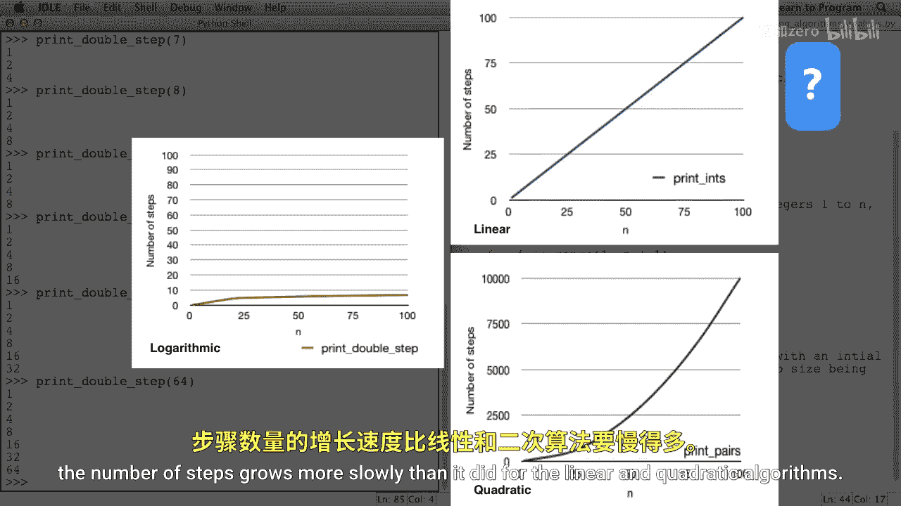

# 多伦多大学【中英⚡编程入门：编写高质量代码｜Learn to Program： Crafting Quality Code】 p14 P14 01_算法分析 -BV1QuJVzpEKE_p14-

Up to now， our primary focus has been on writing correct code。Next。

 we'll analyze our algorithms to determine the amount of time that they take to run relative to the size of the input。

In upcoming lectures， you'll apply what you learn in this one to analyze algorithms and compare them in order to determine which one to use。

To analyze our algorithms， we're not going to measure them by timing them instead we're going to read the code and look at the number of steps that they'll take for a particular input size。

For example， in this lecture， we're going to write several functions that print integers。

And we're going to focus on how many times the print function is called in each of our functions。

The first function that we'll analyze is print ins。This function prints the integers from one。

 up to n inclusive。Let's call this function。We'll run the module and call print intz with an argument of 10。

In this case， the print function is called 10 times。That is， the for loop iterates 10 times。

What if this function were called with the argument 20？In that case。

 the forlo would iterate 20 times and the print function would be called 20 times。And what about 40。

 there would be 40 iterations of the loop。Let's plot this so that we have a visual representation of the runtime。

On one axis， we'll have n， the input to the function。And on the other axis。

 well have the number of steps that the function will execute for a given end。For this problem。

 the steps that we're measuring are the print function calls。

Notice that the number of steps is proportional to the size of n。

Next， let's consider another function。Print odd ins， print the odd integers from one to n inclusive。

We'll call this function with the argument 10 as well。Print was only called five times。

If the argument were 20， it would be called 10 times， and if the argument were 40。

 it would be called 20 times。For the first function。

 the number of print function calls was equal to n。 For this one， it's roughly half of n。

 depending on whether n is odd or even。

Mod thought this as well。We can see that the number of steps is still proportional to the size of N。

 roughly half of n。This function and the first are both considered linear functions。

The runtime grows linearly with respect to the size of the input。

Next up will' analyze function print pairs， It prints all combinations of pairs of integers from one to n inclusive。

We're going to start by calling this function a couple of times。 First。

 we'll call print pairs with an argument，2。In that case， four pairs are printed。

We'll call it again with the argument 3。In this case， we've got nine pairs being printed。

Now with the argument four。There are 16 pairs printed。Do you see a pattern？For the argument N。

 the print function is called n squared times。When analyzing algorithms。

 we don't always have the luxury of running code。 Sometimes we do analysis before writing code to determine whether it's even worth writing。

We'll analyze this function by reading the code， and the same could be done with pseudocode。

The print function call is inside the inner loop of a nested loop。When the inner loop is executed。

 it will iterate n times。And the inner loop is executed once for each iteration of the outer loop。

 the outer loop will execute n times as well。So with n iterations of the outer loop。

Times n iterations of the inner loop， print is called n square times。This time。

 the number of steps is proportional to the size of the input squared。

We'll plot this as well as N grows， the number of steps is growing more quickly than it did for the other two algorithms。

If we had two algorithms that solved the same problem and one had linear run time while the other had quadratic run time。

 we'd want to use the one with linear runtime。 if we were trying to pick the most efficient algorithm。

Let's consider one more function。This function， print double step。

 also prints the integers from one to n inclusive。But rather than using a step size of one or two。

 like the previous functions， the step size varies。

The step size is the difference between a pair of numbers in the sequence。

The initial step size would be one。The next step would be2。Then， for。Eight， 16， 32， and so on。

Let's consider how many integers are printed for various values of n。 Let's start with n equal to 4。

In that case， three integers would be printed， the integers 1，2， and 4。How about when N refers to 5。

In that case， there would still only be three integers printed， the ints 1，2， and 4。

The same goes for when n refers to 6 and 7。It's not until N refers to 8 that we then have a fourth integer being printed。

When n refers to the values 8 through 15， there are still only  four inch printed。

 It's only when n refers to 16 that there would be a fifth inch printed。And then when n refers to 32。

 twice that，6 would printed it。When it's twice that， 64，7 would be printed。Every time n is doubled。

 an additional integer is printed。For the previous function。

 we said the number of steps is equal to n squared。 For this function。

 the number of steps is proportional to log base 2 of N。

This algorithm is logarithmic。As the size of N grows。

 the number of steps grows more slowly than it did for the linear and quadratic algorithms。

