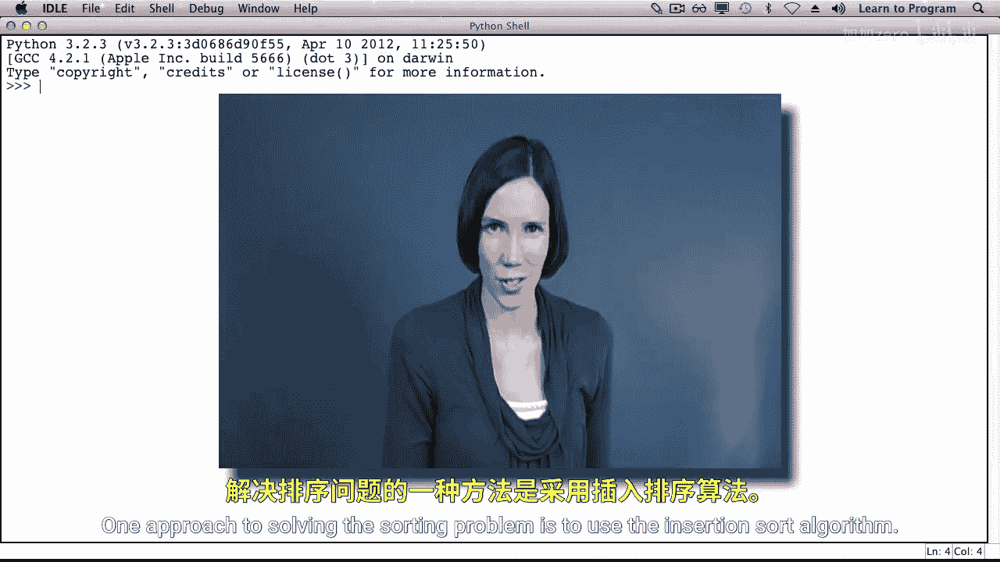
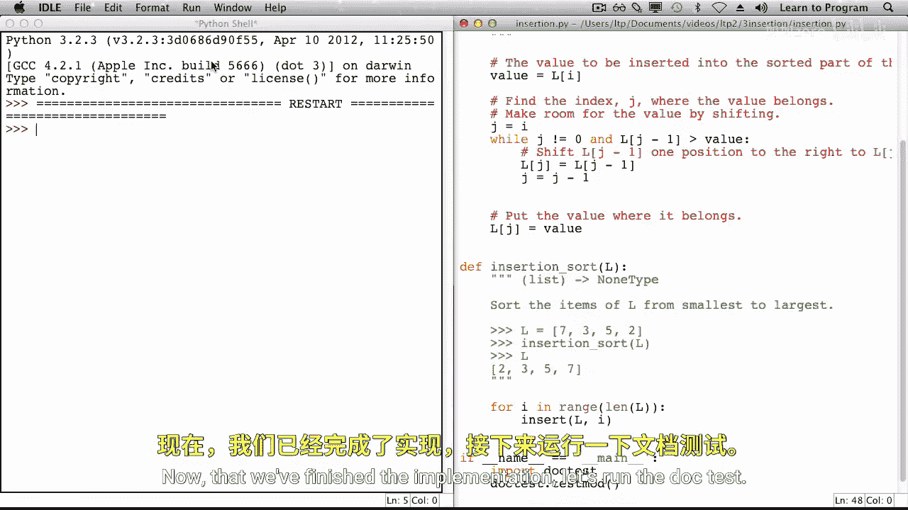

# 多伦多大学【中英⚡编程入门：编写高质量代码｜Learn to Program： Crafting Quality Code】 p20 P20 05_插入排序 -BV1QuJVzpEKE_p20-

One approach to solving the sorting problem is to use the insertion sort algorithm。

 That's what this lecture is all about。

Recall from selection sort the state of the list at the beginning after some passes and at the end。

The same is true for insertion sort。 At the beginning， the entire list is unsorted。

 and I refers to 0。After some passes have been completed， part of the list is sorted and part is not。

I refers to the index of the first item in the unsorted part of the list。At the end。

 the entire list is sorted， and I refers to the length of the list。For insertion sort。

 one pass of the algorithm involves taking the item at index I and including it in the sorted section of the list。

Let's look at an example。Since the entire list is still onsorted。

 adding I to the sorted part of the list is simple， we just increment I and move on to the next pass。

The7 is compared with the three， and since 7 is greater than3。 It's in its correct position。Next。

 the two needs to be included in the sortred part of the list。

We know that the five will be in the same position as it was before in any given pass。

 only the items from index 0 up to and including index I might change。2 is less than 7。

 and it's less than 3。 So the two belongs at index 0。The seven will be moved over one position。

And the three will be moved over our position。Making room to put the two at index 0。

Now it's time for the fourth pass。 the Edamant index I。

 the five needs to be included in the sorted part of the list。5 is less than 7。

 but it's greater than 3。 So the 7 is shifted to the right， and the five is inserted at index 2。

Let's implement this algorithm。For each pass through the algorithm。

 the item at indexex I is inserted into the sorted part of the list。

The insert function is a helper function that willll now write。

The variable value will refer to the list at index I。

 which is the item to be inserted into the sorted part of the list。Next。

 we need to find the index J where the value belongs。

We also need to make room for the value by shifting。

And once we know the index where the value belongs， index J， we need to put the value there。

Finding the index and making the room is the trickiest bit for now。

 we'll leave the Y loop condition unspecified， and we'll add it in a moment。In the body of the loop。

 one item would be shifted to its right。The index J is then decreased by one。

To determine the loop condition， let's revisit our example。Initially， J refers to I。

2 is compared with 7。 and because it's less than 7， the7 will be shifted to the right。

Then the value of J will be decreased。Next， two is compared with three and the three is shifted to the right。

Then the value of J is decreased again。At this point， J refers to zero。

 it's not possible to go any further to the left， we found the location where the tube belongs。

Let's add this reason for stopping to the wild loop condition。

We want to stop when j is equal to zero， so we'd like to continue as long as it's not。

There's another reason why the loop might end as well， let's consider a second example。In this case。

5 is compared with7 and7 is shifted to the right。The value of J is decreased。Next。

 five is compared with three， and because it's bigger than three， we stop。

We stop when the list at J minus1 is less than or equal to the value。

So the second condition under which our while loop should continue is that L at J minus1 is greater than the value。

Now that we finished the implementation， let's run the Do test。

The test passed。