# 多伦多大学【中英⚡编程入门：编写高质量代码｜Learn to Program： Crafting Quality Code】 p22 P22 03_接入 Python 语法 -BV1QuJVzpEKE_p22-

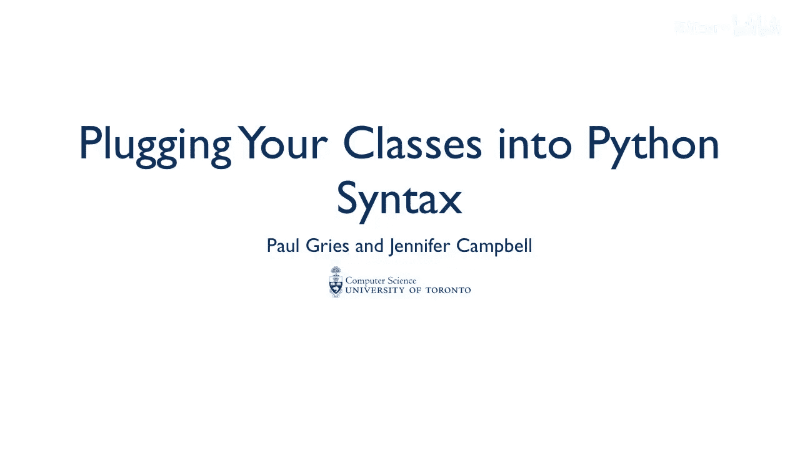

In Python， you've added two numbers together using operator Plus。

 you've also used that operator to add two strings together， and two lists。

There were other operators that you've used。 For example， you can multiply a string by an int。

In this video， we're going to show you how you can plug your own new types into this Python syntax。

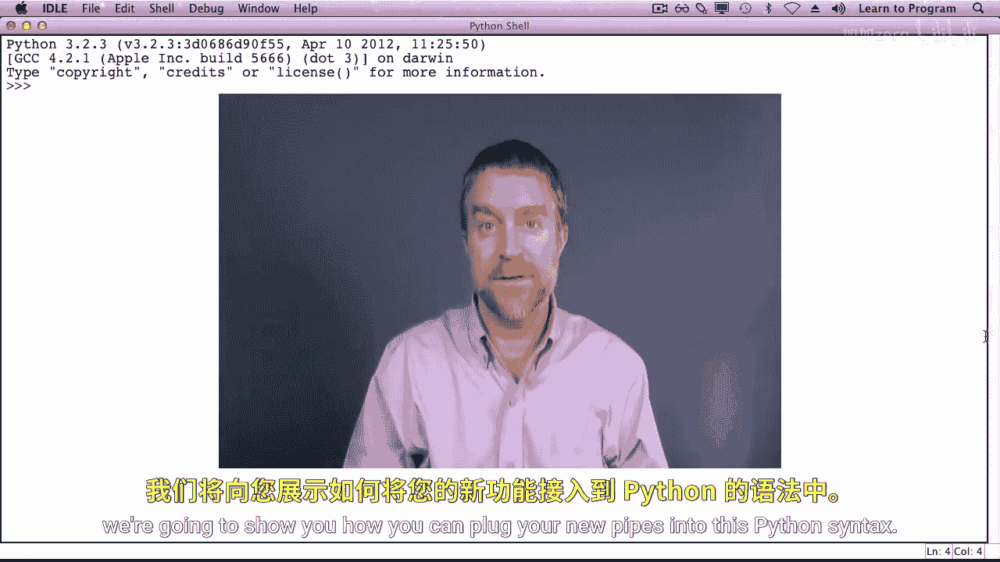

For callll class word place stir from a couple of weeks ago。

 wordplay stir is a stir that has one additional method， same start and end。

Classes you write can be based on classes that other people have written。

It turns out that every class is based on a particular class called object。

Object is a class and module built in， and it is the most base type。

That means that every other class automatically derives from this class。

Class object contains many of these underscores methods。

 These methods are often called special methods。Object contains underscores in。Underscores EQ。

 underscores stirR， and several more。These methods are special because they sort of plug into the Python syntax methodod Object dot underscores a knit initializes a variable。

Recall that underscores a knit is the method that gets called when you create a new instance of a class。

Let's take a look at object dot underscores stir。 What this notation means is that if I do X dot underscore stir。

 that is the same as calling function stir on X。

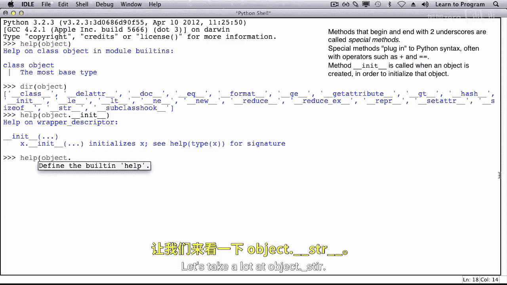

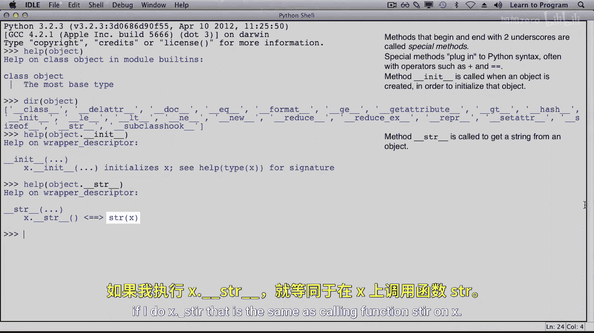

Let's look at one more Object dot underscores Z Q。

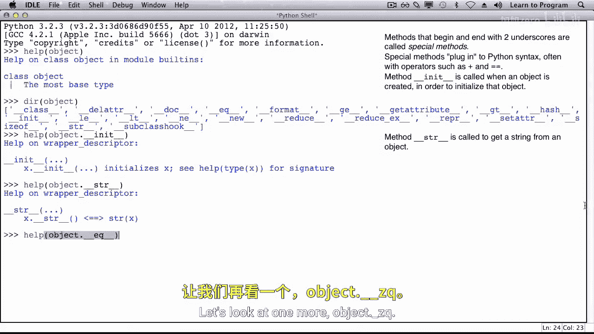

This shows that when we write x equals equals y， that calls method x dot underscores E Q with argument Y。

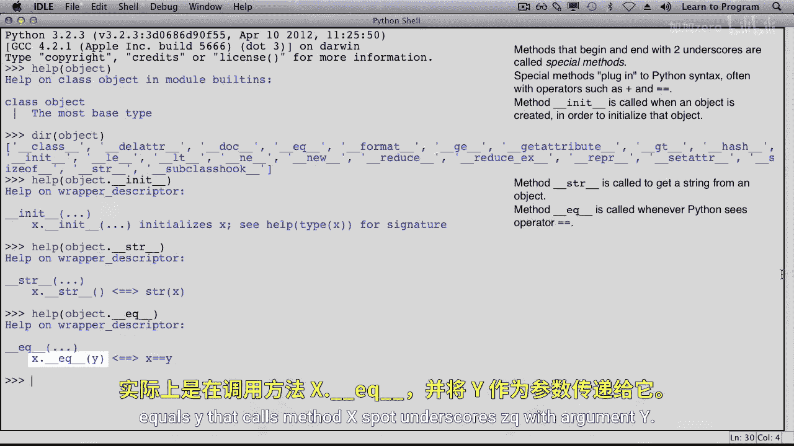

Most of these special methods are called when a particular syntax is used。

Here's our cash register class。We've removed the examples in order to fit more of this on the screen at once。

We have our special method underscores in it。As you know now。

 this gets called when you create a new cash register object。We also have regular methods get total。

 add。And remove。We're going to add another special method underscores E Q that will be called when we compare two cash registers for equality。

For this method， we'll consider two cash registers to be equal if they have the same total amount of money。

Our method has self as the first parameter， as per usual。

And the second variable is the other cash register that we're comparing this cash register to。

In our doc test， we'll create one cash register with two looies。 That's $2 total。

 and we'll create a second cash register with one tuny， also $2。That means that when we compare them。

 we hope that the result is true。For the type contract， self and other both refer to cash registers。

 and this method should produce a booleing。In particular， this method will return true。

 if and only if self and other have the same total amount of money。

In order to decide if two cash registers are equal。

 we've decided to compare the total amount of money。Self。

ge total should produce the total amount of money in the current cash register。

 and we want to know if that number is equal to others total。

Let's go modify the main program to try this out。We'll remove the old code。

And then create three cash register objects。 The first one has two loonies。

 The second one has one tuni， and the third one has a looy and a tuni。

Let's print what happens when we compare the first one to the second one and the third one to the second one。

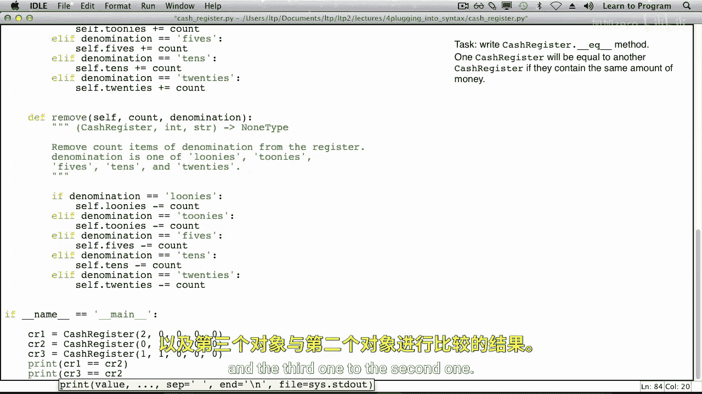

When we run this， we see that the first expression produces true， and the second one produces false。

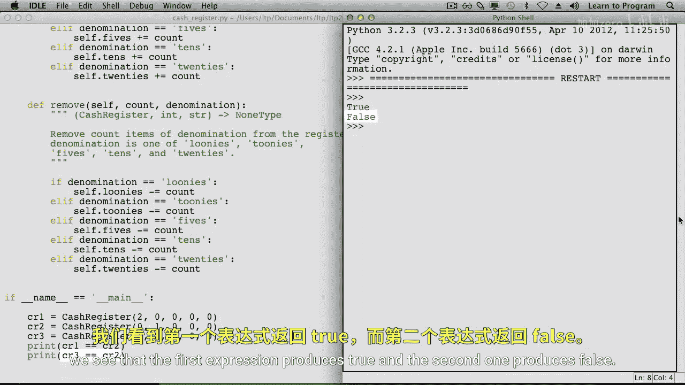

Let's step through this at the debugger so we can see exactly what's going on。

Now that the debugger is turned on when we run， we pause right at the very top of the file that we're running。

We define our class。Notice now that we've read the entire class definition， including any methods。

In the debug control window， we see that we' paused on line 78 of cash register dot pi。

 and that we're about to execute if underscores name equals the string underscores main。

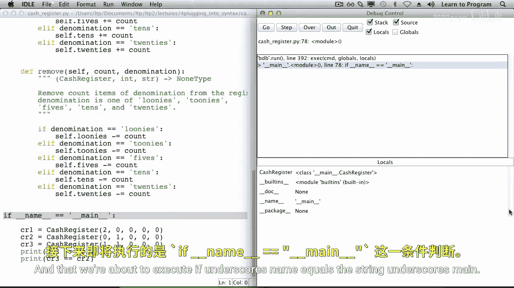

Down in the locals section of the debu control full window。

 we see that variable underscores name has as its value。 The string underscores main。

 So this condition in the if statement will evaluate the true。

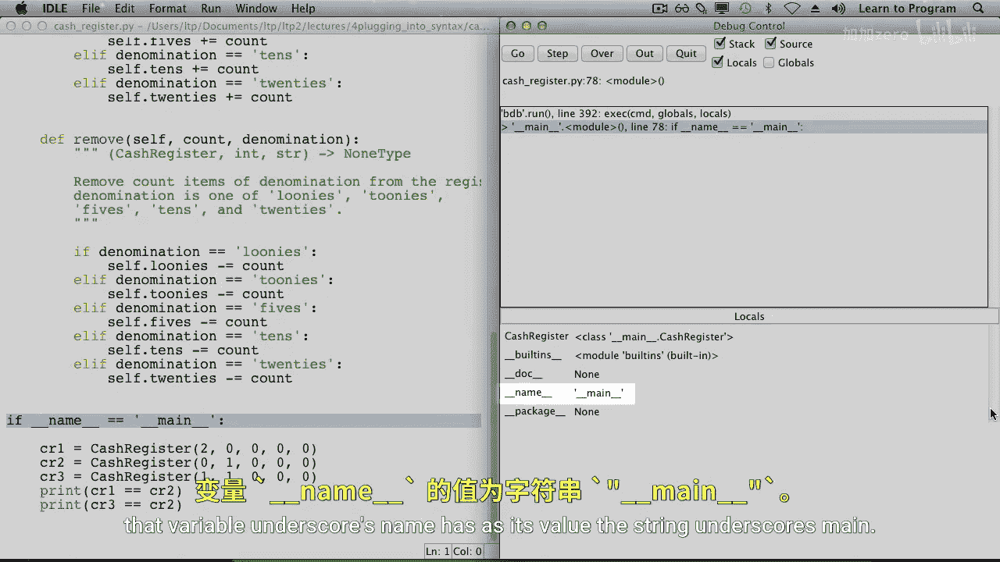

Here we confirm that。We're about to create a cache register and assign the memory address of that to variable CR R1。

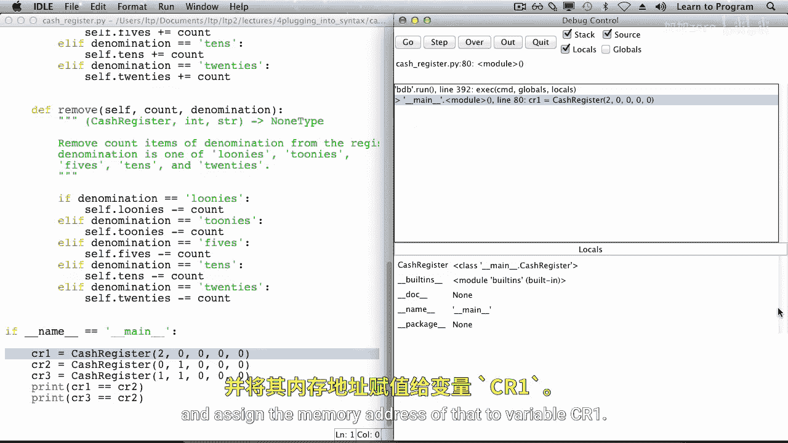

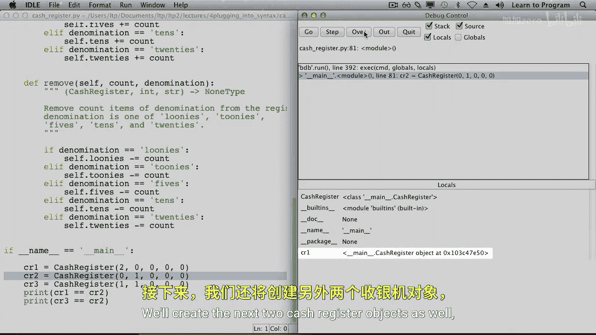

We'll create the next two cache register objects as well， assigning them to variables CR2 and CR3。

We've been clicking button over， which executes the current statement in its entirety all at once without showing any intermediate steps。

We could instead， if we like， click step， which steps into any methods or functions that get called。

 We're going to do that here。 Now， if you'll recall。

 we wrote and underscores E Q method in order to hook into the Python syntax for the equals equal symbol。

 the comparison for equality。 So when I click step， we will actually be taken into that method。

 Here we go。

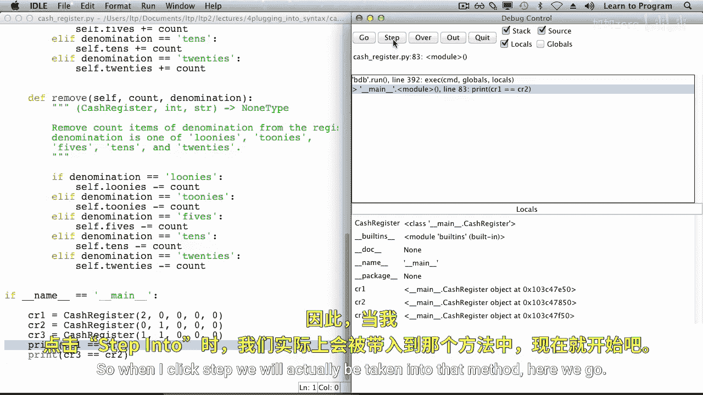

We're currently on line 27 of cash register do pi and method underscores E。 Q。

 And we see that also on the call stack that in the main module on line 83。

 the call to print is what got us inside this E Q method。 I can click here。

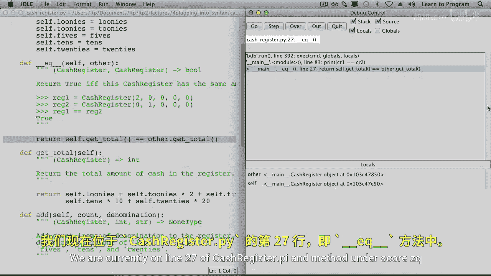

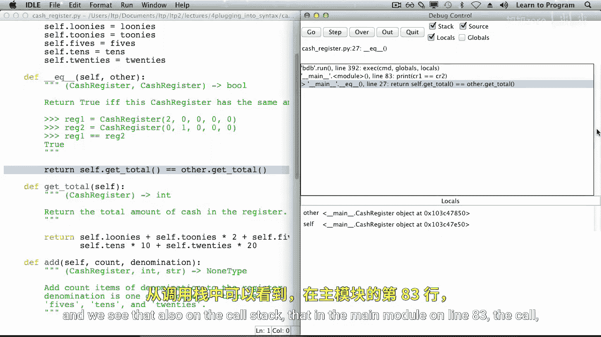

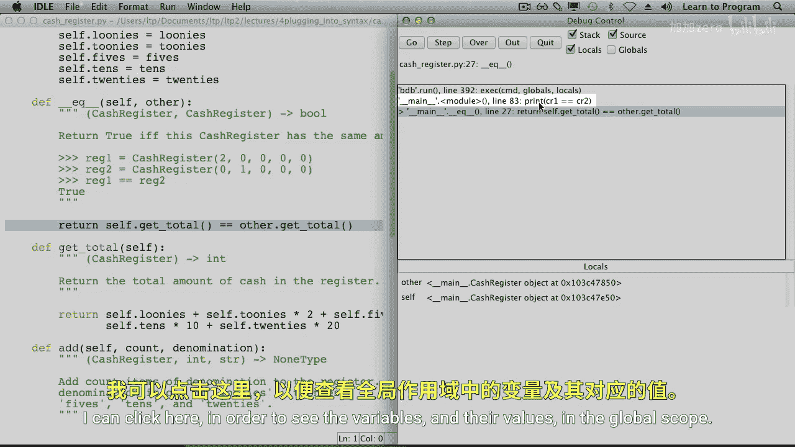

In order to see the variables and their values in the global scope。

 and I can click here so that I can examine what's going on inside Meod EQ。

What I see in the locals pane of the debug control window is that self hass its value。

 a cash register object。 And it's at this funny memory address。 As a reminder。

 that's a hexadeadecimal number。 It uses the number the digits 0 through 9 plus a through F。

So self is the cache register object at this particular memory address that ends in E50。

Let's go back up and remember E50 to see which one we are using。 that is Cr1。

 So CR1 was sent in as self。Which one is 850， which one is the other one？That is CR2。

Hopefully as we expect。If you recall， the total amount of money in the first cash register was $2。

 and the total amount of money in the second cash register was also $2。

 So when we execute this return statement here。To compare the the two total values for self and other。

 we hope that they compare true。 And indeed， when I step here。

 I see that I'm going to add up the Loone'ies tuies 5s，1s and 20s for the current cash register。

Which， as you can see， is the one at memory address E 5，0。 That's cash register 1。

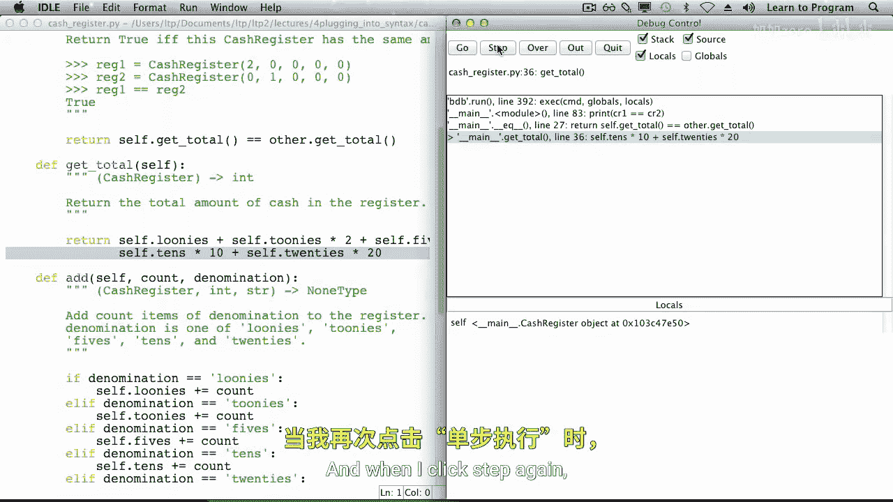

And when I click step again， it's going to return that value and then call get total on the other cash register。

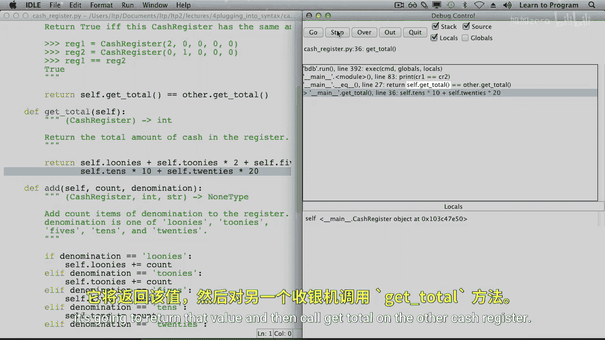

Here we go。

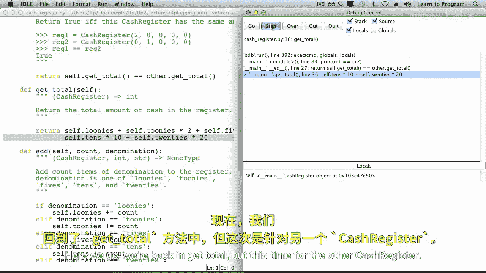

We back in get total， but this time for the other cash register， notice the memory address。

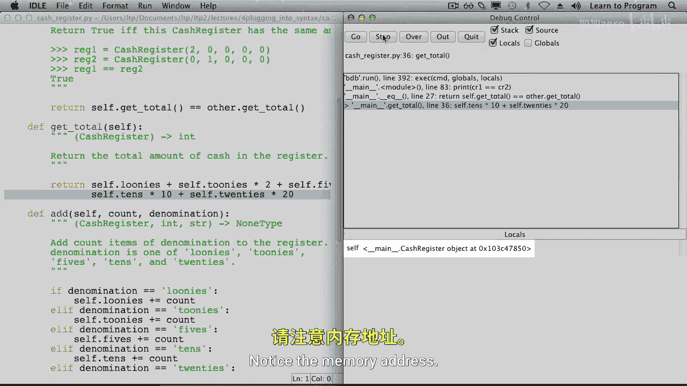

Clicking once more will go back to the self dot get total as equal to other dot get total statement。

Which should produce true。It will also take us back to the print statement on line 83。Here we go。

When I step again， it's going to call the underscore EQs method for CR3。Whose memory address ends in。

F50， here we go。Self refers to the same object that CR R3 refers to。

Other refers to the same object that C R2 refers to。

Notice that the object that owns this underscores EQ method is the one that appears on the left hand side of the comparison。

When we step， we're taken into C R3's get total method。 When we step again。

 we're taken into C2's get total method。 So at this point， we've called self dot get total。

 and we're in the midst of executing other dot get total。 When I step again。

 we're going to exit other dot get total。 We're going to do the comparison and return to the main program where we started this whole process。

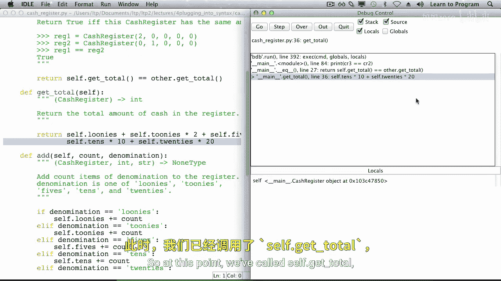

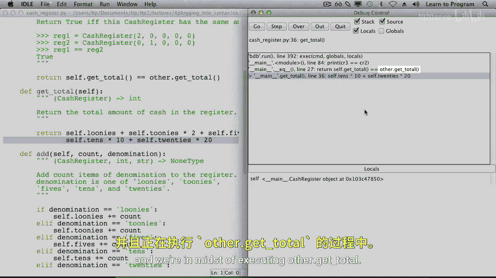

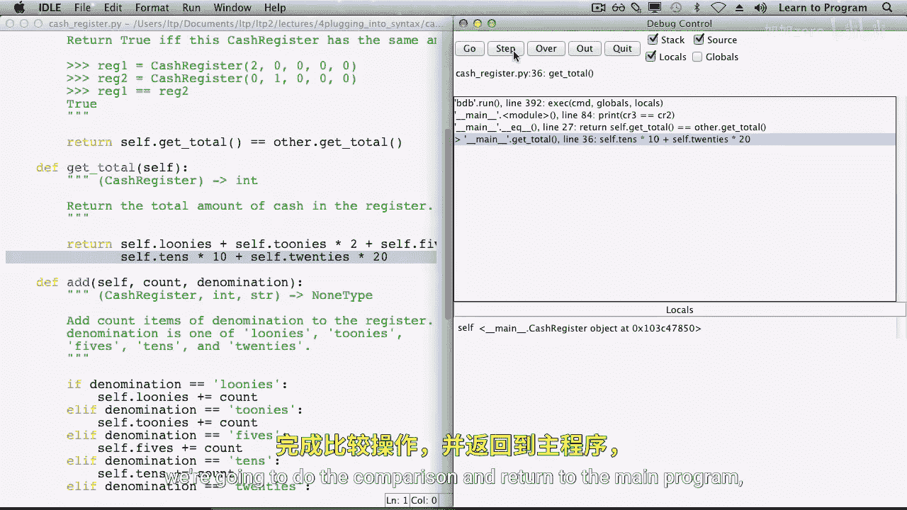

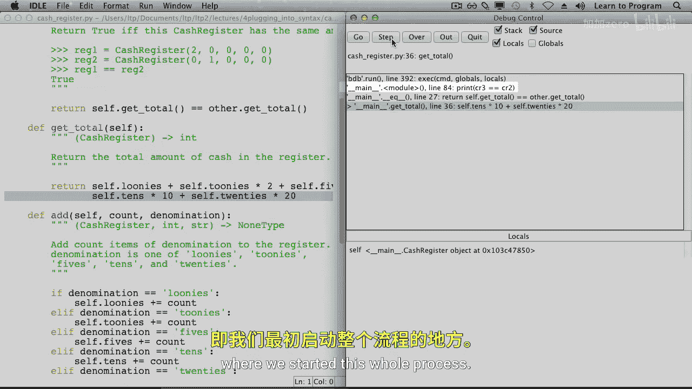

Here we go。You'll notice that we don't see anything。That is because the output。

Appear up here in the Python shell where it always has。

We're going to do one more thing involving equality。Let's go back up to our EQ method and。

Commented out。We're going to explore now what happens when we compare two variables for which there is no underscore E Q method defined。

Here when we run this。We see that both expressions produce false。

 That is because Python by default compares the memory addresses of the objects for equality。

 If there's no underscores E Q method defined find in the class， it uses objects。

 E Q method that we've inherited， and that method simply compares memory addresses。

Anytime you write your own class。You will need to decide for yourself what it means to compare two instances of your class。

Here， we can decide that two cache register for objects are equal and their totals are equal。

Perhaps we could have been stricter and said two cash register objects are equal when they have the same number of loonies and the same number of tunis and so on。

Or we may decide that two cache register objects are equal only if they are。

 indeed the same exact object at the same memory address。

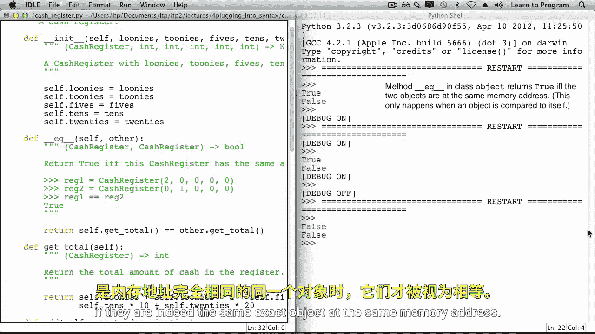