# 计算之美与乐趣：第4讲：变量与列表基础

在本节课中，我们将学习编程中的两个核心概念：**变量**与**列表**。我们将探讨变量的作用域、不同类型变量的区别，并初步了解列表这一强大的数据结构。

## 变量：数据的容器

变量是编程中用于存储和引用数据的基本工具。在Snap!中，变量有多种形式，其核心作用是**抽象**和**共享数据**。

### 变量的类型与使用

在Snap!中，变量通过 `set` 块来赋值，并通过橙色的变量名块来使用。每个变量都有其**类型**，例如文本或数字。将错误类型的值放入操作中（例如将文本与数字相加）会导致错误或 `NaN`（非数字）结果。

**公式示例**：`set [hometown v] to [Honolulu]` 将文本“Honolulu”赋值给变量 `hometown`。

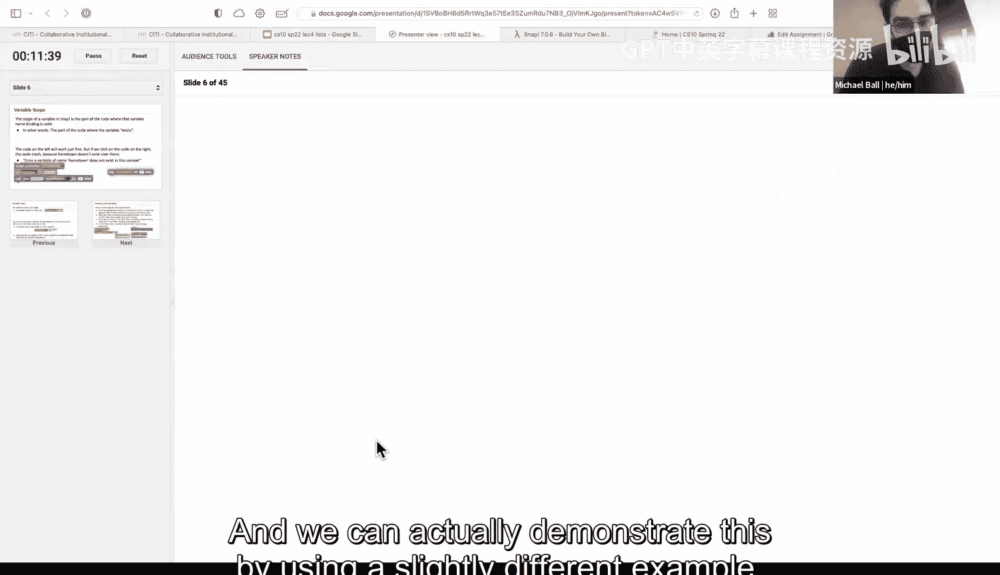

### 变量的作用域

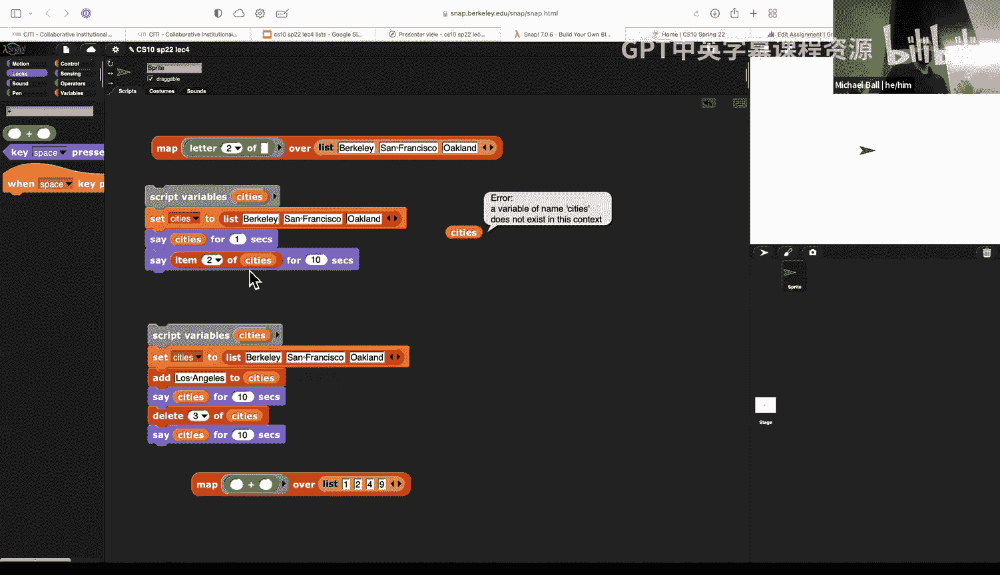

变量的**作用域**决定了它在代码中的哪些位置可以被访问和使用。理解作用域是避免错误的关键。

以下是Snap!中几种主要的变量作用域：

*   **脚本变量**：使用“script variables”块创建。这类变量**仅存在于**直接连接在该块下方的脚本中。尝试在独立的脚本中使用它会引发“变量不存在”的错误。
*   **块变量（参数）**：在自定义块中作为输入参数定义的变量。这类变量**仅存在于该块的定义内部**。
*   **循环变量**：在 `for` 或 `for each` 循环中使用的变量（如 `i`）。这类变量**仅存在于该循环的内部**。
*   **全局变量**：通过“Make a variable”按钮创建的变量。这类变量**可以在整个项目的任何地方被访问和修改**，但过度使用容易导致代码混乱，通常应谨慎使用。

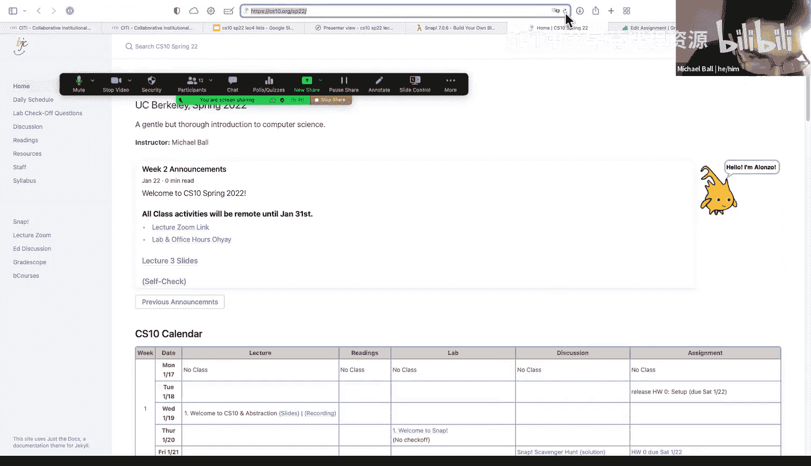

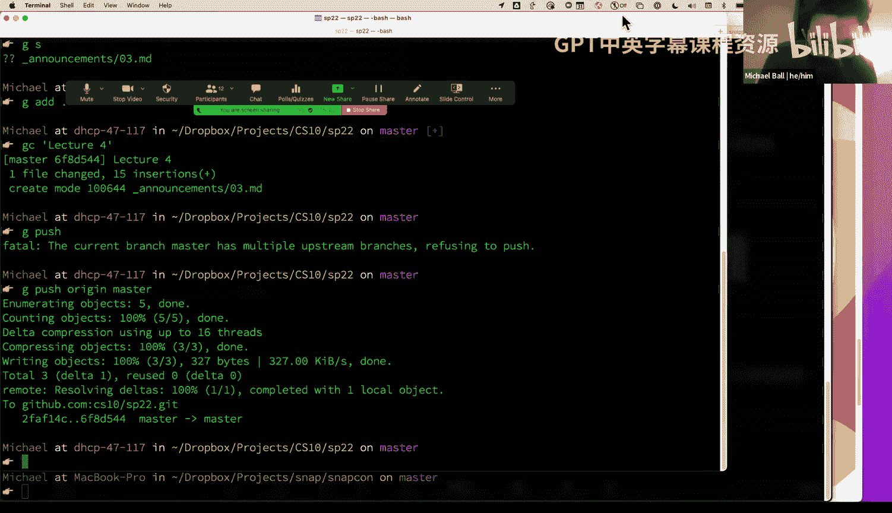

作用域规则帮助我们在程序变得复杂时，清晰地管理数据，防止变量在不该被访问的地方被意外修改。

## 深入理解：变量作用域实战

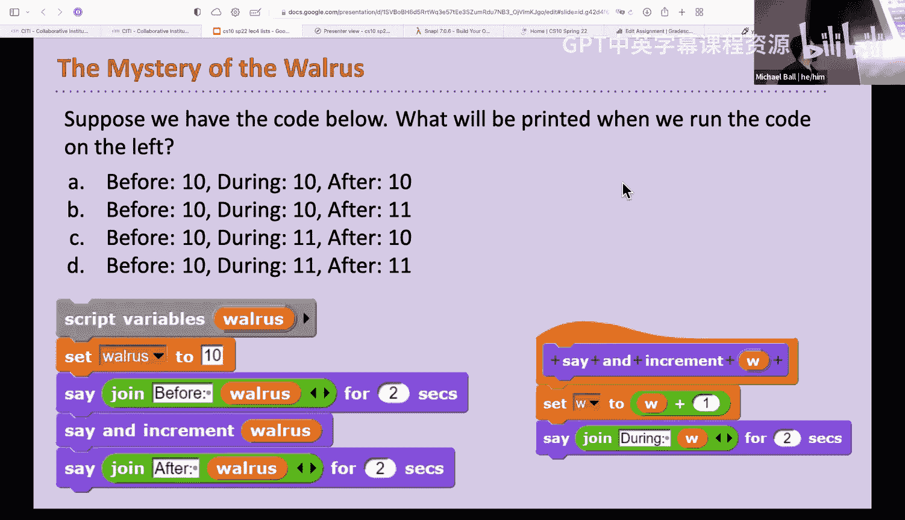

上一节我们介绍了变量的基本概念和作用域，本节中我们通过一个具体例子来看看作用域如何影响程序运行。

我们分析以下脚本：
1.  创建脚本变量 `walrus` 并设为 `10`。
2.  显示“before 10”。
3.  调用自定义块 `say and increment`，传入 `walrus`。
4.  显示“after 10”。

自定义块 `say and increment` 的定义是：
*   输入参数为 `w`。
*   将 `w` 设为 `w + 1`。
*   显示“during”和 `w` 的新值。

运行这个脚本，输出顺序是：“before 10”, “during 11”, “after 10”。最终，脚本变量 `walrus` 的值仍然是 `10`。

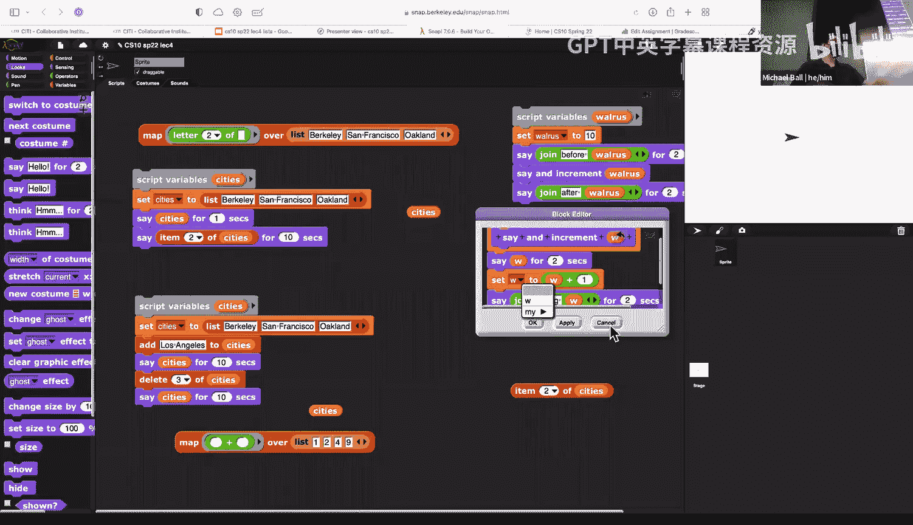

**核心原理**：当我们将一个**简单数据**（如数字、文本）作为参数传递给一个块时，Snap! 传递的是该数据值的**一个副本**。块内部的参数变量（如 `w`）与外部变量（如 `walrus`）是**相互独立**的。在块内修改 `w` 不会影响外部的 `walrus`。

**代码对比**：
*   `say and increment [walrus v]` 在调用时，实际执行的是 `say and increment (10)`。
*   块内的 `set [w v] to ((w) + (1))` 操作的是局部变量 `w` 的副本。

这个例子清晰地展示了块参数变量的局部性。然而，**列表**的行为将是一个例外，我们会在后面看到。

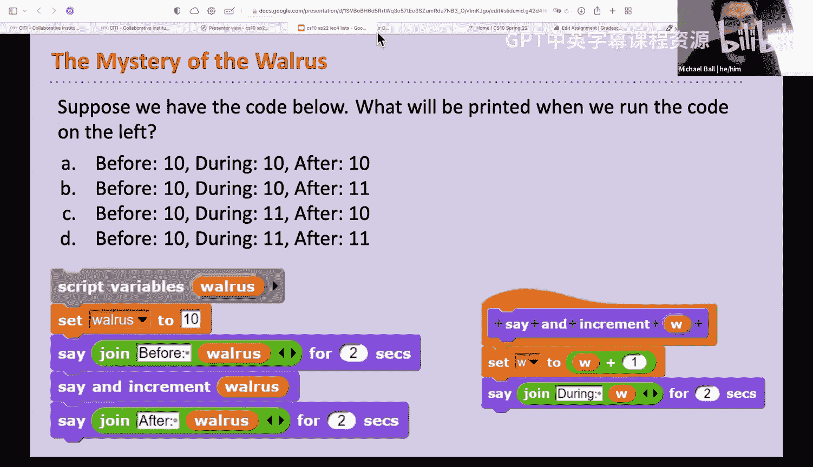

## 列表：存储多个元素的数据结构

变量擅长存储单个值，但当我们需要存储一系列相关的数据项时，就需要用到**列表**。列表是编程中极其重要的数据结构。

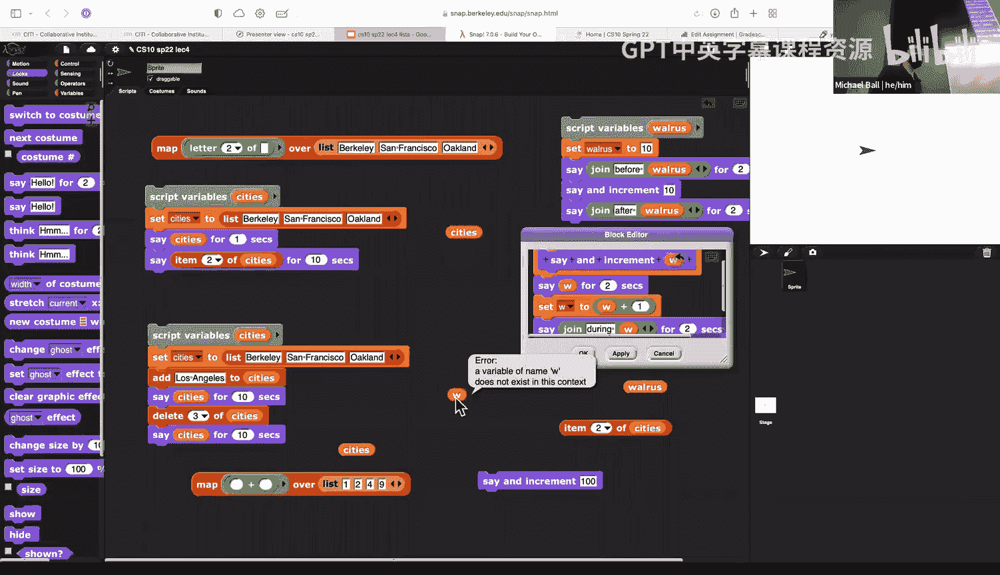

### 列表的基本操作

列表可以存储零个到任意多个项目。以下是列表的基本操作：

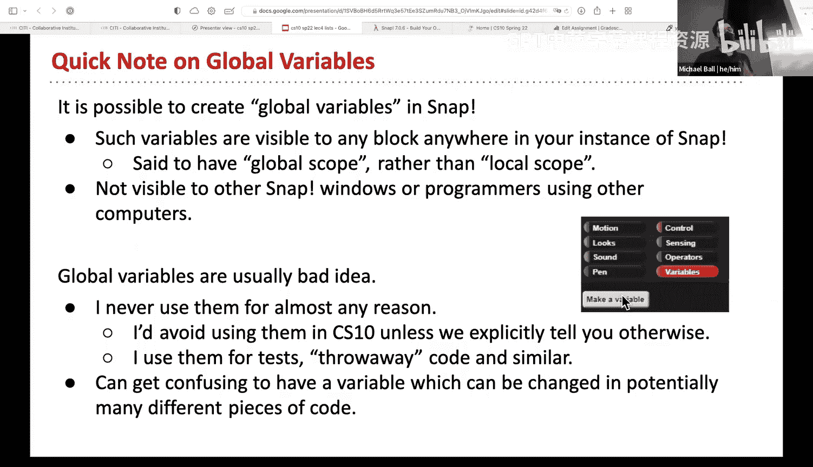

*   **创建列表**：使用 `list` 块。可以点击左右箭头增加或减少列表项。
*   **访问元素**：使用 `item [ ] of [list v]` 块。可以通过索引（如1, 2, 3）获取特定位置的元素，也可以选择“random”、“last”等选项。
*   **修改列表**：
    *   `add [thing] to [list v]`：将新元素添加到列表末尾。
    *   `delete [ ] of [list v]`：删除列表中指定位置的元素。

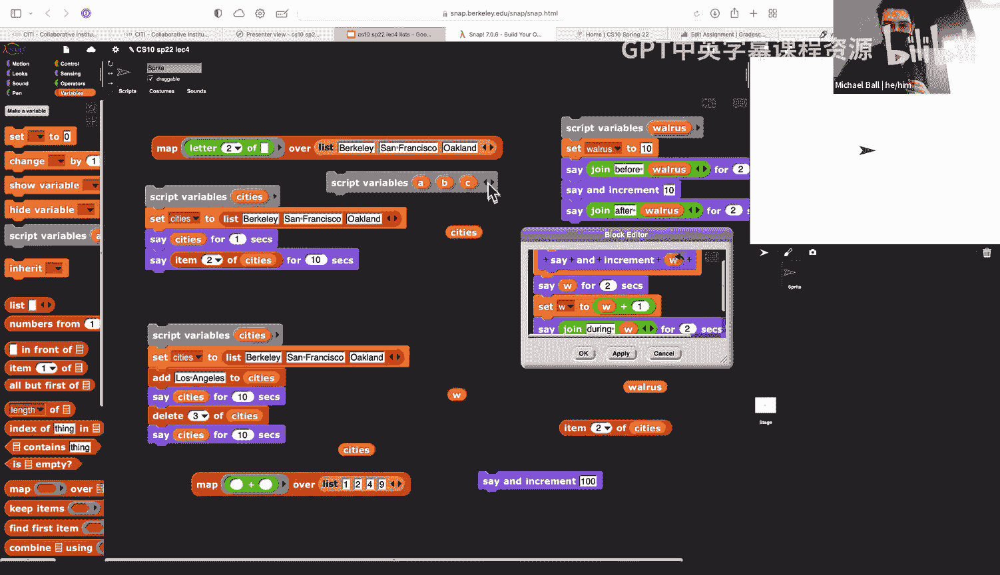

列表的应用场景非常广泛，例如：购物车商品列表、交易记录、待办事项、游戏中的排行榜或地图格子等。

### 列表的特殊性

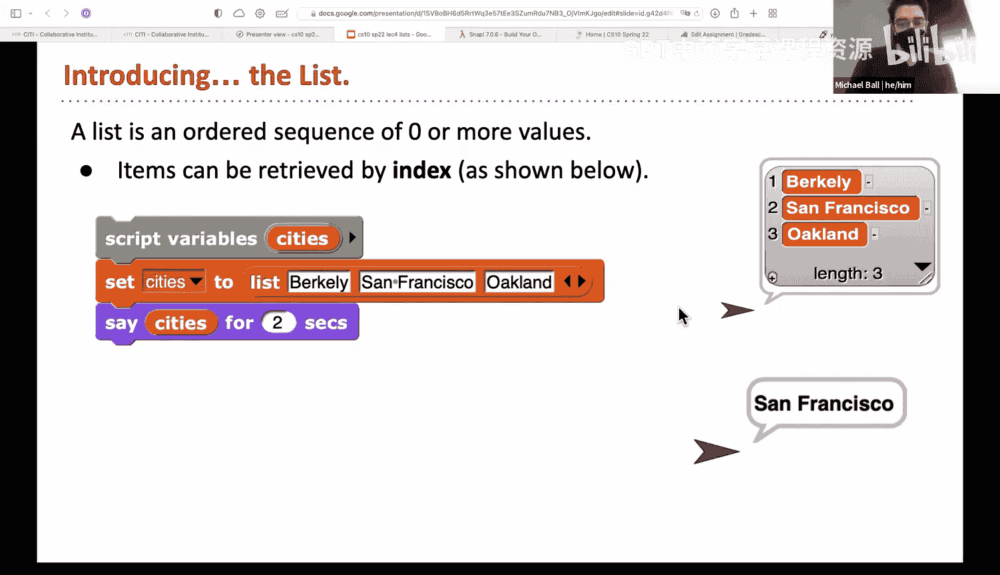

与数字和文本不同，当**列表**作为参数传递给一个块时，Snap! 传递的是对该列表的**引用**，而非副本。这意味着在块内部对列表进行的修改（如添加、删除元素）会直接影响到原始的列表变量。这是列表与简单数据类型在行为上的一个关键区别，我们将在下节课详细探讨。

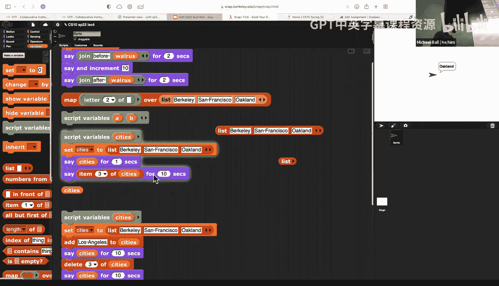

## 课程总结与预告

本节课中我们一起学习了：
1.  **变量**是存储数据的容器，理解其**作用域**（脚本变量、块变量、全局变量）对于编写正确代码至关重要。
2.  传递简单数据（数字/文本）给块时，传递的是**值的副本**，在块内修改参数不会影响外部变量。
3.  **列表**是一种用于存储多个元素的数据结构，支持创建、访问、添加和删除等操作。
4.  **列表作为参数传递时具有特殊性**，传递的是引用，在块内修改会直接影响原列表。

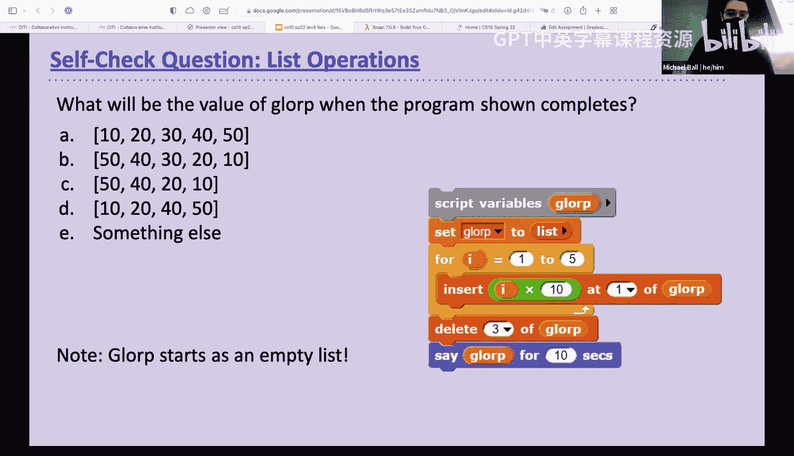

下节课我们将更深入地探索列表的威力，包括使用 `for each` 循环遍历列表，并进一步理解列表在函数间传递时的引用行为。请务必复习本节课关于变量作用域的例子，它为理解更复杂的编程概念打下了基础。