# UCB《计算之美与乐趣｜CS 10. The Beauty and Joy of Computing 2022 spring》中英字幕 p05 CS10 Sp22 Lecture 5 (Feb 2).zh_en -BV1BokLBmEKE_p5-

C， S 10 lecture。 Okay， cool， looks like。Zoom can hear me。We'll share the screen there。

I'll pop up in chat， but I won't be able to see it while' doing slides。And in that。Camera is。

 that's kind of。

Co， so。Schedule。I think most people noticed， but since we did not get through everything on。呃。食亲我嘅啊。

Yeahd。So since we didn't get through everything on。

On Monday we're going to continue with lists today and this is definitely something where there's kind of a lot going on right now and it'll hopefully start to feel a little more intuitive as。

诶。As we go along， so we start using lists as a way of holding multiple pieces of data in one item。

 so here we have a list of three cities but whatever we want to stuff in the list we can and Sap is pretty flexible about allowing a mix of information and lists。

So one of the nice properties about lists is that they are mutable。

 which means that with the same list， we can change， add， remove， delete。

 modify the items in the list without making an entirely new list。

And this is really useful because you can imagine that if we have a list of hundreds of thousands of items。

 it might be a little bit slow or it might take a little bit too long in terms of time to make an entirely new version of the list。

 and so lists provide this really nice property that allows us to modify their contents really easily。

Of course， what we'll also see over the next few weeks is that being able to mutate data sometimes has downsides and it can be a little bit confusing if multiple parts of your program are adding and deleting items in a list when we see a list like this where item three。

Is Oakland and we delete item three。It can be pretty clear in a small script what's going on。

 but as lists get bigger， things like delete three might not always make the most sense。

So we're going to look at today other ways of using lists and of course we mentioned that lists can be used for a whole bunch of things。

呃So。This is right where we left off on。On Monday these self check questions， by the way。

 are the exact same set， so I just made this lectures or four and five is now we're two points since we're sort of sticking to it roughly one point per lecture deal thing so take about 30 seconds。

And think through。The the question on here， so at the end。诶。K running this code。

 what will the contents of the list fork be when？When that last say like execute so take a few seconds if you have access to the slides and haven't had a chance to answer yet go ahead and do that otherwise I will be pulling up the submission responses。

And then we can talk about this one。And if you've already answered。At home or。

 that is also totally cool。But it looks like。This should be。If I the right question。Yeah。对。Yeah。

 so this is currently question two。That we're working on。Right now。It looks like about。

A little over a third of the responses are correct。And after today。

 I will turn on the correct responses so that you can submit as many times as you need。Yeah。

 so right now， about a third of the responses。correct so if people want to take sheep we're kind of spread out today so let's see what is the most commonly correct response I don't actually have that off the hand right now so let's let's walk through this code and and we'll talk about what's going on here。

So when we're working with a script variable like a list。

 so one of the first things to know is that lists。Are a little bit special in S when we start doing things like adding deleting items。

 we need to make sure that。The thing that we're adding to is already a list。

 so it's pretty important that we our first step is to set this variable G to an empty list。

 the little list reporter with no slots just means a list of no items and in snap。

Where did my snap go？

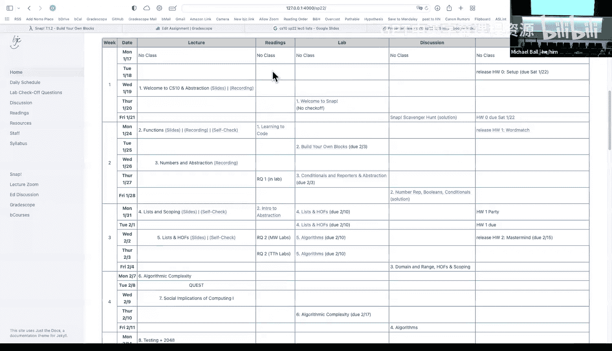

On the side over here。Is。This is what L looks like normally。If we want to start off with nothing。

 you can click the little left and right arrows。To add and remove items。

You can also sometimes it's easier to right click one of these slots to insert and delete items I like that a lot better that is also only existed in snap for like 72 hours so I think that's a handy addition。

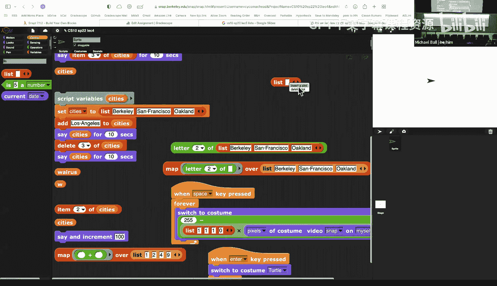

But the way that this code works is we first have this for loop。There's a few things going on here。

 at the for loop。Whi you've hopefully had a chance to see in lab goes from one to five。

 so that means at each iteration， this loop， that variable I will start off as one。

 then it'll be two， three， four and five。Insert at。Or excusecus me， insert the value i times 10。

At one of Gorp。In this code， after one iteration， the for loop， we insert the value 10。

At position one of our list。At the second iteration after we get to the end， the last。

A bit of our for loop so right down here we go right back up to the top of the for loop so when there's only one block we just repeat that block in this case five times so insert two times 10 at position two or excuse me at position one so now we have the list that looks like 20 as the first item 10 is the second item。

And at the very end， we delete item three of our list。AndWhy did the answer not show up there？呃，so。

The what we might initially expect， if we ignore the delete block before we get to the correct answer。

 right， we should expect that the list is 50， 40， 30， 2010。U。

So it's going through and just adding something at the very first item of our list each time。

 and then we delete item three， so 50， 40， 30 would be the third item that makes C。

Be the correct answer。And。喂。Okay， thanks cool slides。We're just going to put that on there。嗯嗯。Cool。

 actually， before going on， questions about， yeah， how this works。So a hand raised back there。

Yeah go ahead。喂。Yeah yeah so why is it going from a higher number in this case it's because this insert block over here I wish I had this written staff。

 but I don't have this actual script in the file， but this insert block says insert 102030 at one of our list so actually what I can do is。

呃， in。

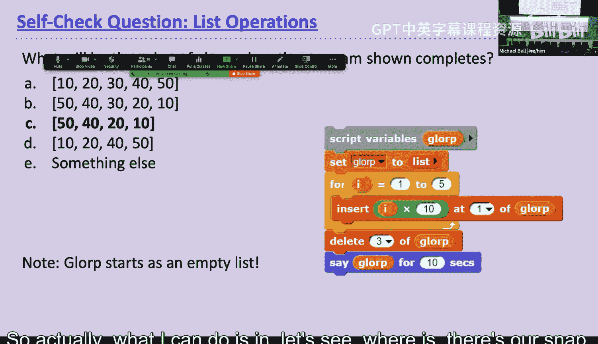

呃。Let's see where it is。Here's our snap。So。In this case。

 in a list like this right where I have the a block， the ad block adds something。

To the end of a list always。But if I。Wor to， let's say。Use the insert block。What I'm going to do。

Is a。And I just get rid of that so in this script i've changed we have a list of three items then we insert at one。

By this insert block。We'll now take Los Angeles and put it at the very first item of the list。

 so after each iteration instead of adding something to the end。

 we're inserting something at the very beginning of the list and that's why it goes backwards。

Or yeah， counts from yeah， 50 down to1。Yeah， good question though。So there another hand up there。

Please。Right yeah and if I ever do miss a hand and i'm like waiting on questions。

 feel free to just shout at me that's all cool。呃。

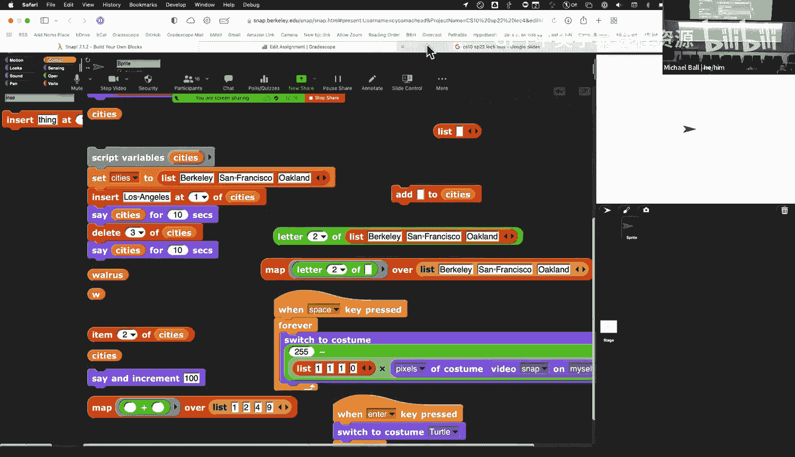

I would much rather hear your question than。Then miss it cool。So。

Ls are really useful as a way of storing data。And it turns out that one of the things that we'd like to do to list a lot is take the data that is inside a list。

And manipulate it in some way。And so。What we're going to do now is take a look at a new concept called higher order functions and higher order functions are if abstraction is one of the words that that we'll keep coming back to higher order functions are sort of the second thing that that will keep coming back to they are in some ways the reason that snap exists as a language like this。

But they're also a super central tool in how to think about solving problems they allow us to。

To approach problems in a more generic way， and importantly。

 if we think about that for loop where there's a lot of stuff going on。You know。

 they allow us to take these。What can we call this one， two， three， four， five， six lines of code。

 something like that， and shorten that up to be a little bit cleaner。

 but also hopefully a little bit more readable so。We're not going to solve this challenge exactly right now and or we're going to talk about how to solve it in a couple of ways。

 but let's say。And wentt to write a function。That tells us whether all of the items in a list。

Are between the numbers two and six， so the input is a list of numbers。

The output is a list of Boolean values true or false。

And the question is how do we get there I would encourage you all to take。

Some time and practice with the solution where we use a 4H block and the number this block。Yeah。

 we there should be a。Yeah， so we have the is between A and B block so that should be a block from lab。

 but you can make that right so with lessening greater than。

And you can write a solution to to this problem using a4 each loop adding things to a new list and so on。

 and so i'm not going to leave this。On a。Yeah， well okay。

 well we on it's more fun if you approach this later and sort of practice it again。

 but you know what we have here is a few lines of code where if the result is a new list。

 we create a new list， we add items to it。We report that new list back。And。

This is for a lot of questions that you might get asked a pretty intuitive solution。

 if we asked you how to do this in lab， this would be perfectly valid。

The thing that we might notice though， is that there's quite a bit of overhead in sort of thinking about making a new list。

 thinking about each item individually of our list and so。

In Sap and indeed in Python and JavaScript and many other languages that you might find yourself learning after CS10 there are functions that help abstract away some of this extra effort and so the first of these。

Is called map and actually at the end of this lecture we'll see how we further simplify the amount of code that we need here。

Map is one of the sort of most interesting blocks that exist in SAP has。呃。

A lot of different utilities。But in this case， what MA does is we give it a function now as an argument。

This block has two inputs right it has this gray ring over here and we'll talk about what that means。

And on the right hand side it has a list is input so the list is just any list that we've that we've talked about。

 but now what we see is that we can call functions。But instead of just calling functions。

 we can pass them in。As an argument to another block and。In this case。

 map is a higher order function because one of the arguments that it accepts is another function and snap makes this really quite easy in。

In python in other languages that can be a little bit more complicated just because the code is easy though don't mistake this for being a tricky concept so what's going on here well map we can think about it in relation to。

Processing items on a list so if we just focus on this code over here map。Is between two and six？

Over items of a list。What we're essentially saying is give me a new list for each of these items。

iss this function or is that item going to be between the numbers two and six？2。If we don't use MA。

 we have this sort of tedious task of every time we want to modify every item of the list or we want to process that data in some very consistent way。

😡，We will write a bunch more code and so map abstract set out and you might start to think like well okay maybe I understand this for loop the beauty of something like map is that it just reduces the time and the chance of mistakes i've seen many people in CS10 in CS88 and6 to a in industry use something like a for loop and mess up like the last parameters so instead of going from you know one to five it's one to six or something like that and you spend 20 minutes figuring out why where your bug is and it turns out all along it was just typepo so reducing code is not just a goal in terms of。

You know， some sort of beautification， but it has practical benefits there。So。The question is。诶。

Sort of why and how does map work and so what we'll start doing is looking at a couple of examples so。

Again， if we wanted to say we had this question of going from numbers to boolean values。

 what if we just wanted to subtract some values from a number or take the negative value of each of a list of numbers？

In map we can do。We can kind of start thinking about that these problems are exactly the same and so if I said how do I know the numbers between2 and6。

 how do I know how do I get the negative value of every number。

 how do I get the first letter of every word in the list how do I get the 100th letter of every word in the list okay hopefully you have words that are 100 letters long。

 how do I get really any particular value out of some item if you talk about like living in the semester will' look at some examples of using sound。

 how do I get the volume of each sample in of a sound in a music file you could you could use map for that and so what map allows us to do is say if I'm doing something to every item in a list。

 all I have to do is find what the right simple function is and I can use that to map over a list so。

We're going to do this。呃 with。We'll do this with our negative values。Because that is。

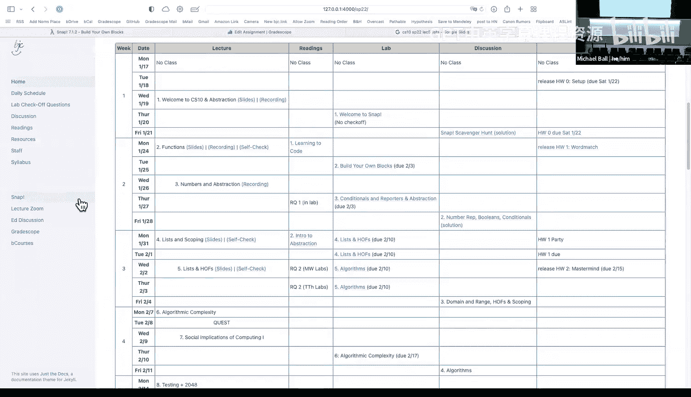

A little bit easier too。And actually， first what we're going to do is I'll make sprite。So。

Here is here's how map， so map lives at the bottom。Of our variables palette。

A kind of in the middle really and every time we see this gray ring what we what we should think is some block goes inside that gray ring and so。

No， I did not want to click on that。So I'm going to grab a minus block and so one thing to note the gray ring。

 what the gray ring says is instead of giving me the result of this block right now。

 delay giving me a result。Minus， right， if I say zero。inus 10， of course。

 I get negative 10 from that result。But what if I？Want to know。

What if I want to sort of just save a block and use it later， what the gray ring says is。😡。

Instead of giving me the result of whatever this block is， wait for some amount of time to。😡。

To then later on calculate the results and how map later on calculates the results and actually uses this block will be something for later in the semester。

 but for right now what you can think about is if something is inside a gray ring。

 what it means is the result of that block，We sort of be delayed in how it's computed so in this case what we have is map。

Zero minus a blank。And。Over。Over some list。So we have one。Well， okay。

 I'll to put that in the right spot。One， two， four， nine is what we've been using。

Now if we execute this， what we get。A the negative values， negative one， negative two， negative4。

 and negative nine。嗯。What map does， and this is the one thing that is a little bit tricky about map。

Is every time we leave a blank input in this function。

 map will replace that with the value of the items in our list， so this is equivalent to。

We'll duplicate this first。Zero minus one。Is0 minus2？And so on。

So what MA is going to do is each one not three four。Is each iteration of this loop。

 wherever maps use a blank， it will fill it in with the value of that position of a list。Yeah。

 let's see。I was Z traveling。对。Questions so far on on how on these two examples of map so we have taking a list of numbers making them negative and we have the example in slides of。

Of mapping drill list of true or false studies， questions on what map is doing so far。Yeah，那个版。对。

Yeah， yeah， math is absolutely a report and math importantly always reports a new list of some kind。

map。Well。Will take a list of values and it will report a new list of values one thing to know and we're going to talk about the other head of functions。

 but the way to think about math is。There's always this one to one relationship if I have a list of four items as the input to my map block I should have a list of four items as the output we can do some really like wild things。

Like if I leave no function in for math， what S will do is to say。

 you probably want the item as the result。I could just get my exact results back。

I could also do something really pointless。嗯。W is my。There we go。2。

Let's say I want to just map a list of this block， join Hello World。

I can map over a block which has no arguments， so every time I click。Join of Hello World B FII。

Duplicate this block。It's always just going to give me the phraseHello world。

So I could do something like map over a function， which has no empty slots that has no arguments that it accepts in this case because they've all been filled。

And so I get a list of Hello world forecasts。Typically not something new。

 but the important thing here to note is that with math。We have a four item list as our input。

 we should have a four item list as our output and what we can say is that。

Our output is going to look like whatever our input looks like or excuse whatever our。

The result of our of our function looks like so if join is giving us a stream back。

 we should see a list of strings。If I pass in some Boolean function。

 I should see a list of boolean values， so I should be able to see。I could do something。啊。So。

 that's not I want to do， but whatever。I could say is every value in my list greater than zero？

And now we will get back a list of true and false values。Yeah， so that's。

Good question about how map works， other questions about how MA works。卖了。So。

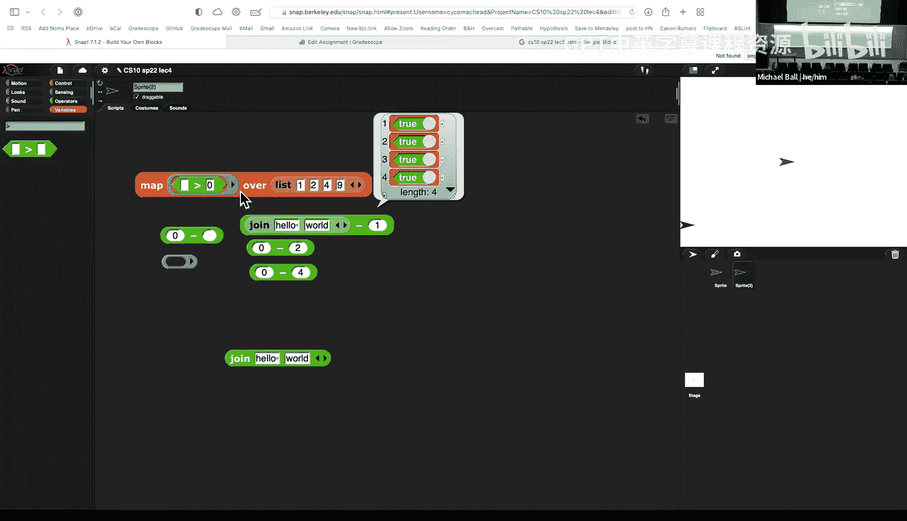

2。So in this case， let's look at question three really quick。诶，我ll see。What？

What do we think map will report for the list letter two of our cities？L。And it'll take， let's say。

15 more seconds is a good amount of responses already。But again。

 feel free to keep adjusting and taking a response。

Cool awesome so as we've been talking the correct response rate jumped by like twice what it was this morning。

 which means that y'all are paying attention and getting this so that's awesome yeah so the correct answer here is。

Is a okay， what to those slides is that when we take letter two of Berkeley。

 San Francisco and Oakland。What we get back is a list of EA and A。

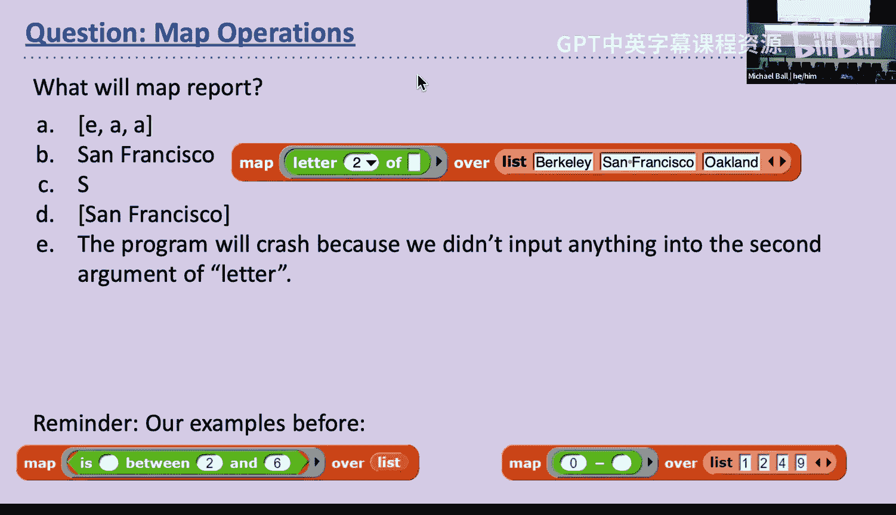

And if we really want， that's on this right now， but we could verify。系咁。

We can verify what this map does over here。ByBy executing。Again， whatever we do for Matt。Well。

I've just replaced that item as an empty input to。With each individual item as well。Again。

 one of the things in SNAP， this letter of block2 is not an option。

 but you can just type in whatever value you want there。

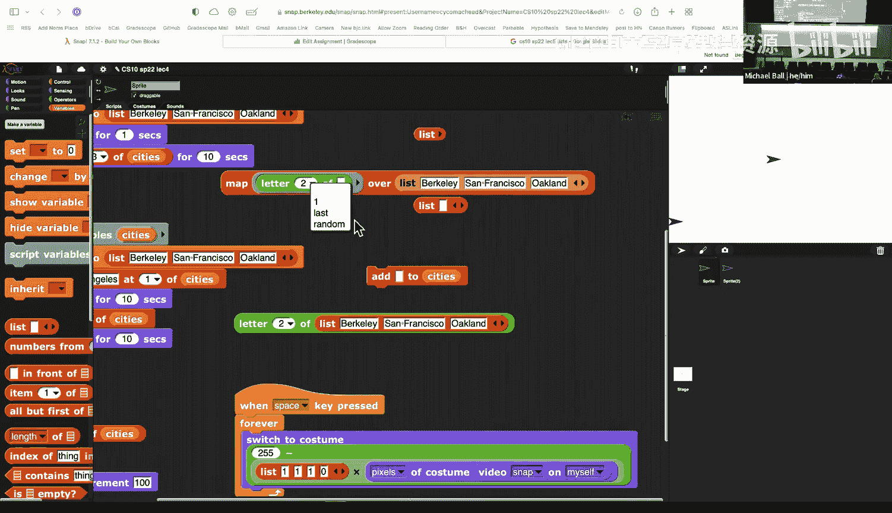

That is。How map works so map really works we can think of it as transforming a list from one form to another form。

It always creates a new list， so one thing to note is when we do something。With with a for each loop。

Or。The add and insert blocks we could be modifying some additional list map is always going to give us back a new list。

 it's never going to modify whatever data we put in as our second argument。😡，诶。And。嗯。Map will。2。

We'll always fill in the blanks with with the items the list today we're just going to deal with functions that have one blank in them map has a bunch of creative behavior if you have more than one blank it'll just fill in the items a couple of places but we're going to stick to one blank for right map。

So。😊，Actually， I take the back we are going to do one example of。Of more than one。嗯。

The two blanks because this will lead into combine。

 but we're not going to spend too much time on this so。

What I'd say right now is just take a second and have a guess of what we think。

The correct answer of question the should not be question four。

So this is definitely going to return a new list。What should the output be so our inputs this time are also1。

2，4，9 and we're mapping over the plus block with。嗯。Allright。So。This is。

A useful thing to know about SNAP is when we have multiple blanks。

I should probably not accept what I said because revealed some of the guessing。

 but what S will do is put each item in。

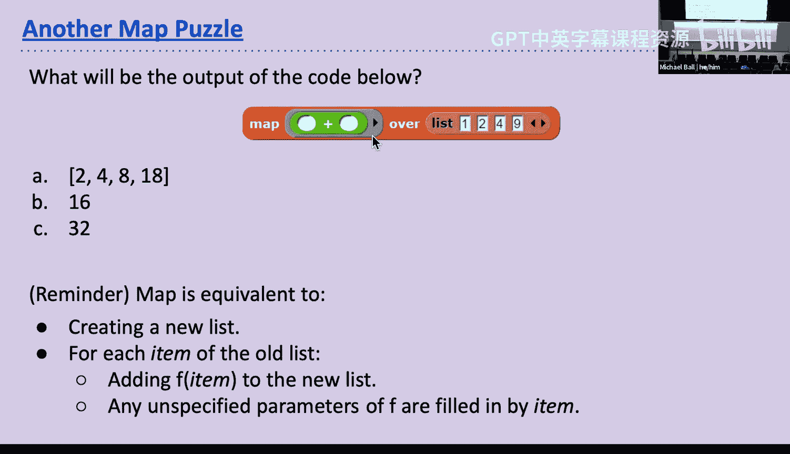

InIn the same blank， so if I go back to this example over here。嗯。嗯。啊。one。嗯。Duplicate this thing。嗯嗯。

你前啊。我俾拖死。So plus one， two， four， and nine。And。What snap is going to do is if we have more than one blank in this case。

 it's just going to fill all those inputs all those blank inputs with the same value of the list。

 so if I have。Two blanks and a plus that is essentially the same as multiplying by two。

Good thing about this。This will multiply by three because it's just。A plus a+ a。

 we could basically do as many blanks as we want and it'll be that same item multiple times。

And so this is a trick of。How map works and how it fills the multiple inputs inside our map block。

 but what we'll learn is that there are other hydro functions that operate in a little bit of a different way so。

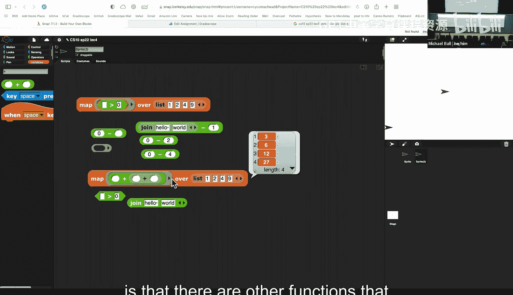

Yeah， that one worked correctly。so。What if we wanted to do something like take all the numbers in a list？

And pre their summer。CouldCould we conceptually do this with math？Well。

 if we think about what MA does， if I say map always reports a list。

And we want a sum of single values。The answer is from that perspective， note。

Right we want one answer map is going to give us a list those are two different types of data it's not going to to line up there。

 but could we conceptually have a block which says after I take this first item one，Could I then。

 you know the second time I get a number two， could I know that one plus two is three and then the next time I see some value four like could I start to add each together？

How would a block like that look？And it turns out that。Something like summing the values in a list。

It's a pretty common operation， but map can't be the block that helps us out because map is always where to transform one list to another list。

But。😡，What we do have is a new block that we'll get to called combine and before we get to combine it's worth thinking about well how do we sum values ourselves well like what I said is we can take we can take a first item add then to a second item then to a third item for item and so on and so this is a pretty typical loop right for each item。

Add the value of the item with a previous result。And what we get back here。

Is the some of our numbers is 16。啊 so。That is。And that's fairly a fairly standard forward loop。呃，不。

Is there an analogous higher function that lets us solve this？2。

And and there is and there are also other ways of sort of app push so'm i'm actually going to skip this one for right now is。

Combining numbers， so the combined block in snap is。

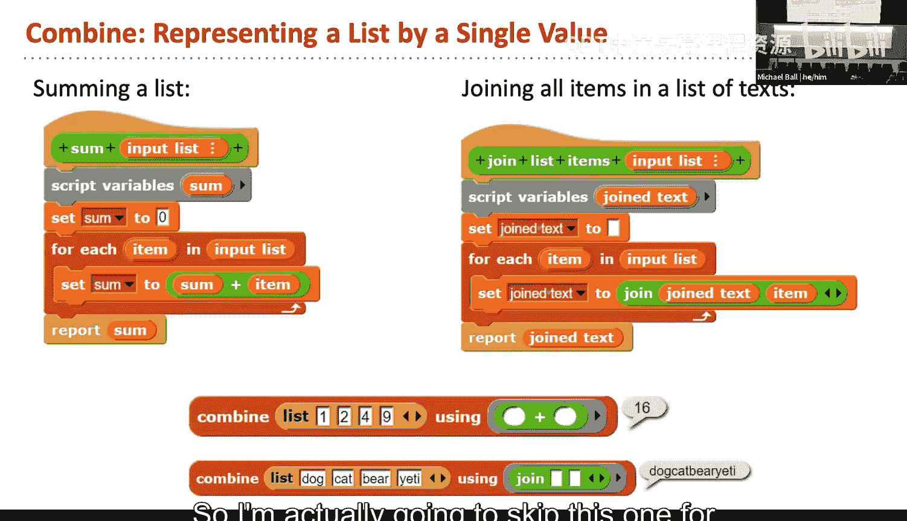

And this one we're going to build。The combined block is。

 I think one of it is a super usefulive function， but it's one of the ones that is a little bit trickier to understand。

The combined block says that I want to take。All of the data。呃， in。In a list。嘅よ。

And use a function to cumulatively build a result。If I went to sum of the values。

I can tell you that this definitely works right now what I want to do is to take the result of the first atorial list。

Add that to the second result。Take that result add it to the third result so in a way this looks similar to our that the process can be similar to this for loop but what we get back is a single value one plus two plus four plus9 is the value 16 and what combined is doing here is taking one item at it it starts with one item and then it saves that result and it adds that to this to the next item of the list adds that result to the third item adds that result to the fourth item until it reaches the very end of the list so combine using plus is。

So is one of those operations that you'll find a lot of uses for？

We can combine data or text data using the join block， so the example。

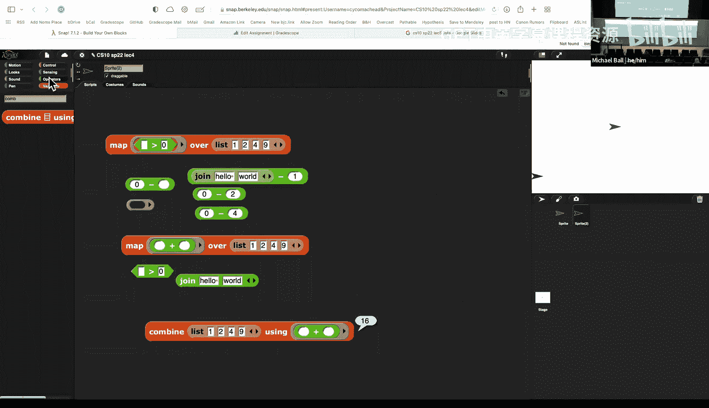

On this slide is if we。Once to join a bunch of words together。

 we can combine using using the join block down here。

 but any data that we sort of are sticking together in some form，But we can。

We can get a single result of it。I believe it's still in lab。But I really。

A really good exercise for combined is thinking about how would we build a function using combine that finds the largest or smallest item in a list。

 there's a lot of different ways to do that but you can write a combined function to get the largest item of a list。

And so。Combined is is one of these tools that again is a higher function。

 but it works in a different way than math so one way to approach this is and this will be something that。

If you're thinking about how map works or how combined works is just remember that combined always takes a list and reduces it down to a single value map always gets you back a list of multiple items and so before we get to keep I want to stop right there and questions on un combined and how works because combined is definitely a little bit of。

Of a tricky higher order function。Questions on un combined。Yeah， theres a hand back there。诶杀我杀送你嘅。Ps。

y oh yeah sorry佢因为。Yeah， what is yeah？Yeah， that's a good question so why。

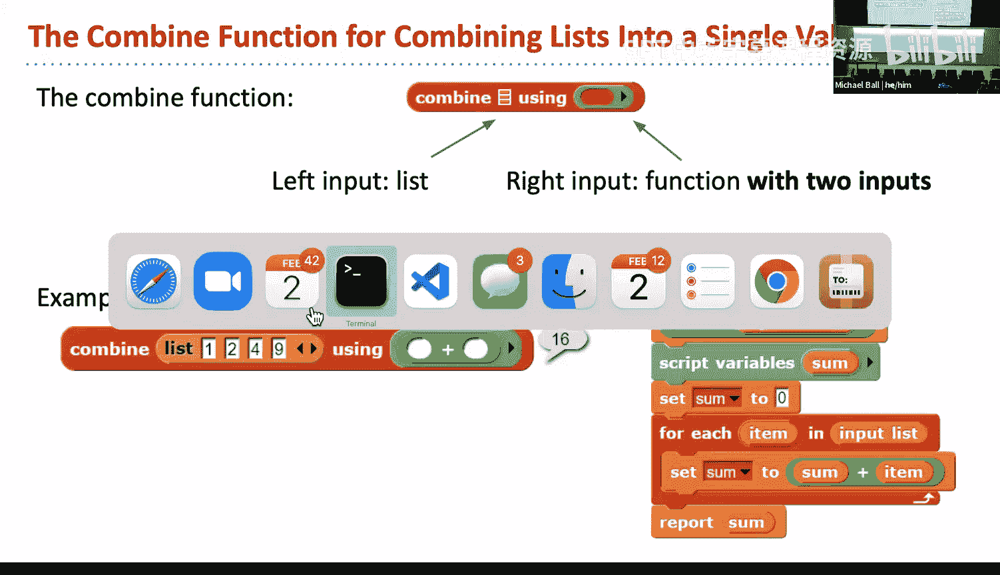

Why doesn it combine？Okay。手もってください。So why doesn't this do something like adding one two and three quote？

The way to approach combine is that。In the setup for combined。

 it's taking one result so we can think of this as。嗯。Let's say。嗯，哪过来的。

If our list is just two items right we're going to we can think of this as two item list with combined is little to the same thing as just putting each item in our blog。

 but what combined is really doing is，It's taking each item， building a result。

So that result goes into the left。The left slot of our block and then the。

The next result goes into the right， so actually the way to probably draw this out。So yeah。Make a。

They go back to our list is to say。What combine is doing here？Is we can think about this as one。

And two， right， are our first two items。When we solve that question。What we get for those is three。

Plus Dvalue four。And once we solve this question。What we get is。7even。

Plus D value nine is our last time of our list？And so what combined is essentially doing is it needs two inputs because one is always on the left side is the result of our calculations so far and the right side is the next item of our list。

And in SNapAP combined always goes from left to right in other programming languages that's not always the case of how combined might actually go right to left。

 so you can actually rely on the behavior of combined going from right to left。

 but that's sometimes confusing them to sort of expect it to go that way。

 but if you were to let's say use a subtraction block right。

 you could start subtracting one minus two minus4 minus9 would be a valid way of getting the difference of everything in a list。

Yeah， does that help。Yes， good question， other questions on combined。Yeah。😊，Yeah。

 can you combine a map and combine together yeah absolutely so in a。

I don't know when I was going to be this semester， but anywhere that you。嗯。1ant to。

Where the result of a block makes sense you can drag them into to each other so a really fun example。

 I don't know if this is in。In the lab right now， but is taking a sentence like the University of California at Berkeley and narrowing this down to the letters UCB with making a block acronym that uses just higher order functions。

And typicallypically the way that this works is， let's say the question was。

What is the sum of the squares of values in our list so let's say a list is the items one two。

 four nine。Another trick over here is if we have a block。

 this is command relabel so I can just turn a plus。Into a multiplication block。

AndThe question is what if I want to know the sum of all the squares？系食么来啊。哎，就不这个す。So I can first。

Yeah that。Okay for。我色瞓水睇。There we go。So。If I first want something like the sum of squares of a list。

 I can map to get the square of a number， then I can sum them using combine。This should。嗯。

102 I don't know offhand if that's the correct result but i'm going to assume it is since map computers are good a map so I could square each value then some together could you use like a map as a function in your combine there are conceivably problems but that would be a little bit weird could you map combine over a list that you can also do but it requires a problem setup that is pretty complicated。

Where you have lists inside lists， so we're not going to do either of those。

 but if the shape of your data， so if you have lists of lists， if you have lists of numbers。

 lists of text， as long as that what comes in and what comes out a line， then snap let you do。

 whatever， but typically what you'll see that we do is we use a map as a way of making a list and passing that to combine。

 rather than using map as the function is input to combine。Yeah， good question。Other questions on。

Map were combined so far。今日都系。Yeah。😊，Yeah， they are conceptually simple ways of for loops is the。

Yeah， I think that's the best way to approach them in reality the way that they are implemented is a little bit different and because a for loopop uses command blocks right you have to approach the problem of building a new list or modifying some data a little bit differently。

 but what I would say is if your for loop is something that's going to build a new list or turn that new list。

 there's a very clear one to one mapping of map to combine and so on。

And they'll always process that order from sort of left to right of our list。H。

Other questions before we do。A last part of functions。写下的嘢。OfOf course，So。哎。

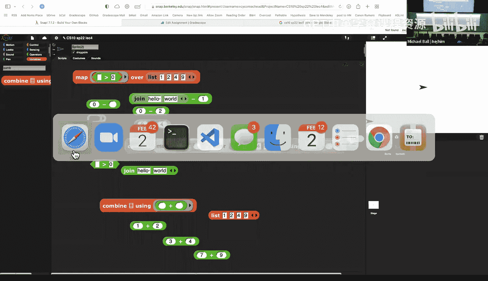

B。诶。So I mentioned before a higher function is any function that takes in a function as an input to that function。

 so map and combine each take a block as one of their inputs。There is。呃 in a。

In the next week we're going to look at a couple additional higher functions。

 so keep is a third higherer function which will filter items from a list so anywhere where notice and keep that this block input is a predicate block so this should be something that only returns to a false。

We'll filter a list to only return the items where this function is going to report true。

 so we'll explore that。嗯。And I'll point out too as well。

 I don't know why I got chopped off the slide。

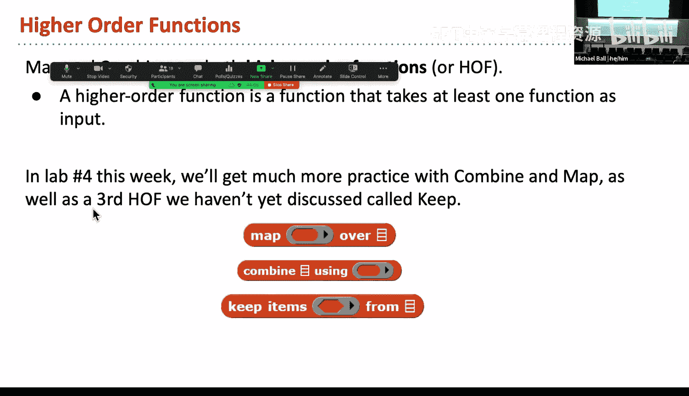

But in S there is。不黄色。And S there is。A fairly recent。

A fourth higher function called find so find will find the first item of the list which matches whatever function you pass in so if you're searching for someone's name in a list if you're searching for some values in a list find is a way to do that where you can pass in a function that makes your finding operation really complex so that's one option for another higher function so we'll play with more of those in in the next couple weeks。

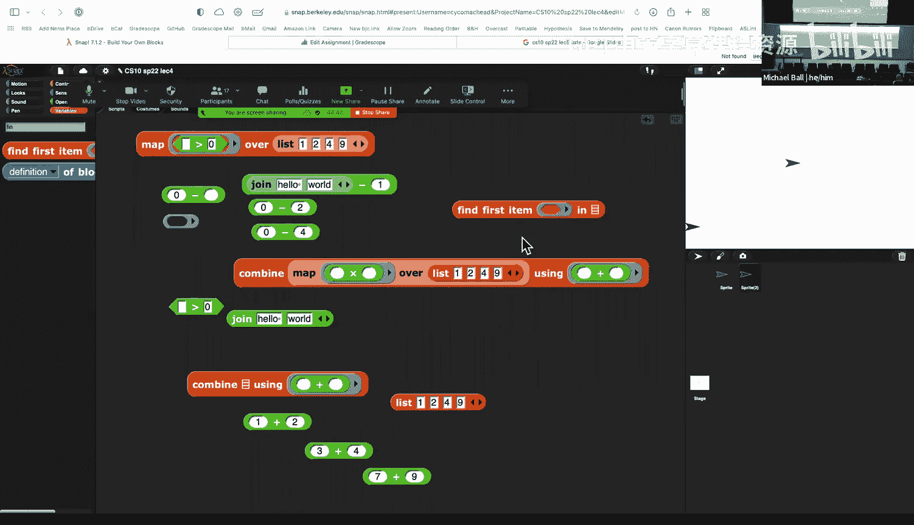

The last。嗯诶好点唱嗯，系， so。嗯。I'm going to spend more time with hyperblocks in discussion this week。

 but I wanted to sort of quickly introduce the idea of hyperblockox and SNAP and hyperblocks are in a lot of ways an even shorter version of math and this really comes from the idea of data science and data processing with and sort of putting that into SAP so。

If we take our basic math functions like add subtract multiply divide。😡。

In the past we told you that they only worked on numbers。

 which was true up until about a year ago and now what they do is these functions work with lists of input and so hyperblocks are a way of saying if you drop a list。

Into some slot that is， let's say。Let's just look at this plus block at the bottom for now。

Now I am just going to assume that what you want to do is do this operation for every single item of the list。

 so instead of mapping plus three over list we can say list plus three and we get the results instead of mapping or multiplication we can say list times one list and what this does here is it's just a pairwise multiplication of these items and so。

Paper blocks allow us to take a map operation and shorten it up into a couple steps。

 and they are a super useful tool。

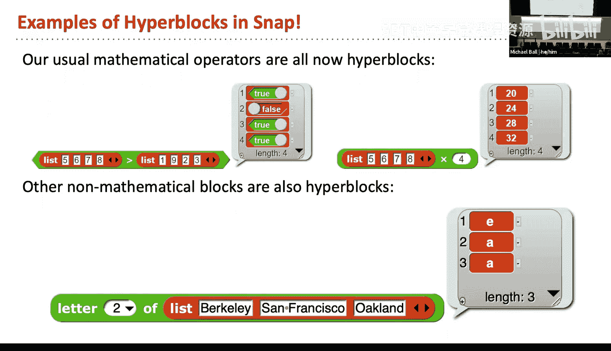

But I will say at the just as the last demo is。

The reason that this exists snap is because it allows us to do- I just allowed this early。

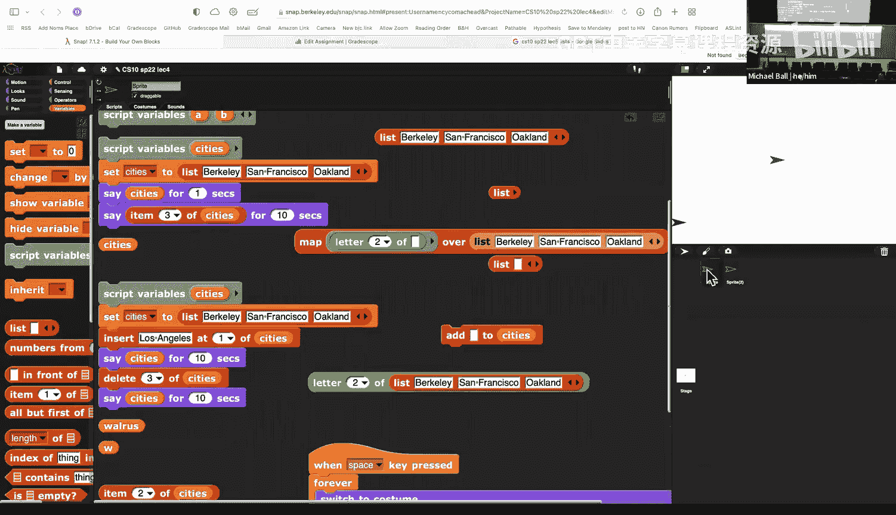

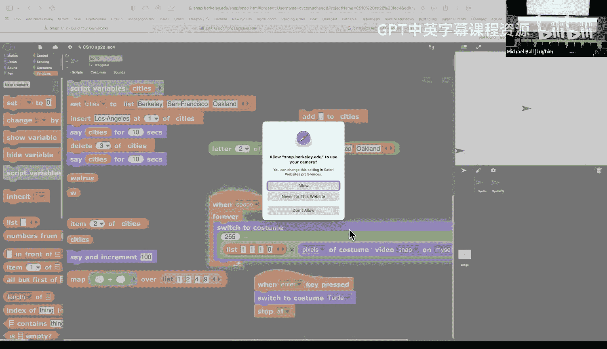

It allows us to do some really fast computations I don't know why that so if I so one of the blocks that you'll get to play with is this camera block so Sn can read data from the webcam so I can build just a couple lines of code a function which inverts all the colors in a picture we'll talk later in the semester about how this map actually works but if I want to I can just write one line of code to take an image invertted and then display on the screen so paper blocks have this really useful purpose of not just being concise but being super optimized to modify hundreds of thousands of items of data really really quickly selection that you can do things like make really creepy negative images of your webcam so we'll leave that here today we'll have lecture Monday it will not will be covering。

う。We won't cover any material that will be explicitly tested but the material on Monday will be useful for the Que and if you are looking to take the quest remotely。

 we will send out an email later today for remote accommodations DSP accommodations if you're out of town whatever it is。

 we'll make sure you're set up for the quest next week， so do watch out for that。Thanks。😊。

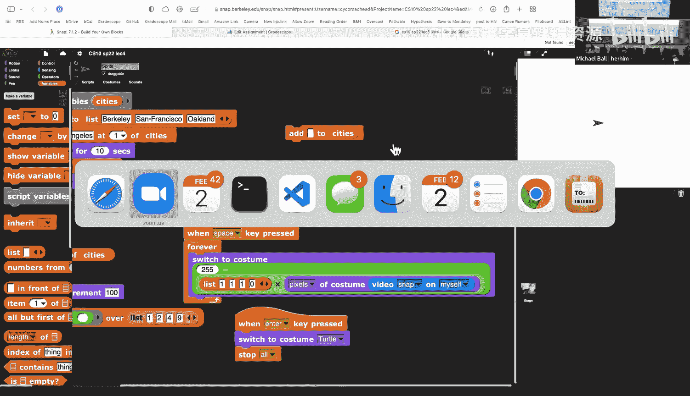

Yeah。