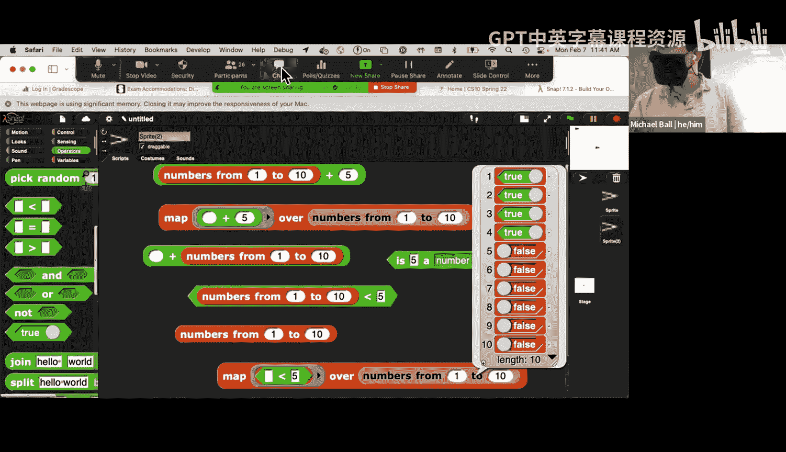
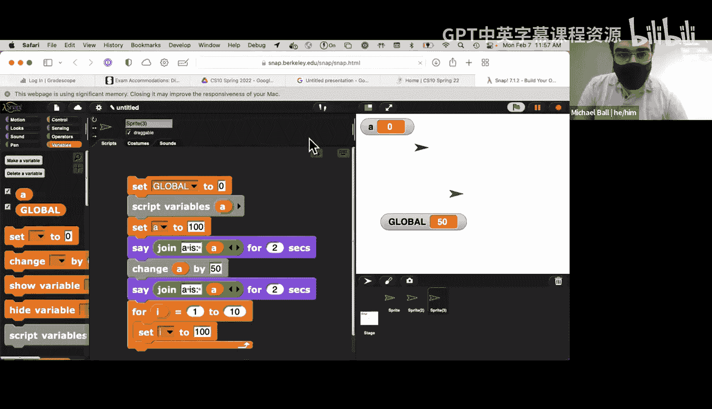

# 计算之美与乐趣：第6讲：期中测验复习与答疑 🎯

在本节课中，我们将回顾课程前半部分的核心概念，特别是高阶函数、超块和变量作用域，并为即将到来的期中测验（Quest）进行答疑。我们将通过具体示例和过往考题分析，帮助你巩固知识，建立解题思路。

---

## 高阶函数复习 🔄

上一节我们介绍了高阶函数的基本概念。本节中，我们来看看三个核心的高阶函数：`map`、`keep` 和 `combine`。理解它们的定义域和值域是掌握其用法的关键。

所有这三个函数都接受两个参数：一个函数和一个列表。`combine` 的参数顺序是相反的（先列表，后函数），但其工作原理相同。

*   **`map`**：对列表中的**每一个**元素应用给定函数，并返回一个由结果组成的**新列表**。其输出列表的长度与输入列表相同。
    *   **公式**：`map(F, [x1, x2, ..., xn])` -> `[F(x1), F(x2), ..., F(xn)]`
*   **`keep`**：使用一个**谓词函数**（返回 `true` 或 `false` 的函数）来过滤列表。只保留使该函数返回 `true` 的元素。
    *   **公式**：`keep(P, [x1, x2, ..., xn])` -> `[xi | P(xi) == true]`
*   **`combine`**：使用一个**二元函数**（接受两个输入的函数）将列表中的所有元素“归约”或“合并”成一个**单一的值**。
    *   **公式**：`combine(F, [x1, x2, ..., xn])` -> `F(...F(F(x1, x2), x3)..., xn)`

以下是 `combine` 函数的一些常见用例：

*   **连接文本**：将单词列表合并成一个句子。
    *   **代码示例**：`combine(join, ["The", "University", "of", "California"])` -> `"TheUniversityofCalifornia"` (若 `join` 中间不加空格)
*   **数学运算**：寻找列表中的最小值、最大值，或对所有元素求和。
    *   **代码示例**：`combine(min, [50, 49, ..., 20])` -> `20`
    *   **代码示例**：`combine(and, [true, true, false, true])` -> `false`

`combine` 适用于那些可以连续对两个元素进行操作，并最终得到一个单一结果的场景。

---

## 超块（Hyperblocks）⚡

理解了显式的高阶函数后，我们来看看一种更便捷的隐式操作列表的方式：超块。

超块是 Snap! 中一些内置的运算符（主要是数学和比较运算符）的特性。当你将一个列表作为参数传递给这些运算符时，它们会自动对列表中的**每一个元素**执行操作。

以下是超块的一些典型应用：

*   **对每个元素进行运算**：`[1, 2, 3, 4, 5] + 5` -> `[6, 7, 8, 9, 10]`
    *   这等价于：`map((x) => x + 5, [1, 2, 3, 4, 5])`
*   **逐元素比较**：`[1, 2, 3, 4, 5] < 3` -> `[true, true, false, false, false]`
*   **列表间运算**：`[1, 2, 3] + [4, 5, 6]` -> `[5, 7, 9]` (要求两个列表长度相同)

需要注意的是，并非所有块都支持超块特性。通常，命令块（如 `move`）和某些特殊的报告器块（如 `split`）不支持此功能。最安全的方式是在 Snap! 环境中亲自尝试。

---

## 变量作用域（Scoping）📦

在编写复杂程序时，理解变量在哪里可以被访问和修改至关重要，这就是变量的作用域。

在 Snap! 中，变量主要有以下几种作用域：

1.  **全局变量**：在整个项目中都可被任何精灵或脚本访问和修改。
2.  **脚本变量**：在某个 `script variables` 块下方声明。它们仅在该脚本的后续部分中可用。
3.  **块变量**：作为自定义块的输入参数。当调用块时，传入的是该变量的**值的副本**。在块内部对此变量的修改**不会影响**块外部的同名变量。
4.  **循环变量**：例如 `for` 或 `for each` 循环中的索引变量。其作用域仅限于该循环体内。

**核心原则**：当变量作为参数传递给一个自定义块时，块内接收到的是该值的一个**独立副本**。在块内修改这个参数，不会影响原始变量。

---

## 过往考题分析与备考建议 📚

为了帮助大家更好地准备，我们来分析一下过往考题的特点，并提供一些备考策略。

以下是一些有效的复习方法：

*   **完成自测题**：课程提供的自测题是很好的复习材料，完成后可以查看答案解析。
*   **研究过往考题**：在课程网站的资源页可以找到历年的期中测验题目。特别是近几年的题目，具有很高的参考价值。
*   **理解而非死记**：重点关注高阶函数、列表处理和变量作用域的核心概念，而不是记忆特定代码片段。
*   **动手实践**：在 Snap! 中重现题目中的场景，亲自测试不同的输入和函数，观察输出结果。

**关于本次测验的提醒**：
*   形式：50分钟，8道选择题（共15个小题）。
*   范围：涵盖截至第四周课程开始前的内容（注意：算法复杂度等后续内容本次不考）。
*   如果需要在远程参加考试，请务必提前填写相关表格。

---

本节课中我们一起回顾了高阶函数（`map`, `keep`, `combine`）的用法，了解了超块如何简化列表操作，并梳理了变量作用域的关键规则。通过分析过往试题，我们明确了复习方向。请记住，理解核心概念并辅以动手实践是成功的关键。祝大家在期中测验中取得好成绩！