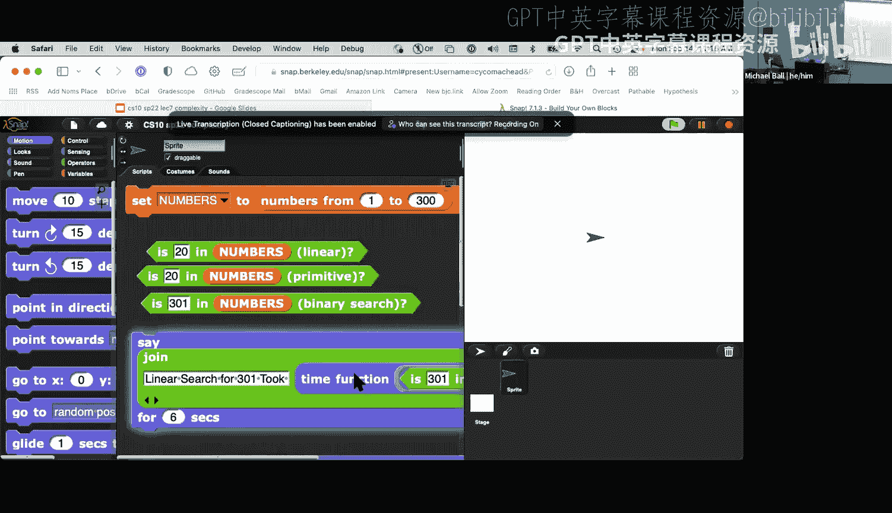
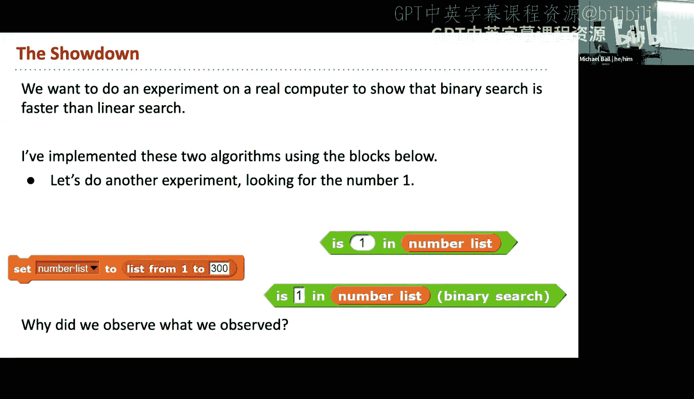
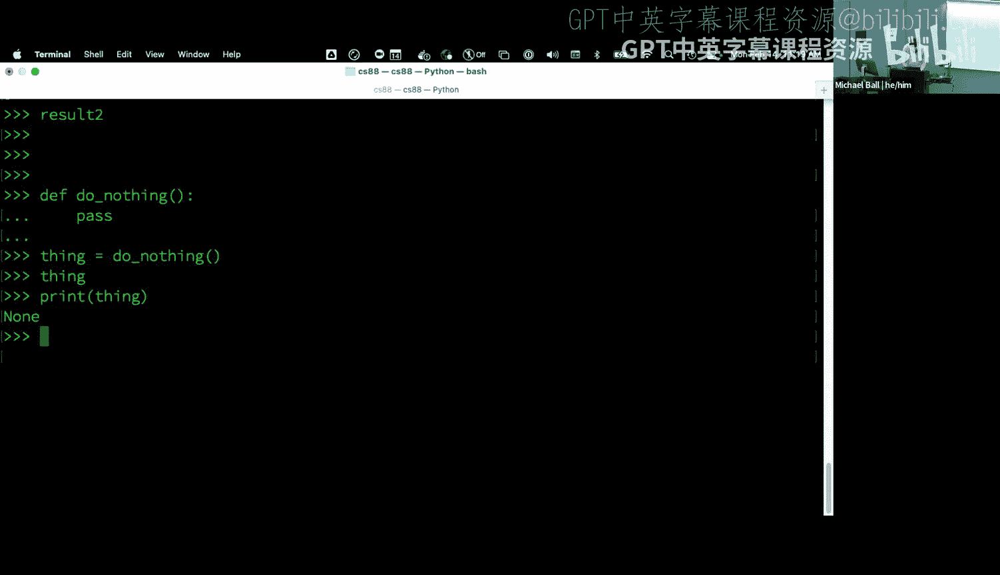
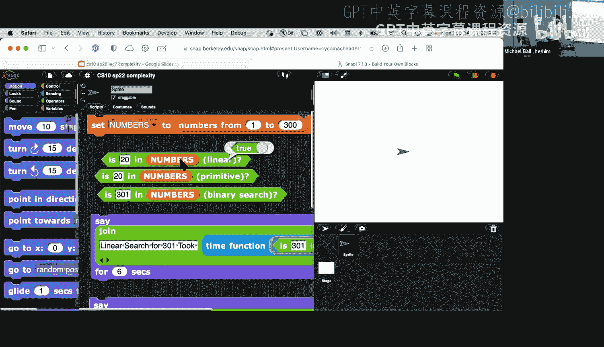
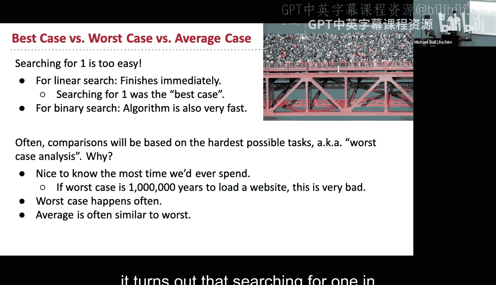
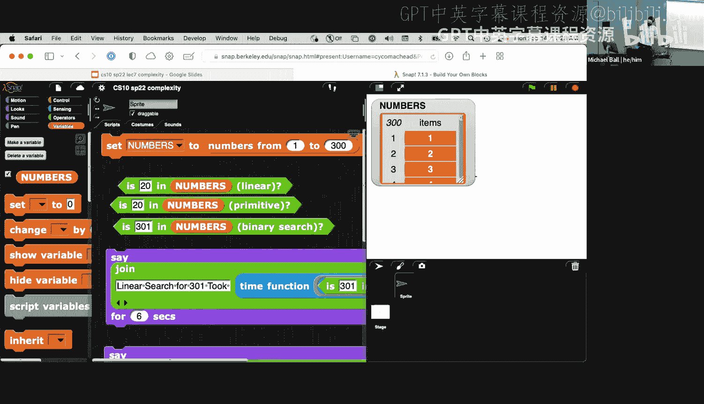
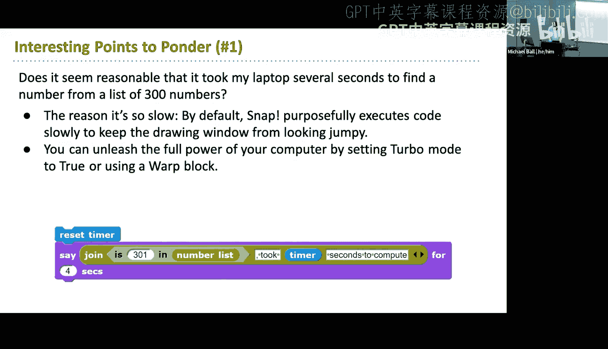
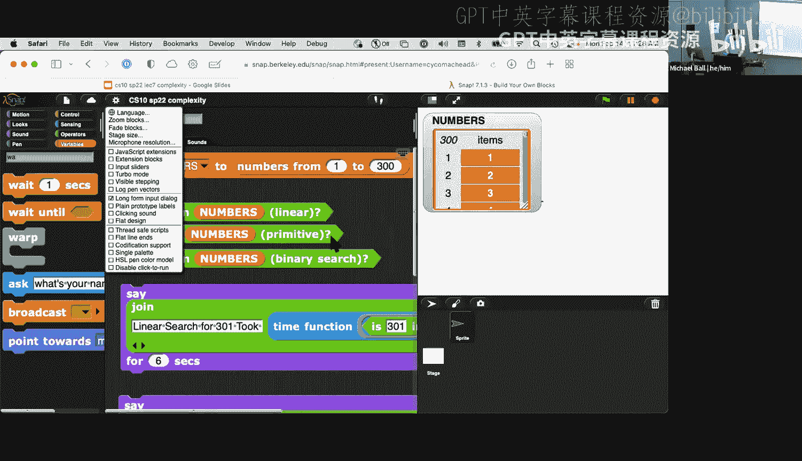
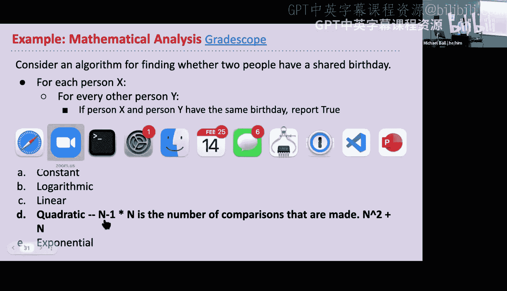
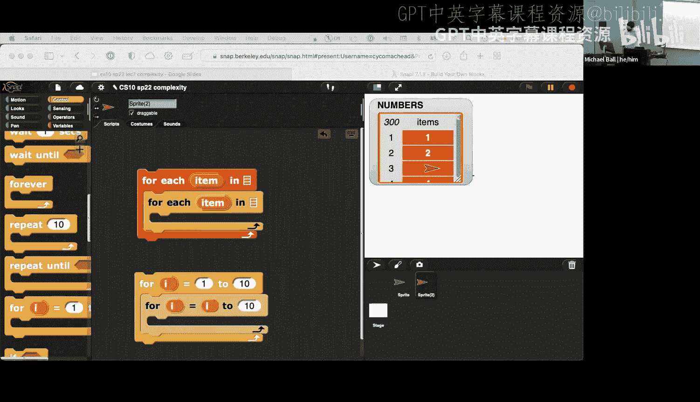

# UCB《计算之美与乐趣｜CS 10. The Beauty and Joy of Computing 2022 spring》中英字幕 p08 CS10 Sp22 Lecture 8 (Feb 14)_ Testing + 2048.zh_en -BV1BokLBmEKE_p8-

啊。Yeah。H道。好。Yeah。Oh。

啊。Yes。All right， so we'll get started in just a second。呃，对。Yeah。

So I'm going to try and do a couple more self check questions today live， we'll see how that goes。

嗯。あ。あ。Thank you。没有。啊。

All right， so I realized that the SAP project link on the slides is breaking。

So I'll edit that really quick。😔，get started。So。嗯 today。

We're going to talk about algorithm complexity。And。是。And how we analyze algorithms。Thank too。嗯。

When we start off last week was。We want to solve we have algorithms which enable us to solve a computational problem and it give us sort of a defined。

Set of steps。For how we do that。And there are many ways that we can solve a particular kind of problems。

 the question then arises。Now which of the algorithms that we have is a。

Is a better option or if we're giving multiple different algorithms to solve the same task。

 how might we decide？😡，Which one should we use？啊所。We're going to take。

Let's say 30 seconds to a minute。And the first question on grade scope。

 there are going to be a lot of these today， so I'm going to go through some them kind of quickly during lecture。

Don't get a chance to answer them， they will of course be available。After the fact。嗯。

But if you could open up gradeco， this will be question number one right now。And popop the results。

Answering。Yeah。So let's see， how many submissions do we have to board？So let's wait。Fs。

chances put up。I return go through most of these during lecture today we might make a all of event。

So。As。As folks are voting。It looks like。Let's see， what does that say？Yeah cool， so far about 80%。

Have the correct answer， which is in your lab。😊，We were given two ways to find a number on a list。啊。

Which algorithm would generally take less time to read the search？Icring out。Of course on screen。嗯看。

There。Oh I not sure up， so in this case， the answer is be， the binarynic search algorithm would take。

Would generally take。Less time to。Search and so。2。How do you figure out that binary search is in fact。

Faster than。This other algorithm that we're just going to typically call linear search so in the set of slides。

😊，We've uploaded the blocks that are linkeding that project slightly differently。

 just so it'll be a little bit more clear。

Let's。

sorry。Yeah。去。对。是。So。We have a。A few0 duck in this case。And this project， I've updated things。😡。

A little bit from the slides to use a higher function too。Timer block instead of reset the timer。

It works the same way， but I think it's a little bit cleanerer。In terms of what will be said so。

How long does it take to find the number one in the list in this case？That's like。Pre。

 zero point zero2 seconds。Howello。哎那就痛苦的时候。How long does it take to find laundry ills on my search this time it's to a little bit longer。

对。啊，是。Each of these blocks so you can see， well， I'm just looking for the number one in this list of 300 numbers。

看。It actually in binary search is taking a little bit longer。Now， what if I ask for something？

Like England number。301 so this is going to say how long does it take to find 301 using linear your search？

And。This is taking a little while， so in this case we have about 4 point that's called it 4。

9 seconds。to five whenever we're doing measurements like this。

 it's probably a good idea to run things multiple times just to get a sense again。4。

98 that's pretty close to five。Now let's run 301 in binary search。啊。Under a second。

I've done us a couple times under second one。So all right。

 each of these algorithms is giving us pretty different results for just doing a simple task like finding a number。

And then the list of numbers。If you wanted to just use the block on its own this block again just reports whether the number is in a list I've actually given three different versions of this block。

 we're not going to look at the one。That says primitive that uses snaps built in find bra。

It illustrate the point that if you want to play this project。

 there are many ways to implement an algorithm。

So。嗯。So what's going on here， right？😊，In our first list， we say is number one。In our list。嗯。

It actually turns out that our linearar search is quite a lot faster。

 and if we think about how we might build that block that we talked about last week in the lab。2。🤢。

It turns out that like searching for one in this set of lists is pretty easy， right。

 because if we go back and actually， let's just go back to staff really quick。

If you look at a list of numbers。You turn the watcher here。

 why is number one so easy to find Well it turns out that number one is the first item of the list So if we say how long does it take to find number one？

Most numbers。And your list is I number where this， you， that's any order starting with one。

 you could say， oh， well one is going to be very easy to find because it's the first item。

Right I list。When we think about analyzing our algorithms， we going talk about what these terms。

 we could say this is the best case， right？😡，Very first thing we do。

Regardless of whatever algorithm might be is one is hitting the nail on the head。

We found the thing we got to answer essentially one step right， is item one equal to one， we're good。

😊，あ。Of course， what it might turn out to be though。That。In the real world。

 we're often not going to be working with this best case。😡，あ？2。When we。When you want to。

 but say finding them on a list， we have to consider the fact that。

You might be searching for a number that's never in the list， so in a list of 300 numbers。

 searching for 301 means we have to check every single item in the list before we find that 301 is not in that list。

This might be any kind of algorithm where we're trying to compute something right if we're looking at even just finding。

 let's say， the median value in the list of numbers。😡，How long will it take to do that？

Our list numbers could be really short， or list numbers could be really long。

 So our goal is to think about。How long will it take to solve？

Question regardless of the particular type of data that we're working with。嗯。The worst case also。

 you know， is one of those things where。System that we're building。

 right we have to protect against that so if。Gmail has a search function。

And it's trying to search through all your thousands of email messages。

Obviously you always want that to be fast right， but what if the worst case to find a particular term ends up being ridiculously slow and it takes you know something like。

Tens of minutes or hundreds of minutes to execute a particular search because the query or the terms that you're trying to search for just happened to be really bad for this algorithm。

That's pretty unacceptingable because you might not be able to find。😡。

You're to find that set of emails。And it turns out for reasons that we're not really to get into。

On average， the worst cases happen quite a bit more often and the average sort of running time of an algorithm tends to look a lot closer to the worst case before and so when we're looking at lists of like 300 numbers。

We can see some interesting differences， but in the real world。

All rightThe average or the worst case tend to look very similar to each other。

 so what we're going to do today is focus on what happens in the worst case of all of these algorithms。

 what is the worst possible outcome that can happen when executing this function。And so。

How do you then formalize with ite in this case？Again。

 this is the block that I renameed linear search。So section for 301， the nice thing about S。

 by the way。いす。I was going to this slide， but would have kind of a lot to get through。

 so these were the results from the last few runs of。😊，Last semester。

The numbers turn out to be pretty consistent on those computers。That are near relatively modern。

 this block will take about。A little under five seconds to find。

One value actually to find 3001 in the list of 300 items and tell you that it's not there。

And this seems pretty slow and this should seem pretty slow to you。So。

Does doesn't really seem reasonable that this is the case。It turns out， no， in general。

 it's not super reasonable， computers are， if nothing else very good at dealing with numbers。😡。

What Snap is actually doing here？Intentionally slowing down。The way that things work。

 such that if you're drawing something like。Of course you allowed on draw scores。

When we draw fractals， snap， there's a whole bunch of things to make that drawing animation a lot more smooth。

There is some slow down to make performance consistent from computer to computer so that if you were to publish a game with thenap cloud。

Anyone can open that game and then。We we expect it to work in some way。嗯。In SNapAP。

 I'm not going to go into all the details， but there are just a couple blocks that are worth knowing that if you want to see how things get sped up。

There's this block called work。And we'll tell snapn， hey， I'm not doing this drawing。

 so we speed this up and make eight pillowsstrs as possible。😡，Don't slow any code down。And then。

There's also。This option。Tow mode， which also changes how Sap is drawing and can speed up computational art so in your own projects。

😊，あ。T mode and working， they're never going to change whether not something is correct or incorrect。

 but they will。Speed up certain types of operations。Especially if you're manipulating。

Numbers and lists and things like that。We're not using them today to sort of illustrate。

B？The full difference in the time that it takes to compute something。这。No。What else might we say？

About this list。If our list was。Even longer， right， something like1 thousand items。

These times might take quite a bit longer。In this case。

 we went from five seconds to some trusting 16， 17 seconds。She needs senseor block， right we said。

Was I going to each item one by one。It's a list of 300 items。

Take a list of  a thousand items and you see the time goes from  five to 17。😊。

It's about three or three times longer to or take some fractions of a second。Long than5 seconds。

The list is3 a third。Times longer than our input to in some sense。

 what this block is doing makes a lot of sense， right？Double the length for our list。

 the time that it takes to run。😡，Doubles as well。And。Intuitively。

 if we think about what this block is doing， it checks every item。

That makes a lot of sense and we'll talk about how to formalize that。这。嗯。

So some of these results are also inconsistent by a little bit right they're not always exactly the same to jump around they within I would say in this case on margin to error。

What can also happen is that our computer isn't just are using Ss， so right now。

If you're on your computer right， it's managing Zoom， probably another tab for GSscapepe。

Maybe you're doing something like。Has a video ring in the background or。

readning a project on the tab， all of these things affect the resources that your computer can use and so。

At any given time， your computer might want to finish your computation。😡。

Before it continues on and says， hey， snap， now's your turn to do some computation。

If we start using a clock timer like we've been doing。

 we'll always see a little bit of inconsistency。And。behind the scenes。

 your computer hardware has also been a lot of work to try and sort of hide some of these limitations such that。

You execute a Sn program， it seems like it's just running right away that we have multiple pieces of applications when you're a computer that they all run seamlessly and we don't really have to think about the fact that what a computer is really doing is。

Millions of times a second switching tasks as rapidly as it can。So for most part， we don't have to。

Have to necessarily。I consider a fact if you take 6 to1 scene。You actually get into the math of how。

Computers store and organize information and the speed at which they can copy information back and forth。

How that affects things。It's。There's a lot more detail that creeped in here。嗯。So in in experiment。

 right， we might want to say。We me shooting things side by side。And then see who's Sa。And of course。

 through this set of input， we'll say whatever is faster。Sa， that algorithm could be the winner。嗯。

And so we can show in this case that a binary search I done because on the case of 201。

s any fraction of a second versus the linear search algorithm completing it or in about five seconds。

Yeah。Binary search is faster and we call this empirical analysis because what we're doing is we are running the code。

We're getting a timer， we're testing it out。And we are。I've been data that way。This is a doed way。

 of course， to analyze algorithms。But it has some downsides。

 so what we're going to do now is look at how we can theoretically analyze an algorithm's performance。

We want to do this for a lot of reasons， so for our binary research algorithm。知。

It's a little bit tricky to implement， but it's not terribly complicated。With。

There some reading and a couple hours of work， I think you all could spend time。Look at how it works。

 figure out the edge cases， go through。Even if we didn't have a lab of， this kind of stuff。

What a place where there's enough effort you could implement binary search。

There are also a lot of algorithms that。We don't necessarily know if they're correct。

 or they might take a long time to implement it and we still want to understand how they could theoretically perform。

次。What we're going to look at is this technique。The growth。Characterize。

Time that it takes for algorithm to execute。Based on。Inputs that we might give that algorithm。啊。

We kind of call this the one true way that computer scientists analyze algorithms。

If you like this stuff， computeruter Science 70 gets into this CS62 B spends a lot of time on this and CS170 if you decide to major in computer science。

😊，Is of course， dedicated to the analysis of algorithms。

And these are pretty important things because they。

The algorithms that get developed get used over the place I search as an algorithm。

Is incredibly useful for being able to do things like find data on your computer or your email inbox efficiently。

😡，It not structured in quite the same way。But those types of algorithms are used in。😡。

In many different places。One thing that we' need to consider， right is。

Testing on just a couple data points， we've been testing in the number one。

And number 3014 our data set， they represent some pretty interesting cases， right。

 they represent the first number in our list， they represent a number that's not in our list。

But what if his a list is much larger likely alluded to it's。400 items， 500 items， 5，000 items。

 how is the performance？Over 111 change if the size of our list changes。ああ。

So what we're going to do is make a plot of our other functions and we've you know sort of picked plots in lab when we。

You knowAsk your question about this on the quest， we' not going to actually or in the midterm。

 we're not going to actually have you draw the plot。We want to think about this。In the sense of plot。

 so given some input in this case。It's specifically considering the input， the number list。

M is the Cy throwist。And I also say we're using function mutation here， so R of n is the one time。

Her function as in。With respect to the size of M and there'll be a little bit of nothing here。

 but this is probably。The most massive。That CS10 will get。 so if math isn't your thing。Yeah， that's。

 that's really cool。 And this case。😊，For this version of function， we can run a test。😊，Actually。

 the way that this is written， as long as your list never has an empty item。

 this will always run via every item my list to say that there's no empty item in there。

So for 250 items in one test， this took 1。4 seconds。For 500 items， 2。8 seconds for 1000 items， 5。

7 seconds and so on。What we can see is if we graph this list。

Where we have I the number of items in our list in the bottom。The time for it took。On our wall axis。

 we get this line that sort of describes the performance。Of our list。And。And we might notice。

Is that if we were to double to 2，000 items。4000 right， we have enough of a trend here。

We can expect to understand what's going to happen。algorithm so here this is done again。

 these your time results using empirical analysis。We were able to actually look at the code。

We come up with the same graph without necessarily timing our code。So if we just say。

 so this is the next question on grade Sc。So。If we were to say as a function of n。

What kind of function most query in models？OfThis graph。

Think about what the graphs of these functions might look like。Which one of them is closest？

to this function。Through the next few days relatively。Retically quickly。啊。All right。

 let's take a look at this we'll give。A few seconds。So as in explain list。

 the number of correct responses is jumping up by quite a bit。

I can't tell exactly how many people haven't responded to just this question yet。あ。Awesome。

 the number of correct responses is trending in the right direction。So all right。

 if you look on greatscope actually， the block name kind of gives a hint。To the correct answer。あ。看。

Certain okay， so this is a linear function。That means that C is the correct answer if we say all of n is equal to n。

But is essentially the line y equals x。😡，That is just a straight upload bag in a line where for every step x increases by one。

 y would also increase by one and what this basically suggests is that for every single item in our list。

You take one additional step of time。To be able to compute this function。This is a。

Bf function that we don't necessarily know anything about right now。嗯。Looking at this function。

 this is question three on gradescape how much。What would we say is the closest function to this graph？

So you get into squaregram， leg in。N and squared or2 to the N。啊。嗯。嗯嗯。Looks like people are answer。

As people are answering， the correct answers are coming in， which is good。It's great。爱酷瘦。看。Again。

 we're going into this pretty quickly， so it's okay if there are questions below so the correct answers are coming and this one is n squared so what's essentially saying is。

For if I go from one step。In my function right， let's say we stood a one item and that takes one amount of time。

 one squared whos room。And now we double that list to two items。

Now it's going to take two squared amount of time so going from one to two is actually four times lumber in our list and looking at these times we're not perfectly。

啊。You， squared multiples， but theyre roughly that， right，100 items is one second。

Going from 100 to 200 is four seconds。Doubling our list is。F times longer now。

The equivalent of two squared。Going from 100 to 300 is  three times longer， but our output time。

 if we look at this。Yes。Again， about nine times longer。On average。

 we consider say this function looks like n squared。So。What we can say then is that。

We can characterize the order growth of our function。As one of a few different kinds of categories。

 so at the very bottom， we haven't seen any algorithms。

I could classify algorithms yet that necessarily are constant。Often time is。

know we could think of it as like the holy Spirit of one operation right。

 no matter how big my input gets， this thing always takes the same amount of time。

One I wouldn't necessarily call this an algorithm， although the block is a little bit more complicated than you might expect。

Item one of list， right， getting the first out of a list。

I is always going to take constant time whether list is's one item or many items。

I we first to add in our list。It is always going to be a really easy task。So there are things。

 there are many things in fact， that do take constant time， but they're usually single operations。

And we have algorithms that are logarithmic。😡，So。We'll talk about some of those in a second。

 I don't want to spoil。Question about what some of the awesome log algorithms are we have linear time algorithms and that's what we'll spend a lot of our time writing and working with essential things that go through。

Every adding the list。There's a whole class of algorithms called meiththic。

There are many are large algorithms。We're not going to talk about any&M in CS 10。

 but if you take CS62 and B。There are so many linear logarithmic algorithms。

 and you can consider like on this graph， they're not quite as good as the entire time algorithms。😊。

But they're pretty darn good and there's a whole class of algorithms that really we can in some way say make the world work because of。

ItsRe。嗯。The quadratic algorithms， we can roughly think of these things as。We flew the same list。

N times n times， we'll look at another example。Some algorithms have exponential growth where adding just one item to our list that is the amount of time that it takes for a。

On operation to。To be computed and then any mathematical function is technically valid runtime。

 so the factorial function could be a valid runtime that grow incredibly quickly。

 so we're not going with any of those。😊，Here's a good question。

Ilying just any two algorithms in the abstract。啊。This is this should be now question four on grade scope。

嗯。🤢，是。Comparing any two questions in the abstract， which is faster？

Is a me algorithm faster one that's shaped like a line or is a quadratic algorithm faster。

That shaped like a parabola。嗯。啊。是嗯。I will give。嗯。嗯。a few more seconds。To answer this question。嗯。过受嗯。

C number of responses is actually taking up more quickly than I would have expected because this question is definitely kind of a trick question。

O shop。If I say which algorithm is faster between a linear time algorithm？And。A quadra algorithm。

It actually really depends on what we're talking about， if I just say looks is faster。

We don't necessarily know what because if we were to graph these two functions。

R of n equals n and r of n equals n squared。😡，There's a plain time where， for let's say。

 particularly small。Of n where n times n could be faster than some additional factor。

 What's also complicating this graph is something that we hadn't really talked about yet。

But wheres referenced on a previous slide was that？Looking at orders of growth。Be interested。

And what is this main factor is it one times that？Is it n squared。

 is it near or not talk about n cubed？😡，But。If there's a multipling front。

 we're not really going to consider that because as the data set grows large。😡。

That multiply a factor。Does't really change very much。The vision of this question is。

Which of these is faster for than an extremely large end。Go for this one。可。Cool。

 so not too many people think in。そう。All right， let's see what we're looking at。Awesome， okay。

 so the church responses are indeed commune。In this case。🎼H。Mo。ていう。Yeah， so in this case。

 the linear algorithm。Is definitely going to be fasterster。As。As N gets very large。

And this is why typically when you talk about orders of growth。

 what we're thinking about is that that worst case performance as end gets's really big and it doesn't take much to see that this green line。

 which was the，はい。不可能。After this point right here， Ray， it's just always going to be。

Lower than that blue line。It's growing like you know， if we maker n many times larger。

 the function is going to take longer to compute， but at some point n times n。

Is just going to be so much larger than what this happens to suggest is this function shouldn be 30 times n。

When we analyze our algorithms， we actually don't care about this first term。

 whatever constant factors we have。We we just drop those when we consider something if it's 30 times n。

 if it's 100 times n。Even if it's like a thousand times n。

 that's still a linear time algorithm because as that number gets bigger。

And that constant factor just really doesn't matter。2。🤢，Generally。

 when we're talking about orders of growth， we even really care about that that worst case performance of really large。

Pide numbers of the N。And what？W this matters is if you're running a website right as your site grows。

😡，You need to know where your operations with the processes that you have。Will they handle？

Those types of inputs， you might have an algorithm that analyzes a photo to try and see you know。

 is there a dog or cat or class in some way。That。I've going to my work on really small photos that are like one or two megapixs。

And then as smartphones get better and you're like not 12 megapixels or 24 or 50。

 there's like phones that have 100 megapixel cameras， right。

 does that analysis still work on an image？That is that large or might your flagship feature of you know to6 or photos intelligent and a phone just start breaking because the images are two large so how an algorithm performs on large and larger inputs with the。

It really does matter。There are a limited number of cases where。Some algorithms perform better。

And get larger， but we're not really consider those， they come up a little bit in CSX2 rule。

But in general， are always of growth。As an approach works really， really well。

I'm not going to go into this table because。It's just sort of a lot of examples。

But on a typical computer for something like searching for a list of numbers。

Even with small amounts of data， the orders of growth doesn't matter too much until you get two things like。

Fs where。If we talk about。The amount of time that it takes when someone goes exponentially。

when something says like that's exponential growth， what we're living in is it is explosive。

 it goes incredibly quickly， we could even see that if you look at these last three columns，😊，嗯。

That things take a very long time at some point discharge says very long。

Because if you get past like 12，000 years， you can assume your algorithm。

Even if it will eventually complete， it's just too slow。

To be useful so we're going to generally avoid exponential functions but are we will actually come back to a few of them。

A little bit。We going can do this on Wednesday。Since there are a lot of questions in today's lecture。

But the main point here that we're going to look at is how do you determine without just running feeding your tongue？

How long things take so。What we' really trying to do is build an intuition。For analyzing code。

 and the first thing to think about is a number in a list。

How do we approach this without running a stopbox without using the snap timer that this is a a function which runs in。

In your time。And then we're doing this we about all the things that are a function of the length of the list。

 right， We've been saying， as this list gets bigger and bigger and bigger。Which of these blocks？

Is really affected by that Well we have a4 each troop for each item on the list。嗯。不。

This back is clearly affected by the length of our list。Because if our list is 10 items。

We have to do 10 iterations of our forage loop if our list is 100 items。

 we have to do 100 iterations of our forage loop。Inside here， we have if。啊。

Number is equal to item report true。That's one check for every single item of our list。At the end。

 we have a report that may happen if we get to the end。In this function。

 we only have the one thing to consider， which is pretty nice is for each loop。哎。

Is doing one action for each item of our list and so。That suggests that。As our list grows larger。

 this function grows in a linear sense because what we have is every time we add 10 items。

 we do 10 more iterations to our forward loop and that's the kind of relationship that we're looking for if our list grows from 100。

To 200。We have to do twice as many iterations。Of our for loop。啊。However。

 there are a lot of different algorithms， so we're going to do this question。有了。

Mo it here after this， so this should be questioning。

Let's see which one is this and it's good there should be seven。爸爸。This is， this is 6 on grade Sc。

 So our question，6 is asking us。ToConsider an algorithm we're a funny of two people。

 let's say in some list of people in the room of people have a shared birthday。

For each person in room。We're going to then go over for each other person in the room and say。

 if person X and person Y have the same birthday， we'll report true。If we get to the very end。

 we haven't reported true。We can then report false。是。Take a moment and think about。

As the new people in the room grows from let's say， five people to 10 people to 100 people。

What does the order of growth of dysfunction look like？This is question 6。啊。Oh。Oh。Oh。啊。あ。Yeah。はい。

F seconds。30 seconds or so。I see。All right， so。This one is definitely tricky and after this we'll just take some additional questions。

But this one is。A。A quadratic operation。And。If we were to write this out in S， what we'd see is。

He mentioned about。HowHow we could implement this， so if we say for each item。

 for each person in list。X for each other person in the list in that same list Y how many comparisons do we have to do Well。

 we have to compare x to everyone but X so that's essentially。in- one comparisons。

 right because you probably can skip yourself as a comparison for the second person。

You have to compare them to everyone else in the list。

That's maybe perhaps n minus two comparisons because they've already been compared to the first person。

The third person might have to do n comparisons， but n minus three now。

And so this is one of those cases where。The mathematical intuition will take some time to build。

But we can formalize this to say this is n minus1 times n。😡。

Conditions that we'd have to build。And。If we were to think about this in the case of a full loop。

We might do something like for each item in our list。And then say for each item again。

 or we might actually say。ButNo， we're not going to。 I don't want a forever loop。

We might do something like for each item by to N。呃。

And we might start an in four loop at our second item， so we' keep we'll revisit this on Wednesday。😡。

If you haven't had a chance to do the algorithmic complexityplex La， I'd make sure to do that。

What we're looking for here is。That operation ramp for every single item。😡。

You actually have to repeat that process all over again and so things that start to look like nested for loops in your mind you should start to think。

That becomes quadratic because we have to do something a number of times。

And do end number of times again for perance necessarily。

 so we'll do a couple more examples on Wednesday if you want to get ahead and continue looking at the slides。

 you can do that。And yeah， this is a pretty packed lecture。

 So Ill take questions for a couple minutes before I have to head to the next meeting。

 and I'll definitely have a lot more time for questions on。Wednes。Nture one。Thank you。

Sllides should be on the website already。Right at the top and then there'll be linked on the calendar or later。

我什人。