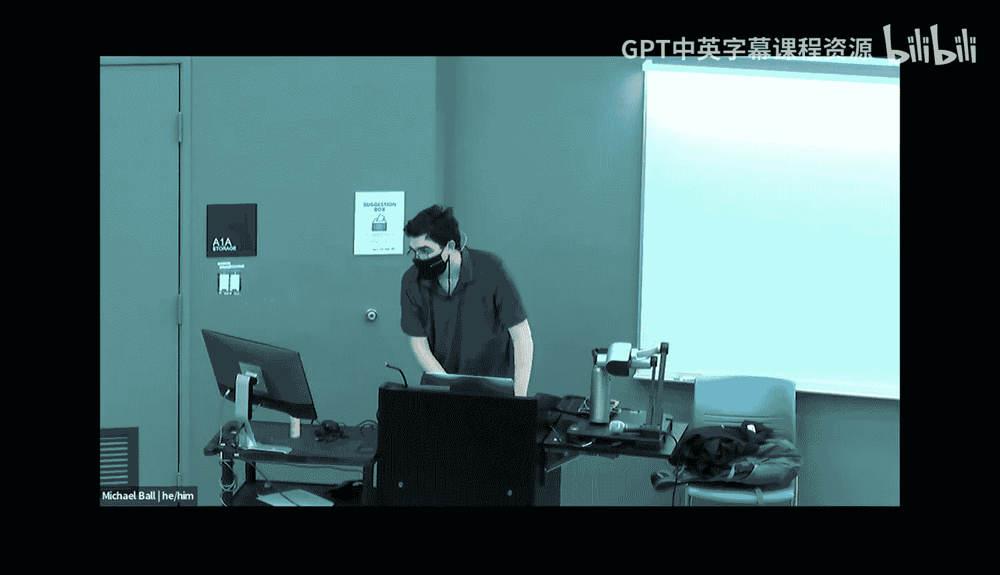
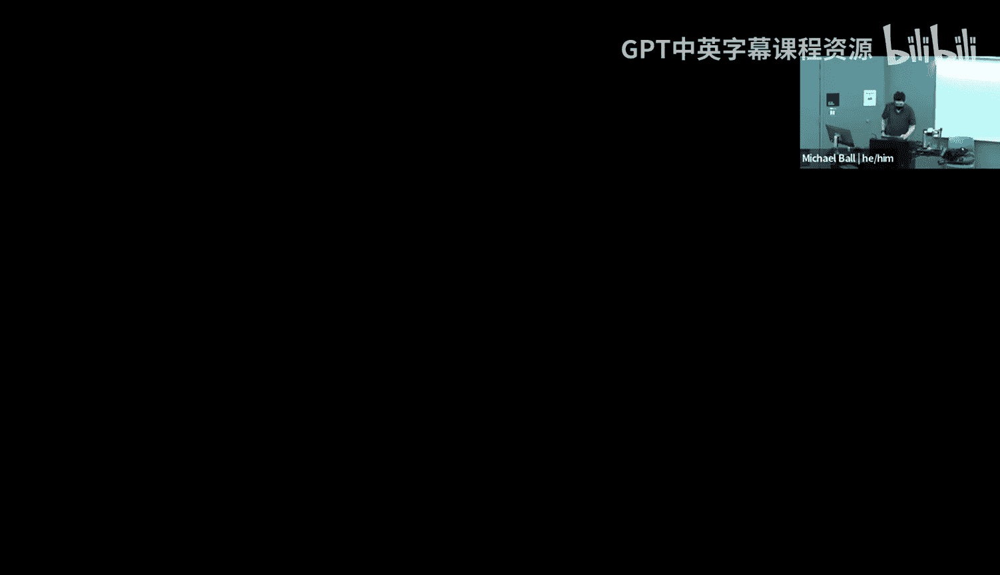
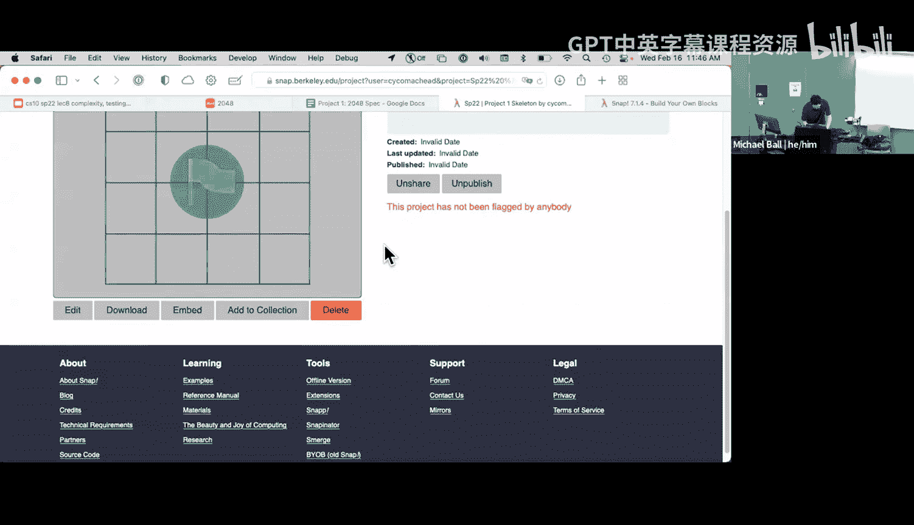
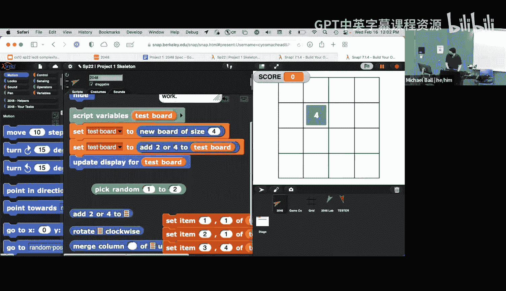

# 计算之美与乐趣：第9讲：计算的社会影响 I






在本节课中，我们将完成对算法复杂度的讨论，并介绍课程的第一个项目——构建经典游戏《2048》。我们将学习如何分析算法的运行时间，并实践将复杂问题分解为更小、更易管理的部分。

## 算法复杂度回顾

上一节我们介绍了算法复杂度分析的基本概念，本节中我们来看看如何具体分析一些常见算法的运行时间。

### 对数级复杂度：二分查找

二分查找是一种高效的搜索算法，其核心思想是每次都将有序数据集一分为二。其运行时间呈对数级增长，记作 **O(log n)**。

**公式**：`T(n) = O(log n)`

这意味着，当数据规模（n）翻倍时，算法所需的额外步骤仅增加一个。例如，从100个元素到200个元素，再到400个元素，所需的步骤数增长非常缓慢。

### 二次方复杂度：选择排序

选择排序是一种简单的排序算法。其过程是：首先找到列表中最小的元素，将其移到最前面，然后对剩余元素重复此过程。

分析其运行时间：
1.  找到最小元素需要线性扫描，时间复杂度为 **O(n)**。
2.  将元素移到前面是常数时间操作，记作 **O(1)**。
3.  我们需要对 n 个元素重复此过程。

因此，总的时间复杂度是 **O(n) * O(n) = O(n²)**，即二次方复杂度。

**公式**：`T(n) = O(n²)`

### 组合算法的复杂度分析

考虑一个算法：先对一个未排序的列表进行排序（假设使用选择排序，O(n²)），然后使用二分查找（O(log n)）来查找元素。

在这种情况下，决定整体运行时间的是最慢的步骤。由于 **O(n²)** 远慢于 **O(log n)**，因此整个算法的复杂度由排序步骤主导，仍然是 **O(n²)**。

### 大O符号总结

大O符号用于描述算法在最坏情况下的运行时间增长趋势。以下是一些常见的复杂度类别：

*   **O(1)**：常数时间。运行时间不随输入规模变化。
*   **O(log n)**：对数时间。运行时间随输入规模对数增长。
*   **O(n)**：线性时间。运行时间与输入规模成正比。
*   **O(n²)**：二次方时间。运行时间与输入规模的平方成正比。
*   **O(2^n)**：指数时间。运行时间随输入规模指数增长。

分析算法时，我们关注的是主导项，即增长最快的部分。

## 项目介绍：构建《2048》游戏

现在，让我们转向本节课的实践部分：第一个课程项目《2048》。这是一个将复杂问题分解（Decomposition）的绝佳练习。

### 游戏规则简介

《2048》是一个滑块拼图游戏。玩家通过向上、下、左、右四个方向滑动棋盘上的数字方块。每次滑动后，所有方块会沿该方向移动到底部，相邻且数字相同的方块会合并为它们的和，同时会在随机空位生成一个新的方块（2或4）。游戏目标是合并出“2048”这个方块。

### 项目分解



为了构建这个游戏，我们将其分解为五个核心功能块。这种分解方法体现了软件工程中“分而治之”的核心思想。

以下是需要完成的五个主要模块：

1.  **`add-two-or-four`**：以75%的概率在棋盘随机空位添加一个“2”，以25%的概率添加一个“4”。
2.  **`rotate-board-clockwise`**：将棋盘顺时针旋转90度。这是一个巧妙的设计，可以简化后续滑动合并的逻辑。
3.  **`merge-column-up`**：处理单列方块的向上合并与移动。这是项目中最具挑战性的部分之一。
4.  **`merge-up`**：利用 `merge-column-up` 函数，合并整个棋盘的所有列。
5.  **`no-moves-left?`**：判断游戏是否结束（即棋盘已满且无法进行任何合并）。

通过先解决 `merge-column-up` 这样的小问题，再构建 `merge-up` 这样的大功能，分解使得复杂任务变得易于管理和实现。

### 开始实践：实现 `add-two-or-four`

让我们通过实现第一个模块来感受一下项目的开发过程。我们将创建一个辅助函数来随机选择数字2或4。

**代码示例**：创建 `two-or-four` 辅助函数
```
定义 two-or-four
  如果 (在 (1) 到 (2) 间随机选一个数) = 1
    那么
      报告 (2)
    否则
      报告 (4)
```
这个函数模拟了75%概率出2，25%概率出4的随机行为（通过后续逻辑实现）。我们可以通过多次点击该函数块来测试它是否随机返回2或4。

### 测试的重要性

在项目中，我们将鼓励大家为每个功能块编写测试。与其等待提交后由评分系统反馈错误，不如主动验证代码的正确性。这就像开发手机应用时，不能等到用户给出差评才发现问题。

项目资料中会提供用于测试的辅助函数和示例棋盘，帮助你逐步验证每个模块的功能，最终确保整个游戏运行无误。

## 总结



本节课中我们一起学习了算法复杂度分析的收尾，重点理解了对数级和二次方复杂度的含义及其在算法选择中的重要性。随后，我们介绍了课程项目《2048》，这是一个实践问题分解和函数构建的绝佳机会。通过将游戏拆解为五个核心功能模块，我们将学习如何管理复杂性，并开始培养编写可测试代码的良好习惯。请关注课程页面，项目详细说明即将发布。