# UCB《计算之美与乐趣｜CS 10. The Beauty and Joy of Computing 2022 spring》中英字幕 p10 CS10 Sp22 Lecture 10 (Feb 23)_ Recursion I.zh_en -BV1BokLBmEKE_p10-

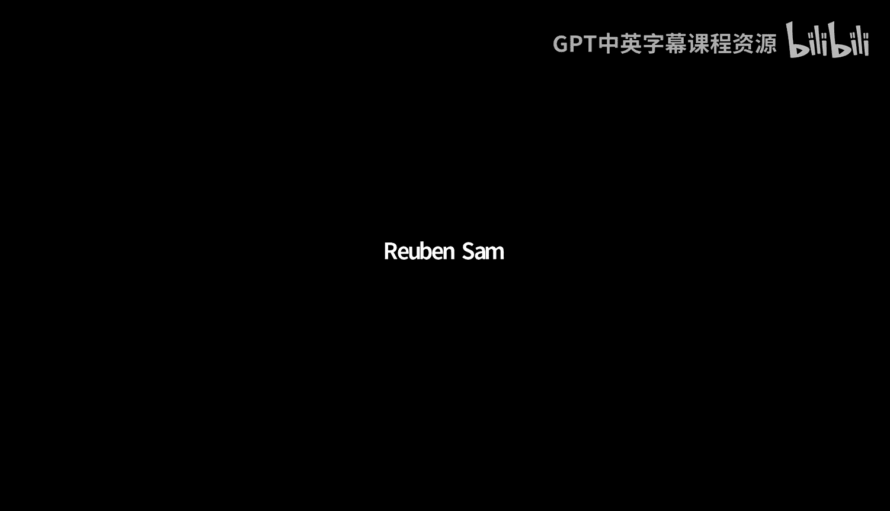

Zoom， I think everyone in Zoom can hear me now， so that sounds good。我还在。I I'll make this full screen。

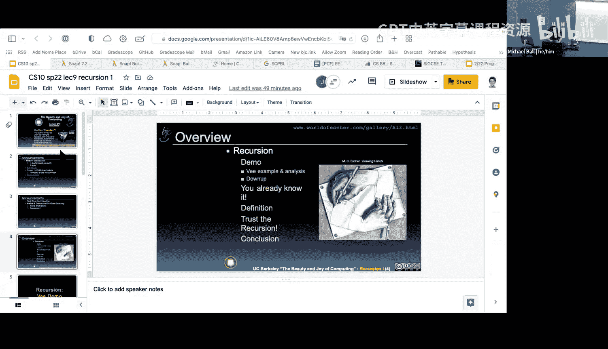

And。Right， soup。Today's lecture topic is going to be recursion。😊，I don't know， actually。

 I just be curious， show handss， how people have seen the movie inception because it's now like a decade old。

Cool， so good number of people if you haven't seen it inception。

In a very interesting kind of way captures this idea of recursion and of worlds and levels that are similar to each other。

 but have a slightly different take。And it's。Once you knew how recursion works。

 you can kind of see some of the sort of slightly mathematical concepts behind it also this should be lecture9。

 not 10。😡，We move things around a bit but。That shouldn't affect things too much and。嗯。One second。

 let me see if I can。啊。Make this screen appear a little cool， probably better for folks in the room。

Also， one thing that we're going to recommend， ideally if you've been doing this for a while。

 but in lab， it's really helpful， especially when we start working on things like recursion to grab scratch paper and start drawing out。

Not as you drawing， but sort of writing out。the steps and processes that you're following to solve a particular problem to say what are the inputs where are the outputs。

 what happens each time this function is called this is always a useful technique。

 but with yourcursion in particular， you'll start to see why and how it can be。Useful， so。嗯。2。

Other general announcements that are just a few weeks away so we don't need to worry about them too much the mid term is Monday three 147 to 9 pm。

啊。It is pie Day， which is the unofficial nerd holiday。

 so take your mid term then go have a slice of pie。Unfortunately， we can't provide P for other one。

 or that would be fun。Self checks are there for this lecture。And for Project 1， 2048。嗯。

There's going to be quite a few homework parties and office hours help and things like that。

 so please you know keep an eye on piazza and on that calendar for that if you have already started。

 you may want to open the spec and look for a note about the copy block。When I made updates。

This semester， I accidentally messed up the copy block。

 so it always returns a copy of the global variableable game board。

that of whatever block or whatever board you drop into it。

 so there's a note in the spec to just really import the copy block。

 but that only affects your project in very minimal ways and if you've already started so there's some instructions there but it only should take like 10 or 15 seconds to make the fix。

And then with that， there's links to Sap demos for today， which I will highly encourage you。

To permit。So next week I'll be at a conference for computer sification。

 actually presenting some stuff。😊，On SnAP and some things that we've been doing recently。

So Maddie and Becha and Ben was just here will be helping out during lectures。

 they're going to cover the same topics， so a lecture in Macursion and our first lecture on social implications。

Both of which are a fun topics。with that。What we're going to do today。Is spend some time。

Working with recursion and before we get into this。It is worth mentioning that。

Iending what you've heard about computer science， you may have heard。IThis term arosion before。

And you may or may not have a notion about how scary or difficult it is。

 and I really say that recursion on its face。The problems that we write will not be。

For the most part， terribly complex and not going to be a ton of code。

 but it can be a really mind debetting concept so today。And for this lecture。

 what I want you to focus on is sort of just the big picture， what are the things that are happening？

😡，How are we breaking problems down into smaller parts？What about this code？Is so different。

And when you read through the code sort of just letting yourself kind of understand the code without。

 really try hard to not overthink what's happening because with recursion， overthinking things is。

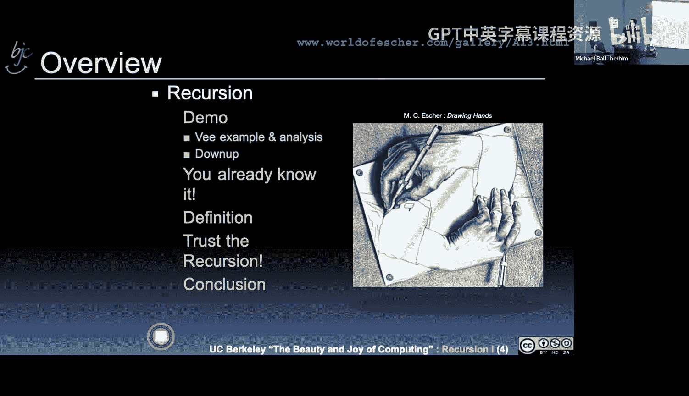

Definitely possible。With that， what we're going to start out is with this really awesome program。

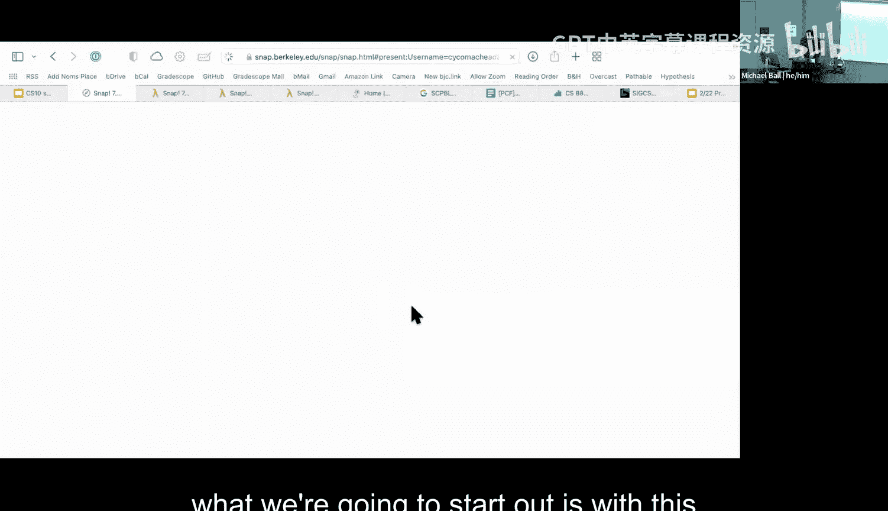

Called a V。And。Let me my bookmarks make this a little bigger soon。

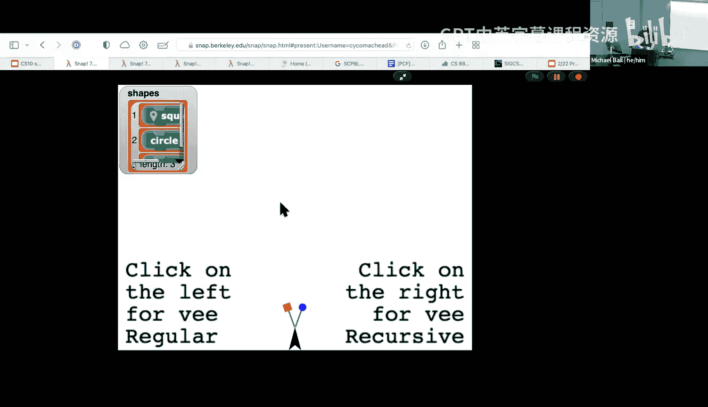

，Is oh shootot。Yes， snap， so this version that's linked in lecture， you have to click this block。

To turn JavaScript extensions first。

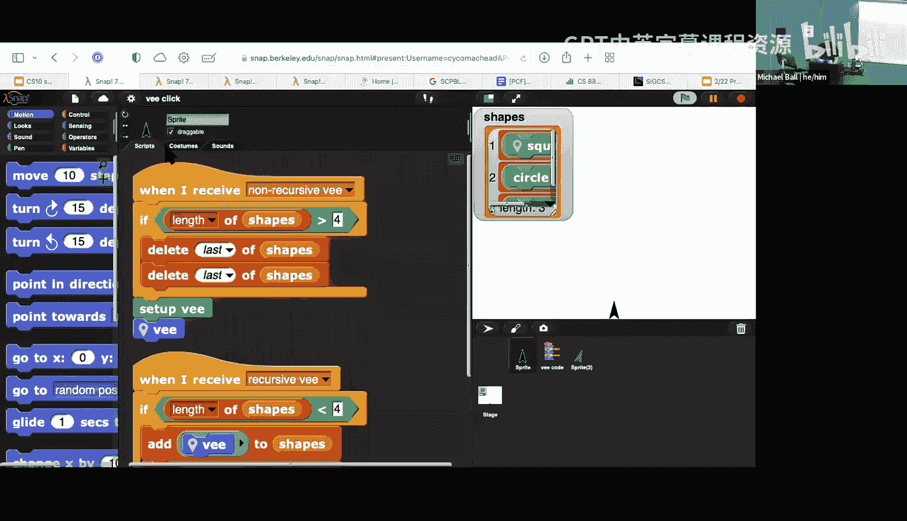

Which will fix at some point。嗯。Alright。Stop that green flag， all right。

So whenever I click on the left hand side。This sprite。

Draws a really simple fe so it goes to the left。And what it's doing actually is it's picking a shape from this list of shapes so we can draw a square。

 we can draw a circle。😊，Or we can draw a triangle， it picks the shape randomly from the list。

And it draws one of those， then it goes back down to little。To the right。Picks another shape。

Andra one of those so。If you're actually curious， we can hit the spaceboard this program and see the code that's drum as V it's。

And you not pretty simple， it's just a few set of steps。That says。Mo to this place。

 pick a shape to draw and each of these blocks draws that shape， and it continues on， turns。

 moves back。😡，And draws。Ts a V， so。But does anyone have。A question so far。

 anything that this fairly simple program has done。So now what we're going to do。嗯。Where is my okay。

 we're just going to hit this。So now what I'm going to do is my click on the right hand side。

Instead of drawing。A。呃。A single shape two the shape that that can draw are itself going to be V。😡。

And so what we're going to do is just。Run this program a few different times。And see what happens。

 So remember that it's picking randomly from a list Now this list has five different shapes so we can still draw a square。

 a circle， a triangle， but we can also draw a V or we could draw V again。

So we can just run this a few different times。是。That was this this one so when。

When we go off to the right side over here。What kind of a shape does it seem like we're drawing。

 so we went to the left。😡，We drew a square， we turned to the right。

 now what kind of a shape does this seem like we've drawn here？

Someone can shut it out or on Zoom chat。Have a sense of。

If I get to the right hand side and I get to hear and I say， draw shape from this list。

 what kind of a shape does it seem like？We might be drawing in this program。A treat yeah。

 and and in particular we have one of these theses that that we've been drawing and so this program is。

啊。It's a really different take on how。How recosion works， but what I think is fun about this is。

It is a randomly generated art。Some of these look。More interesting you know。

 what's randomly generated art， but not so interesting， it's a little more interesting。

Bring boring double looks pretty good， it actually kind of has some balance to it。😊。

But in each of these cases， what we have is a program which is very simple。

 right if we reveal the code again。Would you have one，2，3， four， five， six， seven， eight。

 nine blocks of code？And the list that allow us to generate all these different kinds of different images and each of these images。

 of course。😊，Or there's random since we're picking a random item from a list。

But we can see that when we go to left here， this V is similar。

In style to maybe the small V on the right hand side and this is because this program is。WellA。

 when we talk about recosion， we'll talk about why specifically this is recursive。

 but it's because the problems that we're working on inherently lend to breaking themselves down into smaller and more similar pieces。

V itself is a tree that just looks like this。If we say that a tree is two， go left， go back。

 go right， come back。Those three steps are a tree， then each tree can be made up of many。

 many smaller trees。V is a program。

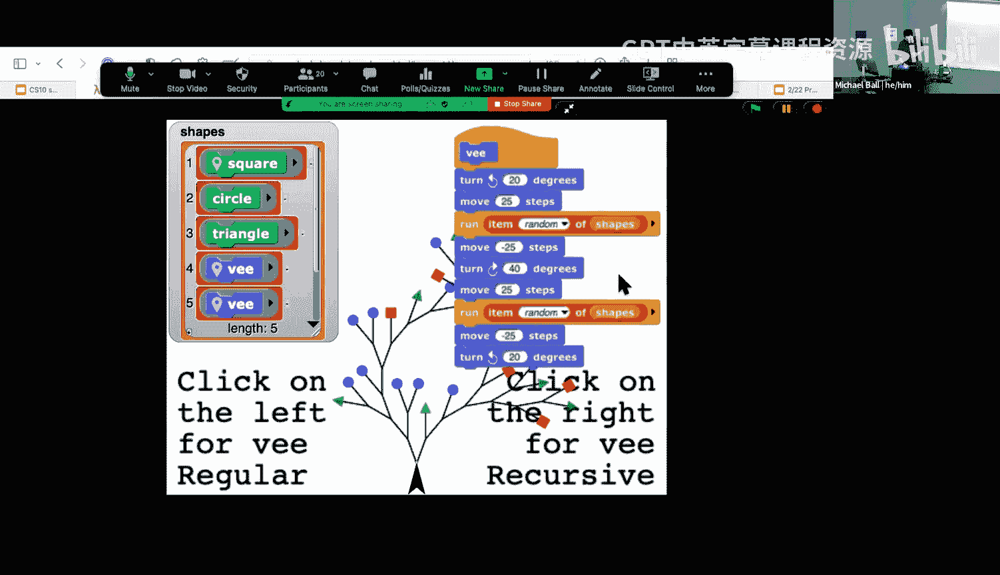

This one is fun， because it。呃。呃 do be。嗯。WhatWe call it。The SnAP project is set up， which is linked。

 you can go with it。Only only lets your add V to the list two times。But what's actually kind of fun。

And now I'm going to turn off。Is you can drag a blockout， add to the list。Like four or five times。嗯。

那么呢。AndH that again。And now。Now what I one this。We get some even more interesting I make that full screen。

诶。Hey， Z， there you go。哎。What is going right hold on？I the meeting controls。Oh， you know what。

 it's probably still drawing off the。Way up to the side。 Yes， it is。So。

By adding these to list a whole bunch of times， you can basically make this program randomly pick to keep drawing a tree for a long long time so。

Send it this way and now it's going off the side。That's not very interesting。

But this is one of those things where。like this， when and how it stops is not we're not going to get into that because we're really just picking item from this。

But the aspect of taking an image， even something really simple like this and trying to see what parts of the problem are the same。

is a nice sort of fun way of exploring something like that。So before I continue on。

 does anyone have a question on how？呃。How big V program works and on Zoom if anyone don't see anything on chat yet。

 yeah question yeah question them back。打开一工作账。Oh， yeah， the JavaScript thing is。Mostly because。

These blocks down here。Are that to actually draw a square and a circle on a triangle？

They're implemented in a way that required some special JavaScript。

And it's kind of a security protection we're going to rewrite this project such that there's like a native extensions mechanism for staff。

So if it tells you that you need to enable them， it's there。

 we don't do anything with JavaScript in this course。

 but if anyone actually really wants to get into different，嗯。Let's see， it's a square block。Not？

I have to look at this because I might be able to fix this tonight to not new JavaScript now。

But anyway。So I forget where the JavaScript blocks are actually being used in here or which functions are but and snap there's basically a way to write JavaScript to extend it with your own plugins and semi custom like built in blocks。

 which we want to talk about in CS10， but if you like programming snap or you want to you know just sort of。

Run away with some fun hacking， there are things that you could do there， yeah。

Other questions about how V works。Cool， so。嗯。I will leave that for。

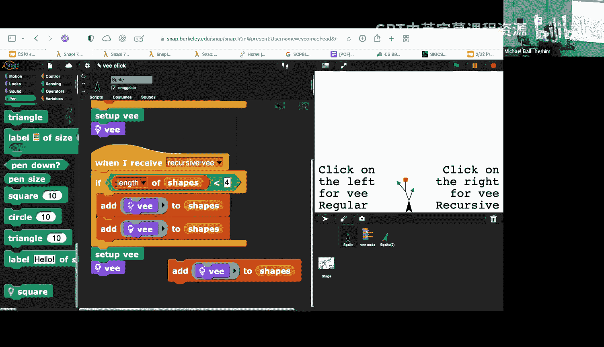

For everyone to play with， well I do want to highlight before continuing on and these are linked。

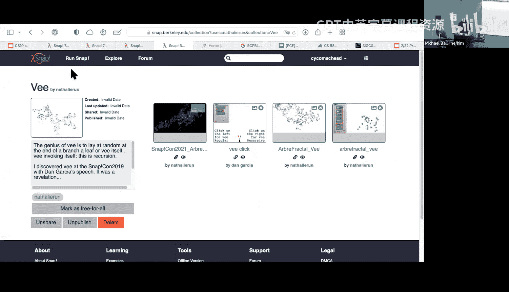

呃，嗯。In the slides over here。

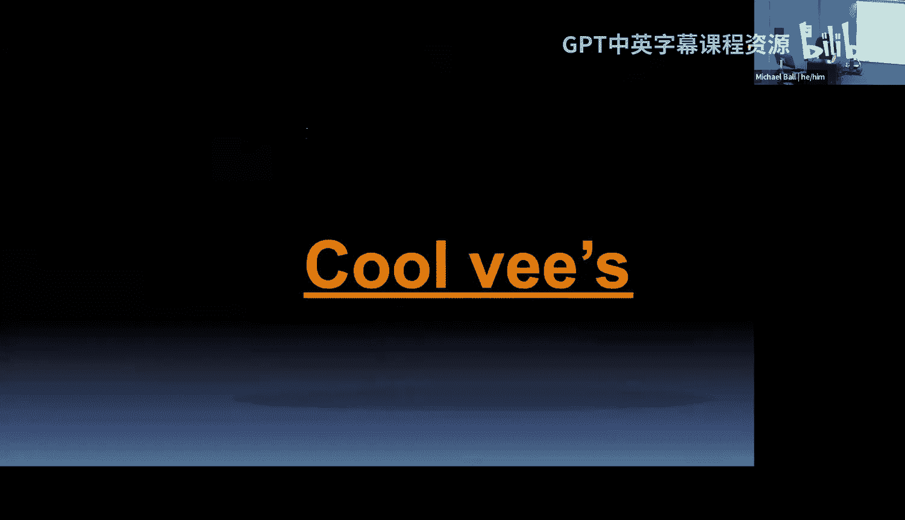

Is。Is a collection on the Sclo of there's only a few of them right now。

 one of them is our demoV project。嗯。So really fun and different visualizations。

 this one also requires JavaScript extensions。

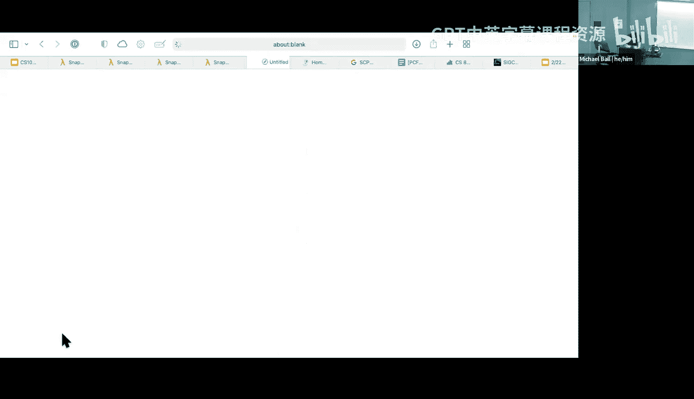

嗯。So I shall enable that。And I don't remember exactly how animating。This project。Works。嗯。What。

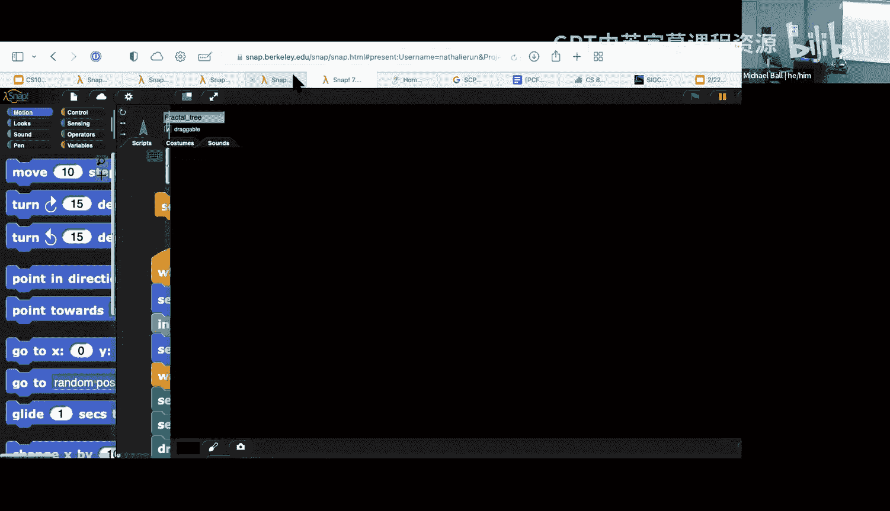

Well。Rebuilding the demo of this project。

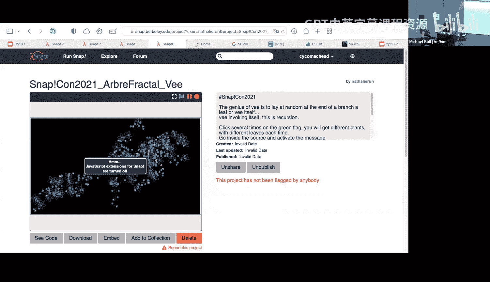

It may be difficult to actually get it to do something randomly without looking at the code。

But one of the things that I think is really fun to just show is when we talk about things like recursion。

 one of the reasons that these are powerful ideas is that we can take the same basic idea of movement drawing art。

I've taken a really simple problem。I mean changing just a few parameters。And getting images。

That look incredibly cool。So this project is actually built by Lady Natalie she is a。

High school mathematics teacher on Reunian Island way off the coast of Africa and just doing some really awesome and interesting projects with her course where she teaches some programming。

 let's see if this one runs doing it are all。

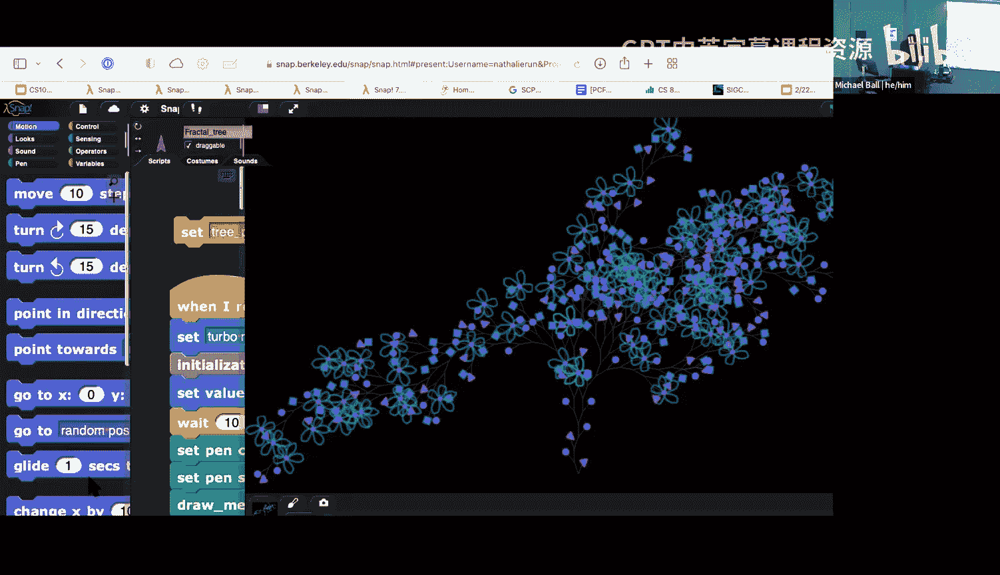

嗯。Ling to it need to。嗯。Smite， okay。This one at least gives us something random with changing the parameters。

So。😊，Yeah， I think this is just a way of exploring some art。

Of thinking about programs and how when we look at the result of something really complicated。呃。You。

 can we can we take something like this and sort of think about how？

Even though generating this image。If we knew that this was the image that we wanted to generate could be quite difficult。

 we could write a program that's really no more than 10 or 15 blocks of code to to generate some some of really images so if you're bored or if you want to explore some more I would highly encourage you to。

O a couple of these projects and just try and run them a few times because they are sort of endlessly fascinating ways that we can generate images。

From just a few lines of code。But yeah， any other questions so far on any of these demos？

Questions on Zoom， soon has been quiet today。

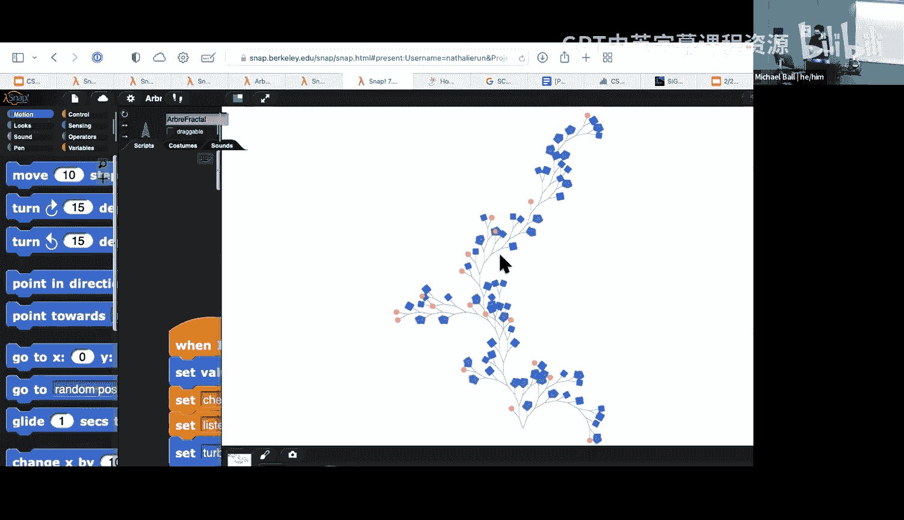

All right。So let me hop back over to。嗯。U。The slides real quick and we'll do this。

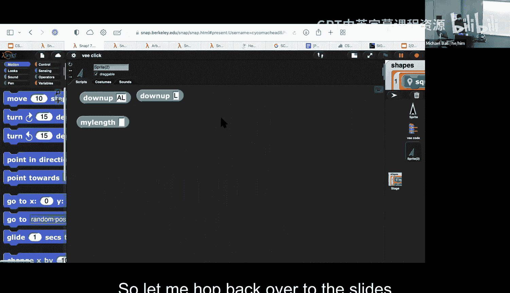

Now what we're going to do is。We're going to write a。

A simple program or a simple block called down up and'm going to describe this to you。

 then we'll run it and then we'll talk about how。How we write this from scratch and some of the tools that we have。

With fractal geometry， a lab this week will be implementing some similar factorsals。

 but a little bit some sort of more traditional ones。

But what we also want to practice is thing about how do we write functions that are recursive that really instead of just drawing something on the stage they report a result back to us so down up is going to take。

The letters of the word。Chop off some letters， say the word and then。Extend it。

 so perhaps the best way to do this is to run it， so if I say。

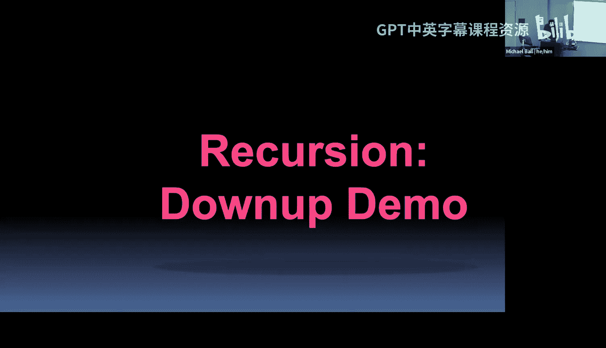

呃。If I say down up of cow， what's going to give me is。It's going to give me down up， so Cal。

 call with the C， callth the A。And then L and then without the C， or then without the A again。

 and that so it's going to sort of chop off the first letter， stick that and keep。😡，哎。

Keep sort of grouping a word together and another， no， we're not going to edit that。

If I say just A will be A， the letter L。And then AL yeah。

 so essentially what we're doing is we're taking the word。

 we're chopping off a letter at a time and we're going to build this sort of chart of saying the word but in an increasingly fewer letters。

We can try this with just about。呃， any mean。Any word that we can imagine， right， hello。I hello。

 Lello LLO and so on all back up building back up to hello and so a question or a problem like this。

Is。呃。It's one of the things where。This particular one is a little bit contrived。

 but I think it's a nice example in。Looking at this and saying and asking yourself can you see a pattern of something that we're trying to solve is that when we're looking for a problem。

 is there a way in what solving this particular question or this particular challenge is。

Is similar to itself or is there a piece of this puzzle？When we talk about recursion。

That we can see is similar。How is solving down up of hello similar to solving downup of just LO right if we start to ask ourselves。

 how can I break this problem down into small and smaller pieces？We can。We can start to see。

 I'm just going to keep duplicating this。ELO BLOO。We keep running through code this way。

 we can start to see that。A problem like this perhaps has some similarity in it。

 so what we're going to do now is just build this block。From。From scratch。

 so we're going to call this lecture down up。Okay， stop all correcting me， thank you。

It takes in a word。That should say。😔，那是。So。We have a really helpful block。

We have a few helpful blockss that we've added for this one。😊。

You knowA couple of things that are here。We have this all but last letter of word。But firstly。

Actually， that's all but first letter of a sentence， all but last letter of word。What first letter。

 so if I ask for。Hello。I can get can get the word without the H removed right if I ask for all but first letter of cow。

I hopefully get just A&L back so that makes sense。So。You think about how。A problem like this。

 we might start off by just saying。If I hit apply。And。I grab。Stop auto correcting me。Yeah。All right。

 so。I've got a block， thank you for for giving the air。We say lecture down up of hello。

 we get our first step back。Ub。What is another block that might be helpful in going from？This phrase。

Lello to something that includes the rest of the parts of the word that we need。What are。

We knowing anything else about where we're trying to go and how we're trying to build this。

 what are some blocks that we think might be useful here someone can just shout them out or drop suggestions in zoom chat。

Join， perfect。Yeah。诶。We have two blocks in here and join and join words。

 but we'll just use regular join， both of them work fine for this。嗯。Yeah， so what？呃。

What might we do here with join？呃So。What are some of the arguments that we might have？

To our joint block。What do you think the first argument of this join block will be？Word， yeah， great。

And one thing that's nice is if your first argument is word。And we're looking at down up。

And we're thinking about。How we might solve this problem， right？In this case。

 our variable word has the value low。呃，是。Our output should start with Ho。It should end with Ho。

 and I'm going to add a couple spaces。呃，那咱嗯。In SNAP， we're just going to want to have some spaces。

So I'll start with something like this， right we know that we want to start with our word hello。

 end with our word hello。And。Maybe something like this。

 so what we'll do is I'll drop this in the middle。And now we'll try and start building。

And a function so we've got we've got our first case pretty close， not not quite。

But it's starting to seem like。嗯。If we do this， right， we can we can start to see how。

How this might might build up to。To some kind of function， so。

Does anyone have a sense now of what other blocks we might need in building this？😡。

And if no one does， it's totally fine because this is where we're going to take kind of a leap of faith in how we solve a problem like this。

But I does anyone have a sense of what's in the block that might be useful here。就。

Two things that are going to be useful。In this case。One of them is going to be our FL block。

did you think that was the right thing to do Safari？So。啊哦哎。

We'll just drop that there so that we can figure out。5。

Where we want to go to build up to some special conditions that we'll need to take care of。

The other block that well need。To solve。This particular question is itself our our down up block。

 so let me actually drag this off to the side。I'm going to duplicate this here。This how。We said。That。

Lectture down up of hello。嗯。His is our first step and when you think about the types of problems that we're solving。

 lecture your down up of LO is the second step and so one thing that you might start thinking about is。

Maybe there's some way in here that I can take a full loop。And would say， you know。

 for I from one to length of wood， you know， yada， yada， yada， do something with with a full loop。

And it's totally possible to do that like you could write this program with a for loop。

 but it gets pretty messy， so we're not going to try and write it with a for loop J。

 but what I will give us a hint is that the way in which recursion can make problems like this。😡。

Let's put this in the middle。And put space back here。A little bit more simple。Is。

They allow us to say， if I have a problem， let me find something that is a very similar version of this problem and so how are these two things related？

Lecture down up of Eello。😡，Is the same thing as lectured down up of Hello。Minus DH。

Which is what this block over here represents。I'm going to click apply。

And then we'll try and run this in a second before you run it and before we try and execute this block。

Any questions so far about what I've done right here？Yeah。完。Yeah， yeah， so。

You just asked the million dollar question。Of today's lecture and indeed the lab in the next couple weeks。

How on the heck does it worth to say， I've got a block here？

And I'm going to put my block inside my block。And have things work。And。Is。Two answers。Actually。

 I guess sort of。Three answers。One of them is。To say that。嗯。The simple case is that any block。

 whether it's inside of itself。Or inside of another block。Really doesn't。

Affect how snack runss and this is where you're going to kind of hop to trust what I'm saying a little bit。

But。If I say。If I say lecture down up of hello， right。

 let's step to this with the current code that I have here。😡，嗯。It's going to say a false。

So now we're going to report join。The word word with lecture down of LO and so every time you get a new block。

 Snap says， what am I passing into that block？I'm passing now the word LO， ELLO。

And it's just going to try and keep running for the block。😡，In some sense。

 whether it's a custom block， whether it's a bit1 block， whether it's。You know， a command。

 a reporter， a predicate。Snap needs a piece of code。

 tries to execute it if it's a custom block it looks at the definition。

 starts running through that piece of code and you might start to think about given this setup rate。

😡，I look through I do lecture down up of Elello， then I'm going to try and do if I drag these out sort of in a specific way。

 we can kind of see that we're going to make，This little tree thing。I can do lecture down of。Hello。

And then， I can do。嗯。Whoops。Lecture down up with O。Oh， not zero。And then I can do。Lecturd down up。

Of nothing， so。And now we get let you down up with nothing。

And what do you think is going to happen inside this block。

 we're going to get lecture down up of nothing。😡，We're going to open it up。

Its not is going to try and execute itself what do you think might happen when we get to this point？

我。What is the most logical thing that might happen at this point where we've got lecture down up of nothing。

 we try and ask for all but first word of nothing。What do we think will happen here？Ex me。

 all but first letter of nothing。What's the most likely outcome in a scenario like this？And error。

 yeah， so in this case， we can pay right now。This block is just going to air out the particular error。

 not super helpful because it's just， well， we can't take all but first letter of nothing。

So we still have a little bit of work to do。But what it turns out is what S is doing here is really just every time it sees that block definition。

 it's going to try and。Create a new。Let's see， how should you。

I wouldn' say it's going to create a new vision， but it's going to keep in its memory what it's currently doing。

 say now I've got a second call to down up and now I'm going to on the side keep track of that information if you continue on to take CS61A。

😡，You will NCA6 a use a tool called Environ diagrams that sort of formalize this process。

So that's sort of the second answer and the third answer is if you take CS61b and CS61C they'll really go talk about how。

A computer can implement and manage its memory such that this is a completely natural process and whether we're writing a loop。

 whether we're writing recursion， the types of tools that a computer is doing to keep track of all of the variables。

 whether it's S， Python， Java， any other the programming language。

 it's fundamental or pretty much the same thing is programming languages have their way of managing what variables and what functions are in use。

 such that recursion can happen essentially transparently。😡，We get an error here。😡。

And it turns out right that if you click lecture down up of hellello， we will try to， oh。

 and we get back to the same error。How do we stop this from happening do we say。呃。

I don't want this error to happen and perhaps the question to think about is。呃。

I could have led you down a path such that we avoided this error。

But maybe I'm a little bit mean and I thought it would be more fun to encounter the error first。

 so what is the most simple program？哎。That。We can we can have well there there's one answer to this the most simple program is down up of one letit right or maybe even。

Downup oh no， down up of one letters is。Is in fact almost most simple program we can make it work with no letters。

 but let's not worry about that for now is just reporting that letter back。How do we handle？

How might we handle this special case？What do you think we might need to handle to make this one letter word work correctly because now we're not joining anything right。

 we're just reporting。😡，That。That letter l back or when just reporting whatever our word packet is。

 so what do you think we need？To solve for this special case。What's a block that might be useful？

So we could， in this case we don't want to report false， that's a good suggestion on Zoom。

 but we do want to report something here。呃So。Instead of reporting false， we will。I fix that but what？

What should we probably report in the special case up here？

Now I'll give you a hint rate outlet this we're going to reset that so it's just empty for now。

All right， if。But this is down up of L。Which we probably report in this first case？Word， yeah。

 absolutely so。This is a simple case。What do we know about our word in this case。

 what's a property that this word L is not really weird， but whatever has at this point？😡，Sorry。

 was that？Yeah， length is one， yeah， so we can oops， not search there。So we need an equals block。And。

We can say。There's actually one thing that's nice is。嗯。嗯。We have。A few different ways。

OfOf writing writing this block， so we could say that the length of a road is one。

We could assert that。The length is less than or equal to one。

 which would actually be a little bit safer to handle the zero case。But yeah。

 let's say this is a pretty good。A pretty good case， so I'm going to apply this。

And now let's try a lecture down up of。Not that one， so we know that that's going to be a bug。But。

 okay。Stop running。对喂喂我。唔知。嗯。Zoom is this really awful thing where when you're screen sharing sometimes。

It will shift the mouse position。By like a few pixels。Okay。Soir。喂。New。Okay。Once， let me。

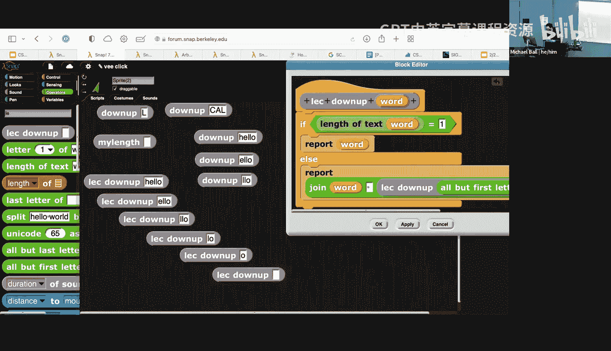

Go back over here。And。I'm going to。嗯。

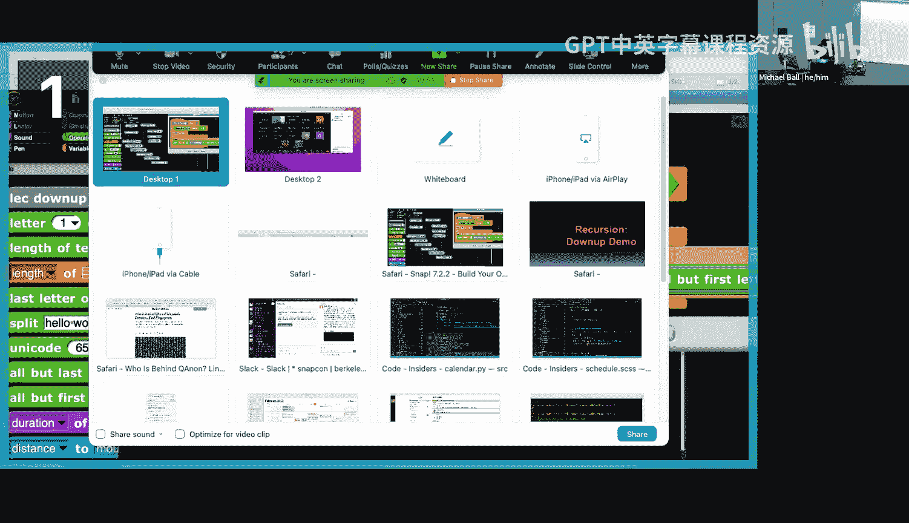

Would you stop sharing？系啦咩？Or not stop sharing， okay？你好。Okay。

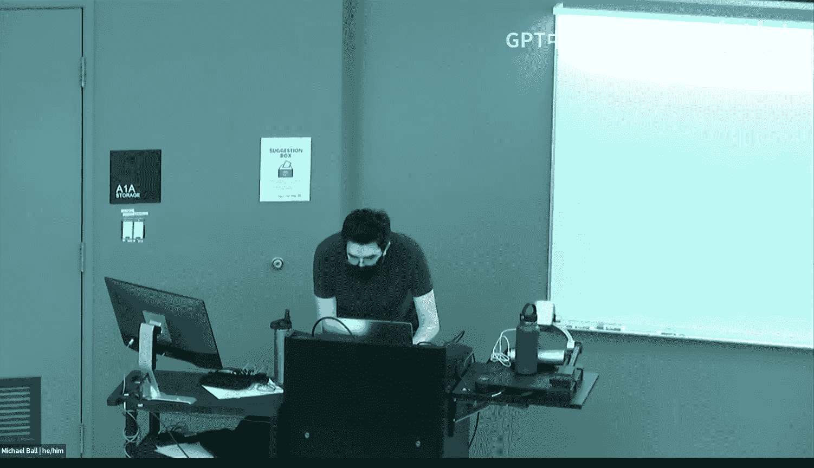

Okay， we're going to if I can't click。This is not going to work very well if I can't be clicking on things。

Okay， they're going to save this。🎼And。We are not going to go。All right。Okay。Now we'll try this again。

Oh， re share my screen。So。We're still getting。An error， the item one。嗯，哦。W how is？系。Yeah。嗯。嗯。啊。

If length of string。😔，Is it equal zero。ok嗯。Ibody have to ask why that's there because that block was just totally wrong。

嗯。All right， now let's see， okay， so we've still got a little bit of。

Of an issue here where our length a block is now。嗯。Let's see， why。Why is my demo not working？

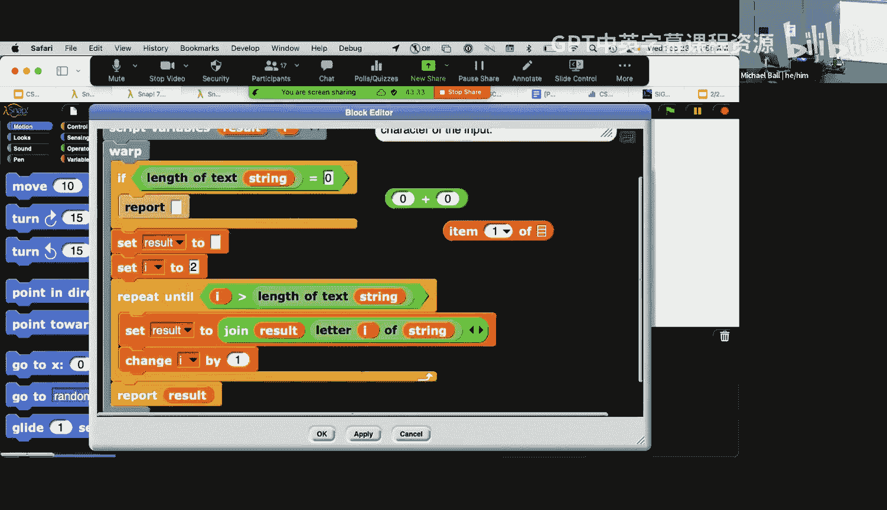

Okay， we're going to fix。I'm want going to fix this block and see if I can make sure that。O。

Okay that works。And。Oh， oh， I'm dumb and it doesn't work now because my changes didn't save。

I should have noticed that sooner。诶在。Was totally。呃。Missing the point all right。

 so now that have refreshed and lost some changes we'll go back and fix this。嗯。

And I thought the wrong thing is broken， but it was probably just me。嗯， that happens。All right。

 so what do we have here， we had length。Of our。Of our word。Okay， fine， let's say is equal to one。

We'll try and and do。Lecture down， so not that one let's get the set it away。

And where are we time wise， Okay， we have a few minutes all right。

 now now we've got length of weve got length of word is zero。Ass one， we report our O。It continues。

On here， so。Lecturd down up to this， this case where something is totally empty。

 we still have not handled properly。But that's okay， we're not going to handle that to， but now。

Weve got lecture down up of。Hello， oh， hello。And this block。All works correctly。

What happened with the last few minutes aside of the fact that we lost a little bit of time due to some debugging？

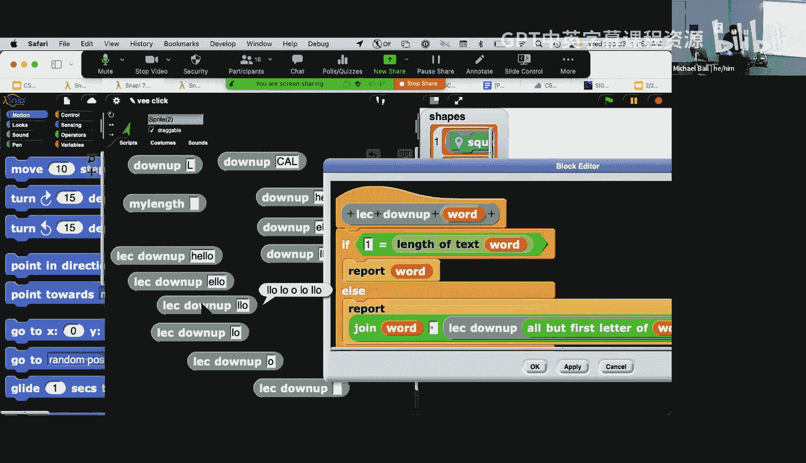

Where is。嗯。Okay。So。With the last few minutes， and then I'll jump back to the code。

 what I want to highlight is in this process， we've written a reclusive function and we're going to spend a lot of time doing this over the next few weeks with some more complicated examples。

😊。

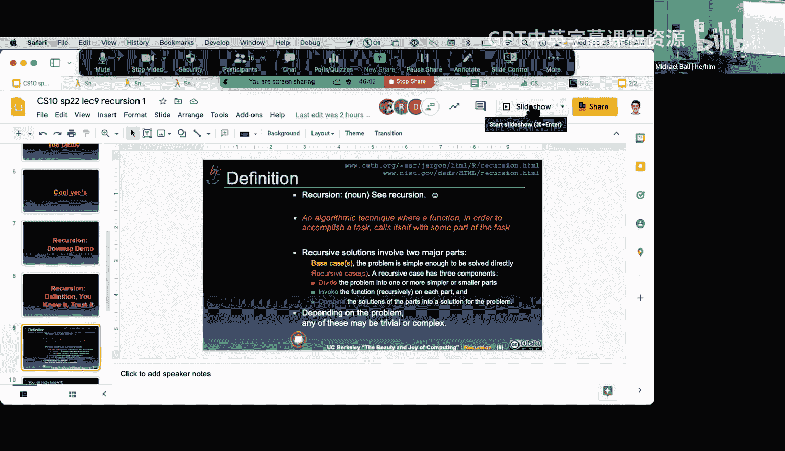

But we've looked at a problem which is taking a set of text。

 joining you with shorter versions of that piece of text， and then appending the word back to itself。

😡，And this problem。Ends itself to something which we naturally call solving a function recursively。

 and that is a process where。We take it home we break it down into a really two important parts。

 so one， the first thing that you're going to to think about is every recursive problem。

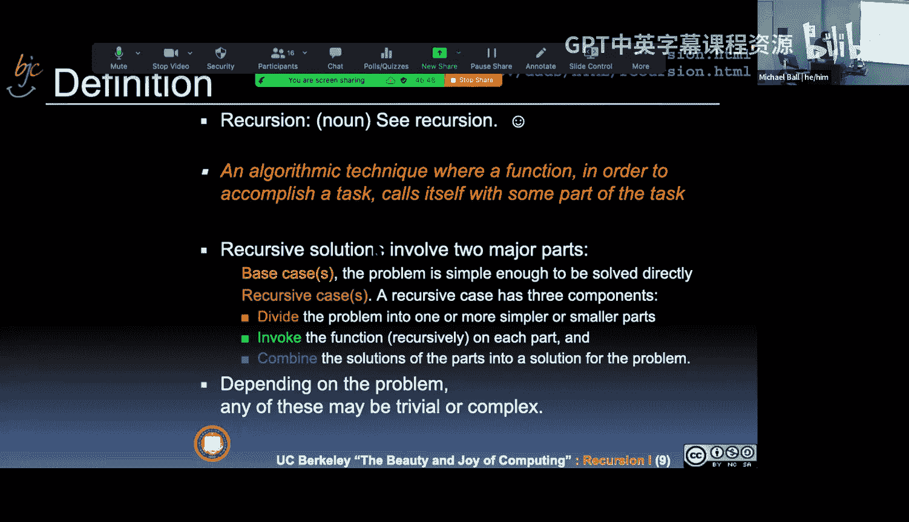

Including V， other than V， it is。A little bit funny with what what the base case is。

 but every recursive problem has a base case， which is what is the simplest form that this problem takes and in this case。

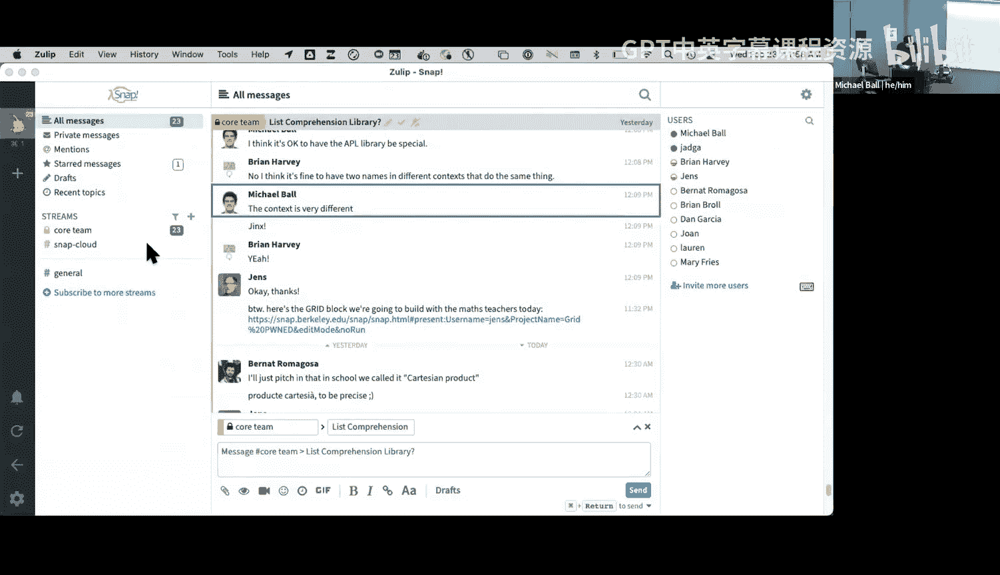

The simplest form is a one little problem right it is just that letter we could actually say the simplest form。

It could also be length is less than or equal to one， that'd be a little bit safer。

And every recursive problem has a recursive case and the recursive case is the part where our goal is to figure out how do we break this problem down into smaller pieces。

 so it has three parts put on the slides。It has divide invoke and combine so dividing says breaking this problem down into smaller parts。

 so how is a depth of hello and Lello the same well we're dividing this problem into smaller parts by removing the first letter。

We're invoking our recursive means in our recursive functions just means having this block lectured down up inside a definition。

And we're combining all the results together by。By joining them up。

This is a pretty fast introduction to reccc。It has all of the different components of。Of a。

Of recursive function we're not going to get into but what I will leave you with is inside this Myle block is let's say we didn't have a a length of word block but we want to build it using a similar process we can take this same idea and we can apply recursive processing to all sorts of data so we'll leave it there today and lab this week you'll play with some factors which can be really fun。

 the geometry the art band you can generate is really cool and then we'll spend some more time practicing with some recursion。

😊，Thanks everyone， thanks soon。

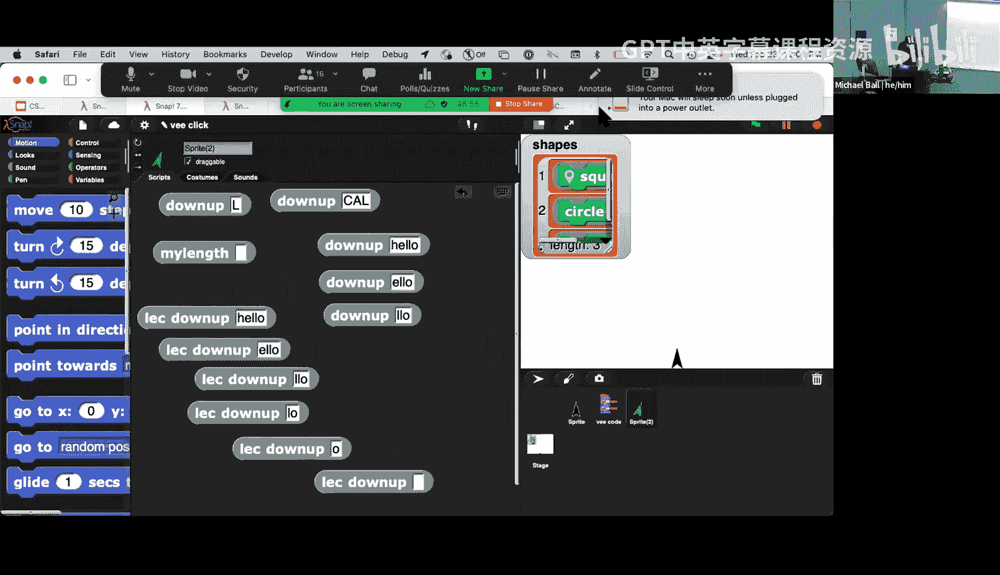

screen share。And grew better is bad today， which is perfect timing。

