# UCB《计算之美与乐趣｜CS 10. The Beauty and Joy of Computing 2022 spring》中英字幕 p13 CS10 Sp22 Lecture 13 (Mar 7).zh_en -BV1BokLBmEKE_p13-

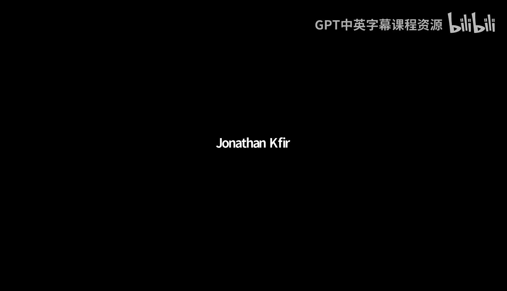

Ting sweet。そん。嗯。By。嗯。Alright。🤢，嗯。We can get started。Just share a screen to folks in Zoom。All right。

 cool， so it looks like most people found in slides。So that's great。Thank you for that。And。啊。

It's cool so just going to go pretty quickly， I didn't write them down， but I will after lecture。😊。

Maame thing for everyone is that the midterm is next Monday，7 to 9 p。m。

There is a form that's gone wrong。そ。是。I'll switch makes that keeps up。

The main thing is for the midterm next week， if you are taking remotely。

 there was a form that went out， Crystal， whos a staff number helping manage everything。

She'll send our confirmations later this week。Otherwise。

 we'll be having a review session hosted by the TAs later this week。

 the exact time will go out either today or tomorrow。Yeah。

 but Ditra shared the post of study resources， so that's going to be。Sort of your best bet role。

It'll work similar to passing the terms。If you need to take it remotely or have accommodations due。

 please make sure you felt the form。Otherwise。The other thing that I'll have out later this week are self checks for this lecture and the two lectures last week because I was traveling it didn't get a chance to them。

 but I'll just put them up， I'll make sure that there's no due date in that you can just use them to study。

 which is the point。And you could still sort of get the participation type points for completing those。

 but they'll be in jail four short questions。Otherwise， yeah， that's the main thing。 So today。

 what we're going to talk about。Understanding higher functions in the concept。😡，Not just。

How to use high order functions。But how I think about building our own higher function。

 so so far what we've seen are things like map。Keep in combine。

We've also seen versions of the test block and the 2048 project。This is。

The color before we change the color， but they all work the same way， right。

 they take it a function as an argument。They。Then。Call that function and apply。

 in case a map will function to a list， keep applies that function with the items of a list。

 but then returns a new list。Our test block calls a function with some inputs and compares it to some expected outputs。

 So all these work in a similar way。 we're not going to take time to go through this since。

was seriously messed up today。I left earlier than normal and got here later than normal。

So the question we can ask is which of these things are peer functions？あ。And。In this case。

 all of these higher functions are still pure functions if we pass in a plus block to map， right。

 as long as we pass in a plus and a one and a list of numbers from one to 10 well always get the same。

😡，Result back right if we pass it a different block like a multiplication block。Or a。呃。

Or division block or something like that， the same result will always happen that these functions take in some arguments。

Pros those arguments and give us back results。 So all these are peer functions。

 And this is really nice in the sense that it helps us sort of constrain the types of inputs and the types of things that they do。

 So we call them peer functions because they have no side effects。

 They don't modify the outside world。😊，And their output is always。The same given the same inputs。

There is a trick with higher tos， though， is what happens if I pass in something like a pick random。

 So if I say map。Pick random from 1 to 10 over some items of the list。 Now， my results are different。

 right， Now， if I try and test pick random， perhaps。

I'm not always going to get a positive test case because the point of pick random is that I get a random number each time。

In those cases， we can do things that are non peer by passing in an argument。

 which is not a peer function， right， We could say that this pick random block is。

Is not because it's going to have different results given the same inputs。

 but map itself is still a peer function because what map is doing。Is。

Is always going to so be consistent。So these are peer functions。second。

let's see if that helps what we're going to try to do today is figure out how do we use the blocks that map keep combined would use and build them up ourselves。

One of the interesting things about sort of the development of programming in general。

 but in SNAP in particular is that map keeping combined used to be blocks that weren't built into SNAP and they're implemented in SNAP now they're built in can you can no longer go in and edit the map block to see how it's built。

In some versions of CS10 projects， you can actually still find the old map block and see how it's built。

 but what today we're going to do is talk about。How do we turn something like a plus block inside a gray ring into a result？

Actually does the addition。To do this。We use two。Veryrely simple but really important blocks that come with snap and user are called Run。

And call one is a version of the block like its image suggests that works on command blocks call is a version that works on reporter blocks you might wonder is there a version that works on reporters instead of just or excuse me on predicates instead of just reporters call works on predicates as well because predicates。

Are really just a special kind of report and what womenmen call essentially do。

Is they take a function that we put inside this gray ring and they unringify it such that we can turn it into an expression。

That we can work with。The way that we typically do this is。Oneunning called by default and Sap。

Have this little arrowhead。On the right hand side。This is one of those things that is。

Kind of unique to visual program languages like SnAP。看。

The arguments that we pass to them can really depend on how we use it。

All sorts of program languages have notions like this。

 but Sap has this nice little metaphor to suggest it if I click。

There's this little right arrow here that something interesting will happen。

And what Run and call allows to do is they say， take a function。This case， the plus block。

 I click the little right arrow and it says with inputs and so we've got with inputs three and five。

And in the same way that man。Takes an item of a list。Places each item into the blank input slot。

 what CA does is it takes the three。😡，And it puts in the first hole right here。It takes a five。

 puts it in second hole right here， so if I say call the plus block with inputs three and five。😡。

And essentially just running the expression three plus five。We can always do this with fewer inputs。

 so however many essentially input slots we have that are open or empty is generally how many inputs we will use with calls so I could say call blank input plus5 with inputs three。

 this maps to the same expression 3 plus5 this if you try this with the map block。

You should start to sort of see how these things sort of mirror items of a list except this instead of using a list。

We're using one expression at a time， one set of arguments。But。Of course。😊，If we have no inputs。

 we could just say call the grade of three plus。And whats here that and we're going to talk about this is this green block。

😊，Plus block is inside a gray ring and that gray ring special meaning in the same way with a map block don't actually execute the three plus five delay。

😊，Expression or delay computing that result until I do something with call and so we'll see examples of that。

Of course， with the one block。We can do the same exact thing just with command。

 so run draw square with inputs 100， as soon as we have a draw square block， which takes an a size。

Then run and draw square we'll just take in。啊，不用。Be executed with 100 passed into the same slot。

 of course， just like with。Per blocks， we don't have to use our inputs。

 we could just put them directly in。To the block itself。We'll see why， though。

 having the ability to take a block without specific inputs。😡，And apply it。Directly will be useful。

This is one thing to note about call and this is how call and run work and snap when I go to spend a bunch of time on this but it's just useful to know that if a function accepts multiple。

Empty inputs， so in this case， a plus with two blanks。AndOr a multiplication with two blanks。😊。

And we only pass in one argument。That that argument gets applied to both input so blank times blank with input five is the exact same thing as saying five times five if we do this with a map block right if we say map multiplication over some list。

Where we get the same results。This case one two and three you get one times one。

 two times two to times three and so on， so this is sometimes honestly a little bit confusing if you're not expecting it to happen。

 but it can also be a really useful feature if you're doing some kind of expression perhaps in a map block where you might want to insert that number multiple times。

We're not going to get into it in this lecture today。

 but there are all sorts of cool features where you can control which inputs go where within ST。😡。

Actually， before we talk about using Run and call， any questions so far on just this idea of a block？

That takes in a gray ring function and actually executes that block。Yeah， good ahead。我没听到。Yeah， yeah。

 so that's a good question， what's the difference between call and map in this case？

The best way to think about this is that。Inside the map block color is actually being used to execute that block。

 So map is sort of like calling a function over a list of inputs and。

Hopefully I'll go through things a little bit and we'll get to this the annual rules instead of implementing map because map is once you see how to do this。

 map is actually pretty easy to implement， we'll implement Keep。😊。

Whi is kind of like map with just a little bit of a twist so we'll see how to compare them。

 but yeah that's a good question so the best way to think about map now that you hear about call the way that I think about map is map is calling a function repeatedly over a list。

Alternatively， you could think about call is like a map， but instead of a list。

 it's for just one one instance of you know some data at a time。

 but yeah yeah other question up front。Whats that。Yeah， what if you put more inputs than？😡。

And what sample allows that's actually a really good question。 I am born to be honest that I。

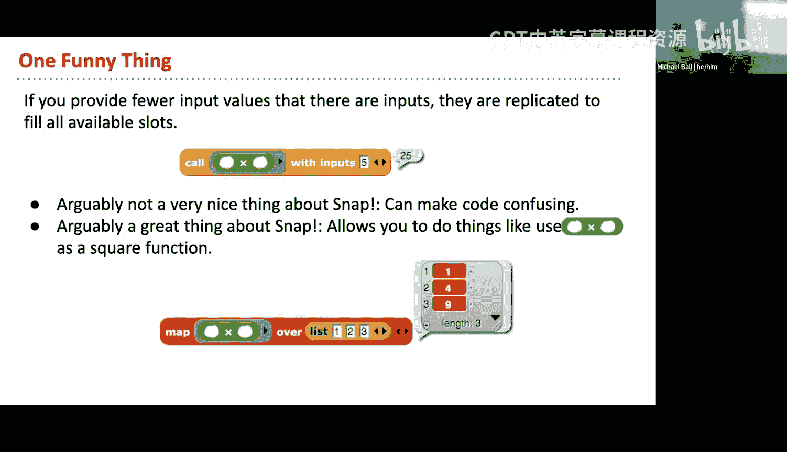

I'm pretty sure that Snap will yell at you， so the best way to do this is to just this is actually a technique with all programming languages。

And I will make the point to that。You know， I have worked on the SNAP source code for almost a decade now in various forms like not intensely like I did not write mostA Snap not by either longstrs。

 but you forget all these things when you use a programming language and what you do so let's just see what happens I say1 two and three to plus yeah。

 what SNap will tell us is what I thought would happen but what honestly wasn't 100% sure。

If they apply too many arguments。😡，Snaple toss。Expecting two inputs but getting three so that's saying that our plus block has two blank slots but three were provided。

 of course， if I one thing to note right is that as long as there are three inputs here。

 regardless of whether there is content in those inputs that still is a third input。

Nothing trying to be provided。😡，map to the plus block， so if I do this。That'll work correctly。

And if I did this， now S doesn't yell at us， but this is sort of a built in。

Sure for enhancement to the call block。That some people really like it makes a lot of expressions really nice。

 you just have to know that if we apply fewer arguments。😡，In staff。

 we can always apply fewer arguments and it will pass those along through all of the empty slots。😡。

But if we want to apply more， Sn will give us an error， cool。Oh cool and。I think someone。

 I don't know if I saw something in Zoom， but if you had another question。Cool。

 other questions on sort of just this idea of calling or running a single function at a time。

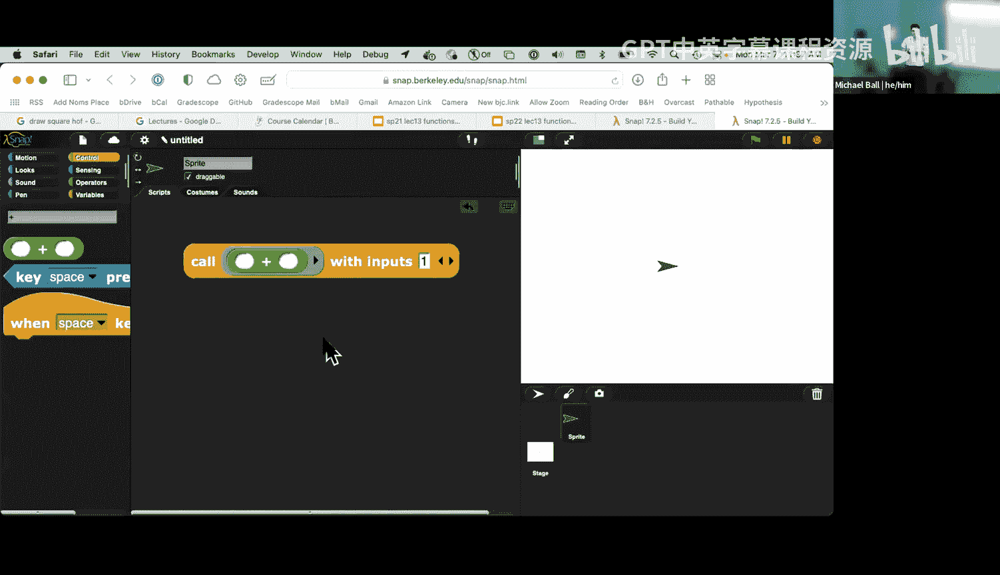

So。2。What we'll do now is we talked a little bit in the beginning of class about why we build functions in general。

 right， and we build functions。As a means of abstracting and generalizing a task。

 right that instead of drawing。A big square， a small square， a medium size square。

 we can take in an argument which is the length or the size of the square。

We can pass that argument to T block， and so now we have a draw square function。

And so this is really useful， right？😊，Blocks as a means of abstraction。

You've been making a whole bunch of them， hopefully。And that's super useful。

There's some problems that we might want to do。😡，嗯。And I don't have this project linked in the slide。

 so I'll try to link to it later today so that you can actually play with this。Is。

What if I want to draw a square of size 100， but now what if I want to draw， let's say。

 a dashed line square？😡，Instead of drawing you just a line。

 this line has dashes inside of it and in these two blocks we could say well。

I first start by drawing a line。Then I turn， then I draw a line again。Now instead drawing a line。

 I draw a dashed line that I turn and I keep drawing line again， so conceptually right。

 these blocks look pretty similar。And you know， maybe I have this this sort of。

Liigally line square thing that could be interesting。You can actually start to think about how。嗯。

We don't talk a lot about this in CS10， but like computational art is a thing that you can start to imagine having a whole bunch of styles of lines。

 building up a whole bunch of shapes。😡，NowIn these three cases， we have three very similar。

Blocks that do three similar but still different things。 and if we notice in here。

They only differ by one line。Normally， we might say， well。

 do I control how do I just change this draw line block from this draw dash line block？😡，And。😡。

In this case， what we want to say is looking at this code。

There's got to be some tools in some ways that we could think about helping address this question。

And right now， you might come up with a few different ideas in your head about like， can I say。

 you know， can there be an argument called？😡，Let's say。You know， the style， if style is regular。

 you know， I draw one block if style is weightavy， I draw I use another block。

 but it turns out that what we want to do，😡，Is。🤢，His turn must draw square function。

Into a higher order function that instead of just drawing in the same way that we had a new steps block before。

 we can replace this with a new block。😡，Called one with some type of input to run。

 which in this case is a line drawing block。😡，呃。And what we'll be able to do then is control。😡。

How does the square function works。嗯。Let's like take a step back and think about how this works。

 so now this is the first case of a function that you've seen that takes in a block as an input。

And uses the one block。To execute that。What we say is draw square。Instead of taking in just a size。

 it now takes in this argument is called a line draw， so something that will draw。Individual line？

And it then takes in the size， so I pin down， repeat for。

I draw a line willll talk about sort of how this works at first。

 Then I turn 90 degrees then I keep repeating and then I do pen up at the end。 so this is the。

Draw a square block right， but now with a fancier way of accepting something that will draw a different kind of line instead of just move。

It some just you move 10 or move 100 or whatever it is。This first argument here。

 line drawer or this draw line block becomes this line drawer input。

 this 100 still becomes our length input。😡，What I then do is I say one。Line drawer with inputs 100。

 and this 100 becomes the input to this blank slot here。😡。

This 100 rate becomes the input to the draw dashed line。Function。

And that is a way of having a high order function， which gives us much more flexible control over how we draw。

How we can， let's say draw different kinds of squares without building three different blocks on the previous slide。

 right， we had like three different blocks to draw three different kinds of squares。

Now we have one block to draw any kind of square and instead of knowing how to draw the line。

 it takes an argument which then tell it how to draw a line。😡，As sort of a general rule。😮。

This is a hugely useful pattern。If you continue taking computer science， so in CS61A and CS88。

 whether you're in data science or CS， you'll spend a lot of time using hardware functions。

In CS62 B there's not as much of an emphasis on higher functions but you'll use passing an arguments of data to provide much more control over how something happens without career writing a ton of code and so one of the things that's really great about this is that while while saying run line draw with inputs is a little bit confusing at first what you well hopefully come to realize and to appreciate is that as your projects grow in scope or as you want to do things that are similar but slightly different this gives you a lot of control without spending the time to write tons of additional code and so。

This is a huge and useful pattern， if you continue on with courses like CS169 upper level software engineering。

 you'll see all sorts of similar examples of passing and I function to control how some action happens。

 even though they're in vastly different programming languages。

 these patterns still exist everywhere。So what's going on here， in some senses。

 there's not much that's different than。The basic。Draw square function。

 it's just that we happen to run a different block。Instead of using， let's say move 100 steps。

 we now run a line draw block with some inputs and that。三。

And that is basically just passing in this argument here to this first step of the run block。And。

How how yeah and so that's where one comes in so one is for command blocks call is for reporters and if we ever want to take a renified version of a。

😊，啊。Of a block that is a command block and actually execute it。 we use the run block。

 so we'll go on to building keep next， but our questions on this example before we continue on。

Questions on this example so far， and I believe actually it was I meant to put in the first slide。

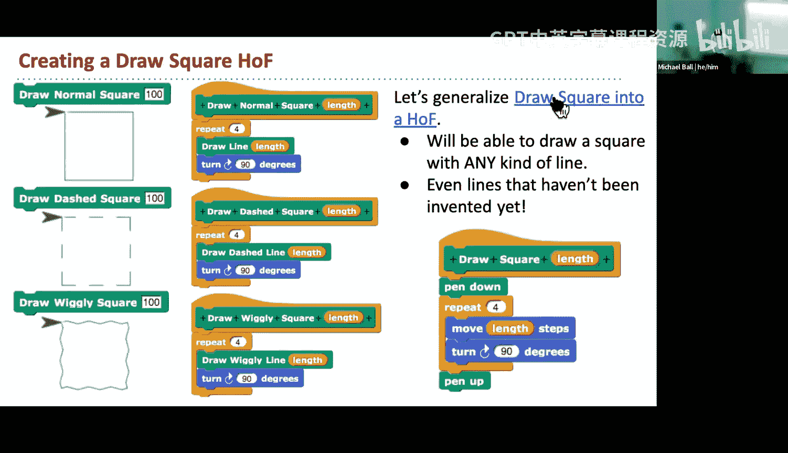

But。The examples yeah， various examples of this project should exist linked on on the other slides so。

嗯。

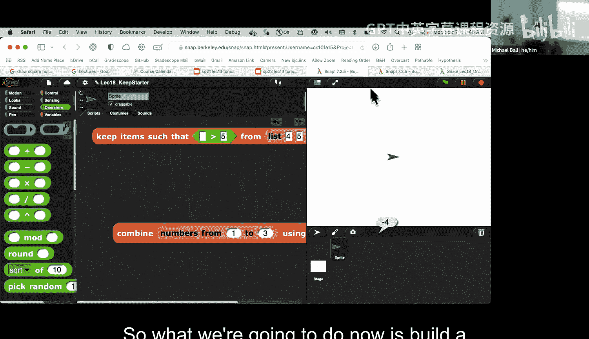

So。😊，What we're going to do now is build a version of the keep block from scratch the name of this block is a little bit more verbose just to distinguish it from the built in keep block。

 so we're going to say keep items such that sum function。Which we're going to call a predicate。

From our list。

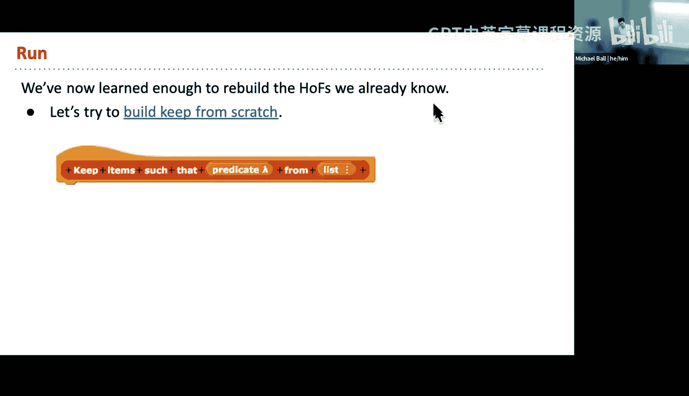

I have。Actually， let me add。好。Let's close that out。We're not going to build combined today。在。

But what we are going to do is work on。On on this keep function， so what we have is keep items。

Such that some bullying from our list of numbers。And we're going to edit this block and this was actually not set up quite right。

 so we actually want to make when we're making a block that has a high order function。

Let me do myself a little more。What we want to do is select one of these inputs generally is。

Command in line reporter， predicate。😡，Or command C shape。

 So you can make a block that actually looks like for each。 We're not going to do that today。

 But all of these four inputs give us a higher order function that we can then run our call。

 So I'm gonna say that this should be a predicate。If they bring hit apply just so it shows up。

And what that gives us is keep items such that some function。From。Our list of numbers。嗯。Oh。

I'm going to start with a。Scrip variable here。There's a whole bunch of different ways that we can write this。

系。Set should really not be at the bottom of the search results because it's like so useful。All right。

 so I'm going to start by setting the result。2。嗯。To some listed data。

We're going to report a result at the end。What are some blocks that we might need so we're going to build our un version keep and remember that what keep does is it returns only the items where applying this function is true。

😡，嗯。What do we think someone shout out or type in Zoom a block that we'll probably need to implement Keep？

😡，What's something that we might want to use in implementing this keepwalk？Yes， cool。Right。

this is for now because I think that's fine， what else might we need？I observe。Okay。

 we can do it that way。哎。And what else might we need？An add item。哎。😊，And if we're doing it this way。

 what else do we？Oh。What's one big block that we might be missing here that we're probably going to need？

Actually there's two but。A full loop， yeah， okay， so I'm actually going to grab before each block because that will make our item of not necessary。

あ。All right， and。Let's make this window a little bit larger。

Is there anything else that we might need here before we continue on？All right。

 so we'll come back to the one thing that we need。But for right now what we we'll talk about is building the basic structure right so for each item in our list。

😡，If。Some version of our predicate thing is true。 We're going to add。Our item to ever result list。

 I'm going hit apply。😡，And now， let me。this over here。Keep items such that predicate from45。

 six78 and what the things that are greater than five so I said if predicate。

And now we didn't get the right results。What block do we need that is probably the point of this lecture that we haven't used yet？

😡，What two new blocks have we introduced today？Run and call in between running call。

 what should we use？😡，So we've got run and we've got call and in this case call makes sense because what we have here is。

This is a predicate block， but a predicate is really just a special kind of reporter。

 so what we want to do is call our predicate。And this is one of those cases where I noticed how when I dropped the variable。

😡，Into our call block， the Gling disappeared。😡，Knowing and understanding when a gray ring should be there and shouldn't be there will be something that we'll talk a little bit about the last few minutes。

😡，But。What we want to do is we want to call our predicate。

 so we want to evaluate is something greater than five？

AndWhat should be passed into that predicate is the item of our list right。

 so I could say is four greater than five， is five greater than five， is6 greater than five。

And so on， and so I can say call with inputs or call predicate with inputs of our item。

 let me apply this， and what we should get back is six， seven and eight。

And so now we've built a higher order function。😊，That takes in its own function called predicate。

It calls that precate function with the value for each item the list and then based on that result。

 it does something like decide to add that item per list， you can now take this code。😡。

And then decide if you wanted to implement map， you could use that to implement your own version of map。

 we're not going to do it today， but you could also think about how to implement your own version of combine。

Where combined takes in a function and reduces things to a single item， right。

Bine is a little bit trickier， but not terribly hard if you work through the recursive version。Yeah。

 questions on。This is all that you need conceptually to implement your own version of Keep。

Questions on how this works so far。Any questions from Zoom on how our custom version of Keep workss？

Cool， otherwise we'll move that along。This pattern is something that we can apply to all sorts of boxes if there's some function。

Call it with those inputs and then continue on Zoom。嗯。Yeah。

 so question is the call function checking every item and that's that's correct yeah call for each of our items we call。

The predicate function with that item is input， so having the items in our list？😡。

If we have a five item list as an input， we're making that function call five times with five different sets of inputs。

Yeah， so so the question is， what makes call and run different from map？

Yeah this is asked early a little bit so what again what's why are Col and Ron different from map well the thing to remember not grabbing the ring grabbing out call。

😡，Is。Our call function。Only ever lets us operate on。One function。And one set of inputs at a time。

 so call will always say。Call this function once with these arguments。😡，Map and keep and combine。😡。

Take the idea of calling something and just generalize that to a list of data。😡。

That's the distinction really is so you can move Col is doing something once map is essentially colonary function。

😊，Over。Over a list of items I'll also mention well I'm not going to pull it up right now。

 but the test block that is in your 2048 project， if you open up the test your function that's in 2048。

 you'll see that it's actually a very simple version of using call with inputs comparing something to some output so if you want to go back and look at your 248 project。

 it's a pretty simple implementation there。

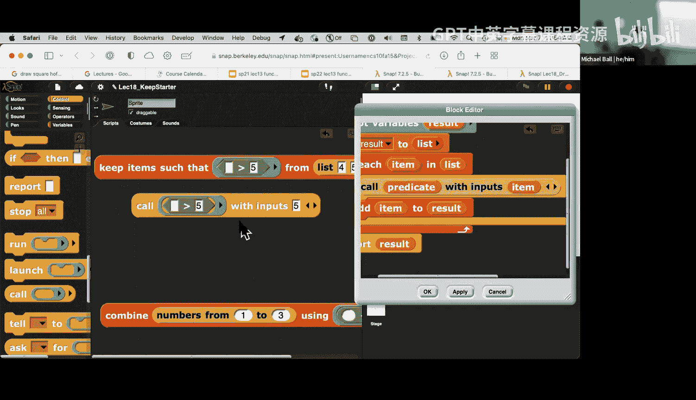

。Yeah， any additional questions？So Im must get through going through combined。Yeah right。

So we're not going to implement it， but just as a little bit of review， right combining。It takes in。

two argument function and it successively applies。The the item and actually。

I should probably update this slide because the order in which combine。

Those things is a little bit different depending on the version of S。So。In this case。

 this example is going through what's combining from the right to the left。

That has since changed since these slides are made because combined that goes from left to right。

Which is。The map doesn't really change， so we're actually not going to do。This today。

But you can implement combine and SNAP if you want to show all of the sites there to think about how to implement a version of combined。

But what I do want to talk about with the last few minutes。😡。

Is this idea of using the gray rings and snap。Understanding what happens。嗯。

What is the result of x after the script one runs right in this case。

 all we're really saying is that blank minus3 is going to just be negative3。

Now what happens if I instead of saying？哎。X minus3， I have a gray ring around the block。

 but x minus3。In this case。The gray ring of a function represents in S is a gray ring represents taking an expression and delaying computing the results。

 So in now the point is trying to understand is why do you see these grayavings in snap。

 how do we effectively use them。And then how do we sort of。

 you know decide when to have a grave rain， when to remove a great rain and what you can think about here is oops。

Is inside Snap。

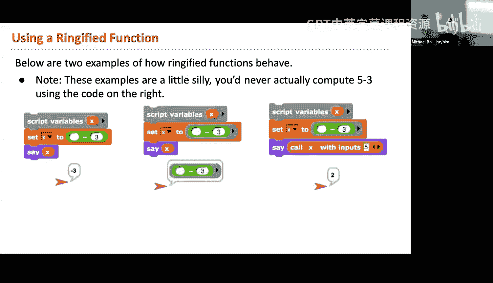

Whatever we have a something like a key block or a map block。

 that en graving is provided for us suggesting that this input is a hi function。

I can actually go through here。And drag this out。And this gray ring represents the idea of this expression。

 not the result of this expression because of I。Duplicate this block right here。

 right the result of this expression is just going to be false because nothing。

Is not greater than five， it just doesn't even make sense， so snaps is false。

But this thing here is the idea of an expression which can later be computed。

 it is treating this function not as a value， but as a piece of data that can be passed around。

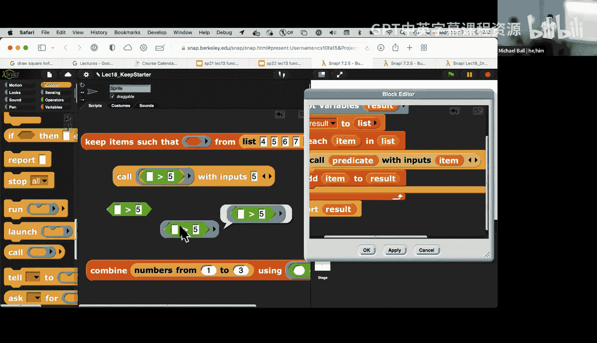

And what happens then is the call block says，Take something with a gray ring。

Remove that gray ring essentially so that I can now evaluate the function and while I'm evaluating the function。

 let me resolve any unknown arguments so the nice thing here right is wherever there's a blank slot we can sort of delay that to then later change what arguments get passed in。

😊。

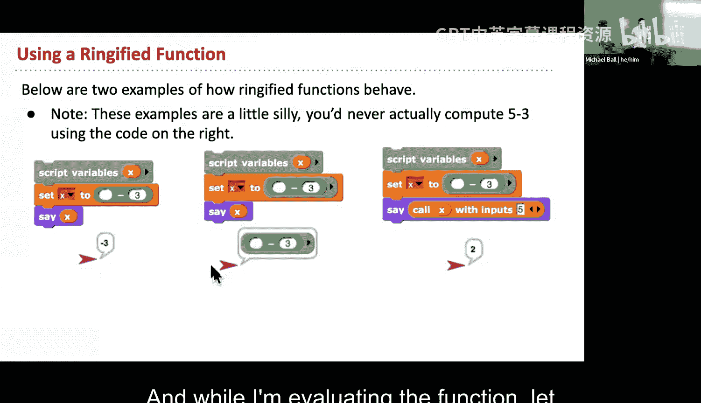

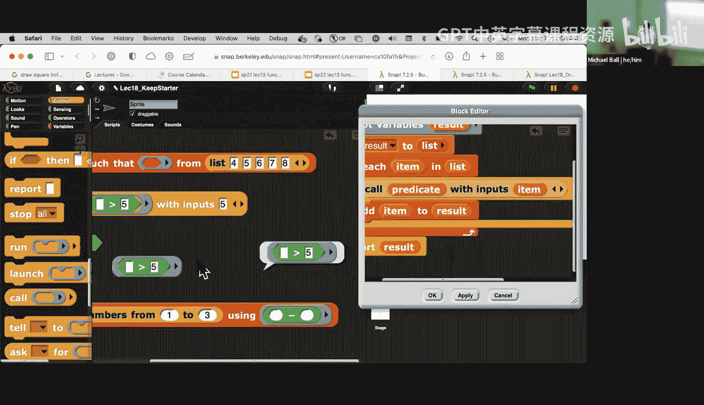

As as a function so in our draw square block we did the same thing where we pass in a ringnified version of this line draw function so we could draw a dashed line。

 it has an empty input slot so it represents a function that can be called with any different kinds of arguments。

😊，And then we'll later， once we know what the arguments are。

 we then later call it in this case four different times with the right argument as an input。😡。

And so。H。What this does is it really allows us to give us some control by saying sort of let me delay。

 let me freeze this function in time and in later when I'm ready。

 Ill get the result of whatever that block is。The general idea is that it allows us to have。呃。

A function which gives us more control over how and when it runs and operates。哎。Yeah。

So we're not going to go through all this day， but I will turn them into quick questions。

This one is pretty straightforward， how many inputs does the draw square block have？

And when we're looking at inputs， this one you can probably guess these are going to always be two if there's a function is still。

Agument to a block， so draw square takes in a function in this case a length that always has two inputs。

And we can later say， so we didn't have time to do all the discussions。

You know try and understand what happens when we have nested functions inside a one block。

 so this is one。With input 200， so I'm not going to go through this right now。

I will leave you with I'll make this a clicker question on gradecope and send out an email probably tomorrow when all the self- checks are up but what I would leave you with is thinking about this puzzle right here。

 which is when we have a gray ring of a function which then has an argument which is itself a hard to function what order are things being evaluated and where are where is this number 100 being applied to in this function so this is where we'll leave it but I would say is and I'll make the link more explicit but take go for the practice or the。

The draw square file for this one play with this a little bit because when you get through an answer to this question。

 I think you'll have a pretty good understanding of what's going on with these grayavings when we ring aify function。

 when we unwing aify function and where the arguments are so soil is a little bit rushed today but we'll meet back on Wednesday and then next Monday also we will not have a new lecture topic but it will just be an open Q&A time so I'm not going to prepare much for next Monday but just come with questions next Monday and we'll go through those as well。

Thanks everyone on Zoom thanks。啊。I he。

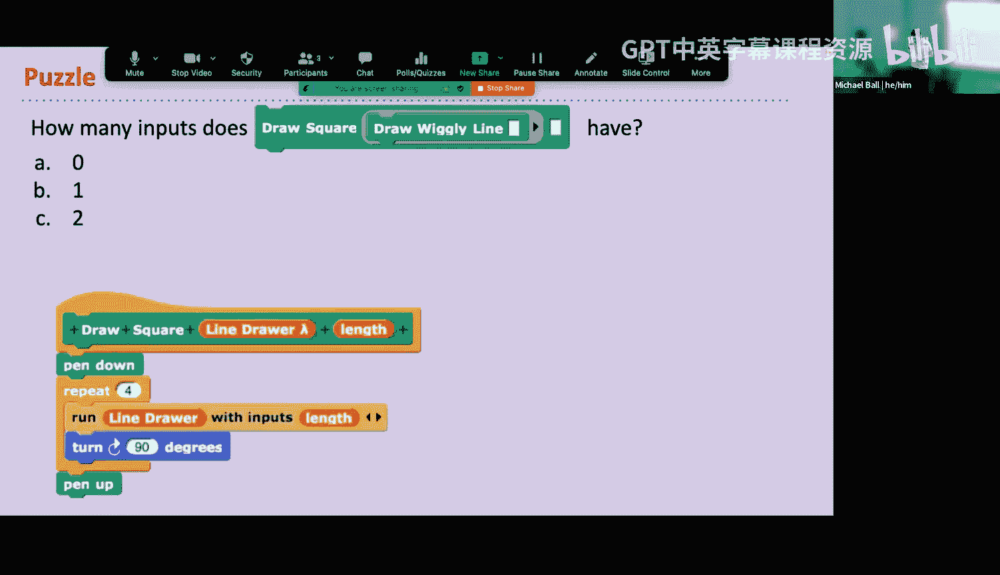