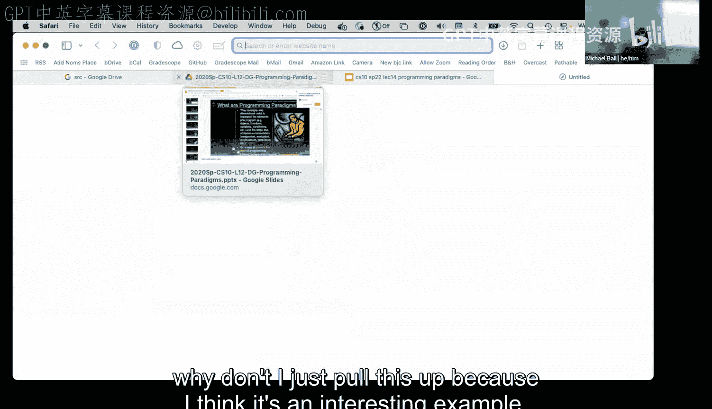
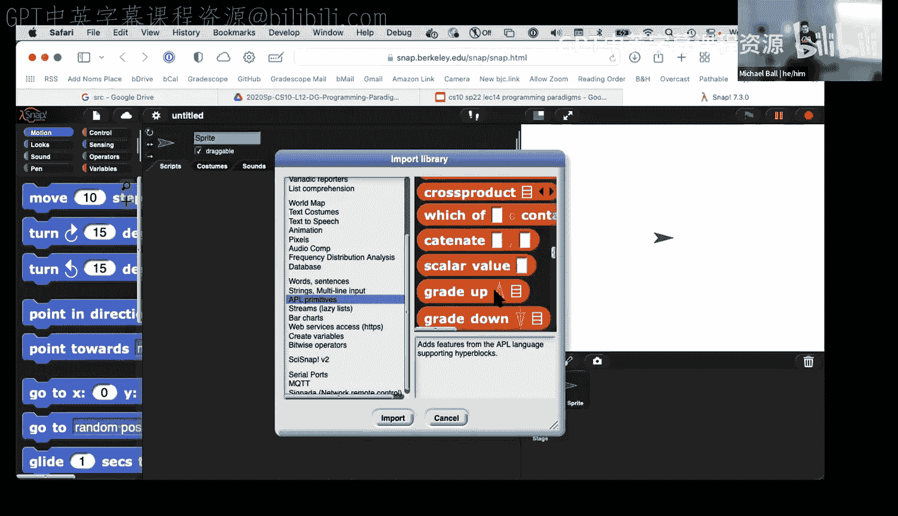
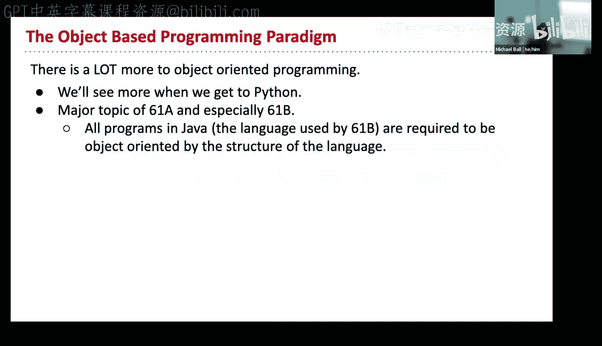
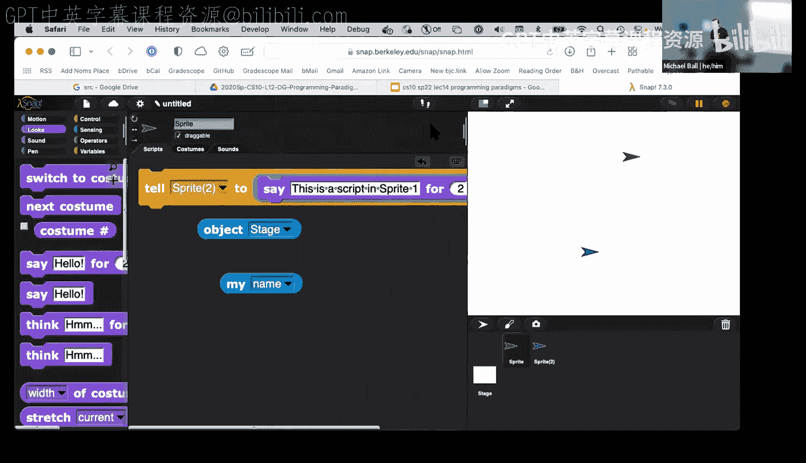
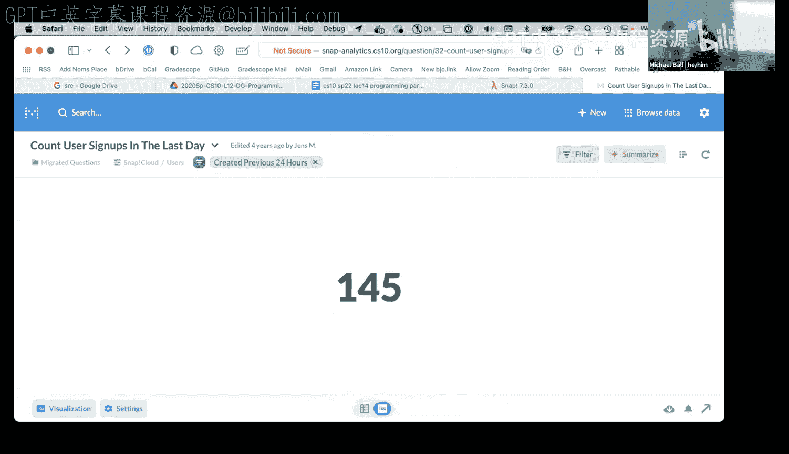

# 计算之美与乐趣：第14讲：编程范式


在本节课中，我们将要学习编程范式。编程范式是编写代码的不同风格或哲学。理解这些范式有助于我们选择最适合特定任务的工具，并更好地理解他人编写的代码。我们将探讨几种主要的编程范式，包括命令式、函数式、数组式、面向对象式和声明式，并通过实例来理解它们之间的区别。

## 概述

编程范式是编程的一般方法、方向或哲学。它不仅仅是关于单行代码的写法，更是关于如何组织整个程序、函数和文件的思考方式。大多数现代编程语言（如Snap!、Python、Java）都是多范式语言，它们支持多种风格，并融合了各种范式的优点。

## 命令式编程

上一节我们介绍了编程范式的概念，本节中我们来看看命令式编程。命令式编程的核心思想是：程序由一系列明确的指令组成，计算机按顺序执行这些指令。这通常涉及使用循环和修改变量状态。

以下是命令式编程的一个典型例子，它通过一系列步骤将一个短语转换为首字母缩写词：



```
设置 `acronym` 为 空字符串
对于 `phrase` 按空格分割后的列表中的每一个 `word`：
    将 `word` 的第一个字母连接到 `acronym` 末尾
报告 `acronym`
```



这种风格的优点是步骤清晰，易于理解每一步在做什么。其标志性特点是使用循环和通过修改变量（如`acronym`）来跟踪程序状态。

## 函数式编程

接下来，我们看看函数式编程。函数式编程强调使用纯函数，避免改变状态和可变数据。程序被视为一系列函数的组合，一个函数的输出作为另一个函数的输入。

以下是使用函数式风格解决同样问题（生成首字母缩写词）的方法：

```
报告 连接（
    映射（取首字母，
        保留（长度 > 3，
            句子转列表（`phrase`）
        ）
    ）
）
```

这个版本没有使用任何变量来存储中间状态。它只是一个表达式，其中每个函数（`句子转列表`、`保留`、`映射`、`连接`）的结果直接传递给下一个函数。虽然代码更短，但理解其执行顺序（从内到外）可能需要一些适应。

函数式编程的优点包括：代码更易于调试（因为纯函数不依赖外部状态）、更易于并行化处理，并且通常更简洁。

## 数组式编程

现在，我们探讨数组式编程。这种范式是函数式编程的一个特例或独立分支，它专门设计用于高效处理列表（或数组）数据。在Snap!中，许多内置块和库（如APL原语库）都支持这种风格。

在数组式编程中，我们通常将整个列表视为一个整体进行操作，而不是显式地遍历列表中的每个元素。例如，在Snap!中，乘法块`*`可以直接接受一个数字列表作为参数，并返回所有数字的乘积，这体现了数组式思维。

## 面向对象编程



然后，我们转向面向对象编程。这种范式将程序组织成一系列“对象”，每个对象包含自己的数据（属性）和可以对这些数据执行的操作（方法）。

在Snap!中，每个精灵（sprite）都可以看作一个对象。精灵有自己的属性（如x坐标、y坐标、名称、造型），也有自己的方法（如“说”、“移动”）。我们可以让不同的精灵执行不同的脚本，对象之间可以通过“告诉”块进行通信。这种范式有助于将大型程序的结构分解为更小、更易于管理的部分。



## 声明式编程

最后，我们了解声明式编程。声明式编程描述的是“想要什么”（目标），而不是“如何实现”（具体步骤）。程序指定一组规则或约束，然后由计算机找出满足这些规则的解决方案。

一个经典的例子是使用Prolog语言为德国地图着色，要求相邻省份颜色不同。我们只需定义颜色集合、相邻关系以及“相邻区域颜色不能相同”的规则，Prolog引擎会自动找出一种有效的着色方案。SQL（数据库查询语言）是另一个声明式编程的例子，你只需描述想要的数据结果，数据库引擎会决定如何高效地获取这些数据。

## 总结




本节课中我们一起学习了五种主要的编程范式：命令式、函数式、数组式、面向对象式和声明式。每种范式都提供了独特的视角和工具来解决问题。没有一种范式是绝对优于其他范式的，它们各有优劣，适用于不同的场景。理解这些范式能帮助我们成为更全面、更灵活的程序员，能够为手头的任务选择最合适的工具，并更好地理解和构建复杂的软件系统。