# 计算之美与乐趣：第16讲：Python II 🐍

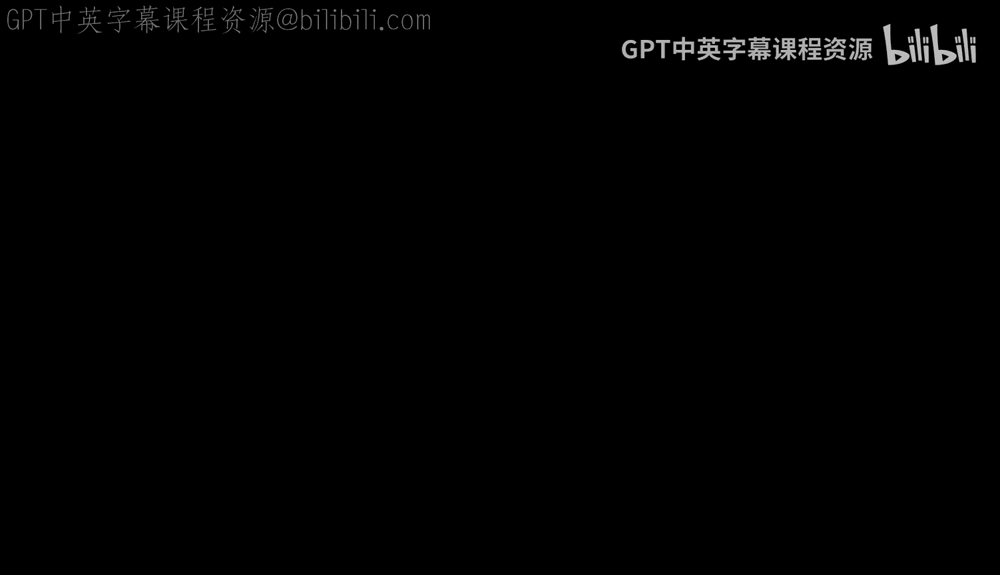

在本节课中，我们将继续学习Python，重点比较Snap!与Python在编程思想上的异同，并深入探讨Python中列表和字符串的面向对象操作方式。我们还将介绍Python中一个强大的特性：列表推导式。

---

## 课程概述与作业安排 📅

在深入今天的课程内容之前，我们先了解一下本周和下周的安排。我们将继续讨论Python，并会进行大量Snap!与Python的对比，思考如何将一种语言中的概念映射到另一种语言。

周三我们将发布**作业三**。这份作业介于家庭作业和项目之间，其核心目标是：我们将提供一个完整的Snap!项目和一个部分完成的Python项目。你的任务是通过阅读Snap!代码，理解其逻辑，并将其“翻译”成功能等价的Python代码。

在这个过程中，我们希望你能收获两点：
1.  理解Snap!和Python在哪些方面相似，在哪些方面不同。例如，看到Snap!中的`for each`循环，能想到如何映射到Python的`for`循环。
2.  练习编程的核心流程：阅读代码、理解逻辑、编写新代码以及调试。不要试图一次性将整个脚本完美翻译。可以写一部分，测试是否工作，然后逐步完善。这个作业的目标是得到一个能工作的Python项目，翻译方式并非唯一。

与此同时，**最终项目（项目三）** 也将启动。本周你们需要完成项目提案。这是一个合作项目，目标是构建一个Snap!或Python程序。提案不需要非常复杂，但需要让助教了解你们计划在几周内完成什么。

关于最终项目的建议是：**优先考虑构建一个能实际运行、可以展示给朋友的小而精的项目，而不是一个雄心勃勃但充满错误或无法运行的项目**。正确性比野心更重要。

另外，期中考试的成绩将在明天或周三上午公布。

---

## 面向对象编程与Python操作方式 🔄

我们将继续探讨Python的优势及其与Snap!的不同之处。第一个核心概念是**面向对象编程**。

几周前在“编程范式”讲座中，我们提到在Snap!中，精灵可以是一个对象。但总的来说，Snap!并不容易深入探索现代意义上的面向对象编程。这与我们上次看到的一些代码会有所不同。

我们将重点看Python中精炼的两种数据类型：**列表**和**字符串**，以及如何对它们进行操作。

### 列表操作：从函数到方法

在Snap!中，我们有一个列表（可能是脚本变量或全局变量）。要向列表中添加内容，我们使用`add (thing) to (list)`函数块，并将列表作为参数传递给这个“添加”块。


在面向对象编程中，我们转换了思路：不再是向一个函数块传递参数，而是让某个函数或**方法**操作一个**对象**。

在Python中，对应的操作如下：
```python
some_list.append(“ketchup”)
```
这里的`some_list`是一个列表对象。`append`是一个**方法**，它作用于`some_list`这个对象。我们可以理解为“这个列表对象知道如何执行一个叫`append`的操作”。

这种“A做B”的方式是面向对象编程的标志之一。对于Python内置的对象（如列表），有一整套可以自动调用的方法。在CS61A/B这样的课程中，你会学习创建拥有特定方法的自定义对象。

再次比较Snap!和Python：在Snap!中，我们的积木块大多是全局的，它们存在于左侧的调色板中，接收数据，输出数据或修改列表。而在面向对象编程中，我们使用的方法只对特定的对象有意义。Python中可能没有全局的`append`函数，我们必须先有一个列表对象，然后才能对它进行`append`操作。

这两种方式没有绝对的优劣，只是不同。我们将继续通过更多例子来体会。

### 利用Python官方文档 📚

在深入更多例子之前，我认为值得强调的是：使用像Python这样的语言，其最大优势之一就是丰富的在线资源和示例。学习如何做某件事的最佳途径之一就是查阅官方文档。

Python的文档非常全面。虽然有些部分从纯计算机科学的角度编写，较为深奥，但大部分内容组织良好，有方便的搜索功能和目录结构。

幻灯片中高亮了两部分：
1.  **数据结构**章节：列表是一种数据结构，它让我们能将多条信息以易于修改的形式组合在一起。文档列出了可以对列表进行的各种操作，如`append`, `extend`, `insert`, `remove`, `pop`（弹出并返回元素，Snap!中没有直接对应的块，但你可以自己构建）, `clear`等。
2.  **字符串**章节：字符串在Python中是独立的数据类型。文档列出了许多字符串方法，如`capitalize`, `center`, `count`等。

你不需要通篇阅读文档，但要知道你可以搜索它，获取思路，了解对于特定类型的数据，Python内置了哪些功能。这是学习使用一门语言的优势。

---

## 字符串处理：输入与分割示例 🧵

现在让我们通过一些例子来继续比较Snap!和Python。

在Snap!中，我们有`ask and wait`以及`answer`功能。在Python中，我们使用特殊的`input`函数在终端中请求输入，类似于Snap!中弹出对话框询问。

假设我们通过`input`获得了一个由空格分隔的数字字符串，例如 `"1 2 3 4"`。这个`numbers_text`变量只是一个字符串。

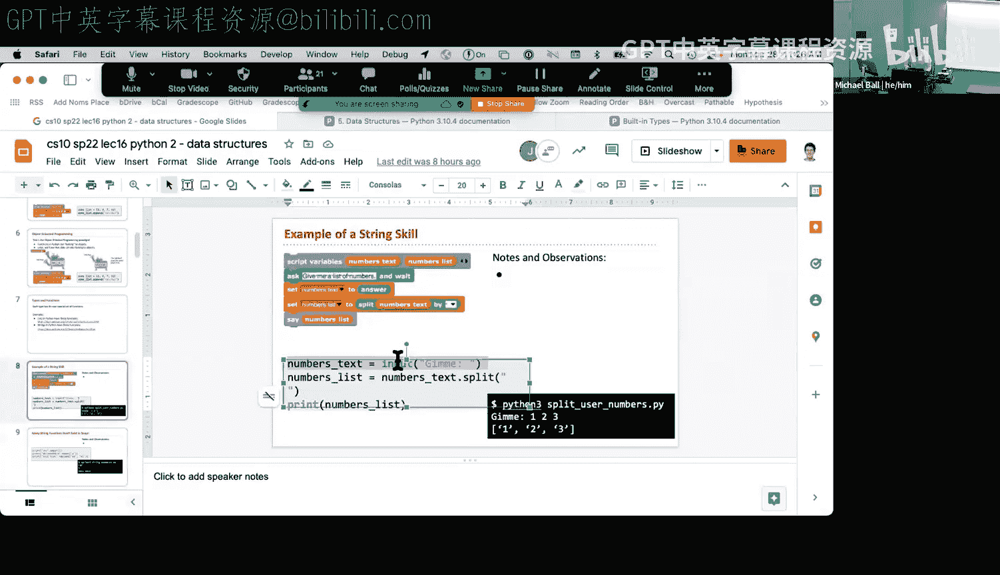

问题是如何将其转换为数字列表？在Python中，当我们有一个字符串这样的数据时，我们可以对它进行某种操作。

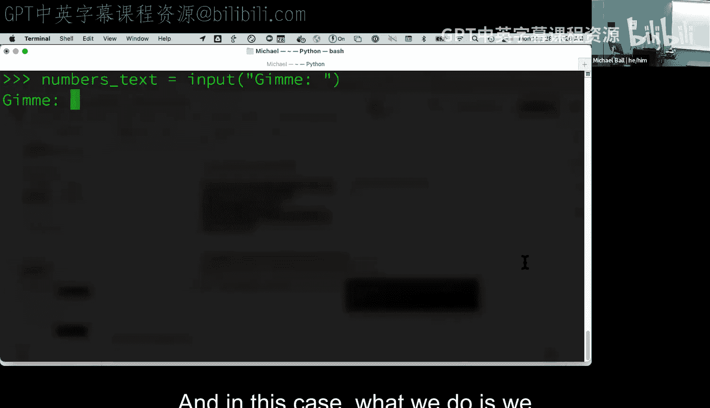

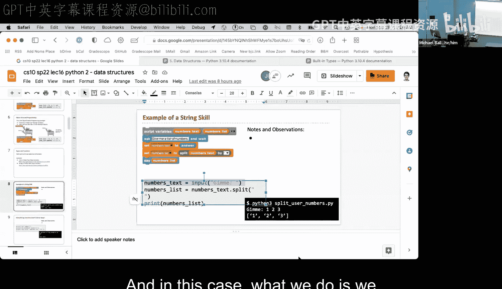

在Snap!中，我们可以使用`split`积木块，按空格分割字符串。


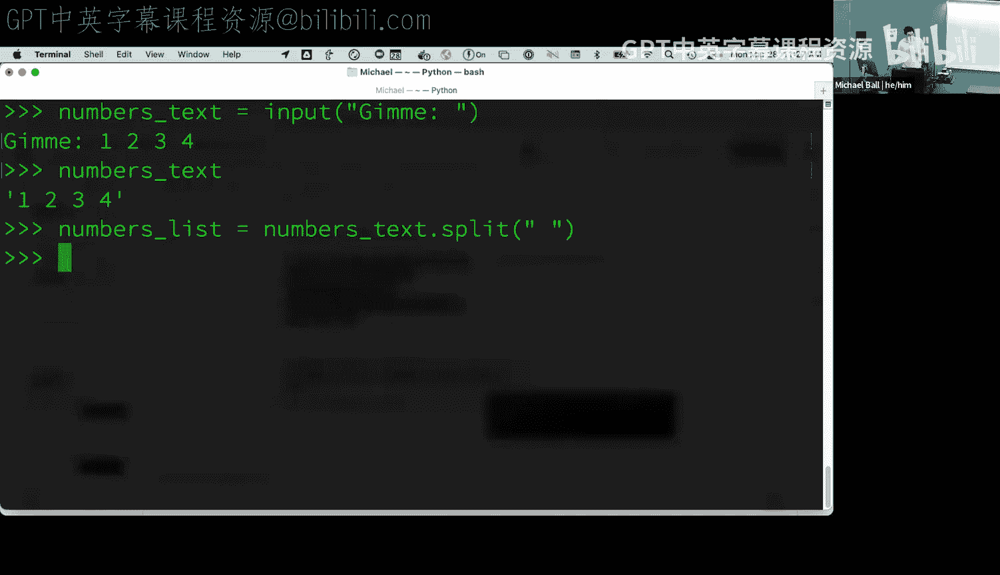

在Python中，有一个类似的方法：
```python
numbers_list = numbers_text.split(" ")
```
`split`是一个作用于字符串的方法。它的功能是将字符串分割成一系列独立的项。现在我们就得到了一个包含四个字符串的列表。

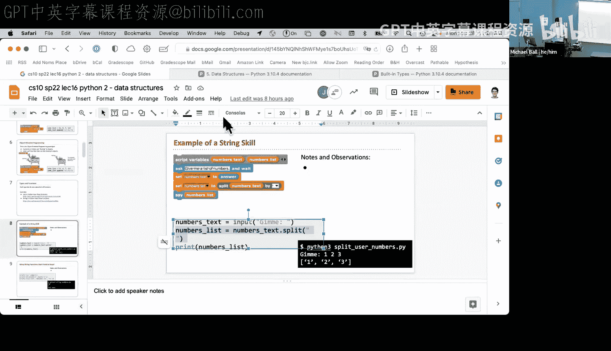

如何知道在Python中该怎么做？你可以思考：我想把一系列文本值（字符串）转换成列表项。在Snap!中我有什么操作？我有`split`块。如何在Python中分割文本？你可以直接搜索“how to split text in Python”或打开文档找到`split`方法。

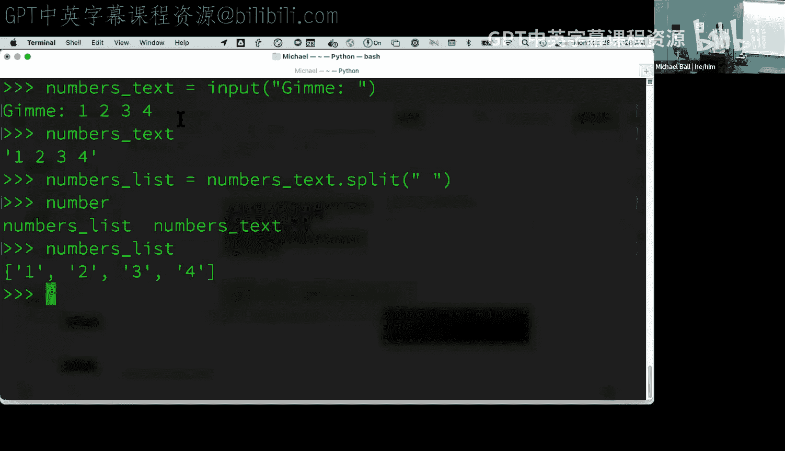

`numbers_text.split(" ")`意味着这是一个作用于`numbers_text`值的方法，它接受一个参数来指定如何分割文本，这里就是在引号内传入空格字符。

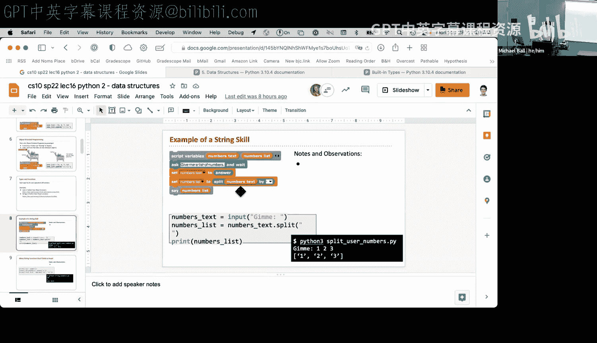

在Python解释器中直接输入变量名会显示其值。如果在文件中运行，你可能需要使用`print(numbers_list)`来输出。

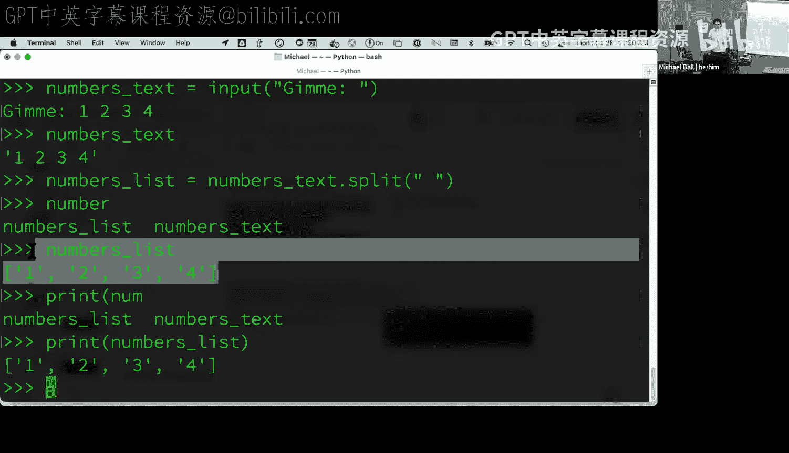

### 核心差异：类型区分

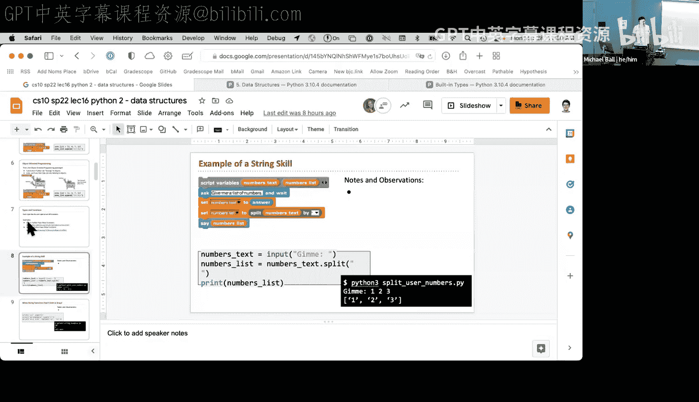

这里Snap!和Python代码功能几乎完全相同。主要区别在于：在Snap!中，数字和字符串可以自动转换，它并不严格区分数字`1`和字符`"1"`。而在Python中，`"1"`是文本，代表字符‘1’，`1`是整数。这是两者间一个重要的区别。

除此之外，如果使用脚本变量，这里展示的代码是基本等价的。Snap!中的`answer`是一个特殊的全局变量，而Python中没有直接对应的东西。

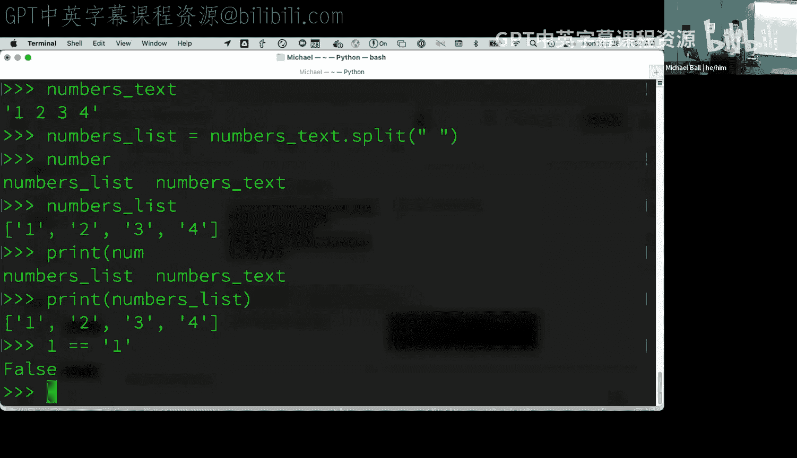

---

## 更多字符串方法示例 🆙

还有一些例子在Snap!中并非自动内置，但你可以选择自己编写。这些例子展示了拥有数百万用户使用的编程语言的优势：许多功能会被构建出来。

对于字符串，文档列出了许多可用的方法。这里仅举几例：
*   `upper()`: 将所有小写字母转为大写。
*   `count(‘a’)`: 计算字符串中某个字符（如‘a’）出现的次数。

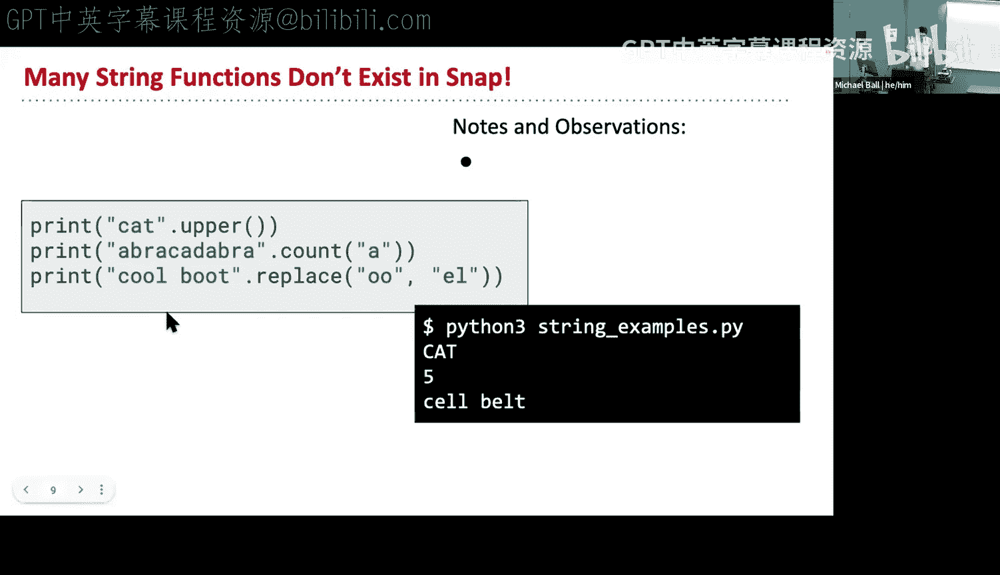


另一个有用的操作是：如何将列表中的元素连接成一个字符串？在Snap!中，我们使用`join`积木块。


在Python中，有一个名为`join`的函数，但它的使用方式有点特别。`join`是一个属于字符串对象的方法。

你需要这样思考：`separator.join(list)`。分隔符字符串调用`join`方法，将要连接的列表作为参数传入。这意味着：“用这个分隔符去连接列表中的各项”。

例如：
```python
", ".join(some_list)
```
输出会是类似 `"apple, banana, cow"` 的字符串。

这两种方式都产生了相同的结果，但它们以略微不同的方式解决问题。有时，当我们从Snap!翻译到Python时，需要思考在Python环境中是否存在更好的实现方式。

---

## Python的强大工具：列表推导式 ⚡

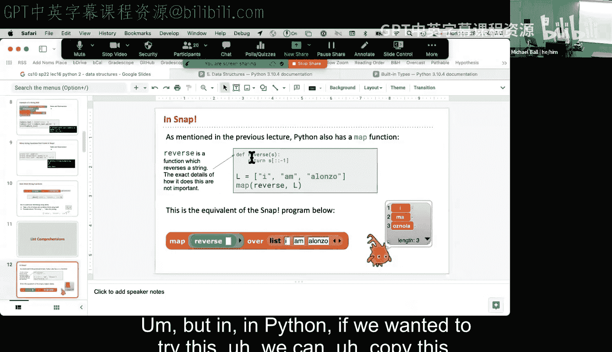

接下来我们将探讨Python中一个相对独特但非常强大的概念：**列表推导式**。它与Snap!中的`map`和`keep`（`filter`）思想有联系，但在Python中以不同的格式呈现。

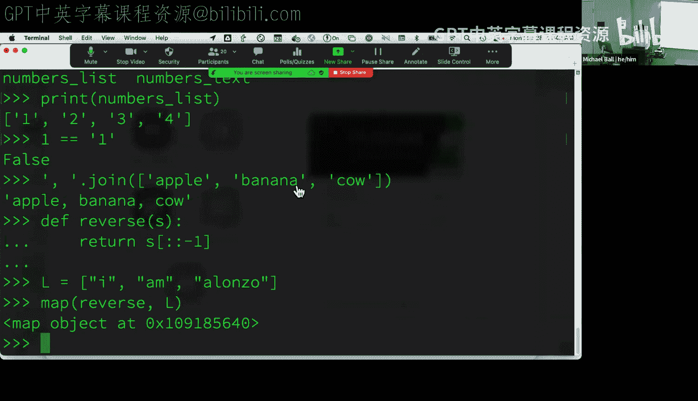

在介绍列表推导式之前，我们先看看`map`在Python中如何工作。

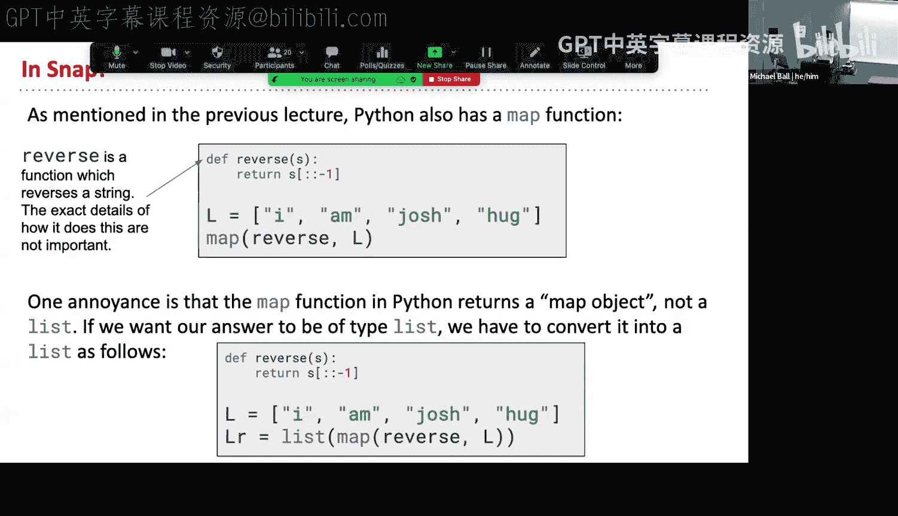

### Python中的 Map

在Python中，我们可以定义一个函数，例如`reverse`，用于反转字符串。然后我们可以使用`map`函数将这个`reverse`函数作用于列表的每一项。

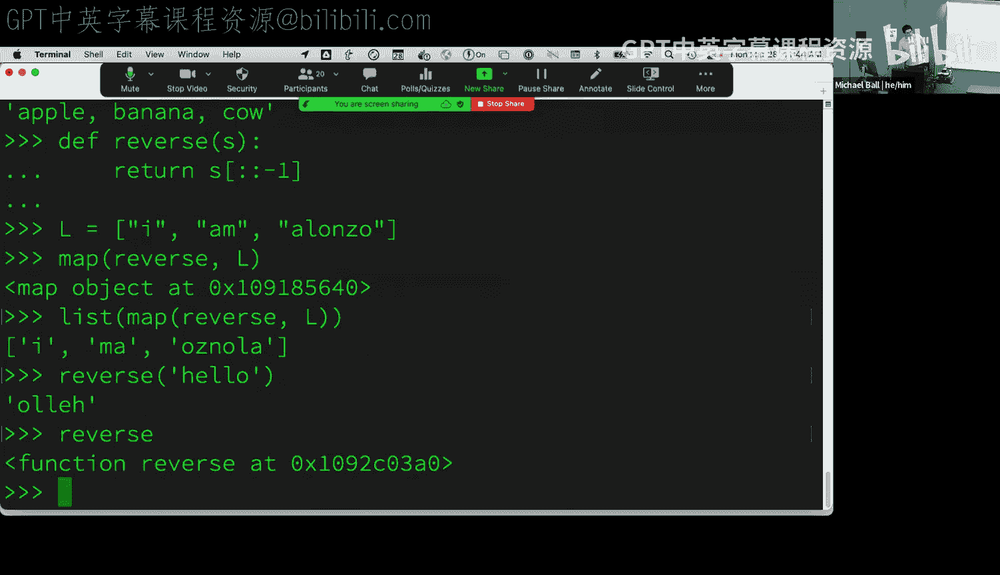

在Snap!中，我们使用`map`积木块。

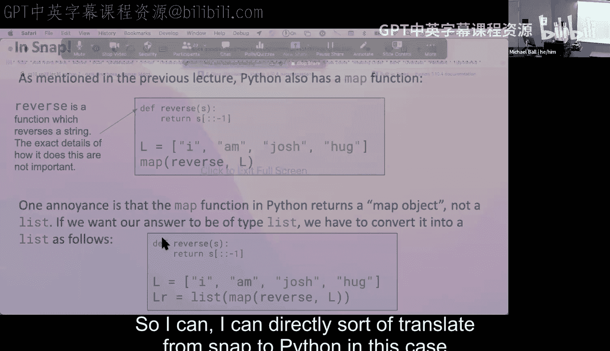


在Python中：
```python
map(reverse, L)
```
这里`reverse`是函数名（不加括号），类似于Snap!中的灰色光环。然而，Python的`map`函数返回一个叫做“map对象”的东西。这是Python为了高效而设计的特性：它不会立即计算结果，只在需要时才计算。

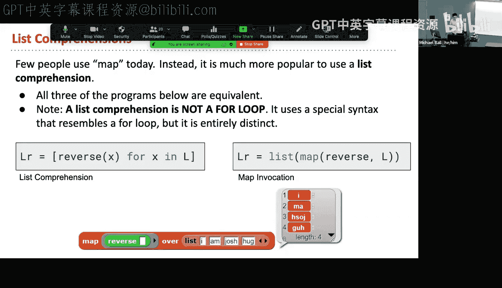

因此，要看到结果，我们需要显式地将其转换为列表：
```python
list(map(reverse, L))
```
这样就能得到和Snap!中完全相同的结果。从一对一对比来看，需要多做一步转换工作。

### 引入列表推导式

但在Python中，更常见的做法是使用**列表推导式**。这是一种无需显式赋值新变量或编写完整`for`循环，就能将数据转换为新列表的特殊方式，也是Python中的首选风格。

其语法如下：
```python
[reverse(x) for x in L]
```
方括号在Python中表示列表。在方括号内，我们写 `reverse(x) for x in L`，其中`L`是我们的列表，`x`类似于常规`for`循环中的迭代变量。

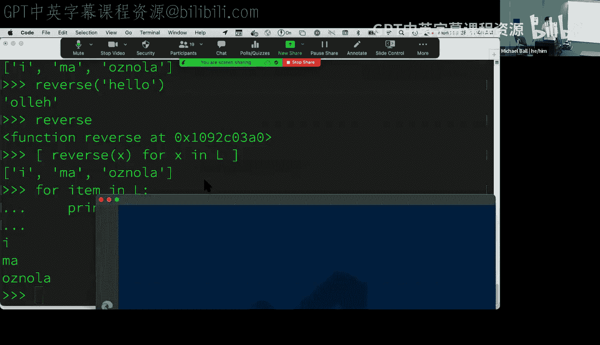

Python会执行这个表达式并返回一个新列表，其中每个元素都是原列表中对应元素经过`reverse`函数处理后的结果。

你可以这样理解：如果不返回列表，你可能会写一个`for`循环：
```python
for item in L:
    print(reverse(item))
```
列表推导式并不完全等同于一个完整的循环，Python在幕后做了不同的事情，但这不重要。重要的是，在Python中这个工具存在，并且它实现了与`map`相同的目标，只是方式略有不同。它不使用高阶函数，也不产生map对象，而是动态地使用方括号语法创建并返回列表。

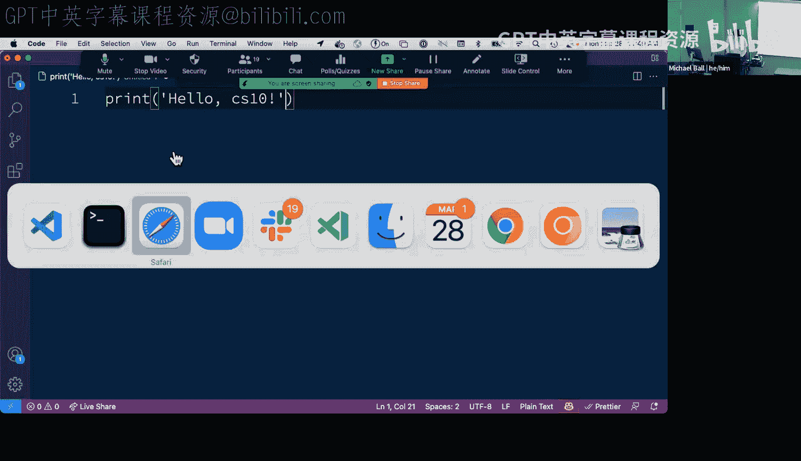

### 列表推导式与 Filter

Python将`map`和`filter`的思想进行了扩展。`filter`是Python内置的另一个函数，类似于Snap!中的`keep`。

在Snap!中，我们使用`keep`积木块来保留满足条件的项。


在Python中：
```python
filter(longer_than_two, L)
```
然后可以再`map reverse`。同样，为了看到结果，需要转换为列表。

但Python也将列表推导式的概念进行了扩展，支持在表达式中加入条件。语法如下：
```python
[reverse(x) for x in L if len(x) > 2]
```
这将只对长度大于2的项进行反转操作。

如果只想过滤而不映射，列表推导式也可以做到：
```python
[x for x in L if len(x) > 2]
```
这等价于只使用`filter`或Snap!中的`keep`。

列表推导式是Python中一个超级有用且重要的特性，其语法是该语言特有的。它主要用于列表类数据。

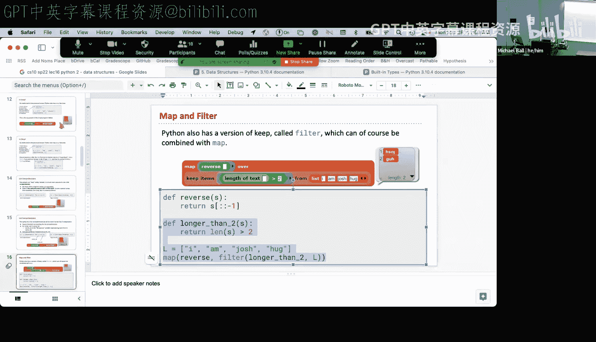

---

## 编程语言的习惯用法 💬

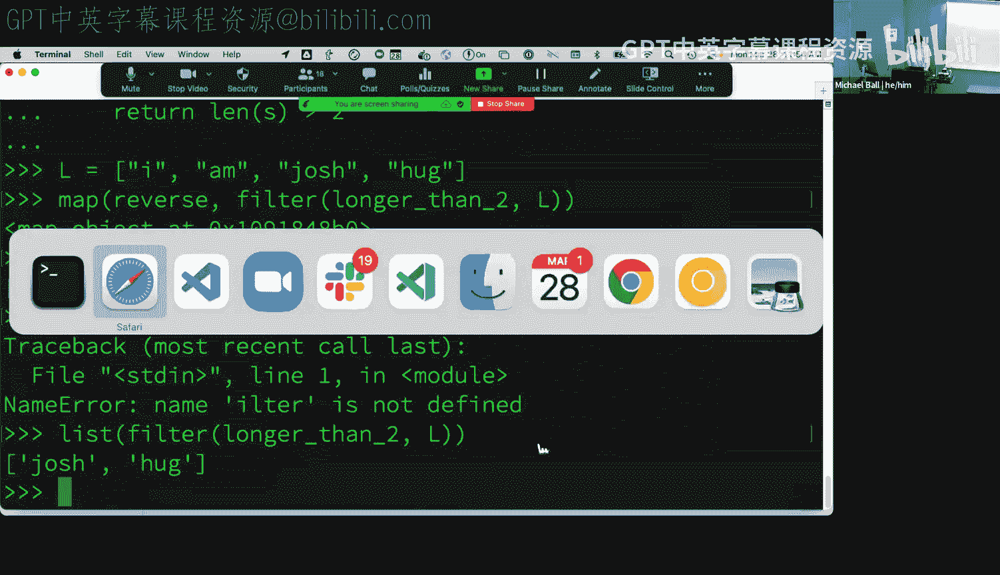

我们最后要谈的一点是，这被称为编程语言中的**习惯用法**。每种编程语言除了拥有范式（如函数式、命令式、面向对象）外，还有代表其特定风格的习惯用法。

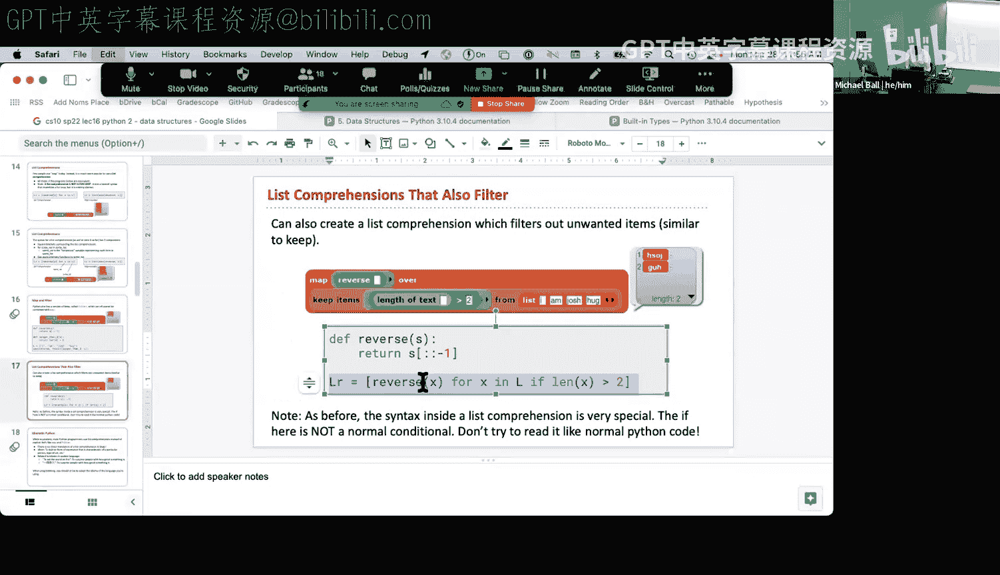

我们可以将其类比于口语中的习语。例如，“set the world on fire”形容某事迅速传播，我们并不是字面意思要点燃世界。每种语言都有习语，翻译它们是一项特定的任务。

我们想要展示的目标之一是：当用一种特定语言编程时，并非总是存在从A到B的完全直接翻译，通常存在多种正确的实现方式。这就是编程语言习惯用法的体现。

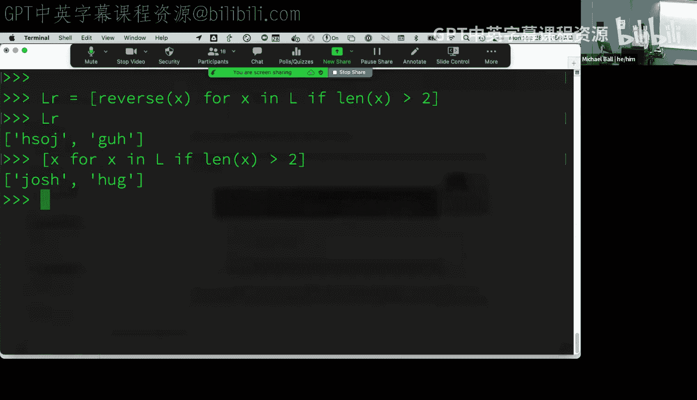

---

## 总结与预告 📝

本节课我们一起学习了：
*   Python中面向对象编程的思想，特别是如何通过方法（如`list.append()`, `str.split()`）操作对象。
*   如何利用Python丰富的文档资源来学习和查找功能。
*   Python中强大的**列表推导式**，它提供了一种简洁高效的方式来处理列表的映射和过滤操作，是Python特色的习惯用法。
*   认识到从Snap!翻译到Python时，有时需要寻找更符合Python风格的实现方式，而不仅仅是直接对应。

下节课（周三），我们将深入练习列表的使用，将列表视为可访问的数据序列。如果你在`reverse`函数中看到了`[::-1]`这种冒号和负数的语法，可以在接下来几天研究一下它的工作原理。我们将在周三详细讨论其含义和用法。

谢谢大家！

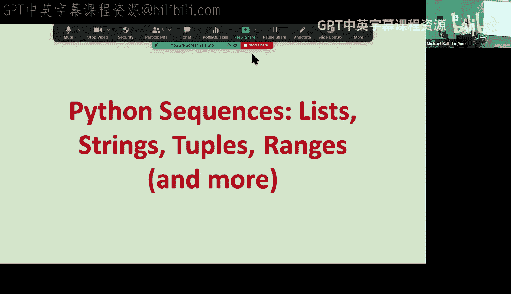

