# UCB《计算之美与乐趣｜CS 10. The Beauty and Joy of Computing 2022 spring》中英字幕 p18 CS10 Sp22 Lecture 18 (Apr 4).zh_en -BV1BokLBmEKE_p18-

没。

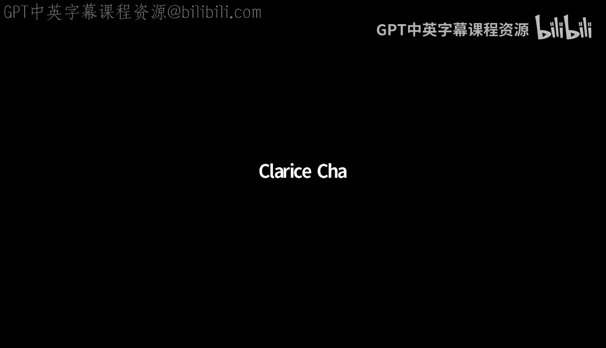

好。是。

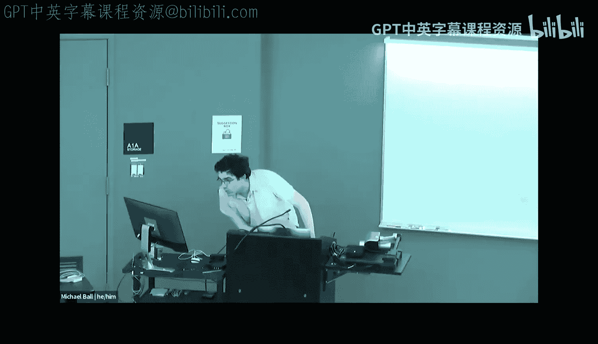

。嗯。

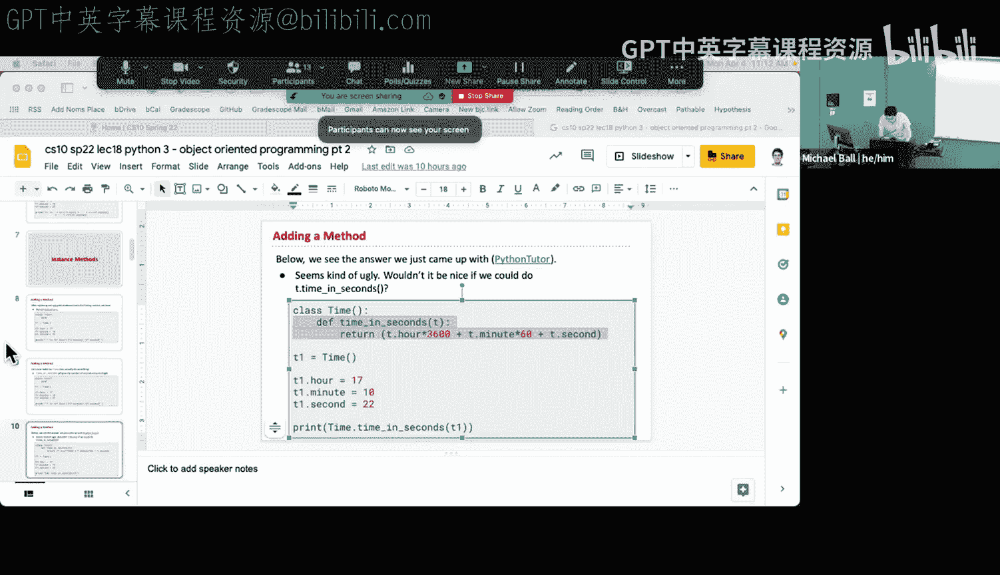

Yeah。嗯。不。All right， so I realized a couple minutes ago that the CS10 website did not get updated before lecture。

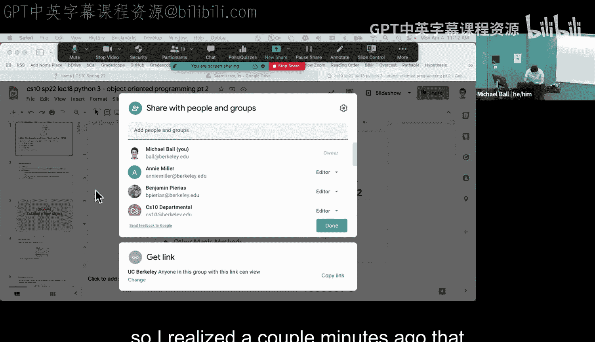

I will make sure that's done after lecture。If anyone is in the room。

And would like to access the slides。You can go to yelke。com/ than TN to get the link for today。

 but they'll be up on the website afterwards so yelke。com slash than。Well， should redirect。

Other than that。呃。What we'll do today is continue with object R programming so we'll get through hopefully most of this today and then on Wednesday。

We will either continue up if we get through most of our return program today then on Wednesday we'll have social implications。

 if not we'll reorder that and do some miscellaneous python stuff beforehand。

 but what we're basically going to be doing for the next couple weeks is wrapping up the intro to Python。

Wwhich is a pretty fast intro and then just kind of doing some interesting things relating to the study of computer science。

 so some social implications work， some things about sort of what are the limits of computer science as a field。

 not just like what are the limits of today， but what are some theoretical limits perhaps to computing。

Before we get into that big reminder， though is。For your final projects， oh yes， thank you。

 sorry about that。To please make sure that you have submitted your final project proposal is doing Grcope。

 if you need， or if you did not get a chance to submit it I believe you can still do a late submission。

 but the most important thing is that there were a rejoin in or rejoin links sent over Ed so that you can sign up for a time with your lab TA。

Basically， what you should all be doing is making sure that you have a short meeting with your project group and your lab TA to talk about the feasibility of your final project。

If you didn't get a chance to do that， I believe the link should still be open today on Ed it was technically due a couple days ago。

 but we really want to make sure that everyone is meeting with their TA so that you can get some feedback mostly on what is feasible about your final project this is worth a few points of the overall final project grade so if you don't do it now you basically can't get those points back and if for whatever reason you can't meet please just talk with your TA in lab and try and make sure that we all aware of what's going on。

But that's you know that's the main thing about the upon project and right now it's really about scoping out what you can do you know making sure that you have something that you want to work on in a couple weeks for the end of the semester the main。

The main homework assignment is homework three is is the intro to Python and a translation assignment。

So we updated this spec last night the submission links are now open on gradecope it's again the point here is to read through the part one is really about reading through some Python reading through some snap the directions give you everything that you need to run the project yourself to go through run the test cases and so on part two is relating to practicing with some object orient programming in Python so the stuff that we do and the next you 45 minutes or so。

We'll lead into that so here's where he left off last week。

We created a class called time with just the name class time right now it has this body of the class has pass。

 but that's just so that we can start to fill it out whenever we create a class。

We create a new type of data in Python， so remember that in Python we really care about the types of each of our objects。

 so this thing T1 now has a type。Which is a time object so it's not an in it's not a floatat it's not just some boring object it is a new thing called type called time and that is one of the advantages of creating our own classes is that we get to say this thing has a type of time i'm going to treat it as an entity。

And so on and what we started doing was assigning attributes to our time object。

 so our time in this slide now has three attributes that it knows about we call these instance attributes because they're unique to this thing T1 and so T1 has an hour a minute and a second。

Which are just three properties that we've decided this thing should have so that's where left things last week what we're going to do today is start to build out some functionality so our time object is a useful thing it has these properties。

But what we want to do now is say， you know， what if。What if we want to do something like？

Calculate some properties about about the time so we're going to you know sort of think about a couple things that are theoretically useful for a time instance to have and the first thing that we're going to do is say what if I want to know the time as a in representation which is the total number of seconds so given some time in a day。

That our time object represents how many seconds into the day does this time represent and this is one of those things where。

For now you're going to trust me that this is sort of a useful thing that we might want to know at a time if you continue working on other programming systems and other projects you'll actually find that like converting hours minutes and seconds something that humans understand to a pure numeric format like a number of seconds is a pretty common problem and so many tools in python is's actually built in functions to do this of course but today we're going to explore sort of what it's like to build our own thing so we want this method time and seconds and it's going to give us the number of seconds since midnight。

And so what does this look like？Well， the important thing here。It's actually is we sort of just。呃。

Think about how we might want to use this method so it belongs to the class time。

this method called time seconds is going to say timing seconds of what some object named T。

And how do we convert hours minute seconds to a raw number of seconds。

 we say t number of hours times 3600 so that is there's 3600 seconds in an hour。

 which is just 60 times 60 plus the number of minutes time 60 so there's 60 seconds in one minute plus the number of seconds that our time has been set and so in this example what we have is t has a bunch of different properties right has an hour。

A minute and a second and in our function called time and seconds。

 we can access those attributes of T and we can call this a couple different ways。So if I。

If I hop back over to our。

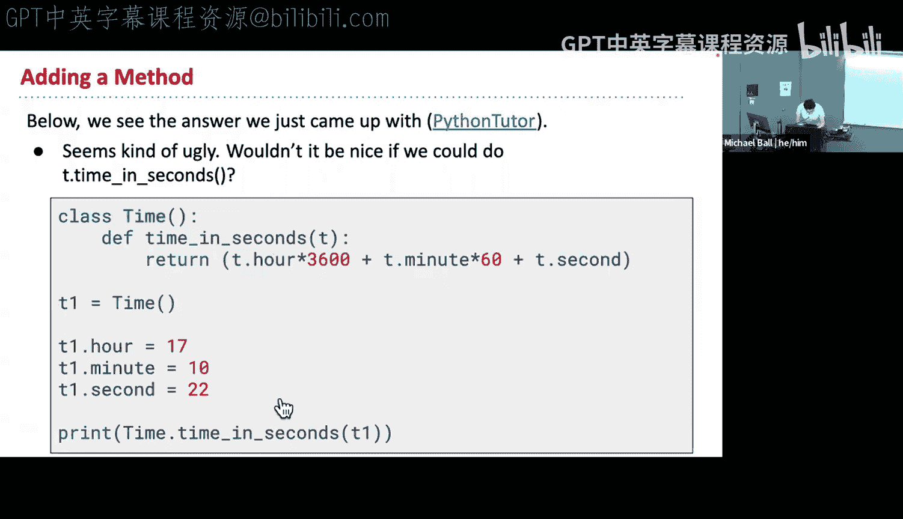

File， what we can actually do。Let's jumping ahead just a second。

So we're going to call this time dot time。In seconds of T1。

We're going to jump back down to the terminal。Run this and of course。

 having a typo leads to an error message。Let's try that again cool so time that time and seconds of T1。

 what we have here， we have a method。Called time and seconds that exists。

On our as a part of our time class。So to get to that， I say time time and seconds。

And then what I pass in， I pass in something for the value T coming out and then。I。

And then what I get back is the result of that function。

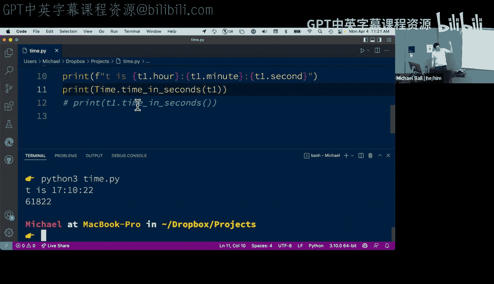

over here that's that's our first instance method this thing is a method which operates on a particular instance of a class the problem is though the way that we actually first called this method is totally valid in a sense it's valid python but it's not the most natural way and so。

What we actually probably want to do。

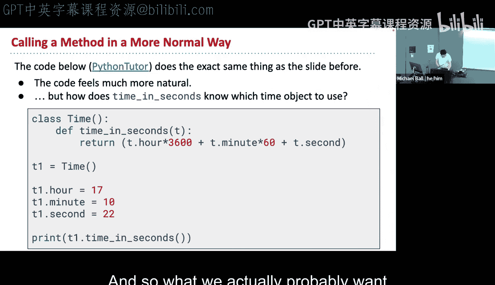

Is。嗯。Is try this second method here， which is what Python。呃。

Sort of wants us to or the way that object training programming wants us to work is to think about。

I have some class or I have some object called T1， this is an instance of the time class and that time class has a method called time and seconds and so if I say T1 dot time in seconds。

😡，What do I get back is I get back the results of that method and now that I change the file I can save it and run it again。

 of course， it's hard to show that this sort of you you just have to trust that this is the same method written two ways we get the same exact result back。

And so an instance method is this thing that is sort of the heart of object running programming it is a function which gets applied to the properties。

Of our time object， so T1。

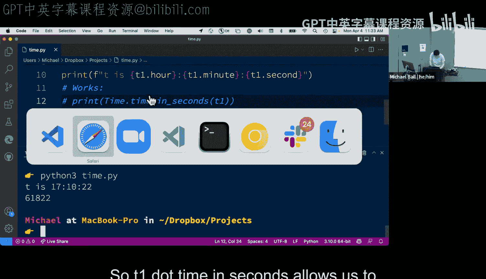

Okay。T1。 time and seconds allows us to access the properties of。Of of our instance。

 what's really nice about this is that you may be looking at something here noticing that when we call t1。

time in seconds， we don't pass an argument into this function。

 but time and seconds still takes in some argument T and if you've been following this model look like my functions's got one argument I pass in one argument now my functions still got one argument I pass in no argument。

 what's happening might seem a little bit weird， well what Python knows how to do when we deal with object drain programming is if I say。

Some instance dot some method， that instance automatically becomes the first argument to a method and Python has a bunch of stuff behind the scenes built in to make this a really natural way。

Of programming it and so the first argument in this case is automatically filled in this is something that Python does for us。

It's sort of part of the trick of what makes object oriented programming a nice and useful sort of tool before I continue on any questions on this example of what time and seconds is doing。

Questions on Zoom。Yeah， good， so these methods like further similar they much like just different ways of doing the same thing。

Yeah so they are they're calling the same method so it's we're always calling in this case time time and seconds。

 there are two different ways of writing the same function call essentially the first one is accessing our time and seconds method through our time class the second one is accessing that method through the instance of a particular time object so。

this one only works with T1 using it in this way。We pass in t1 as as the area both do work it's generally preferable that you stick to the second style unless you're trying to do something special。

 but the point here is that both of these。Give us the ability to take in some object like in this method we're calling a T short for time and access the properties that exist on that object so this happens to be hours minute second。

 but they could be any properties that are defined on on that object， but yeah good question。

Two equivalent function calls， other questions。So。😊，In Python。

 what we typically do in our objects or in our classes。

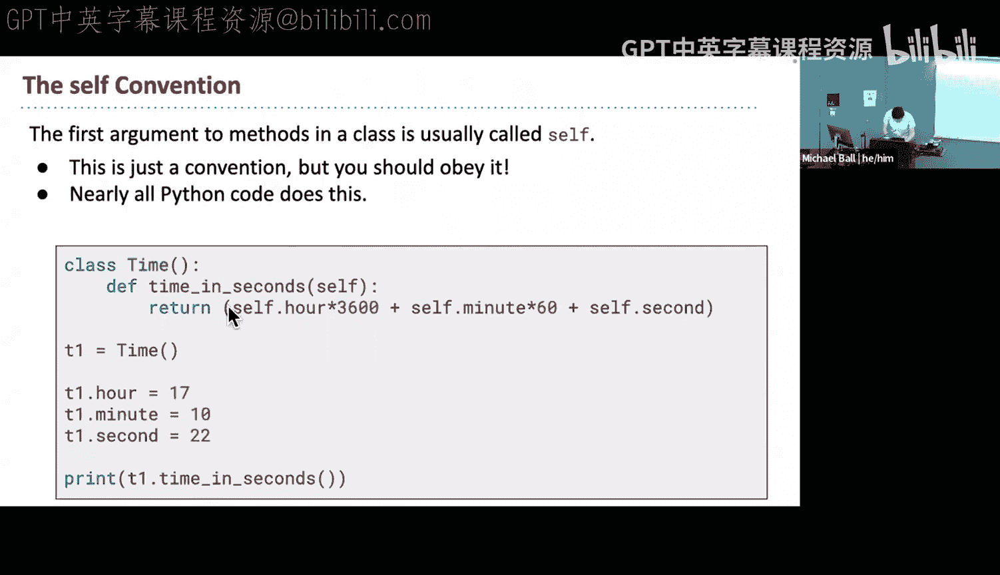

Is this first method？Okay， that's not actually is something that we call self and。

I don't know there's two main things with the letter T。系咩啊。So。

We typically call this first argument itself， and you'll notice that if you actually use an editor like VS code or Adam or sublime or whatever it is。

 most of the syntax highlighting that comes with Python actually tends to special case the keyword self or the name self。

It turns out that self， you'll see all over the place in Python。

 it's not actually that special it's just another name for what object am I currently working with。

 but what this code does tell us is that when you see self when you say time in second self self。

 hour you should be thinking I'm dealing with a particular instance of this class I'm dealing with something that looks like T1。

 it could be T2 or T3 or time1 million or whatever the name of our time object is。

 but if we use the word self what we're telling other programmers is that。This。This thing here。😡。

All right this this self here is always an instance of this time object and and every time we see self we can think about that it's corresponding to the same thing so for the rest of the slides we should be sticking with the name self as our argument again it's just another argument name it's just another way of saying this object with these properties。

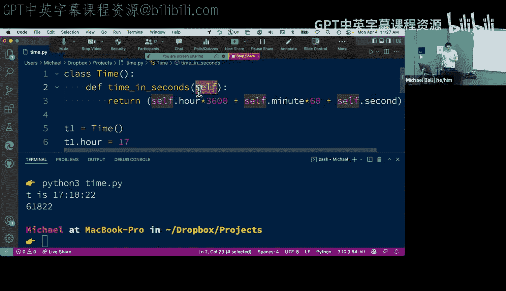

But you see it nearly everywhere in Python and when you stick to work on the assignment。Well。

 you're not going to lose points， of course， if you name something differently。

 I would highly encourage everyone that when you're writing an instance method when the code that we give you。

 the functions should all be set up that the first argument itself。

 but just always translate self to my current instance of the object and don't necessarily try and rename that variable。

So。What I've been using is。嗯。Is this term instance methods and what we mean by this is just an instance method is any function that works on the particular data of a particular object so I have one T1 is one instance of the time class and the instance method is a function that operates on that instance。

We call them instance methods to distinguish them from things that operate on the time class itself。

 which we're not really going to do， but we'll have a little example towards the end and we call them methods just to say that these are another function which gets used in a particular way but。

You a method is just another name for a function， it's just sort of the language of object render programming that that the world has has decided on so if I say instance methods。

These are functions like any other function they have arguments that can return some data each function。

You know， works the same way， but in this time they apply to a。

A particularit instance so in this one thing to remember is when we're dealing with classes just like the body of our function is all the code that belongs to this time class needs to be indented within our time class so。

Let's say that I have a this method time and seconds， it's indented for spaces into our time class。

 I could write some method calledAfter which takes in some argument t。

 it checks t to hour is greater than or equal to 12。And in this case， what we have is。

A method or a function sometimes people will loosely call it a method but we have a function that takes in a time object it operates on that time object。

 but the way that this is defined here is not a member of our class and so it's just a normal regular function in Python all right sometimes this is useful but if you want it to if you want to use the syntax where we say T1 afternoon this wouldn't work because this thing is not a member of this class time and this is one of those things about Python code that。

Is a little bit subtle first but is true of many programming languages is that the indentation here again really does matter right that just because this comes below the word time in our file does not automatically mean what we're dealing with is a part of our time class we would need to actually sort of indent this you could imagine sort of physically that if you drew like a line along the side of yes some printed out paper that things that are within the line to the right of it are members of the class things that are outside of that line or not and so that's just one one gotcha to be aware of。

So moving around along for today， what you might have noticed is that。When we make a new time object。

 we say t1 equals time， sort of like another function call。

And then we immediately assign three lines of code we say hour T dot minute and T dot second this works pretty well。

But it turns out that if I'm making a time object， I probably want to know what hour minute and second my time is right away。

😡，Right after I this first line of t do1 I have a time object。

 but it has no properties that has no information about what time it is and so what we can do。

Is define a special method。That we call a constructor and what this allows us to do is simplify a bunch of the setup that happens with our time class so our goal history to write something like this t1 equals time。

Again， capital T because this is a class 1710 and 22 so these same。Exact。Kinds of data。So new。嗯。

Actually， what I'm going to do。Copy on this。

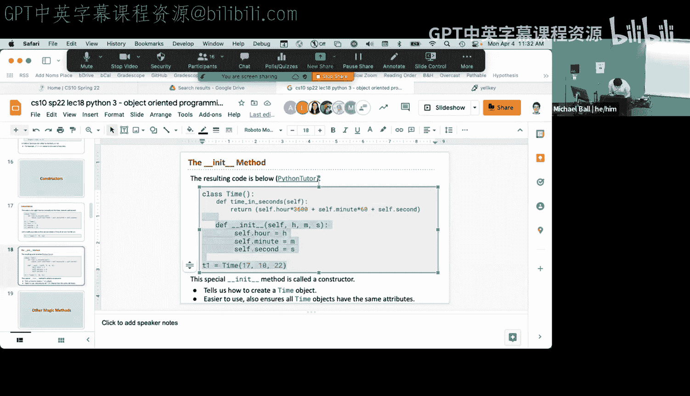

So in our file here。What we have now is a method called in it。It has by first argument again。

 this thing will be self the funny name of this init method for initialization。

Is these are two underscores， so underscore underscore in it， underscore underscore。

We'll look at some other examples of Python's kind of funny syntax， the argument itself。

And three additional arguments， hours， minutes and seconds。And。The way that we call this。Is。

We now say t1 is equal to time， same three values 17， 10 and 22， so I'm going to run this。

And what we get back is a working file。Where？We have our our same three properties。

 So now we have T1 still an object with our minute and second。

 but what we can do is declare our instance of time。

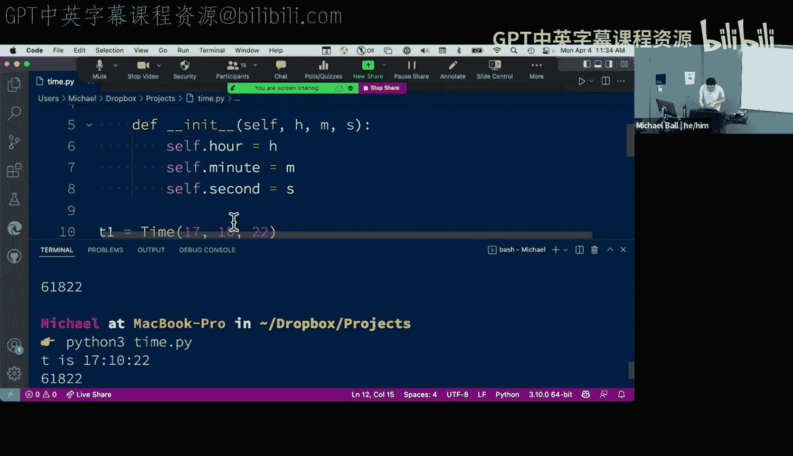

In。

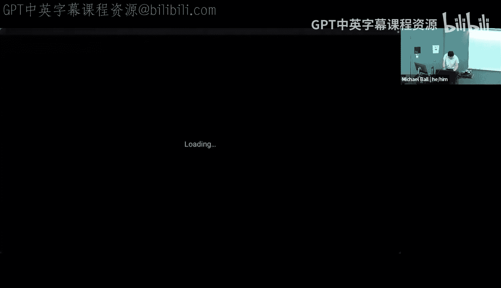

In one go。And so what's happening here？This。When we make a new instance of our method。

 Python has a special method called in it。And this is where things get a little bit less obvious when it comes to how this keyword or this thing self works out is。

T1。Equals time。Python behind the scenes automatically goes through。

 makes this time object called that we're going to call self。😡。

And then the rest of our arguments so arguments at two。

 three and four in this function right here correspond to arguments one to and three inside our in method and so whenever something has the word self as the first argument。

 you can kind of think of this as it looks like it's four arguments but this function really takes in three pieces of data。

 Python makes a time object and right inside our init method we can start to assign and access whatever data we want about our class so this is where we now set up our three attributes our minute and second。

But we do this sort of in one go， all nice and tidy within one one method， yeah。

 questions about how this example works。Questions from anyone in the room were on Zoom？Yeah。

 red funny so the bottom line yeah。Yeah， so this is just saying I'm going to make a t1 of 1 17 hours the day10 minutes and 22 seconds whatever arguments your function or your class will take that those could vary but typically what we'll see is some kind of constructor that looks like this we make some object this thing is a time with whatever properties it takes and then there's another question yeah not like abstract yeah they're definitely a type of abstraction constructors are。

Constructors， I would say。Are the primary interface to a particular type of object all the methods。

that this object contains right like time and seconds。

 you might have one that if this is we had sort of the afternoon example right。

 you might have early in the morning， late in the morning before after sunrise。

 you could imagine all sorts of things that you would want to do with a time。

Objects you could add in subtract times potentially all those things are part of that interface as well。

 but what I'd say is the constructor method sort of sets up what are the things that we want to think about as being the primary attributes or ideas that at this time cost knows about so in this case it's hours minutes and seconds you can build constructors in all sorts of different ways and we'll show you over time just some additional tricks that others python objects use so。

These things like in it。Python calls them magic methods and。We're not going to get into it。

 but the word magic is sort of this thing， this term used in Python and other programming languages for just something that happens automatically for you it sort of it works like magic is the idea。

And so just by saying underscore， underscore in it， underscore underscore。

 which you should never read out that way because it's a mouthful。

We get the special property of having an initialization method that。That does this work for us。

 but there's lots of other types of magic methods that exist in Python and actually if we go open this link。

呃。We can see。Let's see so Python also calls some special method names magic method is sort of what most people call them。

But you can go through this link and see that there's like a whole bunch of things。

A stirR method for printing things out in a special way。

 we'll look at some of these less than less than or equal equal not equal。

 you'll learn about hashes if you take C61b。But there are tons of additional methods that Python。

Let lets you write and modify。That give you control over the behavior of this object so in lists when we use square brackets to access and slice items of a list that actually corresponds to a particular magic method that takes in the arguments and and returns a subpart of a list all of the mathematical operators like addition subtraction multiplication division star star for exponents those all correspond to magic methods so you could start to build a class。

That really feels like it does something you know sort of more natural so to speak。

 the lists in Python， those are all implemented in Python with special magic methods so that if you want length of a list that actually corresponds to some magic method that's defined in a lista today。

 we're going to look at two specific examples， one called stirR and one called less than or LT。

And so what we're going to do is。Take our format string from earlier and turn it into this method called STR。

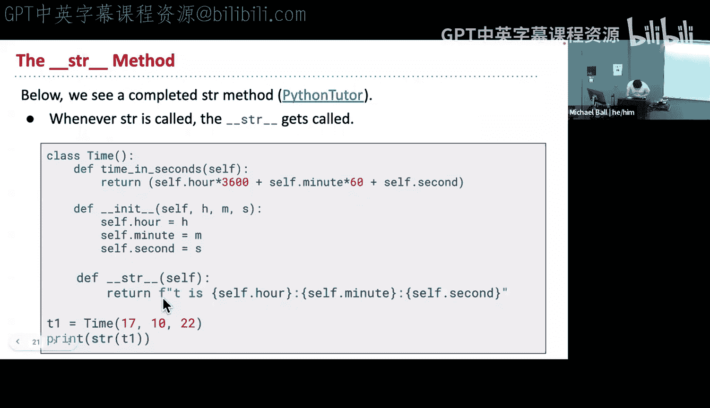

So。And what's really funny is。So that's visual Studio code has this nice autocompte solution and it kind of。

Thinks it knows。Knows what we want to do and sometimes it's pretty good。

 but not always so we're going to return。

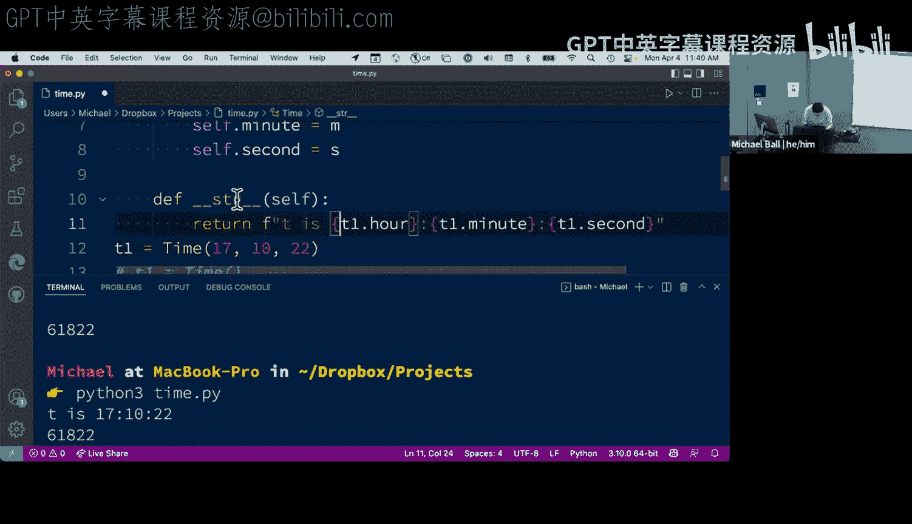

The string T， let's see what do we see on the slides？We you said， yeah， T is and then。

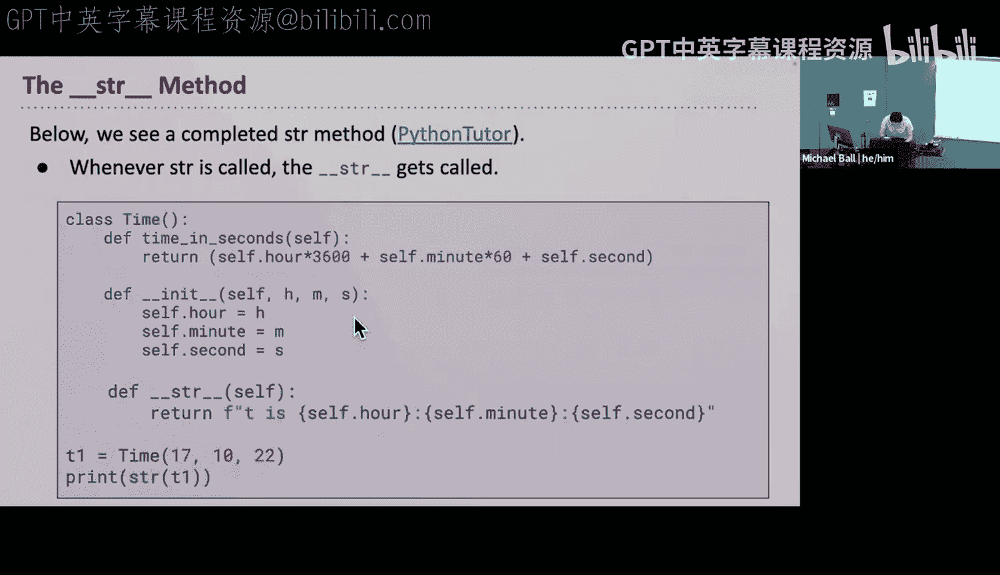

So instead of T1。Of course， we want these things to be self hour minute second。

Give ourselves some extra space。And now， instead of this method。We can print。

IfI type print correctly stir。FT王。So now if I save this file。嗯。

I could do this and we can even verify， you， I could say print。Dircle。

Probably would not want to do this， but inside your magic method you could customize the behavior so let's say every time you print something you want to write some additional info you could technically add add a line to tell us that something is called so what is what does this do well you might have guessed that this method or this global function called St。

No wonder scores here， right， this is just a function stir。

That takes in an argument key1 and you remember last week we saw some conversion between types of numbers to streams so that we could add them together this is the same stir function it just now corresponds to。

The special method called STR that is now defined for an instance of our time objects。

 and this is how a lot of objects in Python， both the ones that are built into Python and the ones that you create yourself will work。

And what we should be able to do。IsLet me see if this will work。行。I did that。Okay right， okay， yeah。

 all right commented that， Okay， so what's also really cool is that。

If if I were to remove that stir colon just say print of T1 our print function in Python says you probably want to print something that looks like a string style object and so the print function in python automatically goes through and tries to call the stir method on an object and so what you'll see is a lot of objects in python define custom methods like stir that make them feel a little bit more natural to work with so if I say print key1。

I get some kind of data that makes sense if I were to comment out。This method。

And I wanted to save this and run it again printing T1 of course still works。

 it's an object it can print something， but without a custom stir method I get this main dot time object at some you this is actually a what you call memory address sort of where Python has stored the object and its memory moderately useful if you're like really in the weeds。

 but kind of annoying doesn't really tell you much human useful information about our time object。

So the STR method lets us。呃。Lets us go through and print some nice so nicely format our time object questions about the special ST method。

嗯。So。

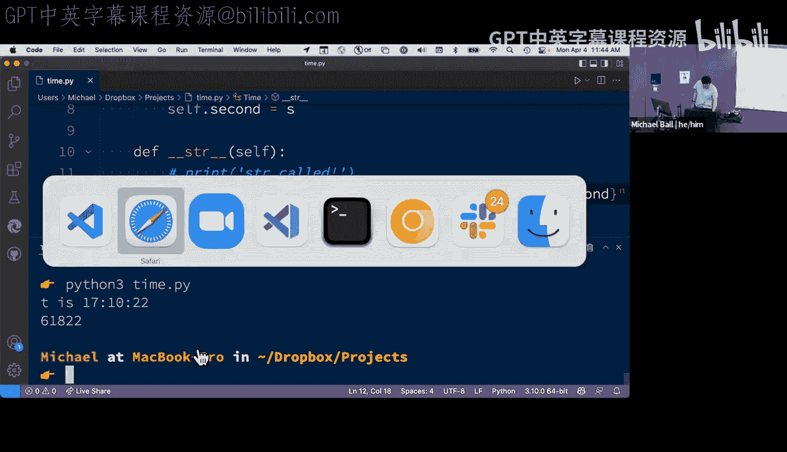

So in Python， there's a whole bunch of and so this is just calling T1 in print directly like I just did。

There's a whole bunch of these special methods and the goal is not necessarily at all to ever memorize。

The list of special methods over time， if you work with Python。

 you'll build a sense of what you need to use regularly。

 but I certainly can't tell you what the name for each kind of operation is。

But what other example that we might see with an object is。

to say how do I compare two different time objects together so you could imagine and we'll lead up to this example that between two scenarios where I have two time objects that I know want to new which comes earlier in the day than one another if。

If I'm working on a website， and let's say this is like a class scheduling website， right？

Our schedules would have a bunch of time objects。And then I need to say。

 let's sort these in a particular order such that our calendar looks。

And so what we're going to do is say is the time T1 less than some time T2 or we could sort this some other way in this case we're going to focus just on the less than method。

And what I'm actually going to do。Is。啊。I will first。copypy this code。

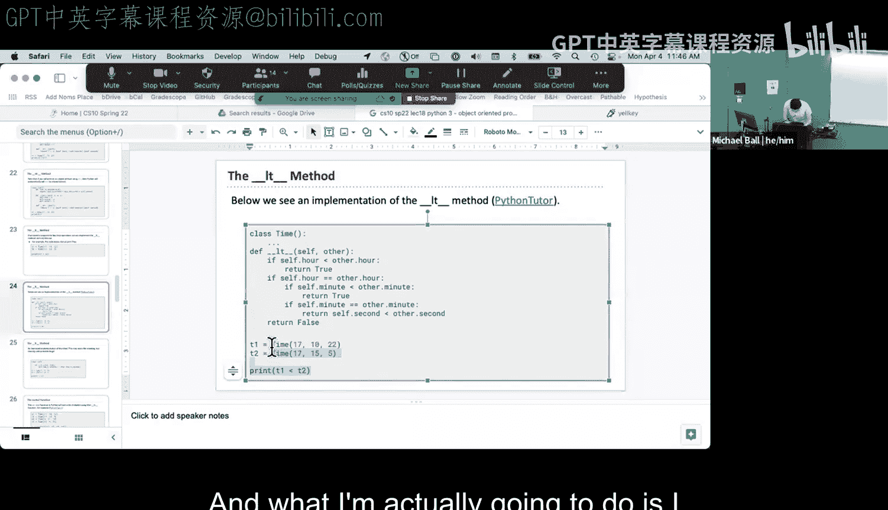

To our class。And we need to con this all on additional level。All right， so。Let's run this。Python。

 we're comparing two time objects， T1 at 17 hours， 10 minutes and 12 seconds to T2 at 17 hours。

 15 minutes and five seconds。So 10 minutes is earlier in the hour than 15 minutes right so T1 is less than T2 which sort of means it comes before in this comparison and so when I write T1 is less than T2。

What do I get out of this is I get this lesson than operator which if I didn't define a new special method Python wouldn't know what to do with it right how do we compare two objects with sort of an infinite possibility of attributes to one another and so what we've defined here。

Is is this time new don't want that is this time method less than and so how do we compare if one time is less than another when we look at each of their their attributes。

And this is not necessarily the cleanest version of this method。

 but I think it's something that if you read the the logic， you can get a sense for right。

 is my current hour less than some other hour return true。All right， if。If the hours are the same。

 then I compare the minutes and if the minutes are the same then I compare the seconds in this case what we have now is with the special method less than is we have something that's pretty interesting is we have self on。

Veryrry so。So got battery。What we have is two arguments， we have self。

And other and what's really neat about the way that Python works。

Is Python recognizes that T1 less than T2。This says let me find the method less than on T1。

 the first argument come on the first argument becomes this method self。

 the second argument becomes the thing on the right hand side of our expression T2 right here。

And that becomes the name other again， in this case。

The name other is just any other variable name and it's not particularly special。

 but again this is a pretty common pattern， self and other if we're making a comparison just that we are aware of which object is which。

And so。

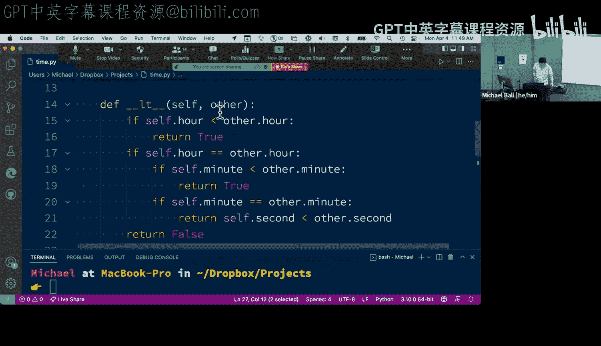

This is a sort of special comparison method that Python。No wrong。嗯。Gives us and。

I'm not going to run through all of this。But let's see， let's go back。

Let's say a few different steps， so in Python tutor。Which I haven't been running through that much。

 but the links are on the slides in Python Tutor it will show you the setup for each of our instances of our time class so we have T1 and T2 over here。

And it will show us that when we call a method like less than。

Self points to the same thing that T1 is， and our name other points to the same instance at time。

That。That is T2 and in our code we could step through this sort of line by line。

And we could go through one line at a time comparing the fact that okay， T1 or selfta hour。

It's not less than other dot hour so we don't return true these are equal to each other so the next line that we look at is the minutes self dot minute should be less than other dot minute and in that case we see that we go to the next line of reporting to so Python tutor again you could sort of just run through this code line by line if'd like but that's。

That is an instance method that maps to specifically the less than operator notably if we want the greater than operator we'd have to write a different instance method I believe it's just GT and what I'll also show on this slide。

Is。What is kind of nice about something。Like our less than method。

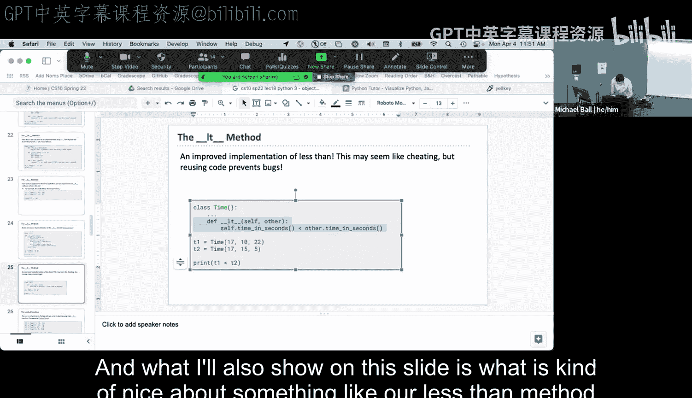

Is。So I'm not going， I'm just going to leave the one that we should find。

 but if we define a method on our object like time and seconds。

One thing that's really nice about decomposing our objects into really useful sort of small little functions is that。

A time that occurs before another time will have fewer seconds since midnight than the second time and so if I wanted to I could also write less than as self and this should actually say return because。

Not returning something that not very useful return self time and seconds less than。

Other thought time and seconds and this is totally valid because this less than right here is comparing two numbers smaller number less than some larger number and this is one of those things which is when you start to build larger programs a really nice thing to look for is that can I reuse some functionality that I already built to make a new slightly different kind of functionality easier to rate and so if you're writing this on your own。

This is a perfect totally valid definition， it's something that if you trace the code line by line works really well。

 but since we have a time and seconds method， we might as well think about using that to make some comparisons。

 so before we go on to look at a couple additional things with opportunity programming any questions about this less than example and how it works。

Yeah， so you have to call it you know the just call it variable yeah so。

There's yes so the question is for those instance do we have to call it this underscore LT and if we want to map to the less than operator so if we want to say。

You know T1 left angle bracket T2 for that we have to use the special method name and does have to map exactly can we build a class though that has its own lesson than method right I could I write something。

Like death。呃。You know， less than。Self。Yeah。Other。Actually that's pretty funny the autocomplete knows exactly how to how to complete that method correctly yes I could write this then I would have to say t1。

 less than T2 whether or not that's right for your particular object really depends on what you're trying to do。

So some people do prefer this style， but I think it's a little bit less common。

 though it definitely sort of depends。

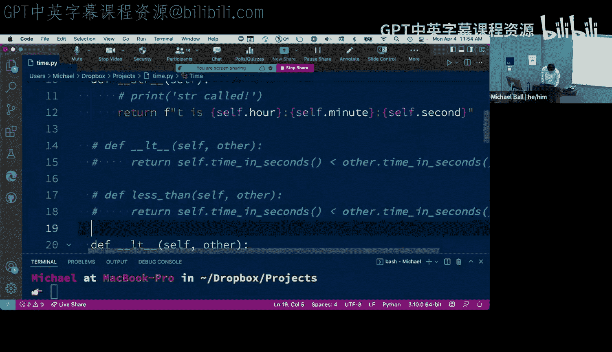

On。On the particular example。嗯。So。Before we go on to a couple other object orientd things。

 what is particularly nice though， and this is something you could only do。

By accessing the or defining the less than method is that。

Python includes this global function called sorted。

 which will take in a list of data and sort them in order from least to greatest it's actually got some additional properties which we may see later。

But。Let's say we have four different time values， and I'm just going to hop right to the end here。

So I don't have to compare。Or step through all of the code， but in our sorted example。

 one of our lines of code compares the values let's scroll over here。

It says is T3 less than T4 or excuse， is T4 less than T3？T3 occurs at hour four。

 T4 occurs at hour 12， so this expression is false。And。What we ask。嗯。What we say is for this list L。

 sort a list of times and let's print the list of times back out。So。Yeah。In this case。

 we have T1 is four or T is whoops， no。Where is myython we have T is 4 2119 T is 12，921。

And what we could see is that these are if we go through all of them， actually sorted in order。

And what's really cool about this is Python Tutor。嗯。

It doesn't show us exactly all of the calls to less than when something's built in。

 but this sortded method that Python gets。Or it gives us that's built in and defined is able to take advantage of the built in。

Properties that we can build into our class。So let's go this way。喂。So， okay。嗯。So。So yeah。

 when we do sorted that's something that we can we can take advantage of of course there's additional methods so less or we can add things together。

 we can compare two times of the same。Using the equals method and again there is that full longer list。

 if you take CS61A or CS61 B， you'll learn how to do this in CS6 toA of course in Python CS6 B。

 you'll learn about similar tools that Java gives you the interface to this kind of functionality is a little bit different but it definitely exists。

So actually， what I will。Yeah， so with just the last couple of minutes。

 we're not going to go through all of us today， but what we've been doing so far is。呃。

I didn't change this slide Okay， what we're doing so far is defining attributes。

And properties that live on each instance of a time so they live on T1 T2。

 whatever we call our our particular instance of time， however， in Python as well as other systems。

 we have these things called class attributes。And a class attribute is this thing that lives not just on a single object。

But is shared across all instances of a time so in this case。

 if I say our class time I could define some attribute called midnight so it equal to zero。

And this will be shared across every single time instance that exists。

We show this mainly to because it can be a slightly useful idea。

 but it's mostly a warning not to put code inside our classes that doesn't apply to a particular instance。

 so this would allow me to say t1。 midnight it would return zero correctly。

But sharing data across classes like this is a pretty dangerous thing to do because it leads to bugs in particular。

Where did the。Example go。All right well why I skippped ahead to my perhaps so what Python will let us do is it'll let us actually say something like t1 dot midnight is equal to zero or some other value Python gives you no protection for class attributes and instant attributes that they have different names so one thing to just be careful of and I'll go through a couple examples of this I think on Wednesday。

Is to make sure that when we're working with classes that as much as possible we stick to all of our data belonging just to a single instance and so we'll look through a couple examples of that on Wednesday there's a couple additional terms that will tidy up and then we'll just go through some other cool cool Python teachers yeah so please do make sure that if you haven't yet that you have signed up that you do go ahead and sign up for a time to meet with your lab Ts to talk about your final project。

And then if you hadn't had a chance to look look at it， homework three。

 the Python translation is out， you should have all the tools you need now to do both parts one and two based on today's lecture and labs from from last week。

 so we'll see you all on Wednesday。Yes。Thanks， everyone。

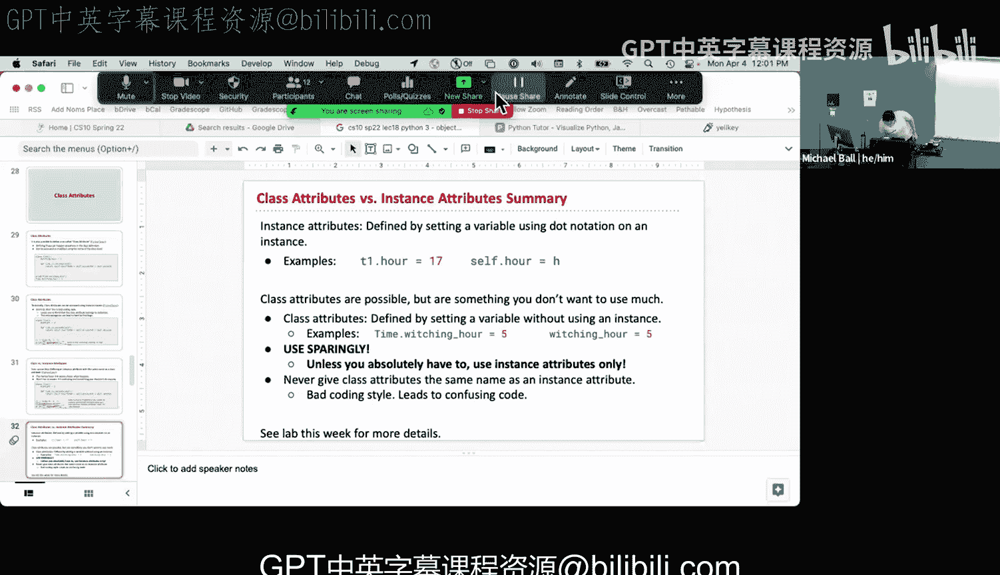

嗯。

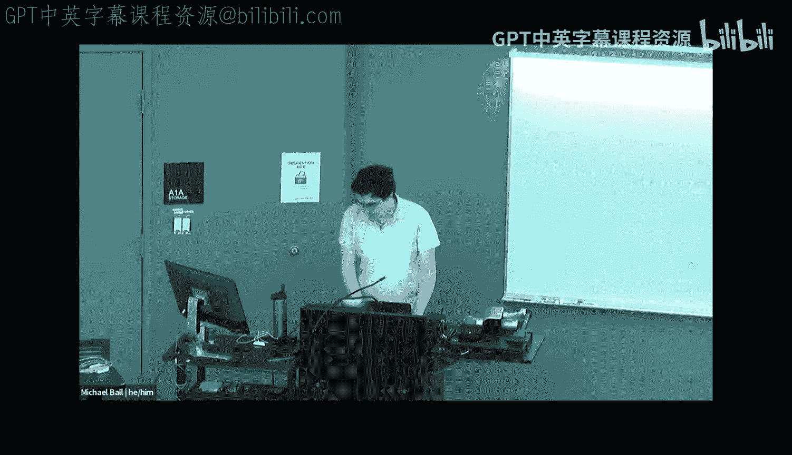