# 计算之美与乐趣：第21讲：并发编程 🚀


在本节课中，我们将要学习**并发编程**的核心概念。并发是指计算机或程序同时处理多个任务的能力。我们将探讨并发的基本思想、它在现代计算中的重要性，以及如何在 Snap! 等编程环境中模拟并发行为。课程最后会介绍阿姆达尔定律，它帮助我们理解并行计算的理论速度极限。

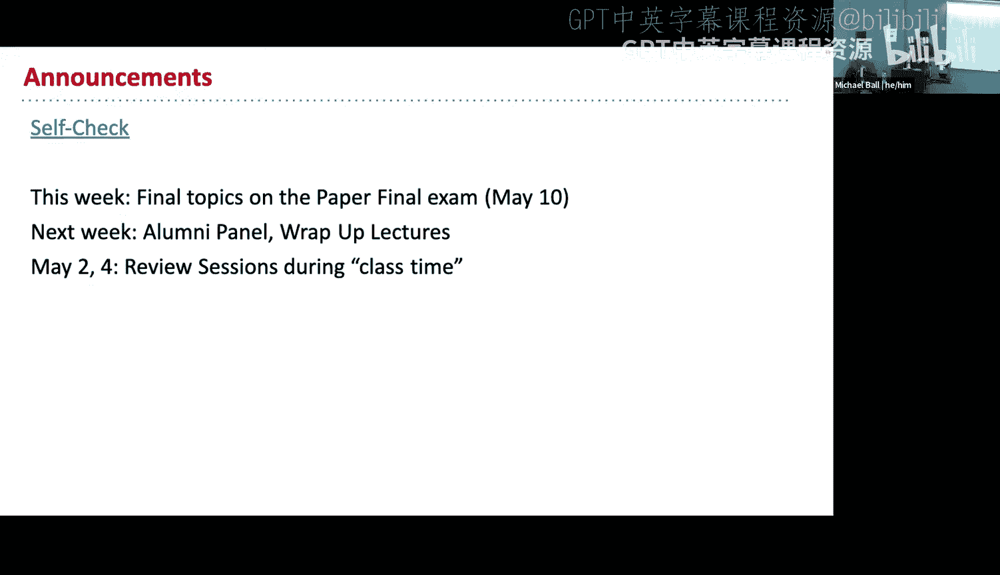

---

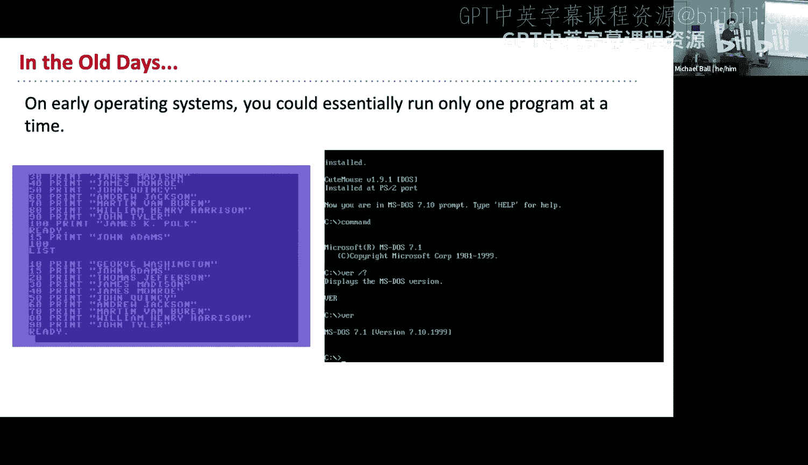

## 什么是并发？🤔

上一节我们介绍了课程概述，本节中我们来看看**并发**的具体含义。

在早期计算中，程序通常一次只运行一个任务。计算机速度慢、成本高，且没有多处理器，因此人们需要排队使用计算机。然而，现代计算环境完全不同。

如今，多任务处理极其有用。我们的计算机需要同时处理键盘鼠标输入、硬盘数据读写、网络活动以及运行多个程序。操作系统通过快速在多个任务间切换来实现这一点，即使计算机有多个处理器核心，也常将多任务简化为让程序员按顺序思考。

在 Snap! 中，我们可以直观地看到并发。例如，让两个角色同时开始跳舞，或者同时执行计数和字母表朗读的脚本。虽然底层仍然是按某种顺序交替执行指令，但给人的感觉是它们在同时运行。


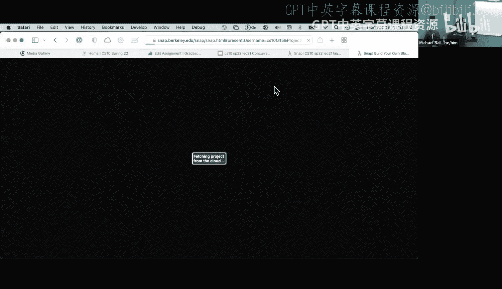

---

## Snap! 中的并发机制 ⚙️

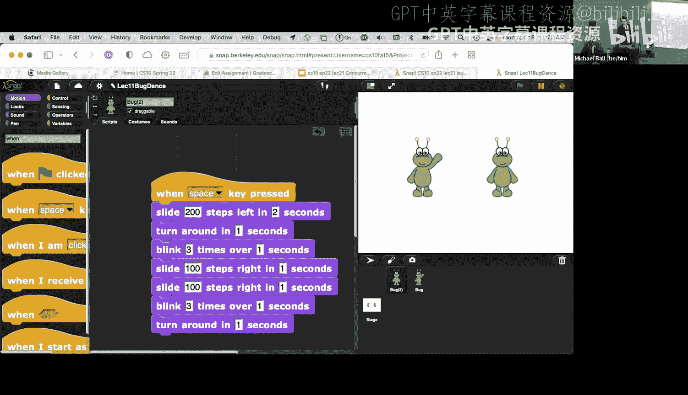

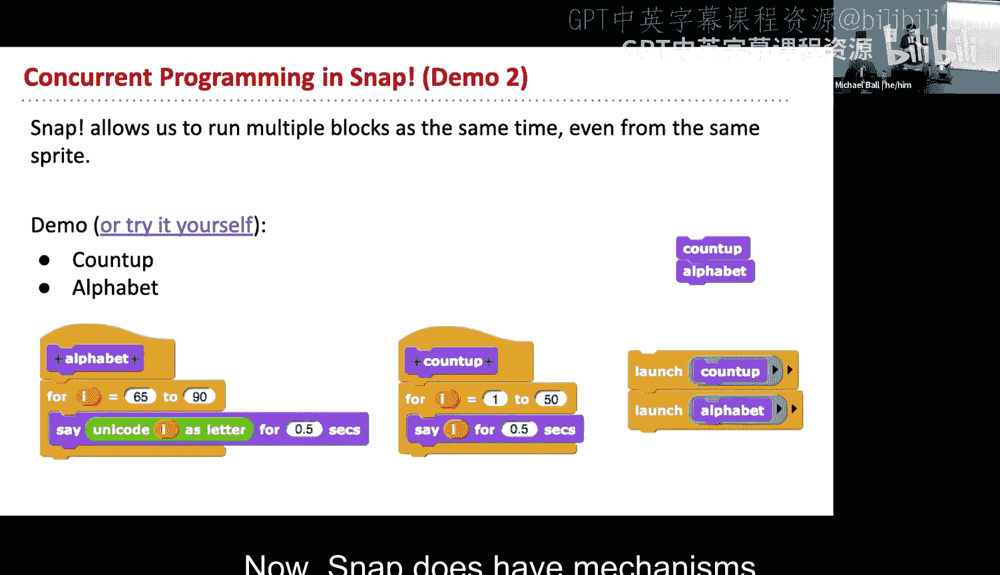

上一节我们了解了并发的概念，本节中我们来看看 Snap! 提供了哪些工具来实现并发控制。

Snap! 提供了几种关键机制来处理并发执行：

以下是 Snap! 中用于控制执行顺序的两个主要命令块：

*   **`启动`**：此命令会开始执行一个脚本，但**不等待**它完成就立即继续执行后续脚本。这允许两个脚本“同时”运行。
*   **`运行`**：此命令会执行一个脚本，并**等待**它完全结束后才继续执行后续脚本。这确保了脚本的顺序执行。

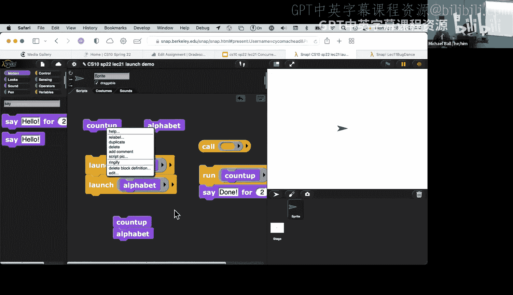

此外，广播机制也涉及并发：

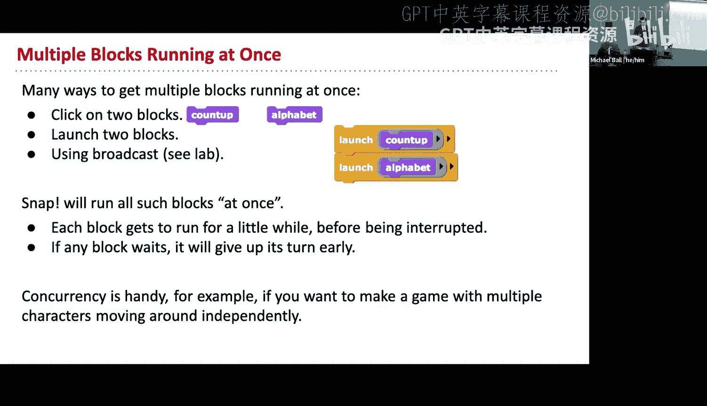

*   **`广播`** 与 **`广播并等待`**：这两个块类似于 `启动` 和 `运行`。`广播` 会发送消息并立即继续，允许其他角色同时响应；而 `广播并等待` 会等待所有接收到消息的脚本执行完毕后再继续。

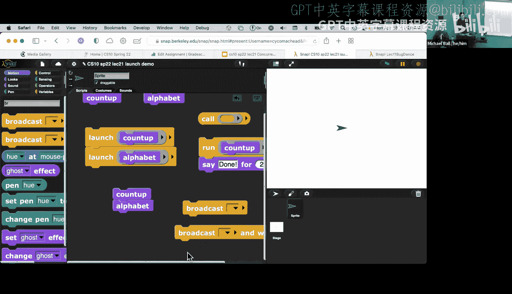

这些工具让程序员可以自主选择让任务并行发生还是顺序发生。

---

## 并行计算的潜力与挑战 🏗️

上一节我们介绍了 Snap! 中的并发工具，本节中我们来看看在更广泛的计算机科学中，并行计算的优势与局限。

将一项大任务分解，由多个处理器或计算机同时处理，可以显著加快速度。这类似于多人合作盖房子。

然而，并非所有任务都能通过增加人手（或处理器）来线性提速。任务的可并行化程度是关键。

以下是不同类型任务对并行化的响应：

*   **高度可并行任务**：例如，建造长城或运行多条独立的生产线。增加资源可以近乎线性地提高产出或速度。
*   **产出可扩展任务**：例如，制造更多手机或分食披萨。增加资源可以增加**总产出量**，但不一定减少**单个任务**的时间。
*   **难以并行任务**：例如，单人驾驶汽车或跑马拉松。这些任务有固有的顺序依赖，增加资源对提速帮助甚微。

在计算领域，像亚马逊这样的网站服务是高度可并行的，可以通过增加服务器来同时响应成千上万的用户请求。而某些计算任务则存在依赖关系，难以分解。

---

## 硬件基础：从晶体管到多核时代 💻

上一节我们讨论了任务本身的并行性，本节中我们来看看计算机硬件的发展如何推动并发的必要性。

计算机处理器由数十亿个**晶体管**构成。晶体管通过电压的“开”（1）和“关”（0）来表示二进制数据，是计算的基础。

通过光刻等技术，我们能在芯片上集成越来越多的晶体管。英特尔联合创始人戈登·摩尔观察到了这一趋势，并提出了**摩尔定律**：芯片上可容纳的晶体管数量，约每隔两年便会增加一倍。这是一种**指数级增长**，它使得计算机性能持续快速提升。

然而，大约在2000年左右，单纯提高单个处理器速度遇到了瓶颈：功耗和散热问题变得无法承受。芯片的功率密度一度接近核反应堆的水平。

于是，行业方向从制造更快的单核处理器，转向了设计**多核处理器**。这意味着，要进一步提升计算能力，必须依靠多个处理器核心**同时工作**，即并发执行任务。这使得并发编程从一种可选技术变成了充分利用硬件性能的必备技能。

---

## 阿姆达尔定律：并行加速的理论极限 ⚖️

上一节我们了解了硬件向多核发展的原因，本节中我们用一个重要定律来量化并行计算所能带来的速度提升极限。

**阿姆达尔定律**描述了在固定负载下，并行化所能带来的最大理论加速比。

任何程序都可以分为两部分：
1.  **串行部分**：必须按顺序执行的部分。
2.  **并行部分**：可以分解并在多个处理器上同时执行的部分。

设 `S` 为程序串行部分所占的时间比例，`P` 为并行部分所占比例（`S + P = 1`），`N` 为处理器数量。


程序的最大加速比公式为：
```
加速比 = 1 / (S + P/N)
```


当处理器数量 `N` 趋近于无穷大时，公式简化为：
```
最大加速比 = 1 / S
```

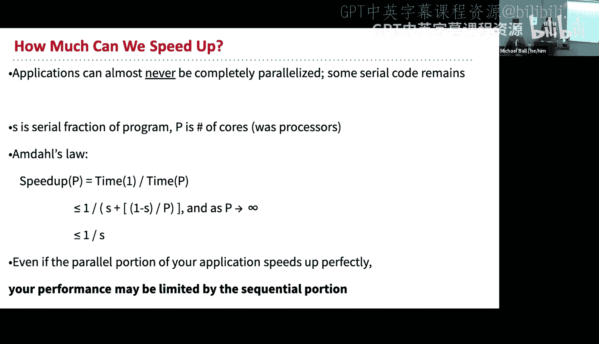

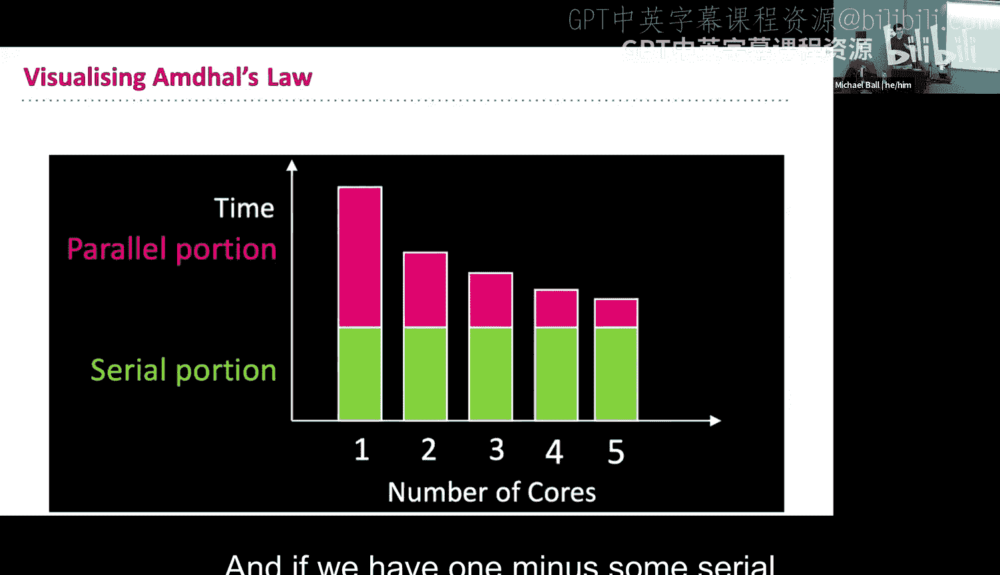

这意味着，**程序的最终加速比受限于其串行部分的比例**。

**举例说明**：如果一个程序有 20% (`S=0.2`) 的代码是串行的，那么无论使用多少个处理器，其理论最大加速比上限为 `1 / 0.2 = 5` 倍。

---

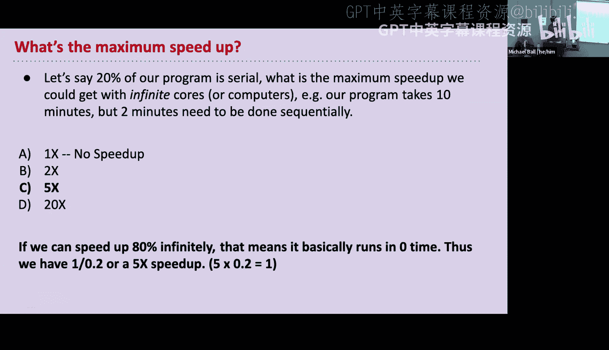


## 总结 📚

本节课中我们一起学习了并发编程的核心知识。我们首先了解了并发在现代计算中的必要性，并探索了 Snap! 中实现并发的`启动`和`运行`等机制。接着，我们讨论了任务并行化的潜力与挑战，以及硬件从单核到多核发展的历程。最后，我们学习了**阿姆达尔定律**，它用公式 `最大加速比 = 1 / S` 清晰地表明，程序的并行加速存在理论极限，该极限取决于其串行部分的比例。

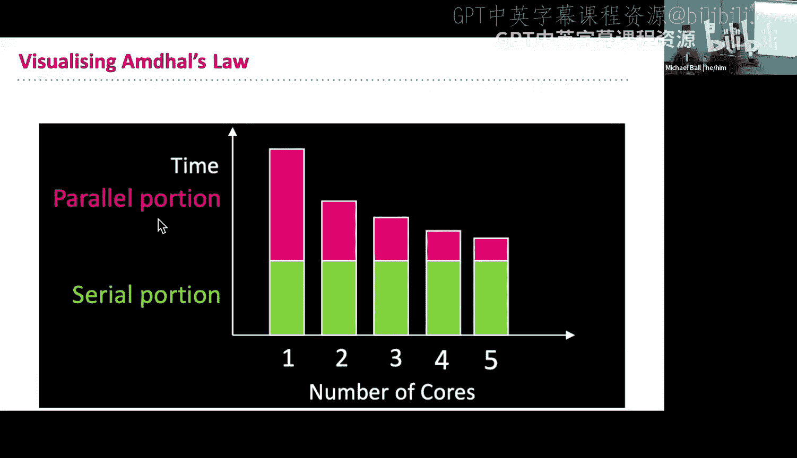

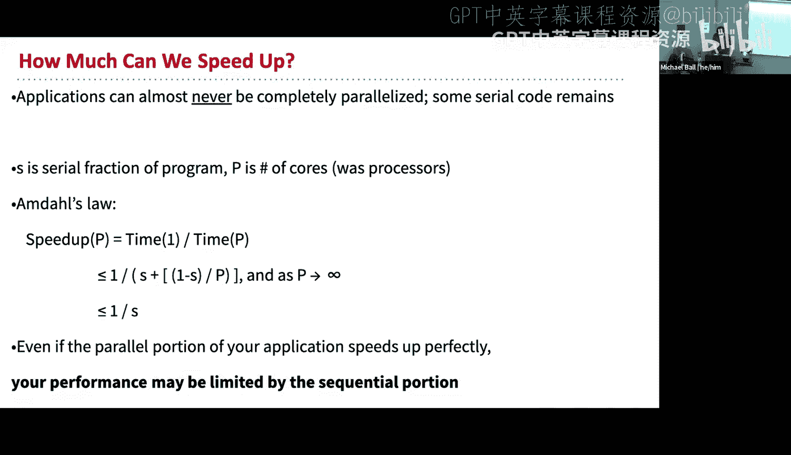

理解并发，能帮助我们写出更高效、更能利用现代计算硬件潜力的程序。