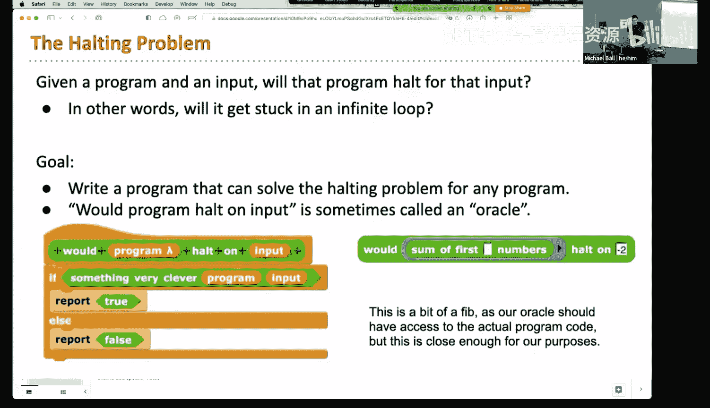
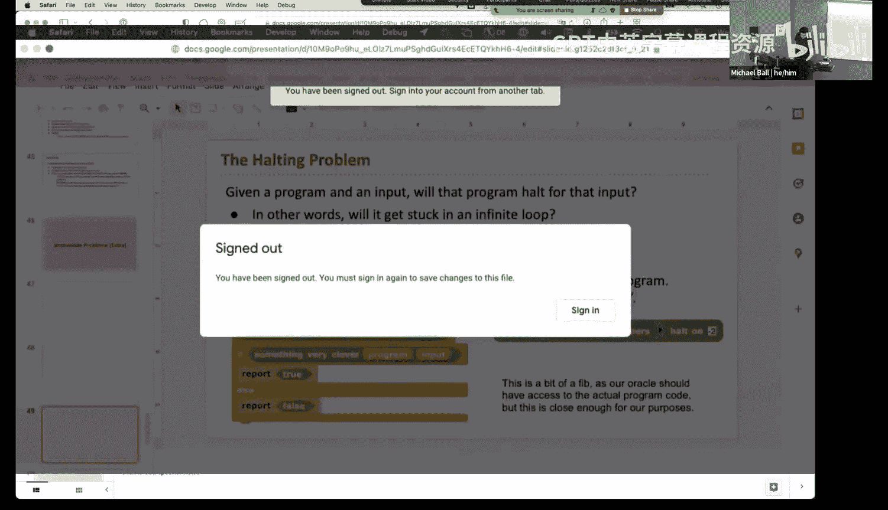
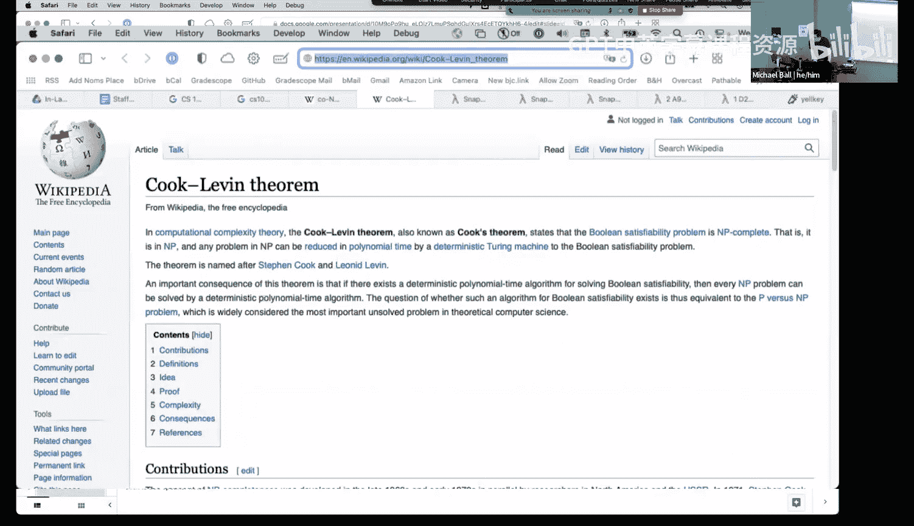

# 计算之美与乐趣：第24讲：结论与告别 🎓

在本节课中，我们将学习计算机科学中一个核心且迷人的领域：计算复杂性。我们将探讨计算机能解决和不能解决的问题类型，理解“难”问题的概念，并介绍P与NP这个著名的开放性问题。课程最后，我们将对这门课程进行总结与告别。

---

## 课程回顾与期末考试安排 📝

上一节我们讨论了“可处理”问题。本节中，我们首先回顾一下课程安排。

期末考试将于周五开始。在考试期间，请不要讨论任何与考试相关的内容。关于考试的后勤问题可以正常提问，但涉及考试细节的复习帖将被隐藏或移除。

考试形式如下：助教会提供一个链接，指向一份作业或实验。你需要按照指示完成，并将文件上传到Gradescope。考试的设计是，如果你在提供的示例上运行代码得到了与预期相同的结果，那么你很可能获得了满分。考试要求在某些部分使用高阶函数和递归，这是获得满分的必要条件。如果你不使用递归和高阶函数，而是用迭代方法解决，仍然可以获得部分分数。

下周的课程时间将用于复习。助教将在周一主持复习，我将在周三主持。周三的课程除了复习，还会对CS10课程进行总结，因为我们的进度比原计划慢了一讲。具体是线下还是线上进行待定，但教室已经预定。

---

## 难解问题与启发式方法 ⏳

现在，让我们从上周的内容继续。上周我们讨论了**可处理问题**，即我们知道如何解决的问题。这些问题可以在多项式时间内解决，例如排序列表、寻找中位数等。然而，计算机科学中还存在一整类计算机并不擅长解决的问题，我们称之为**难解问题**。

以国际象棋为例。给定一个棋盘状态，是否存在一步白棋的走法，能保证白棋最终获胜？这个问题答案非“是”即“否”。但在实践中，这个问题几乎不可能解决，因为可能的走法序列数量极其庞大，呈指数级增长。计算机下棋程序并非“保证”获胜，它们只是使用了相对较好的**人工智能**和**启发式方法**来近似求解。

### 背包问题：一个经典案例 🎒

以下是理解难解问题的一个经典例子：**背包问题**。

假设你有一个最大承重为15公斤的背包，以及无限数量的以下物品：
*   4公斤金块，价值10美元。
*   2公斤金块，价值2美元。
*   1公斤金块，价值1美元。

目标是：在不超过背包容量的前提下，最大化背包中物品的总价值。

**如何思考这个问题？**
大多数人会先选择**单位重量价值最高**的物品。这里，4公斤金块每公斤价值2.5美元（10/4），是最优选择。

**计算过程：**
1.  取3个4公斤金块：总重12公斤，总价值30美元。
2.  剩余容量3公斤。选择单位重量价值次高的2公斤金块？不，我们应该选择能填满剩余容量且价值最高的组合。实际上，选择3个1公斤金块只能增加3美元。但如果我们选择1个2公斤金块（2美元）和1个1公斤金块（1美元），总重15公斤，总价值33美元。然而，最优解是选择3个4公斤金块和3个1公斤金块吗？不，这样总重15公斤，价值30+3=33美元。但让我们仔细验算：3个4公斤金块（12公斤，30美元）加上3个1公斤金块（3公斤，3美元），总价值正是33美元。**注意**：幻灯片中给出的答案是40美元，但根据计算，33美元似乎是当前条件下的最大值。这提醒我们，即使对于简单问题，精确计算也很重要。在实际复杂情况下，找到**绝对最优解**需要尝试所有物品组合，所需时间随物品数量呈**指数级**增长，对于大量物品是不现实的。

**近似算法：贪婪策略**
因此，我们采用**启发式方法**或**近似算法**。**贪婪算法**就是一种常用策略：每一步都选择当前看来最优的物品（例如单位重量价值最高）。这种方法速度很快（接近线性时间），但**不能保证**总是得到最优解。不过，可以证明，对于背包问题，贪婪算法得到的结果至少能达到最优值的50%。在许多实际场景中，一个“足够好”的快速解比一个永远算不出来的“完美”解更有用。

---

## P问题、NP问题与NP完全问题 🧩

计算机科学家将问题分为不同的复杂度类别，以便更好地理解它们的求解难度。

### P类问题（多项式时间）
指那些可以在**多项式时间**内（如O(n), O(n²), O(n³)）被**确定性图灵机**（可理解为常规计算机）**解决**的问题。例如排序、搜索。这类问题是“容易”或“可处理”的。

### NP类问题（非确定性多项式时间）
指那些答案可以在多项式时间内被**验证**，但可能无法在多项式时间内被**解决**的问题。NP代表“非确定性多项式时间”。

**关键特性：**
1.  它们是**判定性问题**，答案只有“是”或“否”。
2.  **如果**有人给了我们一个答案为“是”的**证书**（例如，一个具体的解），我们可以在多项式时间内验证这个证书是否正确。

**示例：子集和问题**
给定一个数字集合，例如 `[15, 10, -3, -2, 14, 7]`，问是否存在一个子集，其元素之和正好为0？
*   **求解（难）**：可能需要尝试所有子集组合（指数时间）。
*   **验证（易）**：如果有人声称子集 `[15, -3, -10, -2]` 的和为0，我们只需做一次加法：`15 + (-3) + (-10) + (-2) = 0`，即可快速验证其正确性。

许多实际问题可以转化为NP问题，例如：
*   给定预算，是否存在一条飞机航线规划方案？
*   给定一个整数，是否存在两个质数相乘等于它？（这是RSA加密的基础）
*   给定一个能量值，是否存在一种蛋白质折叠构型？

### NP完全问题
这是NP问题中“最难”的一类。如果任何一个**NP完全问题**能在多项式时间内解决，那么**所有**NP问题都能在多项式时间内解决。也就是说，解决了其中一个，就等于解决了所有。

**归约**是理解这一点的关键概念。如果我们能将问题A转化为问题B，并且解决问题B的方法也能用来解决问题A，那么问题A的难度就“归约”到了问题B。例如，“寻找中位数”问题可以归约到“排序”问题（先排序，再取中间值）。

子集和问题就是一个经典的**NP完全问题**。其他例子包括旅行商问题、布尔可满足性问题等。成千上万的问题被证明是NP完全的。

---

## P = NP？百万美元问题 💰

由此引出了计算机科学中最著名的开放性问题：**P 是否等于 NP？**
*   如果 **P = NP**，意味着所有NP问题（包括那些极其困难的问题）实际上都有多项式时间的解法，只是我们尚未发现。这将彻底改变计算机科学、密码学、优化等众多领域。
*   如果 **P ≠ NP**，意味着NP完全问题本质上是难解的，不存在通用的高效算法。大多数科学家相信 **P ≠ NP**。

2000年，克雷数学研究所将“P vs NP问题”列为七个**千禧年大奖难题**之一，并为解决任何一个问题悬赏100万美元。至今无人能证明P是否等于NP。

---

## 不可解问题：停机问题 ⛔

除了难解问题，还存在一类**不可解问题**，即无论给予多少时间和资源，计算机都**永远无法解决**的问题。

最著名的例子是**停机问题**：能否编写一个程序`H`，它可以判断任意程序`P`在给定输入`I`下是否会终止（停机），还是会永远运行下去（死循环）？

艾伦·图灵通过巧妙的**反证法**证明：这样的程序`H`**不可能存在**。这表明计算机的能力存在根本性极限，并非所有问题都是可计算的。

---

## 课程总结与告别 👋

本节课中，我们一起探索了计算复杂性的广阔领域：
1.  我们回顾了**可处理问题**与**难解问题**的区别。
2.  通过**背包问题**，学习了使用**贪婪算法**等启发式方法获取近似解。
3.  我们定义了**P类**（易解）、**NP类**（易验证）和**NP完全问题**（NP中最难的问题）。
4.  我们探讨了**P vs NP**这个核心开放性问题及其深远意义。
5.  最后，我们提到了像**停机问题**这样的**不可解问题**，认识到计算机能力的内在局限。

计算之美与乐趣不仅在于创造能做什么的程序，也在于理解计算的边界在哪里。希望这门课激发了你们对计算机科学的兴趣和思考。

祝大家在期末考试和最终项目中好运！感谢大家这一学期的参与。再见！