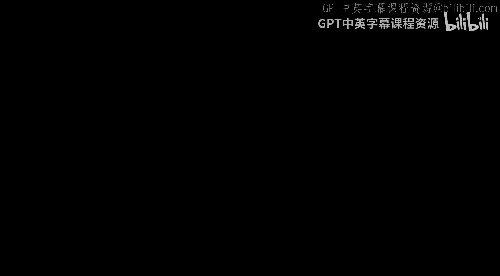
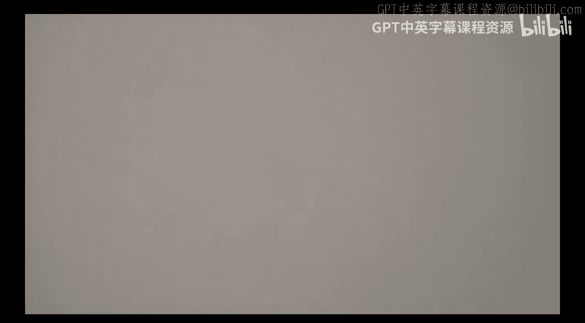
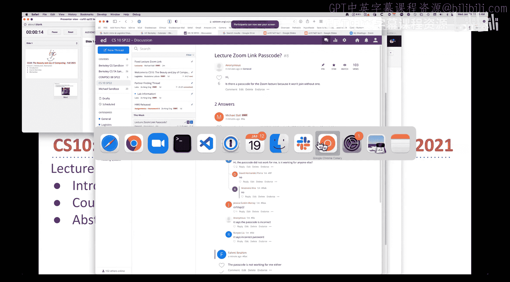
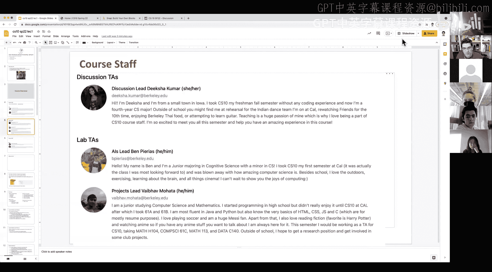
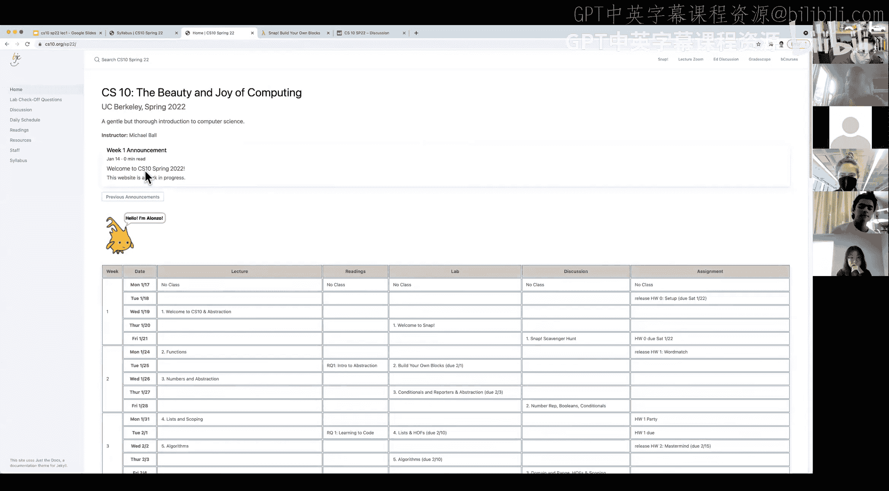
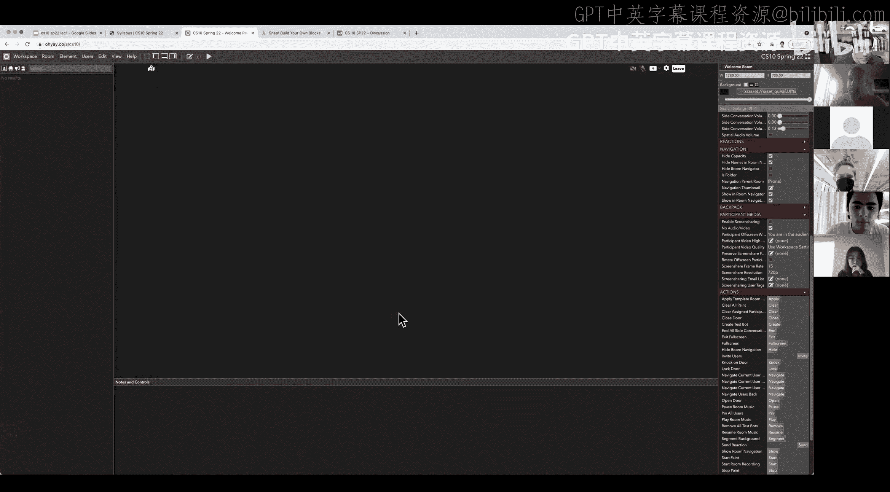
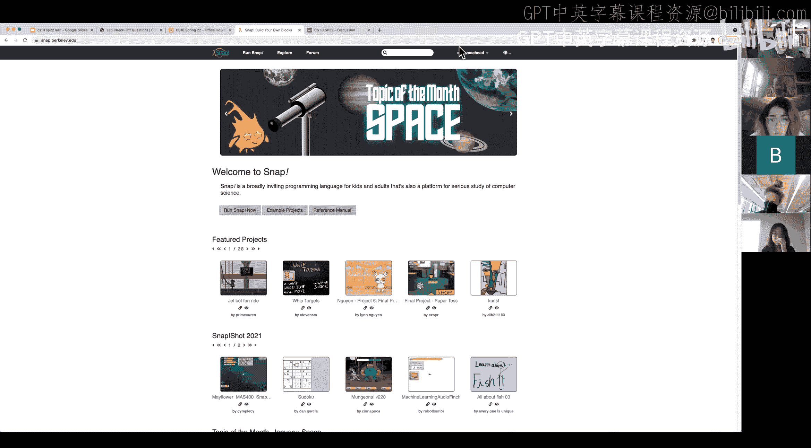
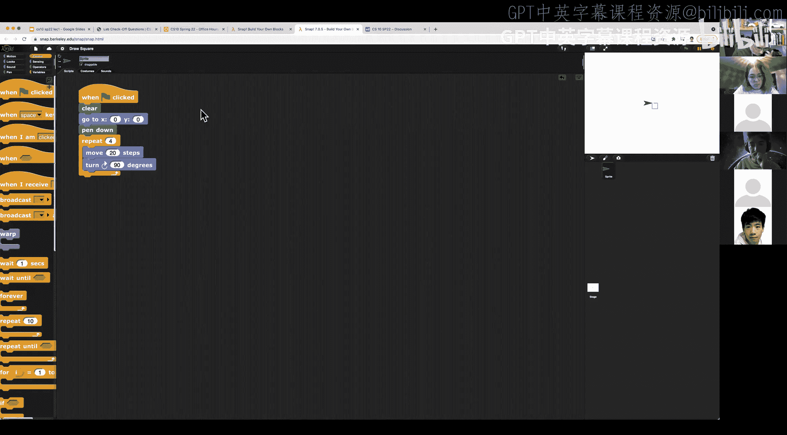
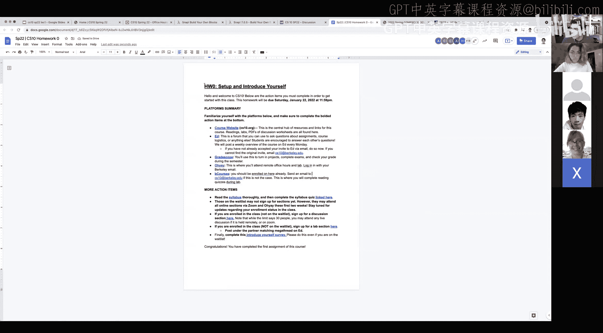

# 1：课程介绍与抽象概念入门 🚀










在本节课中，我们将学习CS10课程的整体结构、核心目标，并初步接触计算机科学中最重要的概念之一：**抽象**。我们将了解如何使用Snap!编程语言进行简单的编程，并理解抽象如何帮助我们管理复杂性。

---




## 课程概述与人员介绍 👥

大家好，欢迎来到春季学期的CS10课程。由于Zoom链接设置问题，我们稍晚几分钟开始，感谢大家的耐心等待。

CS10是一门关于计算之美与乐趣的课程。学习计算机科学有很多原因：它影响力巨大，在各个研究领域（如生物学、物理学、历史学、数据科学等）都极具实用性，并且能提供丰富的就业机会。本课程虽然不涉及大量数学，但会探讨一些更具理论性的计算机科学概念和技巧，它们可能初看起来有些奇特，但能让你编写出非常酷的程序。

我是本课程的讲师Michael。我在伯克利读大一时就选修了CS10，之后一直参与课程的维护工作，例如维护Snap!编程语言的云端后端基础设施。Snap!是我们将在课程中使用的一种编程语言，它专为CS10这类旨在提供有趣编程体验的课程而设计。

我们的课程团队还包括：
*   **头助教Maddie**：负责讨论课和课程后勤。
*   **讨论课助教Dea**：负责周二和周三的讨论课。
*   **实验课助教Ben**：负责周二周四下午4-6点的实验课，并管理学术实习生。
*   其他助教和读者：他们将在实验课、办公时间和项目评分中提供帮助。
*   **学术实习生**：他们是往届的CS10学生，将在实验课中提供志愿帮助。

## 课程内容与结构 📚

上一节我们认识了课程团队，本节中我们来看看课程将涵盖哪些内容以及如何组织。

CS10课程将围绕几个核心大概念展开：
*   **抽象**：隐藏复杂性，使事物更易于理解。
*   **算法**：如何概念化和设计解决问题的步骤。
*   **递归**：一个非常酷且需要动脑的概念。
*   **函数即数据**：我们将探讨这意味着什么。
*   **数据表示**：如何思考大大小小的数据。





此外，课程的一个重要部分是探讨计算的**社会影响**。学习编程是一项强大的技能，可以用来做好事，也可能被滥用。我们希望通过阅读和讲座，让大家理解这一点。

课程的主要组成部分如下：
*   **讲座**：每周一和周三进行，时长约一小时，介绍核心概念并进行演示。
*   **实验课**：每周二和周四进行，时长约两小时，是**培养编程技能的主要场所**。我们强烈鼓励**结对编程**。
*   **讨论课**：每周五进行，时长一小时，用于深入探讨棘手概念、大想法和社会议题。
*   **作业与项目**：共6个作业，其中2个是自创项目，1个是与社会影响相关的写作项目。
*   **考试**：包括第4周的“探索性测试”、第9周的期中考试和期末考试。

所有课程资料、日程和链接都发布在课程网站 **cs10.org** 上。我们将使用Ed进行讨论，使用Gradescope提交作业，并使用一个名为**OEA**的互动平台进行远程实验课和办公小时。

## 课程政策与 logistics ⚙️

了解了课程内容后，我们还需要了解一些重要的课程政策。

以下是关于课程安排和评分的关键信息：
*   **报名**：实验课和讨论课的分组报名通过课程网站或Ed上的链接进行，而不是CalCentral。
*   **考勤与弹性**：讲座出勤和测验共计25分，但会有超过25分的机会，因此有一定弹性。实验课和讨论课会各去掉最低的几次成绩。
*   **迟交政策**：你有**8个“宽限日”**，可以在整个学期中无理由延迟提交作业（项目和作业），无需事先申请。
*   **考试政策**：考试计划线下进行，但会为远程学生提供在线监考版本。期末考试成绩可以按一定规则覆盖期中或探索性测试中较低的成绩。
*   **候补名单**：课程可能会扩容约20个名额。通常在前几周会有10-15%的学生退课。建议候补学生先参与课程，等待几周。

## 核心概念：抽象 🧩

现在，让我们深入本课的第一个核心概念：**抽象**。抽象是计算机科学中最重要的思想之一，它让我们能够通过隐藏复杂性来使事物更易于理解。

**抽象**的核心是**细节移除**。以现代汽车为例，无论内部技术如何变化（燃油喷射、防抱死刹车系统、电动汽车），其操作界面（油门踏板和刹车踏板）近百年来基本保持不变。驾驶员不需要理解引擎控制模块如何工作，只需知道踩下踏板的程度与汽车加速的关系即可。这就像一个复杂的系统被简化为一个简单的接口。

在编程中，我们做同样的事情。让我们用Snap!来演示。假设我们要画一个正方形。

最初，我们可能会写下一系列重复的指令：
```
移动 20 步
右转 90 度
移动 20 步
右转 90 度
移动 20 步
右转 90 度
移动 20 步
```

在Snap!中，我们可以使用 **`重复`** 块来抽象这个过程：
```
重复 4 次
  移动 20 步
  右转 90 度
```



通过这个 `重复` 块，我们将“重复执行某个动作4次”这一概念抽象了出来。这使得代码更简洁、更易读，也更容易修改（例如，要画六边形，只需将“4”改为“6”）。这就是**抽象**的力量：管理复杂性，避免不必要的重复工作。

## 总结与预告 🎯



本节课中，我们一起学习了CS10课程的概况、教学团队、课程结构与核心政策。我们重点介绍了计算机科学的基石——**抽象**的概念，并通过Snap!编程演示了如何使用`重复`块来抽象重复性任务，从而简化代码。

这只是开始。在接下来的实验课中，你将亲自探索Snap!，并开始构建自己的抽象。下周，我们将继续深入探讨抽象和其他强大的计算思想。



记住，CS10的成功取决于你的参与。请充分利用实验课、讨论课和办公时间。祝大家学习愉快，我们下周见！