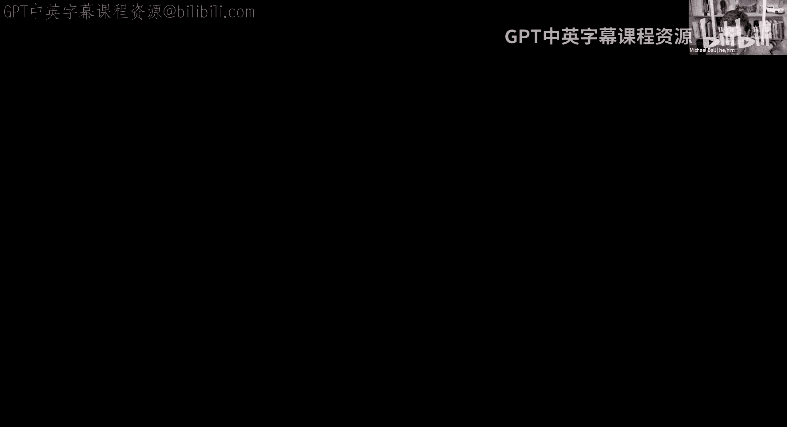
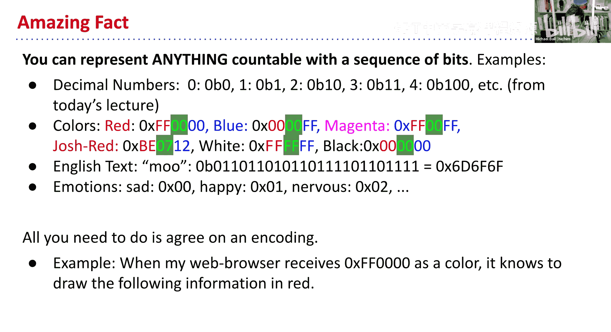
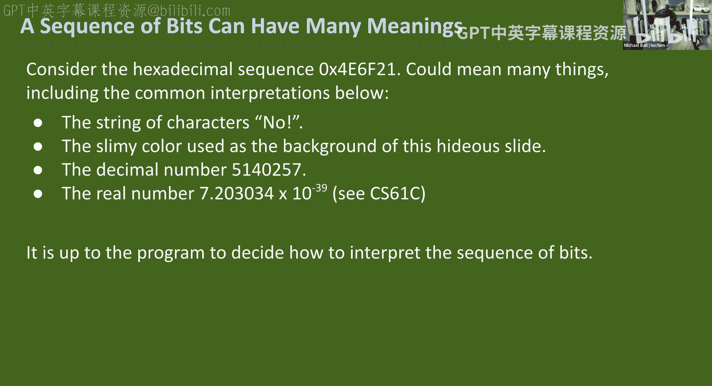
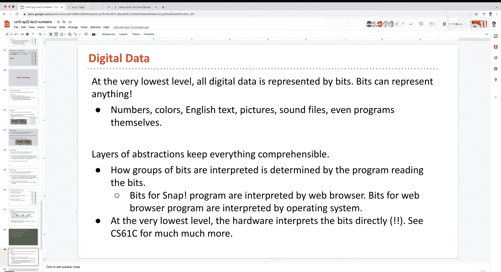

# 3：数字表示与抽象

在本节课中，我们将要学习数字表示法，理解数字作为一种抽象概念的意义，并探讨不同的数制系统（如十进制、八进制、二进制和十六进制）是如何工作的。我们还将了解数据类型的初步概念，以及为什么理解数据的“含义”取决于程序或用户如何解释它。

## 数据类型、定义域与值域

上一节我们介绍了SNAP编程环境中的基本概念。本节中，我们来看看编程中一个核心思想：数据类型，以及与之相关的定义域和值域。

在数学和编程中，每个函数或代码块都有其可接受的输入集合（定义域）和可能产生的输出集合（值域）。

*   **定义域**：指一个函数可以接受的输入值的集合。例如，`平方根` 函数通常只接受非负数作为输入。
*   **值域**：指一个函数所有可能的输出值的集合。例如，`平方根` 函数的输出是非负数，`长度` 函数的输出是非负整数。

在SNAP中，块的形状和颜色直观地传达了其数据类型：
*   **圆角输入槽**：通常只接受**数字**。
*   **六边形块**：是**谓词**，它们总是返回**布尔值**（`true` 或 `false`）。
*   **较宽的矩形输入槽**：通常接受**文本**。
*   **三个堆叠的矩形**：代表**列表**，这是一种可以容纳多个数据项的特殊数据类型。

理解数据类型有助于我们正确使用代码块，并让代码（包括给未来的自己）更易读。

## 数字作为一种抽象

我们每天都在使用数字，但很少思考它们是如何被表示的。数字“10”本身只是一个符号序列，它的具体含义（10个苹果？10点钟？）取决于我们赋予它的上下文。这就是数字的**抽象性**。

计算机存储和处理所有信息（包括数字、文本、颜色）的基础，最终都是一系列的0和1。如何解释这串0和1，决定了它代表什么。本节课的核心就是理解数字在不同“基底”下的表示方法。

## 理解数制：从十进制到其他进制

我们最熟悉的是十进制（基数为10）。在十进制中，我们使用0到9这十个数字，每个数位代表10的幂次。

例如，数字 **7091** 可以表示为：
`7 * 10³ + 0 * 10² + 9 * 10¹ + 1 * 10⁰ = 7000 + 0 + 90 + 1 = 7091`

这种“按位计数”的思想可以推广到任何基数。

### 八进制（基数为8）

八进制使用0到7这八个数字。

**示例**：将八进制数 `15₈` 转换为十进制。
`1 * 8¹ + 5 * 8⁰ = 8 + 5 = 13`
因此，`15₈` 等于 `13₁₀`。它们是同一个值的不同表示。

### 二进制（基数为2）

二进制是计算机的“母语”，只使用0和1两个数字。每个二进制位称为一个 **比特（bit）**。

**示例**：将二进制数 `110₂` 转换为十进制。
`1 * 2² + 1 * 2¹ + 0 * 2⁰ = 4 + 2 + 0 = 6`
因此，`110₂` 等于 `6₁₀`。

为了方便阅读，二进制数常以 `0b` 为前缀，如 `0b110`。

### 十六进制（基数为16）

十六进制使用0-9和A-F（代表10-15）共十六个符号。它常用于更紧凑地表示二进制数。

**示例**：将十六进制数 `A5₁₆` 转换为十进制。
`A` 代表 `10`，所以计算为：`10 * 16¹ + 5 * 16⁰ = 160 + 5 = 165`
因此，`A5₁₆` 等于 `165₁₀`。十六进制数常以 `0x` 为前缀，如 `0xA5`。

## 为什么使用不同的数制？

*   **二进制**：直接对应计算机硬件中电路的“开”（1）和“关”（0）状态，是信息表示的基础。
*   **十六进制**：与二进制转换非常方便（每4位二进制数对应1位十六进制数），为人类提供了一种更简洁的查看和书写二进制数据的方式。
*   **理解抽象**：学习不同数制能深刻体会到，**相同的数据（比特序列）可以根据不同的解释规则，代表完全不同的东西**（数字、颜色、字母等）。

## 核心概念总结

本节课中我们一起学习了：
1.  **数据类型、定义域和值域**：理解了代码块对输入输出的约束，以及SNAP中形状/颜色的含义。
2.  **数字的抽象性**：认识到数字“10”的含义依赖于上下文。
3.  **数制系统**：掌握了十进制、八进制、二进制和十六进制的基本原理和相互转换的思想。
4.  **比特与字节**：了解了信息存储的基本单位（`比特` -> `字节`）。
5.  **数据的解释**：领悟到**比特序列本身没有内在含义**，其意义由处理它的程序或协议定义。同一串 `0xE6F21`，可以被解释为一个颜色、几个字符或一个数字。

记住，编程不仅仅是写代码，更是关于如何创造性地组织和解释数据。下一讲，我们将继续深入数制转换，并开始运用这些概念。