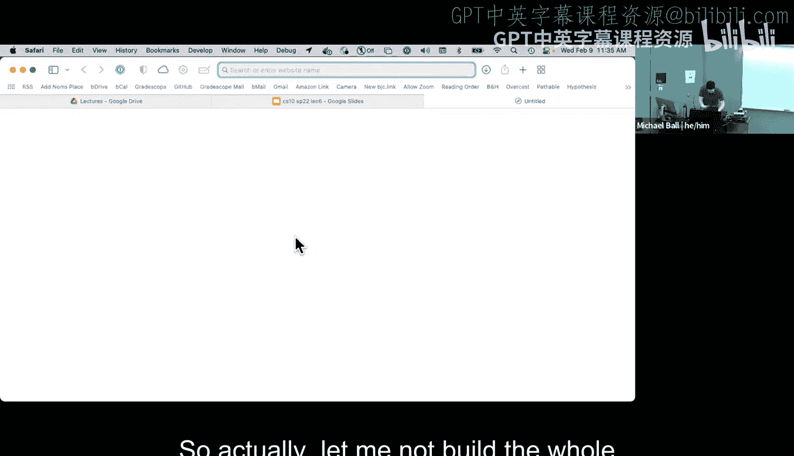
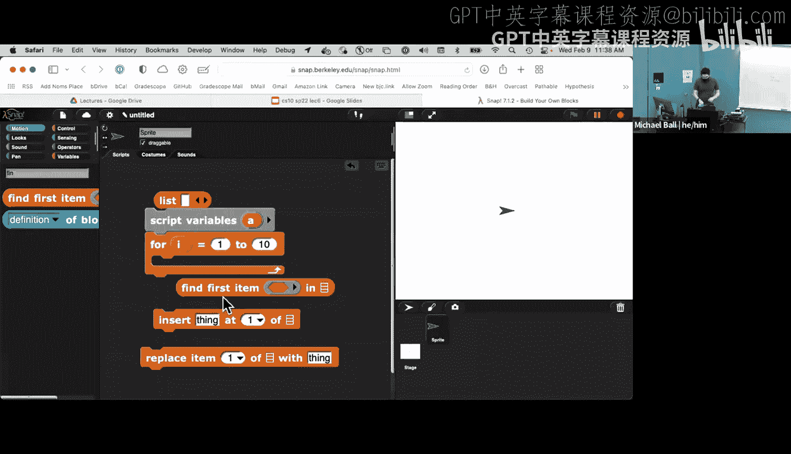
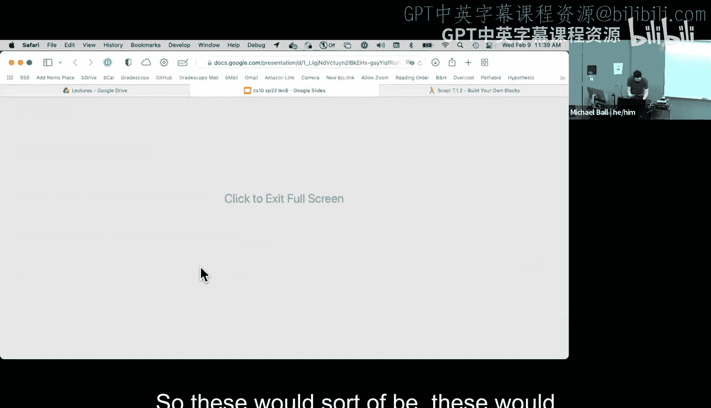
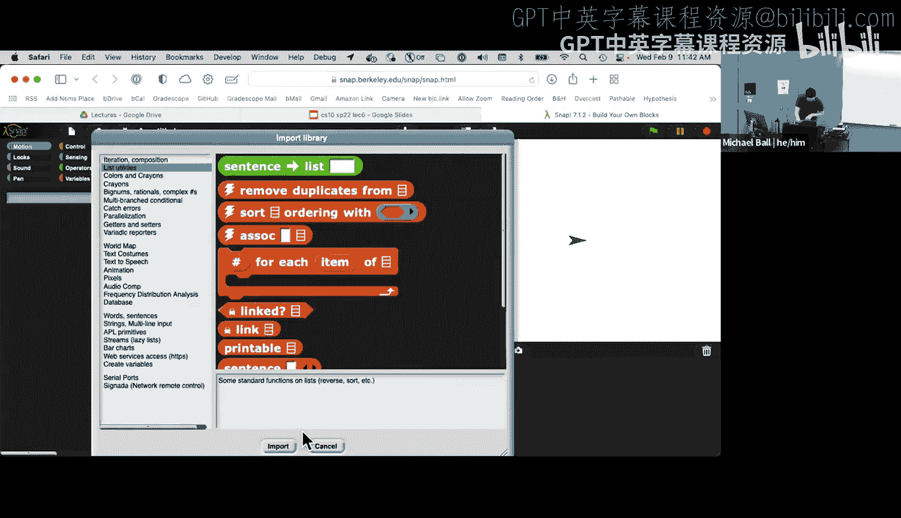
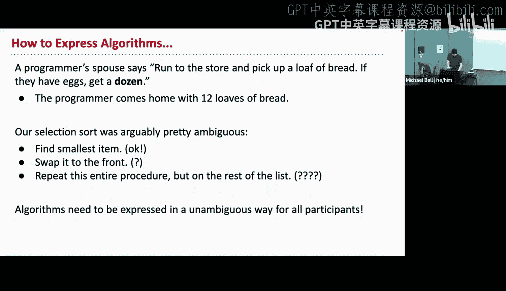
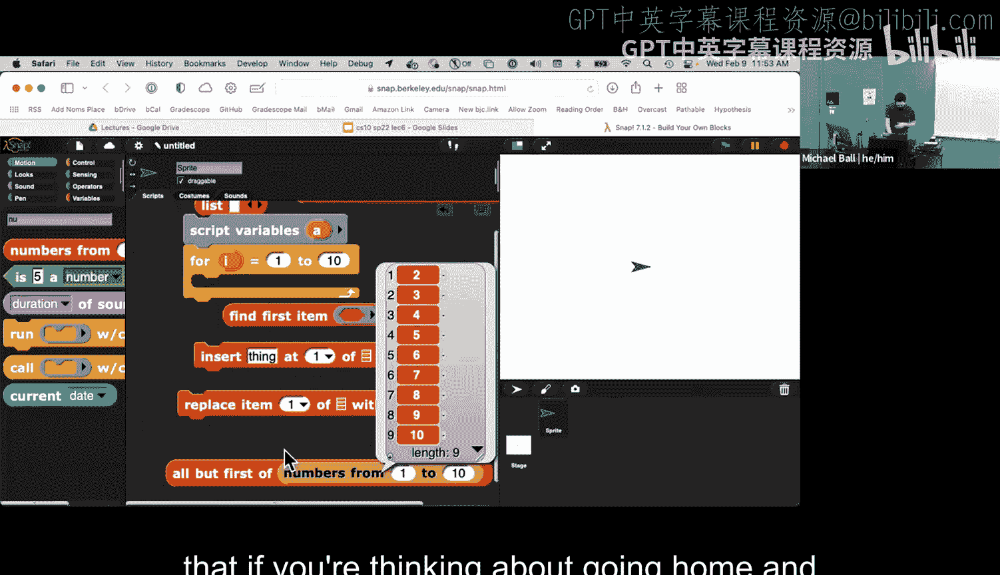
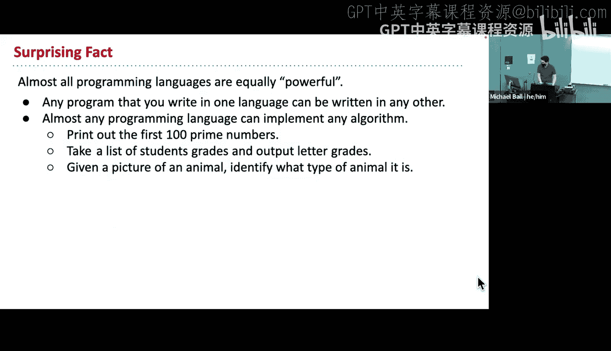

# 7：算法入门 🧮

在本节课中，我们将要学习计算机科学的核心概念之一：**算法**。我们将探讨算法的定义、历史、基本属性以及如何表达和实现它们。通过简单的例子，你将理解算法如何作为解决问题的工具，并了解其基本构成。

---

## 什么是算法？🤔

算法是一个定义明确的计算过程，它接收一些值（输入）并产生一些值（输出）。因此，算法是一系列可以将输入转换为输出的计算步骤。

本质上，当你谈论一个程序或函数时，它是某个算法的具体实现，但算法本身更像是一个思想或蓝图。

我们可以区分**计算问题**和**算法**。计算问题是“我想做什么？”，例如“如何对一组数据进行排序？”。而算法则是解决这个问题的具体步骤集合，例如“如何通过一系列比较和交换操作将无序列表变为有序列表？”。

---

## 算法的历史与无处不在性 📜

算法的概念实际上比计算机古老得多，已有数千年的历史。

*   **历史形式**：舞蹈仪式、建筑图纸、烹饪食谱（如将面粉和水转化为面包的步骤）都可以看作是算法的雏形。
*   **数学**：巴比伦人的加减法、早期几何学等数学运算都是古老的算法。
*   **学校教育**：我们学过的竖式加法、竖式乘法都是手算算法。
*   **自然**：DNA本身也是一系列指导人体如何生长、修复的指令，可以看作是一种生物算法。

一个关键点是，**同一个问题往往有多种不同的算法可以解决**。例如，乘以10的快捷算法是“在数字末尾加一个0”，但这只适用于乘以10，而通用的竖式乘法算法则适用于任何数字。

---

## 算法示例：寻找最小值 🔍

让我们看一个具体的算法：在一个列表中寻找最小值的索引（位置）。

假设我们有一个列表：`[32, 39, 9, 2, 19]`。最小的数字是`2`，它在列表中的位置是4（在Snap中，列表通常从第1项开始计数）。

以下是该算法的一种思路：

1.  从列表开头开始。目前我们只看到第一项，所以“最佳（最小）项”的索引暂时是1。
2.  逐步检查列表中的每一项：
    *   检查第二项（39）是否小于当前最佳项（32）？不是。所以最佳索引仍是1。
    *   检查第三项（9）是否小于当前最佳项（32）？是。所以更新最佳索引为3。
    *   检查第四项（2）是否小于当前最佳项（9）？是。所以更新最佳索引为4。
    *   检查第五项（19）是否小于当前最佳项（2）？不是。所以最佳索引保持为4。
3.  到达列表末尾，报告结果：4。

在Snap中，你可以使用`for`循环来实现这个算法，跟踪一个“当前最小索引”的变量。这类检查列表中每一项的算法非常常见。

---

## 算法示例：排序列表 📊

排序是一个经典的计算问题。给定一个无序列表，我们想得到一个元素按顺序排列的新列表（例如从小到大）。

有多种算法可以解决排序问题。以下是两种思路：

**1. 插入排序（Insertion Sort）**
*   思路：一次比较两个相邻元素，如果顺序不对就交换它们，并重复遍历列表，直到整个列表有序。
*   过程：就像整理一手扑克牌，你一次拿一张牌，并将其插入到手中有序部分的正确位置。
*   特点：实现简单，但对于很长的列表可能不是最快的。

**2. 选择排序（Selection Sort）**
*   思路：首先找到整个列表中的最小元素，将其与第一个位置的元素交换。然后在剩下的列表中找最小元素，与第二个位置交换，依此类推。
*   过程：就像为一场比赛选拔队员，你每次都从剩下的人中选最好的。
*   特点：同样直观，但通常也比一些更高级的算法慢。

这两种算法都能正确地对列表进行排序，它们是解决同一问题的不同“工具”。在后续课程和实验中，你将有机会探索和实现不同的排序算法。

---

## 算法的属性与组合 🧩

算法有一些重要的属性，使得它们非常强大：

*   **可组合性**：我们可以将已知正确的算法像积木一样组合起来，构建更复杂的算法。这利用了**抽象**和**泛化**的思想。例如，如果我们有一个可靠的“排序”算法，那么“找中位数”的问题就可以通过“先排序，再取中间元素”来解决。
*   **多样性**：同一个问题通常有多个有效的算法。研究这些不同的解决方案可以带来对问题本身的新见解。例如，历史上计算机科学家研究“如何在不完全排序的情况下高效找中位数”，就衍生出了有趣的数学理论。
*   **精确性**：算法必须被无歧义地定义。计算机非常擅长遵循指令，但不会推断你的意图。模糊的指令（如著名的“买面包”笑话：如果店里有鸡蛋，就买一打。结果程序员买了一打面包）会导致错误的结果。

---

## 如何表达算法？✍️

我们需要清晰无误地描述算法。有几种常见的方式：

*   **自然语言**：用精确的语言描述步骤。需要格外小心避免歧义。
*   **流程图**：使用图形化的方式展示决策和步骤流程，非常适合描述包含多个分支的过程。
*   **伪代码**：一种介于自然语言和编程语言之间的描述方式。它使用类似代码的结构（如`if`、`for`），但忽略严格的语法细节，是设计算法时非常有用的中间步骤。
*   **编程语言**：最终，我们将算法转化为像Snap这样的编程语言中的具体代码（由积木块组成）。这个过程称为**实现**。

在Snap中，`所有但第一个`这样的积木块就是算法步骤“处理列表的剩余部分”的具体实现，它帮助我们消除了自然语言描述可能存在的模糊性。

---

## 算法的基本构建块 🧱

任何算法都可以分解为三种基本控制结构：

1.  **顺序**：按特定顺序执行一系列步骤。
2.  **选择**：根据条件决定执行哪条路径（例如 `if...else` 块）。
3.  **重复**：将一组步骤重复执行多次，直到满足某个条件（例如 `repeat` 或 `for` 循环）。

一个有趣的理论是，所有算法本质上都可以仅用“顺序”和“选择”来构建（通过一种称为“递归”的技术来实现重复），但“重复”结构让我们的表达更加直观和方便。

---

## 算法的力量与语言无关性 💪

一个深刻而强大的思想是：**所有足够完善的编程语言在能力上是等价的**（图灵完备）。这意味着：

*   你在Snap中拥有的积木块，足以实现任何你能想到的算法思想。
*   任何用一种语言编写的程序，原则上都可以被翻译成另一种语言。
*   我们学习Snap，不仅仅是学习这个工具本身，更重要的是培养一种**计算思维**——将问题分解为可由计算机执行的步骤序列的能力。这种技能可以迁移到Python、JavaScript、Java等任何其他编程语言中。

---

## 总结 📝

本节课中，我们一起学习了算法的核心概念。我们了解到算法是解决问题的明确步骤序列，它历史悠久且无处不在。我们通过“寻找最小值”和“排序”的例子看到了算法的具体运作。我们讨论了算法的关键属性，如可组合性和多样性，并探索了表达算法的多种方式（从自然语言到代码实现）。最后，我们认识到所有算法都由顺序、选择和重复这三种基本结构构成，并且算法的思想是独立于任何特定编程语言的。

下一讲，我们将探讨如何评价算法的好坏，超越“正确性”，去思考什么是“高效”的算法。请关注今天晚些时候发布的测验成绩，我们将在下周的实验和讲座中再见！