# 11：计算的社会影响

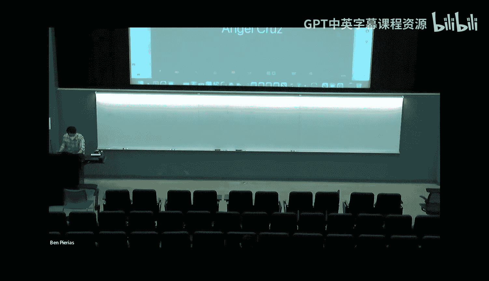

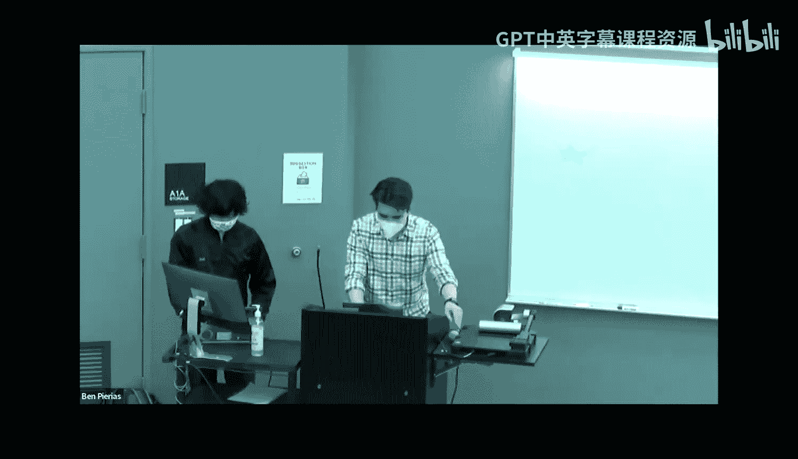

在本节课中，我们将探讨当前流行技术及其社会影响。我们将涵盖虚拟现实、人工智能、在线隐私、技术与社交支持，以及技术与自然等主题。我们的目标是描绘一幅全景图，引导大家思考当代技术带来的益处与挑战。

## 为什么社会影响很重要？🤔

你编写的软件可能对世界产生巨大影响。如今，社会的几乎每个关键部分都依赖于代码，例如选举投票、驾驶汽车、经济运行等。所有这些都以某种方式与软件相关。正因如此，你创造的软件可以瞬间传递到世界任何角落，只需按下一个按钮。

然而，这背后存在一个严峻问题：如果你编写的代码存在错误，由于其无处不在的特性，可能导致大规模的连锁反应，甚至影响整个世界。因此，在编写代码和进行复杂项目时，需要考虑所有可能发生的情况，尤其要意识到当前世界和技术中存在的各种社会困境，以避免重蹈覆辙。

例如，在2020年，谷歌云视觉的图像识别软件会将一名手持温度计的黑人男性识别为持枪者。虽然该问题后来得到解决，但图像识别中的种族偏见问题依然存在。另一个例子是使用人工智能进行医疗诊断。如果一位医生持续误诊，可能只影响少数人；但如果AI诊断软件存在错误，由于其全球范围的广泛使用，可能影响成千上万的人。

## 虚拟现实（VR）🌐

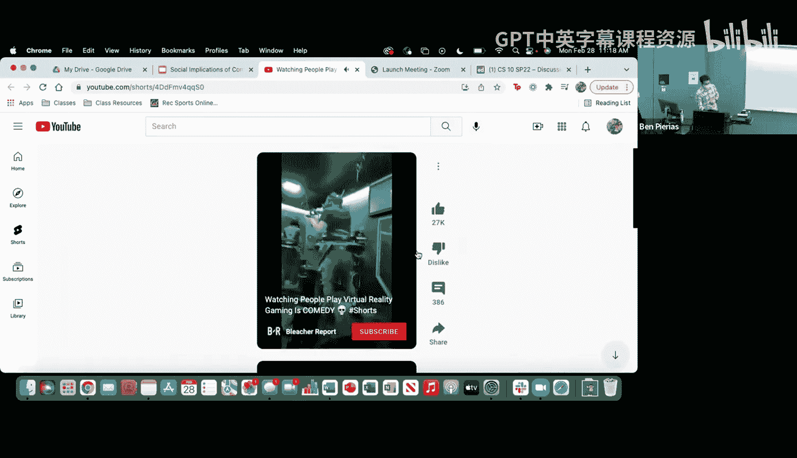

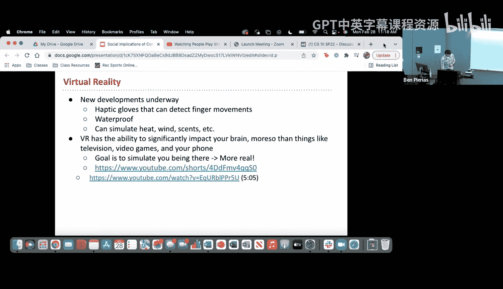

上一节我们介绍了技术社会影响的普遍重要性，本节中我们来看看虚拟现实技术。

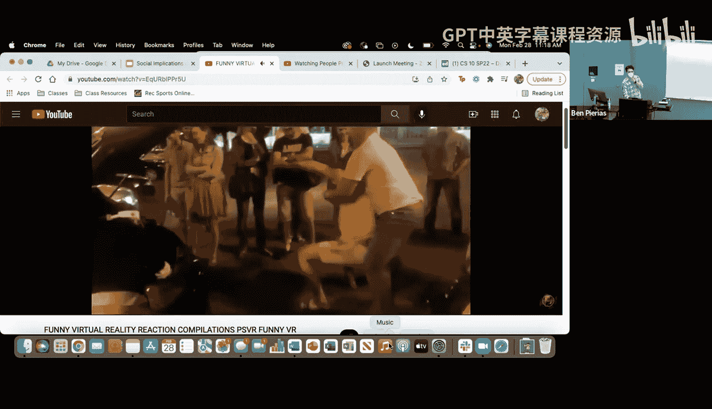

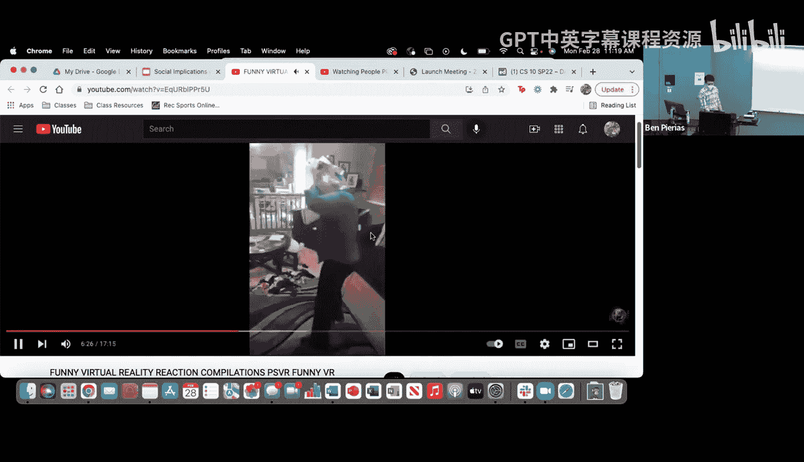

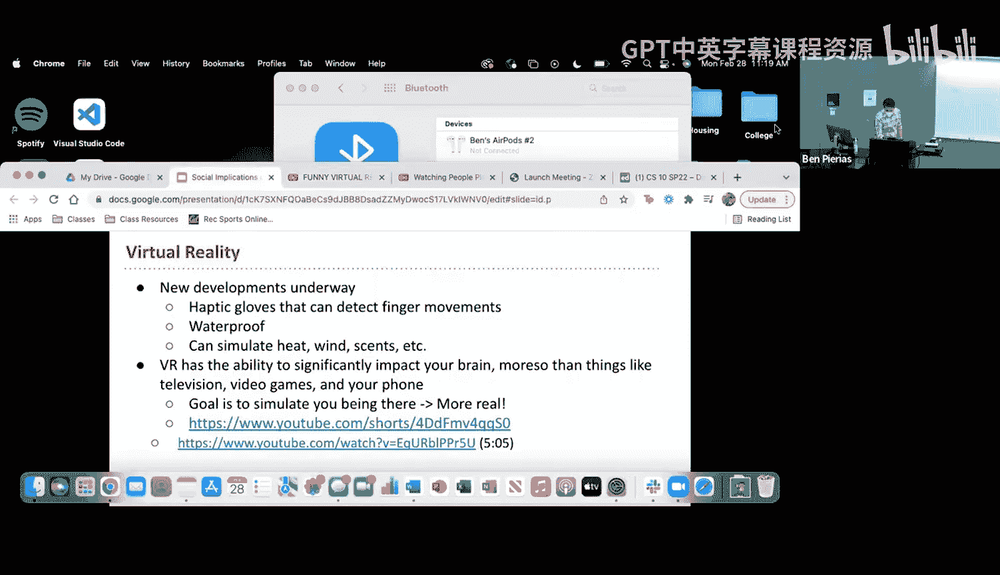

虚拟现实本质上是一种头戴式设备，它能阻挡所有外部光线，并通过镜头向你投射视频，让你感觉仿佛身临其境。它还具有传感器，可以追踪头部运动，从而模拟视频中的移动。近年来，VR的普及度和可及性不断提高。

VR技术也在不断发展，例如触觉手套可以检测单个手指的运动，还有防水VR设备，甚至有一种面具可以在嘴部模拟加热、吹风等天气感觉。由于VR的沉浸感极强，它比电视、视频游戏或手机更能显著影响你的大脑，因为VR的目标是模拟你真实在场的感觉，这使得大脑更难区分现实与虚拟世界。

这既带来积极影响，也有消极影响。但在此之前，让我们观察一些例子。

从这些视频中可以看出，VR比电视或手机更容易引发用户的情感反应。尽管VR有许多酷炫的应用，但也存在一些负面影响。常见的问题包括眼睛疲劳、头痛和恶心。VR最大的威胁是现实世界中的伤害，这通常发生在使用者混淆现实与虚拟世界，并做出虚拟世界中的相关动作时。

一些VR设备正试图通过引入安全区功能来解决这个问题，你可以在VR空间中划定一个安全区域，当你接近边界时会收到警报。

除了游戏和娱乐，VR在教育领域也有许多应用。研究表明，“临场感”能提高学习和记忆效果，而VR的整个目标就是构建更好的临场感。许多高中甚至大学课程已经开始引入VR实验室，让学生可以进行通常无法完成的实验。

沃尔玛使用VR培训员工应对“黑色星期五”，体育团队也利用VR练习比赛场景。医疗保健领域同样在利用VR，外科医生通过VR练习不同的手术方案。一项研究显示，新手使用VR模拟进行腹腔镜手术，其表现水平能提高到相当于有经验的中级外科医生的程度。

VR在消除偏见方面也有出色应用。斯坦福大学的虚拟人类交互实验室发现，以老年人虚拟形象度过一段时间，会显著影响一个人对老年人的态度。加州大学旧金山分校的“Cultivate”项目正在研究这方面，该项目让你体验一位经历疼痛和健康问题的中年黑人女性的虚拟形象。

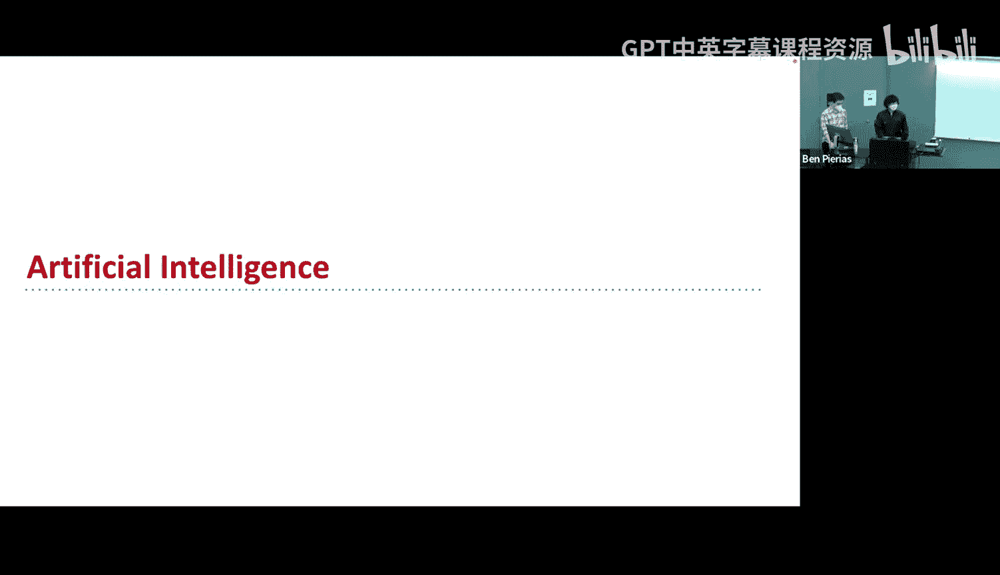

VR在治疗方面也非常有效，特别是针对恐惧症，因为它可以让用户暴露在恐惧中而不必承担实际风险。它还能有效减少老年人的抑郁、焦虑和记忆障碍。

最后不能不提“元宇宙”。它基本上是一个大规模的虚拟世界，你可以将其视为一个虚拟的互联网空间，用于获取信息、玩游戏、看电影等。许多人认为这将是下一个重大趋势。

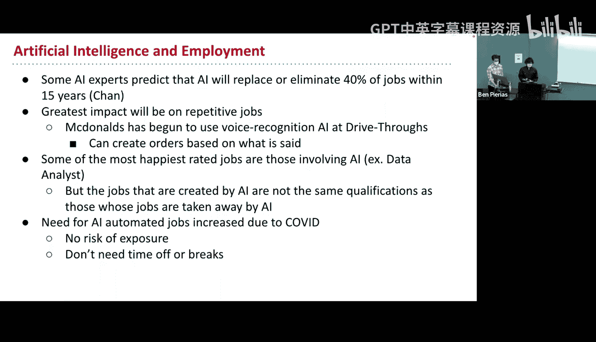

## 人工智能（AI）🤖

上一节我们探讨了虚拟现实，本节中我们来看看人工智能。

人工智能正被用于取代大量劳动力。一些专家预测，在未来15年内，AI将取代或淘汰40%的工作岗位。这种影响主要集中在重复性、技能要求较低的工作上。

人工智能的另一个热门话题是自动驾驶汽车。驾驶行为本身对计算机来说可能并不极其困难，但其中涉及许多瞬间的道德决策。一个重大的道德困境是：如果一辆自动驾驶汽车即将撞上某物，它有两个选择：要么撞上去导致车内人员死亡，要么转向避开但可能撞死一群行人。如何将这种道德决策编码到计算机中是一个大问题。

人工智能的另一个重要问题是其变得越来越具有侵入性，能够从已知信息中推断出更多关于我们的信息。例如，通过分析Instagram帖子来诊断用户是否患有抑郁症。人工智能最令人惊叹的应用之一是脑机接口，即将设备植入大脑，让你能够控制外部技术。

然而，当涉及AI和隐私时，情况可能变得可怕。如果这些信息被黑客入侵怎么办？随着我们对AI的依赖加深，拥有良好的计算机安全变得至关重要。

## 在线隐私与数据🔒

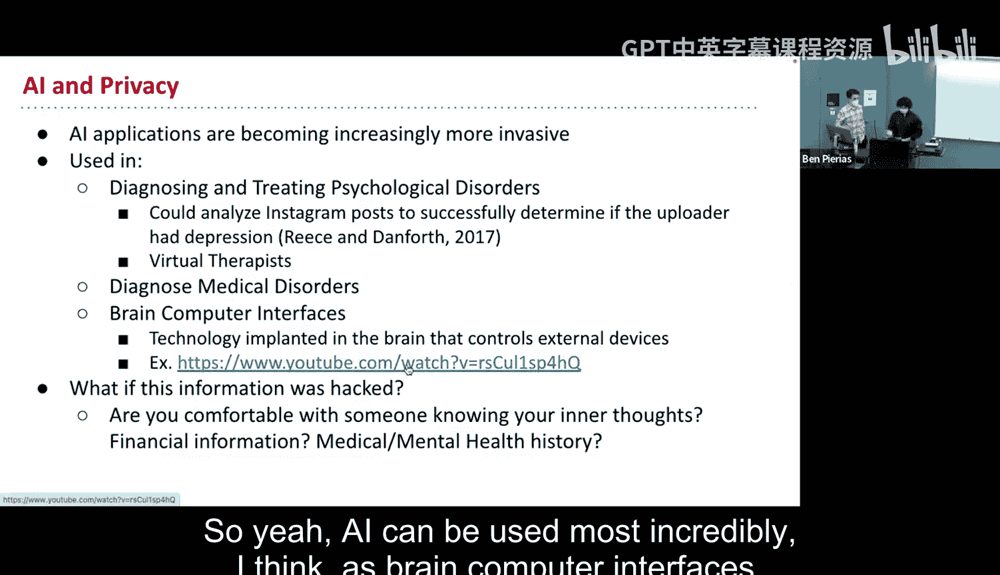

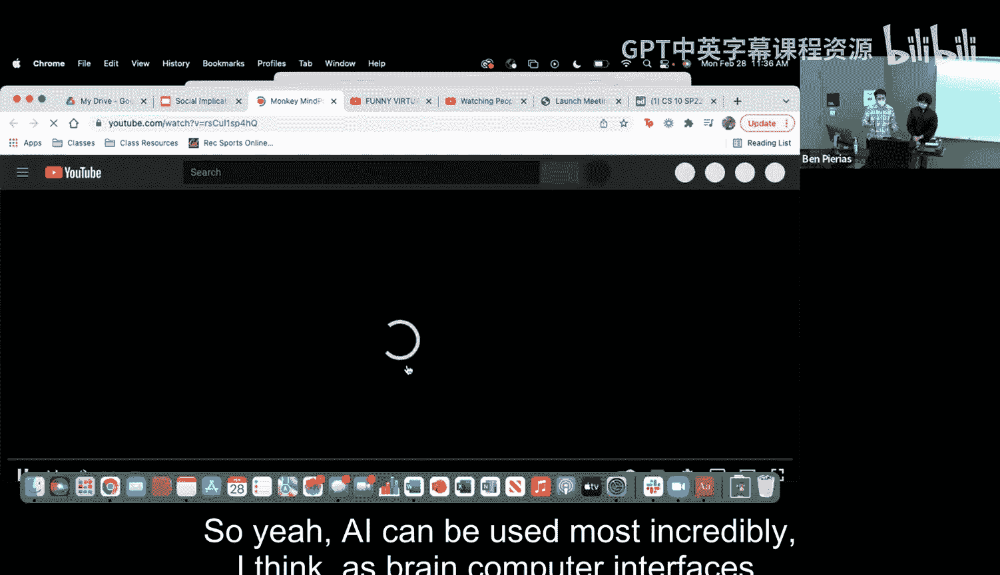

上一节我们讨论了人工智能的潜力与风险，本节中我们来看看与之紧密相关的在线隐私问题。

我们生活在一个“监控资本主义”的时代。公司非常重视我们的数据，并积极存储、出售它们。谷歌会追踪你通过其服务进行的所有购买。三星智能电视的语音识别功能会捕获并传输包含个人或敏感信息的语音数据给第三方。

有一篇有趣的博客文章提到，作者试图利用Facebook拥有的数据来创建广告，以展示Facebook对你的了解程度。这些广告显示了你的位置、生活方式、习惯等信息。

另一个例子涉及大学招生。许多大学网站会追踪访客数据，记录你查看了哪些页面，并计算出一个“亲和力指数”，即你入读该校的可能性。这可能会对需要经济援助的潜在学生产生偏见。

当然，数据收集也有其益处。以下是关于数据收集利弊的一些思考：

**弊端：**
*   **数据泄露风险：** 如果公司拥有我们所有的数据，黑客就有可能获取并利用这些信息。
*   **个性化信息茧房：** 算法可能会向你展示越来越符合你现有观点的内容，限制你接触不同信息。

**益处：**
*   **个性化体验与服务：** 例如，社交媒体上的广告可能更贴合你的兴趣。
*   **紧急情况下的应用：** 位置追踪可用于在自然灾害或绑架等紧急情况下寻找人员。

## 技术与社交支持📱

现在我们已经讨论了隐私问题，让我们谈谈技术与社交支持。

研究发现，幸福感的首要预测因素是我们与主要相处对象的关系，以及我们在这些关系中感受到的被接纳程度。这更多地强调关系的质量而非数量。这对于压力时期的大学生尤其重要。

然而，在线交流可能无法提供我们获得幸福和应对压力所需的强大社交支持。一项研究发现，面对面交流与生活质量呈正相关，而在线交流则呈负相关。考虑到我们有两年的时间几乎完全依赖在线交流，这一点尤其值得深思。

既然面对面的社交沟通如此重要，为什么手机会如此令人上瘾？许多手机应用实际上是模仿赌场老虎机设计的，它们使用明亮色彩吸引你，下拉刷新就像中奖一样带来新信息。

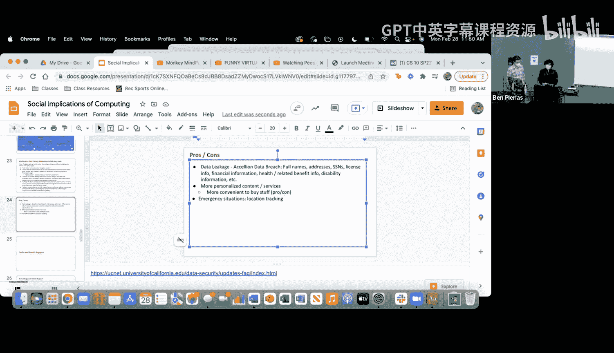

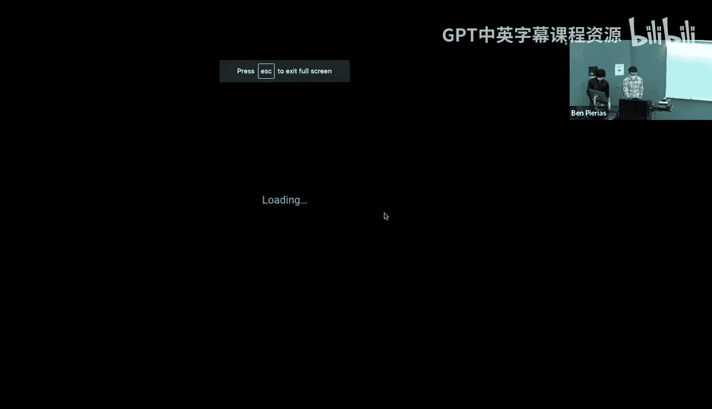

手机现在是否是社会的必要组成部分？没有手机，一个人能否真正生活下去？思考一下一天不用手机有多难。这可能对于学业成功和正常工作来说是必要的。

手机令人上瘾的另一个原因是，应用程序有经济义务让你停留在它们的产品上。大多数科技产品通过应用内的广告获利，因此屏幕使用时间越长，公司赚的钱就越多。例如，YouTube的自动播放功能、利用机器学习推送你感兴趣的内容等，都是为了延长你的使用时间。

## 技术与自然🌳

上一节我们探讨了技术与社交的关系，本节我们来看看技术与自然的联系。

近年来，抑郁和焦虑的发病率与过去80年相比有所上升。很多人问这是为什么。想想100年前，疾病、饥饿、饥荒和死亡比今天普遍得多，但抑郁和焦虑的发病率却低得多。你认为这是为什么？

许多人提出，原因之一是我们祖先与自然的接触。研究表明，心理健康状况较差的人从自然漫步中获得的益处大于在城市环境中行走。自然对那些压力更大的人更具恢复作用。那些在自然中行走90分钟的人，其大脑中与“反刍思维”（反复思考负面经历）相关的区域活动会减少。

## 总结

在本节课中，我们一起探讨了计算技术广泛的社会影响。我们了解了虚拟现实如何提供沉浸式体验但也带来风险，人工智能如何改变就业和引发伦理困境，在线隐私如何被权衡以换取便利，技术如何影响我们的社交幸福感，以及接触自然对心理健康的重要性。

关键要点是，在创造和使用技术时，我们需要有意识地权衡其利弊。试着减少盯着屏幕的时间，多去享受外面的世界。如果你对这些话题感兴趣，可以考虑选修相关课程以深入了解。

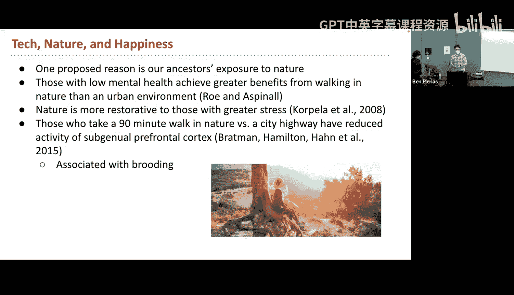

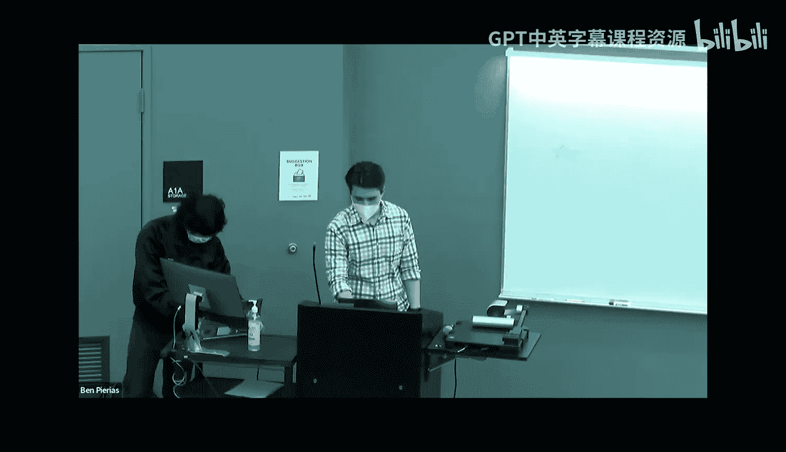

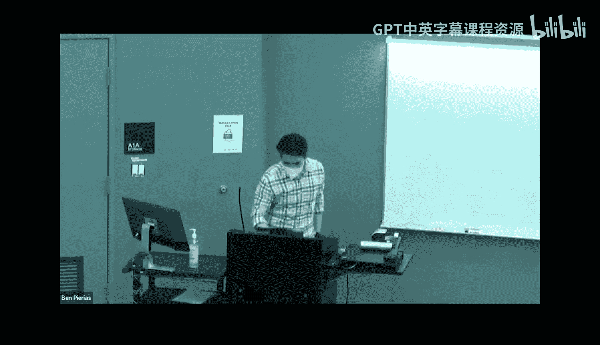

---
**本节课中我们一起学习了：**
*   计算技术社会影响的普遍重要性。
*   虚拟现实（VR）的应用、益处与风险。
*   人工智能（AI）在自动化、伦理和脑机接口方面的进展与挑战。
*   在线隐私的数据收集实践及其利弊。
*   技术对社交支持质量和心理健康的影响。
*   接触自然对心理健康的积极益处。