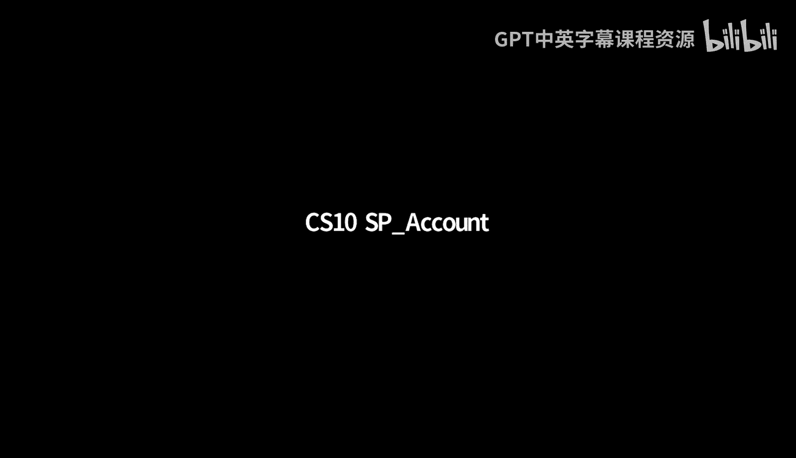
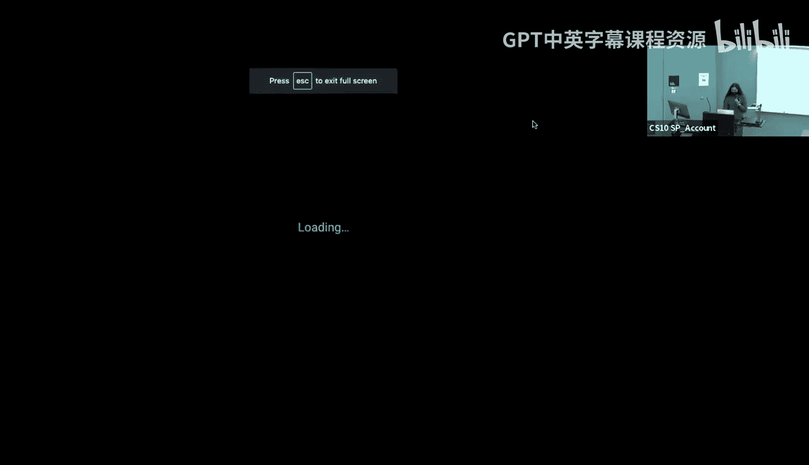
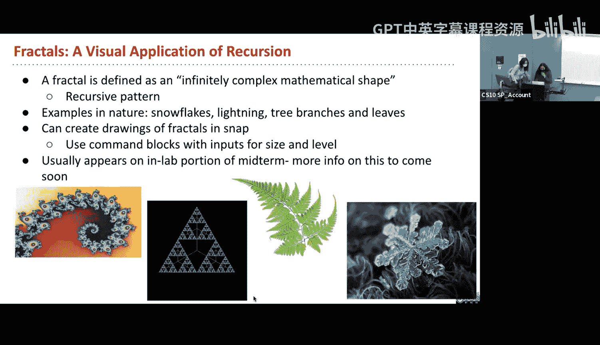

# 12：递归 II - 找零问题







在本节课中，我们将深入学习递归，特别是被称为“树递归”的进阶概念。我们将通过一个经典的“找零问题”来理解如何在一个函数中进行多次递归调用，并探讨递归相对于迭代的优势。课程最后，我们还会简要介绍分形，作为递归的一种可视化应用。

---

## 概述：什么是递归？

上一节我们介绍了递归的基本概念。简单来说，递归是一种在函数定义中调用自身的技术。它通过将复杂问题分解为更小的、结构相似的子问题来解决原问题。递归通常包含一个或多个**基础情况**（直接返回结果，无需进一步递归）和一个或多个**递归情况**（调用自身处理更小的输入）。

## 递归的核心：基础情况与递归情况

在编写递归函数时，遵循清晰的步骤至关重要。

**第一步：确定基础情况**
基础情况是问题的最简单形式，无需进一步递归即可直接求解。例如，在计算列表元素之和时，空列表的和就是0；在计算阶乘时，1的阶乘就是1。基础情况是递归的“停止点”，确保函数不会无限循环。

**第二步：设计递归情况**
递归情况处理所有非基础情况。其核心思想是：假设函数已经能够解决更小版本的同一问题（递归的“信仰之跃”），然后利用这个结果来构建原问题的解。这通常可以分解为三个子步骤：
1.  **拆分**：将原问题分解为一个或多个更小的子问题。
2.  **调用**：递归地调用函数自身来解决这些子问题。
3.  **合并**：将子问题的解组合起来，得到原问题的解。

---

## 示例一：阶乘函数

让我们通过阶乘函数 `n!` 来具体理解这些步骤。其数学定义 `n! = n * (n-1) * ... * 1` 本身就具有递归性，因为 `n! = n * (n-1)!`。

**基础情况**：当 `n = 1` 时，`1! = 1`。这是最简单的情况。

**递归情况**：对于 `n > 1`，我们可以利用 `n! = n * (n-1)!` 这个关系。
*   **拆分**：将计算 `n!` 拆分为计算 `n` 和 `(n-1)!`。
*   **调用**：递归调用 `factorial` 函数计算 `(n-1)!`。
*   **合并**：将 `n` 与 `(n-1)!` 的结果相乘。

在 Snap! 中的代码实现如下：
```
报告 如果 (n = 1) 那么 (1) 否则 (n * factorial(n - 1))
```

---

## 树递归与找零问题

上一节我们介绍了单一路径的递归。本节中我们来看看**树递归**，即在一个递归函数中多次调用自身，形成像树一样的调用结构。

### 问题定义：找零问题

找零问题是：给定一个金额（例如 15 美分）和一组硬币面额（例如 [25, 10, 5, 1] 代表 quarter, dime, nickel, penny），计算**有多少种不同的方式**可以用这些硬币凑出该金额。假设每种硬币数量无限。

例如，用硬币 [1, 5, 10, 25] 凑 5 美分，有两种方式：1个5美分，或5个1美分。

### 解决思路：分类与递归分解

解决此问题的关键在于对**所有可能的找零方式**进行分类。对于任意金额和硬币列表，任何一种找零方案必然属于以下两类之一：
1.  **使用了列表中的第一种硬币**。
2.  **完全没有使用列表中的第一种硬币**。

这两类情况覆盖了所有可能性，且没有重叠。因此，总方案数等于这两类情况的方案数之和。

### 递归实现

基于上述分类，我们可以设计递归函数 `count_change(amount, coins)`。

**基础情况**：
1.  如果 `amount = 0`，这表示我们已经恰好凑齐了金额，存在 **1 种**方案（即不使用任何硬币）。
2.  如果 `amount < 0`，这表示我们超额使用了硬币，是无效方案，返回 **0**。
3.  如果 `coins` 列表为空，表示没有可用的硬币了，无法凑出任何正数金额，返回 **0**。

**递归情况**：
我们需要计算上述两类情况的方案数之和。
*   **不使用第一种硬币**：方案数等于用**剩余的硬币**（`all but first of coins`）凑出原金额 `amount` 的方案数。即 `count_change(amount, all but first of coins)`。
*   **使用第一种硬币**：如果我们决定使用一个面值为 `first(coins)` 的硬币，那么剩余的金额就变成了 `amount - first(coins)`。方案数等于用**所有硬币**（因为硬币数量无限，第一种硬币可以继续使用）凑出这个新金额的方案数。即 `count_change(amount - first(coins), coins)`。

因此，总方案数为两者之和。

在 Snap! 中的核心递归逻辑如下：
```
报告 (count_change(amount - first(coins), coins) + count_change(amount, all but first of coins))
```

### 为何这是树递归？

因为每次递归调用都会产生**两个**新的递归调用分支（一个“使用”，一个“不使用”），这些调用又会继续分叉，直到全部到达基础情况。整个调用过程形如一棵树。

### 递归的威力

试想如果用循环迭代来解决此问题，我们需要遍历所有硬币组合的可能性，代码会非常复杂且低效。递归优雅地将“遍历所有组合”这个复杂任务，抽象为对两个更小子问题的求解，极大地简化了思维和代码。

---

## 递归的应用：分形简介

递归不仅用于计算问题，还能生成美丽的图形，例如**分形**。分形是一种在不同尺度上重复出现相似模式的几何形状，例如雪花、海岸线等。

在 Snap! 中，我们可以使用 `pen` 绘图指令和递归来绘制分形。通常，分形函数接受 `size`（大小）和 `level`（递归深度）作为参数。当 `level` 为 0 时，绘制一个基础图形（如一条线段）；当 `level > 0` 时，则用更小的尺寸多次递归调用自身来绘制更精细的结构。这生动地体现了递归“自相似”和“分解”的思想。

---

## 总结

本节课中我们一起深入学习了递归。
1.  我们回顾了递归的**基础情况**与**递归情况**，并通过阶乘例子巩固了“拆分-调用-合并”的思维模式。
2.  我们重点探讨了**树递归**，通过经典的**找零问题**，学习了如何通过将问题分解为“使用第一个元素”和“不使用第一个元素”两类互斥的子问题来设计递归解决方案。
3.  我们理解了递归在解决某些复杂问题（如组合计数）时，相比迭代具有思维和代码上的简洁性优势。
4.  最后，我们简要了解了递归在生成**分形**图形中的应用，看到了递归思想的视觉体现。



掌握递归的关键在于信任“递归的信仰之跃”——相信函数能正确解决更小的子问题，并专注于如何利用这些子问题的解来构建原问题的解。