# 15：从 Snap! 到 Python I


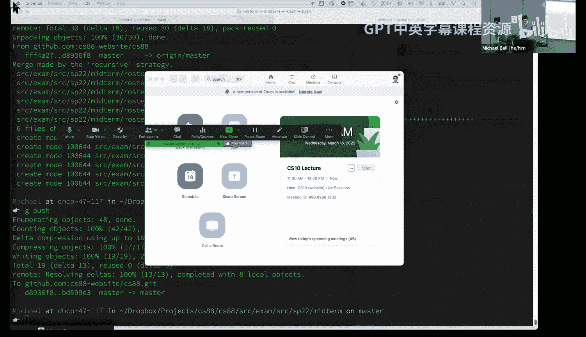

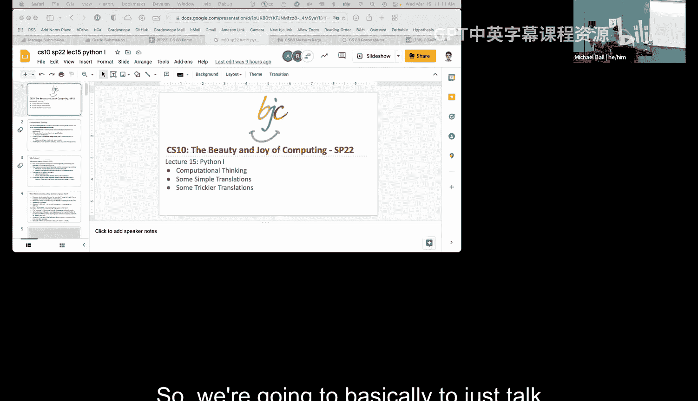

在本节课中，我们将学习如何从 Snap! 编程环境过渡到 Python 语言。我们将探讨两者的相似与不同之处，并通过具体示例展示如何将 Snap! 中的概念和代码翻译成 Python。我们的目标是理解编程的核心思想如何在不同语言间迁移，并为后续学习打下基础。

## 课程概述与目标

上一节我们介绍了课程的中期情况。本节中，我们来看看为何要学习 Python，以及它与 Snap! 的关系。

在 CS10 课程中，我们首先学习 Snap!，然后过渡到 Python，这具有重要的教育意义。与许多专注于特定技能的编程训练营不同，本课程旨在传授**计算思维**等核心理念。这些理念，如**抽象**（通过创建带参数的函数来移除细节、实现通用化）、**精确性**（拥有明确的规范）以及**迭代开发**（编写代码、查看结果、调试改进），在 Snap! 和 Python 中是相通的。

学习 Python 有非常实际的原因。对于希望继续学习计算机科学（如 Data 8, CS 61A）的同学，这几周的内容将为你提供一个良好的开端。即使计算机科学并非你的专业方向，但如果你想进行游戏开发、学术研究或数据分析，Python 也是一个强大的通用工具，广泛应用于物理、生物甚至艺术史等领域。

此外，我们还将初步接触**终端**（命令行界面）的使用，并了解 Python 庞大的**开源库**生态系统。Python 在某些任务上比 Snap! 更便捷（例如数据处理），而 Snap! 在图形和精灵交互方面则更直观。理解两者的优劣能帮助我们选择合适的工具。

## 编程语言类比：语法、习语与词汇

学习第二门编程语言在某些方面类似于学习第二门书面语言，但希望会更容易一些。

以下是两者的一些可比之处：
*   **语法**：编程语言中构成条件、循环、函数的结构在不同语言间非常相似。
*   **习语与风格**：特定编程语言的惯用风格和模式可能颇具挑战性。从“写出能运行的 Python 代码”到成为“精通 Python 的专家工程师”之间有很长的路要走，但 CS10 的目标是前者。
*   **词汇**：编程术语的差异通常比自然语言小。例如，Snap! 中的 `map`、`keep` 和 `combine` 在 Python 中对应 `map`、`filter` 和 `reduce`。
*   **字符集**：我们主要使用罗马字符集进行编程。

关键在于，在 Snap! 中学到的**计算思维**能够帮助你学习 Python，进而帮助你学习 Java、JavaScript 或任何其他语言。

## Python 工作流程：终端与文件

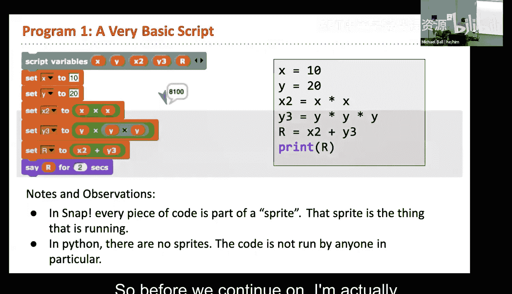

在 Snap! 中，我们在浏览器中编写和运行代码。Python 则是一个安装在电脑上的程序。Python（以及许多其他编程语言）有两种主要工作模式。

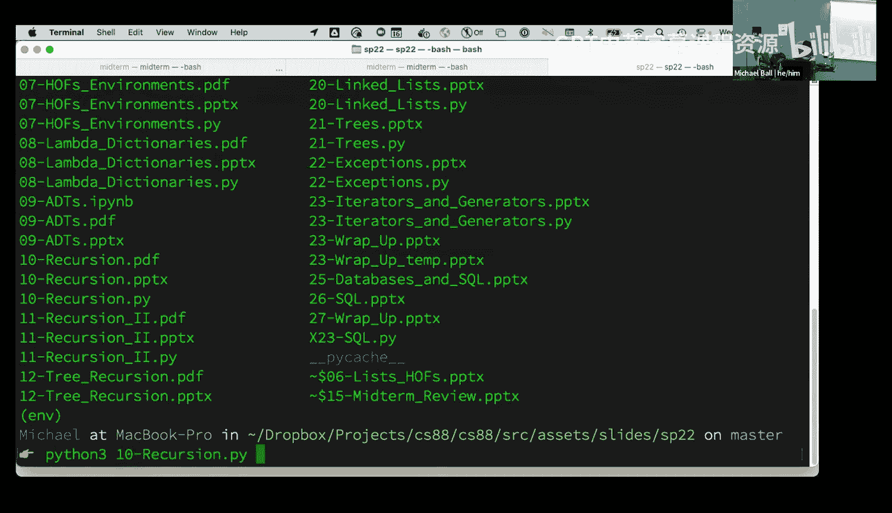

以下是两种模式：
1.  **解释器模式**：类似于 Snap! 的脚本区，可以逐行输入代码并立即看到结果。
2.  **脚本模式**：更典型的模式，即编写并运行一个预先写好的代码文件。

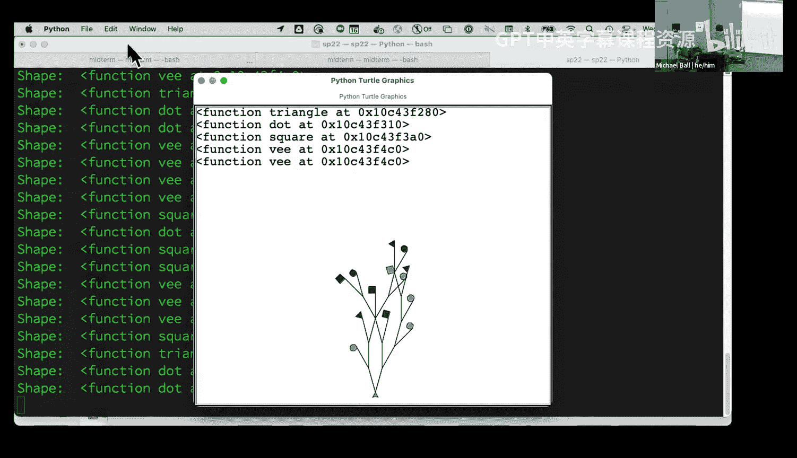

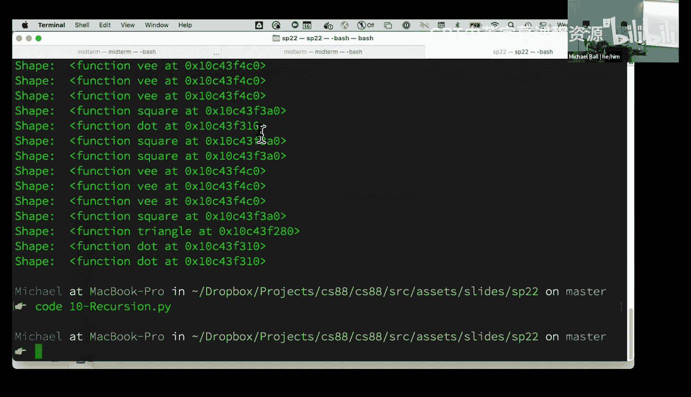

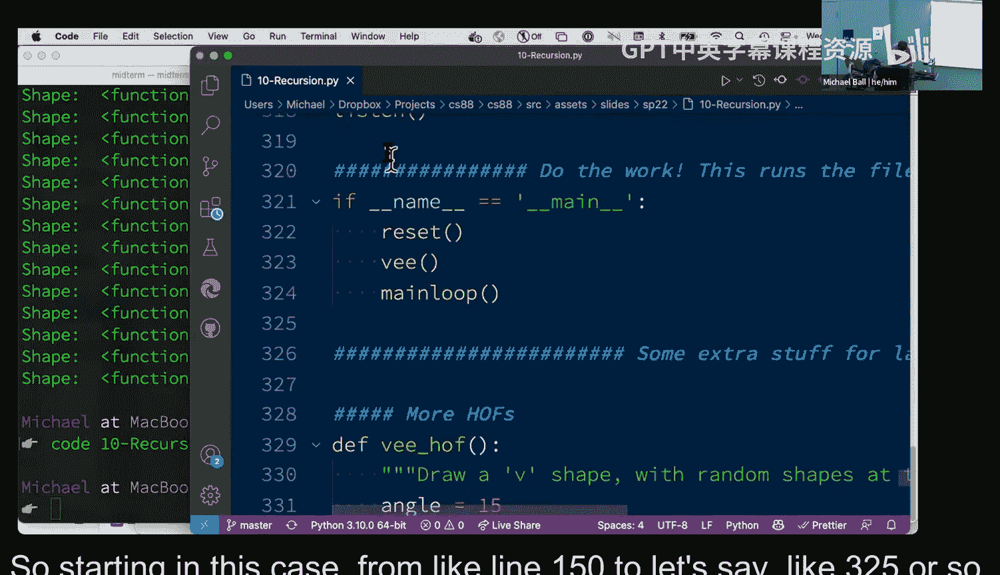

我们将使用**终端**（或命令行）来与 Python 程序交互。通过终端，我们可以导航到文件所在目录，并使用 `python3 文件名.py` 这样的命令来运行 Python 脚本。

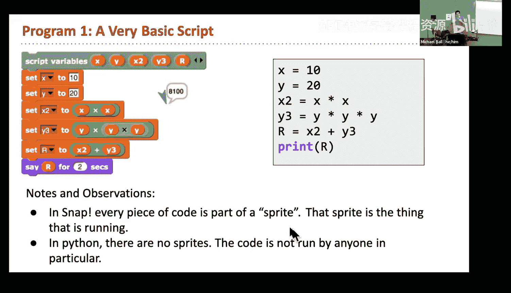

## 基础翻译：变量、运算与输出

现在，我们开始将 Snap! 代码片段翻译成 Python。让我们从最简单的脚本开始。

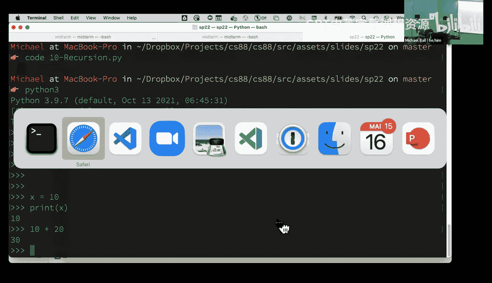

在 Snap! 中，我们使用 `script variables` 块来声明脚本变量。在 Python 中，我们可以直接赋值：
```python
x = 10
y = 20
```
语句 `A = B` 表示将值 `B` 赋给名称 `A`，这等同于 Snap! 中的 `set` 块。我们可以进行运算：
```python
x2 = x * x
```

在 Snap! 中，代码存在于精灵或舞台上，`say` 块会让精灵说出内容。在 Python 中，代码在文件中运行，并通过 `print` 函数将信息输出到屏幕（通常是终端）：
```python
print(x)
```
`print` 在功能上最接近 Snap! 的 `say`，但输出会持续显示在屏幕上，而不会消失。

基本的数学运算符在两者间是对应的：
*   加法：`+`
*   减法：`-`
*   乘法：`*`
*   除法：`/`

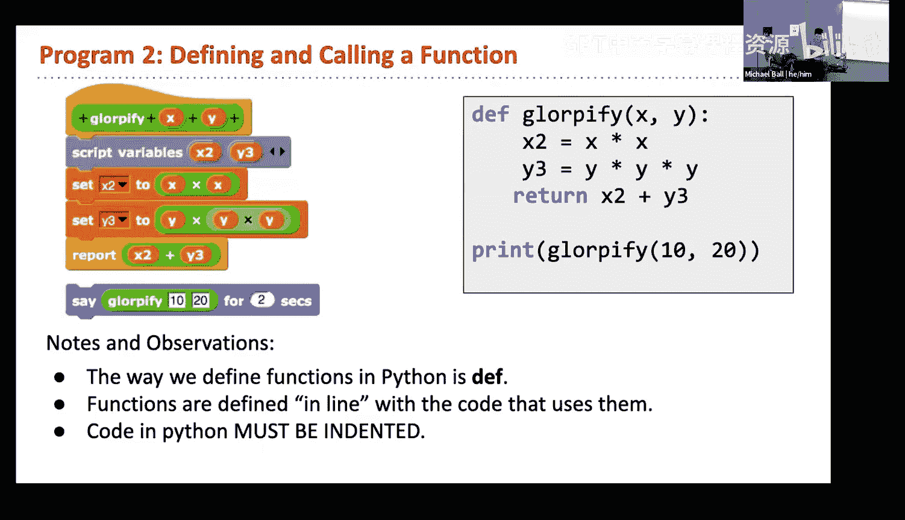

## 定义与调用函数

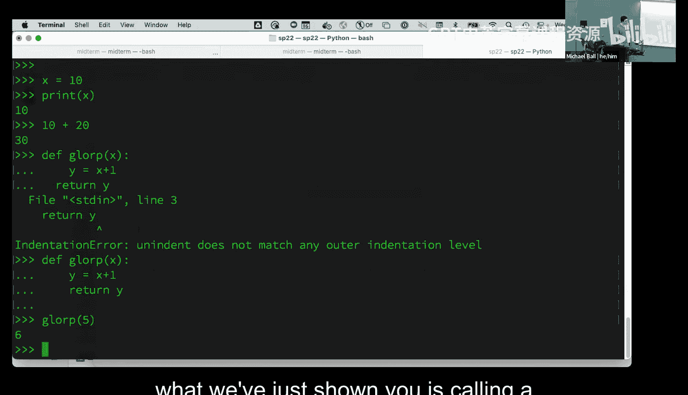

在编程中，构建自己的函数是最重要的活动之一。让我们看看在两种语言中如何操作。

在 Snap! 中，我们点击“制作新的积木”，命名，然后在编辑窗口中定义它。在 Python 中，函数定义在同一个代码文件中。我们使用 `def` 关键字：
```python
def glorify(x, y):
    x_squared = x * x
    y_squared = y * y
    return x_squared + y_squared
```
*   `def` 后跟函数名和括号内的参数（`x, y`），然后是一个冒号 `:`。
*   **缩进**：函数体内的所有代码必须缩进（通常是 4 个空格）。在 Python 中，缩进**极其重要**，它定义了代码块的结构。不一致的缩进会导致错误。
*   **返回**：使用 `return` 关键字来返回一个值，等同于 Snap! 中的 `report` 块。

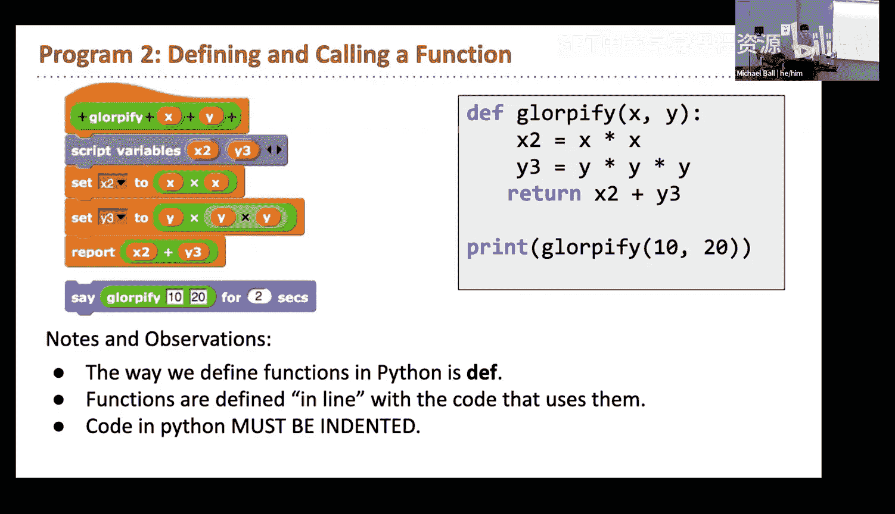

调用函数时，在 Python 中是将参数放在函数名后的括号内：
```python
result = glorify(3, 4)
print(result) # 输出 25
```
这与 Snap! 中调用带参数的积木类似，但注意：在 Snap! 中，参数可能被描述性文本隔开（如 `say ... for ... secs`）；而在 Python 中，所有参数都连续地放在函数调用的末尾。

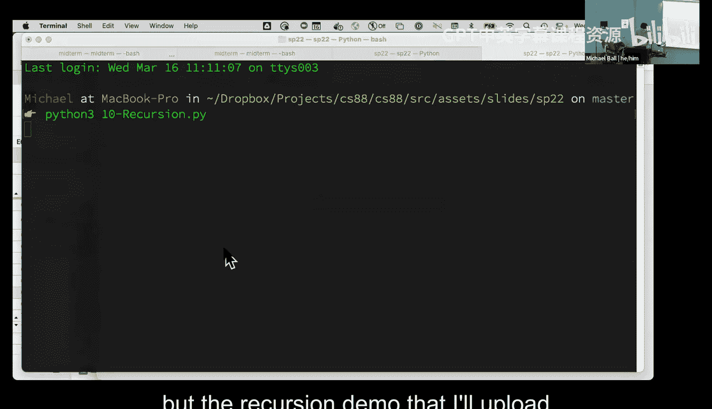

## 条件语句与缩进规则

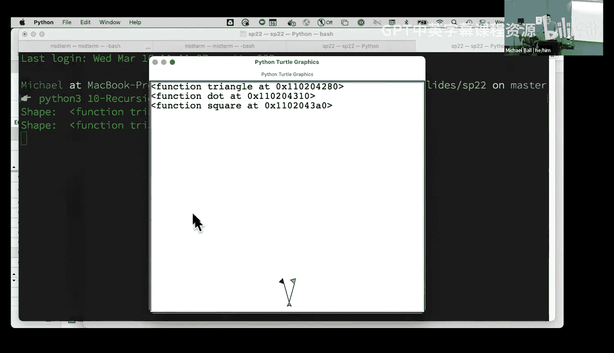

条件判断是编程的核心。让我们看看 `if-else` 语句如何翻译。

在 Snap! 中，我们使用 C 形的 `if-else` 积木。在 Python 中，这对应着缩进的代码块：
```python
def is_even(x):
    if x % 2 == 0:
        return True
    else:
        return False
```
*   `if` 后面跟着一个条件表达式，然后是冒号 `:`。
*   属于 `if` 分支的代码要缩进一级。
*   `else` 后面同样跟冒号，其下的代码也要缩进。
*   **相等比较**：在 Python 中，使用**两个等号** `==` 来检查是否相等。单个等号 `=` 是赋值操作。这是一个常见的错误来源。

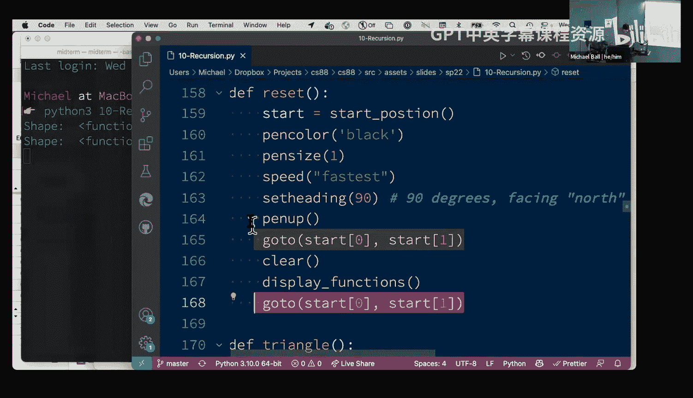

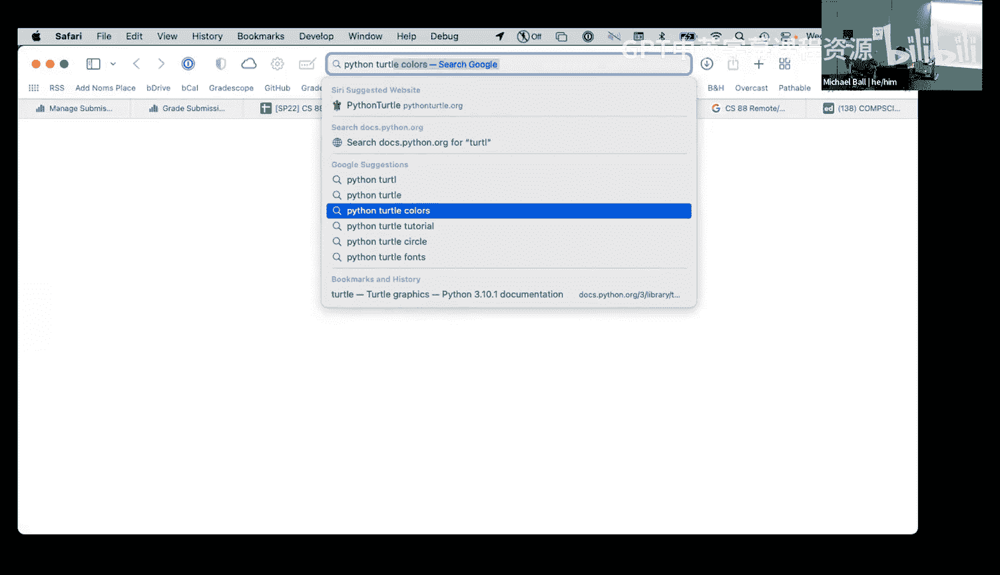

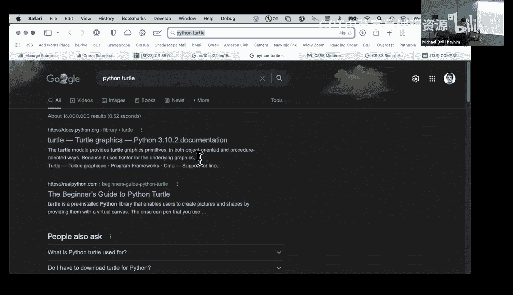

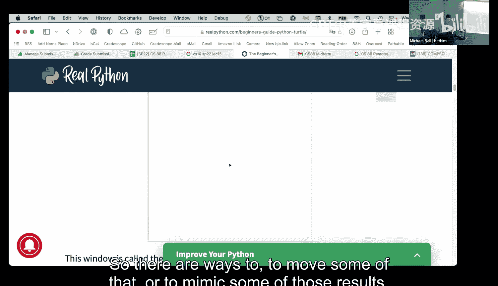

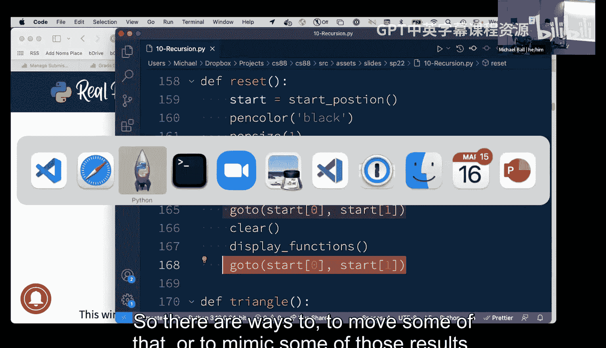

我们可以简化这个函数，因为 `if-else` 本身返回的就是布尔值：
```python
def is_even(x):
    return x % 2 == 0
```
这体现了在 Python 中，只要表达式有效，就可以进行嵌套和组合，就像在 Snap! 的输入槽中嵌套积木一样。

## 用户输入与字符串拼接

与用户交互是程序的重要功能。我们来看看如何获取用户输入。

在 Snap! 中，我们使用 `ask` 积木提问，结果存储在 `answer` 变量中。在 Python 中，我们使用 `input` 函数一步完成：
```python
name = input("What's your name? ")
```
`input` 函数显示提示信息，等待用户输入并按回车键，然后将输入的内容作为字符串返回，我们将其赋值给变量 `name`。

然后，我们可以使用 `print` 输出结果。为了组合文本（字符串），我们使用 `+` 操作符，这类似于 Snap! 中的 `join` 积木：
```python
print("Hello " + name)
```
`print` 和 `input` 是控制台程序与用户交互的基础方式。更复杂的事件处理（如鼠标点击）则依赖于特定的图形库。

## 总结与展望

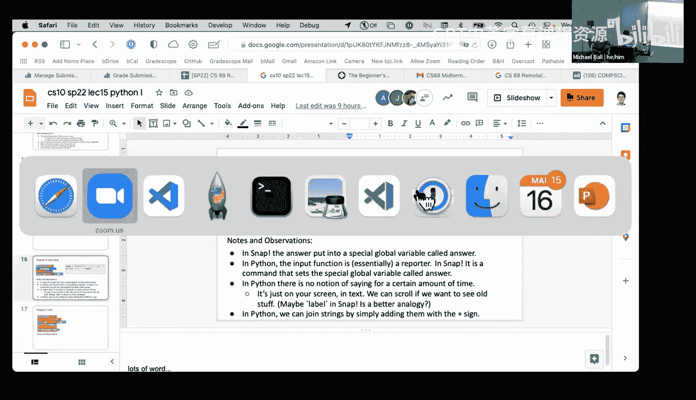

本节课中，我们一起学习了从 Snap! 过渡到 Python 的基础知识。我们探讨了学习第二门编程语言的意义，比较了 Snap! 和 Python 在工作流程、语法上的异同，并实践了变量、运算、函数定义、条件语句以及用户输入等核心概念的翻译。

关键要点包括：Python 使用缩进来定义代码块结构；使用 `==` 进行相等比较；使用 `def` 定义函数，用 `return` 返回值；使用 `input` 获取用户输入，用 `print` 进行输出。

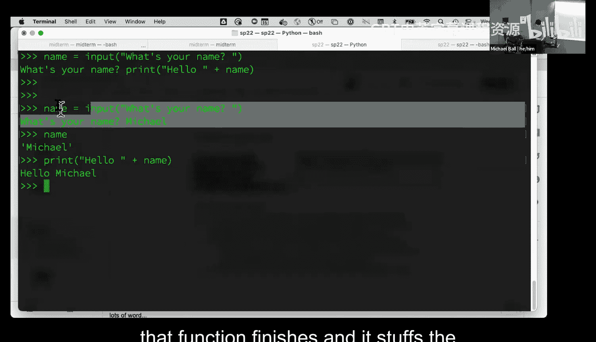

记住，学习新语言不必一次性记住所有语法。就像学习 Snap! 一样，你会随着时间的推移逐渐掌握。如果你想在春假期间练习，可以打开电脑终端，输入 `python3` 进入交互模式，尝试本节课的例子。

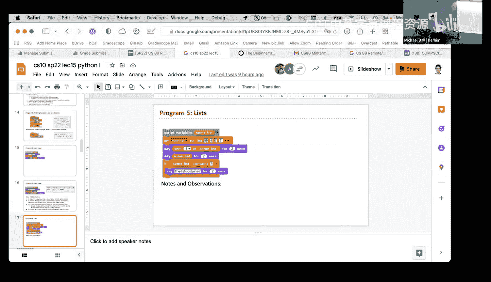

下一节课，在我们春假回来后，将继续深入 Python 的学习，并在实验课上进行实践。祝大家春假愉快！