# 19：Python收尾与高级语法


在本节课中，我们将学习Python面向对象编程的最后几个概念，包括类属性、静态方法以及可变性与不可变性的设计思想。此外，我们还将介绍Python中两个非常实用的语法特性：默认参数/关键字参数和Lambda表达式。这些知识将帮助你更清晰、更高效地编写和阅读Python代码。

## 类属性与实例属性

上一节我们介绍了实例属性，即属于每个具体对象（实例）的属性。本节中，我们来看看另一种属性：类属性。

类属性是属于类本身的属性，被该类的所有实例共享。例如，我们可以在`Time`类中定义一个`start_of_day`属性来追踪一天的开始时间。

```python
class Time:
    start_of_day = 10  # 类属性，假设一天的开始是上午10点

    def __init__(self, hour, minute, second):
        self.hour = hour    # 实例属性
        self.minute = minute
        self.second = second
```

你可以通过类名（`Time.start_of_day`）或实例名（`t1.start_of_day`）来访问类属性。然而，通过实例访问类属性可能会造成混淆，特别是当你尝试通过实例修改它时。

```python
t1 = Time(17, 30, 0)
print(Time.start_of_day)  # 输出: 10
print(t1.start_of_day)    # 输出: 10

# 通过实例修改“类属性”会创建一个同名的实例属性，而不是修改类属性本身
t1.start_of_day = 12
print(t1.start_of_day)    # 输出: 12 (这是t1的实例属性)
print(Time.start_of_day)  # 输出: 10 (类属性并未改变)
```

因此，我们建议：
*   **实例属性**：使用`self.attribute_name`在`__init__`或其他方法中定义。这是你应该主要使用的属性类型。
*   **类属性**：应谨慎使用，并避免通过实例来设置或修改它们，以免引起混淆。

## 静态方法

到目前为止，我们编写的方法都是实例方法，它们操作一个具体的对象实例（通过`self`参数）。但有时，我们需要一些与类相关，但不需要操作具体实例的功能。这时可以使用静态方法。

静态方法使用`@staticmethod`装饰器声明，它不接收表示实例的`self`参数。

假设我们想在`Time`类中添加一个方法，用于计算任意天数对应的总秒数。这个方法不依赖于任何特定的`Time`实例。

```python
class Time:
    # ... 其他代码 ...

    @staticmethod
    def seconds_in_days(n):
        """返回n天中的总秒数"""
        return n * 24 * 60 * 60  # 更清晰，避免直接写86400
```

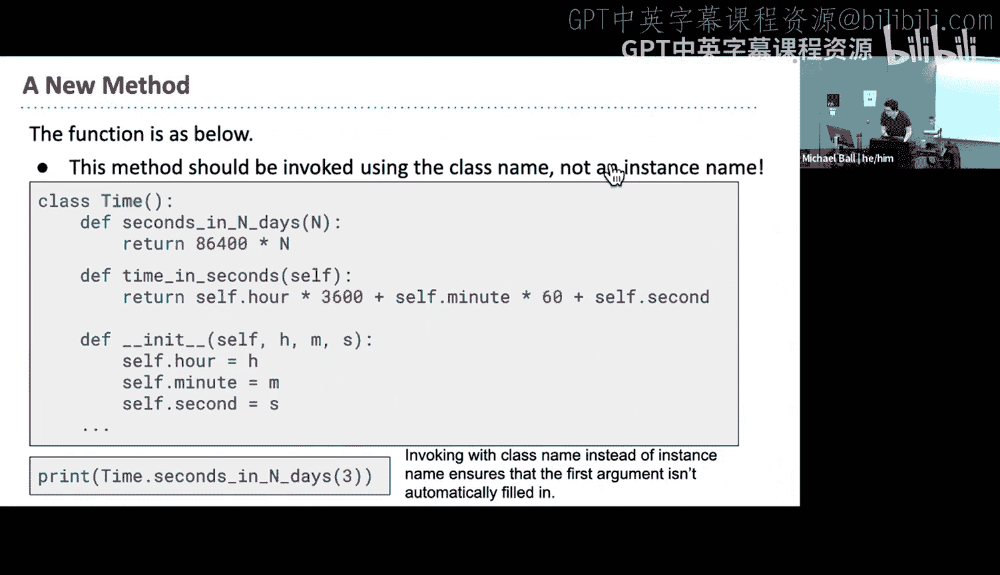

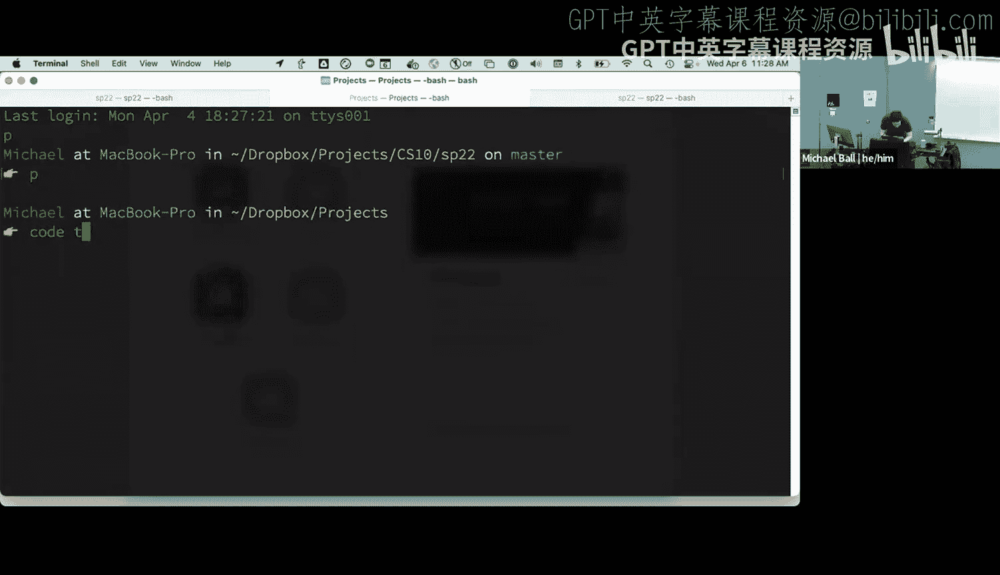

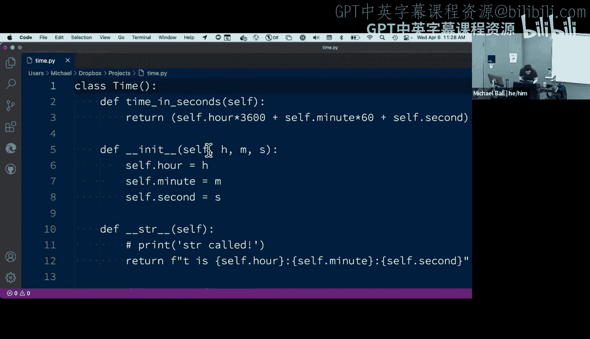

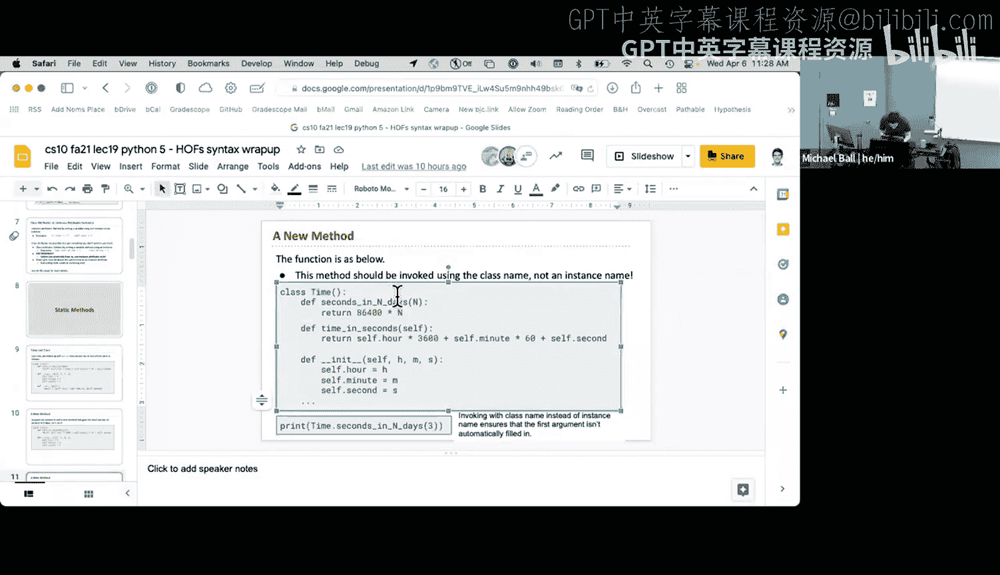

调用静态方法时，既可以通过类名，也可以通过实例名，但通过类名调用更清晰。

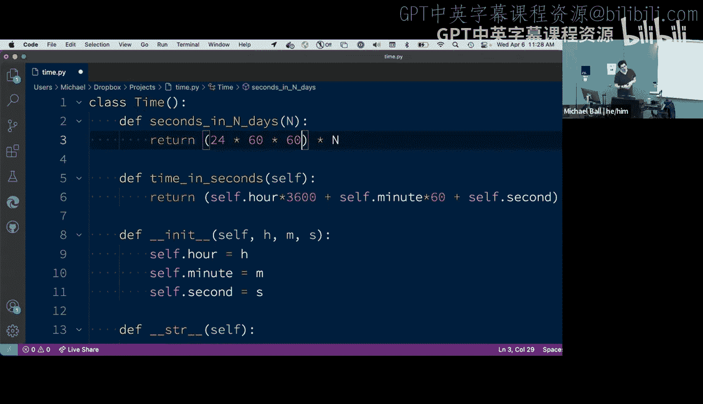

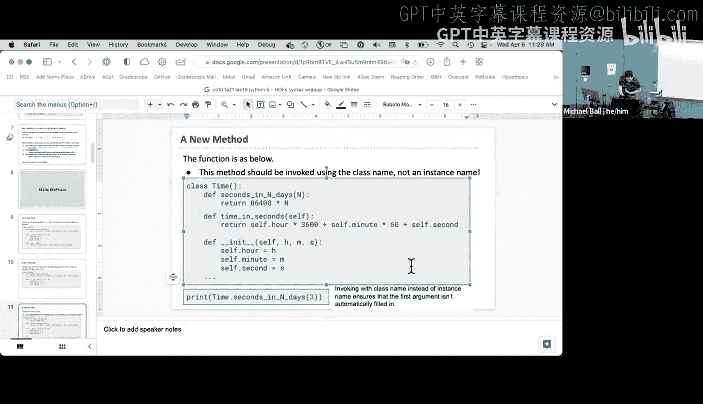

```python
# 推荐：通过类名调用
total_seconds = Time.seconds_in_days(3)
print(total_seconds)  # 输出: 259200

# 也可以（但不推荐）通过实例调用
t1 = Time(10, 0, 0)
total_seconds2 = t1.seconds_in_days(2)  # 这看起来有些奇怪
```

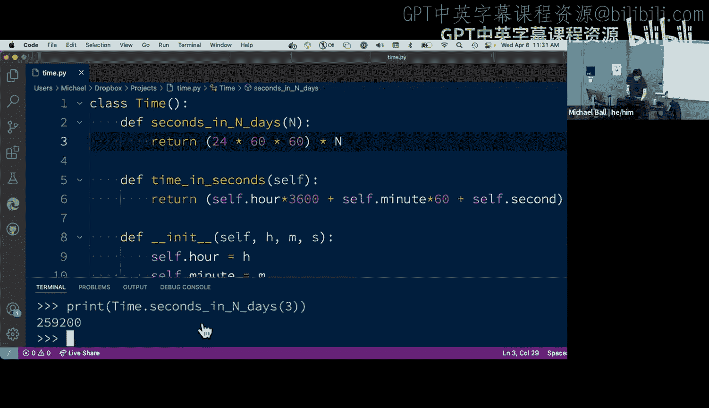

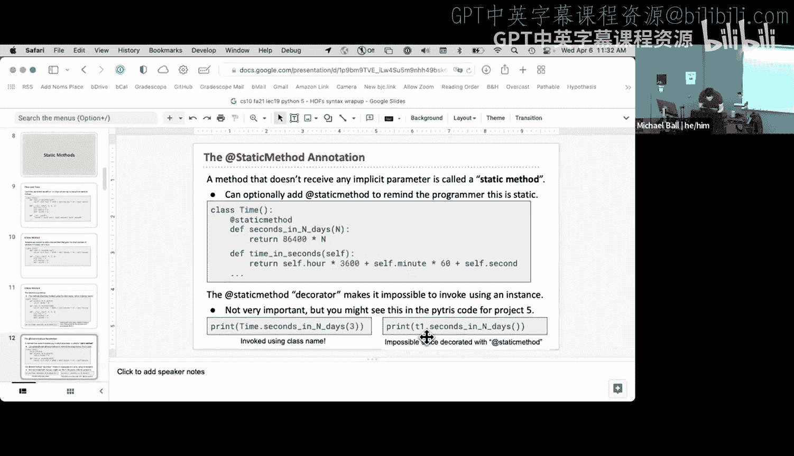

静态方法是一种将相关功能组织在类内的好方法，同时明确表示该功能不依赖于对象的具体状态。

## 可变性与不可变性设计

面向对象编程是管理代码复杂性的工具。其中一个重要的设计决策是：对象应该是可变的还是不可变的？

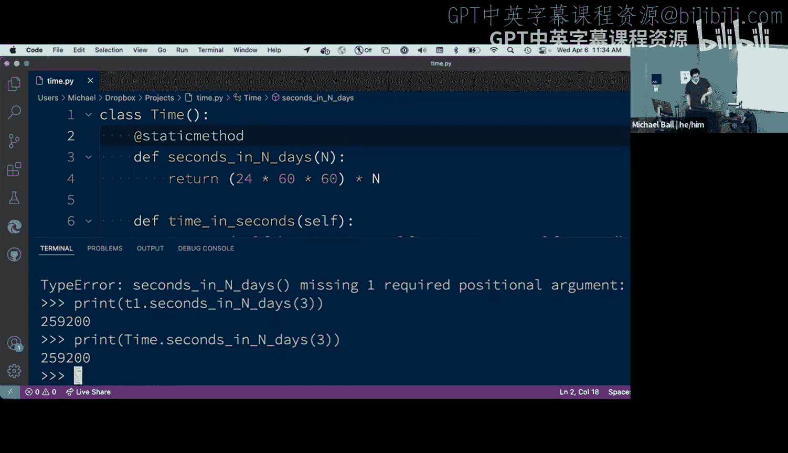

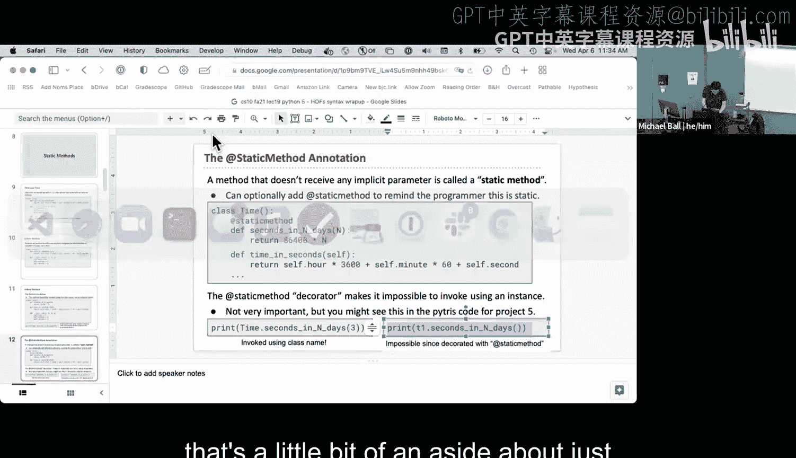

*   **可变对象**：对象创建后，其内部状态可以被修改。
*   **不可变对象**：对象一旦创建，其状态就不能改变。任何“修改”操作都会返回一个全新的对象。

在Python中，我们可以选择如何设计我们的类。例如，为一个`Time`对象实现一个“四舍五入到最近小时”的功能。

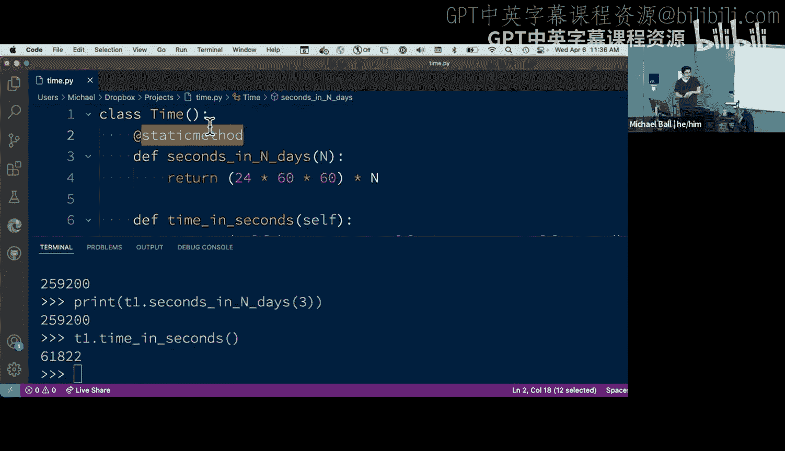

**可变版本（不推荐）**：直接修改当前对象。

```python
def round_to_nearest_hour(self):
    if self.minute >= 30:
        self.hour = (self.hour + 1) % 24
    self.minute = 0
    self.second = 0
    # 没有return，直接修改了self
```

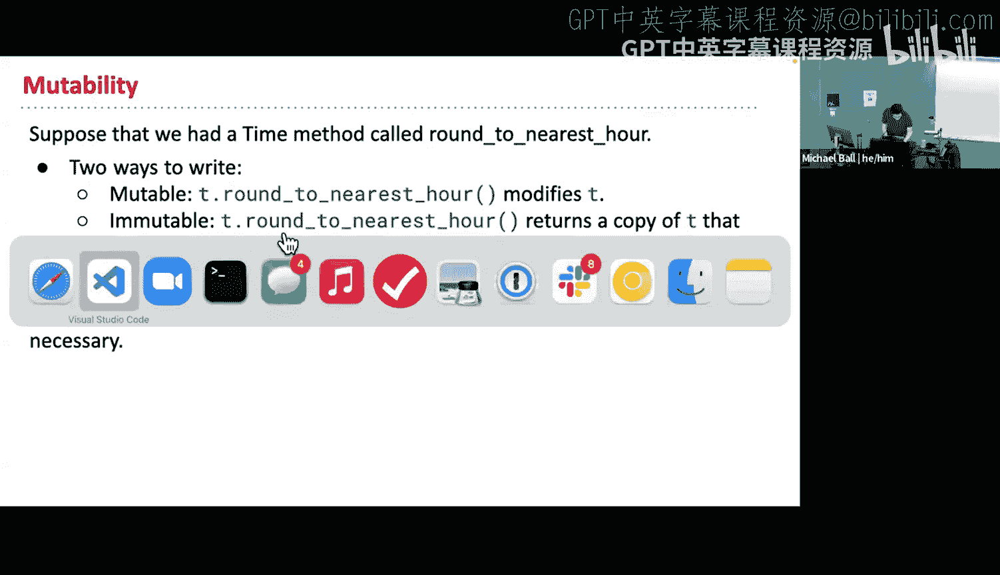

**不可变版本（推荐）**：返回一个新的`Time`对象。

```python
def round_to_nearest_hour(self):
    """返回一个新的Time对象，表示四舍五入到最近小时的时间"""
    if self.minute >= 30:
        new_hour = (self.hour + 1) % 24
    else:
        new_hour = self.hour
    # 返回一个新的实例，原对象self保持不变
    return Time(new_hour, 0, 0)
```

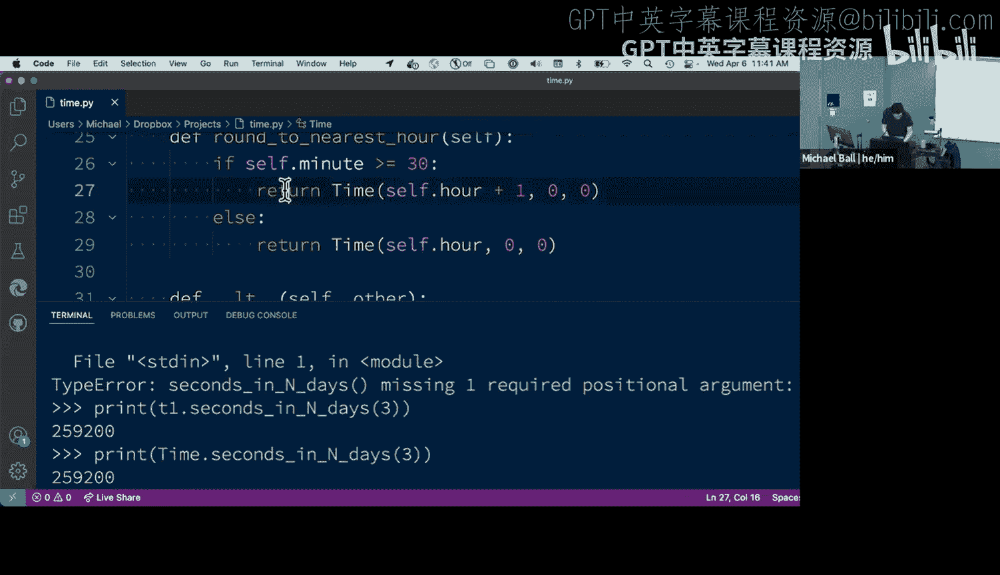

不可变设计的优点在于它使代码的行为更可预测，减少了因共享对象状态而引发的隐蔽错误。当然，在处理大型数据（如很长的列表）时，出于性能考虑，使用可变操作（如`list.append()`）是合理且必要的。但原则是：在可能且合理的情况下，优先选择不可变设计。

## 默认参数与关键字参数

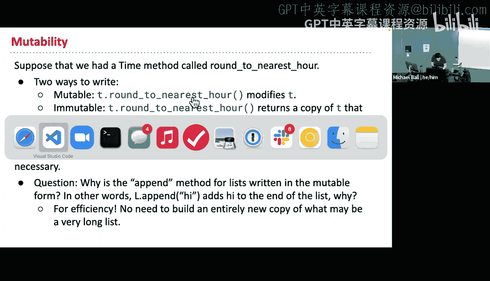

为了让函数调用更清晰、更灵活，Python提供了默认参数和关键字参数。

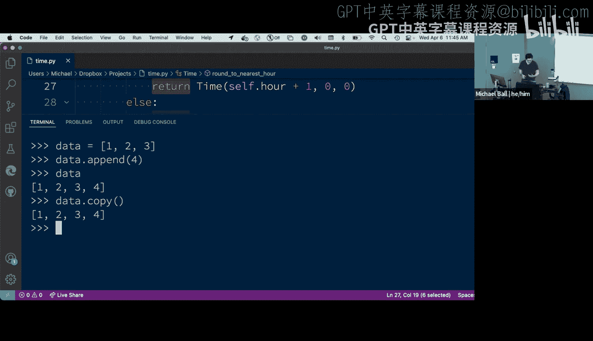

**默认参数**允许你在定义函数时为某些参数指定默认值。调用函数时，如果省略这些参数，则使用默认值。

```python
def triangle(n, step=1, symbol="*"):
    """打印一个由符号组成的三角形"""
    for i in range(1, n+1, step):
        print(symbol * i)

triangle(5)          # 使用默认 step=1, symbol="*"
triangle(7, 2)       # 使用默认 symbol="*"
triangle(7, 2, "#")  # 提供所有参数
```

**关键字参数**允许你在调用函数时，通过参数名来指定值。这有两个好处：一是顺序可以打乱，二是让代码意图更清晰。

```python
triangle(symbol="@", n=6, step=2)  # 使用关键字参数，顺序无关
```

在Snap!中，由于参数被直接嵌入在积木块中并带有标签，其清晰度与关键字参数类似。Snap!同样支持为参数设置默认值。

## Lambda表达式

有时我们需要一个简单的、只用一次的函数，为此专门用`def`去定义会显得繁琐。Python的`lambda`关键字允许我们创建匿名函数（即没有名字的函数）。

Lambda表达式的基本结构是：`lambda 参数: 返回值表达式`。

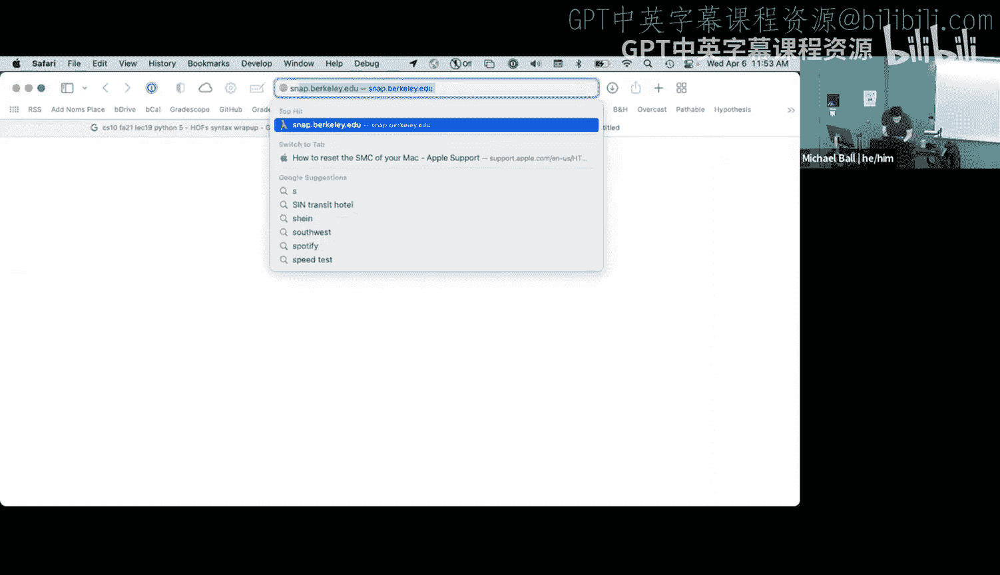

例如，我们之前用`sorted`函数排序时，可以传入一个`key`函数来指定排序依据。使用`lambda`可以简洁地在行内定义这个函数：

```python
words = ["apple", "banana", "cherry", "date"]

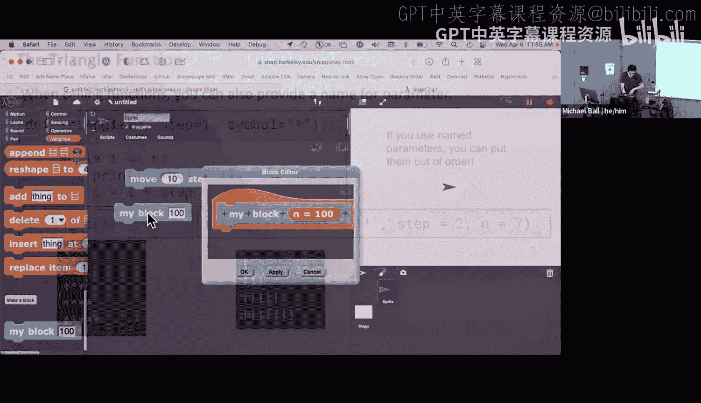

# 按单词长度排序
sorted_by_length = sorted(words, key=lambda word: len(word))
print(sorted_by_length)  # 输出: ['date', 'apple', 'banana', 'cherry']

# 按最后一个字母排序
sorted_by_last_letter = sorted(words, key=lambda w: w[-1])
print(sorted_by_last_letter)  # 输出: ['banana', 'apple', 'date', 'cherry']
```

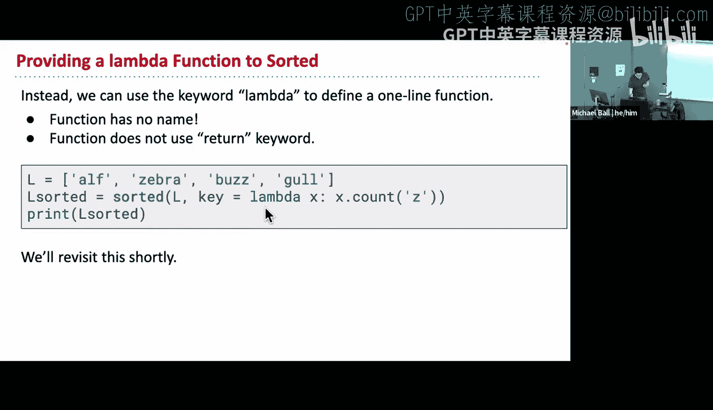


在Snap!中，类似的概念是“灰色环”的`report`块，它可以在行内定义一个计算并报告值的函数。Lambda是Python中实现函数式编程风格（如使用`map`, `filter`, `sorted`等高阶函数）的重要工具。

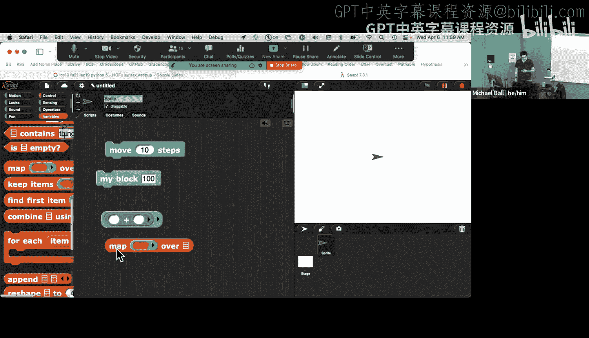

---

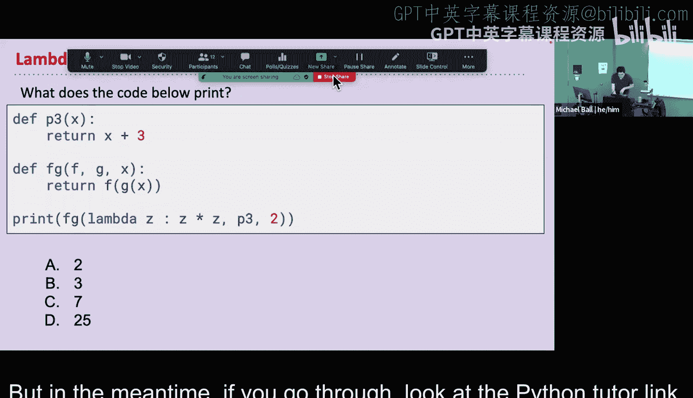


本节课中我们一起学习了Python面向对象编程的收尾概念，包括需要谨慎使用的类属性、不依赖实例的静态方法，以及提倡不可变对象的设计哲学。我们还探索了两种提升代码清晰度和灵活性的语法：默认/关键字参数和简洁的Lambda表达式。掌握这些概念将帮助你更好地构建结构清晰、易于维护的Python程序。