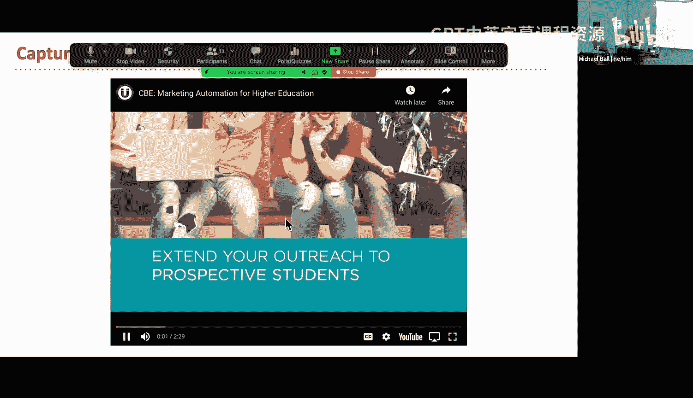
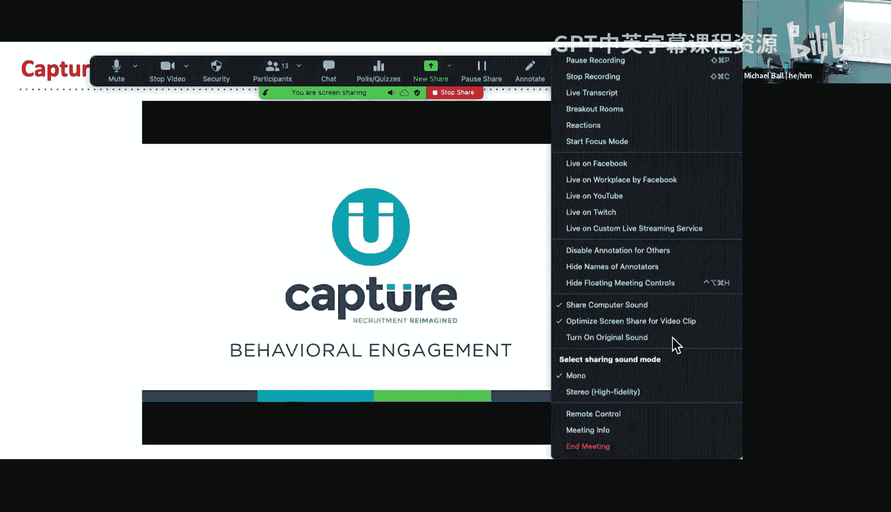
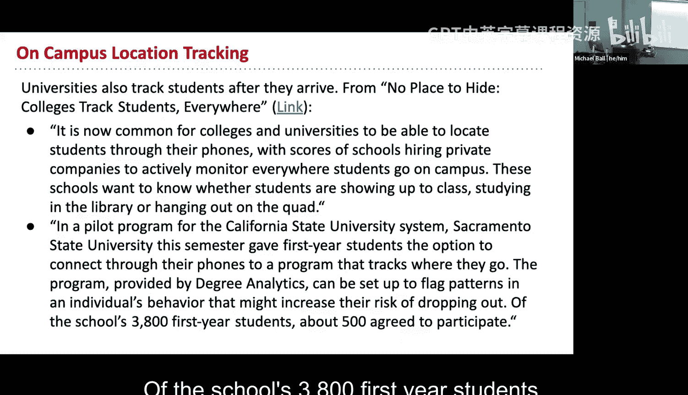
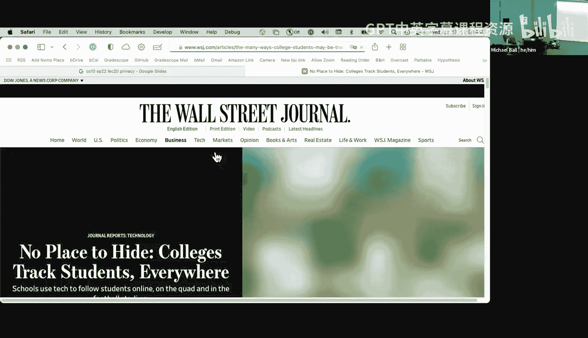
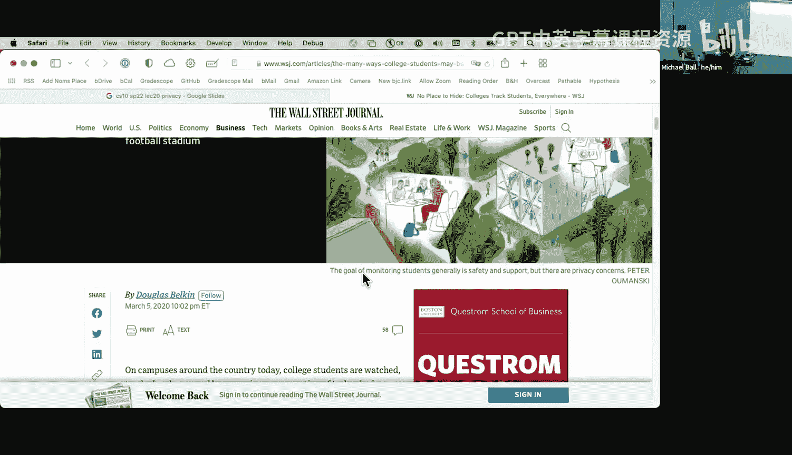
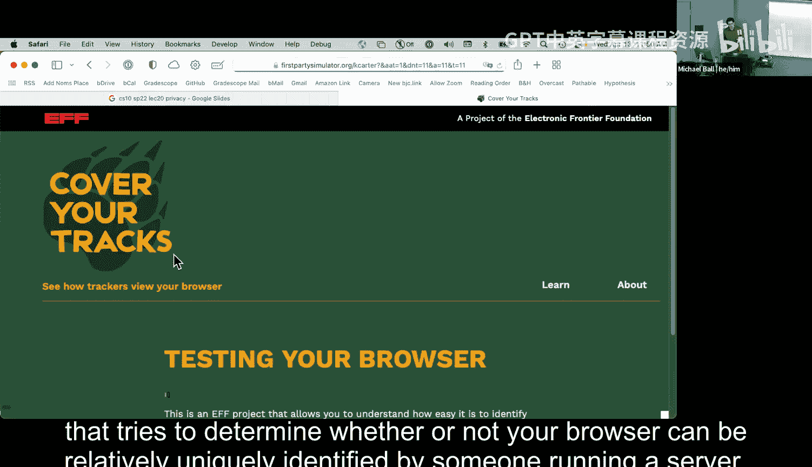
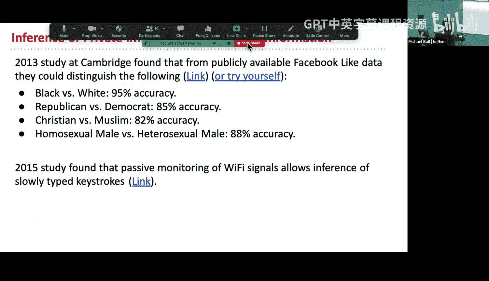

# 20：隐私、计算机与社会

在本节课中，我们将探讨计算机技术，特别是数据追踪技术，如何影响我们的隐私和社会关系。我们将从大学申请追踪、校园监控，到更广泛的网络数据收集与去匿名化，了解这些技术的运作方式及其带来的伦理与社会问题。

---

## 大学申请前的追踪

上一节我们介绍了课程概述，本节中我们来看看大学如何利用技术追踪潜在申请者。

一些大学使用名为“Capture”的工具来追踪访问其网站的用户。该工具通过“Cookie”来识别访客。Cookie是网站存储在您浏览器中的一小段数据，用于记住您的信息。

*   **Cookie的工作原理**：每次用户访问网站时，服务器会发送一个包含唯一标识符的Cookie到用户的浏览器。当用户再次访问时，浏览器会发回这个Cookie，从而让网站识别出这是“回头客”。
*   **信息收集**：通过Cookie，大学可以收集用户的IP地址（与计算机互联网连接相关的唯一代码）、浏览的页面（例如对体育或经济援助页面的兴趣）以及停留时间。
*   **身份关联**：大学可以通过发送营销邮件来关联Cookie数据与真实身份。当学生点击邮件中的链接时，系统就能将邮箱地址与对应的IP地址及浏览历史关联起来。

这种技术有其积极用途，例如改善网站体验，但也引发了关于知情同意和隐私的担忧。

---

## 校园内的追踪

了解了入学前的追踪，我们再来看看学生入学后，校园内可能存在的追踪形式。

大学使用多种技术监控学生在校园内的活动，目的包括提高留存率、保障安全或提升活动参与度。

以下是几种常见的校园追踪方式：

1.  **位置追踪**：一些学校与公司合作，通过学生手机上的应用程序实时监控其在校园内的位置，以分析行为模式（如是否去上课、图书馆），并标记可能有辍学风险的学生。
2.  **紧急情况监控**：有公司提议在紧急情况（如枪击案）下，接入学生手机的摄像头和麦克风，以收集信息并引导学生远离危险区域。
3.  **活动参与度追踪**：例如，使用名为“Fanmaker”的应用和传感器来追踪学生参加体育赛事的情况，包括是否到场以及停留时长。数据可用于提升学校吸引力。
4.  **学习管理系统分析**：如Canvas、bCourses等平台会记录学生是否观看课程视频、参与在线讨论以及提交作业的时间，这些数据对教师可见，用于了解学生学习参与度。

这些技术引发了关于伦理边界的讨论：大学在何种程度上追踪学生是合理的？追踪的目的应该是支持学生，而非单纯监控。

---

## 网络中的广泛追踪

校园追踪只是冰山一角。在更广阔的网络世界中，数据收集无处不在。

许多在线服务会收集用户数据，主要用于广告投放。用户往往在不知情或未完全理解的情况下提供了这些信息。

*   **Google位置历史**：用户可以选择开启此功能，它会记录您去过的地点，形成时间线。这既有用（如回忆旅行），也意味着Google掌握了您多年的行踪。
*   **浏览器指纹识别**：即使禁用Cookie，网站也可以通过收集您浏览器的众多信息（如浏览器类型、版本、安装的插件、屏幕分辨率、字体等）来生成一个几乎唯一的“指纹”，从而在不同网站上追踪您。
*   **隐私检测工具**：像电子前沿基金会（EFF）提供的工具可以检测您的浏览器防止追踪的能力，并评估其独特性。

这些追踪机制有时很有用（如银行检测异地登录以防范欺诈），但同样被广泛用于商业广告等目的。

---

## 数据泄露与去匿名化

数据被收集后，面临的最大风险之一是泄露。即使数据经过匿名化处理，也可能被“去匿名化”。

当包含敏感信息的数据集被泄露时，会造成严重危害。例如，2016年，土耳其执政党数百万女性选民的家庭住址、私人信息等敏感数据被泄露，在政治紧张时期，这对相关人员的人身安全构成了威胁。

更令人惊讶的是，即使数据被移除了直接标识符（如姓名），也可能通过其他信息重新识别出个人。

*   **AOL搜索数据泄露事件（2006年）**：AOL发布了65万用户三个月内的搜索记录，并为每个用户分配了一个随机ID。然而，《纽约时报》记者通过分析搜索内容（如人名、地址、本地信息），并结合公共记录（如电话簿），成功识别出了其中一位用户的真实身份。
*   **去匿名化的其他途径**：
    *   **设备传感器**：从照片中可能反推出拍摄设备的型号。
    *   **写作风格**：个人在论坛或社交媒体上的写作风格具有独特性，可用于身份识别。
    *   **编程风格**：程序员的编码习惯和模式也可能成为识别其身份的线索。

这表明，在数字时代，真正的匿名很难实现，零散的信息碎片经过拼凑，足以描绘出一个人的真实面貌。

---

## 总结

本节课中，我们一起学习了数据追踪技术在多个层面的应用与影响。我们从大学申请和校园生活开始，看到了追踪如何用于招生、学生支持和安全管理。接着，我们探讨了更广泛的网络追踪机制，如Cookie和浏览器指纹。最后，我们审视了数据泄露的严重后果以及“匿名”数据如何被重新识别，揭示了数字隐私的脆弱性。

这些技术如同一把双刃剑，在提供便利和支持的同时，也带来了关于隐私、知情同意和伦理的深刻挑战。理解这些机制是我们在数字世界中保护自己、并负责任地构建技术的第一步。