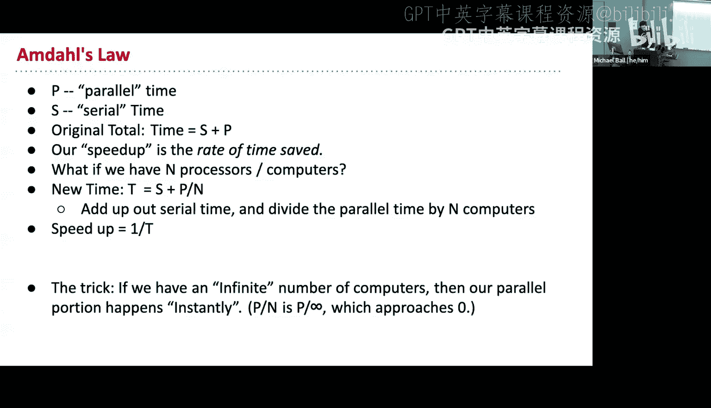
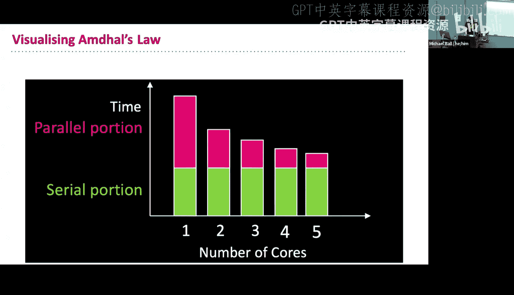
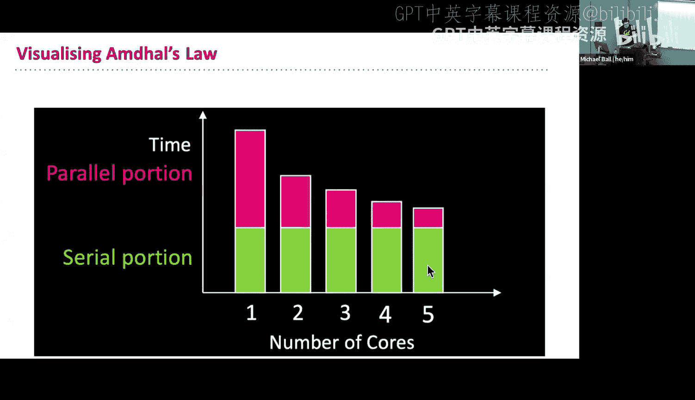
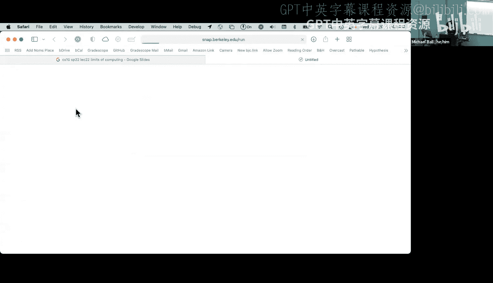
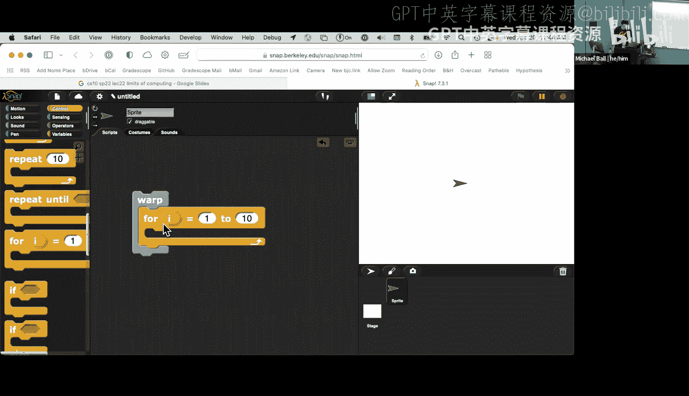
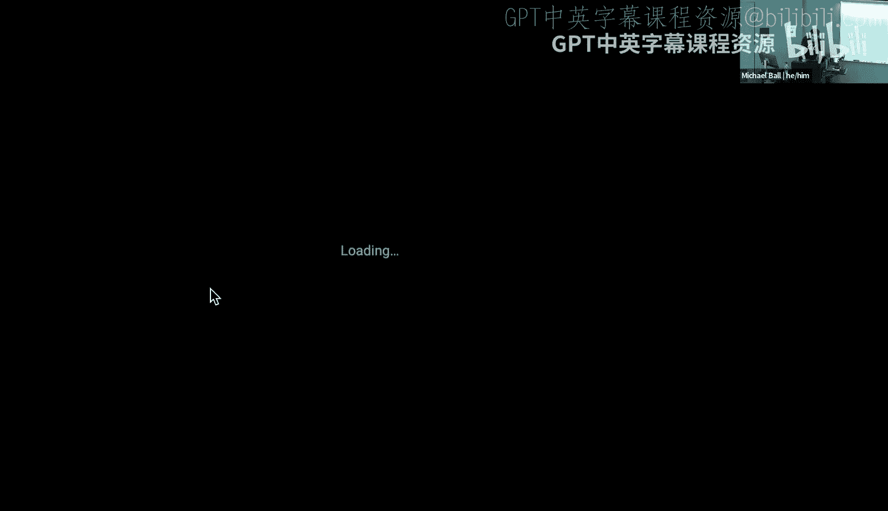
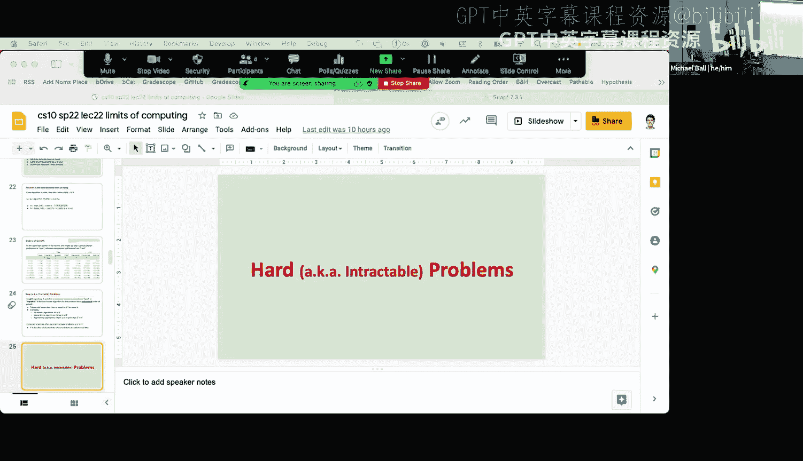

# 22：计算的极限 🚀

在本节课中，我们将学习计算的极限，特别是并行计算的加速潜力以及并发编程中可能遇到的问题。我们还将探讨不同算法的时间复杂度如何从根本上决定一个问题是否能在合理时间内解决。

---

## 并行计算的加速极限 ⚡

上一节我们介绍了并行计算的概念。本节中，我们来看看如何量化并行计算带来的速度提升，以及其理论上的极限。

阿姆达尔定律描述了并行计算中理论上的最大加速比。其核心思想是：一个程序的总运行时间由**串行部分**和**可并行部分**组成。

**公式**：
总时间 `T_total = T_serial + T_parallel`
使用 `N` 个处理器并行化后，新总时间为 `T_new = T_serial + (T_parallel / N)`
加速比 `Speedup = T_total / T_new`

关键在于，无论使用多少处理器，程序的运行时间都无法低于其串行部分的运行时间。这是并行加速的根本限制。

以下是理解该定律的一个例子：
*   假设一个程序总运行时间为10分钟。
*   其中20%（2分钟）是串行部分，80%（8分钟）是可并行部分。
*   如果我们使用4个处理器来处理可并行部分，那么这部分时间将减少为 `8分钟 / 4 = 2分钟`。
*   新的总运行时间为 `2分钟（串行） + 2分钟（并行） = 4分钟`。
*   因此，加速比为 `10分钟 / 4分钟 = 2.5倍`。
*   即使使用无限多的处理器，最短运行时间也只能无限接近2分钟（串行部分），而无法更短。

---

## 并发编程的挑战与竞态条件 ⚠️

当我们允许多个任务（或“精灵”）同时运行时，就需要面对并发编程的挑战。一个核心问题是**竞态条件**：由于任务执行顺序的不确定性，可能导致程序出现非预期的结果。

考虑一个绘制笑脸的程序，它包含三个步骤：
1.  清空画布。
2.  绘制左眼（一个圆）。
3.  绘制右眼（一条线）。
4.  绘制嘴巴。

如果我们将这三个步骤分配给三个不同的精灵同时执行，并且每个精灵都**先执行“清空画布”**，再绘制自己负责的部分，就会产生问题。后执行的精灵可能会清空先前精灵已经绘制好的图案。

通过在每个步骤间插入随机等待时间来模拟真实的并发环境，我们可以分析出所有可能的输出结果。

以下是所有可能出现的最终画面：
*   **理想情况**：三个精灵都清空画布后，再分别绘制，得到完整的笑脸。
*   **只绘制了一个部分**：可能只画了左眼、右眼或嘴巴。
*   **只绘制了两个部分**：可能组合有左眼+右眼、左眼+嘴巴、右眼+嘴巴。

因此，总共存在 **7种** 可能的输出结果。这说明了并发编程中顺序不确定性的影响。

为了解决这类问题，一种常见的方法是使用**同步机制**。例如，让每个精灵在完成“清空”步骤后，设置一个“我已准备就绪”的信号。在开始绘制前，等待所有其他精灵都发出就绪信号后再继续。然而，这又可能引入“死锁”的新问题。

在 Snap! 中，由于其在单线程浏览器环境中运行，使用多精灵并不会真正加速计算。但 `warp` 积木块可以告诉 Snap! 优先执行当前脚本中的代码，减少在精灵间切换的开销，从而在某些情况下加快循环执行速度，代价是屏幕更新会变慢。

---

## 问题的可解性：易解与难解问题 🧮

最后，我们探讨计算的根本极限：哪些问题是计算机可以高效解决的，哪些则不能。这通常由算法的时间复杂度决定。

我们根据输入规模 `n` 增大时，运行时间的增长级别来对问题分类：

**易解问题**：
这类问题的算法时间复杂度是**多项式时间**的，例如：
*   `O(n)` - 线性时间
*   `O(n²)` - 平方时间
*   `O(n³)` - 立方时间
*   `O(n log n)` - 线性对数时间

即使像立方时间这样较慢的增长，当输入从1000增加到10000（10倍）时，所需计算资源或时间最多增加 `10³ = 1000` 倍。这在理论上仍然是可管理的。

**难解问题**：
这类问题的算法时间复杂度是**指数时间**的，例如 `O(2ⁿ)`。
*   当 `n=30` 时，可能需要13天。
*   当 `n=40` 时，可能需要36年。
*   当 `n=50` 时，时间将长达370个世纪！

这种爆炸式的增长意味着，对于中等规模的输入，问题在宇宙寿命内都可能无法解决。除非我们找到更优的算法（例如，斐波那契数列的递归解法是指数级的，但存在线性的迭代解法），或者从根本上改变问题本身。

在计算机科学中，我们将能在多项式时间内解决的问题归为 **P类问题**。而还有一类被称为 **NP** 的问题，其特点是验证一个解的正确性可以在多项式时间内完成，但**寻找**一个解可能非常困难。我们将在下一讲继续探讨这个有趣的话题。

---

本节课中我们一起学习了：
1.  **阿姆达尔定律**：理解了并行计算加速的理论上限取决于程序的串行部分。
2.  **并发挑战**：认识了竞态条件以及同步机制的必要性与复杂性。
3.  **问题复杂度**：了解了如何通过时间复杂度区分“易解”和“难解”问题，并认识到指数级增长问题是实际计算中的根本性障碍。

这些概念揭示了计算能力的边界，无论是在硬件并行层面还是在算法理论层面。