# 23：校友分享会

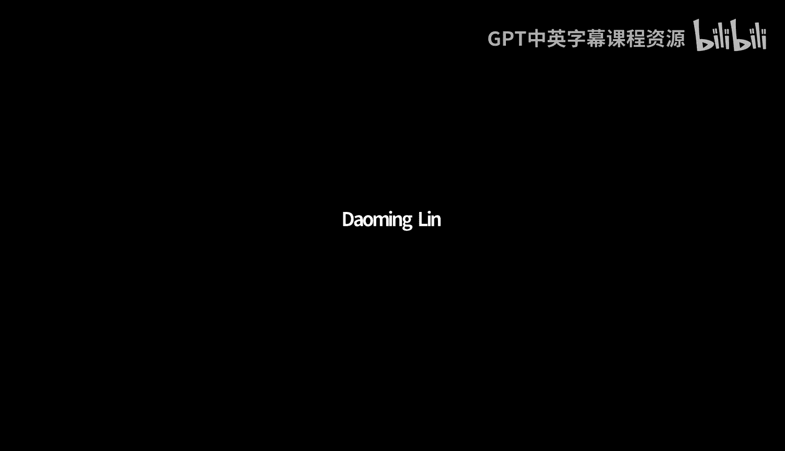

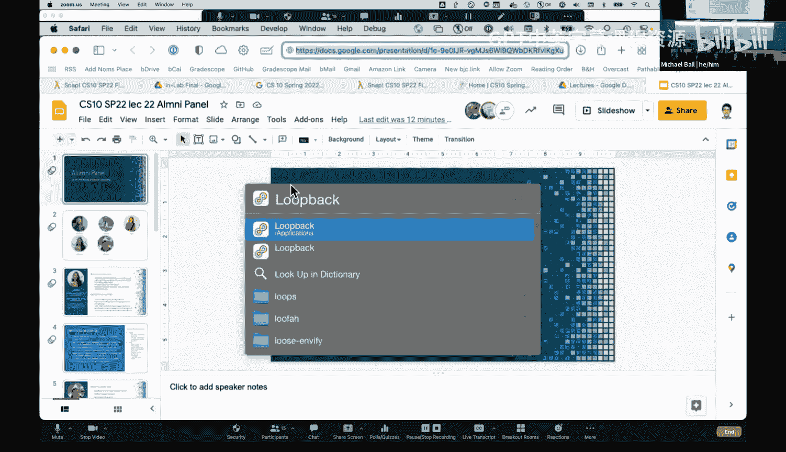

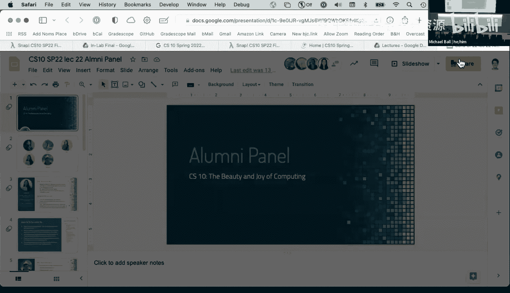

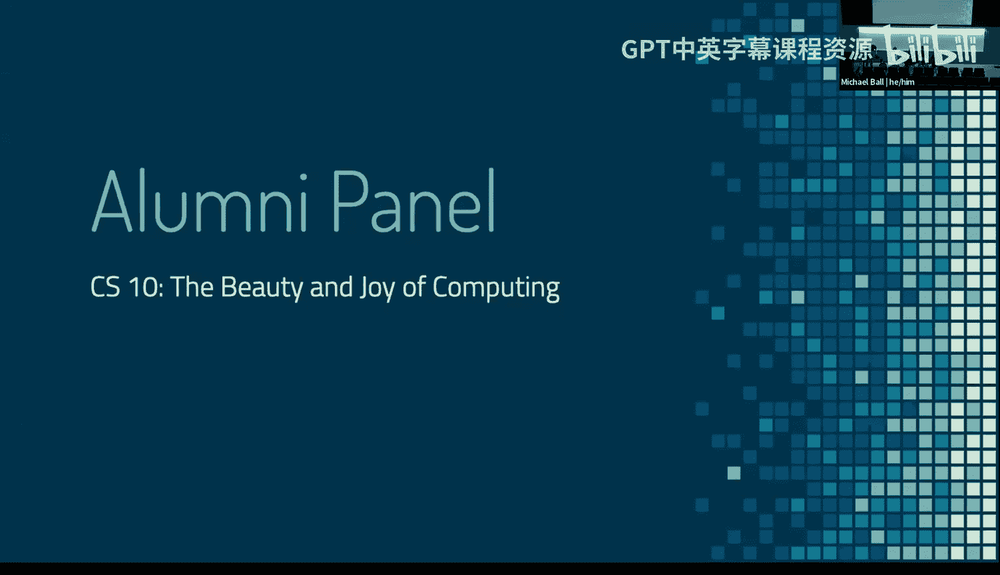

在本节课中，我们将聆听几位曾修读CS10课程的校友分享他们的个人经历、职业发展路径以及给在校学生们的宝贵建议。通过他们的故事，我们可以了解计算机科学知识在不同领域的应用，以及大学期间如何为未来做好准备。

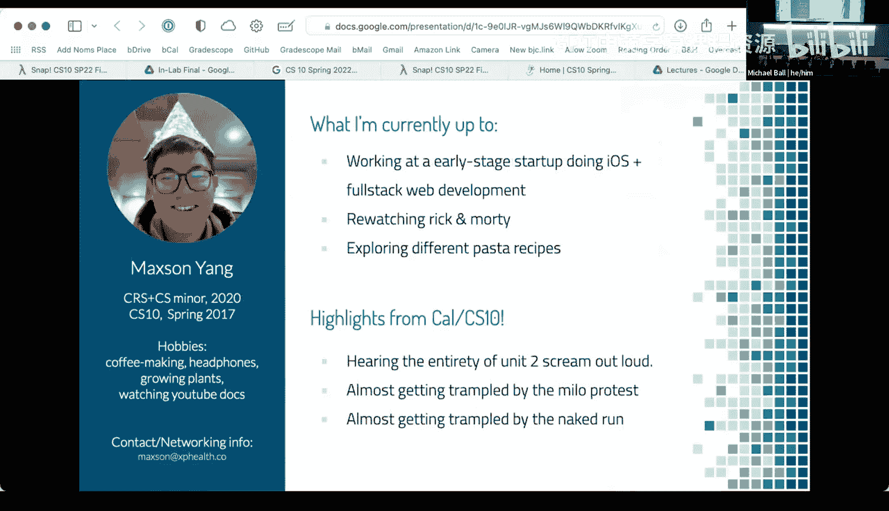

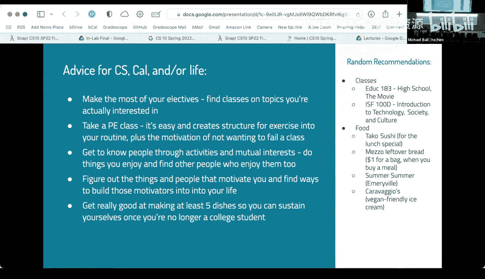

---

## 校友介绍

首先，让我们认识一下今天参与分享的几位校友。

**Samitita**
Samitita于2018年秋季学期修读CS10，并于2021年毕业。她的专业是媒体研究和社会学，辅修教育学。尽管并非STEM专业，她非常享受CS10课程，并因此加入了课程助教团队，从学术实习生一路成长为课程主讲助教。她目前在一家医疗健康传播公司担任市场主管。

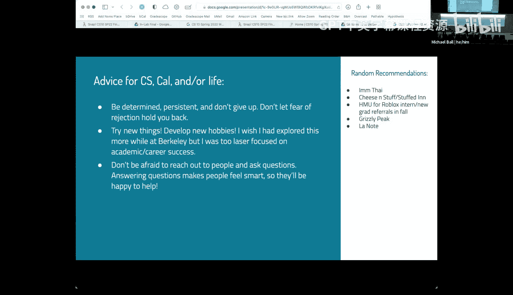

**Max**
Max于2017年春季修读CS10。他并未主修或辅修CS，而是通过跨学科研究构建了自己的专业方向，结合了计算机科学和环境科学。他现在在一家早期初创公司担任软件工程师。

**Patricia**
Patricia于2017年秋季修读CS10，当时她对计算机科学并无兴趣，但课程改变了她。她最终主修了CS，并成为CS10的学术实习生和讨论课助教，贯穿了整个本科阶段。她现在在Roblox公司担任软件工程师，主要负责网站的前端和后端开发。

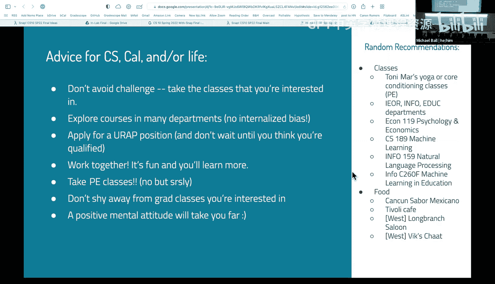

**E**
E于2014年春季修读CS10，并因此转专业到CS。她曾在CS10担任了四个学期的助教。目前她在YouTube担任软件工程师，负责首页推荐算法。

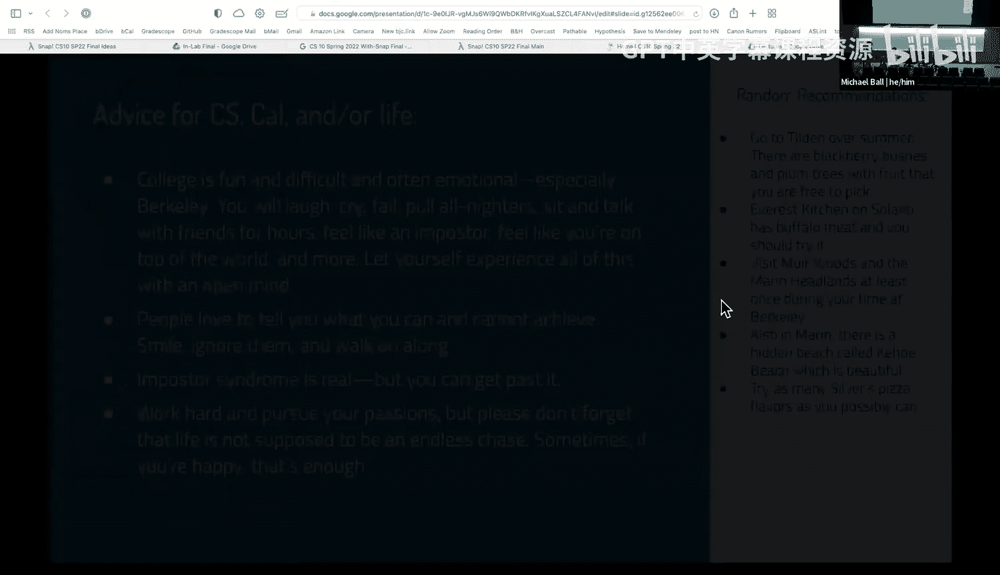

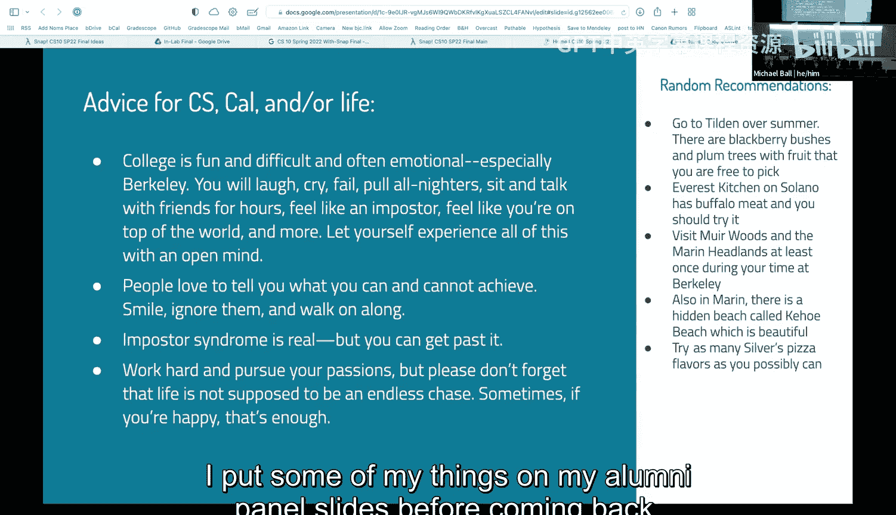

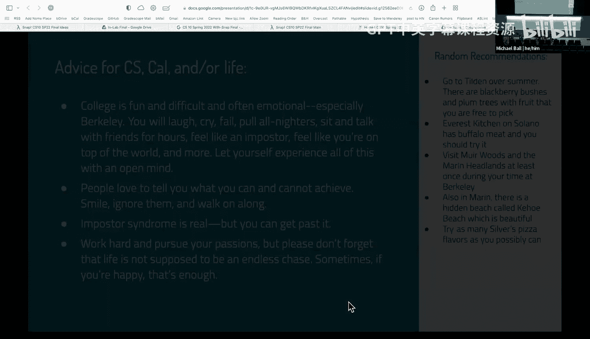

---

## 主要建议与心得分享

上一节我们认识了各位校友，本节中我们来看看他们结合自身经历总结出的建议。

**Samitita的建议：**
*   **充分利用选修课**：在伯克利这样资源丰富的地方，广泛涉猎不同领域的课程可以极大地拓宽知识面。即使不是CS专业，相关的知识在未来工作中也非常有用。
*   **通过兴趣结交朋友**：在大学里，通过课程和活动找到志同道合的人建立友谊非常重要。这不仅能丰富大学生活，对未来的社交也很有帮助。
*   **掌握基本生活技能**：毕业后需要独立生活，学会烹饪几道拿手菜是一项非常实用的技能。

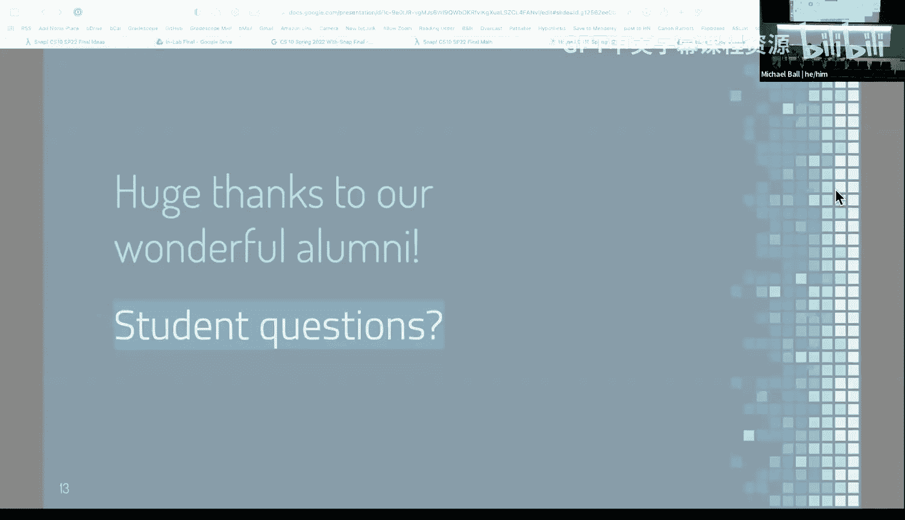

**Max的建议：**
*   **探索校园周边**：在伯克利的学习不仅发生在课堂内。探索本地商业、安全地结识新朋友、了解周围环境，也是认识自我和世界的重要部分。

**Patricia的建议：**
*   **保持决心，不畏拒绝**：不要因为害怕被拒绝而停止尝试。
*   **勇于尝试新事物，培养爱好**：不要只专注于学业。利用大学时光探索新爱好，这能帮助你结交朋友，获得更丰富的体验。
*   **主动联系，大胆提问**：向他人请教问题并非负担，大多数人乐于分享知识。这也能让你学到更多。

**E的建议：**
*   **参加体育课**：这是以最低成本尝试新运动的绝佳机会，对身心健康都大有裨益。
*   **探索不同院系的课程**：不要被内心的偏见限制。对你感兴趣的领域，都应该去尝试。
*   **不要等到“完全合格”才申请**：对于研究项目或实习机会，即使觉得自己不完全符合要求，也不妨先申请。

---

## 关于成为课程助教（AI/TA）

许多校友都曾担任CS10的学术实习生或助教。以下是他们对此的分享和看法。

**为何选择成为助教？**
大家的初衷各不相同，包括需要一份兼职工作、希望回馈CS10课程、受到之前助教的鼓舞、获得课程学分，或是同伴的影响。但共同点是，在参与教学的过程中，他们都感受到了帮助他人、见证学生“顿悟”时刻的巨大满足感，并且非常享受与课程团队成员共事的氛围。

**需要完全理解所有内容吗？**
完全不需要。教学本身就是一个持续学习的过程。即使教授也会在每学期教授时学习新东西。关键在于愿意学习、乐于帮助学生，并能够清晰地展示自己的思考过程。遇到不懂的问题时，完全可以坦诚地说“我不知道”，然后与学生一起寻找答案，或向其他助教求助。这种解决问题的过程往往比直接给出答案更有教学价值。

---

## 职业发展相关问答

校友们还回答了同学们关于职业发展的几个普遍问题。

**计算机科学知识在非技术领域有用吗？**
非常有用。当今世界充满数据，即使只具备CS10或61A级别的编程和计算思维基础，也能帮助你更高效地处理数据、理解技术逻辑，并在与技术团队沟通时更有共同语言。技术正渗透到各行各业，具备一定的技术素养能让你更好地理解所从事的领域。

**如何找到第一份工作/实习？**
*   **广泛投递**：这是一个数字游戏，需要海投简历。
*   **利用校园资源**：伯克利的招聘会、校友网络、社团活动都是宝贵的机会。
*   **技能迁移**：伯克利教育赋予的核心能力是快速学习。工作中需要的技能可能与作业不同，快速学习的能力至关重要。
*   **保持信心，持续构建**：求职过程可能漫长且令人沮丧，但请坚持下去。即使没有正式实习，通过自由职业、参与教授的项目或自己构建作品集，也能积累宝贵经验。
*   **拓宽视野**：并非只有传统的科技公司才有机会。每个行业都需要技术人才，也有很多科技公司的非技术岗位（如市场、产品管理）需要复合背景的人才。

**地理位置（湾区）对学习CS有优势吗？**
地理位置确实带来一些便利，例如更多公司参与校园招聘、浓厚的科技文化氛围以及丰富的线下社交机会。伯克利作为研究型大学，其学术环境和 peer pressure 也是巨大的推动力。然而，在互联网时代，知识本身是无地域限制的。决定性的因素还是个人的主动性和努力。

**哪些课外活动对求职有显著帮助？**
*   **加入课程助教团队**：这能锻炼公开演讲、技术沟通和解决问题的能力，这些软技能深受雇主青睐。
*   **参与社团并承担技术角色**：许多社团都需要人维护网站或技术设施，这是绝佳的实践机会。
*   **广泛社交**：你永远不知道会遇到谁，一次偶然的交谈可能会带来意想不到的机会。
*   **坚持练习**：对于软件工程师岗位，坚持在LeetCode等平台练习编码挑战对通过技术面试很有帮助。
*   **保持身心健康**：坚持锻炼等有益身心的活动，能提升整体状态，间接影响求职表现。

---

## 总结

本节课中，我们一起聆听了四位CS10校友的真诚分享。他们的经历告诉我们，计算机科学的学习之旅可以通向多种多样的职业道路，无论是技术核心岗位，还是技术与人文交叉的领域。大学期间，除了掌握专业知识，广泛探索兴趣、培养软技能、积极构建人际关系网络同样重要。不要畏惧尝试和可能的失败，主动抓住身边的机会，无论是成为课程助教、参加社团还是寻找实习。希望他们的经验能为你未来的选择提供一些启发和勇气。