# 25：期中复习要点解析 (2022年3月14日)


在本节课中，我们将一起回顾期中考试的核心知识点。我们将重点讨论数字转换、真值表、编程范式、可变性、递归以及算法复杂度等主题。课程内容将基于往届考试和讨论课中的常见问题，旨在帮助你巩固理解，为考试做好准备。

## 关于期中考试的一般信息

首先，我们来了解一下期中考试的整体情况。本次期中考试的结构与之前的测验类似，但题目数量更多，共有13道题。前几道题是阅读类题目，之后会有一些非常简短的填空题，例如填写数字或脚本可能返回的字母。你不需要从头编写代码，但可能需要通过选择正确的代码块来完成脚本。考试的重点会更侧重于近期学习的主题。

你可以访问 `CS10.org/resources` 网站，在“exams”文件夹中找到往届的考试题目进行练习。虽然旧考题可能要求编写更多代码，但新考题在题型结构上（如阅读代码、追踪函数返回值、选择填空等）是相似的。

在考试中，如果遇到复杂问题，请充分利用草稿纸进行演算。研究表明，人脑同时处理的信息量有限，将思路写在纸上可以有效避免遗忘，让解题过程更清晰。


## 数字表示与转换

上一节我们介绍了考试的整体情况，本节中我们来看看数字表示与转换。这部分的核心是理解不同进制（如二进制、八进制、十六进制）如何转换为十进制。

转换的关键在于计算每一位的“位权”。对于一个以 `b` 为基数的数字，从右向左，第 `n` 位（从0开始计数）的值等于该位数字乘以 `b^n`。

**公式**：`(数字)_b = d_n * b^n + d_{n-1} * b^{n-1} + ... + d_0 * b^0`

例如，八进制数 `34_8` 转换为十进制的过程是：
`4 * 8^0 + 3 * 8^1 = 4 + 24 = 28`

考试中，我们主要关注从其他进制到十进制的转换，计算过程相对直接。

## 真值表与布尔逻辑

理解了数字转换后，我们进入逻辑推理部分：真值表与布尔逻辑。这是需要重点练习的内容。

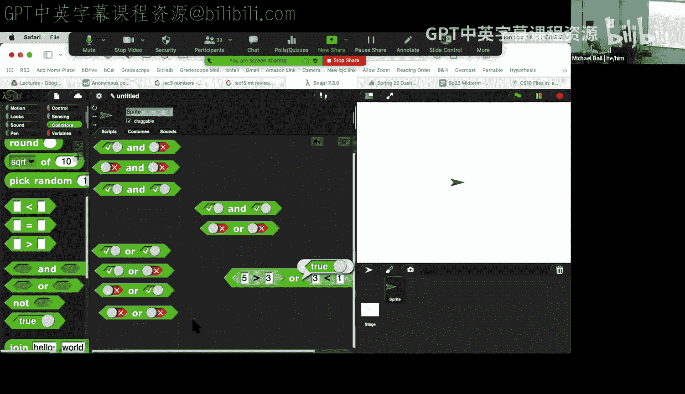

真值表用于列出布尔表达式在所有可能输入组合下的输出结果。在 Snap! 中，我们主要使用 `与(and)` 和 `或(or)` 这两个运算符。

以下是 `与(and)` 和 `或(or)` 的真值表：

**与(and) 运算**：仅当所有输入都为 `true` 时，结果才为 `true`。
*   `true and true` => `true`
*   `true and false` => `false`
*   `false and true` => `false`
*   `false and false` => `false`

**或(or) 运算**：只要有一个输入为 `true`，结果就为 `true`。
*   `true or true` => `true`
*   `true or false` => `true`
*   `false or true` => `true`
*   `false or false` => `false`

简单记忆：对于 `and`，只有全真才为真；对于 `or`，只有全假才为假。

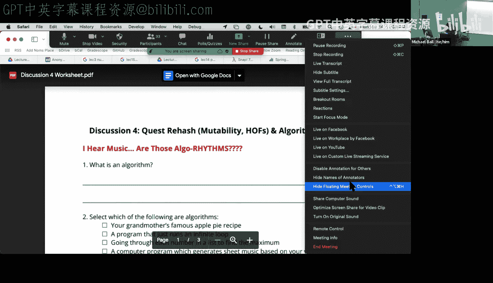

考试中可能会遇到更复杂的表达式，例如 `(5 > 3) or (3 < 1)`。解题方法是先独立计算每个子表达式（`5 > 3` 是 `true`，`3 < 1` 是 `false`），然后根据运算符规则（`true or false` 得 `true`）得出最终结果。也可能需要你反向推理，填入合适的值使整个表达式为真或假。

## 编程范式

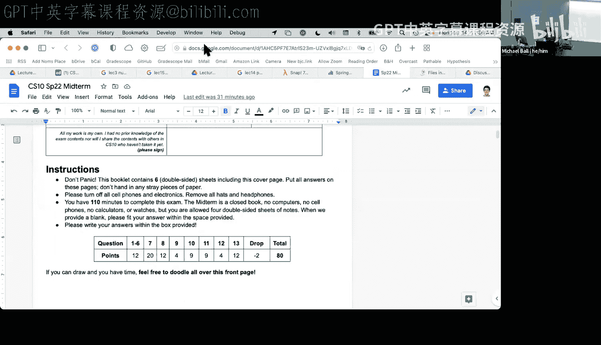

在理清了布尔逻辑之后，我们转向一个更宏观的概念：编程范式。这是上周三课程的重点。

编程范式是编写代码的不同风格或方法论。在 CS10 中，我们介绍了五种主要范式：

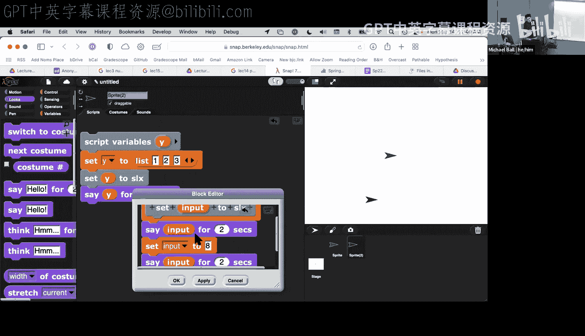

1.  **函数式编程**：核心是使用函数（尤其是高阶函数）来操作数据。例如 `map`、`keep`、`combine` 等函数。
2.  **基于数组的编程**：将数组作为基本数据类型进行操作，支持元素级的数学运算（如两个列表直接相加）。
3.  **命令式编程**：通过一系列明确的步骤（语句）来改变程序状态，这是最直观的编程风格。
4.  **面向对象编程**：围绕“对象”组织代码，对象包含数据（属性）和行为（方法）。例如在动画中操纵角色精灵。
5.  **声明式编程**：描述“做什么”而非“怎么做”，设定规则让计算机自行寻找解决方案。例如为地图省份动态着色。

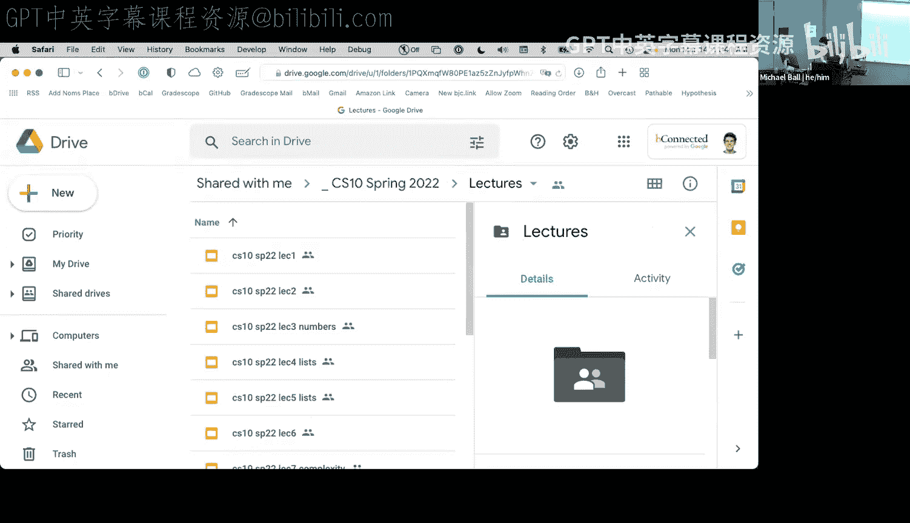

需要理解的是，没有一种范式绝对优于另一种。不同范式各有优劣，适用于不同的任务。在 CS10 中，你主要需要能够识别一段代码所体现的编程风格，并理解其基本思想。

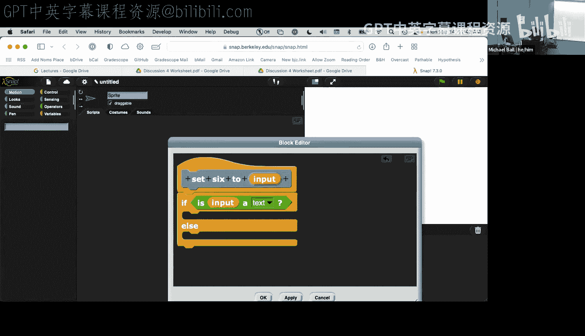

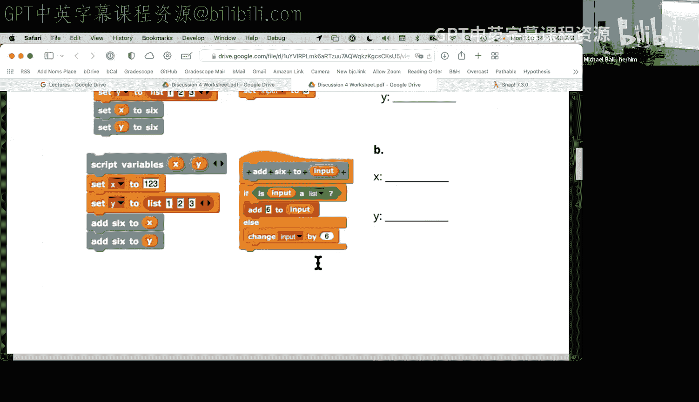

## 可变性与作用域

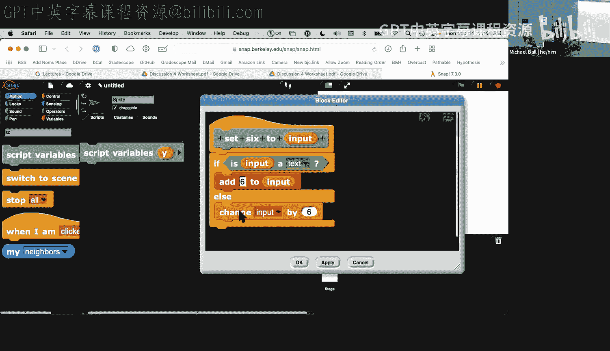

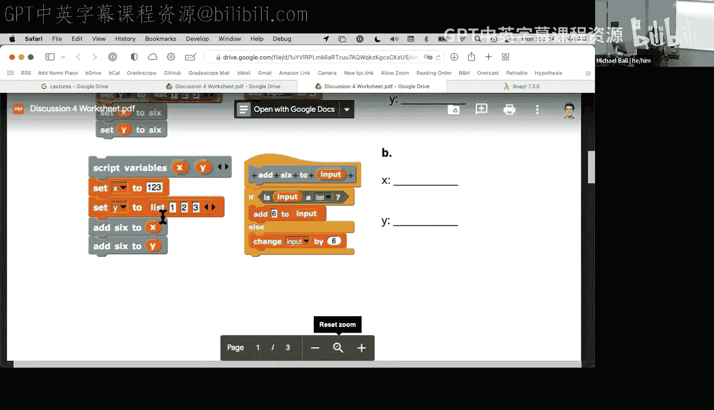

讨论完编程范式，我们来看一个具体且容易出错的概念：可变性与作用域。我们将通过一个讨论课的例子来深入理解。

考虑以下两个脚本，问题是脚本执行后变量 `x` 和 `y` 的值是什么？

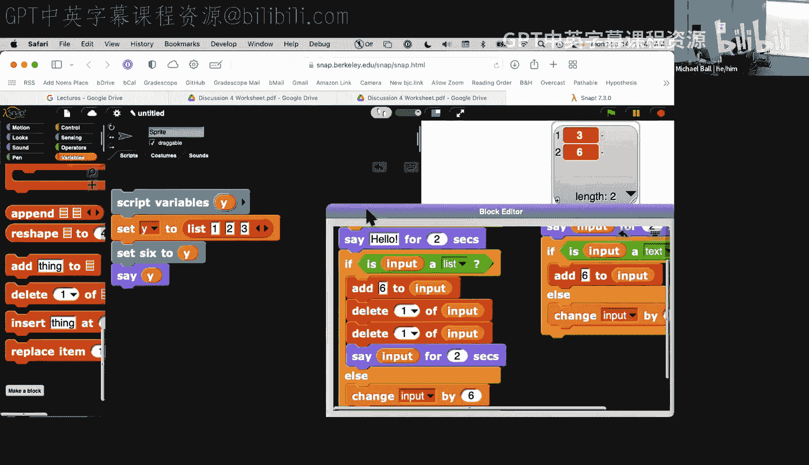

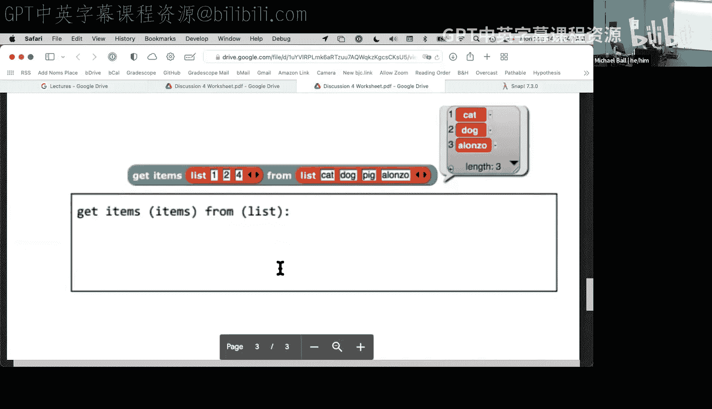

**脚本 A**：
```
设置 x 为 123
设置 y 为 列表 [1, 2, 3]
设置输入为 8
```

**脚本 B**：
```
设置 x 为 123
设置 y 为 列表 [1, 2, 3]
添加 6 到 y
```

在 **脚本 A** 中，我们将数字 `123` 传递给一个自定义块，该块内部执行 `设置输入为 8`。由于数字是不可变的基本数据类型，传递的是值的副本。块内部对 `输入` 的修改不会影响外部的 `x`。因此，`x` 仍然是 `123`，`y` 仍然是 `[1, 2, 3]`。

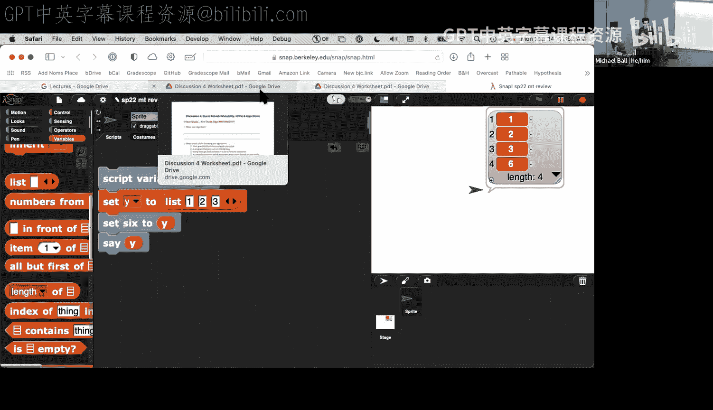

在 **脚本 B** 中，我们将列表 `[1, 2, 3]` 传递给一个自定义块，该块执行 `添加 6 到 y`。列表是可变数据类型。像 `添加`、`删除`、`插入`、`替换` 这样的命令会直接修改传入的列表本身。因此，执行后 `y` 变为 `[1, 2, 3, 6]`，而 `x` 不变。

**关键点**：当在自定义块内部使用 `设置...为...` 时，会创建一个新的局部绑定，切断与原始参数的链接。但使用修改命令（如 `添加`）则会直接操作原始数据。

一个更复杂的例子是：在块内部先修改列表，再用 `设置` 将其指向一个新列表。此时，`设置` 之前的修改会生效，但之后的操作就与原始变量无关了。理解这种作用域和可变性的交互是掌握本主题的关键。

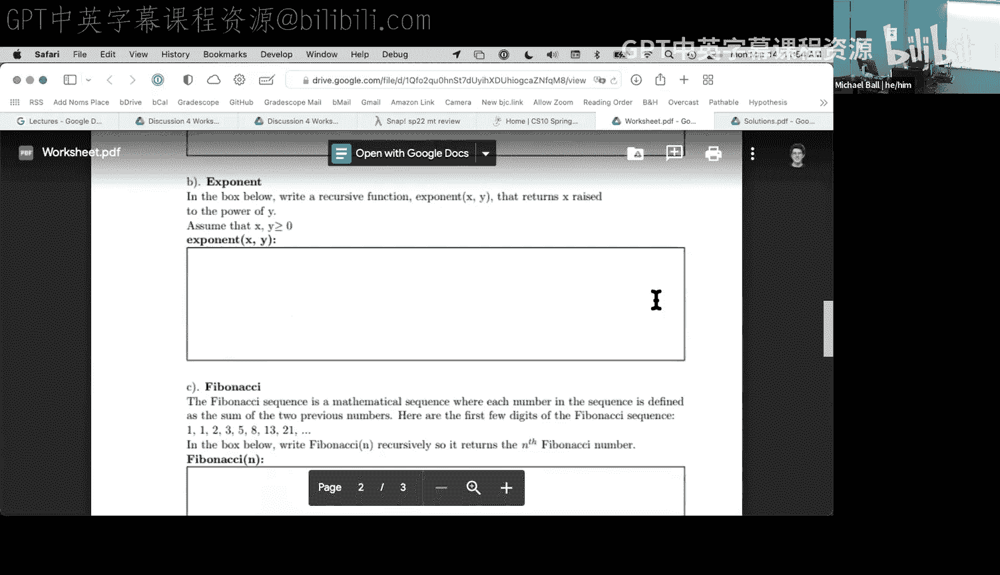

## 递归

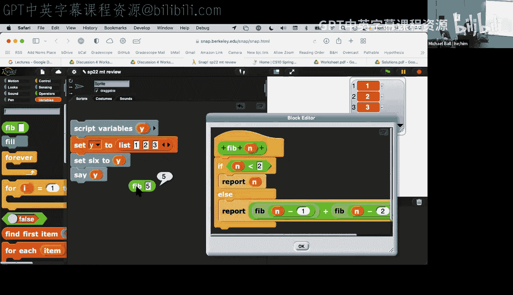

接下来，我们探讨一个重要的编程技巧：递归。递归函数通过调用自身来解决问题。

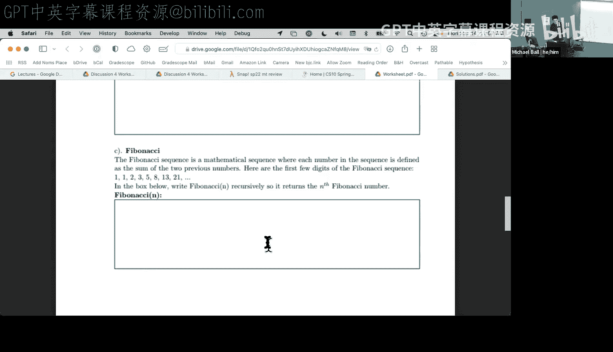

我们以经典的斐波那契数列为例。斐波那契数列的定义是：`fib(0) = 0`, `fib(1) = 1`, 对于 `n > 1`, `fib(n) = fib(n-1) + fib(n-2)`。

在 Snap! 中，对应的递归函数可能这样实现：
```
如果 n < 2
  报告 n
否则
  报告 (fib(n-1) + fib(n-2))
```

**分析递归的关键在于追踪调用过程**。以计算 `fib(5)` 为例：
1.  `fib(5)` 调用 `fib(4)` 和 `fib(3)`。
2.  `fib(4)` 调用 `fib(3)` 和 `fib(2)`。
3.  以此类推，直到达到基础情况 `fib(1)=1` 和 `fib(0)=0`。
4.  然后逐层返回结果并相加：`fib(2) = 1+0 = 1`, `fib(3) = 1+1 = 2`, `fib(4) = 2+1 = 3`, 最终 `fib(5) = 3+2 = 5`。

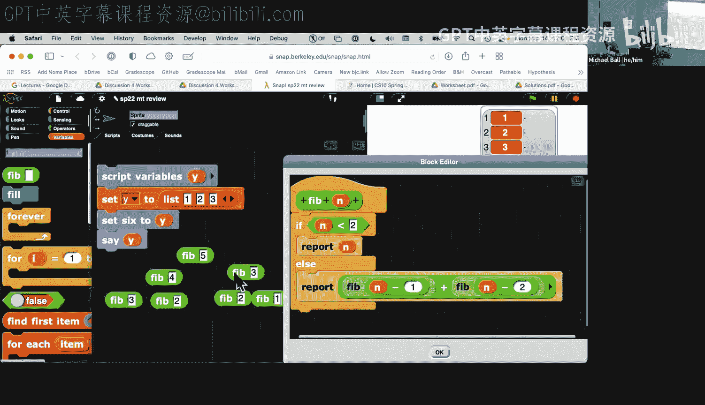

解决递归问题时，建议在草稿纸上画出调用树，并记录每次调用的参数和返回值。递归虽然特殊，但每次函数调用在机制上与普通调用无异。

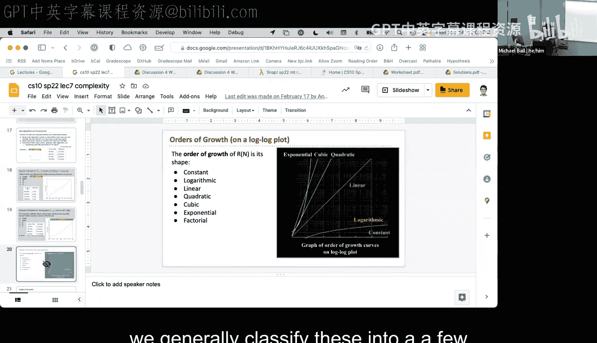

## 算法复杂度

最后，我们来复习算法复杂度分析。我们关注的是随着输入规模 `n` 的增长，算法所需步骤数（运行时间）的增长趋势，而非具体的执行时间。

在 CS10 中，我们主要接触以下几种复杂度类型：

*   **常数时间 O(1)**：运行时间不随输入大小改变。例如，访问数组的第一个元素。
*   **对数时间 O(log n)**：输入规模翻倍，运行时间只增加一步。例如，二分查找算法。
*   **线性时间 O(n)**：运行时间与输入大小成正比。例如，遍历列表的 `for each` 循环或 `map` 操作。
*   **平方时间 O(n²)**：运行时间与输入大小的平方成正比。通常出现在嵌套循环中，例如处理一个 `n x n` 的网格。
*   **指数时间 O(2^n)**：输入每增加一，运行时间大约翻倍。例如，未优化的递归斐波那契算法，或者某些分形绘制（如树形分形，分支数随层级指数增长）。

理解这些复杂度类别的含义，并能根据代码结构（如循环、递归）判断其大致复杂度，是这部分的学习目标。

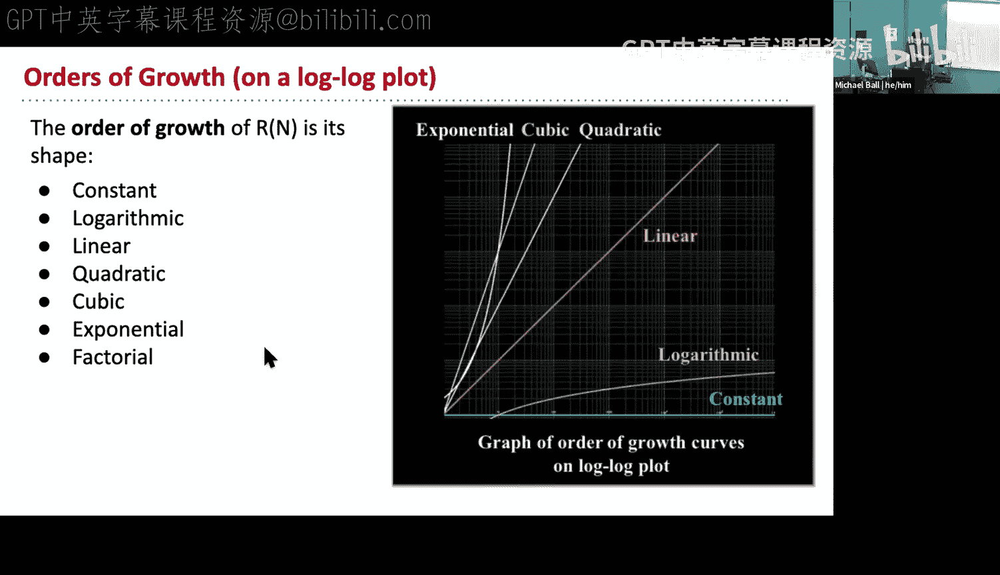

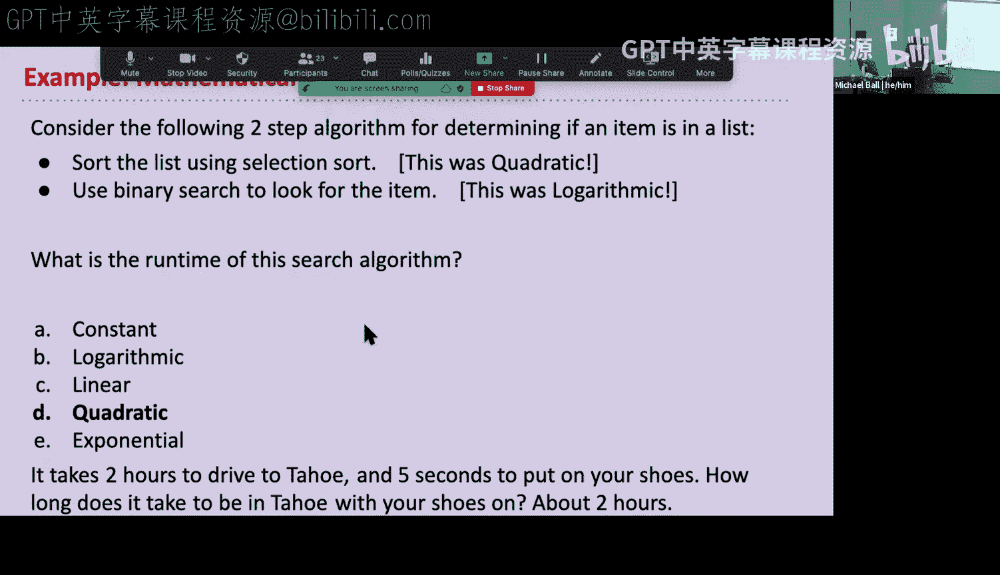

## 总结

本节课中我们一起学习了 CS10 期中考试的核心复习要点。我们回顾了数字转换的原理、布尔逻辑与真值表的用法、五种编程范式的特点、可变数据类型与作用域的注意事项、递归函数的分析与追踪方法，以及算法复杂度的基本分类。

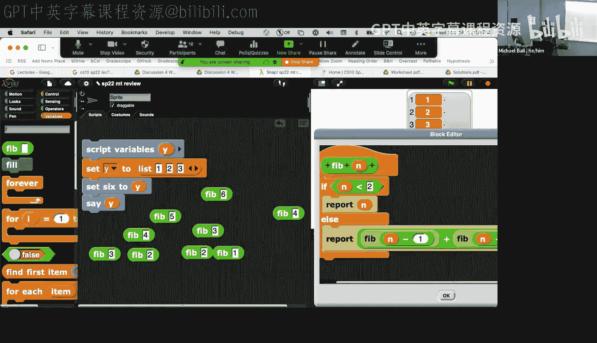

希望本次复习课能帮助你梳理知识，建立信心。请务必利用课程资源中的往届试题进行练习，并在遇到问题时及时在 Ed 讨论区提问。祝大家在期中考试中取得好成绩！